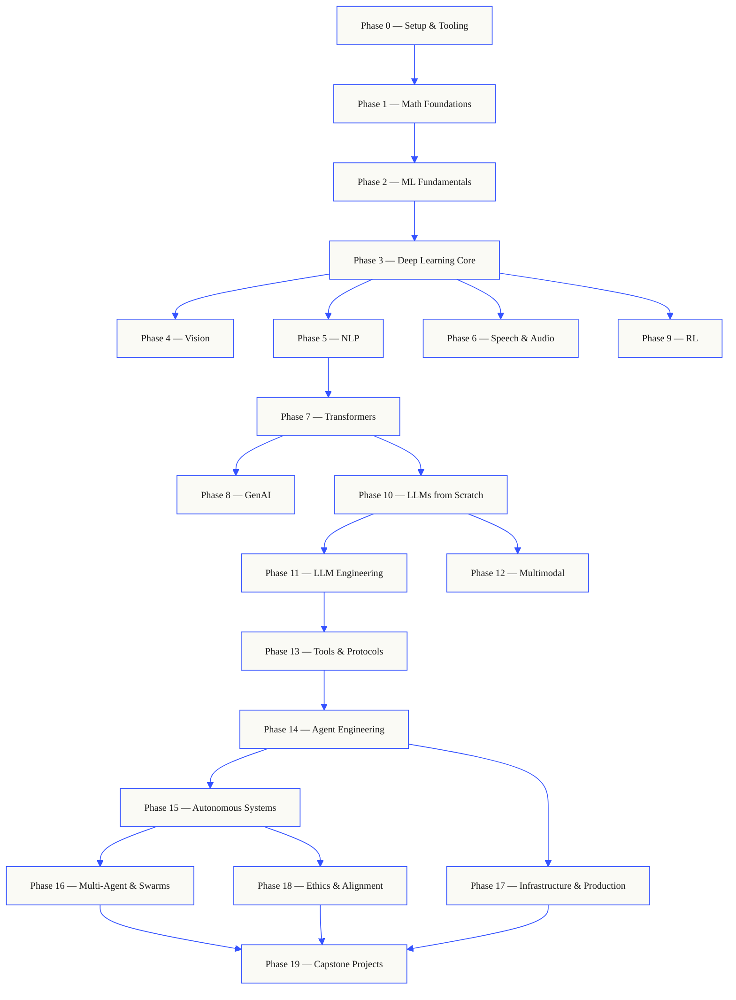
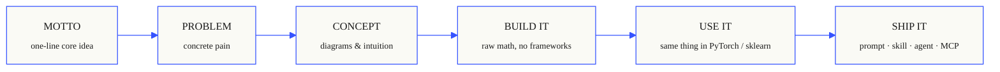

<p align="center">
  
</p>

<p align="center">
  <a href="LICENSE"></a>
  <a href="ROADMAP.md"></a>
  <a href="#contents"></a>
  <a href="https://github.com/rohitg00/ai-engineering-from-scratch/stargazers"></a>
  <a href="https://aiengineeringfromscratch.com"></a>
</p>

## From the creator of [Agent Memory - #1 Persistent memory ⭐](https://github.com/rohitg00/agentmemory) <a href="https://github.com/rohitg00/agentmemory/stargazers"></a> which naturally works with any agents or chat assistants.

```
░░░▒▒▒░░░▒▒▒░░░▒▒▒░░░▒▒▒░░░▒▒▒░░░▒▒▒░░░▒▒▒░░░▒▒▒░░░▒▒▒░░░▒▒▒░░░▒▒▒░░░▒▒▒░░░▒▒▒░░░▒▒▒░░░▒▒▒
```

> **84% of students already use AI tools. Only 18% feel prepared to use them
> professionally.** This curriculum closes that gap.
>
> 503 lessons. 20 phases. ~320 hours. Python, TypeScript, Rust, Julia. Every lesson ships
> a reusable artifact: a prompt, a skill, an agent, an MCP server. Free, open source, MIT.
>
> You don't just learn AI. You build it. End-to-end. By hand.

<!-- STATS:START (generated from site/stats.json by build.js — do not edit by hand) -->
<p align="center"><sub><b>150,639</b> readers &nbsp;·&nbsp; <b>241,669</b> page views in the last 30 days &nbsp;·&nbsp; as of 2026-06-07</sub></p>
<!-- STATS:END -->

## How this works

Most AI material teaches in scattered pieces. A paper here, a fine-tuning post there, a
flashy agent demo somewhere else. The pieces rarely line up. You ship a chatbot but can't
explain its loss curve. You hook a function to an agent but can't say what attention does
inside the model that's calling it.

This curriculum is the spine. 20 phases, 503 lessons, four languages: Python, TypeScript,
Rust, Julia. Linear algebra at one end, autonomous swarms at the other. Every algorithm
gets built from raw math first. Backprop. Tokenizer. Attention. Agent loop. By the time
PyTorch shows up, you already know what it's doing under the hood.

Each lesson runs the same loop: read the problem, derive the math, write the code, run
the test, keep the artifact. No five-minute videos, no copy-paste deploys, no hand-holding.
Free, open source, and built to run on your own laptop.

```
░░░▒▒▒░░░▒▒▒░░░▒▒▒░░░▒▒▒░░░▒▒▒░░░▒▒▒░░░▒▒▒░░░▒▒▒░░░▒▒▒░░░▒▒▒░░░▒▒▒░░░▒▒▒░░░▒▒▒░░░▒▒▒░░░▒▒▒
```

## The shape of the curriculum

Twenty phases stack on top of each other. Math is the floor. Agents and production are the roof.
Skip ahead if you already know the lower layers, but don't skip and then wonder why something at
the top is breaking.



```
░░░▒▒▒░░░▒▒▒░░░▒▒▒░░░▒▒▒░░░▒▒▒░░░▒▒▒░░░▒▒▒░░░▒▒▒░░░▒▒▒░░░▒▒▒░░░▒▒▒░░░▒▒▒░░░▒▒▒░░░▒▒▒░░░▒▒▒
```

## The shape of a lesson

Each lesson lives in its own folder, with the same structure across the entire curriculum:

```
phases/<NN>-<phase-name>/<NN>-<lesson-name>/
├── code/      runnable implementations (Python, TypeScript, Rust, Julia)
├── docs/
│   └── en.md  lesson narrative
└── outputs/   prompts, skills, agents, or MCP servers this lesson produces
```

Every lesson follows six beats. The *Build It / Use It* split is the spine — you implement the
algorithm from scratch first, then run the same thing through the production library. You
understand what the framework is doing because you wrote the smaller version yourself.



## Getting started

Three ways in. Pick one.

**Option A — read.** Open any completed lesson on
[aiengineeringfromscratch.com](https://aiengineeringfromscratch.com) or expand a phase under
[Contents](#contents). No setup, no cloning.

**Option B — clone and run.**

```bash
git clone https://github.com/rohitg00/ai-engineering-from-scratch.git
cd ai-engineering-from-scratch
python phases/01-math-foundations-数学基础/01-linear-algebra-intuition-线性代数直觉/code/vectors.py
```

**Option C — find your level *(recommended)*.** Skip ahead intelligently. Inside Claude, Cursor, Codex, OpenClaw, Hermes, or any agent with the curriculum skills installed:

```bash
/find-your-level
```

Ten questions. Maps your knowledge to a starting phase, builds a personalized path with hour
estimates. After each phase:

```bash
/check-understanding 3        # quiz yourself on phase 3
ls phases/03-deep-learning-core-深度学习核心/05-loss-functions-损失functions/outputs/
# ├── prompt-loss-function-selector.md
# └── prompt-loss-debugger.md
```

### Prerequisites

- You can write code (any language; Python helps).
- You want to understand how AI **actually works**, not just call APIs.

### Built-in agent skills (Claude, Cursor, Codex, OpenClaw, Hermes)

| Skill | What it does |
|---|---|
| [`/find-your-level`](.claude/skills/find-your-level/SKILL.md) | Ten-question placement quiz. Maps your knowledge to a starting phase and produces a personalized path with hour estimates. |
| [`/check-understanding <phase>`](.claude/skills/check-understanding/SKILL.md) | Per-phase quiz, eight questions, with feedback and specific lessons to review. |

```
░░░▒▒▒░░░▒▒▒░░░▒▒▒░░░▒▒▒░░░▒▒▒░░░▒▒▒░░░▒▒▒░░░▒▒▒░░░▒▒▒░░░▒▒▒░░░▒▒▒░░░▒▒▒░░░▒▒▒░░░▒▒▒░░░▒▒▒
```

## Every lesson ships something

Other curricula end with *"congratulations, you learned X."* Each lesson here ends with a
**reusable tool** you can install or paste into your daily workflow.

<table>
<tr>
<th align="left" width="25%"><br/><sub>FIG_001 · A</sub><br/><b>PROMPTS</b></th>
<th align="left" width="25%"><br/><sub>FIG_001 · B</sub><br/><b>SKILLS</b></th>
<th align="left" width="25%"><br/><sub>FIG_001 · C</sub><br/><b>AGENTS</b></th>
<th align="left" width="25%"><br/><sub>FIG_001 · D</sub><br/><b>MCP SERVERS</b></th>
</tr>
<tr>
<td valign="top">Paste into any AI assistant for expert-level help on a narrow task.</td>
<td valign="top">Drop into Claude, Cursor, Codex, OpenClaw, Hermes, or any agent that reads <code>SKILL.md</code>.</td>
<td valign="top">Deploy as autonomous workers — you wrote the loop yourself in Phase 14.</td>
<td valign="top">Plug into any MCP-compatible client. Built end-to-end in Phase 13.</td>
</tr>
</table>

> Install the lot with `python3 scripts/install_skills.py`. Real tools, not homework.
> By the end of the curriculum, you have a portfolio of 503 artifacts you actually
> understand because you built them.

### FIG_002 · A worked sample

Phase 14, lesson 1: the agent loop. ~120 lines of pure Python, no dependencies.

<table>
<tr>
<td valign="top" width="50%">

**`code/agent_loop.py`** &nbsp; <sub><i>build it</i></sub>

```python
def run(query, tools):
    history = [user(query)]
    for step in range(MAX_STEPS):
        msg = llm(history)
        if msg.tool_calls:
            for call in msg.tool_calls:
                result = tools[call.name](**call.args)
                history.append(tool_result(call.id, result))
            continue
        return msg.content
    raise StepLimitExceeded
```

</td>
<td valign="top" width="50%">

**`outputs/skill-agent-loop.md`** &nbsp; <sub><i>ship it</i></sub>

```markdown
---
name: agent-loop
description: ReAct-style loop for any tool list
phase: 14
lesson: 01
---

Implement a minimal agent loop that...
```

**`outputs/prompt-debug-agent.md`**

```markdown
You are an agent debugger. Given the trace
of an agent run, identify the step where
the agent went wrong and explain why...
```

</td>
</tr>
</table>

```
░░░▒▒▒░░░▒▒▒░░░▒▒▒░░░▒▒▒░░░▒▒▒░░░▒▒▒░░░▒▒▒░░░▒▒▒░░░▒▒▒░░░▒▒▒░░░▒▒▒░░░▒▒▒░░░▒▒▒░░░▒▒▒░░░▒▒▒
```

<a id="contents"></a>

## Contents

Twenty phases. Click any phase to expand its lesson list.

<a id="phase-0"></a>
### Phase 0: Setup & Tooling `12 lessons`
> Get your environment ready for everything that follows.

| # | Lesson | Type | Lang |
|:---:|--------|:----:|------|
| 01 | [Dev Environment](phases/00-setup-and-tooling-环境搭建与工具链/01-dev-environment-开发环境/) | Build | Python |
| 02 | [Git & Collaboration](phases/00-setup-and-tooling-环境搭建与工具链/02-git-and-collaboration-git与协作/) | Learn | — |
| 03 | [GPU Setup & Cloud](phases/00-setup-and-tooling-环境搭建与工具链/03-gpu-setup-and-cloud-gpu搭建与云/) | Build | Python |
| 04 | [APIs & Keys](phases/00-setup-and-tooling-环境搭建与工具链/04-apis-and-keys-API与keys/) | Build | Python |
| 05 | [Jupyter Notebooks](phases/00-setup-and-tooling-环境搭建与工具链/05-jupyter-notebooks-Jupyternotebooks/) | Build | Python |
| 06 | [Python Environments](phases/00-setup-and-tooling-环境搭建与工具链/06-python-environments-pythonenvironments/) | Build | Shell |
| 07 | [Docker for AI](phases/00-setup-and-tooling-环境搭建与工具链/07-docker-for-ai-DockerforAI/) | Build | Docker |
| 08 | [Editor Setup](phases/00-setup-and-tooling-环境搭建与工具链/08-editor-setup-editor搭建/) | Build | — |
| 09 | [Data Management](phases/00-setup-and-tooling-环境搭建与工具链/09-data-management-数据管理/) | Build | Python |
| 10 | [Terminal & Shell](phases/00-setup-and-tooling-环境搭建与工具链/10-terminal-and-shell-终端与shell/) | Learn | — |
| 11 | [Linux for AI](phases/00-setup-and-tooling-环境搭建与工具链/11-linux-for-ai-LinuxforAI/) | Learn | — |
| 12 | [Debugging & Profiling](phases/00-setup-and-tooling-环境搭建与工具链/12-debugging-and-profiling-debugging与性能分析/) | Build | Python |

<details id="phase-1">
<summary><b>Phase 1 — Math Foundations</b> &nbsp;<code>22 lessons</code>&nbsp; <em>The intuition behind every AI algorithm, through code.</em></summary>
<br/>

| # | Lesson | Type | Lang |
|:---:|--------|:----:|------|
| 01 | [Linear Algebra Intuition](phases/01-math-foundations-数学基础/01-linear-algebra-intuition-线性代数直觉/) | Learn | Python, Julia |
| 02 | [Vectors, Matrices & Operations](phases/01-math-foundations-数学基础/02-vectors-matrices-operations-向量矩阵operations/) | Build | Python, Julia |
| 03 | [Matrix Transformations & Eigenvalues](phases/01-math-foundations-数学基础/03-matrix-transformations-矩阵transformations/) | Build | Python, Julia |
| 04 | [Calculus for ML: Derivatives & Gradients](phases/01-math-foundations-数学基础/04-calculus-for-ml-微积分for机器学习/) | Learn | Python |
| 05 | [Chain Rule & Automatic Differentiation](phases/01-math-foundations-数学基础/05-chain-rule-and-autodiff-链式rule与自动微分/) | Build | Python |
| 06 | [Probability & Distributions](phases/01-math-foundations-数学基础/06-probability-and-distributions-probability与distributions/) | Learn | Python |
| 07 | [Bayes' Theorem & Statistical Thinking](phases/01-math-foundations-数学基础/07-bayes-theorem-贝叶斯定理/) | Build | Python |
| 08 | [Optimization: Gradient Descent Family](phases/01-math-foundations-数学基础/08-optimization-优化/) | Build | Python |
| 09 | [Information Theory: Entropy, KL Divergence](phases/01-math-foundations-数学基础/09-information-theory-信息理论/) | Learn | Python |
| 10 | [Dimensionality Reduction: PCA, t-SNE, UMAP](phases/01-math-foundations-数学基础/10-dimensionality-reduction-降维降维/) | Build | Python |
| 11 | [Singular Value Decomposition](phases/01-math-foundations-数学基础/11-singular-value-decomposition-singular价值分解/) | Build | Python, Julia |
| 12 | [Tensor Operations](phases/01-math-foundations-数学基础/12-tensor-operations-张量operations/) | Build | Python |
| 13 | [Numerical Stability](phases/01-math-foundations-数学基础/13-numerical-stability-numericalstability/) | Build | Python |
| 14 | [Norms & Distances](phases/01-math-foundations-数学基础/14-norms-and-distances-范数与distances/) | Build | Python |
| 15 | [Statistics for ML](phases/01-math-foundations-数学基础/15-statistics-for-ml-统计for机器学习/) | Build | Python |
| 16 | [Sampling Methods](phases/01-math-foundations-数学基础/16-sampling-methods-采样方法/) | Build | Python |
| 17 | [Linear Systems](phases/01-math-foundations-数学基础/17-linear-systems-线性系统/) | Build | Python |
| 18 | [Convex Optimization](phases/01-math-foundations-数学基础/18-convex-optimization-convex优化/) | Build | Python |
| 19 | [Complex Numbers for AI](phases/01-math-foundations-数学基础/19-complex-numbers-复数numbers/) | Learn | Python |
| 20 | [The Fourier Transform](phases/01-math-foundations-数学基础/20-fourier-transform-fouriertransform/) | Build | Python |
| 21 | [Graph Theory for ML](phases/01-math-foundations-数学基础/21-graph-theory-图理论/) | Build | Python |
| 22 | [Stochastic Processes](phases/01-math-foundations-数学基础/22-stochastic-processes-随机processes/) | Learn | Python |

</details>

<details id="phase-2">
<summary><b>Phase 2 — ML Fundamentals</b> &nbsp;<code>18 lessons</code>&nbsp; <em>Classical ML — still the backbone of most production AI.</em></summary>
<br/>

| # | Lesson | Type | Lang |
|:---:|--------|:----:|------|
| 01 | [What Is Machine Learning](phases/02-ml-fundamentals-机器学习基础/01-what-is-machine-learning-whatis机器学习/) | Learn | Python |
| 02 | [Linear Regression from Scratch](phases/02-ml-fundamentals-机器学习基础/02-linear-regression-线性回归/) | Build | Python |
| 03 | [Logistic Regression & Classification](phases/02-ml-fundamentals-机器学习基础/03-logistic-regression-logistic回归/) | Build | Python |
| 04 | [Decision Trees & Random Forests](phases/02-ml-fundamentals-机器学习基础/04-decision-trees-decision树/) | Build | Python |
| 05 | [Support Vector Machines](phases/02-ml-fundamentals-机器学习基础/05-support-vector-machines-支持向量机/) | Build | Python |
| 06 | [KNN & Distance Metrics](phases/02-ml-fundamentals-机器学习基础/06-knn-and-distances-KNN与distances/) | Build | Python |
| 07 | [Unsupervised Learning: K-Means, DBSCAN](phases/02-ml-fundamentals-机器学习基础/07-unsupervised-learning-无监督学习/) | Build | Python |
| 08 | [Feature Engineering & Selection](phases/02-ml-fundamentals-机器学习基础/08-feature-engineering-特征工程/) | Build | Python |
| 09 | [Model Evaluation: Metrics, Cross-Validation](phases/02-ml-fundamentals-机器学习基础/09-model-evaluation-模型评估/) | Build | Python |
| 10 | [Bias, Variance & the Learning Curve](phases/02-ml-fundamentals-机器学习基础/10-bias-variance-偏差方差/) | Learn | Python |
| 11 | [Ensemble Methods: Boosting, Bagging, Stacking](phases/02-ml-fundamentals-机器学习基础/11-ensemble-methods-ensemble方法/) | Build | Python |
| 12 | [Hyperparameter Tuning](phases/02-ml-fundamentals-机器学习基础/12-hyperparameter-tuning-超参数调优/) | Build | Python |
| 13 | [ML Pipelines & Experiment Tracking](phases/02-ml-fundamentals-机器学习基础/13-ml-pipelines-机器学习流水线/) | Build | Python |
| 14 | [Naive Bayes](phases/02-ml-fundamentals-机器学习基础/14-naive-bayes-naive贝叶斯/) | Build | Python |
| 15 | [Time Series Fundamentals](phases/02-ml-fundamentals-机器学习基础/15-time-series-时间序列/) | Build | Python |
| 16 | [Anomaly Detection](phases/02-ml-fundamentals-机器学习基础/16-anomaly-detection-异常检测/) | Build | Python |
| 17 | [Handling Imbalanced Data](phases/02-ml-fundamentals-机器学习基础/17-imbalanced-data-不平衡数据/) | Build | Python |
| 18 | [Feature Selection](phases/02-ml-fundamentals-机器学习基础/18-feature-selection-特征选择/) | Build | Python |

</details>

<details id="phase-3">
<summary><b>Phase 3 — Deep Learning Core</b> &nbsp;<code>13 lessons</code>&nbsp; <em>Neural networks from first principles. No frameworks until you build one.</em></summary>
<br/>

| # | Lesson | Type | Lang |
|:---:|--------|:----:|------|
| 01 | [The Perceptron: Where It All Started](phases/03-deep-learning-core-深度学习核心/01-the-perceptron-感知机/) | Build | Python |
| 02 | [Multi-Layer Networks & Forward Pass](phases/03-deep-learning-core-深度学习核心/02-multi-layer-networks-多layer网络/) | Build | Python |
| 03 | [Backpropagation from Scratch](phases/03-deep-learning-core-深度学习核心/03-backpropagation-反向传播/) | Build | Python |
| 04 | [Activation Functions: ReLU, Sigmoid, GELU & Why](phases/03-deep-learning-core-深度学习核心/04-activation-functions-激活functions/) | Build | Python |
| 05 | [Loss Functions: MSE, Cross-Entropy, Contrastive](phases/03-deep-learning-core-深度学习核心/05-loss-functions-损失functions/) | Build | Python |
| 06 | [Optimizers: SGD, Momentum, Adam, AdamW](phases/03-deep-learning-core-深度学习核心/06-optimizers-优化器/) | Build | Python |
| 07 | [Regularization: Dropout, Weight Decay, BatchNorm](phases/03-deep-learning-core-深度学习核心/07-regularization-正则化/) | Build | Python |
| 08 | [Weight Initialization & Training Stability](phases/03-deep-learning-core-深度学习核心/08-weight-initialization-weight初始化/) | Build | Python |
| 09 | [Learning Rate Schedules & Warmup](phases/03-deep-learning-core-深度学习核心/09-learning-rate-schedules-学习速率调度/) | Build | Python |
| 10 | [Build Your Own Mini Framework](phases/03-deep-learning-core-深度学习核心/10-mini-framework-迷你框架/) | Build | Python |
| 11 | [Introduction to PyTorch](phases/03-deep-learning-core-深度学习核心/11-intro-to-pytorch-introtoPyTorch/) | Build | Python |
| 12 | [Introduction to JAX](phases/03-deep-learning-core-深度学习核心/12-intro-to-jax-introtoJAX/) | Build | Python |
| 13 | [Debugging Neural Networks](phases/03-deep-learning-core-深度学习核心/13-debugging-neural-networks-debugging神经网络/) | Build | Python |

</details>

<details id="phase-4">
<summary><b>Phase 4 — Computer Vision</b> &nbsp;<code>28 lessons</code>&nbsp; <em>From pixels to understanding — image, video, 3D, VLMs, and world models.</em></summary>
<br/>

| # | Lesson | Type | Lang |
|:---:|--------|:----:|------|
| 01 | [Image Fundamentals: Pixels, Channels, Color Spaces](phases/04-computer-vision-计算机视觉/01-image-fundamentals-图像基础/) | Learn | Python |
| 02 | [Convolutions from Scratch](phases/04-computer-vision-计算机视觉/02-convolutions-from-scratch-卷积从零实现/) | Build | Python |
| 03 | [CNNs: LeNet to ResNet](phases/04-computer-vision-计算机视觉/03-cnns-lenet-to-resnet-CNNlenettoresnet/) | Build | Python |
| 04 | [Image Classification](phases/04-computer-vision-计算机视觉/04-image-classification-图像分类/) | Build | Python |
| 05 | [Transfer Learning & Fine-Tuning](phases/04-computer-vision-计算机视觉/05-transfer-learning-transfer学习/) | Build | Python |
| 06 | [Object Detection — YOLO from Scratch](phases/04-computer-vision-计算机视觉/06-object-detection-yolo-目标检测yolo/) | Build | Python |
| 07 | [Semantic Segmentation — U-Net](phases/04-computer-vision-计算机视觉/07-semantic-segmentation-unet-语义分割unet/) | Build | Python |
| 08 | [Instance Segmentation — Mask R-CNN](phases/04-computer-vision-计算机视觉/08-instance-segmentation-mask-rcnn-instance分割maskrcnn/) | Build | Python |
| 09 | [Image Generation — GANs](phases/04-computer-vision-计算机视觉/09-image-generation-gans-图像生成GAN/) | Build | Python |
| 10 | [Image Generation — Diffusion Models](phases/04-computer-vision-计算机视觉/10-image-generation-diffusion-图像生成扩散/) | Build | Python |
| 11 | [Stable Diffusion — Architecture & Fine-Tuning](phases/04-computer-vision-计算机视觉/11-stable-diffusion-StableDiffusion/) | Build | Python |
| 12 | [Video Understanding — Temporal Modeling](phases/04-computer-vision-计算机视觉/12-video-understanding-视频understanding/) | Build | Python |
| 13 | [3D Vision: Point Clouds, NeRFs](phases/04-computer-vision-计算机视觉/13-3d-vision-nerf-3D视觉nerf/) | Build | Python |
| 14 | [Vision Transformers (ViT)](phases/04-computer-vision-计算机视觉/14-vision-transformers-视觉Transformer/) | Build | Python |
| 15 | [Real-Time Vision: Edge Deployment](phases/04-computer-vision-计算机视觉/15-real-time-edge-实时时间边缘/) | Build | Python |
| 16 | [Build a Complete Vision Pipeline](phases/04-computer-vision-计算机视觉/16-vision-pipeline-capstone-视觉pipeline综合实战/) | Build | Python |
| 17 | [Self-Supervised Vision — SimCLR, DINO, MAE](phases/04-computer-vision-计算机视觉/17-self-supervised-vision-自监督视觉/) | Build | Python |
| 18 | [Open-Vocabulary Vision — CLIP](phases/04-computer-vision-计算机视觉/18-open-vocab-clip-openvocabCLIP/) | Build | Python |
| 19 | [OCR & Document Understanding](phases/04-computer-vision-计算机视觉/19-ocr-document-understanding-ocr文档understanding/) | Build | Python |
| 20 | [Image Retrieval & Metric Learning](phases/04-computer-vision-计算机视觉/20-image-retrieval-metric-图像检索metric/) | Build | Python |
| 21 | [Keypoint Detection & Pose Estimation](phases/04-computer-vision-计算机视觉/21-keypoint-pose-keypointpose/) | Build | Python |
| 22 | [3D Gaussian Splatting from Scratch](phases/04-computer-vision-计算机视觉/22-3d-gaussian-splatting-3D高斯splatting/) | Build | Python |
| 23 | [Diffusion Transformers & Rectified Flow](phases/04-computer-vision-计算机视觉/23-diffusion-transformers-rectified-flow-扩散Transformerrectifiedflow/) | Build | Python |
| 24 | [SAM 3 & Open-Vocabulary Segmentation](phases/04-computer-vision-计算机视觉/24-sam3-open-vocab-segmentation-sam3openvocab分割/) | Build | Python |
| 25 | [Vision-Language Models (ViT-MLP-LLM)](phases/04-computer-vision-计算机视觉/25-vision-language-models-视觉语言模型/) | Build | Python |
| 26 | [Monocular Depth & Geometry Estimation](phases/04-computer-vision-计算机视觉/26-monocular-depth-单目深度/) | Build | Python |
| 27 | [Multi-Object Tracking & Video Memory](phases/04-computer-vision-计算机视觉/27-multi-object-tracking-多目标跟踪/) | Build | Python |
| 28 | [World Models & Video Diffusion](phases/04-computer-vision-计算机视觉/28-world-models-video-diffusion-world模型视频扩散/) | Build | Python |

</details>

<details id="phase-5">
<summary><b>Phase 5 — NLP: Foundations to Advanced</b> &nbsp;<code>29 lessons</code>&nbsp; <em>Language is the interface to intelligence.</em></summary>
<br/>

| # | Lesson | Type | Lang |
|:---:|--------|:----:|------|
| 01 | [Text Processing: Tokenization, Stemming, Lemmatization](phases/05-nlp-foundations-to-advanced-自然语言处理从基础到进阶/01-text-processing-文本处理/) | Build | Python |
| 02 | [Bag of Words, TF-IDF & Text Representation](phases/05-nlp-foundations-to-advanced-自然语言处理从基础到进阶/02-bag-of-words-tfidf-bagofwordstfidf/) | Build | Python |
| 03 | [Word Embeddings: Word2Vec from Scratch](phases/05-nlp-foundations-to-advanced-自然语言处理从基础到进阶/03-word-embeddings-word2vec-词嵌入Word2Vec/) | Build | Python |
| 04 | [GloVe, FastText & Subword Embeddings](phases/05-nlp-foundations-to-advanced-自然语言处理从基础到进阶/04-glove-fasttext-subword-gloveFastText子词/) | Build | Python |
| 05 | [Sentiment Analysis](phases/05-nlp-foundations-to-advanced-自然语言处理从基础到进阶/05-sentiment-analysis-sentiment分析/) | Build | Python |
| 06 | [Named Entity Recognition (NER)](phases/05-nlp-foundations-to-advanced-自然语言处理从基础到进阶/06-named-entity-recognition-命名实体recognition/) | Build | Python |
| 07 | [POS Tagging & Syntactic Parsing](phases/05-nlp-foundations-to-advanced-自然语言处理从基础到进阶/07-pos-tagging-parsing-词性taggingparsing/) | Build | Python |
| 08 | [Text Classification — CNNs & RNNs for Text](phases/05-nlp-foundations-to-advanced-自然语言处理从基础到进阶/08-cnns-rnns-for-text-CNNRNNfor文本/) | Build | Python |
| 09 | [Sequence-to-Sequence Models](phases/05-nlp-foundations-to-advanced-自然语言处理从基础到进阶/09-sequence-to-sequence-序列to序列/) | Build | Python |
| 10 | [Attention Mechanism — The Breakthrough](phases/05-nlp-foundations-to-advanced-自然语言处理从基础到进阶/10-attention-mechanism-注意力mechanism/) | Build | Python |
| 11 | [Machine Translation](phases/05-nlp-foundations-to-advanced-自然语言处理从基础到进阶/11-machine-translation-机器翻译/) | Build | Python |
| 12 | [Text Summarization](phases/05-nlp-foundations-to-advanced-自然语言处理从基础到进阶/12-text-summarization-文本summarization/) | Build | Python |
| 13 | [Question Answering Systems](phases/05-nlp-foundations-to-advanced-自然语言处理从基础到进阶/13-question-answering-问答answering/) | Build | Python |
| 14 | [Information Retrieval & Search](phases/05-nlp-foundations-to-advanced-自然语言处理从基础到进阶/14-information-retrieval-search-信息检索搜索/) | Build | Python |
| 15 | [Topic Modeling: LDA, BERTopic](phases/05-nlp-foundations-to-advanced-自然语言处理从基础到进阶/15-topic-modeling-topic建模/) | Build | Python |
| 16 | [Text Generation](phases/05-nlp-foundations-to-advanced-自然语言处理从基础到进阶/16-text-generation-pre-transformer-文本生成预Transformer/) | Build | Python |
| 17 | [Chatbots: Rule-Based to Neural](phases/05-nlp-foundations-to-advanced-自然语言处理从基础到进阶/17-chatbots-rule-to-neural-chatbotsruleto神经/) | Build | Python |
| 18 | [Multilingual NLP](phases/05-nlp-foundations-to-advanced-自然语言处理从基础到进阶/18-multilingual-nlp-multilingual自然语言处理/) | Build | Python |
| 19 | [Subword Tokenization: BPE, WordPiece, Unigram, SentencePiece](phases/05-nlp-foundations-to-advanced-自然语言处理从基础到进阶/19-subword-tokenization-子词分词/) | Learn | Python |
| 20 | [Structured Outputs & Constrained Decoding](phases/05-nlp-foundations-to-advanced-自然语言处理从基础到进阶/20-structured-outputs-constrained-decoding-结构化输出约束解码/) | Build | Python |
| 21 | [NLI & Textual Entailment](phases/05-nlp-foundations-to-advanced-自然语言处理从基础到进阶/21-nli-textual-entailment-nlitextualentailment/) | Learn | Python |
| 22 | [Embedding Models Deep Dive](phases/05-nlp-foundations-to-advanced-自然语言处理从基础到进阶/22-embedding-models-deep-dive-嵌入模型深度dive/) | Learn | Python |
| 23 | [Chunking Strategies for RAG](phases/05-nlp-foundations-to-advanced-自然语言处理从基础到进阶/23-chunking-strategies-rag-分块strategiesRAG/) | Build | Python |
| 24 | [Coreference Resolution](phases/05-nlp-foundations-to-advanced-自然语言处理从基础到进阶/24-coreference-resolution-共指resolution/) | Learn | Python |
| 25 | [Entity Linking & Disambiguation](phases/05-nlp-foundations-to-advanced-自然语言处理从基础到进阶/25-entity-linking-实体linking/) | Build | Python |
| 26 | [Relation Extraction & Knowledge Graph Construction](phases/05-nlp-foundations-to-advanced-自然语言处理从基础到进阶/26-relation-extraction-kg-关系抽取kg/) | Build | Python |
| 27 | [LLM Evaluation: RAGAS, DeepEval, G-Eval](phases/05-nlp-foundations-to-advanced-自然语言处理从基础到进阶/27-llm-evaluation-frameworks-大模型评估框架/) | Build | Python |
| 28 | [Long-Context Evaluation: NIAH, RULER, LongBench, MRCR](phases/05-nlp-foundations-to-advanced-自然语言处理从基础到进阶/28-long-context-evaluation-long上下文评估/) | Learn | Python |
| 29 | [Dialogue State Tracking](phases/05-nlp-foundations-to-advanced-自然语言处理从基础到进阶/29-dialogue-state-tracking-dialogue状态跟踪/) | Build | Python |

</details>

<details id="phase-6">
<summary><b>Phase 6 — Speech & Audio</b> &nbsp;<code>17 lessons</code>&nbsp; <em>Hear, understand, speak.</em></summary>
<br/>

| # | Lesson | Type | Lang |
|:---:|--------|:----:|------|
| 01 | [Audio Fundamentals: Waveforms, Sampling, FFT](phases/06-speech-and-audio-语音与音频/01-audio-fundamentals-音频基础) | Learn | Python |
| 02 | [Spectrograms, Mel Scale & Audio Features](phases/06-speech-and-audio-语音与音频/02-spectrograms-mel-features-spectrogramsmelfeatures) | Build | Python |
| 03 | [Audio Classification](phases/06-speech-and-audio-语音与音频/03-audio-classification-音频分类) | Build | Python |
| 04 | [Speech Recognition (ASR)](phases/06-speech-and-audio-语音与音频/04-speech-recognition-asr-语音recognitionASR) | Build | Python |
| 05 | [Whisper: Architecture & Fine-Tuning](phases/06-speech-and-audio-语音与音频/05-whisper-architecture-finetuning-Whisper架构微调) | Build | Python |
| 06 | [Speaker Recognition & Verification](phases/06-speech-and-audio-语音与音频/06-speaker-recognition-verification-speakerrecognitionverification) | Build | Python |
| 07 | [Text-to-Speech (TTS)](phases/06-speech-and-audio-语音与音频/07-text-to-speech-文本to语音) | Build | Python |
| 08 | [Voice Cloning & Voice Conversion](phases/06-speech-and-audio-语音与音频/08-voice-cloning-conversion-语音克隆转换) | Build | Python |
| 09 | [Music Generation](phases/06-speech-and-audio-语音与音频/09-music-generation-音乐生成) | Build | Python |
| 10 | [Audio-Language Models](phases/06-speech-and-audio-语音与音频/10-audio-language-models-音频语言模型) | Build | Python |
| 11 | [Real-Time Audio Processing](phases/06-speech-and-audio-语音与音频/11-real-time-audio-processing-实时时间音频处理) | Build | Python |
| 12 | [Build a Voice Assistant Pipeline](phases/06-speech-and-audio-语音与音频/12-voice-assistant-pipeline-语音assistantpipeline) | Build | Python |
| 13 | [Neural Audio Codecs — EnCodec, SNAC, Mimi, DAC](phases/06-speech-and-audio-语音与音频/13-neural-audio-codecs-神经音频编解码器) | Learn | Python |
| 14 | [Voice Activity Detection & Turn-Taking](phases/06-speech-and-audio-语音与音频/14-voice-activity-detection-turn-taking-语音activity检测turntaking) | Build | Python |
| 15 | [Streaming Speech-to-Speech — Moshi, Hibiki](phases/06-speech-and-audio-语音与音频/15-streaming-speech-to-speech-moshi-hibiki-streaming语音to语音moshihibiki) | Learn | Python |
| 16 | [Voice Anti-Spoofing & Audio Watermarking](phases/06-speech-and-audio-语音与音频/16-anti-spoofing-audio-watermarking-antispoofing音频watermarking) | Build | Python |
| 17 | [Audio Evaluation — WER, MOS, MMAU, Leaderboards](phases/06-speech-and-audio-语音与音频/17-audio-evaluation-metrics-音频评估指标) | Learn | Python |

</details>

<details id="phase-7">
<summary><b>Phase 7 — Transformers Deep Dive</b> &nbsp;<code>14 lessons</code>&nbsp; <em>The architecture that changed everything.</em></summary>
<br/>

| # | Lesson | Type | Lang |
|:---:|--------|:----:|------|
| 01 | [Why Transformers: The Problems with RNNs](phases/07-transformers-deep-dive-Transformer深入解析/01-why-transformers-whyTransformer/) | Learn | Python |
| 02 | [Self-Attention from Scratch](phases/07-transformers-deep-dive-Transformer深入解析/02-self-attention-from-scratch-自注意力从零实现/) | Build | Python |
| 03 | [Multi-Head Attention](phases/07-transformers-deep-dive-Transformer深入解析/03-multi-head-attention-多头注意力/) | Build | Python |
| 04 | [Positional Encoding: Sinusoidal, RoPE, ALiBi](phases/07-transformers-deep-dive-Transformer深入解析/04-positional-encoding-位置编码/) | Build | Python |
| 05 | [The Full Transformer: Encoder + Decoder](phases/07-transformers-deep-dive-Transformer深入解析/05-full-transformer-完整Transformer/) | Build | Python |
| 06 | [BERT — Masked Language Modeling](phases/07-transformers-deep-dive-Transformer深入解析/06-bert-masked-language-modeling-BERT掩码语言建模/) | Build | Python |
| 07 | [GPT — Causal Language Modeling](phases/07-transformers-deep-dive-Transformer深入解析/07-gpt-causal-language-modeling-GPT因果语言建模/) | Build | Python |
| 08 | [T5, BART — Encoder-Decoder Models](phases/07-transformers-deep-dive-Transformer深入解析/08-t5-bart-encoder-decoder-T5BART编码器解码器/) | Learn | Python |
| 09 | [Vision Transformers (ViT)](phases/07-transformers-deep-dive-Transformer深入解析/09-vision-transformers-视觉Transformer/) | Build | Python |
| 10 | [Audio Transformers — Whisper Architecture](phases/07-transformers-deep-dive-Transformer深入解析/10-audio-transformers-whisper-音频TransformerWhisper/) | Learn | Python |
| 11 | [Mixture of Experts (MoE)](phases/07-transformers-deep-dive-Transformer深入解析/11-mixture-of-experts-专家混合/) | Build | Python |
| 12 | [KV Cache, Flash Attention & Inference Optimization](phases/07-transformers-deep-dive-Transformer深入解析/12-kv-cache-flash-attention-KV缓存FlashAttention/) | Build | Python |
| 13 | [Scaling Laws](phases/07-transformers-deep-dive-Transformer深入解析/13-scaling-laws-缩放定律/) | Learn | Python |
| 14 | [Build a Transformer from Scratch](phases/07-transformers-deep-dive-Transformer深入解析/14-build-a-transformer-capstone-构建aTransformer综合实战/) | Build | Python |
| 15 | [Attention Variants — Sliding Window, Sparse, Differential](phases/07-transformers-deep-dive-Transformer深入解析/15-attention-variants-注意力variants/) | Build | Python |
| 16 | [Speculative Decoding — Draft, Verify, Repeat](phases/07-transformers-deep-dive-Transformer深入解析/16-speculative-decoding-推测解码/) | Build | Python |

</details>

<details id="phase-8">
<summary><b>Phase 8 — Generative AI</b> &nbsp;<code>14 lessons</code>&nbsp; <em>Create images, video, audio, 3D, and more.</em></summary>
<br/>

| # | Lesson | Type | Lang |
|:---:|--------|:----:|------|
| 01 | [Generative Models: Taxonomy & History](phases/08-generative-ai-生成式AI/01-generative-models-taxonomy-history-生成模型taxonomyhistory/) | Learn | Python |
| 02 | [Autoencoders & VAE](phases/08-generative-ai-生成式AI/02-autoencoders-vae-自编码器vae/) | Build | Python |
| 03 | [GANs: Generator vs Discriminator](phases/08-generative-ai-生成式AI/03-gans-generator-discriminator-GAN生成器discriminator/) | Build | Python |
| 04 | [Conditional GANs & Pix2Pix](phases/08-generative-ai-生成式AI/04-conditional-gans-pix2pix-conditionalGANpix2pix/) | Build | Python |
| 05 | [StyleGAN](phases/08-generative-ai-生成式AI/05-stylegan-stylegan/) | Build | Python |
| 06 | [Diffusion Models — DDPM from Scratch](phases/08-generative-ai-生成式AI/06-diffusion-ddpm-from-scratch-扩散DDPM从零实现/) | Build | Python |
| 07 | [Latent Diffusion & Stable Diffusion](phases/08-generative-ai-生成式AI/07-latent-diffusion-stable-diffusion-潜空间扩散StableDiffusion/) | Build | Python |
| 08 | [ControlNet, LoRA & Conditioning](phases/08-generative-ai-生成式AI/08-controlnet-lora-conditioning-ControlNetLoRA条件控制/) | Build | Python |
| 09 | [Inpainting, Outpainting & Editing](phases/08-generative-ai-生成式AI/09-inpainting-outpainting-editing-inpaintingoutpaintingediting/) | Build | Python |
| 10 | [Video Generation](phases/08-generative-ai-生成式AI/10-video-generation-视频生成/) | Build | Python |
| 11 | [Audio Generation](phases/08-generative-ai-生成式AI/11-audio-generation-音频生成/) | Build | Python |
| 12 | [3D Generation](phases/08-generative-ai-生成式AI/12-3d-generation-3D生成/) | Build | Python |
| 13 | [Flow Matching & Rectified Flows](phases/08-generative-ai-生成式AI/13-flow-matching-rectified-flows-流匹配校正流/) | Build | Python |
| 14 | [Evaluation: FID, CLIP Score](phases/08-generative-ai-生成式AI/14-evaluation-fid-clip-score-评估FIDCLIPscore/) | Build | Python |
| 19 | [Visual Autoregressive Modeling (VAR): Next-Scale Prediction](phases/08-generative-ai-生成式AI/19-visual-autoregressive-var-视觉自回归var/) | Build | Python |

</details>

<details id="phase-9">
<summary><b>Phase 9 — Reinforcement Learning</b> &nbsp;<code>12 lessons</code>&nbsp; <em>The foundation of RLHF and game-playing AI.</em></summary>
<br/>

| # | Lesson | Type | Lang |
|:---:|--------|:----:|------|
| 01 | [MDPs, States, Actions & Rewards](phases/09-reinforcement-learning-强化学习/01-mdps-states-actions-rewards-mdps状态actionsrewards/) | Learn | Python |
| 02 | [Dynamic Programming](phases/09-reinforcement-learning-强化学习/02-dynamic-programming-动态规划/) | Build | Python |
| 03 | [Monte Carlo Methods](phases/09-reinforcement-learning-强化学习/03-monte-carlo-methods-蒙特卡洛方法/) | Build | Python |
| 04 | [Q-Learning, SARSA](phases/09-reinforcement-learning-强化学习/04-q-learning-sarsa-Q学习sarsa/) | Build | Python |
| 05 | [Deep Q-Networks (DQN)](phases/09-reinforcement-learning-强化学习/05-dqn-DQN/) | Build | Python |
| 06 | [Policy Gradients — REINFORCE](phases/09-reinforcement-learning-强化学习/06-policy-gradients-reinforce-策略梯度reinforce/) | Build | Python |
| 07 | [Actor-Critic — A2C, A3C](phases/09-reinforcement-learning-强化学习/07-actor-critic-a2c-a3c-演员评论家a2ca3c/) | Build | Python |
| 08 | [PPO](phases/09-reinforcement-learning-强化学习/08-ppo-ppo/) | Build | Python |
| 09 | [Reward Modeling & RLHF](phases/09-reinforcement-learning-强化学习/09-reward-modeling-rlhf-奖励建模RLHF/) | Build | Python |
| 10 | [Multi-Agent RL](phases/09-reinforcement-learning-强化学习/10-multi-agent-rl-多智能体强化学习/) | Build | Python |
| 11 | [Sim-to-Real Transfer](phases/09-reinforcement-learning-强化学习/11-sim-to-real-transfer-仿真到现实transfer/) | Build | Python |
| 12 | [RL for Games](phases/09-reinforcement-learning-强化学习/12-rl-for-games-强化学习forgames/) | Build | Python |

</details>

<details id="phase-10">
<summary><b>Phase 10 — LLMs from Scratch</b> &nbsp;<code>22 lessons</code>&nbsp; <em>Build, train, and understand large language models.</em></summary>
<br/>

| # | Lesson | Type | Lang |
|:---:|--------|:----:|------|
| 01 | [Tokenizers: BPE, WordPiece, SentencePiece](phases/10-llms-from-scratch-从零构建大语言模型/01-tokenizers-分词器/) | Build | Python, Rust |
| 02 | [Building a Tokenizer from Scratch](phases/10-llms-from-scratch-从零构建大语言模型/02-building-a-tokenizer-构建a分词器/) | Build | Python |
| 03 | [Data Pipelines for Pre-Training](phases/10-llms-from-scratch-从零构建大语言模型/03-data-pipelines-数据流水线/) | Build | Python |
| 04 | [Pre-Training a Mini GPT (124M)](phases/10-llms-from-scratch-从零构建大语言模型/04-pre-training-mini-gpt-预训练迷你GPT/) | Build | Python |
| 05 | [Distributed Training, FSDP, DeepSpeed](phases/10-llms-from-scratch-从零构建大语言模型/05-scaling-distributed-scaling分布式/) | Build | Python |
| 06 | [Instruction Tuning — SFT](phases/10-llms-from-scratch-从零构建大语言模型/06-instruction-tuning-sft-指令调优sft/) | Build | Python |
| 07 | [RLHF — Reward Model + PPO](phases/10-llms-from-scratch-从零构建大语言模型/07-rlhf-RLHF/) | Build | Python |
| 08 | [DPO — Direct Preference Optimization](phases/10-llms-from-scratch-从零构建大语言模型/08-dpo-DPO/) | Build | Python |
| 09 | [Constitutional AI & Self-Improvement](phases/10-llms-from-scratch-从零构建大语言模型/09-constitutional-ai-self-improvement-宪法AI自我改进/) | Build | Python |
| 10 | [Evaluation — Benchmarks, Evals](phases/10-llms-from-scratch-从零构建大语言模型/10-evaluation-评估/) | Build | Python |
| 11 | [Quantization: INT8, GPTQ, AWQ, GGUF](phases/10-llms-from-scratch-从零构建大语言模型/11-quantization-量化/) | Build | Python |
| 12 | [Inference Optimization](phases/10-llms-from-scratch-从零构建大语言模型/12-inference-optimization-推理优化/) | Build | Python |
| 13 | [Building a Complete LLM Pipeline](phases/10-llms-from-scratch-从零构建大语言模型/13-building-complete-llm-pipeline-构建完整大模型pipeline/) | Build | Python |
| 14 | [Open Models: Architecture Walkthroughs](phases/10-llms-from-scratch-从零构建大语言模型/14-open-models-architecture-walkthroughs-open模型架构walkthroughs/) | Learn | Python |
| 15 | [Speculative Decoding and EAGLE-3](phases/10-llms-from-scratch-从零构建大语言模型/15-speculative-decoding-eagle3-推测解码eagle3/) | Build | Python |
| 16 | [Differential Attention (V2)](phases/10-llms-from-scratch-从零构建大语言模型/16-differential-attention-v2-差分注意力v2/) | Build | Python |
| 17 | [Native Sparse Attention (DeepSeek NSA)](phases/10-llms-from-scratch-从零构建大语言模型/17-native-sparse-attention-原生稀疏注意力/) | Build | Python |
| 18 | [Multi-Token Prediction (MTP)](phases/10-llms-from-scratch-从零构建大语言模型/18-multi-token-prediction-多词元prediction/) | Build | Python |
| 19 | [DualPipe Parallelism](phases/10-llms-from-scratch-从零构建大语言模型/19-dualpipe-parallelism-DualPipeparallelism/) | Learn | Python |
| 20 | [DeepSeek-V3 Architecture Walkthrough](phases/10-llms-from-scratch-从零构建大语言模型/20-deepseek-v3-walkthrough-DeepSeekv3walkthrough/) | Learn | Python |
| 21 | [Jamba — Hybrid SSM-Transformer](phases/10-llms-from-scratch-从零构建大语言模型/21-jamba-hybrid-ssm-transformer-jamba混合ssmTransformer/) | Learn | Python |
| 22 | [Async and Hogwild! Inference](phases/10-llms-from-scratch-从零构建大语言模型/22-async-hogwild-inference-asynchogwild推理/) | Build | Python |
| 25 | [Speculative Decoding and EAGLE](phases/10-llms-from-scratch-从零构建大语言模型/25-speculative-decoding-推测解码/) | Build | Python |
| 34 | [Gradient Checkpointing and Activation Recomputation](phases/10-llms-from-scratch-从零构建大语言模型/34-gradient-checkpointing-梯度检查点/) | Build | Python |

</details>

<details id="phase-11">
<summary><b>Phase 11 — LLM Engineering</b> &nbsp;<code>17 lessons</code>&nbsp; <em>Put LLMs to work in production.</em></summary>
<br/>

| # | Lesson | Type | Lang |
|:---:|--------|:----:|------|
| 01 | [Prompt Engineering: Techniques & Patterns](phases/11-llm-engineering-大语言模型工程/01-prompt-engineering-提示词工程/) | Build | Python |
| 02 | [Few-Shot, CoT, Tree-of-Thought](phases/11-llm-engineering-大语言模型工程/02-few-shot-cot-fewshot思维链/) | Build | Python |
| 03 | [Structured Outputs](phases/11-llm-engineering-大语言模型工程/03-structured-outputs-结构化输出/) | Build | Python |
| 04 | [Embeddings & Vector Representations](phases/11-llm-engineering-大语言模型工程/04-embeddings-嵌入/) | Build | Python |
| 05 | [Context Engineering](phases/11-llm-engineering-大语言模型工程/05-context-engineering-上下文工程/) | Build | Python |
| 06 | [RAG: Retrieval-Augmented Generation](phases/11-llm-engineering-大语言模型工程/06-rag-RAG/) | Build | Python |
| 07 | [Advanced RAG: Chunking, Reranking](phases/11-llm-engineering-大语言模型工程/07-advanced-rag-高级RAG/) | Build | Python |
| 08 | [Fine-Tuning with LoRA & QLoRA](phases/11-llm-engineering-大语言模型工程/08-fine-tuning-lora-微调调优LoRA/) | Build | Python |
| 09 | [Function Calling & Tool Use](phases/11-llm-engineering-大语言模型工程/09-function-calling-函数调用/) | Build | Python |
| 10 | [Evaluation & Testing](phases/11-llm-engineering-大语言模型工程/10-evaluation-评估/) | Build | Python |
| 11 | [Caching, Rate Limiting & Cost](phases/11-llm-engineering-大语言模型工程/11-caching-cost-缓存成本/) | Build | Python |
| 12 | [Guardrails & Safety](phases/11-llm-engineering-大语言模型工程/12-guardrails-护栏/) | Build | Python |
| 13 | [Building a Production LLM App](phases/11-llm-engineering-大语言模型工程/13-production-app-生产应用/) | Build | Python |
| 14 | [Model Context Protocol (MCP)](phases/11-llm-engineering-大语言模型工程/14-model-context-protocol-模型上下文协议/) | Build | Python |
| 15 | [Prompt Caching & Context Caching](phases/11-llm-engineering-大语言模型工程/15-prompt-caching-提示词缓存/) | Build | Python |
| 16 | [LangGraph: State Machines for Agents](phases/11-llm-engineering-大语言模型工程/16-langgraph-state-machines-LangGraph状态machines/) | Build | Python |
| 17 | [Agent Framework Tradeoffs](phases/11-llm-engineering-大语言模型工程/17-agent-framework-tradeoffs-智能体框架tradeoffs/) | Learn | Python |

</details>

<details id="phase-12">
<summary><b>Phase 12 — Multimodal AI</b> &nbsp;<code>25 lessons</code>&nbsp; <em>See, hear, read, and reason across modalities — from ViT patches to computer-use agents.</em></summary>
<br/>

| # | Lesson | Type | Lang |
|:---:|--------|:----:|------|
| 01 | [Vision Transformers and the Patch-Token Primitive](phases/12-multimodal-ai-多模态AI/01-vision-transformer-patch-tokens-视觉Transformer补丁词元/) | Learn | Python |
| 02 | [CLIP and Contrastive Vision-Language Pretraining](phases/12-multimodal-ai-多模态AI/02-clip-contrastive-pretraining-CLIPcontrastive预训练/) | Build | Python |
| 03 | [BLIP-2 Q-Former as Modality Bridge](phases/12-multimodal-ai-多模态AI/03-blip2-qformer-bridge-BLIP2qformerbridge/) | Build | Python |
| 04 | [Flamingo and Gated Cross-Attention](phases/12-multimodal-ai-多模态AI/04-flamingo-gated-cross-attention-flamingogatedcross注意力/) | Learn | Python |
| 05 | [LLaVA and Visual Instruction Tuning](phases/12-multimodal-ai-多模态AI/05-llava-visual-instruction-tuning-LLaVA视觉指令调优/) | Build | Python |
| 06 | [Any-Resolution Vision — Patch-n'-Pack and NaFlex](phases/12-multimodal-ai-多模态AI/06-any-resolution-patch-n-pack-anyresolution补丁npack/) | Build | Python |
| 07 | [Open-Weight VLM Recipes: What Actually Matters](phases/12-multimodal-ai-多模态AI/07-open-weight-vlm-recipes-openweight视觉语言模型recipes/) | Learn | Python |
| 08 | [LLaVA-OneVision: Single, Multi, Video](phases/12-multimodal-ai-多模态AI/08-llava-onevision-single-multi-video-LLaVAonevisionsingle多视频/) | Build | Python |
| 09 | [Qwen-VL Family and Dynamic-FPS Video](phases/12-multimodal-ai-多模态AI/09-qwen-vl-family-dynamic-fps-Qwenvlfamily动态fps/) | Learn | Python |
| 10 | [InternVL3 Native Multimodal Pretraining](phases/12-multimodal-ai-多模态AI/10-internvl3-native-multimodal-InternVL3原生多模态/) | Learn | Python |
| 11 | [Chameleon Early-Fusion Token-Only](phases/12-multimodal-ai-多模态AI/11-chameleon-early-fusion-tokens-chameleonearly融合词元/) | Build | Python |
| 12 | [Emu3 Next-Token Prediction for Generation](phases/12-multimodal-ai-多模态AI/12-emu3-next-token-for-generation-emu3next词元for生成/) | Learn | Python |
| 13 | [Transfusion Autoregressive + Diffusion](phases/12-multimodal-ai-多模态AI/13-transfusion-autoregressive-diffusion-transfusionautoregressive扩散/) | Build | Python |
| 14 | [Show-o Discrete-Diffusion Unified](phases/12-multimodal-ai-多模态AI/14-show-o-discrete-diffusion-unified-showodiscrete扩散unified/) | Learn | Python |
| 15 | [Janus-Pro Decoupled Encoders](phases/12-multimodal-ai-多模态AI/15-janus-pro-decoupled-encoders-janusprodecoupledencoders/) | Build | Python |
| 16 | [MIO Any-to-Any Streaming](phases/12-multimodal-ai-多模态AI/16-mio-any-to-any-streaming-mioanytoanystreaming/) | Learn | Python |
| 17 | [Video-Language Temporal Grounding](phases/12-multimodal-ai-多模态AI/17-video-language-temporal-grounding-视频语言temporalgrounding/) | Build | Python |
| 18 | [Long-Video at Million-Token Context](phases/12-multimodal-ai-多模态AI/18-long-video-million-token-long视频million词元/) | Build | Python |
| 19 | [Audio-Language Models: Whisper to AF3](phases/12-multimodal-ai-多模态AI/19-audio-language-whisper-to-af3-音频语言Whispertoaf3/) | Build | Python |
| 20 | [Omni Models: Thinker-Talker Streaming](phases/12-multimodal-ai-多模态AI/20-omni-models-thinker-talker-omni模型thinkertalker/) | Build | Python |
| 21 | [Embodied VLAs: RT-2, OpenVLA, π0, GR00T](phases/12-multimodal-ai-多模态AI/21-embodied-vlas-openvla-pi0-groot-具身vlasopenvlapi0groot/) | Learn | Python |
| 22 | [Document and Diagram Understanding](phases/12-multimodal-ai-多模态AI/22-document-diagram-understanding-文档diagramunderstanding/) | Build | Python |
| 23 | [ColPali Vision-Native Document RAG](phases/12-multimodal-ai-多模态AI/23-colpali-vision-native-rag-colpali视觉原生RAG/) | Build | Python |
| 24 | [Multimodal RAG and Cross-Modal Retrieval](phases/12-multimodal-ai-多模态AI/24-multimodal-rag-cross-modal-多模态RAGcrossmodal/) | Build | Python |
| 25 | [Multimodal Agents and Computer-Use (Capstone)](phases/12-multimodal-ai-多模态AI/25-multimodal-agents-computer-use-多模态智能体计算机使用/) | Build | Python |

</details>

<details id="phase-13">
<summary><b>Phase 13 — Tools & Protocols</b> &nbsp;<code>23 lessons</code>&nbsp; <em>The interfaces between AI and the real world.</em></summary>
<br/>

| # | Lesson | Type | Lang |
|:---:|--------|:----:|------|
| 01 | [The Tool Interface](phases/13-tools-and-protocols-工具与协议/01-the-tool-interface-工具接口/) | Learn | Python |
| 02 | [Function Calling Deep Dive](phases/13-tools-and-protocols-工具与协议/02-function-calling-deep-dive-函数调用深度dive/) | Build | Python |
| 03 | [Parallel and Streaming Tool Calls](phases/13-tools-and-protocols-工具与协议/03-parallel-and-streaming-tool-calls-并行与streaming工具calls/) | Build | Python |
| 04 | [Structured Output](phases/13-tools-and-protocols-工具与协议/04-structured-output-结构化output/) | Build | Python |
| 05 | [Tool Schema Design](phases/13-tools-and-protocols-工具与协议/05-tool-schema-design-工具模式design/) | Learn | Python |
| 06 | [MCP Fundamentals](phases/13-tools-and-protocols-工具与协议/06-mcp-fundamentals-MCP基础/) | Learn | Python |
| 07 | [Building an MCP Server](phases/13-tools-and-protocols-工具与协议/07-building-an-mcp-server-构建anMCPserver/) | Build | Python |
| 08 | [Building an MCP Client](phases/13-tools-and-protocols-工具与协议/08-building-an-mcp-client-构建anMCPclient/) | Build | Python |
| 09 | [MCP Transports](phases/13-tools-and-protocols-工具与协议/09-mcp-transports-MCPtransports/) | Learn | Python |
| 10 | [MCP Resources and Prompts](phases/13-tools-and-protocols-工具与协议/10-mcp-resources-and-prompts-MCPresources与prompts/) | Build | Python |
| 11 | [MCP Sampling](phases/13-tools-and-protocols-工具与协议/11-mcp-sampling-MCP采样/) | Build | Python |
| 12 | [MCP Roots and Elicitation](phases/13-tools-and-protocols-工具与协议/12-mcp-roots-and-elicitation-MCProots与elicitation/) | Build | Python |
| 13 | [MCP Async Tasks](phases/13-tools-and-protocols-工具与协议/13-mcp-async-tasks-MCPasynctasks/) | Build | Python |
| 14 | [MCP Apps](phases/13-tools-and-protocols-工具与协议/14-mcp-apps-MCPapps/) | Build | Python |
| 15 | [MCP Security I — Tool Poisoning](phases/13-tools-and-protocols-工具与协议/15-mcp-security-tool-poisoning-MCP安全工具投毒/) | Learn | Python |
| 16 | [MCP Security II — OAuth 2.1](phases/13-tools-and-protocols-工具与协议/16-mcp-security-oauth-2-1-MCP安全OAuth21/) | Build | Python |
| 17 | [MCP Gateways and Registries](phases/13-tools-and-protocols-工具与协议/17-mcp-gateways-and-registries-MCP网关与registries/) | Learn | Python |
| 18 | [MCP Auth in Production — Enrollment, JWKS Refresh, Audience Pinning](phases/13-tools-and-protocols-工具与协议/18-mcp-auth-production-MCPauth生产/) | Build | Python |
| 19 | [A2A Protocol](phases/13-tools-and-protocols-工具与协议/19-a2a-protocol-A2A协议/) | Build | Python |
| 20 | [OpenTelemetry GenAI](phases/13-tools-and-protocols-工具与协议/20-opentelemetry-genai-OpenTelemetry生成式AI/) | Build | Python |
| 21 | [LLM Routing Layer](phases/13-tools-and-protocols-工具与协议/21-llm-routing-layer-大模型路由layer/) | Learn | Python |
| 22 | [Skills and Agent SDKs](phases/13-tools-and-protocols-工具与协议/22-skills-and-agent-sdks-skills与智能体sdks/) | Learn | Python |
| 23 | [Capstone — Tool Ecosystem](phases/13-tools-and-protocols-工具与协议/23-capstone-tool-ecosystem-综合实战工具ecosystem/) | Build | Python |

</details>

<details id="phase-14">
<summary><b>Phase 14 — Agent Engineering</b> &nbsp;<code>42 lessons</code>&nbsp; <em>Build agents from first principles — loop, memory, planning, frameworks, benchmarks, production, workbench.</em></summary>
<br/>

| # | Lesson | Type | Lang |
|:---:|--------|:----:|------|
| 01 | [The Agent Loop](phases/14-agent-engineering-智能体工程/01-the-agent-loop-智能体循环/) | Build | Python |
| 02 | [ReWOO and Plan-and-Execute](phases/14-agent-engineering-智能体工程/02-rewoo-plan-and-execute-rewooplan与execute/) | Build | Python |
| 03 | [Reflexion and Verbal Reinforcement Learning](phases/14-agent-engineering-智能体工程/03-reflexion-verbal-rl-Reflexionverbal强化学习/) | Build | Python |
| 04 | [Tree of Thoughts and LATS](phases/14-agent-engineering-智能体工程/04-tree-of-thoughts-lats-树ofthoughtslats/) | Build | Python |
| 05 | [Self-Refine and CRITIC](phases/14-agent-engineering-智能体工程/05-self-refine-and-critic-自精炼与评论器/) | Build | Python |
| 06 | [Tool Use and Function Calling](phases/14-agent-engineering-智能体工程/06-tool-use-and-function-calling-工具使用与函数调用/) | Build | Python |
| 07 | [Memory — Virtual Context and MemGPT](phases/14-agent-engineering-智能体工程/07-memory-virtual-context-memgpt-记忆virtual上下文memgpt/) | Build | Python |
| 08 | [Memory Blocks and Sleep-Time Compute](phases/14-agent-engineering-智能体工程/08-memory-blocks-sleep-time-compute-记忆blockssleep时间compute/) | Build | Python |
| 09 | [Hybrid Memory — Mem0 Vector + Graph + KV](phases/14-agent-engineering-智能体工程/09-hybrid-memory-mem0-混合记忆mem0/) | Build | Python |
| 10 | [Skill Libraries and Lifelong Learning — Voyager](phases/14-agent-engineering-智能体工程/10-skill-libraries-voyager-skilllibrariesvoyager/) | Build | Python |
| 11 | [Planning with HTN and Evolutionary Search](phases/14-agent-engineering-智能体工程/11-planning-htn-and-evolutionary-planninghtn与evolutionary/) | Build | Python |
| 12 | [Anthropic's Workflow Patterns](phases/14-agent-engineering-智能体工程/12-anthropic-workflow-patterns-anthropicworkflowpatterns/) | Build | Python |
| 13 | [LangGraph — Stateful Graphs and Durable Execution](phases/14-agent-engineering-智能体工程/13-langgraph-stateful-graphs-LangGraphstatefulgraphs/) | Build | Python |
| 14 | [AutoGen v0.4 — Actor Model](phases/14-agent-engineering-智能体工程/14-autogen-actor-model-AutoGenactor模型/) | Build | Python |
| 15 | [CrewAI — Role-Based Crews and Flows](phases/14-agent-engineering-智能体工程/15-crewai-role-based-crews-CrewAI角色basedcrews/) | Build | Python |
| 16 | [OpenAI Agents SDK — Handoffs, Guardrails, Tracing](phases/14-agent-engineering-智能体工程/16-openai-agents-sdk-openai智能体sdk/) | Build | Python |
| 17 | [Claude Agent SDK — Subagents and Session Store](phases/14-agent-engineering-智能体工程/17-claude-agent-sdk-claude智能体sdk/) | Build | Python |
| 18 | [Agno and Mastra — Production Runtimes](phases/14-agent-engineering-智能体工程/18-agno-and-mastra-runtimes-Agno与Mastra运行时/) | Learn | Python |
| 19 | [Benchmarks — SWE-bench, GAIA, AgentBench](phases/14-agent-engineering-智能体工程/19-benchmarks-swebench-gaia-基准swebenchgaia/) | Learn | Python |
| 20 | [Benchmarks — WebArena and OSWorld](phases/14-agent-engineering-智能体工程/20-benchmarks-webarena-osworld-基准WebArenaosworld/) | Learn | Python |
| 21 | [Computer Use — Claude, OpenAI CUA, Gemini](phases/14-agent-engineering-智能体工程/21-computer-use-agents-计算机使用智能体/) | Build | Python |
| 22 | [Voice Agents — Pipecat and LiveKit](phases/14-agent-engineering-智能体工程/22-voice-agents-pipecat-livekit-语音智能体pipecatlivekit/) | Build | Python |
| 23 | [OpenTelemetry GenAI Semantic Conventions](phases/14-agent-engineering-智能体工程/23-otel-genai-conventions-otel生成式AIconventions/) | Build | Python |
| 24 | [Agent Observability — Langfuse, Phoenix, Opik](phases/14-agent-engineering-智能体工程/24-agent-observability-platforms-智能体可观测性平台/) | Learn | Python |
| 25 | [Multi-Agent Debate and Collaboration](phases/14-agent-engineering-智能体工程/25-multi-agent-debate-多智能体debate/) | Build | Python |
| 26 | [Failure Modes — Why Agents Break](phases/14-agent-engineering-智能体工程/26-failure-modes-agentic-failuremodesagentic/) | Build | Python |
| 27 | [Prompt Injection and the PVE Defense](phases/14-agent-engineering-智能体工程/27-prompt-injection-defense-提示注入防御/) | Build | Python |
| 28 | [Orchestration Patterns — Supervisor, Swarm, Hierarchical](phases/14-agent-engineering-智能体工程/28-orchestration-patterns-orchestrationpatterns/) | Build | Python |
| 29 | [Production Runtimes — Queue, Event, Cron](phases/14-agent-engineering-智能体工程/29-production-runtimes-生产运行时/) | Learn | Python |
| 30 | [Eval-Driven Agent Development](phases/14-agent-engineering-智能体工程/30-eval-driven-agent-development-评估driven智能体development/) | Build | Python |
| 31 | [Agent Workbench: Why Capable Models Still Fail](phases/14-agent-engineering-智能体工程/31-agent-workbench-why-models-fail-智能体workbenchwhy模型fail/) | Learn | Python |
| 32 | [The Minimal Agent Workbench](phases/14-agent-engineering-智能体工程/32-minimal-agent-workbench-minimal智能体workbench/) | Build | Python |
| 33 | [Agent Instructions as Executable Constraints](phases/14-agent-engineering-智能体工程/33-instructions-as-executable-constraints-指令asexecutable约束/) | Build | Python |
| 34 | [Repo Memory and Durable State](phases/14-agent-engineering-智能体工程/34-repo-memory-and-state-仓库记忆与状态/) | Build | Python |
| 35 | [Initialization Scripts for Agents](phases/14-agent-engineering-智能体工程/35-initialization-scripts-初始化scripts/) | Build | Python |
| 36 | [Scope Contracts and Task Boundaries](phases/14-agent-engineering-智能体工程/36-scope-contracts-范围契约/) | Build | Python |
| 37 | [Runtime Feedback Loops](phases/14-agent-engineering-智能体工程/37-runtime-feedback-loops-运行时反馈loops/) | Build | Python |
| 38 | [Verification Gates](phases/14-agent-engineering-智能体工程/38-verification-gates-验证关卡/) | Build | Python |
| 39 | [Reviewer Agent: Separate Builder from Marker](phases/14-agent-engineering-智能体工程/39-reviewer-agent-评审智能体/) | Build | Python |
| 40 | [Multi-Session Handoff](phases/14-agent-engineering-智能体工程/40-multi-session-handoff-多sessionhandoff/) | Build | Python |
| 41 | [The Workbench on a Real Repo](phases/14-agent-engineering-智能体工程/41-workbench-for-real-repos-workbenchfor实时repos/) | Build | Python |
| 42 | [Capstone: Ship a Reusable Agent Workbench Pack](phases/14-agent-engineering-智能体工程/42-agent-workbench-capstone-智能体workbench综合实战/) | Build | Python |

Each Phase 14 workbench lesson (31-42) ships a `mission.md` briefing the agent before it opens the full lesson docs.

</details>

<details id="phase-15">
<summary><b>Phase 15 — Autonomous Systems</b> &nbsp;<code>22 lessons</code>&nbsp; <em>Long-horizon agents, self-improvement, and the 2026 safety stack.</em></summary>
<br/>

| # | Lesson | Type | Lang |
|:---:|--------|:----:|------|
| 01 | [From Chatbots to Long-Horizon Agents (METR)](phases/15-autonomous-systems-自主系统/01-long-horizon-agents-长周期智能体/) | Learn | Python |
| 02 | [STaR, V-STaR, Quiet-STaR: Self-Taught Reasoning](phases/15-autonomous-systems-自主系统/02-star-family-reasoning-starfamily推理/) | Learn | Python |
| 03 | [AlphaEvolve: Evolutionary Coding Agents](phases/15-autonomous-systems-自主系统/03-alphaevolve-evolutionary-coding-AlphaEvolveevolutionary编程/) | Learn | Python |
| 04 | [Darwin Gödel Machine: Self-Modifying Agents](phases/15-autonomous-systems-自主系统/04-darwin-godel-machine-darwin哥德尔机器/) | Learn | Python |
| 05 | [AI Scientist v2: Workshop-Level Research](phases/15-autonomous-systems-自主系统/05-ai-scientist-v2-AIscientistv2/) | Learn | Python |
| 06 | [Automated Alignment Research (Anthropic AAR)](phases/15-autonomous-systems-自主系统/06-automated-alignment-research-自动化对齐research/) | Learn | Python |
| 07 | [Recursive Self-Improvement: Capability vs Alignment](phases/15-autonomous-systems-自主系统/07-recursive-self-improvement-recursive自我改进/) | Learn | Python |
| 08 | [Bounded Self-Improvement Designs](phases/15-autonomous-systems-自主系统/08-bounded-self-improvement-bounded自我改进/) | Learn | Python |
| 09 | [Autonomous Coding Agent Landscape (SWE-bench, CodeAct)](phases/15-autonomous-systems-自主系统/09-coding-agent-landscape-编程智能体landscape/) | Learn | Python |
| 10 | [Claude Code Permission Modes and Auto Mode](phases/15-autonomous-systems-自主系统/10-claude-code-permission-modes-claude代码permissionmodes/) | Learn | Python |
| 11 | [Browser Agents and Indirect Prompt Injection](phases/15-autonomous-systems-自主系统/11-browser-agents-浏览器智能体/) | Learn | Python |
| 12 | [Durable Execution for Long-Running Agents](phases/15-autonomous-systems-自主系统/12-durable-execution-持久执行/) | Learn | Python |
| 13 | [Action Budgets, Iteration Caps, Cost Governors](phases/15-autonomous-systems-自主系统/13-cost-governors-成本governors/) | Learn | Python |
| 14 | [Kill Switches, Circuit Breakers, Canary Tokens](phases/15-autonomous-systems-自主系统/14-kill-switches-canaries-熔断开关canaries/) | Learn | Python |
| 15 | [HITL: Propose-Then-Commit](phases/15-autonomous-systems-自主系统/15-propose-then-commit-proposethencommit/) | Learn | Python |
| 16 | [Checkpoints and Rollback](phases/15-autonomous-systems-自主系统/16-checkpoints-rollback-检查点回滚/) | Learn | Python |
| 17 | [Constitutional AI and Rule Overrides](phases/15-autonomous-systems-自主系统/17-constitutional-ai-宪法AI/) | Learn | Python |
| 18 | [Llama Guard and Input/Output Classification](phases/15-autonomous-systems-自主系统/18-llama-guard-LlamaGuard/) | Learn | Python |
| 19 | [Anthropic Responsible Scaling Policy v3.0](phases/15-autonomous-systems-自主系统/19-anthropic-rsp-anthropicrsp/) | Learn | Python |
| 20 | [OpenAI Preparedness Framework and DeepMind FSF](phases/15-autonomous-systems-自主系统/20-openai-preparedness-deepmind-fsf-openai准备度DeepMindfsf/) | Learn | Python |
| 21 | [METR Time Horizons and External Evaluation](phases/15-autonomous-systems-自主系统/21-metr-external-evaluation-metrexternal评估/) | Learn | Python |
| 22 | [CAIS, CAISI, and Societal-Scale Risk](phases/15-autonomous-systems-自主系统/22-cais-caisi-societal-risk-CAISCAISIsocietalrisk/) | Learn | Python |

</details>

<details id="phase-16">
<summary><b>Phase 16 — Multi-Agent & Swarms</b> &nbsp;<code>25 lessons</code>&nbsp; <em>Coordination, emergence, and collective intelligence.</em></summary>
<br/>

| # | Lesson | Type | Lang |
|:---:|--------|:----:|------|
| 01 | [Why Multi-Agent](phases/16-multi-agent-and-swarms-多智能体与群体智能/01-why-multi-agent-why多智能体/) | Learn | TypeScript |
| 02 | [FIPA-ACL Heritage and Speech Acts](phases/16-multi-agent-and-swarms-多智能体与群体智能/02-fipa-acl-heritage-fipaaclheritage/) | Learn | Python |
| 03 | [Communication Protocols](phases/16-multi-agent-and-swarms-多智能体与群体智能/03-communication-protocols-通信协议/) | Build | TypeScript |
| 04 | [The Multi-Agent Primitive Model](phases/16-multi-agent-and-swarms-多智能体与群体智能/04-primitive-model-primitive模型/) | Learn | Python |
| 05 | [Supervisor / Orchestrator-Worker Pattern](phases/16-multi-agent-and-swarms-多智能体与群体智能/05-supervisor-orchestrator-pattern-supervisor编排器pattern/) | Build | Python |
| 06 | [Hierarchical Architecture and Decomposition Drift](phases/16-multi-agent-and-swarms-多智能体与群体智能/06-hierarchical-architecture-hierarchical架构/) | Learn | Python |
| 07 | [Society of Mind and Multi-Agent Debate](phases/16-multi-agent-and-swarms-多智能体与群体智能/07-society-of-mind-debate-societyofminddebate/) | Build | Python |
| 08 | [Role Specialization — Planner / Critic / Executor / Verifier](phases/16-multi-agent-and-swarms-多智能体与群体智能/08-role-specialization-角色specialization/) | Build | Python |
| 09 | [Parallel Swarm and Networked Architectures](phases/16-multi-agent-and-swarms-多智能体与群体智能/09-parallel-swarm-networks-并行群体网络/) | Build | Python |
| 10 | [Group Chat and Speaker Selection](phases/16-multi-agent-and-swarms-多智能体与群体智能/10-group-chat-speaker-selection-groupchatspeaker选择/) | Build | Python |
| 11 | [Handoffs and Routines (Stateless Orchestration)](phases/16-multi-agent-and-swarms-多智能体与群体智能/11-handoffs-and-routines-handoffs与routines/) | Build | Python |
| 12 | [A2A — The Agent-to-Agent Protocol](phases/16-multi-agent-and-swarms-多智能体与群体智能/12-a2a-protocol-A2A协议/) | Build | Python |
| 13 | [Shared Memory and Blackboard Patterns](phases/16-multi-agent-and-swarms-多智能体与群体智能/13-shared-memory-blackboard-共享记忆黑板/) | Build | Python |
| 14 | [Consensus and Byzantine Fault Tolerance](phases/16-multi-agent-and-swarms-多智能体与群体智能/14-consensus-and-bft-consensus与bft/) | Build | Python |
| 15 | [Voting, Self-Consistency, and Debate Topology](phases/16-multi-agent-and-swarms-多智能体与群体智能/15-voting-debate-topology-votingdebatetopology/) | Build | Python |
| 16 | [Negotiation and Bargaining](phases/16-multi-agent-and-swarms-多智能体与群体智能/16-negotiation-bargaining-negotiationbargaining/) | Build | Python |
| 17 | [Generative Agents and Emergent Simulation](phases/16-multi-agent-and-swarms-多智能体与群体智能/17-generative-agents-simulation-generative智能体simulation/) | Build | Python |
| 18 | [Theory of Mind and Emergent Coordination](phases/16-multi-agent-and-swarms-多智能体与群体智能/18-theory-of-mind-coordination-理论ofmindcoordination/) | Build | Python |
| 19 | [Swarm Optimization (PSO, ACO)](phases/16-multi-agent-and-swarms-多智能体与群体智能/19-swarm-optimization-pso-aco-群体优化psoaco/) | Build | Python |
| 20 | [MARL — MADDPG, QMIX, MAPPO](phases/16-multi-agent-and-swarms-多智能体与群体智能/20-marl-maddpg-qmix-mappo-MARLmaddpgqmixmappo/) | Learn | Python |
| 21 | [Agent Economies, Token Incentives, Reputation](phases/16-multi-agent-and-swarms-多智能体与群体智能/21-agent-economies-智能体economies/) | Learn | Python |
| 22 | [Production Scaling — Queues, Checkpoints, Durability](phases/16-multi-agent-and-swarms-多智能体与群体智能/22-production-scaling-queues-checkpoints-生产扩展queues检查点/) | Build | Python |
| 23 | [Failure Modes — MAST, Groupthink, Monoculture](phases/16-multi-agent-and-swarms-多智能体与群体智能/23-failure-modes-mast-groupthink-failuremodesmastgroupthink/) | Learn | Python |
| 24 | [Evaluation and Coordination Benchmarks](phases/16-multi-agent-and-swarms-多智能体与群体智能/24-evaluation-coordination-benchmarks-评估coordination基准/) | Learn | Python |
| 25 | [Case Studies and 2026 State of the Art](phases/16-multi-agent-and-swarms-多智能体与群体智能/25-case-studies-2026-sota-casestudies2026sota/) | Learn | Python |

</details>

<details id="phase-17">
<summary><b>Phase 17 — Infrastructure & Production</b> &nbsp;<code>28 lessons</code>&nbsp; <em>Ship AI to the real world.</em></summary>
<br/>

| # | Lesson | Type | Lang |
|:---:|--------|:----:|------|
| 01 | [Managed LLM Platforms — Bedrock, Azure OpenAI, Vertex AI](phases/17-infrastructure-and-production-基础设施与生产化/01-managed-llm-platforms-托管大模型平台/) | Learn | Python |
| 02 | [Inference Platform Economics — Fireworks, Together, Baseten, Modal](phases/17-infrastructure-and-production-基础设施与生产化/02-inference-platform-economics-推理平台经济学/) | Learn | Python |
| 03 | [GPU Autoscaling on Kubernetes — Karpenter, KAI Scheduler](phases/17-infrastructure-and-production-基础设施与生产化/03-gpu-autoscaling-kubernetes-GPU自动扩缩容kubernetes/) | Learn | Python |
| 04 | [vLLM Serving Internals — PagedAttention, Continuous Batching, Chunked Prefill](phases/17-infrastructure-and-production-基础设施与生产化/04-vllm-serving-internals-vllm服务内部机制/) | Learn | Python |
| 05 | [EAGLE-3 Speculative Decoding in Production](phases/17-infrastructure-and-production-基础设施与生产化/05-eagle3-speculative-decoding-eagle3推测解码/) | Learn | Python |
| 06 | [SGLang and RadixAttention for Prefix-Heavy Workloads](phases/17-infrastructure-and-production-基础设施与生产化/06-sglang-radixattention-SGLangradixattention/) | Learn | Python |
| 07 | [TensorRT-LLM on Blackwell with FP8 and NVFP4](phases/17-infrastructure-and-production-基础设施与生产化/07-tensorrt-llm-blackwell-TensorRT大模型blackwell/) | Learn | Python |
| 08 | [Inference Metrics — TTFT, TPOT, ITL, Goodput, P99](phases/17-infrastructure-and-production-基础设施与生产化/08-inference-metrics-goodput-推理指标goodput/) | Learn | Python |
| 09 | [Production Quantization — AWQ, GPTQ, GGUF, FP8, NVFP4](phases/17-infrastructure-and-production-基础设施与生产化/09-production-quantization-生产量化/) | Learn | Python |
| 10 | [Cold Start Mitigation for Serverless LLMs](phases/17-infrastructure-and-production-基础设施与生产化/10-cold-start-mitigation-冷启动mitigation/) | Learn | Python |
| 11 | [Multi-Region LLM Serving and KV Cache Locality](phases/17-infrastructure-and-production-基础设施与生产化/11-multi-region-kv-locality-多regionKVlocality/) | Learn | Python |
| 12 | [Edge Inference — ANE, Hexagon, WebGPU, Jetson](phases/17-infrastructure-and-production-基础设施与生产化/12-edge-inference-边缘推理/) | Learn | Python |
| 13 | [LLM Observability Stack Selection](phases/17-infrastructure-and-production-基础设施与生产化/13-llm-observability-大模型可观测性/) | Learn | Python |
| 14 | [Prompt Caching and Semantic Caching Economics](phases/17-infrastructure-and-production-基础设施与生产化/14-prompt-semantic-caching-提示词语义缓存/) | Learn | Python |
| 15 | [Batch APIs — the 50% Discount as Industry Standard](phases/17-infrastructure-and-production-基础设施与生产化/15-batch-apis-批处理API/) | Learn | Python |
| 16 | [Model Routing as a Cost-Reduction Primitive](phases/17-infrastructure-and-production-基础设施与生产化/16-model-routing-模型路由/) | Learn | Python |
| 17 | [Disaggregated Prefill/Decode — NVIDIA Dynamo and llm-d](phases/17-infrastructure-and-production-基础设施与生产化/17-disaggregated-prefill-decode-disaggregatedprefilldecode/) | Learn | Python |
| 18 | [vLLM Production Stack with LMCache KV Offloading](phases/17-infrastructure-and-production-基础设施与生产化/18-vllm-production-stack-lmcache-vllm生产stacklmcache/) | Learn | Python |
| 19 | [AI Gateways — LiteLLM, Portkey, Kong, Bifrost](phases/17-infrastructure-and-production-基础设施与生产化/19-ai-gateways-AI网关/) | Learn | Python |
| 20 | [Shadow, Canary, and Progressive Deployment](phases/17-infrastructure-and-production-基础设施与生产化/20-shadow-canary-progressive-shadow金丝雀渐进/) | Learn | Python |
| 21 | [A/B Testing LLM Features — GrowthBook and Statsig](phases/17-infrastructure-and-production-基础设施与生产化/21-ab-testing-llm-features-AB测试大模型features/) | Learn | Python |
| 22 | [Load Testing LLM APIs — k6, LLMPerf, GenAI-Perf](phases/17-infrastructure-and-production-基础设施与生产化/22-load-testing-llm-apis-load测试大模型API/) | Build | Python |
| 23 | [SRE for AI — Multi-Agent Incident Response](phases/17-infrastructure-and-production-基础设施与生产化/23-sre-for-ai-sreforAI/) | Learn | Python |
| 24 | [Chaos Engineering for LLM Production](phases/17-infrastructure-and-production-基础设施与生产化/24-chaos-engineering-llm-混沌工程大模型/) | Learn | Python |
| 25 | [Security — Secrets, PII Scrubbing, Audit Logs](phases/17-infrastructure-and-production-基础设施与生产化/25-security-secrets-audit-安全secretsaudit/) | Learn | Python |
| 26 | [Compliance — SOC 2, HIPAA, GDPR, EU AI Act, ISO 42001](phases/17-infrastructure-and-production-基础设施与生产化/26-compliance-frameworks-合规框架/) | Learn | Python |
| 27 | [FinOps for LLMs — Unit Economics and Multi-Tenant Attribution](phases/17-infrastructure-and-production-基础设施与生产化/27-finops-llms-财务运营大语言模型/) | Learn | Python |
| 28 | [Self-Hosted Serving Selection — llama.cpp, Ollama, TGI, vLLM, SGLang](phases/17-infrastructure-and-production-基础设施与生产化/28-self-hosted-serving-selection-自hosted服务选择/) | Learn | Python |

</details>

<details id="phase-18">
<summary><b>Phase 18 — Ethics, Safety & Alignment</b> &nbsp;<code>30 lessons</code>&nbsp; <em>Build AI that helps humanity. Not optional.</em></summary>
<br/>

| # | Lesson | Type | Lang |
|:---:|--------|:----:|------|
| 01 | [Instruction-Following as Alignment Signal](phases/18-ethics-safety-alignment-伦理安全与对齐/01-instruction-following-alignment-signal-指令following对齐signal/) | Learn | Python |
| 02 | [Reward Hacking & Goodhart's Law](phases/18-ethics-safety-alignment-伦理安全与对齐/02-reward-hacking-goodhart-奖励黑客古德哈特定律/) | Learn | Python |
| 03 | [Direct Preference Optimization Family](phases/18-ethics-safety-alignment-伦理安全与对齐/03-direct-preference-optimization-family-直接偏好优化family/) | Learn | Python |
| 04 | [Sycophancy as RLHF Amplification](phases/18-ethics-safety-alignment-伦理安全与对齐/04-sycophancy-rlhf-amplification-sycophancyRLHFamplification/) | Learn | Python |
| 05 | [Constitutional AI & RLAIF](phases/18-ethics-safety-alignment-伦理安全与对齐/05-constitutional-ai-rlaif-宪法AIrlaif/) | Learn | Python |
| 06 | [Mesa-Optimization & Deceptive Alignment](phases/18-ethics-safety-alignment-伦理安全与对齐/06-mesa-optimization-deceptive-alignment-mesa优化deceptive对齐/) | Learn | Python |
| 07 | [Sleeper Agents — Persistent Deception](phases/18-ethics-safety-alignment-伦理安全与对齐/07-sleeper-agents-persistent-deception-sleeper智能体persistentdeception/) | Learn | Python |
| 08 | [In-Context Scheming in Frontier Models](phases/18-ethics-safety-alignment-伦理安全与对齐/08-in-context-scheming-frontier-models-中上下文scheming前沿模型/) | Learn | Python |
| 09 | [Alignment Faking](phases/18-ethics-safety-alignment-伦理安全与对齐/09-alignment-faking-对齐faking/) | Learn | Python |
| 10 | [AI Control — Safety Despite Subversion](phases/18-ethics-safety-alignment-伦理安全与对齐/10-ai-control-subversion-AI控制subversion/) | Learn | Python |
| 11 | [Scalable Oversight & Weak-to-Strong](phases/18-ethics-safety-alignment-伦理安全与对齐/11-scalable-oversight-weak-to-strong-scalableoversightweaktostrong/) | Learn | Python |
| 12 | [Red-Teaming: PAIR & Automated Attacks](phases/18-ethics-safety-alignment-伦理安全与对齐/12-red-teaming-pair-automated-attacks-红队teamingpair自动化attacks/) | Build | Python |
| 13 | [Many-Shot Jailbreaking](phases/18-ethics-safety-alignment-伦理安全与对齐/13-many-shot-jailbreaking-manyshotjailbreaking/) | Learn | Python |
| 14 | [ASCII Art & Visual Jailbreaks](phases/18-ethics-safety-alignment-伦理安全与对齐/14-ascii-art-visual-jailbreaks-ascii艺术视觉jailbreaks/) | Build | Python |
| 15 | [Indirect Prompt Injection](phases/18-ethics-safety-alignment-伦理安全与对齐/15-indirect-prompt-injection-indirect提示注入/) | Build | Python |
| 16 | [Red-Team Tooling: Garak, Llama Guard, PyRIT](phases/18-ethics-safety-alignment-伦理安全与对齐/16-red-team-tooling-garak-llamaguard-pyrit-红队team工具链Garakllamaguardpyrit/) | Build | Python |
| 17 | [WMDP & Dual-Use Capability Evaluation](phases/18-ethics-safety-alignment-伦理安全与对齐/17-wmdp-dual-use-evaluation-wmdp双重使用评估/) | Learn | Python |
| 18 | [Frontier Safety Frameworks — RSP, PF, FSF](phases/18-ethics-safety-alignment-伦理安全与对齐/18-frontier-safety-frameworks-rsp-pf-fsf-前沿安全框架rsppffsf/) | Learn | Python |
| 19 | [Model Welfare Research](phases/18-ethics-safety-alignment-伦理安全与对齐/19-model-welfare-research-模型welfareresearch/) | Learn | Python |
| 20 | [Bias & Representational Harm](phases/18-ethics-safety-alignment-伦理安全与对齐/20-bias-representational-harm-偏差representationalharm/) | Build | Python |
| 21 | [Fairness Criteria: Group, Individual, Counterfactual](phases/18-ethics-safety-alignment-伦理安全与对齐/21-fairness-criteria-group-individual-counterfactual-公平性criteriagroupindividualcounterfactual/) | Learn | Python |
| 22 | [Differential Privacy for LLMs](phases/18-ethics-safety-alignment-伦理安全与对齐/22-differential-privacy-for-llms-差分隐私for大语言模型/) | Build | Python |
| 23 | [Watermarking: SynthID, Stable Signature, C2PA](phases/18-ethics-safety-alignment-伦理安全与对齐/23-watermarking-synthid-stable-signature-c2pa-watermarkingsynthid稳定signaturec2pa/) | Build | Python |
| 24 | [Regulatory Frameworks: EU, US, UK, Korea](phases/18-ethics-safety-alignment-伦理安全与对齐/24-regulatory-frameworks-eu-us-uk-korea-regulatory框架euusukkorea/) | Learn | Python |
| 25 | [EchoLeak & CVEs for AI](phases/18-ethics-safety-alignment-伦理安全与对齐/25-echoleak-cves-for-ai-echoleakcvesforAI/) | Learn | Python |
| 26 | [Model, System & Dataset Cards](phases/18-ethics-safety-alignment-伦理安全与对齐/26-model-system-dataset-cards-模型system数据集卡片/) | Build | Python |
| 27 | [Data Provenance & Training-Data Governance](phases/18-ethics-safety-alignment-伦理安全与对齐/27-data-provenance-training-governance-数据provenance训练governance/) | Learn | Python |
| 28 | [Alignment Research Ecosystem: MATS, Redwood, Apollo, METR](phases/18-ethics-safety-alignment-伦理安全与对齐/28-alignment-research-ecosystem-对齐researchecosystem/) | Learn | Python |
| 29 | [Moderation Systems: OpenAI, Perspective, Llama Guard](phases/18-ethics-safety-alignment-伦理安全与对齐/29-moderation-systems-openai-perspective-llamaguard-审核系统openaiperspectivellamaguard/) | Build | Python |
| 30 | [Dual-Use Risk: Cyber, Bio, Chem, Nuclear](phases/18-ethics-safety-alignment-伦理安全与对齐/30-dual-use-risk-cyber-bio-chem-nuclear-双重用途风险网络安全biochemnuclear/) | Learn | Python |

</details>

<details id="phase-19">
<summary><b>Phase 19 — Capstone Projects</b> &nbsp;<code>85 lessons</code>&nbsp; <em>17 end-to-end products + 9 deep-build tracks. 20-40 hours per project; 4-12 lessons per track.</em></summary>
<br/>

| # | Project | Combines | Lang |
|:---:|---------|----------|------|
| 01 | [Terminal-Native Coding Agent](phases/19-capstone-projects-综合实战项目/01-terminal-native-coding-agent-终端原生编程智能体/) | P0 P5 P7 P10 P11 P13 P14 P15 P17 P18 | Python |
| 02 | [RAG over Codebase (Cross-Repo Semantic Search)](phases/19-capstone-projects-综合实战项目/02-rag-over-codebase-RAGover代码库/) | P5 P7 P11 P13 P17 | Python |
| 03 | [Real-Time Voice Assistant (ASR → LLM → TTS)](phases/19-capstone-projects-综合实战项目/03-realtime-voice-assistant-realtime语音assistant/) | P6 P7 P11 P13 P14 P17 | Python |
| 04 | [Multimodal Document QA (Vision-First)](phases/19-capstone-projects-综合实战项目/04-multimodal-document-qa-多模态文档qa/) | P4 P5 P7 P11 P12 P17 | Python |
| 05 | [Autonomous Research Agent (AI-Scientist Class)](phases/19-capstone-projects-综合实战项目/05-autonomous-research-agent-自主research智能体/) | P0 P2 P3 P7 P10 P14 P15 P16 P18 | Python |
| 06 | [DevOps Troubleshooting Agent for Kubernetes](phases/19-capstone-projects-综合实战项目/06-devops-troubleshooting-agent-DevOpstroubleshooting智能体/) | P11 P13 P14 P15 P17 P18 | Python |
| 07 | [End-to-End Fine-Tuning Pipeline](phases/19-capstone-projects-综合实战项目/07-end-to-end-fine-tuning-pipeline-端到端to端到端微调调优pipeline/) | P2 P3 P7 P10 P11 P17 P18 | Python |
| 08 | [Production RAG Chatbot (Regulated Vertical)](phases/19-capstone-projects-综合实战项目/08-production-rag-chatbot-生产RAGchatbot/) | P5 P7 P11 P12 P17 P18 | Python |
| 09 | [Code Migration Agent (Repo-Level Upgrade)](phases/19-capstone-projects-综合实战项目/09-code-migration-agent-代码migration智能体/) | P5 P7 P11 P13 P14 P15 P17 | Python |
| 10 | [Multi-Agent Software Engineering Team](phases/19-capstone-projects-综合实战项目/10-multi-agent-software-team-多智能体softwareteam/) | P11 P13 P14 P15 P16 P17 | Python |
| 11 | [LLM Observability & Eval Dashboard](phases/19-capstone-projects-综合实战项目/11-llm-observability-dashboard-大模型可观测性dashboard/) | P11 P13 P17 P18 | Python |
| 12 | [Video Understanding Pipeline (Scene → QA)](phases/19-capstone-projects-综合实战项目/12-video-understanding-pipeline-视频understandingpipeline/) | P4 P6 P7 P11 P12 P17 | Python |
| 13 | [MCP Server with Registry and Governance](phases/19-capstone-projects-综合实战项目/13-mcp-server-with-registry-MCPserverwithregistry/) | P11 P13 P14 P17 P18 | Python |
| 14 | [Speculative-Decoding Inference Server](phases/19-capstone-projects-综合实战项目/14-speculative-decoding-server-推测解码server/) | P3 P7 P10 P17 | Python |
| 15 | [Constitutional Safety Harness + Red-Team Range](phases/19-capstone-projects-综合实战项目/15-constitutional-safety-harness-宪法安全测试框架/) | P10 P11 P13 P14 P18 | Python |
| 16 | [GitHub Issue-to-PR Autonomous Agent](phases/19-capstone-projects-综合实战项目/16-github-issue-to-pr-agent-githubissuetopr智能体/) | P11 P13 P14 P15 P17 | Python |
| 17 | [Personal AI Tutor (Adaptive, Multimodal)](phases/19-capstone-projects-综合实战项目/17-personal-ai-tutor-personalAItutor/) | P5 P6 P11 P12 P14 P17 P18 | Python |

**Deep-build tracks** — multi-lesson series that build a complete subsystem from scratch.

| # | Project | Combines | Lang |
|:---:|---------|----------|------|
| 20 | [Agent Harness Loop Contract](phases/19-capstone-projects-综合实战项目/20-agent-harness-loop-contract-智能体测试框架loopcontract/) | A. Agent harness | Python |
| 21 | [Tool Registry with Schema Validation](phases/19-capstone-projects-综合实战项目/21-tool-registry-schema-validation-工具registry模式validation/) | A. Agent harness | Python |
| 22 | [JSON-RPC 2.0 Over Newline-Delimited Stdio](phases/19-capstone-projects-综合实战项目/22-jsonrpc-stdio-transport-JSONRPCstdiotransport/) | A. Agent harness | Python |
| 23 | [Function Call Dispatcher](phases/19-capstone-projects-综合实战项目/23-function-call-dispatcher-函数calldispatcher/) | A. Agent harness | Python |
| 24 | [Plan-Execute Control Flow](phases/19-capstone-projects-综合实战项目/24-plan-execute-control-flow-planexecute控制flow/) | A. Agent harness | Python |
| 25 | [Verification Gates and Observation Budget](phases/19-capstone-projects-综合实战项目/25-verification-gates-observation-budget-验证关卡observation预算/) | A. Agent harness | Python |
| 26 | [Sandbox Runner with Denylist and Path Jail](phases/19-capstone-projects-综合实战项目/26-sandbox-runner-denylist-沙箱运行器denylist/) | A. Agent harness | Python |
| 27 | [Eval Harness with Fixture Tasks](phases/19-capstone-projects-综合实战项目/27-eval-harness-fixture-tasks-评估测试框架fixturetasks/) | A. Agent harness | Python |
| 28 | [Observability with OTel GenAI Spans and Prometheus Metrics](phases/19-capstone-projects-综合实战项目/28-observability-otel-traces-可观测性oteltraces/) | A. Agent harness | Python |
| 29 | [End-to-End Coding Agent on the Harness](phases/19-capstone-projects-综合实战项目/29-end-to-end-coding-task-demo-端到端to端到端编程taskdemo/) | A. Agent harness | Python |
| 30 | [BPE Tokenizer From Scratch](phases/19-capstone-projects-综合实战项目/30-bpe-tokenizer-from-scratch-BPE分词器从零实现/) | B. NLP LLM | Python |
| 31 | [Tokenized Dataset with Sliding Window](phases/19-capstone-projects-综合实战项目/31-tokenized-dataset-sliding-window-tokenized数据集slidingwindow/) | B. NLP LLM | Python |
| 32 | [Token and Positional Embeddings](phases/19-capstone-projects-综合实战项目/32-token-positional-embeddings-词元位置嵌入/) | B. NLP LLM | Python |
| 33 | [Multi-Head Self-Attention](phases/19-capstone-projects-综合实战项目/33-multihead-self-attention-multihead自注意力/) | B. NLP LLM | Python |
| 34 | [Transformer Block from Scratch](phases/19-capstone-projects-综合实战项目/34-transformer-block-Transformerblock/) | B. NLP LLM | Python |
| 35 | [GPT Model Assembly](phases/19-capstone-projects-综合实战项目/35-gpt-model-assembly-GPT模型assembly/) | B. NLP LLM | Python |
| 36 | [Training Loop and Evaluation](phases/19-capstone-projects-综合实战项目/36-training-loop-eval-训练loop评估/) | B. NLP LLM | Python |
| 37 | [Loading Pretrained Weights](phases/19-capstone-projects-综合实战项目/37-loading-pretrained-weights-loadingpretrainedweights/) | B. NLP LLM | Python |
| 38 | [Classifier Fine-Tuning by Head Swap](phases/19-capstone-projects-综合实战项目/38-classifier-finetuning-分类器微调/) | B. NLP LLM | Python |
| 39 | [Instruction Tuning by Supervised Fine-Tuning](phases/19-capstone-projects-综合实战项目/39-instruction-tuning-sft-指令调优sft/) | B. NLP LLM | Python |
| 40 | [Direct Preference Optimization from Scratch](phases/19-capstone-projects-综合实战项目/40-dpo-from-scratch-DPO从零实现/) | B. NLP LLM | Python |
| 41 | [Full Evaluation Pipeline](phases/19-capstone-projects-综合实战项目/41-eval-pipeline-评估pipeline/) | B. NLP LLM | Python |
| 42 | [Large Corpus Downloader](phases/19-capstone-projects-综合实战项目/42-large-corpus-downloader-large语料库downloader/) | C. Train end-to-end | Python |
| 43 | [HDF5 Tokenized Corpus](phases/19-capstone-projects-综合实战项目/43-hdf5-tokenized-corpus-HDF5tokenized语料库/) | C. Train end-to-end | Python |
| 44 | [Cosine LR with Linear Warmup](phases/19-capstone-projects-综合实战项目/44-cosine-lr-warmup-cosine学习率warmup/) | C. Train end-to-end | Python |
| 45 | [Gradient Clipping and Mixed Precision](phases/19-capstone-projects-综合实战项目/45-gradient-clipping-amp-梯度裁剪amp/) | C. Train end-to-end | Python |
| 46 | [Gradient Accumulation](phases/19-capstone-projects-综合实战项目/46-gradient-accumulation-梯度accumulation/) | C. Train end-to-end | Python |
| 47 | [Checkpoint Save and Resume](phases/19-capstone-projects-综合实战项目/47-checkpoint-save-resume-检查点saveresume/) | C. Train end-to-end | Python |
| 48 | [Distributed Data Parallel and FSDP from Scratch](phases/19-capstone-projects-综合实战项目/48-distributed-fsdp-ddp-分布式FSDPDDP/) | C. Train end-to-end | Python |
| 49 | [Language Model Evaluation Harness](phases/19-capstone-projects-综合实战项目/49-lm-eval-harness-lm评估测试框架/) | C. Train end-to-end | Python |
| 50 | [Hypothesis Generator](phases/19-capstone-projects-综合实战项目/50-hypothesis-generator-hypothesis生成器/) | D. Auto research | Python |
| 51 | [Literature Retrieval](phases/19-capstone-projects-综合实战项目/51-literature-retrieval-literature检索/) | D. Auto research | Python |
| 52 | [Experiment Runner](phases/19-capstone-projects-综合实战项目/52-experiment-runner-实验运行器/) | D. Auto research | Python |
| 53 | [Result Evaluator](phases/19-capstone-projects-综合实战项目/53-result-evaluator-result评估器/) | D. Auto research | Python |
| 54 | [Paper Writer](phases/19-capstone-projects-综合实战项目/54-paper-writer-paperwriter/) | D. Auto research | Python |
| 55 | [Critic Loop](phases/19-capstone-projects-综合实战项目/55-critic-loop-评论器loop/) | D. Auto research | Python |
| 56 | [Iteration Scheduler](phases/19-capstone-projects-综合实战项目/56-iteration-scheduler-迭代scheduler/) | D. Auto research | Python |
| 57 | [End-to-End Research Demo](phases/19-capstone-projects-综合实战项目/57-end-to-end-research-demo-端到端to端到端researchdemo/) | D. Auto research | Python |
| 58 | [Vision Encoder Patches](phases/19-capstone-projects-综合实战项目/58-vision-encoder-patches-视觉编码器补丁/) | E. Multimodal VLM | Python |
| 59 | [Vision Transformer Encoder](phases/19-capstone-projects-综合实战项目/59-vit-transformer-vitTransformer/) | E. Multimodal VLM | Python |
| 60 | [Projection Layer for Modality Alignment](phases/19-capstone-projects-综合实战项目/60-projection-layer-modality-align-projectionlayermodalityalign/) | E. Multimodal VLM | Python |
| 61 | [Cross-Attention Fusion](phases/19-capstone-projects-综合实战项目/61-cross-attention-fusion-cross注意力融合/) | E. Multimodal VLM | Python |
| 62 | [Vision-Language Pretraining](phases/19-capstone-projects-综合实战项目/62-vision-language-pretraining-视觉语言预训练/) | E. Multimodal VLM | Python |
| 63 | [Multimodal Evaluation](phases/19-capstone-projects-综合实战项目/63-multimodal-eval-多模态评估/) | E. Multimodal VLM | Python |
| 64 | [Chunking Strategies, Compared](phases/19-capstone-projects-综合实战项目/64-chunking-strategies-advanced-分块strategies高级/) | F. Advanced RAG | Python |
| 65 | [Hybrid Retrieval with BM25 and Dense Embeddings](phases/19-capstone-projects-综合实战项目/65-hybrid-retrieval-bm25-dense-混合检索bm25稠密/) | F. Advanced RAG | Python |
| 66 | [Cross-Encoder Reranker](phases/19-capstone-projects-综合实战项目/66-reranker-cross-encoder-rerankercross编码器/) | F. Advanced RAG | Python |
| 67 | [Query Rewriting: HyDE, Multi-Query, and Decomposition](phases/19-capstone-projects-综合实战项目/67-query-rewriting-hyde-查询rewritingHyDE/) | F. Advanced RAG | Python |
| 68 | [RAG Evaluation: Precision, Recall, MRR, nDCG, Faithfulness, Answer Relevance](phases/19-capstone-projects-综合实战项目/68-rag-eval-precision-recall-RAG评估precisionrecall/) | F. Advanced RAG | Python |
| 69 | [End-to-End RAG System](phases/19-capstone-projects-综合实战项目/69-end-to-end-rag-system-端到端to端到端RAGsystem/) | F. Advanced RAG | Python |
| 70 | [Task Spec Format](phases/19-capstone-projects-综合实战项目/70-task-spec-format-taskspecformat/) | G. Eval framework | Python |
| 71 | [Classical Metrics](phases/19-capstone-projects-综合实战项目/71-classical-metrics-classical指标/) | G. Eval framework | Python |
| 72 | [Code Exec Metric](phases/19-capstone-projects-综合实战项目/72-code-exec-metric-代码execmetric/) | G. Eval framework | Python |
| 73 | [Perplexity and Calibration](phases/19-capstone-projects-综合实战项目/73-perplexity-calibration-perplexitycalibration/) | G. Eval framework | Python |
| 74 | [Leaderboard Aggregation](phases/19-capstone-projects-综合实战项目/74-leaderboard-aggregation-leaderboardaggregation/) | G. Eval framework | Python |
| 75 | [End-to-End Eval Runner](phases/19-capstone-projects-综合实战项目/75-end-to-end-eval-runner-端到端to端到端评估运行器/) | G. Eval framework | Python |
| 76 | [Collective Ops From Scratch](phases/19-capstone-projects-综合实战项目/76-collective-ops-from-scratch-集合ops从零实现/) | H. Distributed train | Python |
| 77 | [Data Parallel DDP From Scratch](phases/19-capstone-projects-综合实战项目/77-data-parallel-ddp-数据并行DDP/) | H. Distributed train | Python |
| 78 | [ZeRO Optimizer State Sharding](phases/19-capstone-projects-综合实战项目/78-zero-parameter-sharding-ZeROparametersharding/) | H. Distributed train | Python |
| 79 | [Pipeline Parallel and Bubble Analysis](phases/19-capstone-projects-综合实战项目/79-pipeline-parallel-pipeline并行/) | H. Distributed train | Python |
| 80 | [Sharded Checkpoint and Atomic Resume](phases/19-capstone-projects-综合实战项目/80-checkpoint-sharded-resume-检查点分片resume/) | H. Distributed train | Python |
| 81 | [End-to-End Distributed Training](phases/19-capstone-projects-综合实战项目/81-end-to-end-distributed-train-端到端to端到端分布式train/) | H. Distributed train | Python |
| 82 | [Jailbreak Taxonomy](phases/19-capstone-projects-综合实战项目/82-jailbreak-taxonomy-jailbreaktaxonomy/) | I. Safety harness | Python |
| 83 | [Prompt Injection Detector](phases/19-capstone-projects-综合实战项目/83-prompt-injection-detector-提示注入检测器/) | I. Safety harness | Python |
| 84 | [Refusal Evaluation](phases/19-capstone-projects-综合实战项目/84-refusal-evaluation-refusal评估/) | I. Safety harness | Python |
| 85 | [Content Classifier Integration](phases/19-capstone-projects-综合实战项目/85-content-classifier-integration-content分类器integration/) | I. Safety harness | Python |
| 86 | [Constitutional Rules Engine](phases/19-capstone-projects-综合实战项目/86-constitutional-rules-engine-宪法rulesengine/) | I. Safety harness | Python, YAML |
| 87 | [End-to-End Safety Gate](phases/19-capstone-projects-综合实战项目/87-end-to-end-safety-gate-端到端to端到端安全gate/) | I. Safety harness | Python |

</details>

```
░░░▒▒▒░░░▒▒▒░░░▒▒▒░░░▒▒▒░░░▒▒▒░░░▒▒▒░░░▒▒▒░░░▒▒▒░░░▒▒▒░░░▒▒▒░░░▒▒▒░░░▒▒▒░░░▒▒▒░░░▒▒▒░░░▒▒▒
```

## The toolkit

Every lesson produces a reusable artifact. By the end you have:

```
outputs/
├── prompts/      prompt templates for every AI task
└── skills/       SKILL.md files for AI coding agents
```

Install them with `npx skills add`. Plug them into Claude, Cursor, Codex,
OpenClaw, Hermes, or any agent that reads a SKILL.md / AGENTS.md directory.
Real tools, not homework.

### Install every course skill into your agent

The repo ships 388 skills and 99 prompts under `phases/**/outputs/`.

**Recommended: install via [skills.sh](https://skills.sh).** No clone, no Python,
detects your agent's skills directory automatically:

```bash
npx skills add rohitg00/ai-engineering-from-scratch                       # every skill
npx skills add rohitg00/ai-engineering-from-scratch --skill agent-loop    # one skill
npx skills add rohitg00/ai-engineering-from-scratch --phase 14            # one phase
```

`skills` writes to whichever directory your agent picks up: `.claude/skills/`,
`.cursor/skills/`, `.codex/skills/`, OpenClaw's skills folder, Hermes's bundle
path, or any SKILL.md-aware tool. One command, every agent.

**Advanced: offline / custom layout via `scripts/install_skills.py`.** Requires
cloning the repo. Useful when you need tag filters, dry-runs, or a non-default
layout:

```bash
python3 scripts/install_skills.py <target>                                 # every skill, default --layout skills (nested)
python3 scripts/install_skills.py <target> --layout skills                 # same as above, explicit
python3 scripts/install_skills.py <target> --type all                      # skills + prompts + agents
python3 scripts/install_skills.py <target> --phase 14                      # one phase only
python3 scripts/install_skills.py <target> --tag rag                       # filter by tag
python3 scripts/install_skills.py <target> --layout flat                   # flat files
python3 scripts/install_skills.py <target> --dry-run                       # preview without writing
python3 scripts/install_skills.py <target> --force                         # overwrite existing files
```

`<target>` is the skills directory for your agent (examples:
`~/.claude/skills/`, `~/.cursor/skills/`, `~/.config/openclaw/skills/`,
`.skills/`, or any path your agent reads).

By default the script refuses to overwrite an existing destination and exits
with code 1 after listing every colliding path. Use `--dry-run` to preview
collisions or `--force` to overwrite. Every non-dry-run run writes a
`manifest.json` in the target with the full inventory grouped by type and
phase. Pick the layout your agent reads:

| `--layout`  | Path written |
|---|---|
| `skills`    | `<target>/<name>/SKILL.md` (nested convention, supported by Claude / Cursor / Codex / OpenClaw / Hermes) |
| `by-phase`  | `<target>/phase-NN/<name>.md` |
| `flat`      | `<target>/<name>.md` |

### Drop the agent workbench into your own repo

The Phase 14 capstone ships a reusable Agent Workbench pack (AGENTS.md, schemas,
init / verify / handoff scripts). Scaffold it into any repo with:

```bash
python3 scripts/scaffold_workbench.py path/to/your-repo            # full pack + seeds
python3 scripts/scaffold_workbench.py path/to/your-repo --minimal  # skip docs/
python3 scripts/scaffold_workbench.py path/to/your-repo --dry-run  # preview only
python3 scripts/scaffold_workbench.py path/to/your-repo --force    # overwrite
```

You get the seven workbench surfaces wired up, a starter `task_board.json`,
and a fresh `agent_state.json` at `schema_version: 1`. From there: edit the
task, edit `AGENTS.md`, run `scripts/init_agent.py`, hand the contract to
your agent. The pack source lives at
`phases/14-agent-engineering-智能体工程/42-agent-workbench-capstone-智能体workbench综合实战/outputs/agent-workbench-pack/`.

### Browse the entire course as JSON

`scripts/build_catalog.py` walks every phase, every lesson, every artifact on
disk and writes `catalog.json` at the repo root. One file, every course truth.

```bash
python3 scripts/build_catalog.py               # writes <repo>/catalog.json
python3 scripts/build_catalog.py --stdout      # to stdout, do not touch repo
python3 scripts/build_catalog.py --out path/to/file.json
```

The catalog is filesystem-derived, not README-derived, so counts always match
what is actually on disk. Use it for site builds, downstream tooling, or to
verify the README counts have not drifted. Schema is documented at the top of
the script.

A GitHub Action (`.github/workflows/curriculum.yml`) rebuilds `catalog.json`
on every PR and fails the build if the committed file is stale. After editing
any lesson, run `python3 scripts/build_catalog.py` and commit the result, or
CI will reject the PR. The same workflow runs `audit_lessons.py` in
warn-only mode (so existing drift does not block contributors).

### Smoke-check every lesson's Python code

`scripts/lesson_run.py` byte-compiles every `.py` file under each lesson's
`code/` directory. Default mode is syntax-check only — no execution, no API
keys, no heavy ML deps required. Catches the regressions contributors
introduce most often (bad indentation, broken f-strings, stray edits).

```bash
python3 scripts/lesson_run.py                  # syntax-check the whole curriculum
python3 scripts/lesson_run.py --phase 14       # one phase only
python3 scripts/lesson_run.py --json           # JSON report on stdout
python3 scripts/lesson_run.py --strict         # exit 1 if any lesson fails
python3 scripts/lesson_run.py --execute        # actually run, 10s timeout per lesson
```

`--execute` runs each lesson's `code/main.py` (or the first `.py` file) with a
10-second timeout. Lessons whose entry file starts with a `# requires: pkg1,
pkg2` comment listing non-stdlib deps are skipped with reason `needs <deps>`.
The script is opt-in and not wired into CI.

Stdlib only, Python 3.10+. Set `LINK_CHECK_SKIP=domain1,domain2` to override
the default skip-list (`twitter.com`, `x.com`, `linkedin.com`,
`instagram.com`, `medium.com` — domains that aggressively block automated
HEAD/GET).

## Where to start

| Background | Start at | Estimated time |
|---|---|---|
| New to programming and AI | Phase 0 — Setup | ~306 hours |
| Know Python, new to ML | Phase 1 — Math Foundations | ~270 hours |
| Know ML, new to deep learning | Phase 3 — Deep Learning Core | ~200 hours |
| Know deep learning, want LLMs and agents | Phase 10 — LLMs from Scratch | ~100 hours |
| Senior engineer, only want agent engineering | Phase 14 — Agent Engineering | ~60 hours |

```
░░░▒▒▒░░░▒▒▒░░░▒▒▒░░░▒▒▒░░░▒▒▒░░░▒▒▒░░░▒▒▒░░░▒▒▒░░░▒▒▒░░░▒▒▒░░░▒▒▒░░░▒▒▒░░░▒▒▒░░░▒▒▒░░░▒▒▒
```

## Why this matters now

<table>
<tr>
<th align="left" width="50%"><sub>FIG_003 · A</sub><br/><b>THE INDUSTRY SIGNAL</b></th>
<th align="left" width="50%"><sub>FIG_003 · B</sub><br/><b>FOUNDATIONAL PAPERS COVERED</b></th>
</tr>
<tr>
<td valign="top">

> *"The hottest new programming language is English."*<br/>
> — **Andrej Karpathy** ([tweet](https://x.com/karpathy/status/1617979122625712128))

> *"Software engineering is being remade in front of our eyes."*<br/>
> — **Boris Cherny**, creator of Claude Code

> *"Models will keep getting better. The skill that compounds is **knowing what to build**."*<br/>
> — Industry consensus, 2026

</td>
<td valign="top">

- *Attention Is All You Need* — Vaswani et al., 2017 → [Phase 7](#phase-7)
- *Language Models are Few-Shot Learners* (GPT-3) → [Phase 10](#phase-10)
- *Denoising Diffusion Probabilistic Models* → [Phase 8](#phase-8)
- *InstructGPT / RLHF* → [Phase 10](#phase-10)
- *Direct Preference Optimization* → [Phase 10](#phase-10)
- *Chain-of-Thought Prompting* → [Phase 11](#phase-11)
- *ReAct: Reasoning + Acting in LLMs* → [Phase 14](#phase-14)
- *Model Context Protocol* — Anthropic → [Phase 13](#phase-13)

</td>
</tr>
</table>

```
░░░▒▒▒░░░▒▒▒░░░▒▒▒░░░▒▒▒░░░▒▒▒░░░▒▒▒░░░▒▒▒░░░▒▒▒░░░▒▒▒░░░▒▒▒░░░▒▒▒░░░▒▒▒░░░▒▒▒░░░▒▒▒░░░▒▒▒
```

## Contributing

| Goal | Read |
|---|---|
| Contribute a lesson or fix | [CONTRIBUTING.md](CONTRIBUTING.md) |
| Fork for your team or school | [FORKING.md](FORKING.md) |
| Lesson template | [LESSON_TEMPLATE.md](LESSON_TEMPLATE.md) |
| Track progress | [ROADMAP.md](ROADMAP.md) |
| Glossary | [glossary/terms.md](glossary/terms.md) |
| Code of conduct | [CODE_OF_CONDUCT.md](CODE_OF_CONDUCT.md) |

Before submitting a lesson, run the invariant check:

```bash
python3 scripts/audit_lessons.py           # full curriculum
python3 scripts/audit_lessons.py --phase 14  # single phase
python3 scripts/audit_lessons.py --json    # CI-friendly output
```

Exit code is non-zero when any rule fails. Rules (L001–L010) validate directory
shape, `docs/en.md` presence + H1, `code/` non-emptiness, `quiz.json` schema
(rejects the legacy `q/choices/answer` keys that caused issue #102), and
relative links inside lesson docs.

```
░░░▒▒▒░░░▒▒▒░░░▒▒▒░░░▒▒▒░░░▒▒▒░░░▒▒▒░░░▒▒▒░░░▒▒▒░░░▒▒▒░░░▒▒▒░░░▒▒▒░░░▒▒▒░░░▒▒▒░░░▒▒▒░░░▒▒▒
```

## Sponsor the work

Free, MIT-licensed, 503 lessons. The curriculum is maintained on sponsorship alone. Cash only.

**Reach (verified 2026-05-14):** 55,593 monthly visitors · 90,709 page views · 7.5K stars ·
Twitter/X is the #1 acquisition channel.

**Current sponsors:** [CodeRabbit](https://coderabbit.link/rohit-ghumare) · [iii](https://iii.dev?utm_source=ai-engineering-from-scratch&utm_medium=readme&utm_campaign=sponsor)

| Tier | $/mo | What you get |
|------|------|---|
| Backer | $25 | Name in BACKERS.md |
| Bronze | $250 | Text-only row in README sponsor block + launch-day tweet |
| Silver | $750 | Small logo in README + listed as one supported provider in API lessons |
| Gold | $2,000 | Medium logo in README + sponsor page + quarterly X / LinkedIn co-feature |
| Platinum | $5,000 | Hero logo above the fold + one dedicated integration lesson, max 1 partner |

Full rate card, hard rules, pricing anchors, and reach data: [SPONSORS.md](SPONSORS.md).
Sign up via [GitHub Sponsors](https://github.com/sponsors/rohitg00).

```
░░░▒▒▒░░░▒▒▒░░░▒▒▒░░░▒▒▒░░░▒▒▒░░░▒▒▒░░░▒▒▒░░░▒▒▒░░░▒▒▒░░░▒▒▒░░░▒▒▒░░░▒▒▒░░░▒▒▒░░░▒▒▒░░░▒▒▒
```

## Star history

<a href="https://star-history.com/#rohitg00/ai-engineering-from-scratch&Date">
  <picture>
    <source media="(prefers-color-scheme: dark)" srcset="https://api.star-history.com/svg?repos=rohitg00/ai-engineering-from-scratch&type=Date&theme=dark">
    
  </picture>
</a>

If this manual helped you, star the repo. It keeps the project alive.

## License

MIT. Use it however you want — fork it, teach it, sell it, ship it. Attribution appreciated,
not required.

Maintained by [Rohit Ghumare](https://github.com/rohitg00) and the community.

<sub>
  <a href="https://x.com/ghumare64">@ghumare64</a> &nbsp;·&nbsp;
  <a href="https://aiengineeringfromscratch.com">aiengineeringfromscratch.com</a> &nbsp;·&nbsp;
  <a href="https://github.com/rohitg00/ai-engineering-from-scratch/issues/new/choose">Report / Suggest</a>
</sub>
