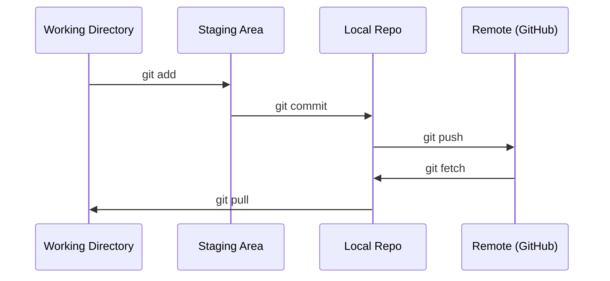

# Git 与协作

> 版本控制不是可选的。您在这里构建的每个实验、每个模型、每个课程都会被跟踪。

**类型：** ** Learn
**语言：** ** --
**先修：** ** 第 0 阶段，第 01 课
**时间：** ** 约 30 分钟

## 学习目标

- 配置 git 身份并使用添加、提交和推送的日常工作流程
- 在不破坏主干的情况下为孤立的实验创建和合并分支
- 编写一个`.gitignore`，排除模型检查点和大型二进制文件
- 使用`git log`浏览提交历史记录以了解项目演变

＃＃ 问题

您即将跨 20 个阶段编写数百个代码文件。如果没有版本控制，您将失去工作，破坏无法撤消的事情，并且无法与他人协作。

Git 就是这个工具。 GitHub 是代码所在的地方。本课程涵盖了本课程所需的内容，仅此而已。

## 概念



要记住三件事：
1.经常保存(`git commit`)
2.推送到远程(`git push`)
3.实验分支(`git checkout -b experiment`)

## Build It

### 第 1 步：配置 git

```bash
git config --global user.name "Your Name"
git config --global user.email "you@example.com"
```

### 第 2 步：日常工作流程

```bash
git status
git add file.py
git commit -m "Add perceptron implementation"
git push origin main
```

### 步骤 3：实验分支

```bash
git checkout -b experiment/new-optimizer

# ... make changes, commit ...

git checkout main
git merge experiment/new-optimizer
```

### 步骤 4：使用本课程存储库

```bash
git clone https://github.com/rohitg00/ai-engineering-from-scratch.git
cd ai-engineering-from-scratch

git checkout -b my-progress
# work through lessons, commit your code
git push origin my-progress
```

## Use It

对于本课程，您需要以下命令：

|命令 |当 |
|---------|------|
| `git clone` |获取课程存储库 |
| `git add` + `git commit` |保存您的工作 |
| `git push` |备份到 GitHub |
| `git checkout -b` |尝试一些不破坏 main | 的东西
| `git log --oneline` |看看你做了什么 |

就是这样。本课程不需要 rebase、cherry-pick 或子模块。

## 练习

1.克隆这个repo，创建一个名为`my-progress`的分支，创建一个文件，提交它，推送它
2. 创建一个排除模型检查点文件的`.gitignore`（`.pt`、`.pth`、`.safetensors`）
3. 使用`git log --oneline` 查看此存储库的提交历史记录并了解如何添加课程

## 关键术语

|术语 |人们怎么说|它实际上意味着什么 |
|------|----------------|----------------------|
|提交 | “节省” |整个项目在某个时间点的快照 |
|分公司| “副本”|指向在您工作时向前推进的提交的指针 |
|合并 | “组合代码” |从一个分支获取更改并将其应用到另一个分支 |
|远程| “云”|托管在其他地方（GitHub、GitLab）的存储库副本 |
