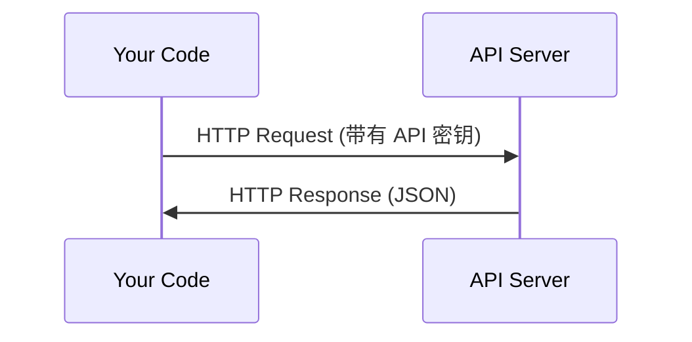

# API 和密钥

> 每个 AI API 的工作方式都相同：发送请求，获取响应。细节改变，但模式不变。

**类型：** ** Build
**语言：** ** Python, TypeScript
**先修：** ** 第 0 阶段，第 01 课
**时间：** ** 约 30 分钟

## 学习目标

- 使用环境变量和`.env`文件安全地存储API密钥
- 使用 Anthropic Python SDK 和原始 HTTP 进行 LLM API 调用
- 比较基于 SDK 和原始 HTTP request/response 格式以进行调试
- 识别并处理常见的 API 错误，包括身份验证和率限制

＃＃ 问题

从第 11 阶段开始，您将调用 LLM API（Anthropic、OpenAI、Google）。在第 13-16 阶段，您将构建在循环中使用这些 API 的代理。您需要了解 API 密钥的工作原理、如何安全存储它们以及如何进行首次 API 调用。

## 概念



每个 API 调用都有：
1. 端点（URL）
2. API密钥（身份验证）
3.请求体（你想要的）
4. 响应正文（您返回的内容）

## Build It

### 第 1 步：安全存储 API 密钥

切勿将 API 密钥放入代码中。使用环境变量。

```bash
export ANTHROPIC_API_KEY="sk-ant-..."
export OPENAI_API_KEY="sk-..."
```

或者使用`.env`文件（将其添加到`.gitignore`）：

```
ANTHROPIC_API_KEY=sk-ant-...
OPENAI_API_KEY=sk-...
```

### 步骤 2：第一次 API 调用 (Python)

```python
import anthropic

client = anthropic.Anthropic()

response = client.messages.create(
    model="claude-sonnet-4-20250514",
    max_tokens=256,
    messages=[{"role": "user", "content": "What is a neural network in one sentence?"}]
)

print(response.content[0].text)
```

### 步骤 3：第一次 API 调用 (TypeScript)

```typescript
import Anthropic from "@anthropic-ai/sdk";

const client = new Anthropic();

const response = await client.messages.create({
  model: "claude-sonnet-4-20250514",
  max_tokens: 256,
  messages: [{ role: "user", content: "What is a neural network in one sentence?" }],
});

console.log(response.content[0].text);
```

### 步骤 4：原始 HTTP（无 SDK）

```python
import os
import urllib.request
import json

url = "https://api.anthropic.com/v1/messages"
headers = {
    "Content-Type": "application/json",
    "x-api-key": os.environ["ANTHROPIC_API_KEY"],
    "anthropic-version": "2023-06-01",
}
body = json.dumps({
    "model": "claude-sonnet-4-20250514",
    "max_tokens": 256,
    "messages": [{"role": "user", "content": "What is a neural network in one sentence?"}],
}).encode()

req = urllib.request.Request(url, data=body, headers=headers, method="POST")
with urllib.request.urlopen(req) as resp:
    result = json.loads(resp.read())
    print(result["content"][0]["text"])
```

这就是 SDK 在幕后所做的事情。了解原始 HTTP 调用有助于调试。

## Use It

对于本课程：

|API |当你需要的时候 |免费套餐 |
|-----|-----------------|-----------|
|人择（克劳德）|第 11-16 阶段（代理、工具）|注册时可获得 5 美元赠金 |
|开放人工智能 |第 11 阶段（比较）|注册时可获得 5 美元赠金 |
|拥抱脸|第 4-10 阶段（模型、数据集）|免费|

您现在不需要所有这些。当课程需要时设置它们。

## 发货

本课产生：
- `outputs/prompt-api-troubleshooter.md` - 诊断常见 API 错误

## 练习

1. 获取 Anthropic API 密钥并进行第一次 API 调用
2. 尝试原始HTTP版本并将响应格式与SDK版本进行比较
3.故意使用错误的API密钥并阅读错误消息

## 关键术语

|术语 |人们怎么说|它实际上意味着什么 |
|------|----------------|----------------------|
| API 密钥 | “API 密码”|标识您的帐户并授权请求的唯一字符串 |
|率限制 | “他们正在扼杀我”|每个minute/hour 的最大请求数，以防止滥用并确保公平使用 |
|代币| “一句话”（在 API 上下文中）|计费单位：输入和输出代币分开计数并计费 |
|流媒体| “实时响应”|逐字获取回复，而不是等待完整回复 |
