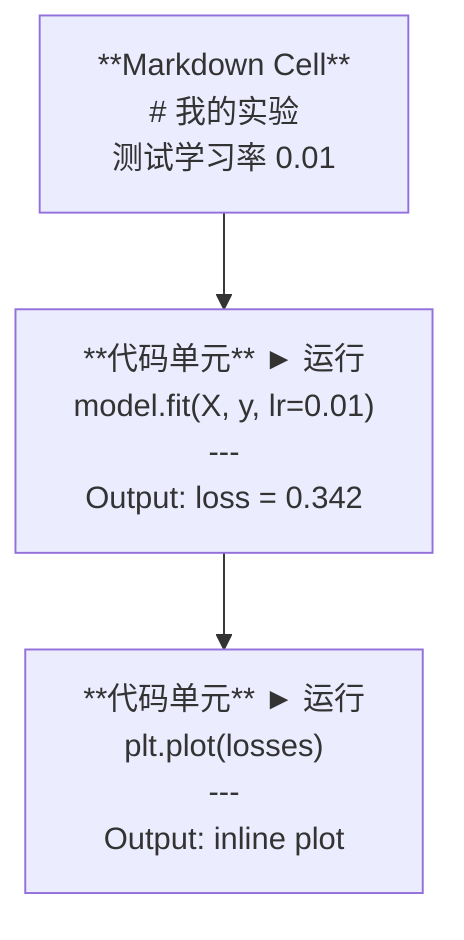
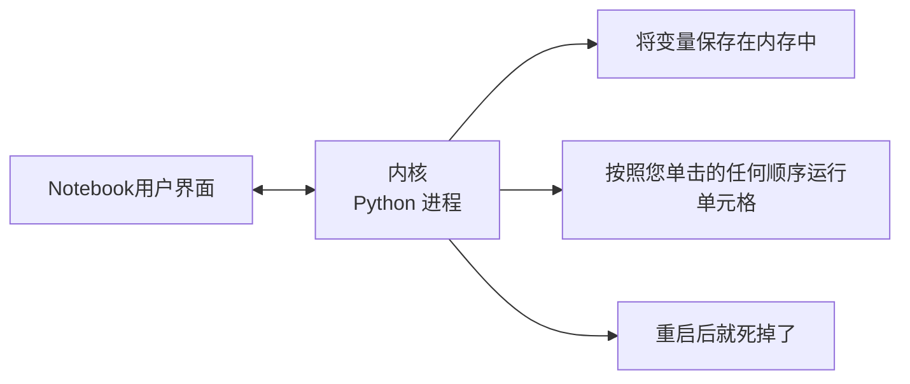

# Jupyter Notebook

> Notebook电脑是人工智能工程的实验台。您可以在这里制作原型，然后将有效的内容投入生产。

**类型：** ** Build
**语言：** ** Python
**先修：** ** 第 0 阶段，第 01 课
**时间：** ** 约 30 分钟

## 学习目标

- 安装并启动 JupyterLab、Jupyter Notebook 或带有 Jupyter 扩展的 VS Code
- 使用魔法命令（`%timeit`、`%%time`、`%matplotlib inline`）进行基准测试和可视化内联
- 区分何时使用Notebook与脚本，并应用“在Notebook中探索，在脚本中发布”工作流程
- 识别并避免常见的Notebook陷阱：乱序执行、隐藏状态和内存泄漏

＃＃ 问题

每一篇 AI 论文、教程和 Kaggle 竞赛都使用 Jupyter Notebook。它们让您可以分段运行代码、查看内联输出、将代码与解释混合以及快速迭代。如果你尝试在没有Notebook的情况下学习人工智能，那么你就是在没有草稿纸的情况下做数学作业。

但Notebook电脑确实存在陷阱。人们用它们做任何事情，包括他们不擅长的事情。知道何时使用Notebook以及何时使用脚本将使您免于以后的调试噩梦。

## 概念

Notebook是单元格列表。每个单元格要么是代码，要么是文本。



内核是一个在后台运行的Python进程。当你运行一个单元时，它会将代码发送到内核，内核执行它并返回结果。所有单元共享相同的内核，因此单元之间存在变量。



“无论你点击什么命令”部分既是超能力也是脚枪。

## Build It

### 第 1 步：选择您的界面

三种选项，一种格式：

|接口 |安装 |最适合 |
|-----------|---------|----------|
| Jupyter实验室| `pip install jupyterlab` 然后`jupyter lab` |完整的 IDE 体验、多个选项卡、文件浏览器、终端 |
| Jupyter Notebook | `pip install notebook` 然后`jupyter notebook` |简单、轻便，一次一个Notebook|
| VS 代码 |安装“Jupyter”扩展 |已经在你的编辑器中，git 集成、调试 |

所有三个都读取和写入相同的`.ipynb` 文件。选择你喜欢的任何东西。 JupyterLab 是 AI 工作中最常见的。

```bash
pip install jupyterlab
jupyter lab
```

### 步骤 2：重要的键盘快捷键

您可以以两种模式进行操作。按`Escape` 进入命令模式（左侧蓝色条），按`Enter` 进入编辑模式（绿色条）。

**命令模式（最常用）:**

|关键|行动|
|-----|--------|
| `Shift+Enter` |运行单元格，移至下一个 |
| `A` |在上面插入单元格 |
| `B` |在下面插入单元格 |
| `DD` |删除单元格 |
| `M` |转换为降价 |
| `Y` |转换为代码 |
| `Z` |撤消单元格操作 |
| `Ctrl+Shift+H` |显示所有快捷方式 |

**编辑模式:**

|关键|行动|
|-----|--------|
| `Tab` |自动完成 |
| `Shift+Tab` |显示函数签名 |
| `Ctrl+/` |切换评论 |

`Shift+Enter` 是您每天会使用一千次的那个。先学一下吧。

### 第 3 步：细胞类型

**代码单元** 运行 Python 并显示输出：

```python
import numpy as np
data = np.random.randn(1000)
data.mean(), data.std()
```

输出：`(0.0032, 0.9987)`

**Markdown 单元格** 呈现格式化文本。用它们来记录你正在做什么以及为什么这样做。支持标题、粗体、斜体、LaTeX 数学 (`$E = mc^2$`)、表格和图像。

### 第 4 步：魔法命令

这些不是Python。它们是 Jupyter 特定的命令，以 `%`（行魔法）或 `%%`（单元魔法）开头。

**为您的代码计时:**

```python
%timeit np.random.randn(10000)
```

输出：`45.2 us +/- 1.3 us per loop`

```python
%%time
model.fit(X_train, y_train, epochs=10)
```

输出：`Wall time: 2.34 s`

`%timeit` 多次运行代码并取平均值。 `%%time` 运行一次。使用 `%timeit` 进行微基准测试，使用 `%%time` 进行训练运行。

**启用内联图:**

```python
%matplotlib inline
```

每个 `plt.plot()` 或 `plt.show()` 现在都直接在Notebook中渲染。

**无需离开Notebook即可安装软件包:**

```python
!pip install scikit-learn
```

`!` 前缀运行任何 shell 命令。

**检查环境变量:**

```python
%env CUDA_VISIBLE_DEVICES
```

### 步骤 5：内联显示丰富的输出

Notebook会自动显示单元格中的最后一个表达式。但你可以控制它：

```python
import pandas as pd

df = pd.DataFrame({
    "model": ["Linear", "Random Forest", "Neural Net"],
    "accuracy": [0.72, 0.89, 0.94],
    "training_time": [0.1, 2.3, 45.6]
})
df
```

这会呈现格式化的 HTML 表，而不是文本转储。与情节相同：

```python
import matplotlib.pyplot as plt

plt.figure(figsize=(8, 4))
plt.plot([1, 2, 3, 4], [1, 4, 2, 3])
plt.title("Inline Plot")
plt.show()
```

该图出现在单元格的正下方。这就是Notebook电脑主导人工智能工作的原因。您可以同时看到数据、图表和代码。

对于图像：

```python
from IPython.display import Image, display
display(Image(filename="architecture.png"))
```

### 第 6 步：谷歌 Colab

Colab 是云中的免费 Jupyter Notebook。它为您提供 GPU、预装库和 Google Drive 集成。无需设置。

1. 前往 [colab.research.google.com](https://colab.research.google.com)
2.上传本课程的任何`.ipynb`文件
3.运行时 > 更改运行时类型 > T4 GPU（免费）

Colab 与本地 Jupyter 的差异：
- 文件在会话之间不会保留（保存到云硬盘或下载）
- 预安装：NumPy、pandas、matplotlib、torch、tensorflow、sklearn
- `from google.colab import files` 至 upload/download 文件
- `from google.colab import drive; drive.mount('/content/drive')` 用于持久存储
- 90 分钟不活动后会话超时（免费套餐）

## Use It

### Notebook与脚本：何时使用哪个

|使用Notebook来 |使用脚本 |
|-------------------|-----------------|
|探索数据集 |培训流水线 |
|制作模型原型 |可重复使用的工具 |
|可视化结果 |任何带有`if __name__`的东西|
|解释你的工作|按计划运行的代码 |
|快速实验 |生产代码|
|课程练习|包和库 |

规则:**在Notebook中探索，在脚本中发布**。

AI 中的常见工作流程：
1. 探索Notebook中的数据
2. 在Notebook中制作模型原型
3. 工作完成后，将代码移至`.py` 文件
4. 将这些`.py` 文件导入回Notebook中以进行进一步的实验

### 常见陷阱

**乱序执行。** 您运行单元 5，然后运行单元 2，然后运行单元 7。Notebook可以在您的计算机上运行，​​但当有人从上到下运行它时会损坏。修复：共享之前内核 > 重新启动并运行全部。

**隐藏状态。** 您删除了一个单元格，但它创建的变量仍在内存中。Notebook看起来很干净，但依赖于幽灵电池。修复：定期重启内核。

**内存泄漏。** 加载 4GB 数据集，训练模型，加载另一个数据集。什么都没有被释放。修复：`del variable_name` 和`gc.collect()`，或者重新启动内核。

## 发货

本课产生：
- `outputs/prompt-notebook-helper.md` 用于调试Notebook问题

## 练习

1. 打开 JupyterLab，创建一个Notebook，然后使用 `%timeit` 比较列表理解与 NumPy 创建 100,000 个随机数的数组
2. 创建一个包含 markdown 和代码单元的Notebook，用于加载 CSV、显示数据框并绘制图表。然后运行 ​​Kernel > Restart & Run All 以验证它从上到下是否正常工作
3. 从`code/notebook_tips.py`获取代码，将其粘贴到ColabNotebook中，并使用空闲GPU运行它

## 关键术语

|术语 |人们怎么说|它实际上意味着什么 |
|------|----------------|----------------------|
|内核| “运行我的代码的东西”|执行单元并将变量保存在内存中的独立 Python 进程 |
|细胞| “代代码块”|Notebook中可独立运行的单元，可以是代码，也可以是 Markdown |
|魔法指令| “Jupyter 技巧”|以 `%` 或 `%%` 为前缀的控制Notebook环境的特殊命令 |
| `.ipynb` | “Notebook文件” |包含单元格、输出和元数据的 JSON 文件。代表 IPython Notebook |

## 延伸阅读

- [JupyterLab 文档]（https://jupyterlab.readthedocs.io/) 以获得完整的函数集
- [Google Colab 常见问题解答]（https://research.google.com/colaboratory/faq.html) 了解 Colab 特定的限制和函数
- [28 Jupyter Notebook 技巧](https://www.dataquest.io/blog/jupyter-notebook-tips-tricks-shortcuts/) 用于高级用户快捷方式
