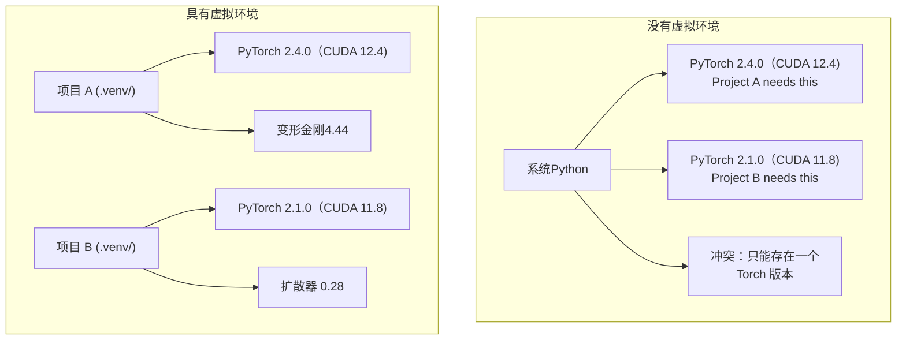

# Python 环境

> 依赖地狱是真实存在的。虚拟环境是治疗方法。

**类型：** ** Build
**语言：** ** Shell
**先修：** ** 第 0 阶段，第 01 课
**时间：** ** 约 30 分钟

## 学习目标

- 使用`uv`、`venv`或`conda`创建隔离的虚拟环境
- 编写带有可选依赖项组的`pyproject.toml`并生成锁定文件以实现可重复性
- 诊断并修复常见陷阱：全局安装、pip/conda 混合、CUDA 版本不匹配
- 为具有冲突依赖关系的项目实施每阶段环境策略

＃＃ 问题

您安装 PyTorch 2.4 来进行微调项目。下周，另一个项目需要 PyTorch 2.1，因为其 CUDA 构建已固定。当你进行全球升级时，第一个项目就失败了。你降级，第二个就坏了。

这是依赖地狱。这种情况在AI/ML工作中经常发生，因为：

- PyTorch、JAX 和 TensorFlow 各自提供了自己的 CUDA 绑定
- 模型库固定特定框架版本
- 全局`pip install` 会覆盖之前的内容
- CUDA 11.8 版本不适用于 CUDA 12.x 驱动程序（反之亦然）

解决方法：每个项目都有自己的隔离环境和自己的包。

## 概念



## Build It

### 选项 1：uv venv（推荐）

`uv` 是最快的 Python 包管理器（比 pip 快 10-100 倍）。它在一个工具中处理虚拟环境、Python 版本和依赖项解析。

```bash
curl -LsSf https://astral.sh/uv/install.sh | sh

uv python install 3.12

cd your-project
uv venv
source .venv/bin/activate
```

安装包：

```bash
uv pip install torch numpy
```

一步创建一个带有`pyproject.toml`的项目：

```bash
uv init my-ai-project
cd my-ai-project
uv add torch numpy matplotlib
```

### 选项 2：venv（内置）

如果您无法安装`uv`，Python 附带`venv`：

```bash
python3 -m venv .venv
source .venv/bin/activate  # Linux/macOS
.venv\Scripts\activate     # Windows

pip install torch numpy
```

比 `uv` 慢，但可以在安装了 Python 的任何地方使用。

### 选项 3：conda（当你需要时）

Conda 管理非 Python 依赖项，例如 CUDA 工具包、cuDNN 和 C 库。在以下情况下使用它：

- 您需要特定的 CUDA 工具包版本，而无需在系统范围内安装它
- 您位于共享集群上，无法安装系统软件包
- 库的安装说明显示“使用 conda”

```bash
# Install miniconda (not the full Anaconda)
curl -LsSf https://repo.anaconda.com/miniconda/Miniconda3-latest-Linux-x86_64.sh -o miniconda.sh
bash miniconda.sh -b

conda create -n myproject python=3.12
conda activate myproject

conda install pytorch torchvision torchaudio pytorch-cuda=12.4 -c pytorch -c nvidia
```

一条规则：如果您在某个环境中使用 conda，请对该环境中的所有包使用 conda。将 `pip install` 混合到 conda env 中会导致依赖项冲突，调试起来很困难。

### 对于本课程：每阶段策略

您可以为整个课程创建一个环境。不。不同的阶段需要不同的（有时是冲突的）依赖关系。

战略：

```
ai-engineering-from-scratch/
├── .venv/                    <-- shared lightweight env for phases 0-3
├── phases/
│   ├── 04-neural-networks/
│   │   └── .venv/            <-- PyTorch env
│   ├── 05-cnns/
│   │   └── .venv/            <-- same PyTorch env (symlink or shared)
│   ├── 08-transformers/
│   │   └── .venv/            <-- might need different transformer versions
│   └── 11-llm-apis/
│       └── .venv/            <-- API SDKs, no torch needed
```

`code/env_setup.sh` 中的脚本为本课程创建基础环境。

## pyproject.toml 基础知识

每个Python项目都应该有一个`pyproject.toml`。它替换一个文件中的`setup.py`、`setup.cfg` 和`requirements.txt`。

```toml
[project]
name = "ai-engineering-from-scratch"
version = "0.1.0"
requires-python = ">=3.11"
dependencies = [
    "numpy>=1.26",
    "matplotlib>=3.8",
    "jupyter>=1.0",
    "scikit-learn>=1.4",
]

[project.optional-dependencies]
torch = ["torch>=2.3", "torchvision>=0.18"]
llm = ["anthropic>=0.39", "openai>=1.50"]
```

然后安装：

```bash
uv pip install -e ".[torch]"    # base + PyTorch
uv pip install -e ".[llm]"     # base + LLM SDKs
uv pip install -e ".[torch,llm]" # everything
```

## 锁文件

锁定文件将每个依赖项（包括传递依赖项）固定到确切的版本。这保证了可重复性：任何从锁定文件安装的人都会获得完全相同的软件包。

```bash
# uv generates uv.lock automatically when using uv add
uv add numpy

# pip-tools approach
uv pip compile pyproject.toml -o requirements.lock
uv pip install -r requirements.lock
```

将您的锁定文件提交到 git。当有人克隆存储库时，他们从锁定文件进行安装并获得相同的版本。

## 常见错误

### 1. 全局安装

```bash
pip install torch  # BAD: installs to system Python

source .venv/bin/activate
pip install torch  # GOOD: installs to virtual environment
```

检查您的包裹去向：

```bash
which python       # should show .venv/bin/python, not /usr/bin/python
which pip           # should show .venv/bin/pip
```

### 2. 混合 pip 和 conda

```bash
conda create -n myenv python=3.12
conda activate myenv
conda install pytorch -c pytorch
pip install some-other-package   # BAD: can break conda's dependency tracking
conda install some-other-package # GOOD: let conda manage everything
```

如果必须在 conda 中使用 pip（某些软件包仅支持 pip），请先安装所有 conda 软件包，然后再安装 pip 软件包。

### 3.忘记激活

```bash
python train.py           # uses system Python, missing packages
source .venv/bin/activate
python train.py           # uses project Python, packages found
```

您的 shell 提示符应显示环境名称：

```
(.venv) $ python train.py
```

### 4. 将 .venv 提交到 git

```bash
echo ".venv/" >> .gitignore
```

虚拟环境为200MB-2GB。它们是本地的，不能在机器之间移植。而是提交 `pyproject.toml` 和锁文件。

### 5.CUDA版本不匹配

```bash
nvidia-smi                # shows driver CUDA version (e.g., 12.4)
python -c "import torch; print(torch.version.cuda)"  # shows PyTorch CUDA version

# These must be compatible.
# PyTorch CUDA version must be <= driver CUDA version.
```

## Use It

运行设置脚本来创建您的课程环境：

```bash
bash phases/00-setup-and-tooling-环境搭建与工具链/06-python-environments-pythonenvironments/code/env_setup.sh
```

这将在存储库根目录中创建一个`.venv`，并安装并验证核心依赖项。

## 练习

1. 运行`env_setup.sh`并验证所有检查是否通过
2.创建第二个虚拟环境，在其中安装不同版本的NumPy，并确认两个环境是隔离的
3. 为同时需要 PyTorch 和 Anthropic SDK 的项目编写`pyproject.toml`
4. 故意全局安装一个包（不激活 venv），注意它的去向，然后卸载它

## 关键术语

|术语 |人们怎么说|它实际上意味着什么 |
|------|----------------|----------------------|
|虚拟环境| “一个venv”|包含Python解释器和包的独立目录，与系统Python | 分开。
|锁文件 | “固定依赖项”|列出每个软件包及其确切版本的文件，保证跨计算机的相同安装 |
| pyproject.toml | “新的 setup.py” |标准Python项目配置文件，替换setup.py/setup.cfg/requirements.txt |
|传递依赖| “依赖的依赖”|包B依赖于C；如果您安装依赖于 B 的 A，则 C 是 A | 的传递依赖项
| CUDA 不匹配 | “我的 GPU 不工作”| PyTorch 的编译版本与您的 GPU 驱动程序支持的版本不同 |
