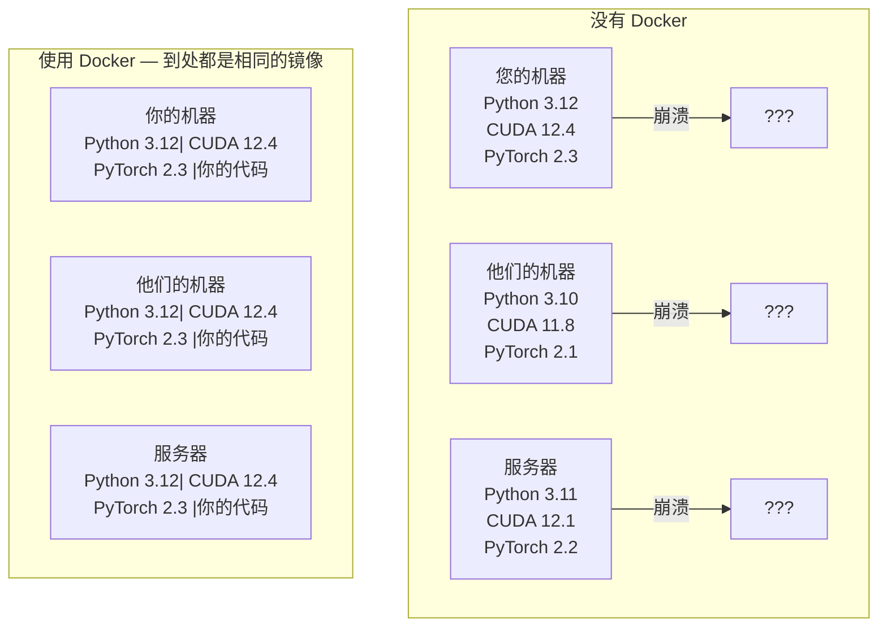

# 用于人工智能的 Docker

> 容器使“在我的机器上运行”成为过去。

**类型：** ** Build
**语言：** ** Docker
**先修：** ** 第 0 阶段，第 01 课和第 03 课
**时间：** ** 约 60 分钟

## 学习目标

- 使用 Dockerfile 中的 CUDA、PyTorch 和 AI 库构建支持 GPU 的 Docker 映像
- 将主机目录挂载为卷，以在容器重建过程中保留模型、数据集和代码
- 配置 NVIDIA 容器工具包以公开容器内的 GPU
- 使用 Docker Compose 编排多服务 AI 应用程序（推理服务器 + 矢量数据库）

＃＃ 问题

您使用 PyTorch 2.3、CUDA 12.4 和 Python 3.12 在Notebook电脑上训练了模型。您的同事拥有 PyTorch 2.1、CUDA 11.8 和 Python 3.10。你的模型在他们的机器上崩溃了。您的 Dockerfile 对两者都适用。

人工智能项目是依赖噩梦。典型的堆栈包括 Python、PyTorch、CUDA 驱动程序、cuDNN、系统级 C 库以及需要精确编译器版本的专用包（例如 flash-attn）。 Docker 将所有这些打包到一个镜像中，在任何地方都以相同的方式运行。

## 概念

Docker 将代码、运行时、库和系统工具包装到一个称为容器的隔离单元中。将其视为一个轻量级虚拟机，只不过它共享主机操作系统内核而不是运行自己的内核，因此它可以在几秒钟而不是几分钟内启动。



### 为什么 AI 项目比大多数项目更需要 Docker

1. **GPU 驱动程序很脆弱。** CUDA 12.4 代码无法在 CUDA 11.8 上运行。 Docker 将 CUDA 工具包隔离在容器内，同时通过 NVIDIA Container Toolkit 共享主机 GPU 驱动程序。

2. **模型权重较大。** 7B参数模型在fp16中为14GB。您不想每次重建时都重新下载它。 Docker 卷允许您从主机挂载模型目录。

3. **多服务架构很常见。** 真正的人工智能应用不仅仅是Python脚本。它是一个推理服务器、RAG 的矢量数据库，也可能是一个 Web 前端。 Docker Compose 通过一个命令来协调所有这些。

### 关键词汇

|术语 |这意味着什么 |
|------|---------------|
|图片|只读模板。你的食谱。从 Dockerfile 构建。 |
|集装箱|图像的运行实例。你的厨房。 |
| Dockerfile |构建图像的说明。一层又一层。 |
|卷 |在容器重新启动后仍然存在的持久存储。 |
| docker 撰写 |用于在 YAML 中定义多容器应用程序的工具。 |

### AI 中常见的容器模式

```
Dev Container
  Full toolkit. Editor support. Jupyter. Debugging tools.
  Used during development and experimentation.

Training Container
  Minimal. Just the training script and dependencies.
  Runs on GPU clusters. No editor, no Jupyter.

Inference Container
  Optimized for serving. Small image. Fast cold start.
  Runs behind a load balancer in production.
```

## Build It

### 第 1 步：安装 Docker

```bash
# macOS
brew install --cask docker
open /Applications/Docker.app

# Ubuntu
curl -fsSL https://get.docker.com | sh
sudo usermod -aG docker $USER
# Log out and back in for group change to take effect
```

核实：

```bash
docker --version
docker run hello-world
```

### 步骤 2：安装 NVIDIA Container Toolkit（带有 NVIDIA GPU 的 Linux）

这可以让 Docker 容器访问您的 GPU。 macOS 和 Windows (WSL2) 用户可以跳过此操作； Docker Desktop 在这些平台上以不同的方式处理 GPU 直通。

```bash
distribution=$(. /etc/os-release;echo $ID$VERSION_ID)
curl -fsSL https://nvidia.github.io/libnvidia-container/gpgkey | sudo gpg --dearmor -o /usr/share/keyrings/nvidia-container-toolkit-keyring.gpg
curl -s -L https://nvidia.github.io/libnvidia-container/$distribution/libnvidia-container.list | \
    sed 's#deb https://#deb [signed-by=/usr/share/keyrings/nvidia-container-toolkit-keyring.gpg] https://#g' | \
    sudo tee /etc/apt/sources.list.d/nvidia-container-toolkit.list

sudo apt-get update
sudo apt-get install -y nvidia-container-toolkit
sudo nvidia-ctk runtime configure --runtime=docker
sudo systemctl restart docker
```

测试容器内的 GPU 访问：

```bash
docker run --rm --gpus all nvidia/cuda:12.4.1-base-ubuntu22.04 nvidia-smi
```

如果您看到 GPU 信息，则表明该工具包正在运行。

### 第 3 步：了解基础镜像

选择正确的基础映像可以节省数小时的调试时间。

```
nvidia/cuda:12.4.1-devel-ubuntu22.04
  Full CUDA toolkit. Compilers included.
  Use for: building packages that need nvcc (flash-attn, bitsandbytes)
  Size: ~4 GB

nvidia/cuda:12.4.1-runtime-ubuntu22.04
  CUDA runtime only. No compilers.
  Use for: running pre-built code
  Size: ~1.5 GB

pytorch/pytorch:2.3.1-cuda12.4-cudnn9-runtime
  PyTorch pre-installed on top of CUDA.
  Use for: skipping the PyTorch install step
  Size: ~6 GB

python:3.12-slim
  No CUDA. CPU only.
  Use for: inference on CPU, lightweight tools
  Size: ~150 MB
```

### 步骤 4：编写用于 AI 开发的 Dockerfile

这是 `code/Dockerfile` 中的 Dockerfile。浏览一下它：

```dockerfile
FROM nvidia/cuda:12.4.1-devel-ubuntu22.04

ENV DEBIAN_FRONTEND=noninteractive
ENV PYTHONUNBUFFERED=1

RUN apt-get update && apt-get install -y --no-install-recommends \
    python3.12 \
    python3.12-venv \
    python3.12-dev \
    python3-pip \
    git \
    curl \
    build-essential \
    && rm -rf /var/lib/apt/lists/*

RUN update-alternatives --install /usr/bin/python python /usr/bin/python3.12 1

RUN python -m pip install --no-cache-dir --upgrade pip setuptools wheel

RUN python -m pip install --no-cache-dir \
    torch==2.3.1 \
    torchvision==0.18.1 \
    torchaudio==2.3.1 \
    --index-url https://download.pytorch.org/whl/cu124

RUN python -m pip install --no-cache-dir \
    numpy \
    pandas \
    scikit-learn \
    matplotlib \
    jupyter \
    transformers \
    datasets \
    accelerate \
    safetensors

WORKDIR /workspace

VOLUME ["/workspace", "/models"]

EXPOSE 8888

CMD ["python"]
```

构建它：

```bash
docker build -t ai-dev -f phases/00-setup-and-tooling-环境搭建与工具链/07-docker-for-ai-DockerforAI/code/Dockerfile .
```

第一次需要一段时间（下载 CUDA 基础镜像 + PyTorch）。后续构建使用缓存层。

运行它：

```bash
docker run --rm -it --gpus all \
    -v $(pwd):/workspace \
    -v ~/models:/models \
    ai-dev python -c "import torch; print(f'PyTorch {torch.__version__}, CUDA: {torch.cuda.is_available()}')"
```

在容器内运行 Jupyter：

```bash
docker run --rm -it --gpus all \
    -v $(pwd):/workspace \
    -v ~/models:/models \
    -p 8888:8888 \
    ai-dev jupyter notebook --ip=0.0.0.0 --port=8888 --no-browser --allow-root
```

### 步骤 5：数据和模型的卷挂载

卷安装对于 AI 工作至关重要。如果没有它们，当容器停止时，您的 14 GB 模型下载就会消失。

```bash
# Mount your code
-v $(pwd):/workspace

# Mount a shared models directory
-v ~/models:/models

# Mount datasets
-v ~/datasets:/data
```

在训练脚本中，从安装的路径加载：

```python
from transformers import AutoModel

model = AutoModel.from_pretrained("/models/llama-7b")
```

该模型位于您的主机文件系统上。您可以根据需要多次重建容器，而无需重新下载。

### 步骤 6：用于多服务 AI 应用程序的 Docker Compose

真正的 RAG 应用程序需要推理服务器和向量数据库。 Docker Compose 使用一个命令来运行这两者。

请参阅`code/docker-compose.yml`：

```yaml
services:
  ai-dev:
    build:
      context: .
      dockerfile: Dockerfile
    deploy:
      resources:
        reservations:
          devices:
            - driver: nvidia
              count: all
              capabilities: [gpu]
    volumes:
      - ../../../:/workspace
      - ~/models:/models
      - ~/datasets:/data
    ports:
      - "8888:8888"
    stdin_open: true
    tty: true
    command: jupyter notebook --ip=0.0.0.0 --port=8888 --no-browser --allow-root

  qdrant:
    image: qdrant/qdrant:v1.12.5
    ports:
      - "6333:6333"
      - "6334:6334"
    volumes:
      - qdrant_data:/qdrant/storage

volumes:
  qdrant_data:
```

开始一切：

```bash
cd phases/00-setup-and-tooling-环境搭建与工具链/07-docker-for-ai-DockerforAI/code
docker compose up -d
```

现在，您的 AI 开发容器可以通过服务名称访问 `http://qdrant:6333` 处的矢量数据库。 Docker Compose 自动创建共享网络。

从 AI 容器内部测试连接：

```python
from qdrant_client import QdrantClient

client = QdrantClient(host="qdrant", port=6333)
print(client.get_collections())
```

停止一切：

```bash
docker compose down
```

添加 `-v` 以同时删除 qdrant 卷：

```bash
docker compose down -v
```

### 步骤 7：用于 AI 工作的有用 Docker 命令

```bash
# List running containers
docker ps

# List all images and their sizes
docker images

# Remove unused images (reclaim disk space)
docker system prune -a

# Check GPU usage inside a running container
docker exec -it <container_id> nvidia-smi

# Copy a file from container to host
docker cp <container_id>:/workspace/results.csv ./results.csv

# View container logs
docker logs -f <container_id>
```

## Use It

您现在拥有一个可复制的 AI 开发环境。对于本课程的其余部分：

- 使用`docker compose up`一起启动您的开发环境和矢量数据库
- 将代码、模型和数据安装为卷，以便在重建之间不会丢失任何内容
- 当课程需要新的 Python 包时，将其添加到 Dockerfile 并重建
- 与队友分享您的 Dockerfile。他们获得完全相同的环境。

### 没有 GPU？

删除 `--gpus all` 标志和 NVIDIA 部署块。该容器仍然适用于基于 CPU 的课程。 PyTorch 检测到 CUDA 不存在并自动回退到 CPU。

## 练习

1. 构建 Dockerfile 并在容器内运行 `python -c "import torch; print(torch.__version__)"`
2. 启动 docker-compose 堆栈并验证 Qdrant 是否可以从 `http://qdrant:6333/collections` 处的 AI 容器访问
3. 将 `flask` 添加到 Dockerfile，重建并在端口 5000 上运行一个简单的 API 服务器。使用 `-p 5000:5000` 映射端口
4. 使用`docker images` 测量图像尺寸。尝试将基本图像从`devel`切换到`runtime`并比较大小

## 关键术语

|术语 |人们怎么说|它实际上意味着什么 |
|------|----------------|----------------------|
|集装箱| “轻量级虚拟机” |使用主机内核的隔离进程，具有自己的文件系统和网络 |
|图像层| “缓存步骤”|每个 Dockerfile 指令都会创建一个层。未更改的图层会被缓存，因此重建速度很快。 |
| NVIDIA 容器工具包 | “Docker 中的 GPU” |一个运行时钩子，通过 `--gpus` 标志将主机 GPU 暴露给容器 |
|卷安装 | “共享文件夹”|映射到容器的主机上的目录。容器停止后更改仍然存在。 |
|基础图像| 「起点」|您的 Dockerfile 构建于其之上的`FROM` 映像。确定预安装的内容。 |
