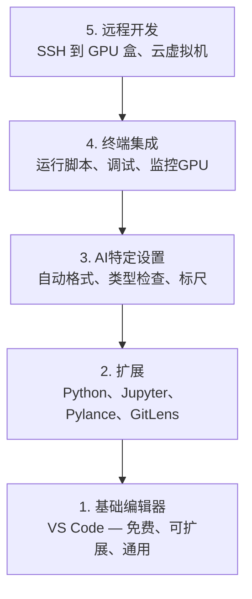

# 编辑器设置

> 你的编辑是你的副驾驶。配置一次，这样它就不会妨碍您并开始发挥作用。

**类型：** ** Build
**语言：** ** --
**先修：** ** 第 0 阶段，第 01 课
**时间：** ** 约 20 分钟

## 学习目标

- 安装 VS Code 以及 Python、Jupyter、linting 和远程 SSH 的基本扩展
- 为 AI 工作流程配置保存格式、类型检查和Notebook输出滚动
- 设置远程 SSH 以在远程 GPU 计算机上编辑和调试代码，就像它们在本地一样
- 评估编辑器替代方案（Cursor、Windsurf、Neovim）及其对 AI 工作的权衡

＃＃ 问题

您将花费数千个小时在编辑器中编写 Python、运行Notebook、调试训练循环以及通过 SSH 连接到 GPU 设备。配置错误的编辑器会将每个会话变成摩擦：没有自动完成、没有类型提示、没有内联错误、手动格式化和笨重的终端工作流程。

正确的设置需要 20 分钟。跳过它每天会花费你 20 分钟。

## 概念

人工智能工程编辑器设置需要五件事：



## Build It

### 第 1 步：安装 VS Code

VS Code 是推荐的编辑器。它是免费的，可在每个操作系统上运行，具有一流的 Jupyter Notebook支持，扩展生态系统涵盖了 AI 工作所需的一切。

从 [code.visualstudio.com](https://code.visualstudio.com/). 下载

从终端验证：

```bash
code --version
```

如果在 macOS 上找不到`code`，请打开 VS Code，按`Cmd+Shift+P`，键入“Shell Command”，然后选择“在 PATH 中安装‘code’命令”。

### 第 2 步：安装基本扩展

在 VS Code 中打开集成终端（`Ctrl+`` ` 或 `` Cmd+` ``）并安装与 AI 工作相关的扩展：

```bash
code --install-extension ms-python.python
code --install-extension ms-python.vscode-pylance
code --install-extension ms-toolsai.jupyter
code --install-extension eamodio.gitlens
code --install-extension ms-vscode-remote.remote-ssh
code --install-extension ms-python.debugpy
code --install-extension ms-python.black-formatter
code --install-extension charliermarsh.ruff
```

每个人的作用：

|扩展|为什么 |
|-----------|-----|
|蟒蛇 |语言支持、虚拟环境检测、run/debug |
|皮兰斯 |快速类型检查、自动完成、导入解析 |
|朱皮特 |在 VS Code、变量资源管理器中运行Notebook |
|吉特透镜 |看看谁改变了什么，内联 git Blame |
|远程 SSH |打开远程 GPU 盒上的文件夹，就像在本地一样 |
|调试 | Python 的逐步调试 |
|黑色格式化程序|保存时自动格式化，风格一致 |
|拉夫|快速检查，发现常见错误 |

本课中的文件 `code/.vscode/extensions.json` 包含完整的建议列表。当您打开项目文件夹时，VS Code 会提示您安装它们。

### 步骤 3：配置设置

复制本课程中`code/.vscode/settings.json` 中的设置，或通过`Settings > Open Settings (JSON)` 手动应用它们。

AI工作的关键设置：

```jsonc
{
    "python.analysis.typeCheckingMode": "basic",
    "editor.formatOnSave": true,
    "editor.rulers": [88, 120],
    "notebook.output.scrolling": true,
    "files.autoSave": "afterDelay"
}
```

为什么这些很重要：

- **基本类型检查**：在运行之前捕获错误的参数类型。节省张量形状不匹配和错误 API 参数的调试时间。
- **保存时格式化**：再也不用考虑格式化了。黑色处理它。
- **88 和 120 处的标尺**：88 处黑色换行。120 标记显示文档字符串和注释何时变得太长。
- **Notebook输出滚动**：训练循环打印数千行。如果不滚动，输出面板就会爆炸。
- **自动保存**：您会忘记保存。您的训练脚本将运行过时的代码。自动保存可以防止这种情况发生。

### 步骤 4：终端集成

VS Code 的集成终端是您运行训练脚本、监视 GPU 和管理环境的地方。

正确设置：

```jsonc
{
    "terminal.integrated.defaultProfile.osx": "zsh",
    "terminal.integrated.defaultProfile.linux": "bash",
    "terminal.integrated.fontSize": 13,
    "terminal.integrated.scrollback": 10000
}
```

有用的快捷键：

|行动| macOS | Linux/Windows |
|--------|-------|---------------|
|切换终端 | `` Ctrl+` `` | `` Ctrl+` `` |
|新航站楼 | `Ctrl+Shift+`` ` | `Ctrl+Shift+`` `|
|分体式端子 | `Cmd+\` | `Ctrl+\` |

拆分终端很有用：一个用于运行脚本，一个用于使用 `nvidia-smi -l 1` 或 `watch -n 1 nvidia-smi` 监视 GPU。

### 第 5 步：远程开发（通过 SSH 连接到 GPU 盒）

这是AI工作最重要的延伸。您将在远程计算机（云虚拟机、实验室服务器、Lambda、Vast.ai）上运行训练。远程 SSH 允许您打开远程文件系统、编辑文件、运行终端和调试，就像一切都在本地一样。

设置：

1. 安装远程 SSH 扩展（在步骤 2 中完成）。
2. 按`Ctrl+Shift+P`（或`Cmd+Shift+P`），输入“Remote-SSH：连接到主机”。
3. 输入`user@your-gpu-box-ip`。
4. VS Code 自动在远程计算机上安装其服务器组件。

对于无密码访问，请设置 SSH 密钥：

```bash
ssh-keygen -t ed25519 -C "your-email@example.com"
ssh-copy-id user@your-gpu-box-ip
```

为方便起见，将主机添加到`~/.ssh/config`：

```
Host gpu-box
    HostName 203.0.113.50
    User ubuntu
    IdentityFile ~/.ssh/id_ed25519
    ForwardAgent yes
```

现在`Remote-SSH: Connect to Host > gpu-box` 立即连接。

## 替代方案

＃＃＃ 光标

[cursor.com](https://cursor.com) 是一个具有内置 AI 代码生成函数的 VS Code 分支。它使用相同的扩展生态系统和设置格式。如果您使用 Cursor，本课程中的所有内容仍然适用。导入相同的 `settings.json` 和 `extensions.json`。

### 风帆冲浪

[windsurf.com](https://windsurf.com) 是另一个 AI 优先的 VS Code 分支。同样的故事：相同的扩展、相同的设置格式、相同的远程 SSH 支持。

### Vim/Neovim

如果您已经使用 Vim 或 Neovim 并且效率很高，请继续使用。 AI Python 工作的最低设置：

- **pyright** 或 **pylsp** 用于类型检查（通过 Mason 或手动安装）
- **nvim-lspconfig** 用于语言服务器集成
- **jupyter-vim** 或 **molten-nvim** 用于类似Notebook的执行
- **telescope.nvim** 用于 file/symbol 搜索
- **none-ls.nvim** 带有黑色和皱褶的 formatting/linting

如果您尚未使用 Vim，请不要立即开始。学习曲线将与学习人工智能工程相竞争。使用 VS 代码。

## Use It

通过此设置，您的日常工作流程如下所示：

1. 在 VS Code 中打开项目文件夹（或通过远程 SSH 连接到 GPU 盒）。
2. 在编辑器中编写具有自动完成、类型提示和内联错误的 Python。
3. 运行与 Jupyter 扩展内联的 Jupyter Notebook。
4. 使用集成终端进行训练脚本`uv pip install`和GPU监控。
5. 在提交之前使用 GitLens 检查更改。

## 练习

1. 安装 VS Code 和步骤 2 中列出的所有扩展
2. 将本课中的 `settings.json` 复制到您的 VS Code 配置中
3. 打开 Python 文件并验证 Pylance 在保存时是否显示类型提示和黑色格式
4. 如果您有权访问远程计算机，请设置远程 SSH 并打开其上的文件夹

## 关键术语

|术语 |人们怎么说|它实际上意味着什么 |
|------|----------------|----------------------|
| LSP | “自动完成引擎” |语言服务器协议：编辑器从特定于语言的服务器获取类型信息、完成和诊断的标准 |
|皮兰斯 | “Python 插件” |微软的Python语言服务器使用Pyright进行类型检查和IntelliSense |
|远程 SSH | “在服务器上工作”| VS Code 扩展在远程计算机上运行轻量级服务器并将 UI 流式传输到本地编辑器 |
|保存时格式化 | “自动更漂亮” |每次保存时编辑器都会运行格式化程序（Black、Ruff），因此代码风格始终保持一致 |
