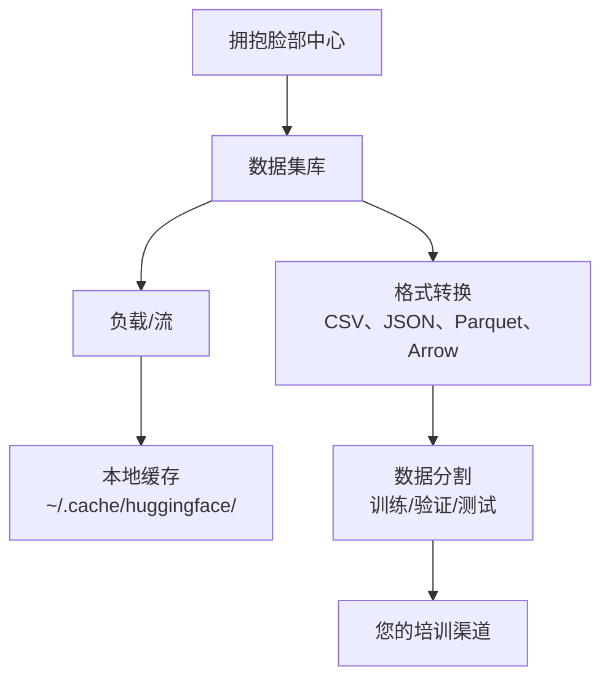

# 数据管理

> 数据是燃料。你如何管理它决定了你走得有多快。

**类型：** ** Build
**语言:** Python
**先修：** ** 第 0 阶段，第 01 课
**时间：** ** 约 45 分钟

## 学习目标

- 使用 Hugging Face `datasets` 库加载、流式传输和缓存数据集
- 在 CSV、JSON、Parquet 和 Arrow 格式之间进行转换并解释它们的权衡
- 使用固定的随机种子创建可重复的train/validation/test 分割
- 使用`.gitignore`、Git LFS 或 DVC 管理大型模型和数据集文件

＃＃ 问题

每个人工智能项目都从数据开始。您需要查找数据集、下载它们、在格式之间进行转换、拆分它们以进行训练和评估，并对它们进行版本控制，以便实验可以重现。每次都手动执行此操作既缓慢又容易出错。您需要一个可重复的工作流程。

## 概念



Hugging Face `datasets` 库是为 AI 工作加载数据的标准方法。它可以处理下载、缓存、格式转换和开箱即用的流式传输。

## Build It

### 第 1 步：安装数据集库

```bash
pip install datasets huggingface_hub
```

### 第 2 步：加载数据集

```python
from datasets import load_dataset

dataset = load_dataset("imdb")
print(dataset)
print(dataset["train"][0])
```

这将下载 IMDB 电影评论数据集。第一次下载后，它会从 `~/.cache/huggingface/datasets/` 处的缓存加载。

### 步骤 3：流化大型数据集

有些数据集太大，无法容纳在磁盘上。流式传输会逐行加载它们，而无需下载完整的内容。

```python
dataset = load_dataset("wikimedia/wikipedia", "20220301.en", split="train", streaming=True)

for i, example in enumerate(dataset):
    print(example["title"])
    if i >= 4:
        break
```

Streaming gives you an `IterableDataset`. You process rows as they arrive.无论数据集大小如何，内存使用量都保持不变。

### 步骤 4：数据集格式

`datasets` 库在底层使用 Apache Arrow。您可以根据流水线的需要转换为其他格式。

```python
dataset = load_dataset("imdb", split="train")

dataset.to_csv("imdb_train.csv")
dataset.to_json("imdb_train.json")
dataset.to_parquet("imdb_train.parquet")
```

格式对比：

|格式|尺寸|阅读速度|最适合 |
|--------|------|-----------|----------|
| CSV |大|慢|人类可读性，电子表格 |
| JSON |大|慢| API、嵌套数据 |
|实木复合地板|小|快|分析、列式查询 |
|箭头|小|最快|内存中处理（`datasets` 内部使用的内容）|

对于 AI 工作，Parquet 是最好的存储格式。箭头是你在内存中使用的东西。 CSV 和 JSON 用于互换。

### 步骤 5：数据分割

每个 ML 项目都需要三个拆分：

- **训练**：模型从中学习（通常为 80%）
- **验证**：您在训练期间检查进度（通常为 10%）
- **测试**：训练完成后的最终评估（通常为 10%）

有些数据集是预先分割的。如果没有，请自行拆分：

```python
dataset = load_dataset("imdb", split="train")

split = dataset.train_test_split(test_size=0.2, seed=42)
train_val = split["train"].train_test_split(test_size=0.125, seed=42)

train_ds = train_val["train"]
val_ds = train_val["test"]
test_ds = split["test"]

print(f"Train: {len(train_ds)}, Val: {len(val_ds)}, Test: {len(test_ds)}")
```

始终为可重复性设置种子。相同的种子每次都会产生相同的分裂。

### 第 6 步：下载并缓存模型

模型是大文件。 `huggingface_hub` 库处理下载和缓存。

```python
from huggingface_hub import hf_hub_download, snapshot_download

model_path = hf_hub_download(
    repo_id="sentence-transformers/all-MiniLM-L6-v2",
    filename="config.json"
)
print(f"Cached at: {model_path}")

model_dir = snapshot_download("sentence-transformers/all-MiniLM-L6-v2")
print(f"Full model at: {model_dir}")
```

模型缓存到`~/.cache/huggingface/hub/`。下载后，它们会在后续运行时立即加载。

### 步骤 7：处理大文件

模型权重和大型数据集不应该进入 git。三个选项：

**选项A：.gitignore（最简单）**

```
*.bin
*.safetensors
*.pt
*.onnx
data/*.parquet
data/*.csv
models/
```

**选项 B：Git LFS（在 git 中跟踪大文件）**

```bash
git lfs install
git lfs track "*.bin"
git lfs track "*.safetensors"
git add .gitattributes
```

Git LFS 将指针存储在您的存储库中，并将实际文件存储在单独的服务器上。 GitHub 为您提供 1 GB 免费空间。

**选项C：DVC（数据版本控制）**

```bash
pip install dvc
dvc init
dvc add data/training_set.parquet
git add data/training_set.parquet.dvc data/.gitignore
git commit -m "Track training data with DVC"
```

DVC 创建指向您的数据的小`.dvc` 文件。数据本身位于 S3、GCS 或其他远程存储后端中。

|方法|复杂性 |最适合 |
|----------|-----------|----------|
| .gitignore |低|个人项目，下载的数据可以重新取回|
| Git LFS |中等|团队通过 git 共享模型权重 |
| DVC |高|可重复的实验、大型数据集、团队 |

对于本课程，`.gitignore` 就足够了。当您需要跨机器重现精确实验时，请使用 DVC。

### 步骤 8：存储模式

**本地存储**适用于约 10 GB 以下的数据集。 HF 缓存会自动处理此问题。

**云存储**适用于任何更大的或跨机器共享的内容：

```python
import os

local_path = os.path.expanduser("~/.cache/huggingface/datasets/")

# s3_path = "s3://my-bucket/datasets/"
# gcs_path = "gs://my-bucket/datasets/"
```

DVC 直接与 S3 和 GCS 集成：

```bash
dvc remote add -d myremote s3://my-bucket/dvc-store
dvc push
```

对于本课程来说，本地存储就足够了。当您在远程 GPU 实例上进行微调时，云存储就变得很重要。

## 本课程中使用的数据集

|数据集 |课程 |尺寸|它教什么 |
|---------|---------|------|----------------|
|互联网电影数据库 |标记化、分类 | 84 MB |文本分类基础知识 |
|维基文本 |语言建模| 181 MB |下一个代币预测 |
|小队|质量保证系统| 35 MB |问答，跨度|
|常见爬行（子集）|嵌入 |变化 |大规模文本处理 |
| MNIST |视觉基础知识 | 21 MB |图像分类基础知识 |
| COCO（子集）|多式联运 |变化 |图文对 |

您现在不需要下载所有这些。每节课都指定它需要什么。

## Use It

运行工具脚本以验证一切正常：

```bash
python code/data_utils.py
```

这会下载一个小数据集，对其进行转换、分割并打印摘要。

## 发货

本课产生：
- `code/data_utils.py` - 可重用的数据加载和缓存工具
- `outputs/prompt-data-helper.md` - 提示为任务查找正确的数据集

## 练习

1. 使用`mrpc` 配置加载`glue` 数据集并检查前 5 个示例
2. 流式传输 `c4` 数据集并计算 10 秒内可以处理多少个示例
3. 将数据集转换为 Parquet 并将文件大小与 CSV 进行比较
4. 使用固定种子创建 70/15/15 train/val/test 分割并验证大小

## 关键术语

|术语 |人们怎么说|它实际上意味着什么 |
|------|----------------|----------------------|
|数据集分割 | “训练数据”|在 ML 生命周期的不同阶段使用的命名子集 (train/val/test) |
|流媒体| “延迟加载”|逐行处理来自远程源的数据，无需下载完整数据集 |
|实木复合地板| “压缩的 CSV”|针对分析查询和存储效率进行优化的列式文件格式 |
|箭头| “快速数据框” |数据集库内部用于零拷贝读取的内存中列格式 |
| Git LFS | “Git 用于大文件” |一个扩展，可以在 git 存储库之外存储大文件，同时将指针保留在版本控制中 |
| DVC | “Git 获取数据”|与云存储集成的数据集和模型的版本控制系统 |
|缓存| “已经下载” |先前获取的数据的本地副本，默认存储在 ~/.cache/huggingface/ |
