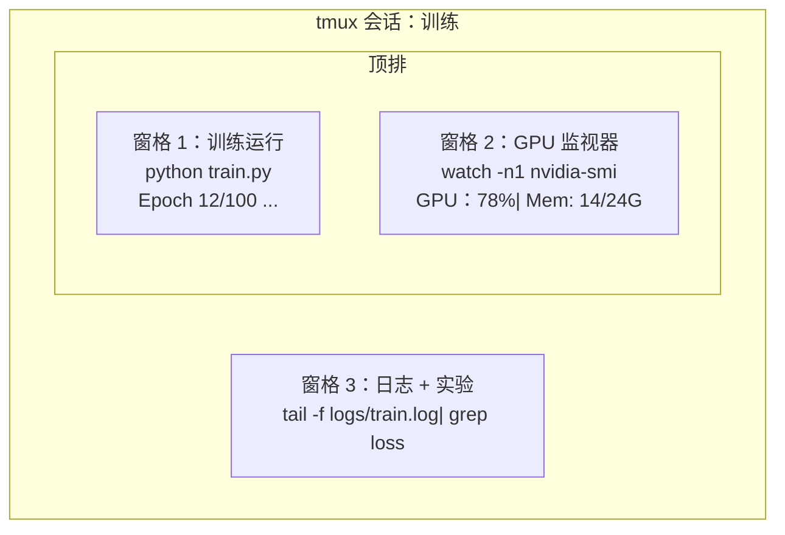

# 终端和Shell

> 终端是AI工程师居住的地方。在这里感到舒适。

**类型：** ** Learn
**语言：** ** --
**先修：** ** 第 0 阶段，第 01 课
**时间：** ** 约 35 分钟

## 学习目标

- 使用流水线、重定向和`grep`从命令行过滤和处理训练日志
- 创建具有多个窗格的持久 tmux 会话，以进行并发训练和 GPU 监控
- 使用`htop`、`nvtop`和`nvidia-smi`监控系统和GPU资源
- 使用 SSH、`scp` 和 `rsync` 在本地和远程计算机之间传输文件

＃＃ 问题

您在终端上花费的时间比在任何编辑器上花费的时间都多。训练运行、GPU 监控、日志跟踪、远程 SSH 会话、环境管理。每个人工智能工作流程都会触及Shell。如果你在这里很慢，那么你在任何地方都会很慢。

本课程涵盖对人工智能工作至关重要的终端技能。没有 Unix 的历史。没有深入理解 Bash 脚本。正是您所需要的。

## 概念



三件事同时运行。一个终端。您可以分离、回家、通过 SSH 重新连接，然后重新连接。训练持续进行。

## Build It

### 第 1 步：了解您的 shell

检查您正在运行哪个 shell：

```bash
echo $SHELL
```

大多数系统使用`bash`或`zsh`。两者都工作正常。本课程中的命令适用于任一情况。

需要了解的关键事项：

```bash
# Move around
cd ~/projects/ai-engineering-from-scratch
pwd
ls -la

# History search (most useful shortcut you'll learn)
# Ctrl+R then type part of a previous command
# Press Ctrl+R again to cycle through matches

# Clear terminal
clear   # or Ctrl+L

# Cancel a running command
# Ctrl+C

# Suspend a running command (resume with fg)
# Ctrl+Z
```

### 步骤 2：流水线和重定向

流水线将命令连接在一起。这就是处理日志、过滤输出和链接工具的方式。您将不断地使用它。

```bash
# Count how many times "loss" appears in a log
cat train.log | grep "loss" | wc -l

# Extract just the loss values from training output
grep "loss:" train.log | awk '{print $NF}' > losses.txt

# Watch a log file update in real time, filtering for errors
tail -f train.log | grep --line-buffered "ERROR"

# Sort experiments by final accuracy
grep "final_accuracy" results/*.log | sort -t= -k2 -n -r

# Redirect stdout and stderr to separate files
python train.py > output.log 2> errors.log

# Redirect both to the same file
python train.py > train_full.log 2>&1
```

您需要的三个重定向：

|符号|它有什么作用 |
|--------|-------------|
| `>` |将标准输出写入文件（覆盖） |
| `>>` |将标准输出附加到文件 |
| `2>` |将 stderr 写入文件 |
| `2>&1` |将 stderr 发送到与 stdout 相同的位置 |
| `\|` |将一个命令的标准输出作为标准输入发送到下一个命令 |

### 步骤 3：后台进程

训练运行需要几个小时。您不想让终端一直打开。

```bash
# Run in background (output still goes to terminal)
python train.py &

# Run in background, immune to hangup (closing terminal won't kill it)
nohup python train.py > train.log 2>&1 &

# Check what's running in background
jobs
ps aux | grep train.py

# Bring a background job to foreground
fg %1

# Kill a background process
kill %1
# or find its PID and kill that
kill $(pgrep -f "train.py")
```

`&`、`nohup` 和 `screen`/`tmux` 之间的区别：

|方法|终端关闭后幸存？ |可以重新连接吗？ |
|--------|-------------------------|---------------|
| `command &` |没有 |没有 |
| `nohup command &` |是的 |否（检查日志文件）|
| `screen` / `tmux` |是的 |是的 |

对于超过几分钟的时间，请使用 tmux。

### 步骤 4：tmux

tmux 允许您创建具有多个窗格的持久终端会话。这是管理训练运行的最有用的工具。

```bash
# Install
# macOS
brew install tmux
# Ubuntu
sudo apt install tmux

# Start a named session
tmux new -s training

# Split horizontally
# Ctrl+B then "

# Split vertically
# Ctrl+B then %

# Navigate between panes
# Ctrl+B then arrow keys

# Detach (session keeps running)
# Ctrl+B then d

# Reattach
tmux attach -t training

# List sessions
tmux ls

# Kill a session
tmux kill-session -t training
```

典型的 AI 工作流程会话：

```bash
tmux new -s train

# Pane 1: start training
python train.py --epochs 100 --lr 1e-4

# Ctrl+B, " to split, then run GPU monitor
watch -n1 nvidia-smi

# Ctrl+B, % to split vertically, tail the logs
tail -f logs/experiment.log

# Now detach with Ctrl+B, d
# SSH out, go get coffee, come back
# tmux attach -t train
```

### 步骤 5：使用 htop 和 nvtop 进行监控

```bash
# System processes (better than top)
htop

# GPU processes (if you have NVIDIA GPU)
# Install: sudo apt install nvtop (Ubuntu) or brew install nvtop (macOS)
nvtop

# Quick GPU check without nvtop
nvidia-smi

# Watch GPU usage update every second
watch -n1 nvidia-smi

# See which processes are using the GPU
nvidia-smi --query-compute-apps=pid,name,used_memory --format=csv
```

`htop` 您将使用的键绑定：
- `F6` 或 `>` 按列排序（按内存排序以查找内存泄漏）
- `F5` 切换树视图（查看子进程）
- `F9` 终止进程
- `/` 搜索进程名称

### 步骤 6：远程 GPU 盒的 SSH

当您租用云 GPU（Lambda、RunPod、Vast.ai）时，您可以通过 SSH 进行连接。

```bash
# Basic connection
ssh user@gpu-box-ip

# With a specific key
ssh -i ~/.ssh/my_gpu_key user@gpu-box-ip

# Copy files to remote
scp model.pt user@gpu-box-ip:~/models/

# Copy files from remote
scp user@gpu-box-ip:~/results/metrics.json ./

# Sync a whole directory (faster for many files)
rsync -avz ./data/ user@gpu-box-ip:~/data/

# Port forward (access remote Jupyter/TensorBoard locally)
ssh -L 8888:localhost:8888 user@gpu-box-ip
# Now open localhost:8888 in your browser

# SSH config for convenience
# Add to ~/.ssh/config:
# Host gpu
#     HostName 192.168.1.100
#     User ubuntu
#     IdentityFile ~/.ssh/gpu_key
#
# Then just:
# ssh gpu
```

### 第 7 步：对 AI 工作有用的别名

将这些添加到您的`~/.bashrc`或`~/.zshrc`：

```bash
source phases/00-setup-and-tooling-环境搭建与工具链/10-terminal-and-shell-终端与shell/code/shell_aliases.sh
```

或者复制你想要的。关键别名：

```bash
# GPU status at a glance
alias gpu='nvidia-smi --query-gpu=index,name,utilization.gpu,memory.used,memory.total,temperature.gpu --format=csv,noheader'

# Kill all Python training processes
alias killtraining='pkill -f "python.*train"'

# Quick virtual environment activate
alias ae='source .venv/bin/activate'

# Watch training loss
alias watchloss='tail -f logs/*.log | grep --line-buffered "loss"'
```

完整套件请参见`code/shell_aliases.sh`。

### 步骤8：常见的AI终端模式

这些在实践中反复出现：

```bash
# Run training, log everything, notify when done
python train.py 2>&1 | tee train.log; echo "DONE" | mail -s "Training complete" you@email.com

# Compare two experiment logs side by side
diff <(grep "accuracy" exp1.log) <(grep "accuracy" exp2.log)

# Find the largest model files (clean up disk space)
find . -name "*.pt" -o -name "*.safetensors" | xargs du -h | sort -rh | head -20

# Download a model from Hugging Face
wget https://huggingface.co/model/resolve/main/model.safetensors

# Untar a dataset
tar xzf dataset.tar.gz -C ./data/

# Count lines in all Python files (see how big your project is)
find . -name "*.py" | xargs wc -l | tail -1

# Check disk space (training data fills disks fast)
df -h
du -sh ./data/*

# Environment variable check before training
env | grep -i cuda
env | grep -i torch
```

## Use It

以下是本课程中每个工具发挥作用的时间：

|工具|当你使用它时 |
|------|----------------|
|多路复用器 |每次训练（第 3 阶段以上）|
| `tail -f` + `grep` |监控培训日志 |
| `nohup` / `&` |快速后台任务|
| `htop` / `nvtop` |调试训练缓慢、OOM 错误 |
| SSH + `rsync` |使用云 GPU |
|流水线+重定向|处理实验结果|
|别名 |节省重复命令的时间 |

## 练习

1. 安装 tmux，创建一个具有三个窗格的会话，并在其中一个窗格中运行 `htop`，在另一个窗格中运行 `watch -n1 date`，并在第三个窗格中运行 Python 脚本。分离并重新连接。
2. 将 `code/shell_aliases.sh` 中的别名添加到 shell 配置中，并使用 `source ~/.zshrc`（或 `~/.bashrc`）重新加载。
3. 使用`for i in $(seq 1 100); do echo "epoch $i loss: $(echo "scale=4; 1/$i" | bc)"; sleep 0.1; done > fake_train.log` 创建一个假训练日志，然后使用`grep`、`tail` 和`awk` 仅提取损失值。
4. 为您有权访问的服务器设置 SSH 配置条目（或使用`localhost` 练习语法）。

## 关键术语

|术语 |人们怎么说|它实际上意味着什么 |
|------|----------------|----------------------|
|壳牌| “终端” |解释您的命令的程序（bash、zsh、fish） |
|多路复用器 | “终端多路复用器” |一种允许您在一个窗口内运行多个终端会话的程序，以及 detach/reattach |
|管材| “酒吧事”| `\|` 运算符将一个命令的输出作为输入发送到另一个 |
| PID| “进程ID” |分配给每个正在运行的进程的唯一编号，用于监视或终止它 |
|诺哈普 | “没有挂断”|运行不受挂断信号影响的命令，因此关闭终端不会杀死它 |
| SSH | “连接到服务器” | Secure Shell，一种用于在远程计算机上运行命令的加密协议
