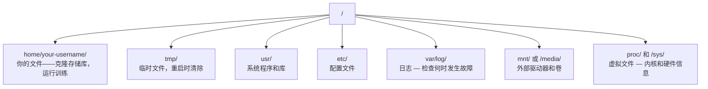

# 面向人工智能的 Linux

> 大多数 AI 都在 Linux 上运行。您需要了解足够的信息才能不被卡住。

**类型：** ** Learn
**语言：** ** --
**先修：** ** 第 0 阶段，第 01 课
**时间：** ** 约 30 分钟

## 学习目标

- 浏览 Linux 文件系统并从命令行执行基本文件操作
- 使用`chmod`和`chown`管理文件权限以解决“权限被拒绝”错误
- 使用`apt`安装系统包并为AI工作设置一个新的GPU盒
- 识别 macOS 与 Linux 之间的差异，这些差异通常会困扰在远程计算机上工作的开发人员

＃＃ 问题

您在 macOS 或 Windows 上进行开发。但是，当您通过 SSH 连接到云 GPU 盒子、租用 Lambda 实例或启动 EC2 机器时，您就会进入 Ubuntu。终端是您唯一的界面。没有 Finder、没有 Explorer、没有 GUI。如果您无法从命令行导航文件系统、安装软件包和管理进程，那么您将不得不在谷歌搜索“如何在 Linux 中解压缩文件”时为闲置的 GPU 时间付费。

这是一本生存指南。它完全涵盖了在远程 Linux 机器上进行 AI 工作所需的操作。而已。

## 文件系统布局

Linux 将所有内容组织在单个根`/` 下。没有`C:\` 或`/Volumes`。您将实际接触的目录：



您的主目录是`~` 或`/home/your-username`。几乎你所做的一切都发生在这里。

## 基本命令

这 15 个命令涵盖了您在远程 GPU 盒上执行的 95% 的操作。

### 四处走动

```bash
pwd                         # Where am I?
ls                          # What's here?
ls -la                      # What's here, including hidden files with details?
cd /path/to/dir             # Go there
cd ~                        # Go home
cd ..                       # Go up one level
```

### 文件和目录

```bash
mkdir my-project            # Create a directory
mkdir -p a/b/c              # Create nested directories in one shot

cp file.txt backup.txt      # Copy a file
cp -r src/ src-backup/      # Copy a directory (recursive)

mv old.txt new.txt          # Rename a file
mv file.txt /tmp/           # Move a file

rm file.txt                 # Delete a file (no trash, it's gone)
rm -rf my-dir/              # Delete a directory and everything inside
```

`rm -rf` 是永久的。无法撤消。在按 Enter 之前仔细检查路径。

### 读取文件

```bash
cat file.txt                # Print entire file
head -20 file.txt           # First 20 lines
tail -20 file.txt           # Last 20 lines
tail -f log.txt             # Follow a log file in real time (Ctrl+C to stop)
less file.txt               # Scroll through a file (q to quit)
```

### 搜索

```bash
grep "error" training.log           # Find lines containing "error"
grep -r "learning_rate" .           # Search all files in current directory
grep -i "cuda" config.yaml          # Case-insensitive search

find . -name "*.py"                 # Find all Python files under current dir
find . -name "*.ckpt" -size +1G     # Find checkpoint files larger than 1GB
```

## 权限

Linux 中的每个文件都有一个所有者和权限位。当脚本无法执行或无法写入目录时，您就会遇到这种情况。

```bash
ls -l train.py
# -rwxr-xr-- 1 user group 2048 Mar 19 10:00 train.py
#  ^^^             owner permissions: read, write, execute
#     ^^^          group permissions: read, execute
#        ^^        everyone else: read only
```

常见修复：

```bash
chmod +x train.sh           # Make a script executable
chmod 755 deploy.sh         # Owner: full, others: read+execute
chmod 644 config.yaml       # Owner: read+write, others: read only

chown user:group file.txt   # Change who owns a file (needs sudo)
```

当出现“权限被拒绝”时，几乎总是权限问题。 `chmod +x` 或 `sudo` 将解决大多数情况。

## 包管理（apt）

Ubuntu 使用`apt`。这就是安装系统级软件的方式。

```bash
sudo apt update             # Refresh the package list (always do this first)
sudo apt install -y htop    # Install a package (-y skips confirmation)
sudo apt install -y build-essential  # C compiler, make, etc. Needed by many Python packages
sudo apt install -y tmux    # Terminal multiplexer (keep sessions alive after disconnect)

apt list --installed        # What's installed?
sudo apt remove htop        # Uninstall
```

您将在新的 GPU 盒子上安装的常用软件包：

```bash
sudo apt update && sudo apt install -y \
    build-essential \
    git \
    curl \
    wget \
    tmux \
    htop \
    unzip \
    python3-venv
```

## 用户和 sudo

您通常以普通用户身份登录。某些操作需要 root（管理员）访问权限。

```bash
whoami                      # What user am I?
sudo command                # Run a single command as root
sudo su                     # Become root (exit to go back, use sparingly)
```

在云 GPU 实例上，您通常是唯一的用户并且已经拥有 sudo 访问权限。不要以 root 身份运行所有内容。仅在需要时使用 sudo。

## 进程和系统

当您的训练挂起，或者您需要检查正在运行的内容时：

```bash
htop                        # Interactive process viewer (q to quit)
ps aux | grep python        # Find running Python processes
kill 12345                  # Gracefully stop process with PID 12345
kill -9 12345               # Force kill (use when graceful doesn't work)
nvidia-smi                  # GPU processes and memory usage
```

systemd 管理服务（后台守护进程）。如果您运行推理服务器，您将使用它：

```bash
sudo systemctl start nginx          # Start a service
sudo systemctl stop nginx           # Stop it
sudo systemctl restart nginx        # Restart it
sudo systemctl status nginx         # Check if it's running
sudo systemctl enable nginx         # Start automatically on boot
```

## 磁盘空间

GPU 盒的磁盘空间通常有限。模型和数据集很快就填满了。

```bash
df -h                       # Disk usage for all mounted drives
df -h /home                 # Disk usage for /home specifically

du -sh *                    # Size of each item in current directory
du -sh ~/.cache             # Size of your cache (pip, huggingface models land here)
du -sh /data/checkpoints/   # Check how big your checkpoints are

# Find the biggest space hogs
du -h --max-depth=1 / 2>/dev/null | sort -hr | head -20
```

常见的节省空间的方法：

```bash
# Clear pip cache
pip cache purge

# Clear apt cache
sudo apt clean

# Remove old checkpoints you don't need
rm -rf checkpoints/epoch_01/ checkpoints/epoch_02/
```

## 网络

您将下载模型、传输文件并从命令行调用 API。

```bash
# Download files
wget https://example.com/model.bin                   # Download a file
curl -O https://example.com/data.tar.gz              # Same thing with curl
curl -s https://api.example.com/health | python3 -m json.tool  # Hit an API, pretty-print JSON

# Transfer files between machines
scp model.bin user@remote:/data/                     # Copy file to remote machine
scp user@remote:/data/results.csv .                  # Copy file from remote to local
scp -r user@remote:/data/checkpoints/ ./local-dir/   # Copy directory

# Sync directories (faster than scp for large transfers, resumes on failure)
rsync -avz --progress ./data/ user@remote:/data/
rsync -avz --progress user@remote:/results/ ./results/
```

对于任何大的东西，使用`rsync`而不是`scp`。它仅传输更改的字节并处理中断的连接。

## tmux：保持会话存活

当您通过 SSH 连接到远程设备时，关闭Notebook电脑会终止您的训练。 tmux 可以防止这种情况发生。

```bash
tmux new -s train           # Start a new session named "train"
# ... start your training, then:
# Ctrl+B, then D            # Detach (training keeps running)

tmux ls                     # List sessions
tmux attach -t train        # Reattach to session

# Inside tmux:
# Ctrl+B, then %            # Split pane vertically
# Ctrl+B, then "            # Split pane horizontally
# Ctrl+B, then arrow keys   # Switch between panes
```

始终在 tmux 内运行长时间的训练作业。总是。

## 适用于 Windows 用户的 WSL2

如果您使用的是 Windows，WSL2 将为您提供真正的 Linux 环境，无需双引导。

```bash
# In PowerShell (admin)
wsl --install -d Ubuntu-24.04

# After restart, open Ubuntu from Start menu
sudo apt update && sudo apt upgrade -y
```

WSL2 运行真正的 Linux 内核。本课中的所有内容都在其中运行。您的 Windows 文件位于 WSL 内部的 `/mnt/c/Users/YourName/` 处。

GPU 直通可与 Windows 端安装的 NVIDIA 驱动程序配合使用。安装 Windows NVIDIA 驱动程序（不是 Linux 驱动程序），CUDA 将在 WSL2 中可用。

## 陷阱：macOS 到 Linux

如果您来自 macOS，可能会遇到以下问题：

| macOS | Linux |笔记|
|-------|-------|-------|
| `brew install` | `sudo apt install` |有时包名不同。 `brew install htop` 与 `sudo apt install htop` 的工作原理相同，但 `brew install readline` 与 `sudo apt install libreadline-dev` 的工作原理不同。 |
| `open file.txt` | `xdg-open file.txt` |但远程盒子上不会有 GUI。使用`cat` 或`less`。 |
| `pbcopy` / `pbpaste` |不可用 | SSH 上不存在流水线 to/from 剪贴板。 |
| `~/.zshrc` | `~/.bashrc` | macOS 默认为 zsh。大多数 Linux 服务器使用 bash。 |
| `/opt/homebrew/` | `/usr/bin/`、`/usr/local/bin/` |二进制文件位于不同的地方。 |
| `sed -i '' 's/a/b/' file` | `sed -i 's/a/b/' file` | macOS sed 在 `-i` 之后需要一个空字符串。 Linux 没有。 |
|不区分大小写的文件系统 |区分大小写的文件系统 | `Model.py` 和 `model.py` 是 Linux 上的两个不同文件。 |
|行结尾`\n` |行结尾`\n` |相同的。但 Windows 使用 `\r\n`，这会破坏 bash 脚本。运行`dos2unix` 进行修复。 |

## 快速参考卡

```
Navigation:     pwd, ls, cd, find
Files:          cp, mv, rm, mkdir, cat, head, tail, less
Search:         grep, find
Permissions:    chmod, chown, sudo
Packages:       apt update, apt install
Processes:      htop, ps, kill, nvidia-smi
Services:       systemctl start/stop/restart/status
Disk:           df -h, du -sh
Network:        curl, wget, scp, rsync
Sessions:       tmux new/attach/detach
```

## 练习

1. 通过 SSH 连接到任何 Linux 计算机（或打开 WSL2）并导航到您的主目录。创建一个项目文件夹，在其中使用`touch`创建三个空文件，然后使用`ls -la`列出它们。
2. 使用 apt 安装`htop`，运行它，并确定哪个进程使用的内存最多。
3. 启动 tmux 会话，在其中运行 `sleep 300`，分离、列出会话并重新附加。
4. 使用`df -h` 检查可用磁盘空间，然后使用`du -sh ~/.cache/*` 查找占用缓存空间的内容。
5. 使用`scp` 将文件从本地计算机传输到远程计算机，然后使用`rsync` 进行相同的传输并比较体验。
