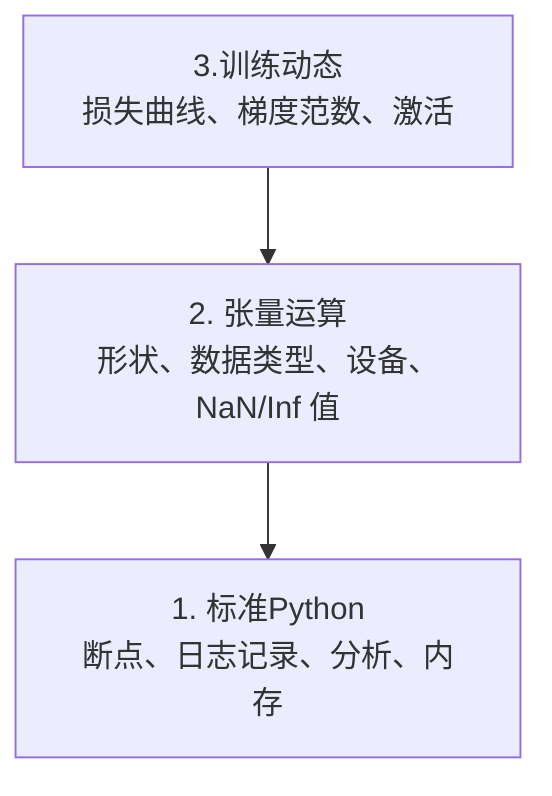

# 调试和分析

> 最严重的人工智能错误不会崩溃。他们默默地对垃圾进行训练，并报告了美丽的损失曲线。

**类型：** ** Build
**语言:** Python
**先修：** ** 第 1 课（开发环境），基本熟悉 PyTorch
**时间：** ** 约 60 分钟

## 学习目标

- 使用条件 `breakpoint()` 和 `debug_print` 在训练中检查张量形状、dtypes 和 NaN 值
- 使用`cProfile`、`line_profiler` 和`tracemalloc` 分析训练循环以查找瓶颈
- 检测常见的人工智能错误：形状不匹配、NaN 丢失、数据泄漏和错误的设备张量
- 设置 TensorBoard 以可视化损失曲线、权重直方图和梯度分布

＃＃ 问题

AI 代码的失败方式与常规代码不同。 Web 应用程序因堆栈跟踪而崩溃。配置错误的训练循环运行了 8 个小时，消耗了 200 美元的 GPU 时间，并生成了一个可以预测每个输入平均值的模型。代码从未出错。该错误是错误设备上的张量、被遗忘的 `.detach()` 或标签泄漏到函数中。

您需要调试工具来捕获这些无声故障，以免它们浪费您的时间和计算。

## 概念

AI 调试分为三个级别：



大多数人直接跳到第 3 级（盯着 TensorBoard）。但 80% 的 AI 错误存在于 1 级和 2 级。

## Build It

### 第 1 部分：打印调试（是的，它有效）

打印调试被驳回。不应该。对于张量代码，目标打印语句胜过单步执行调试器，因为您需要同时查看形状、数据类型和值范围。

```python
def debug_print(name, tensor):
    print(f"{name}: shape={tensor.shape}, dtype={tensor.dtype}, "
          f"device={tensor.device}, "
          f"min={tensor.min().item():.4f}, max={tensor.max().item():.4f}, "
          f"mean={tensor.mean().item():.4f}, "
          f"has_nan={tensor.isnan().any().item()}")
```

每次可疑操作后调用此命令。发现错误后，删除印刷品。简单的。

### 第 2 部分：Python 调试器（pdb 和断点）

内置调试器对于人工智能工作的作用被低估了。将 `breakpoint()` 放入训练循环中并以交互方式检查张量。

```python
def training_step(model, batch, criterion, optimizer):
    inputs, labels = batch
    outputs = model(inputs)
    loss = criterion(outputs, labels)

    if loss.item() > 100 or torch.isnan(loss):
        breakpoint()

    loss.backward()
    optimizer.step()
```

当调试器将您带入时，有用的命令：

- `p outputs.shape` 检查形状
- `p loss.item()` 查看损失值
- `p torch.isnan(outputs).sum()` 来计算 NaN
- `p model.fc1.weight.grad` 检查梯度
- `c` 继续，`q` 退出

这就是条件调试。只有当事情看起来不对劲时你才会停下来。对于 10,000 步训练来说，这一点很重要。

### 第 3 部分：Python 日志记录

当您的调试超出快速检查范围时，请用日志记录替换打印语句。

```python
import logging

logging.basicConfig(
    level=logging.INFO,
    format="%(asctime)s [%(levelname)s] %(message)s",
    handlers=[
        logging.FileHandler("training.log"),
        logging.StreamHandler()
    ]
)
logger = logging.getLogger(__name__)

logger.info("Starting training: lr=%.4f, batch_size=%d", lr, batch_size)
logger.warning("Loss spike detected: %.4f at step %d", loss.item(), step)
logger.error("NaN loss at step %d, stopping", step)
```

日志记录为您提供时间戳、严重性级别和文件输出。当训练运行在凌晨 3 点失败时，您需要一个日志文件，而不是滚动到屏幕外的终端输出。

### 第 4 部分：时序代码部分

了解时间去向是优化的第一步。

```python
import time

class Timer:
    def __init__(self, name=""):
        self.name = name

    def __enter__(self):
        self.start = time.perf_counter()
        return self

    def __exit__(self, *args):
        elapsed = time.perf_counter() - self.start
        print(f"[{self.name}] {elapsed:.4f}s")

with Timer("data loading"):
    batch = next(dataloader_iter)

with Timer("forward pass"):
    outputs = model(batch)

with Timer("backward pass"):
    loss.backward()
```

常见发现：数据加载占用了 60% 的训练时间。修复方法是 DataLoader 中的`num_workers > 0`，而不是更快的 GPU。

### 第 5 部分：cProfile 和 line_profiler

当您需要的不仅仅是手动计时器时：

```bash
python -m cProfile -s cumtime train.py
```

这显示了按累积时间排序的每个函数调用。对于逐行分析：

```bash
pip install line_profiler
```

```python
@profile
def train_step(model, data, target):
    output = model(data)
    loss = F.cross_entropy(output, target)
    loss.backward()
    return loss

# Run with: kernprof -l -v train.py
```

### 第 6 部分：内存分析

#### CPU 内存与tracemalloc

```python
import tracemalloc

tracemalloc.start()

# your code here
model = build_model()
data = load_dataset()

snapshot = tracemalloc.take_snapshot()
top_stats = snapshot.statistics("lineno")
for stat in top_stats[:10]:
    print(stat)
```

#### CPU 内存与内存分析器

```bash
pip install memory_profiler
```

```python
from memory_profiler import profile

@profile
def load_data():
    raw = read_csv("data.csv")       # watch memory jump here
    processed = preprocess(raw)       # and here
    return processed
```

使用 `python -m memory_profiler your_script.py` 运行以查看逐行内存使用情况。

#### PyTorch 的 GPU 内存

```python
import torch

if torch.cuda.is_available():
    print(torch.cuda.memory_summary())

    print(f"Allocated: {torch.cuda.memory_allocated() / 1e9:.2f} GB")
    print(f"Cached: {torch.cuda.memory_reserved() / 1e9:.2f} GB")
```

当您遇到 OOM（内存不足）时：

1. 减少批大小（始终是首先尝试的事情）
2.使用`torch.cuda.empty_cache()`释放缓存内存
3. 对于大型中间体，使用`del tensor`，然后使用`torch.cuda.empty_cache()`
4. 使用混合精度（`torch.cuda.amp`）将内存使用量减半
5. 对非常深的模型使用梯度检查点

### 第 7 部分：常见的 AI 错误以及如何捕获它们

#### 形状不匹配

最常见的错误。当模型期望 `[batch, channels, height, width]` 时，张量的形状为 `[batch, features]`。

```python
def check_shapes(model, sample_input):
    print(f"Input: {sample_input.shape}")
    hooks = []

    def make_hook(name):
        def hook(module, inp, out):
            in_shape = inp[0].shape if isinstance(inp, tuple) else inp.shape
            out_shape = out.shape if hasattr(out, "shape") else type(out)
            print(f"  {name}: {in_shape} -> {out_shape}")
        return hook

    for name, module in model.named_modules():
        hooks.append(module.register_forward_hook(make_hook(name)))

    with torch.no_grad():
        model(sample_input)

    for h in hooks:
        h.remove()
```

使用样本批次运行一次。它映射模型中的每个形状变换。

#### NaN 损失

NaN 损失意味着某物爆炸了。常见原因：

- 学习率太高
- 海关损失除以零
- 零或负数的对数
- RNN 中的梯度爆炸

```python
def detect_nan(model, loss, step):
    if torch.isnan(loss):
        print(f"NaN loss at step {step}")
        for name, param in model.named_parameters():
            if param.grad is not None:
                if torch.isnan(param.grad).any():
                    print(f"  NaN gradient in {name}")
                if torch.isinf(param.grad).any():
                    print(f"  Inf gradient in {name}")
        return True
    return False
```

#### 数据泄露

您的模型在测试集上的准确率达到 99%。听起来很棒。这是一个错误。

```python
def check_data_leakage(train_set, test_set, id_column="id"):
    train_ids = set(train_set[id_column].tolist())
    test_ids = set(test_set[id_column].tolist())
    overlap = train_ids & test_ids
    if overlap:
        print(f"DATA LEAKAGE: {len(overlap)} samples in both train and test")
        return True
    return False
```

还要检查时间泄漏：使用未来的数据来预测过去。分割前按时间戳排序。

#### 设备错误

不同设备（CPU 与 GPU）上的张量会导致运行时错误。但有时张量会默默地保留在 CPU 上，而其他所有内容都在 GPU 上，并且训练运行缓慢。

```python
def check_devices(model, *tensors):
    model_device = next(model.parameters()).device
    print(f"Model device: {model_device}")
    for i, t in enumerate(tensors):
        if t.device != model_device:
            print(f"  WARNING: tensor {i} on {t.device}, model on {model_device}")
```

### 第 8 部分：TensorBoard 基础知识

TensorBoard 向您展示训练中一段时间​​内发生的情况。

```bash
pip install tensorboard
```

```python
from torch.utils.tensorboard import SummaryWriter

writer = SummaryWriter("runs/experiment_1")

for step in range(num_steps):
    loss = train_step(model, batch)

    writer.add_scalar("loss/train", loss.item(), step)
    writer.add_scalar("lr", optimizer.param_groups[0]["lr"], step)

    if step % 100 == 0:
        for name, param in model.named_parameters():
            writer.add_histogram(f"weights/{name}", param, step)
            if param.grad is not None:
                writer.add_histogram(f"grads/{name}", param.grad, step)

writer.close()
```

启动它：

```bash
tensorboard --logdir=runs
```

寻找什么：

- **损失不减少**：学习率太低，或者模型架构问题
- **损失剧烈波动**：学习率太高
- **损失为 NaN**：数值不稳定（参见上面的 NaN 部分）
- **训练损失减少，val损失增加**：过度拟合
- **权重直方图崩溃为零**：梯度消失
- **梯度直方图爆炸**：需要梯度裁剪

### 第 9 部分：VS 代码调试器

对于交互式调试，请使用 `launch.json` 配置 VS Code：

```json
{
    "version": "0.2.0",
    "configurations": [
        {
            "name": "Debug Training",
            "type": "debugpy",
            "request": "launch",
            "program": "${file}",
            "console": "integratedTerminal",
            "justMyCode": false
        }
    ]
}
```

通过单击装订线设置断点。使用“变量”窗格检查张量属性。调试控制台允许您在执行过程中运行任意 Python 表达式。

对于单步执行您想要查看每个转换的数据预处理流水线非常有用。

## Use It

以下是捕获大多数 AI 错误的调试工作流程：

1. **训练之前**：使用样本批次运行`check_shapes`。验证输入和输出尺寸是否符合预期。
2. **前 10 个步骤**：对损失、输出和梯度使用 `debug_print`。确认没有任何内容为 NaN 并且值在合理范围内。
3. **训练期间**：对数损失、学习率和梯度范数。使用 TensorBoard 进行可视化。
4. **当出现故障时**：在故障点删除`breakpoint()`。交互式检查张量。
5. **为性能**：计算数据加载、前向传递和后向传递的时间。如果您接近 OOM，请配置内存。

## 发货

运行调试工具包脚本：

```bash
python phases/00-setup-and-tooling-环境搭建与工具链/12-debugging-and-profiling-debugging与性能分析/code/debug_tools.py
```

请参阅 `outputs/prompt-debug-ai-code.md` 以获取有助于诊断 AI 特定错误的提示。

## 练习

1. 运行`debug_tools.py` 并通读每个部分的输出。修改虚拟模型以引入 NaN（提示：在前向传递中除以零）并观察检测器捕获它。
2. 使用`cProfile` 分析训练循环并确定最慢的函数。
3. 使用`tracemalloc` 查找数据加载流水线中的哪一行分配了最多内存。
4. 设置 TensorBoard 进行简单的训练运行并识别模型是否过度拟合。
5. 在训练循环中使用`breakpoint()`。练习从调试器提示符中检查张量形状、设备和梯度值。
