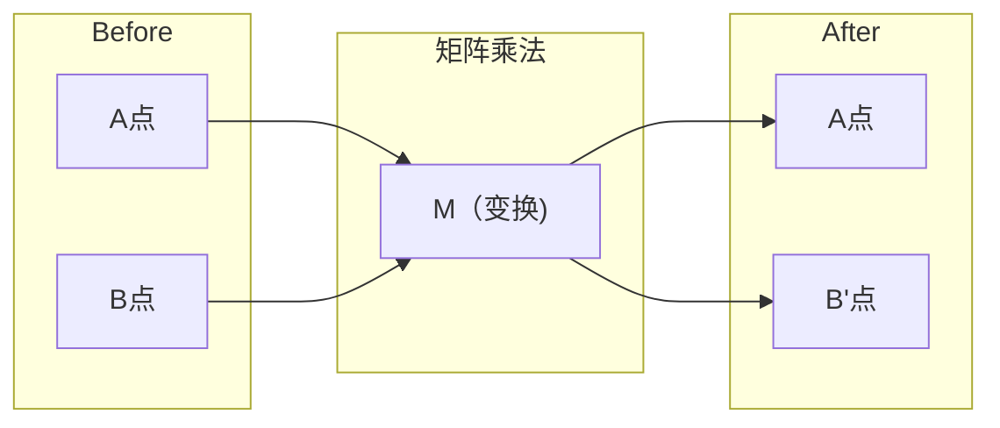
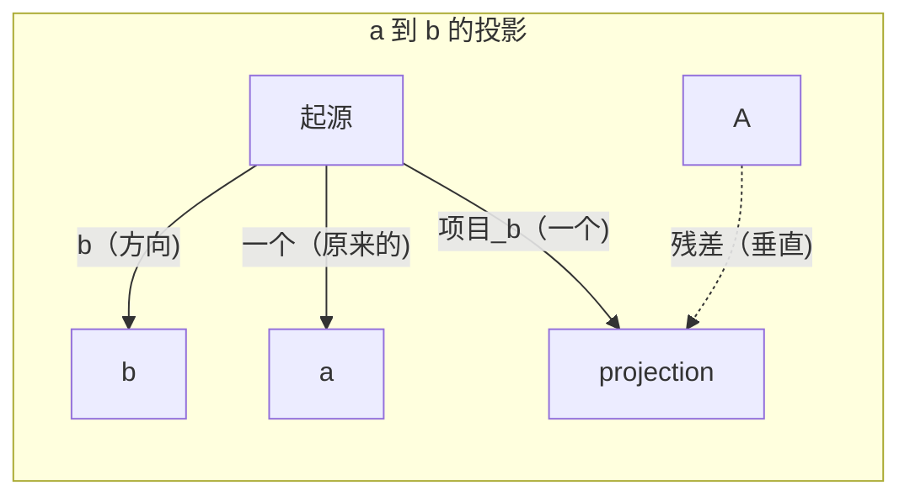

# 线性代数直觉

> 每个人工智能模型都只是戴着一顶花哨帽子的矩阵数学。

**类型：** ** Learn
**语言：** ** Python, Julia
**先修：** ** 阶段 0
**时间：** ** 约 60 分钟

## 学习目标

- 在 Python 中从头开始实现向量和矩阵运算（加法、点积、矩阵乘法）
- 从几何角度解释点积、投影和 Gram-Schmidt 过程的作用
- 使用行缩减确定一组向量的线性独立性、秩和基础
- 将线性代数概念与其人工智能应用联系起来：嵌入、注意力评分和 LoRA

＃＃ 问题

打开任意 ML 论文。在第一页中，您将看到向量、矩阵、点积和变换。如果没有线性代数直觉，这些只是符号。有了它，您可以看到神经网络实际上在做什么——在空间中移动点。

你不需要成为一名数学家。您需要了解这些运算的几何含义，然后自己编写代码。

## 概念

### 向量是点（和方向）

向量只是一个数字列表。但这些数字有一定的意义——它们是空间坐标。

**2D 向量 [3, 2]:**

| x| y |点|
|---|---|-------|
| 3 | 2 |平面上从原点 (0,0) 到 (3, 2) 的矢量点 |

该向量的大小为 sqrt(3^2 + 2^2) = sqrt(13) 并指向上方和右侧。

在人工智能中，向量代表一切：
- 一个单词→一个由 768 个数字组成的向量（它在嵌入空间中的“含义”）
- 图像 → 数百万像素值的向量
- 用户 → 偏好向量

### 矩阵就是变换

矩阵将一个向量变换为另一个向量。它可以旋转、缩放、拉伸或投影。



在人工智能中，矩阵就是模型：
- 神经网络权重→将输入转换为输出的矩阵
- 注意力分数 → 决定关注什么的矩阵
- 嵌入 → 将单词映射到向量的矩阵

### 点积测量相似度

两个向量的点积告诉您它们有多相似。

```
a · b = a₁×b₁ + a₂×b₂ + ... + aₙ×bₙ

Same direction:      a · b > 0  (similar)
Perpendicular:       a · b = 0  (unrelated)
Opposite direction:  a · b < 0  (dissimilar)
```

这就是搜索引擎、推荐系统和 RAG 的工作原理——查找具有高点积的向量。

### 线性无关性

如果集合中没有向量可以写成其他向量的组合，则向量是线性无关的。如果 v1、v2、v3 是独立的，则它们跨越 3D 空间。如果一个是其他的组合，它们只跨越一个平面。

为什么它对人工智能很重要：你的特征矩阵应该具有线性独立的列。如果两个特征完全相关（线性相关），则模型无法区分它们的影响。这会导致回归中的多重共线性——权重矩阵变得不稳定，小的输入变化会产生剧烈的输出波动。

**具体例子：**

```
v1 = [1, 0, 0]
v2 = [0, 1, 0]
v3 = [2, 1, 0]   # v3 = 2*v1 + v2
```

v1 和 v2 是独立的——两者都不是标量倍数，也不是对方的组合。但 v3 = 2*v1 + v2，因此 {v1, v2, v3} 是一个依赖集。这三个向量都位于 xy 平面上。无论你如何组合它们，都无法达到[0,0,1]。你有三个向量，但只有两个自由维度。

在数据集中：如果 feature_3 = 2*feature_1 + feature_2，添加 feature_3 将为模型提供零新信息。更糟糕的是，它使正规方程变得奇异——权重没有唯一的解。

### 基础和排名

基是跨越整个空间的线性独立向量的最小集合。基向量的数量就是空间的维数。

3D 空间的标准基础是 {[1,0,0], [0,1,0], [0,0,1]}。但 3D 中的任何三个独立向量都可以构成有效的基础。基础的选择就是坐标系的选择。

矩阵的秩 = 线性独立的列数 = 线性独立的行数。如果rank < min(rows, cols)，则矩阵是秩亏的。这意味着：
- 系统有无限多个解（或没有）
- 信息在转换中丢失
- 矩阵不能逆

|情况|排名|这对机器学习意味着什么？
|-----------|------|---------------------|
|满排名（排名 = min(m, n)）|最大可能 |存在唯一的最小二乘解。模型条件良好。 |
|排名不足（排名 < min(m, n)）|低于最大值 |特征是多余的。无穷多个权重解。需要正规化。 |
|排名 1 | 1 |每一列都是一个向量的缩放副本。所有数据都位于一条线上。 |
|近秩不足（小奇异值）|数值低|矩阵病态。微小的输入噪声会导致较大的输出变化。使用 SVD 截断或岭回归。 |

### 投影

将向量 **a** 投影到向量 **b** 上，得到 **a** 在 **b** 方向上的分量：

```
proj_b(a) = (a dot b / b dot b) * b
```

残差 (a - proj_b(a)) 垂直于 b。这种正交分解是最小二乘拟合的基础。

机器学习中的投影无处不在：
- 线性回归最小化观察到列空间的距离 - 解决方案是投影
- PCA 将数据投影到最大方差的方向
- 变压器中的注意力计算查询到键的投影



**示例：** a = [3, 4], b = [1, 0]

proj_b(a) = (3*1 + 4*0) / (1*1 + 0*0) * [1, 0] = 3 * [1, 0] = [3, 0]

投影会Dropout y 分量。这是最简单形式的降维——扔掉你不关心的方向。

### 格拉姆-施密特过程

将任何一组独立向量转换为标准正交基。正交表示每个向量的长度为 1 并且每对向量都是垂直的。

算法：
1. 取第一个向量，对其进行归一化
2. 取第二个向量，减去它在第一个向量上的投影，标准化
3. 取第三个向量，减去它在所有先前向量上的投影，标准化
4. 对剩余向量重复此操作

```
Input:  v1, v2, v3, ... (linearly independent)

u1 = v1 / |v1|

w2 = v2 - (v2 dot u1) * u1
u2 = w2 / |w2|

w3 = v3 - (v3 dot u1) * u1 - (v3 dot u2) * u2
u3 = w3 / |w3|

Output: u1, u2, u3, ... (orthonormal basis)
```

这就是 QR 分解的内部工作原理。 Q 是正交基，R 捕获投影系数。 QR 分解用于：
- 求解线性系统（比高斯消去法更稳定）
- 计算特征值（QR算法）
- 最小二乘回归（标准数值方法）

```figure
eigen-directions
```

## Build It

### 第 1 步：从头开始向量 (Python)

```python
class Vector:
    def __init__(self, components):
        self.components = list(components)
        self.dim = len(self.components)

    def __add__(self, other):
        return Vector([a + b for a, b in zip(self.components, other.components)])

    def __sub__(self, other):
        return Vector([a - b for a, b in zip(self.components, other.components)])

    def dot(self, other):
        return sum(a * b for a, b in zip(self.components, other.components))

    def magnitude(self):
        return sum(x**2 for x in self.components) ** 0.5

    def normalize(self):
        mag = self.magnitude()
        return Vector([x / mag for x in self.components])

    def cosine_similarity(self, other):
        return self.dot(other) / (self.magnitude() * other.magnitude())

    def __repr__(self):
        return f"Vector({self.components})"


a = Vector([1, 2, 3])
b = Vector([4, 5, 6])

print(f"a + b = {a + b}")
print(f"a · b = {a.dot(b)}")
print(f"|a| = {a.magnitude():.4f}")
print(f"cosine similarity = {a.cosine_similarity(b):.4f}")
```

### 步骤 2：从头开始矩阵 (Python)

```python
class Matrix:
    def __init__(self, rows):
        self.rows = [list(row) for row in rows]
        self.shape = (len(self.rows), len(self.rows[0]))

    def __matmul__(self, other):
        if isinstance(other, Vector):
            return Vector([
                sum(self.rows[i][j] * other.components[j] for j in range(self.shape[1]))
                for i in range(self.shape[0])
            ])
        rows = []
        for i in range(self.shape[0]):
            row = []
            for j in range(other.shape[1]):
                row.append(sum(
                    self.rows[i][k] * other.rows[k][j]
                    for k in range(self.shape[1])
                ))
            rows.append(row)
        return Matrix(rows)

    def transpose(self):
        return Matrix([
            [self.rows[j][i] for j in range(self.shape[0])]
            for i in range(self.shape[1])
        ])

    def __repr__(self):
        return f"Matrix({self.rows})"


rotation_90 = Matrix([[0, -1], [1, 0]])
point = Vector([3, 1])

rotated = rotation_90 @ point
print(f"Original: {point}")
print(f"Rotated 90°: {rotated}")
```

### 第 3 步：为什么这对人工智能很重要

```python
import random

random.seed(42)
weights = Matrix([[random.gauss(0, 0.1) for _ in range(3)] for _ in range(2)])
input_vector = Vector([1.0, 0.5, -0.3])

output = weights @ input_vector
print(f"Input (3D): {input_vector}")
print(f"Output (2D): {output}")
print("This is what a neural network layer does -- matrix multiplication.")
```

### 第 4 步：Julia 版本

```julia
a = [1.0, 2.0, 3.0]
b = [4.0, 5.0, 6.0]

println("a + b = ", a + b)
println("a · b = ", a ⋅ b)       # Julia supports unicode operators
println("|a| = ", √(a ⋅ a))
println("cosine = ", (a ⋅ b) / (√(a ⋅ a) * √(b ⋅ b)))

# Matrix-vector multiplication
W = [0.1 -0.2 0.3; 0.4 0.5 -0.1]
x = [1.0, 0.5, -0.3]
println("Wx = ", W * x)
println("This is a neural network layer.")
```

### 步骤 5：从头开始线性独立和投影 (Python)

```python
def is_linearly_independent(vectors):
    n = len(vectors)
    dim = len(vectors[0].components)
    mat = Matrix([v.components[:] for v in vectors])
    rows = [row[:] for row in mat.rows]
    rank = 0
    for col in range(dim):
        pivot = None
        for row in range(rank, len(rows)):
            if abs(rows[row][col]) > 1e-10:
                pivot = row
                break
        if pivot is None:
            continue
        rows[rank], rows[pivot] = rows[pivot], rows[rank]
        scale = rows[rank][col]
        rows[rank] = [x / scale for x in rows[rank]]
        for row in range(len(rows)):
            if row != rank and abs(rows[row][col]) > 1e-10:
                factor = rows[row][col]
                rows[row] = [rows[row][j] - factor * rows[rank][j] for j in range(dim)]
        rank += 1
    return rank == n


def project(a, b):
    scalar = a.dot(b) / b.dot(b)
    return Vector([scalar * x for x in b.components])


def gram_schmidt(vectors):
    orthonormal = []
    for v in vectors:
        w = v
        for u in orthonormal:
            proj = project(w, u)
            w = w - proj
        if w.magnitude() < 1e-10:
            continue
        orthonormal.append(w.normalize())
    return orthonormal


v1 = Vector([1, 0, 0])
v2 = Vector([1, 1, 0])
v3 = Vector([1, 1, 1])
basis = gram_schmidt([v1, v2, v3])
for i, u in enumerate(basis):
    print(f"u{i+1} = {u}")
    print(f"  |u{i+1}| = {u.magnitude():.6f}")

print(f"u1 · u2 = {basis[0].dot(basis[1]):.6f}")
print(f"u1 · u3 = {basis[0].dot(basis[2]):.6f}")
print(f"u2 · u3 = {basis[1].dot(basis[2]):.6f}")
```

## Use It

现在 NumPy 也是如此——您将在实践中实际使用它：

```python
import numpy as np

a = np.array([1, 2, 3], dtype=float)
b = np.array([4, 5, 6], dtype=float)

print(f"a + b = {a + b}")
print(f"a · b = {np.dot(a, b)}")
print(f"|a| = {np.linalg.norm(a):.4f}")
print(f"cosine = {np.dot(a, b) / (np.linalg.norm(a) * np.linalg.norm(b)):.4f}")

W = np.random.randn(2, 3) * 0.1
x = np.array([1.0, 0.5, -0.3])
print(f"Wx = {W @ x}")
```

### 使用 NumPy 进行排名、投影和 QR

```python
import numpy as np

A = np.array([[1, 2], [2, 4]])
print(f"Rank: {np.linalg.matrix_rank(A)}")

a = np.array([3, 4])
b = np.array([1, 0])
proj = (np.dot(a, b) / np.dot(b, b)) * b
print(f"Projection of {a} onto {b}: {proj}")

Q, R = np.linalg.qr(np.random.randn(3, 3))
print(f"Q is orthogonal: {np.allclose(Q @ Q.T, np.eye(3))}")
print(f"R is upper triangular: {np.allclose(R, np.triu(R))}")
```

### PyTorch -- 张量是带有 Autodiff 的向量

```python
import torch

x = torch.randn(3, requires_grad=True)
y = torch.tensor([1.0, 0.0, 0.0])

similarity = torch.dot(x, y)
similarity.backward()

print(f"x = {x.data}")
print(f"y = {y.data}")
print(f"dot product = {similarity.item():.4f}")
print(f"d(dot)/dx = {x.grad}")
```

点积相对于 x 的梯度就是 y。 PyTorch 自动计算这一点。神经网络中的每个操作都是由这样的操作构建的——矩阵乘法、点积、投影——并且自动微分通过所有这些操作来跟踪梯度。

您刚刚从头开始构建了 NumPy 在一行中所做的事情。现在您知道幕后发生了什么。

## 发货

本课产生：
- `outputs/prompt-linear-algebra-tutor.md` -- 提示人工智能助手通过几何直觉教授线性代数

## 连接

本课程中的所有内容都与现代人工智能的特定部分相关：

|概念 |它出现在哪里 |
|---------|------------------|
|点积| Transformer 中的注意力分数、RAG 中的余弦相似度 |
|矩阵乘法 |每个神经网络层，每个线性变换 |
|线性独立|特征选择，避免多重共线性 |
|排名|确定系统是否可解，LoRA（低秩自适应）|
|投影|线性回归（投影到列空间），PCA |
|格拉姆-施密特 / QR |数值求解器，特征值计算 |
|正交基 |稳定的数值计算，白化变换 |

LoRA 值得特别提及。它通过将权重更新分解为低秩矩阵来微调大型语言模型。 LoRA 不更新 4096x4096 权重矩阵（16M 参数），而是更新两个大小为 4096x16 和 16x4096 的矩阵（131K 参数）。 16 级约束意味着 LoRA 假设权重更新位于完整 4096 维空间的 16 维子空间中。这就是线性代数在做真正的工作。

## 练习

1. 实现`Vector.angle_between(other)`，返回两个向量之间的角度（以度为单位）
2. 创建一个 2D 缩放矩阵，将 x 坐标加倍，将 y 坐标加倍，然后将其应用于向量 [1, 1]
3. 给定 5 个随机词类向量（维度 50），使用余弦相似度找到两个最相似的向量
4. 验证 Gram-Schmidt 输出是否真正正交：检查每对的点积为 0 并且每个向量的量值为 1
5. 创建一个秩为 2 的 3x3 矩阵。使用 `rank()` 方法进行验证。然后解释柱子跨越的几何对象。
6. 将向量 [1, 2, 3] 投影到 [1, 1, 1] 上。结果在几何上代表什么？

## 关键术语

|术语 |人们怎么说|它实际上意味着什么 |
|------|----------------|----------------------|
|矢量| “一支箭”|表示 n 维空间中的点或方向的数字列表 |
|矩阵| “数字表” |将向量从一个空间映射到另一个空间的变换 |
|点积| “乘法和求和”|衡量两个向量的对齐程度——相似性搜索的核心 |
|嵌入| “一些人工智能魔法”|表示某事物（单词、图像、用户）含义的向量 |
|线性独立| “它们不重叠”|集合中没有一个向量可以写成其他向量的组合 |
|排名| “有多少个维度” |矩阵中线性独立的列（或行）的数量 |
|投影| 《影子》|一个向量在另一个向量方向上的分量 |
|基础| “坐标轴” |跨越空间的最小独立向量集 |
|正交| “垂直单位向量”|相互垂直且长度均为 1 的向量 |
