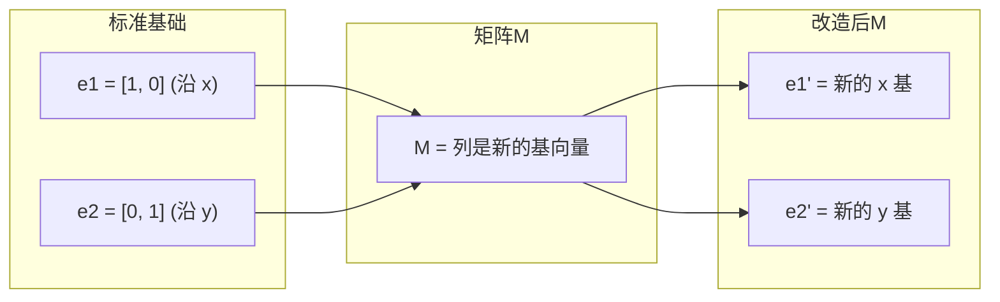
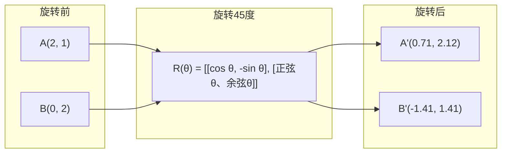
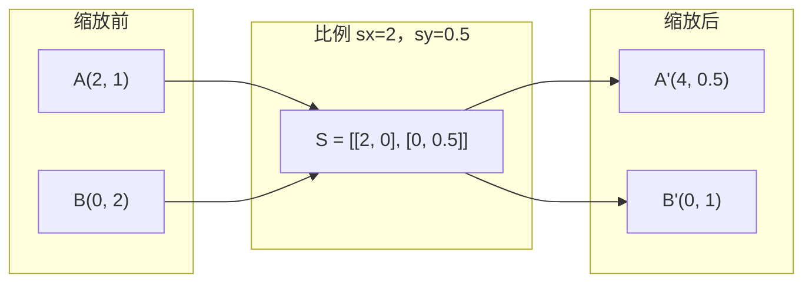
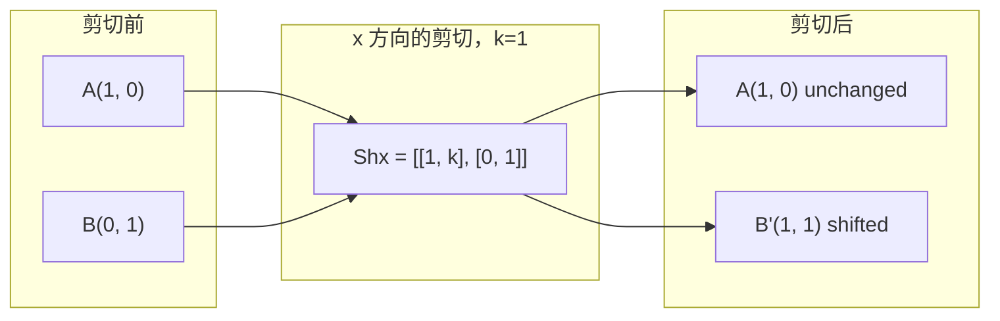
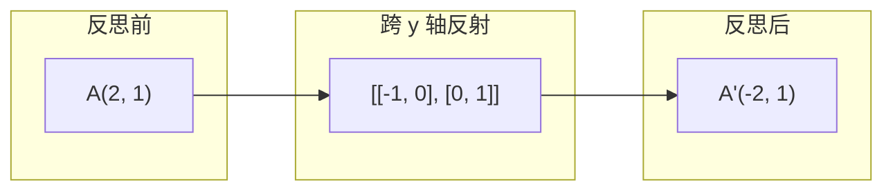
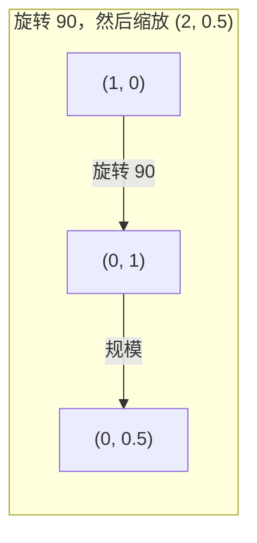
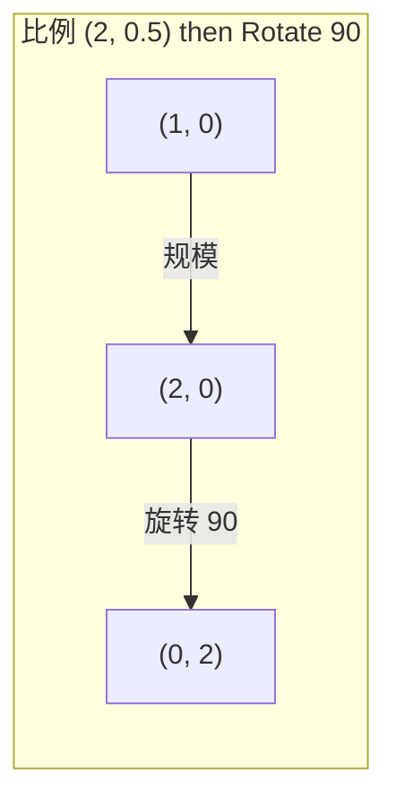

# 矩阵变换

> 矩阵是重塑空间的机器。了解它对每个点的作用，你就会了解整个转变。

**类型：** ** Build
**语言：** ** Python, Julia
**先修：** ** 第 1 阶段，第 01-02 课（线性代数直觉、向量和矩阵运算）
**时间：** ** 约 75 分钟

## 学习目标

- 构建旋转、缩放、剪切和反射矩阵并将其应用于 2D 和 3D 点
- 通过矩阵乘法组合多个变换并验证顺序是否重要
- 根据特征方程计算 2x2 矩阵的特征值和特征向量
- 解释为什么特征值决定 PCA 方向、RNN 稳定性和谱聚类行为

＃＃ 问题

您阅读了有关 PCA 的内容并看到“求协方差矩阵的特征向量”。您阅读了有关模型稳定性的内容，并看到“检查所有特征值的大小是否都小于 1”。您阅读了有关数据增强的内容并看到“应用随机旋转”。除非您了解矩阵对几何空间的作用，否则这一切都没有意义。

矩阵不仅仅是数字网格。它们是空间机器。旋转矩阵旋转点。缩放矩阵拉伸它们。剪切矩阵使它们倾斜。神经网络应用于数据的每次转换都是这些操作之一或它们的组合。本课将这些操作具体化。

## 概念

### 矩阵变换

每个 2D 线性变换都可以写成 2x2 矩阵。该矩阵准确地告诉您基向量 [1, 0] 和 [0, 1] 的最终位置。其他一切都随之而来。



### 旋转

按角度 theta 进行 2D 旋转可保持距离和角度不变。它沿着圆弧移动每个点。



在 3D 中，您绕轴旋转。每个轴都有自己的旋转矩阵：

```
Rz(theta) = | cos  -sin  0 |     Rotate around z-axis
            | sin   cos  0 |     (x-y plane spins, z stays)
            |  0     0   1 |

Rx(theta) = | 1   0     0    |   Rotate around x-axis
            | 0  cos  -sin   |   (y-z plane spins, x stays)
            | 0  sin   cos   |

Ry(theta) = |  cos  0  sin |     Rotate around y-axis
            |   0   1   0  |     (x-z plane spins, y stays)
            | -sin  0  cos |
```

### 缩放

缩放沿每个轴独立地拉伸或压缩。



### 剪切

剪切使一个轴倾斜，同时保持另一轴固定。它将矩形变成平行四边形。



剪切矩阵：
- `Shx = [[1, k], [0, 1]]` 将 x 移动 k * y
- `Shy = [[1, 0], [k, 1]]` 将 y 移动 k * x

＃＃＃ 反射

反射镜指向轴线或直线。



反射矩阵：
- 跨 y 轴反射：`[[-1, 0], [0, 1]]`
- 跨 x 轴反射：`[[1, 0], [0, -1]]`

### 组合：链接变换

应用变换 A 然后应用 B 与将它们的矩阵相乘相同：`result = B @ A @ point`。顺序很重要。旋转然后缩放给出的结果与缩放然后旋转的结果不同。



作曲：`S @ R = [[0, -2], [0.5, 0]]`



作曲：`R @ S = [[0, -0.5], [2, 0]]`

不同的结果。矩阵乘法不可交换。

### 特征值和特征向量

大多数向量在矩阵撞击时会改变方向。特征向量很特殊：矩阵只缩放它们，从不旋转它们。比例因子是特征值。

```
A @ v = lambda * v

v is the eigenvector (direction that survives)
lambda is the eigenvalue (how much it stretches)

Example: A = | 2  1 |
             | 1  2 |

Eigenvector [1, 1] with eigenvalue 3:
  A @ [1,1] = [3, 3] = 3 * [1, 1]     (same direction, scaled by 3)

Eigenvector [1, -1] with eigenvalue 1:
  A @ [1,-1] = [1, -1] = 1 * [1, -1]  (same direction, unchanged)
```

矩阵沿 [1, 1] 将空间拉伸 3 倍，并保持 [1, -1] 不变。其他所有方向都是这两个方向的混合。

### 特征分解

如果一个矩阵有n个线性独立的特征向量，则可以将其分解：

```
A = V @ D @ V^(-1)

V = matrix whose columns are eigenvectors
D = diagonal matrix of eigenvalues
V^(-1) = inverse of V

This says: rotate into eigenvector coordinates, scale along each axis, rotate back.
```

### 为什么特征值很重要

**PCA。** 协方差矩阵的特征向量是主成分。特征值告诉您每个分量捕获了多少方差。按特征值排序，保留前k个，就可以降维了。

**稳定性。** 在循环网络和动力系统中，幅度 > 1 的特征值会导致输出爆炸。幅度 < 1 会使它们消失。这就是一句话表述的vanishing/exploding梯度问题。

**谱方法。** 图神经网络使用邻接矩阵的特征值。谱聚类使用拉普拉斯算子的特征值。特征向量揭示了图的结构。

### 行列式作为体积比例因子

变换矩阵的行列式告诉您它对面积 (2D) 或体积 (3D) 的缩放程度。

```
det = 1:   area preserved (rotation)
det = 2:   area doubled
det = 0:   space crushed to lower dimension (singular)
det = -1:  area preserved but orientation flipped (reflection)

| det(Rotation) | = 1        (always)
| det(Scale sx, sy) | = sx * sy
| det(Shear) | = 1           (area preserved)
| det(Reflection) | = -1     (orientation flipped)
```

```figure
matrix-transform
```

## Build It

### 第 1 步：从头开始转换矩阵 (Python)

```python
import math

def rotation_2d(theta):
    c, s = math.cos(theta), math.sin(theta)
    return [[c, -s], [s, c]]

def scaling_2d(sx, sy):
    return [[sx, 0], [0, sy]]

def shearing_2d(kx, ky):
    return [[1, kx], [ky, 1]]

def reflection_x():
    return [[1, 0], [0, -1]]

def reflection_y():
    return [[-1, 0], [0, 1]]

def mat_vec_mul(matrix, vector):
    return [
        sum(matrix[i][j] * vector[j] for j in range(len(vector)))
        for i in range(len(matrix))
    ]

def mat_mul(a, b):
    rows_a, cols_b = len(a), len(b[0])
    cols_a = len(a[0])
    return [
        [sum(a[i][k] * b[k][j] for k in range(cols_a)) for j in range(cols_b)]
        for i in range(rows_a)
    ]

point = [1.0, 0.0]
angle = math.pi / 4

rotated = mat_vec_mul(rotation_2d(angle), point)
print(f"Rotate (1,0) by 45 deg: ({rotated[0]:.4f}, {rotated[1]:.4f})")

scaled = mat_vec_mul(scaling_2d(2, 3), [1.0, 1.0])
print(f"Scale (1,1) by (2,3): ({scaled[0]:.1f}, {scaled[1]:.1f})")

sheared = mat_vec_mul(shearing_2d(1, 0), [1.0, 1.0])
print(f"Shear (1,1) kx=1: ({sheared[0]:.1f}, {sheared[1]:.1f})")

reflected = mat_vec_mul(reflection_y(), [2.0, 1.0])
print(f"Reflect (2,1) across y: ({reflected[0]:.1f}, {reflected[1]:.1f})")
```

### 步骤 2：变换的组合

```python
R = rotation_2d(math.pi / 2)
S = scaling_2d(2, 0.5)

rotate_then_scale = mat_mul(S, R)
scale_then_rotate = mat_mul(R, S)

point = [1.0, 0.0]
result1 = mat_vec_mul(rotate_then_scale, point)
result2 = mat_vec_mul(scale_then_rotate, point)

print(f"Rotate 90 then scale: ({result1[0]:.2f}, {result1[1]:.2f})")
print(f"Scale then rotate 90: ({result2[0]:.2f}, {result2[1]:.2f})")
print(f"Same? {result1 == result2}")
```

### 步骤 3：从头开始计算特征值 (2x2)

对于 2x2 矩阵`[[a, b], [c, d]]`，特征值求解特征方程：`lambda^2 - (a+d)*lambda + (ad - bc) = 0`。

```python
def eigenvalues_2x2(matrix):
    a, b = matrix[0]
    c, d = matrix[1]
    trace = a + d
    det = a * d - b * c
    discriminant = trace ** 2 - 4 * det
    if discriminant < 0:
        real = trace / 2
        imag = (-discriminant) ** 0.5 / 2
        return (complex(real, imag), complex(real, -imag))
    sqrt_disc = discriminant ** 0.5
    return ((trace + sqrt_disc) / 2, (trace - sqrt_disc) / 2)

def eigenvector_2x2(matrix, eigenvalue):
    a, b = matrix[0]
    c, d = matrix[1]
    if abs(b) > 1e-10:
        v = [b, eigenvalue - a]
    elif abs(c) > 1e-10:
        v = [eigenvalue - d, c]
    else:
        if abs(a - eigenvalue) < 1e-10:
            v = [1, 0]
        else:
            v = [0, 1]
    mag = (v[0] ** 2 + v[1] ** 2) ** 0.5
    return [v[0] / mag, v[1] / mag]

A = [[2, 1], [1, 2]]
vals = eigenvalues_2x2(A)
print(f"Matrix: {A}")
print(f"Eigenvalues: {vals[0]:.4f}, {vals[1]:.4f}")

for val in vals:
    vec = eigenvector_2x2(A, val)
    result = mat_vec_mul(A, vec)
    scaled = [val * vec[0], val * vec[1]]
    print(f"  lambda={val:.1f}, v={[round(x,4) for x in vec]}")
    print(f"    A@v = {[round(x,4) for x in result]}")
    print(f"    l*v = {[round(x,4) for x in scaled]}")
```

### 步骤 4：行列式作为体积比例因子

```python
def det_2x2(matrix):
    return matrix[0][0] * matrix[1][1] - matrix[0][1] * matrix[1][0]

print(f"det(rotation 45) = {det_2x2(rotation_2d(math.pi/4)):.4f}")
print(f"det(scale 2,3)   = {det_2x2(scaling_2d(2, 3)):.1f}")
print(f"det(shear kx=1)  = {det_2x2(shearing_2d(1, 0)):.1f}")
print(f"det(reflect y)   = {det_2x2(reflection_y()):.1f}")

singular = [[1, 2], [2, 4]]
print(f"det(singular)     = {det_2x2(singular):.1f}")
print("Singular: columns are proportional, space collapses to a line.")
```

## Use It

NumPy 通过优化例程处理所有这些。

```python
import numpy as np

theta = np.pi / 4
R = np.array([[np.cos(theta), -np.sin(theta)],
              [np.sin(theta),  np.cos(theta)]])

point = np.array([1.0, 0.0])
print(f"Rotate (1,0) by 45 deg: {R @ point}")

S = np.diag([2.0, 3.0])
composed = S @ R
print(f"Scale(2,3) after Rotate(45): {composed @ point}")

A = np.array([[2, 1], [1, 2]], dtype=float)
eigenvalues, eigenvectors = np.linalg.eig(A)
print(f"\nEigenvalues: {eigenvalues}")
print(f"Eigenvectors (columns):\n{eigenvectors}")

for i in range(len(eigenvalues)):
    v = eigenvectors[:, i]
    lam = eigenvalues[i]
    print(f"  A @ v{i} = {A @ v}, lambda * v{i} = {lam * v}")

print(f"\ndet(R) = {np.linalg.det(R):.4f}")
print(f"det(S) = {np.linalg.det(S):.1f}")

B = np.array([[3, 1], [0, 2]], dtype=float)
vals, vecs = np.linalg.eig(B)
D = np.diag(vals)
V = vecs
reconstructed = V @ D @ np.linalg.inv(V)
print(f"\nEigendecomposition A = V @ D @ V^-1:")
print(f"Original:\n{B}")
print(f"Reconstructed:\n{reconstructed}")
```

### 使用 NumPy 进行 3D 旋转

```python
def rotation_3d_z(theta):
    c, s = np.cos(theta), np.sin(theta)
    return np.array([[c, -s, 0], [s, c, 0], [0, 0, 1]])

def rotation_3d_x(theta):
    c, s = np.cos(theta), np.sin(theta)
    return np.array([[1, 0, 0], [0, c, -s], [0, s, c]])

point_3d = np.array([1.0, 0.0, 0.0])
rotated_z = rotation_3d_z(np.pi / 2) @ point_3d
rotated_x = rotation_3d_x(np.pi / 2) @ point_3d

print(f"\n3D point: {point_3d}")
print(f"Rotate 90 around z: {np.round(rotated_z, 4)}")
print(f"Rotate 90 around x: {np.round(rotated_x, 4)}")
```

## 发货

本课程为 PCA（第 2 阶段）和神经网络权重分析奠定几何基础。此处构建的 eigenvalue/eigenvector 代码与支持生产 ML 系统中的降维、谱聚类和稳定性分析的算法相同。

## 练习

1. 对单位正方形（角点位于 [0,0]、[1,0]、[1,1]、[0,1] 处）应用旋转、缩放和剪切。打印每个角的变换后的角。验证旋转是否保留角之间的距离。

2. 使用特征方程手动求出矩阵 [[4, 2], [1, 3]] 的特征值。然后使用从头开始的函数和 NumPy 进行验证。

3. 创建三个变换的组合（旋转 30 度、缩放 [1.5, 0.8]、kx=0.3 剪切）并将其应用到排列成圆圈的 8 个点。打印之前和之后的坐标。计算组合矩阵的行列式并验证它等于各个行列式的乘积。

## 关键术语

|术语 |人们怎么说|它实际上意味着什么 |
|------|----------------|----------------------|
|旋转矩阵 | “旋转东西”|沿圆弧移动点同时保留距离和角度的正交矩阵。行列式始终为 1。
|缩放矩阵| “让事情变得更大” |沿每个轴独立拉伸或压缩的对角矩阵。行列式是比例因子的乘积。 |
|剪切矩阵 | “倾斜的东西”|一种矩阵，将一个坐标按比例移动到另一个坐标，将矩形变成平行四边形。行列式是 1。
|反思| “镜像事物”|跨轴或平面翻转空间的矩阵。行列式是-1。 |
|成分| “做两件事” |将变换矩阵乘以链运算。顺序很重要：B @ A 表示先应用 A，然后应用 B。
|特征向量| “特殊方向”|矩阵仅缩放而不旋转的方向。转变的指纹。 |
|特征值| “它能伸展多少” |矩阵缩放其特征向量的标量因子。可以是负数（翻转）或复数（旋转）。 |
|特征分解| “分解矩阵”|将矩阵写为 V @ D @ V^(-1)，将其分为基本缩放方向和大小。 |
|行列式 | “矩阵中的单个数字”|变换缩放面积 (2D) 或体积 (3D) 的因子。零意味着转变是不可逆的。 |
|特征方程| “特征值从何而来”| det(A - lambda * I) = 0。根为特征值的多项式。 |

## 延伸阅读

- [3Blue1Brown：线性变换](https://www.3blue1brown.com/lessons/linear-transformations)——矩阵如何重塑空间的视觉直觉
- [3Blue1Brown：特征向量和特征值](https://www.3blue1brown.com/lessons/eigenvalues)——特征向量几何意义的最佳视觉解释
- [MIT 18.06 第 21 讲：特征值和特征向量](https://ocw.mit.edu/courses/18-06-linear-algebra-spring-2010/) -- Gilbert Strang 的经典治疗方法
