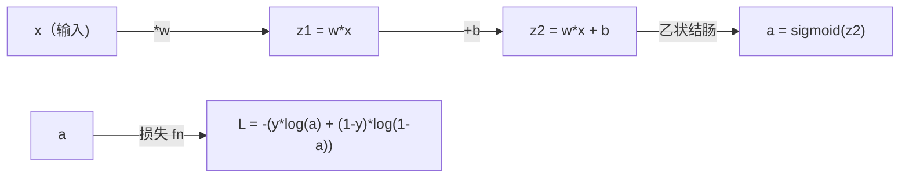
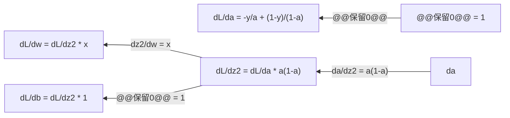
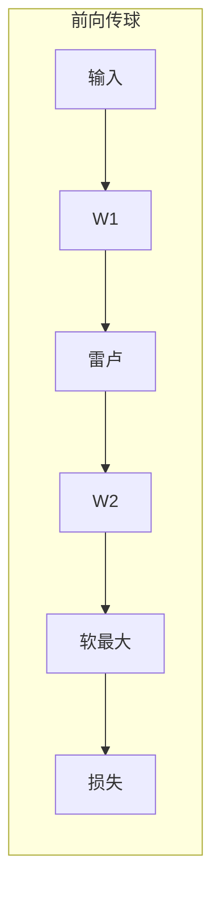
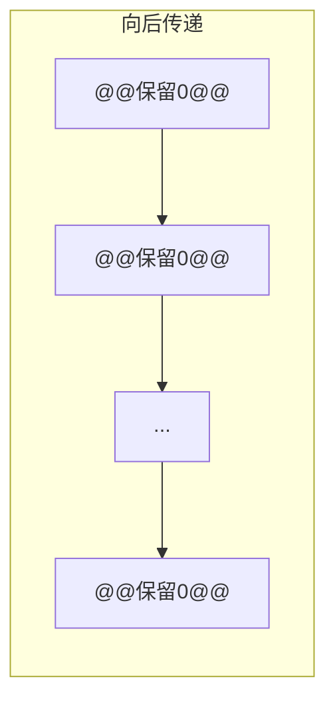

# 机器学习微积分

> 导数告诉您哪条路是下坡路。这就是神经网络需要学习的全部内容。

**类型：** ** Learn
**语言：** Python
**先修：** ** 第 1 阶段，第 01-03 课
**时间：** ** 约 60 分钟

## 学习目标

- 计算常见 ML 函数的数值和分析导数（x^2、sigmoid、交叉熵）
- 从头开始实现梯度下降，以最小化 1D 和 2D 的损失函数
- 导出线性回归模型的梯度并通过手动权重更新对其进行训练
- 解释 Hessian 矩阵、泰勒级数近似及其与优化方法的联系

＃＃ 问题

您有一个具有数百万个权重的神经网络。每个权重都是一个旋钮。您需要弄清楚每个旋钮的旋转方向，以使模型稍微减少错误。微积分给你这个方向。

如果没有微积分，训练神经网络就意味着尝试随机变化并希望得到最好的结果。通过导数，您可以准确地知道每个权重如何影响误差。您每次都以正确的方式转动每个旋钮。

## 概念

### 什么是衍生品？

导数衡量变化率。对于函数 y = f(x)，导数 f'(x) 会告诉您：如果将 x 微移一点，y 会改变多少？

在几何上，导数是一点的切线的斜率。

**f(x) = x^2:**

| x| f(x) | f(x) | f'(x)（斜率）|
|---|------|---------------|
| 0 | 0 | 0（平坦，位于底部）|
| 1 | 1 | 2 |
| 2 | 4 | 4（此时切线斜率）|
| 3 | 9 | 6 |

当 x=2 时，斜率为 4。如果将 x 向右移动一点点，y 就会增加大约 4 倍。当 x=0 时，斜率为 0。您位于碗的底部。

正式定义：

```
f'(x) = lim   f(x + h) - f(x)
        h->0  -----------------
                     h
```

在代码中，您跳过限制并仅使用非常小的 h。这就是数值导数。

### 偏导数：一次一个变量

实函数有很多输入。神经网络损失取决于数千个权重。偏导数保持除一个变量之外的所有变量不变，然后对该变量求导数。

```
f(x, y) = x^2 + 3xy + y^2

df/dx = 2x + 3y     (treat y as a constant)
df/dy = 3x + 2y     (treat x as a constant)
```

每个偏导数都回答：如果我只微调这个权重，损失会如何变化？

### 梯度：所有偏导数的向量

梯度将每个偏导数收集到一个向量中。对于函数 f(x, y, z)，梯度为：

```
grad f = [ df/dx, df/dy, df/dz ]
```

梯度指向最陡上升的方向。要最小化函数，请朝相反的方向进行。

**f(x,y) = x^2 + y^2 的等高线图：**

该函数形成一个以同心圆为轮廓线的碗形。最小值位于 (0, 0)。

|点|毕业生 | -grad f（下降方向）|
|-------|--------|----------------------------|
| (1, 1) | [2, 2]（上坡点，远离最小值）| [-2, -2]（下坡点，朝向最小值）|
| (0, 0) | (0, 0) | [0, 0]（平坦，至少）| [0, 0] |

这就是图片中的梯度下降。计算梯度，取负值，迈出一步。

### 与优化的联系

训练神经网络就是优化。您有一个损失函数 L(w1, w2, ..., wn) 来衡量模型的错误程度。你想最小化它。

```
Gradient descent update rule:

  w_new = w_old - learning_rate * dL/dw

For every weight:
  1. Compute the partial derivative of loss with respect to that weight
  2. Subtract a small multiple of it from the weight
  3. Repeat
```

学习率控制步长。太大了，你就会超调。太小了你就会爬行。

**损失景观（一维切片）：**

随着权重w的变化，损失函数L(w)形成一条有峰有谷的曲线。

|特色 |描述 |
|---------|-------------|
|全局最小值|整条曲线上的最低点——最佳方案 |
|局部最小值|一个比其邻居低但总体上不是最低的山谷 |
|坡度|梯度下降从任意起点沿着斜坡下坡 |

梯度下降是沿着斜坡向下的。它可能会陷入局部最小值，但在高维空间（数百万个权重）中，这很少是一个实际问题。

### 数值导数与分析导数

有两种计算导数的方法。

分析：手动应用微积分规则。对于 f(x) = x^2，导数为 f'(x) = 2x。精确的。快速地。

数值：使用定义进行近似。计算一个微小的 h 的 f(x+h) 和 f(x-h)，然后使用差值。

```
Numerical (central difference):

f'(x) ~= f(x + h) - f(x - h)
          -----------------------
                  2h

h = 0.0001 works well in practice
```

数值导数速度较慢，但​​适用于任何函数。解析导数速度很快，但需要您推导公式。神经网络框架使用第三种方法：自动微分，它机械地计算精确导数。您将在第三阶段看到这一点。

### 简单函数的手工导数

这些是您将在机器学习中反复看到的衍生产品。

```
Function        Derivative       Used in
--------        ----------       -------
f(x) = x^2     f'(x) = 2x      Loss functions (MSE)
f(x) = wx + b  f'(w) = x        Linear layer (gradient w.r.t. weight)
                f'(b) = 1        Linear layer (gradient w.r.t. bias)
                f'(x) = w        Linear layer (gradient w.r.t. input)
f(x) = e^x     f'(x) = e^x     Softmax, attention
f(x) = ln(x)   f'(x) = 1/x     Cross-entropy loss
f(x) = 1/(1+e^-x)  f'(x) = f(x)(1-f(x))   Sigmoid activation
```

对于 f(x) = x^2：

```
f(x) = x^2    f'(x) = 2x

  x    f(x)   f'(x)   meaning
  -2    4      -4      slope tilts left (decreasing)
  -1    1      -2      slope tilts left (decreasing)
   0    0       0      flat (minimum!)
   1    1       2      slope tilts right (increasing)
   2    4       4      slope tilts right (increasing)
```

对于 f(w) = wx + b，其中 x=3，b=1：

```
f(w) = 3w + 1    f'(w) = 3

The derivative with respect to w is just x.
If x is big, a small change in w causes a big change in output.
```

### 链式法则

当函数组合时，链式法则告诉你如何微分。

```
If y = f(g(x)), then dy/dx = f'(g(x)) * g'(x)

Example: y = (3x + 1)^2
  outer: f(u) = u^2       f'(u) = 2u
  inner: g(x) = 3x + 1    g'(x) = 3
  dy/dx = 2(3x + 1) * 3 = 6(3x + 1)
```

神经网络是函数链：输入 -> 线性 -> 激活 -> 线性 -> 激活 -> 损失。反向传播是从输出到输入重复应用的链式法则。这就是整个算法。

### Hessian 矩阵

梯度告诉你斜率。 Hessian 告诉你曲率。

Hessian 矩阵是二阶偏导数矩阵。对于函数 f(x1, x2, ..., xn)，Hessian 矩阵的项 (i, j) 为：

```
H[i][j] = d^2f / (dx_i * dx_j)
```

对于 2 变量函数 f(x, y)：

```
H = | d^2f/dx^2    d^2f/dxdy |
    | d^2f/dydx    d^2f/dy^2 |
```

**Hessian 矩阵在关键点（梯度 = 0）告诉你什么：**

|黑森州房产|意义|示例表面 |
|-----------------|---------|-----------------|
|正定（所有特征值 > 0） |局部最小值|碗朝上|
|负定（所有特征值 < 0）|局部最大值|碗朝下|
|不定（混合特征值）|鞍点|马鞍形|

**示例：** f(x, y) = x^2 - y^2（鞍函数）

```
df/dx = 2x       df/dy = -2y
d^2f/dx^2 = 2    d^2f/dy^2 = -2    d^2f/dxdy = 0

H = | 2   0 |
    | 0  -2 |

Eigenvalues: 2 and -2 (one positive, one negative)
--> Saddle point at (0, 0)
```

与 f(x, y) = x^2 + y^2 （一个碗）比较：

```
H = | 2  0 |
    | 0  2 |

Eigenvalues: 2 and 2 (both positive)
--> Local minimum at (0, 0)
```

**为什么 Hessian 矩阵在机器学习中很重要：**

牛顿方法使用 Hessian 矩阵来采取比梯度下降更好的优化步骤。它不只是遵循坡度，而是考虑曲率：

```
Newton's update:    w_new = w_old - H^(-1) * gradient
Gradient descent:   w_new = w_old - lr * gradient
```

牛顿方法收敛得更快，因为 Hessian 矩阵“重新调整”了梯度——陡峭的方向获得更小的步长，平坦的方向获得更大的步长。

问题是：对于具有 N 个参数的神经网络，Hessian 矩阵为 N x N。具有 100 万个参数的模型将需要 1 万亿个条目的矩阵。这就是我们使用近似值的原因。

|方法|它的用途是什么 |成本|收敛|
|--------|-------------|------|-------------|
|梯度下降|仅一阶导数 |每步 O(N) |慢速（线性）|
|牛顿法|全黑森 |每步 O(N^3) |快速（二次）|
| L-BFGS|梯度历史中的近似 Hessian |每步 O(N) |中（超线性）|
|亚当|每参数自适应率（对角线 Hessian 近似）|每步 O(N) |中等|
|自然渐变| Fisher 信息矩阵（统计 Hessian）|每步 O(N^2) |快|

在实践中，Adam 是深度学习的默认优化器。它通过跟踪每个参数梯度的运行均值和方差来廉价地近似二阶信息。

### 泰勒级数逼近

任何平滑函数都可以用多项式局部逼近：

```
f(x + h) = f(x) + f'(x)*h + (1/2)*f''(x)*h^2 + (1/6)*f'''(x)*h^3 + ...
```

包含的项越多，近似值就越好——但仅限于 x 点附近。

**为什么泰勒级数对机器学习很重要：**

- **一阶泰勒 = 梯度下降。** 当您使用 f(x + h) ~ f(x) + f'(x)*h 时，您正在进行线性近似。梯度下降最小化该线性模型以选择 h = -lr * f'(x)。

- **二阶泰勒 = 牛顿法。** 使用 f(x + h) ~ f(x) + f'(x)*h + (1/2)*f''(x)*h^2，您将得到一个二次模型。最小化它给出 h = -f'(x)/f''(x)——牛顿步。

- **损失函数设计。** MSE和交叉熵是平滑的，这意味着它们的泰勒展开表现良好。这并非偶然。平滑损失使优化可预测。

```
Approximation order    What it captures    Optimization method
-------------------    -----------------   -------------------
0th order (constant)   Just the value      Random search
1st order (linear)     Slope               Gradient descent
2nd order (quadratic)  Curvature           Newton's method
Higher orders          Finer structure     Rarely used in ML
```

关键见解：所有基于梯度的优化实际上都是局部逼近损失函数并逐步达到该逼近的最小值。

### ML 中的积分

衍生品告诉您变化率。积分计算累积——曲线下的面积。

在机器学习中，您很少手动计算积分，但这个概念无处不在：

**概率。** 对于密度为 p(x) 的连续随机变量：
```
P(a < X < b) = integral from a to b of p(x) dx
```
a 和 b 之间的概率密度曲线下的面积是落在该范围内的概率。

**期望值。** 按概率加权的平均结果：
```
E[f(X)] = integral of f(x) * p(x) dx
```
数据分布的预期损失是一个积分。训练最大限度地减少了这种经验近似。

**KL 散度。** 衡量两个分布的差异程度：
```
KL(p || q) = integral of p(x) * log(p(x) / q(x)) dx
```
用于 VAE、知识蒸馏和贝叶斯推理。

**归一化常数。** 在贝叶斯推理中：
```
p(w | data) = p(data | w) * p(w) / integral of p(data | w) * p(w) dw
```
分母是所有可能参数值的积分。它通常很棘手，这就是为什么我们使用 MCMC 和变分推理等近似方法。

|整体理念|它在 ML 中出现的位置 |
|-----------------|----------------------|
|曲线下面积 |密度函数的概率 |
|预期值|损失函数，风险最小化 |
| KL 散度 | VAE、政策优化、蒸馏 |
|标准化|贝叶斯后验，softmax 分母 |
|边际可能性 |模型比较、证据下限 (ELBO) |

### 计算图中的多变量链式法则

链式法则不仅仅适用于直线上的标量函数。在神经网络中，变量呈扇形散开并合并。以下是导数如何通过简单的前向传递流动：



向后传递计算从右到左的梯度：



每个箭头乘以局部导数。任何参数的梯度都是从损失到该参数的路径上所有局部导数的乘积。当路径分支和合并时，您可以对贡献求和（多元链式法则）。

这就是反向传播的全部内容：通过计算图系统地应用链式法则，从输出到输入。

### 雅可比矩阵

当函数将向量映射到向量（如神经网络层）时，其导数是矩阵。雅可比行列式包含每个输出相对于每个输入的每个偏导数。

对于 f: R^n -> R^m，雅可比 J 是 m x n 矩阵：

| | x1 | x2 | ... | xn |
|---|---|---|---|---|
| f1 | df1/dx1 | df1/dx2 | ... | df1/dxn |
| f2 | df2/dx1 | df2/dx2 | ... | df2/dxn |
| ... | ... | ... | ... | ... |
|调频 | dfm/dx1 | dfm/dx2 | ... | dfm/dxn |

您不会为神经网络手动计算雅可比行列式。 PyTorch 可以处理它。但知道它的存在可以帮助您理解反向传播中的形状：如果一个层将 R^n 映射到 R^m，则其雅可比行列式为 m x n。梯度通过该矩阵的转置向后流动。

### 为什么这对神经网络很重要

神经网络中的每个权重都有一个梯度。梯度告诉您如何调整权重以减少损失。





每次权重更新：
-`W1 = W1 - lr * dL/dW1`
-`W2 = W2 - lr * dL/dW2`

前向传递计算预测和损失。向后传递计算每个权重的损失梯度。然后每一个权重都会向下坡迈出一小步。重复数百万步。这就是深度学习。

```figure
derivative-tangent
```

## Build It

### 第 1 步：从头开始求数值导数

```python
def numerical_derivative(f, x, h=1e-7):
    return (f(x + h) - f(x - h)) / (2 * h)

def f(x):
    return x ** 2

for x in [-2, -1, 0, 1, 2]:
    numerical = numerical_derivative(f, x)
    analytical = 2 * x
    print(f"x={x:2d}  f'(x) numerical={numerical:.6f}  analytical={analytical:.1f}")
```

数值导数与分析的一位到多位小数相匹配。

### 步骤 2：偏导数和梯度

```python
def numerical_gradient(f, point, h=1e-7):
    gradient = []
    for i in range(len(point)):
        point_plus = list(point)
        point_minus = list(point)
        point_plus[i] += h
        point_minus[i] -= h
        partial = (f(point_plus) - f(point_minus)) / (2 * h)
        gradient.append(partial)
    return gradient

def f_multi(point):
    x, y = point
    return x**2 + 3*x*y + y**2

grad = numerical_gradient(f_multi, [1.0, 2.0])
print(f"Numerical gradient at (1,2): {[f'{g:.4f}' for g in grad]}")
print(f"Analytical gradient at (1,2): [2*1+3*2, 3*1+2*2] = [{2*1+3*2}, {3*1+2*2}]")
```

### 步骤 3：梯度下降找到 f(x) = x^2 的最小值

```python
x = 5.0
lr = 0.1
for step in range(20):
    grad = 2 * x
    x = x - lr * grad
    print(f"step {step:2d}  x={x:8.4f}  f(x)={x**2:10.6f}")
```

从 x=5 开始，每一步都更接近 x=0（最小值）。

### 步骤 4：二维函数的梯度下降

```python
def f_2d(point):
    x, y = point
    return x**2 + y**2

point = [4.0, 3.0]
lr = 0.1
for step in range(30):
    grad = numerical_gradient(f_2d, point)
    point = [p - lr * g for p, g in zip(point, grad)]
    loss = f_2d(point)
    if step % 5 == 0 or step == 29:
        print(f"step {step:2d}  point=({point[0]:7.4f}, {point[1]:7.4f})  f={loss:.6f}")
```

### 步骤 5：比较数值导数和解析导数

```python
import math

test_functions = [
    ("x^2",      lambda x: x**2,          lambda x: 2*x),
    ("x^3",      lambda x: x**3,          lambda x: 3*x**2),
    ("sin(x)",   lambda x: math.sin(x),   lambda x: math.cos(x)),
    ("e^x",      lambda x: math.exp(x),   lambda x: math.exp(x)),
    ("1/x",      lambda x: 1/x,           lambda x: -1/x**2),
]

x = 2.0
print(f"{'Function':<12} {'Numerical':>12} {'Analytical':>12} {'Error':>12}")
print("-" * 50)
for name, f, df in test_functions:
    num = numerical_derivative(f, x)
    ana = df(x)
    err = abs(num - ana)
    print(f"{name:<12} {num:12.6f} {ana:12.6f} {err:12.2e}")
```

### 步骤 6：以数值方式计算 Hessian 矩阵

```python
def hessian_2d(f, x, y, h=1e-5):
    fxx = (f(x + h, y) - 2 * f(x, y) + f(x - h, y)) / (h ** 2)
    fyy = (f(x, y + h) - 2 * f(x, y) + f(x, y - h)) / (h ** 2)
    fxy = (f(x + h, y + h) - f(x + h, y - h) - f(x - h, y + h) + f(x - h, y - h)) / (4 * h ** 2)
    return [[fxx, fxy], [fxy, fyy]]

def saddle(x, y):
    return x ** 2 - y ** 2

def bowl(x, y):
    return x ** 2 + y ** 2

H_saddle = hessian_2d(saddle, 0.0, 0.0)
H_bowl = hessian_2d(bowl, 0.0, 0.0)
print(f"Saddle Hessian: {H_saddle}")  # [[2, 0], [0, -2]] -- mixed signs
print(f"Bowl Hessian:   {H_bowl}")    # [[2, 0], [0, 2]]  -- both positive
```

鞍函数的 Hessian 矩阵具有特征值 2 和 -2（混合符号，确认鞍点）。碗的特征值是 2 和 2（均为正值，确认最小值）。

### 步骤 7：泰勒近似的实际应用

```python
import math

def taylor_approx(f, f_prime, f_double_prime, x0, h, order=2):
    result = f(x0)
    if order >= 1:
        result += f_prime(x0) * h
    if order >= 2:
        result += 0.5 * f_double_prime(x0) * h ** 2
    return result

x0 = 0.0
for h in [0.1, 0.5, 1.0, 2.0]:
    true_val = math.sin(h)
    t1 = taylor_approx(math.sin, math.cos, lambda x: -math.sin(x), x0, h, order=1)
    t2 = taylor_approx(math.sin, math.cos, lambda x: -math.sin(x), x0, h, order=2)
    print(f"h={h:.1f}  sin(h)={true_val:.4f}  order1={t1:.4f}  order2={t2:.4f}")
```

x0=0 附近，sin(x) ~ x（一阶泰勒）。该近似对于小 h 非常好，但对于大 h 则失效。这就是为什么梯度下降在较小的学习率下效果最好——每一步都假设线性近似是准确的。

### 步骤 8：为什么这对神经网络很重要

```python
import random

random.seed(42)

w = random.gauss(0, 1)
b = random.gauss(0, 1)
lr = 0.01

xs = [1.0, 2.0, 3.0, 4.0, 5.0]
ys = [3.0, 5.0, 7.0, 9.0, 11.0]

for epoch in range(200):
    total_loss = 0
    dw = 0
    db = 0
    for x, y in zip(xs, ys):
        pred = w * x + b
        error = pred - y
        total_loss += error ** 2
        dw += 2 * error * x
        db += 2 * error
    dw /= len(xs)
    db /= len(xs)
    total_loss /= len(xs)
    w -= lr * dw
    b -= lr * db
    if epoch % 40 == 0 or epoch == 199:
        print(f"epoch {epoch:3d}  w={w:.4f}  b={b:.4f}  loss={total_loss:.6f}")

print(f"\nLearned: y = {w:.2f}x + {b:.2f}")
print(f"Actual:  y = 2x + 1")
```

每个基于梯度的训练循环都遵循以下模式：预测、计算损失、计算梯度、更新权重。

## Use It

使用 NumPy，相同的操作更快、更简洁：

```python
import numpy as np

x = np.array([1, 2, 3, 4, 5], dtype=float)
y = np.array([3, 5, 7, 9, 11], dtype=float)

w, b = np.random.randn(), np.random.randn()
lr = 0.01

for epoch in range(200):
    pred = w * x + b
    error = pred - y
    loss = np.mean(error ** 2)
    dw = np.mean(2 * error * x)
    db = np.mean(2 * error)
    w -= lr * dw
    b -= lr * db

print(f"Learned: y = {w:.2f}x + {b:.2f}")
```

您刚刚从头开始构建了梯度下降。 PyTorch 自动执行梯度计算，但更新循环是相同的。

## 练习

1. 使用调用两次`numerical_derivative` 来实现`numerical_second_derivative(f, x)`。验证 x^3 在 x=2 处的二阶导数是否为 12。
2. 使用梯度下降求 f(x, y) = (x - 3)^2 + (y + 1)^2 的最小值。从 (0, 0) 开始。答案应该收敛于 (3, -1)。
3. 向梯度下降循环添加动量：维持累积过去梯度的速度向量。比较 f(x) = x^4 - 3x^2 上有动量和无动量的收敛速度。

## 关键术语

|术语 |人们怎么说|它实际上意味着什么 |
|------|----------------|----------------------|
|衍生品| “斜坡”|函数在某一点的变化率。告诉您输入每发生单位变化，输出会发生多少变化。 |
|偏导数| “一个变量的导数”|当所有其他变量保持不变时，相对于一个变量的导数。 |
|渐变 | “最陡上升方向”|所有偏导数的向量。指向函数增加最快的方向。 |
|梯度下降| “走下坡路”|从参数中减去梯度（乘以学习率）以减少损失。神经网络训练的核心。 |
|学习率| “步长” |控制每个梯度下降步长有多大的标量。太大：发散。太小：收敛缓慢。 |
|链式法则| “乘以导数”|组合函数的微分规则： df/dx = df/dg * dg/dx. 反向传播的数学基础。 |
|雅可比| “导数矩阵” |当函数将向量映射到向量时，雅可比行列式是输出相对于输入的所有偏导数的矩阵。 |
|数值导数| “有限差异” |通过评估两个附近点的函数并计算它们之间的斜率来近似导数。 |
|反向传播| “反向模式自动微分” |使用链式法则逐层计算从输出到输入的梯度。神经网络如何学习。 |
|黑森州 | “二阶导数矩阵” |所有二阶偏导数的矩阵。描述函数的曲率。临界点处的正定 Hessian 意味着局部极小值。 |
|泰勒级数| “多项式近似”|使用导数逼近点附近的函数： f(x+h) ~ f(x) + f'(x)h + (1/2)f''(x)h^2 + ... 理解梯度下降和牛顿法为何有效的基础。 |
|积分 | “曲线下面积”|一定范围内数量的累积。在 ML 中，积分定义概率、期望值和 KL 散度。 |

## 延伸阅读

- [3Blue1Brown：微积分的本质](https://www.3blue1brown.com/topics/calculus) - 导数、积分和链式法则的视觉直觉
- [Stanford CS231n：反向传播](https://cs231n.github.io/optimization-2/) - 梯度如何流过神经网络层
