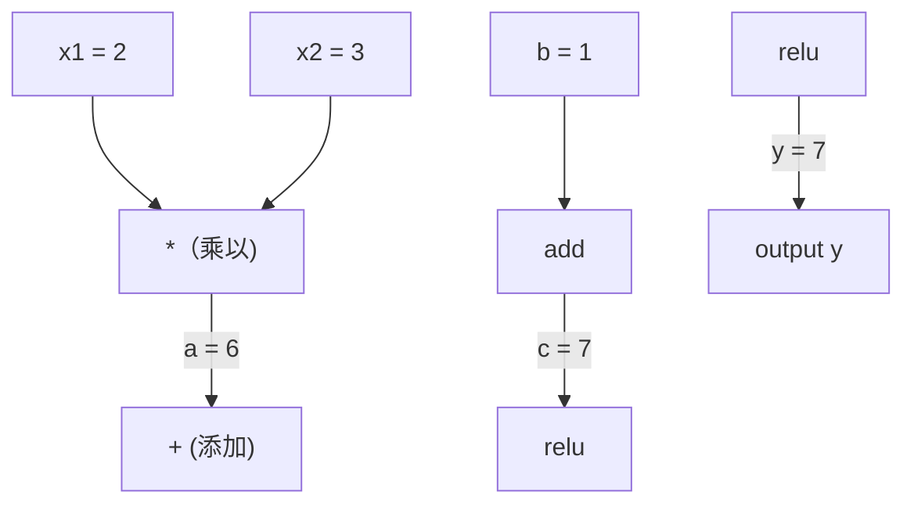
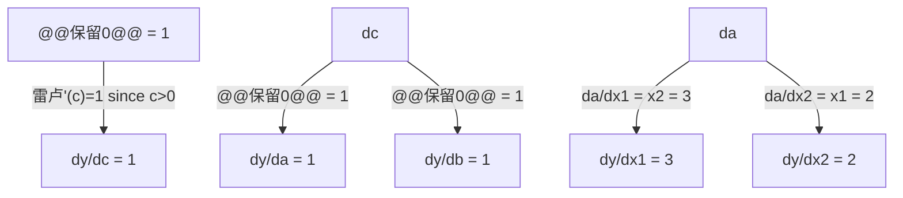

# 链式法则和自动微分

> 链式法则是每个学习神经网络背后的引擎。

**类型：** ** Build
**语言：** Python
**先修：** ** 第 1 阶段，第 04 课（导数和梯度）
**时间：** ** 约 90 分钟

## 学习目标

- 构建一个最小的自动梯度引擎（值类），通过反向模式自动差异记录操作并计算梯度
- 使用拓扑排序实现计算图的前向和后向传递
- 仅使用从头开始的 autograd 引擎构建和训练 XOR 上的多层感知机
- 使用针对数值有限差分的梯度检查来验证自动微分的正确性

＃＃ 问题

您可以计算简单函数的导数。但神经网络并不是一个简单的函数。它由数百个函数组成：矩阵乘法、添加偏置、应用激活、再次矩阵乘法、softmax、交叉熵损失。输出是函数的函数的函数。

为训练网络，您需要相对于每个权重的损失梯度。对于数百万个参数，手动执行此操作是不可能的。以数字方式（有限差分）进行计算太慢了。

链式法则给了你数学。自动微分为您提供算法。它们一起让您可以通过与单个前向传递成比例的时间的任意函数组合来计算精确的梯度。

这就是 PyTorch、TensorFlow 和 JAX 的工作原理。您将从头开始构建一个微型版本。

## 概念

### 链式法则

如果`y = f(g(x))`，`y`相对于`x`的导数是：

```
dy/dx = dy/dg * dg/dx = f'(g(x)) * g'(x)
```

沿链乘以导数。每个链接都贡献其本地导数。

示例：`y = sin(x^2)`

```
g(x) = x^2       g'(x) = 2x
f(g) = sin(g)     f'(g) = cos(g)

dy/dx = cos(x^2) * 2x
```

对于更深层次的作品，链条延伸：

```
y = f(g(h(x)))

dy/dx = f'(g(h(x))) * g'(h(x)) * h'(x)
```

神经网络中的每一层都是这条链条中的一个环节。

### 计算图

计算图使链式法则变得可视化。每个操作都成为一个节点。数据在图表中向前流动。梯度向后流动。

**前向传播（计算值）：**



**向后传递（计算梯度）：**



向后传递在每个节点应用链式法则，将梯度从输出传播到输入。

### 正向模式与反向模式

有两种方法可以通过图形应用链式法则。

**正向模式** 从输入开始并向前推动导数。它计算 `dx/dx = 1` 并通过每个操作传播。当你的输入很少而输出很多时，这很好。

```
Forward mode: seed dx/dx = 1, propagate forward

  x = 2       (dx/dx = 1)
  a = x^2     (da/dx = 2x = 4)
  y = sin(a)  (dy/dx = cos(a) * da/dx = cos(4) * 4 = -2.615)
```

**反向模式**从输出开始并将梯度向后拉。它计算`dy/dy = 1`并反向传播每个操作。当您有很多输入和很少输出时，这很好。

```
Reverse mode: seed dy/dy = 1, propagate backward

  y = sin(a)  (dy/dy = 1)
  a = x^2     (dy/da = cos(a) = cos(4) = -0.654)
  x = 2       (dy/dx = dy/da * da/dx = -0.654 * 4 = -2.615)
```

神经网络有数百万个输入（权重）和一个输出（损失）。反向模式在一次向后传递中计算所有梯度。这就是反向传播使用反向模式的原因。

|模式|种子|方向 |最佳时间 |
|------|------|-----------|-----------|
|转发| `dx_i/dx_i = 1` |输入到输出|输入少，输出多 |
|反向| `dy/dy = 1` |输出到输入|输入多，输出少（神经网络） |

### 转发模式双号码

转发模式可以通过双号优雅地实现。双数的形式为`a + b*epsilon`，其中`epsilon^2 = 0`。

```
Dual number: (value, derivative)

(2, 1) means: value is 2, derivative w.r.t. x is 1

Arithmetic rules:
  (a, a') + (b, b') = (a+b, a'+b')
  (a, a') * (b, b') = (a*b, a'*b + a*b')
  sin(a, a')         = (sin(a), cos(a)*a')
```

用导数 1 作为输入变量的种子。导数在每个操作中自动传播。

### 构建 Autograd 引擎

Autograd 引擎需要三件事：

1. **值包装。** 将每个数字包装在存储其值和梯度的对象中。
2. **图形记录。** 每个操作都会记录其输入和局部梯度函数。
3. **向后传递。** 对图进行拓扑排序，然后反向遍历，在每个节点应用链式法则。

这正是 PyTorch 的 `autograd` 所做的。 `torch.Tensor` 类包装值，在`requires_grad=True` 时记录操作，并在调用`.backward()` 时计算梯度。

### PyTorch Autograd 的底层工作原理

当您编写 PyTorch 代码时：

```python
x = torch.tensor(2.0, requires_grad=True)
y = x ** 2 + 3 * x + 1
y.backward()
print(x.grad)  # 7.0 = 2*x + 3 = 2*2 + 3
```

PyTorch 内部：

1. 为`x`和`requires_grad=True`创建`Tensor`节点
2. 每个操作（`**`、`*`、`+`）都会创建一个新节点并记录向后函数
3.`y.backward()`通过记录的图形触发反向模式自动比较
4.每个节点的`grad_fn`计算局部梯度并将其传递给父节点
5. 梯度通过加法（而不是替换）累积在`.grad`属性中

该图是动态的（按运行定义）。每次前向传播都会构建一个新图。这就是 PyTorch 支持模型内部控制流（if/else、循环）的原因。

```figure
chain-rule
```

## Build It

### 第 1 步：Value 类

```python
class Value:
    def __init__(self, data, children=(), op=''):
        self.data = data
        self.grad = 0.0
        self._backward = lambda: None
        self._prev = set(children)
        self._op = op

    def __repr__(self):
        return f"Value(data={self.data:.4f}, grad={self.grad:.4f})"
```

每个`Value` 都存储其数值数据、梯度（最初为零）、后向函数以及指向生成它的子节点的指针。

### 步骤 2：梯度跟踪的算术运算

```python
    def __add__(self, other):
        other = other if isinstance(other, Value) else Value(other)
        out = Value(self.data + other.data, (self, other), '+')
        def _backward():
            self.grad += out.grad
            other.grad += out.grad
        out._backward = _backward
        return out

    def __mul__(self, other):
        other = other if isinstance(other, Value) else Value(other)
        out = Value(self.data * other.data, (self, other), '*')
        def _backward():
            self.grad += other.data * out.grad
            other.grad += self.data * out.grad
        out._backward = _backward
        return out

    def relu(self):
        out = Value(max(0, self.data), (self,), 'relu')
        def _backward():
            self.grad += (1.0 if out.data > 0 else 0.0) * out.grad
        out._backward = _backward
        return out
```

每个操作都会创建一个闭包，该闭包知道如何计算本地梯度并乘以上游梯度（`out.grad`）。 `+=` 处理在多个操作中使用一个值的情况。

### 步骤 3：向后传递

```python
    def backward(self):
        topo = []
        visited = set()
        def build_topo(v):
            if v not in visited:
                visited.add(v)
                for child in v._prev:
                    build_topo(child)
                topo.append(v)
        build_topo(self)

        self.grad = 1.0
        for v in reversed(topo):
            v._backward()
```

拓扑排序确保每个节点的梯度在传播到其子节点之前得到完全计算。种子梯度为 1.0 (dy/dy = 1)。

### 步骤 4：完整引擎的更多操作

基本 Value 类处理加法、乘法和 relu。真正的 autograd 引擎需要更多。以下是构建神经网络所需的操作：

```python
    def __neg__(self):
        return self * -1

    def __sub__(self, other):
        return self + (-other)

    def __radd__(self, other):
        return self + other

    def __rmul__(self, other):
        return self * other

    def __rsub__(self, other):
        return other + (-self)

    def __pow__(self, n):
        out = Value(self.data ** n, (self,), f'**{n}')
        def _backward():
            self.grad += n * (self.data ** (n - 1)) * out.grad
        out._backward = _backward
        return out

    def __truediv__(self, other):
        return self * (other ** -1) if isinstance(other, Value) else self * (Value(other) ** -1)

    def exp(self):
        import math
        e = math.exp(self.data)
        out = Value(e, (self,), 'exp')
        def _backward():
            self.grad += e * out.grad
        out._backward = _backward
        return out

    def log(self):
        import math
        out = Value(math.log(self.data), (self,), 'log')
        def _backward():
            self.grad += (1.0 / self.data) * out.grad
        out._backward = _backward
        return out

    def tanh(self):
        import math
        t = math.tanh(self.data)
        out = Value(t, (self,), 'tanh')
        def _backward():
            self.grad += (1 - t ** 2) * out.grad
        out._backward = _backward
        return out
```

**为什么每项操作都很重要：**

|运营|落后规则 |用于 |
|-----------|--------------|---------|
| `__sub__` |重用add + neg |损失计算（预测-目标）|
| `__pow__` | n * x^(n-1) | n * x^(n-1) |多项式激活，MSE（误差^2）|
| `__truediv__` |重用 mul + pow(-1) |标准化、学习率缩放 |
| `exp` | exp(x) * 上游 | Softmax，对数似然 |
| `log` | (1/x) * 上游 |交叉熵损失，对数概率 |
| `tanh` | (1 - tanh^2) * 上游 |经典激活函数|

聪明的部分：`__sub__` 和 `__truediv__` 是根据现有操作定义的。他们免费获得正确的梯度，因为链式法则是通过底层的 add/mul/pow 操作组成的。

### 步骤 5：从头开始迷你 MLP

有了完整的 Value 类，您就可以构建神经网络。没有 PyTorch。没有 NumPy。只是价值观和链式法则。

```python
import random

class Neuron:
    def __init__(self, n_inputs):
        self.w = [Value(random.uniform(-1, 1)) for _ in range(n_inputs)]
        self.b = Value(0.0)

    def __call__(self, x):
        act = sum((wi * xi for wi, xi in zip(self.w, x)), self.b)
        return act.tanh()

    def parameters(self):
        return self.w + [self.b]

class Layer:
    def __init__(self, n_inputs, n_outputs):
        self.neurons = [Neuron(n_inputs) for _ in range(n_outputs)]

    def __call__(self, x):
        return [n(x) for n in self.neurons]

    def parameters(self):
        return [p for n in self.neurons for p in n.parameters()]

class MLP:
    def __init__(self, sizes):
        self.layers = [Layer(sizes[i], sizes[i+1]) for i in range(len(sizes)-1)]

    def __call__(self, x):
        for layer in self.layers:
            x = layer(x)
        return x[0] if len(x) == 1 else x

    def parameters(self):
        return [p for layer in self.layers for p in layer.parameters()]
```

`Neuron` 计算`tanh(w1*x1 + w2*x2 + ... + b)`。 `Layer` 是一个神经元列表。 `MLP` 堆叠层。每个权重都是`Value`，因此调用`loss.backward()`会将梯度传播到每个参数。

**异或训练：**

```python
random.seed(42)
model = MLP([2, 4, 1])  # 2 inputs, 4 hidden neurons, 1 output

xs = [[0, 0], [0, 1], [1, 0], [1, 1]]
ys = [-1, 1, 1, -1]  # XOR pattern (using -1/1 for tanh)

for step in range(100):
    preds = [model(x) for x in xs]
    loss = sum((p - y) ** 2 for p, y in zip(preds, ys))

    for p in model.parameters():
        p.grad = 0.0
    loss.backward()

    lr = 0.05
    for p in model.parameters():
        p.data -= lr * p.grad

    if step % 20 == 0:
        print(f"step {step:3d}  loss = {loss.data:.4f}")

print("\nPredictions after training:")
for x, y in zip(xs, ys):
    print(f"  input={x}  target={y:2d}  pred={model(x).data:6.3f}")
```

这是微梯度。纯 Python 中的完整神经网络训练循环，具有自动微分功能。每个商业深度学习框架都大规模地做同样的事情。

### 步骤 6：梯度检查

你怎么知道你的自动差异是正确的？将其与数值导数进行比较。这是梯度检查。

```python
def gradient_check(build_expr, x_val, h=1e-7):
    x = Value(x_val)
    y = build_expr(x)
    y.backward()
    autodiff_grad = x.grad

    y_plus = build_expr(Value(x_val + h)).data
    y_minus = build_expr(Value(x_val - h)).data
    numerical_grad = (y_plus - y_minus) / (2 * h)

    diff = abs(autodiff_grad - numerical_grad)
    return autodiff_grad, numerical_grad, diff
```

在复杂的表达式上测试它：

```python
def expr(x):
    return (x ** 3 + x * 2 + 1).tanh()

ad, num, diff = gradient_check(expr, 0.5)
print(f"Autodiff:  {ad:.8f}")
print(f"Numerical: {num:.8f}")
print(f"Difference: {diff:.2e}")
# Difference should be < 1e-5
```

实施新操作时，梯度检查至关重要。如果你的向后传递有错误，数字检查会发现它。每个严肃的深度学习实现都会在开发过程中进行梯度检查。

**何时使用梯度检查：**

|情况|进行梯度检查吗？ |
|-----------|-------------------|
|向您的 autograd 添加新操作 |是的，总是|
|调试不会收敛的训练循环 |是的，首先检查梯度 |
|生产培训|不，太慢（每个参数 2 次前向传递）|
| autograd 代码的单元测试 |是的，自动化它 |

### 步骤 7：根据手动计算进行验证

```python
x1 = Value(2.0)
x2 = Value(3.0)
a = x1 * x2          # a = 6.0
b = a + Value(1.0)    # b = 7.0
y = b.relu()          # y = 7.0

y.backward()

print(f"y = {y.data}")          # 7.0
print(f"dy/dx1 = {x1.grad}")   # 3.0 (= x2)
print(f"dy/dx2 = {x2.grad}")   # 2.0 (= x1)
```

手动检查：`y = relu(x1*x2 + 1)`。由于`x1*x2 + 1 = 7 > 0`，relu就是身份。
`dy/dx1 = x2 = 3`。 `dy/dx2 = x1 = 2`。发动机匹配。

## Use It

### 针对 PyTorch 进行验证

```python
import torch

x1 = torch.tensor(2.0, requires_grad=True)
x2 = torch.tensor(3.0, requires_grad=True)
a = x1 * x2
b = a + 1.0
y = torch.relu(b)
y.backward()

print(f"PyTorch dy/dx1 = {x1.grad.item()}")  # 3.0
print(f"PyTorch dy/dx2 = {x2.grad.item()}")  # 2.0
```

相同的渐变。您的引擎计算出与 PyTorch 相同的结果，因为数学是相同的：通过链式法则进行反向模式自动比较。

### 更复杂的表达式

```python
a = Value(2.0)
b = Value(-3.0)
c = Value(10.0)
f = (a * b + c).relu()  # relu(2*(-3) + 10) = relu(4) = 4

f.backward()
print(f"df/da = {a.grad}")  # -3.0 (= b)
print(f"df/db = {b.grad}")  #  2.0 (= a)
print(f"df/dc = {c.grad}")  #  1.0
```

## 发货

本课产生：
- `outputs/skill-autodiff.md` -- 构建和调试 autograd 系统的技能
- `code/autodiff.py` -- 您可以扩展的最小 autograd 引擎

这里构建的 Value 类是第 3 阶段神经网络训练循环的基础。

## 练习

1. 将 `__pow__` 添加到 Value 类，以便您可以计算 `x ** n`。验证`x=2` 处的`d/dx(x^3)` 等于`12.0`。

2. 添加`tanh` 作为激活函数。验证`tanh'(0) = 1` 和`tanh'(2) = 0.0707`（大约）。

3. 构建单个神经元的计算图：`y = relu(w1*x1 + w2*x2 + b)`。计算所有五个梯度并针对 PyTorch 进行验证。

4. 使用双数实​​现前向模式自动比较。创建一个 `Dual` 类并验证它提供与反向模式引擎相同的导数。

## 关键术语

|术语 |人们怎么说|它实际上意味着什么 |
|------|----------------|----------------------|
|链式法则| “乘以导数”|组合函数的导数等于每个函数的局部导数的乘积，在正确的点求值 |
|计算图 | “网络图”|有向无环图，其中节点是操作，边携带值（向前）或梯度（向后）|
|前进模式| “推动衍生品向前发展” | Autodiff 将导数从输入传播到输出。每个输入变量一次。 |
|反向模式| “反向传播”| Autodiff 将梯度从输出传播到输入。每个输出变量一次传递。 |
|自动毕业| “自动渐变” |一个记录值操作、构建图表并通过链式法则计算精确梯度的系统 |
|双数 | “价值加衍生品”| a + b*epsilon (epsilon^2 = 0) 形式的数字通过算术携带导数信息 |
|拓扑排序| “依附顺序”|对图节点进行排序，以便每个节点都位于其所有依赖项之后。正确的梯度传播所需的。 |
|梯度积累| “添加，而不是替换” |当一个值输入到多个操作中时，其梯度是所有传入梯度贡献的总和 |
|动态图 | “通过运行定义” |在每次前向传递上重建计算图，允许 Python 控制模型内部的流程（PyTorch 风格） |
|梯度检查 | “数值验证”|将自动差分梯度与数值有限差分梯度进行比较以验证正确性。对于调试至关重要。 |
| MLP | “多层感知机”|一种具有一个或多个隐藏神经元层的神经网络。每个神经元计算加权和加上偏差，然后应用激活函数。 |
|神经元| “加权和+激活” |基本单位：输出=激活(w1*x1 + w2*x2 + ... + b)。权重和偏差是可学习的参数。 |

## 延伸阅读

- [3Blue1Brown：反向传播演算](https://www.youtube.com/watch?v=tIeHLnjs5U8) -- 神经网络中链式法则的可视化解释
- [PyTorch Autograd 机制](https://pytorch.org/docs/stable/notes/autograd.html) -- 真实系统如何工作
- [Baydin 等人，机器学习中的自动微分：一项调查](https://arxiv.org/abs/1502.05767) -- 综合参考
