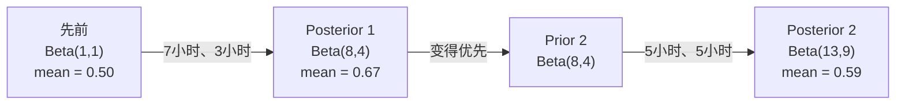

# 贝叶斯定理

> 概率就是你所期望的。贝叶斯定理是关于你学到的东西。

**类型：** ** Build
**语言：** Python
**先修：** ** 第 1 阶段，第 06 课（概率基础知识）
**时间：** ** 约 75 分钟

## 学习目标

- 应用贝叶斯定理根据先验、可能性和证据计算后验概率
- 使用拉普拉斯平滑和对数空间计算从头开始构建朴素贝叶斯文本分类器
- 比较 MLE 和 MAP 估计并解释 MAP 如何对应于 L2 正则化
- 使用 Beta-二项式共轭先验实现顺序贝叶斯更新，以进行 A/B 测试

＃＃ 问题

医学测试的准确率是 99%。你测试呈阳性。您实际上患有这种疾病的可能性有多大？

大多数人说99%。真正的答案取决于这种疾病的罕见程度。如果万分之一的人患有此病，则阳性结果仅表明您患病的可能性约为 1%。其他 99% 的阳性结果都是健康人的误报。

这不是一个棘手的问题。这就是贝叶斯定理。每个垃圾邮件过滤器、每个医疗诊断、每个量化不确定性的机器学习模型都使用这种精确的推理。你从一个信念开始。你看到证据了。你更新。

如果您在不了解这一点的情况下构建机器学习系统，您将误解模型输出、设置错误的阈值并发布过于自信的预测。

## 概念

### 从联合概率到贝叶斯

从第 06 课中您已经知道条件概率是：

```
P(A|B) = P(A and B) / P(B)
```

并且对称地：

```
P(B|A) = P(A and B) / P(A)
```

两个表达式共享相同的分子：P(A 和 B)。将它们设置为相等并重新排列：

```
P(A and B) = P(A|B) * P(B) = P(B|A) * P(A)

Therefore:

P(A|B) = P(B|A) * P(A) / P(B)
```

这就是贝叶斯定理。四个量，一个方程。

### 四个部分

|部分|名称 |这意味着什么 |
|------|------|---------------|
| P(A\|B) | P(A\|B) |后|看到证据 B 后您对 A 的更新信念 |
| P(B\|A) | P(B\|A) |可能性|如果 A 为真，证据 B 的可能性有多大 |
| P(A) | P(A) |之前 |在看到任何证据之前你对 A 的信念 |
| P(B)|证据|在所有可能性下看到 B 的总概率 |

证据项 P(B) 充当标准化项。您可以使用全概率定律将其展开：

```
P(B) = P(B|A) * P(A) + P(B|not A) * P(not A)
```

### 医学测试示例

疾病影响万分之一的人。该测试的准确度为 99%（发现 99% 的病人，1% 的时间出现假阳性）。

```
P(sick)          = 0.0001     (prior: disease is rare)
P(positive|sick) = 0.99       (likelihood: test catches it)
P(positive|healthy) = 0.01    (false positive rate)

P(positive) = P(positive|sick) * P(sick) + P(positive|healthy) * P(healthy)
            = 0.99 * 0.0001 + 0.01 * 0.9999
            = 0.000099 + 0.009999
            = 0.010098

P(sick|positive) = P(positive|sick) * P(sick) / P(positive)
                 = 0.99 * 0.0001 / 0.010098
                 = 0.0098
                 = 0.98%
```

小于1%。先验占主导地位。当病情罕见时，即使准确的检测也大多会产生误报。这就是医生要求进行确认测试的原因。

### 垃圾邮件过滤器示例

您收到一封包含“彩票”一词的电子邮件。是垃圾邮件吗？

```
P(spam)                = 0.3      (30% of email is spam)
P("lottery"|spam)      = 0.05     (5% of spam emails contain "lottery")
P("lottery"|not spam)  = 0.001    (0.1% of legitimate emails contain "lottery")

P("lottery") = 0.05 * 0.3 + 0.001 * 0.7
             = 0.015 + 0.0007
             = 0.0157

P(spam|"lottery") = 0.05 * 0.3 / 0.0157
                  = 0.955
                  = 95.5%
```

一个词就能将概率从 30% 提高到 95.5%。真正的垃圾邮件过滤器同时对数百个单词应用贝叶斯。

### 朴素贝叶斯：独立性假设

朴素贝叶斯通过假设给定类的所有特征都是条件独立的，将其扩展到多个特征：

```
P(class | feature_1, feature_2, ..., feature_n)
  = P(class) * P(feature_1|class) * P(feature_2|class) * ... * P(feature_n|class)
    / P(feature_1, feature_2, ..., feature_n)
```

“天真的”部分是独立性假设。在文本中，单词的出现不是独立的（“New”和“York”是相关的）。但这个假设在实践中效果出人意料地好，因为分类器只需要对类别进行排名，而不需要产生校准的概率。

由于所有类别的分母都相同，因此您可以跳过它并仅比较分子：

```
score(class) = P(class) * product of P(feature_i | class)
```

选择得分最高的班级。

### 最大似然估计（MLE）

如何从训练数据中得到 P(feature|class)？数数。

```
P("free"|spam) = (number of spam emails containing "free") / (total spam emails)
```

这就是 MLE：选择使观察到的数据最有可能的参数值。您正在最大化似然函数，对于离散计数，该似然函数会减少到相对频率。

问题：如果训练期间某个单词从未出现在垃圾邮件中，MLE 给出的概率为零。一个看不见的词就会毁掉整个产品。使用拉普拉斯平滑修复此问题：

```
P(word|class) = (count(word, class) + 1) / (total_words_in_class + vocabulary_size)
```

每次计数加 1 可确保概率永远不会为零。

### 最大后验概率 (MAP)

MLE 问：什么参数可以最大化 P(data|parameter)？

MAP 问：什么参数可以最大化 P(参数|数据)？

根据贝叶斯定理：

```
P(parameters|data) proportional to P(data|parameters) * P(parameters)
```

MAP 在参数本身之上添加了先验。如果您认为参数应该很小，则可以将其编码为惩罚大值的先验。这与 ML 中的 L2 正则化相同。岭回归中的“岭”惩罚实际上是权重的高斯先验。

|估计|优化| ML 等效 |
|------------|-----------|---------------|
|最大LE | P(数据\|参数) |非正规培训|
|地图 | P(数据\|参数) * P(参数) | L2 / L1 正则化 |

### 贝叶斯学派与频率学派：实际差异

频率论者将参数视为固定的未知数。他们问：“如果我多次重复这个实验，会发生什么？”

贝叶斯学派将参数视为分布。他们问：“根据我的观察，我对这些参数有何看法？”

对于构建机器学习系统，实际差异：

|方面|常客 |贝叶斯 |
|--------|-------------|----------|
|输出|点估计|值的分布|
|不确定性|置信区间（关于程序）|可信区间（关于参数） |
|小数据|可能会过度拟合 |先验充当正则化 |
|计算|通常更快 |经常需要抽样（MCMC） |

大多数生产机器学习都是频率论的（SGD，点估计）。当您需要校准不确定性（医疗决策、安全关键系统）或数据稀缺（少样本学习、冷启动）时，贝叶斯方法会发挥作用。

### 为什么贝叶斯思维对机器学习很重要

这种联系比类比更深刻：

**先验是正则化。** 权重的高斯先验是 L2 正则化。拉普拉斯先验是 L1。每次添加正则化项时，您都会对您期望的参数值做出贝叶斯陈述。

**后验是不确定性的。** 单个预测概率无法告诉您模型对该估计的置信度。贝叶斯方法为您提供一个分布：“我认为 P(spam) 在 0.8 到 0.95 之间。”

**贝叶斯更新是在线学习。** 今天的后验成为明天的先验。当您的模型看到新数据时，它会逐步更新其信念，而不是从头开始重新训练。

**模型比较是贝叶斯模型。** 贝叶斯信息准则 (BIC)、边际似然和贝叶斯因子都使用贝叶斯推理在模型之间进行选择，而不会过度拟合。

```figure
bayes-update
```

## Build It

### 步骤1：贝叶斯定理函数

```python
def bayes(prior, likelihood, false_positive_rate):
    evidence = likelihood * prior + false_positive_rate * (1 - prior)
    posterior = likelihood * prior / evidence
    return posterior

result = bayes(prior=0.0001, likelihood=0.99, false_positive_rate=0.01)
print(f"P(sick|positive) = {result:.4f}")
```

### 步骤 2：朴素贝叶斯分类器

```python
import math
from collections import defaultdict

class NaiveBayes:
    def __init__(self, smoothing=1.0):
        self.smoothing = smoothing
        self.class_counts = defaultdict(int)
        self.word_counts = defaultdict(lambda: defaultdict(int))
        self.class_word_totals = defaultdict(int)
        self.vocab = set()

    def train(self, documents, labels):
        for doc, label in zip(documents, labels):
            self.class_counts[label] += 1
            words = doc.lower().split()
            for word in words:
                self.word_counts[label][word] += 1
                self.class_word_totals[label] += 1
                self.vocab.add(word)

    def predict(self, document):
        words = document.lower().split()
        total_docs = sum(self.class_counts.values())
        vocab_size = len(self.vocab)
        best_class = None
        best_score = float("-inf")
        for cls in self.class_counts:
            score = math.log(self.class_counts[cls] / total_docs)
            for word in words:
                count = self.word_counts[cls].get(word, 0)
                total = self.class_word_totals[cls]
                score += math.log((count + self.smoothing) / (total + self.smoothing * vocab_size))
            if score > best_score:
                best_score = score
                best_class = cls
        return best_class
```

对数概率可防止下溢。将许多小概率相乘产生的数字对于浮点来说太小了。对数概率求和在数值上是稳定的并且在数学上是等效的。

### 步骤 3：垃圾邮件数据训练

```python
train_docs = [
    "win free money now",
    "free lottery ticket winner",
    "claim your prize today free",
    "urgent offer free cash",
    "congratulations you won free",
    "meeting tomorrow at noon",
    "project update attached",
    "can we schedule a call",
    "quarterly report review",
    "lunch on thursday sounds good",
    "team standup notes attached",
    "please review the pull request",
]

train_labels = [
    "spam", "spam", "spam", "spam", "spam",
    "ham", "ham", "ham", "ham", "ham", "ham", "ham",
]

classifier = NaiveBayes()
classifier.train(train_docs, train_labels)

test_messages = [
    "free money waiting for you",
    "meeting rescheduled to friday",
    "you won a free prize",
    "please review the attached report",
]

for msg in test_messages:
    print(f"  '{msg}' -> {classifier.predict(msg)}")
```

### 步骤 4：检查学习到的概率

```python
def show_top_words(classifier, cls, n=5):
    vocab_size = len(classifier.vocab)
    total = classifier.class_word_totals[cls]
    probs = {}
    for word in classifier.vocab:
        count = classifier.word_counts[cls].get(word, 0)
        probs[word] = (count + classifier.smoothing) / (total + classifier.smoothing * vocab_size)
    sorted_words = sorted(probs.items(), key=lambda x: x[1], reverse=True)
    for word, prob in sorted_words[:n]:
        print(f"    {word}: {prob:.4f}")

print("\nTop spam words:")
show_top_words(classifier, "spam")
print("\nTop ham words:")
show_top_words(classifier, "ham")
```

## Use It

Scikit-learn 提供了生产就绪的朴素贝叶斯实现：

```python
from sklearn.feature_extraction.text import CountVectorizer
from sklearn.naive_bayes import MultinomialNB
from sklearn.metrics import classification_report

vectorizer = CountVectorizer()
X_train = vectorizer.fit_transform(train_docs)
clf = MultinomialNB()
clf.fit(X_train, train_labels)

X_test = vectorizer.transform(test_messages)
predictions = clf.predict(X_test)
for msg, pred in zip(test_messages, predictions):
    print(f"  '{msg}' -> {pred}")
```

相同的算法。 CountVectorizer 处理标记化和词汇构建。 MultinomialNB 在内部处理平滑和对数概率。你的从头开始的版本用 40 行做了同样的事情。

## 发货

此处构建的 NaiveBayes 类演示了完整的流程：标记化、使用拉普拉斯平滑的概率估计、对数空间预测。 `code/bayes.py` 中的代码端到端运行，不依赖于 Python 标准库。

### 共轭先验

当先验和后验属于同一分布族时，先验称为“共轭”。这使得贝叶斯更新在代数上变得干净——您无需数值积分即可获得封闭形式的后验。

|可能性|共轭先验|后|示例|
|-----------|----------------|-----------|---------|
|伯努利|贝塔（a，b）| Beta(a + 成功，b + 失败) |抛硬币偏差估计 |
|正态（已知方差）|正常（mu_0，sigma_0）|正态（加权平均值，方差较小）|传感器校准|
|泊松|伽玛（a，b）| Gamma(a + 计数总和，b + n) |建模到达率|
|多项式 |狄利克雷 (α) |狄利克雷（阿尔法 + 计数）|主题建模、语言模型 |

为什么这很重要：如果没有共轭先验，您需要蒙特卡罗采样或变分推理来近似后验。使用共轭先验，您只需更新两个数字。

Beta 分布是实践中最常见的共轭先验。 Beta(a, b) 代表您对概率参数的信念。平均值为a/(a+b)。 a+b 越大，分布越集中（置信）。

Beta先验的特殊情况：
- Beta(1, 1) = 均匀。您对参数没有意见。
- Beta(10, 10) = 峰值为 0.5。您坚信该参数接近 0.5。
- Beta(1, 10) = 偏向 0。您认为参数很小。

更新规则非常简单：

```
Prior:     Beta(a, b)
Data:      s successes, f failures
Posterior: Beta(a + s, b + f)
```

没有积分。没有采样。只是补充。

### 顺序贝叶斯更新

贝叶斯推理自然是顺序的。今天的后事成为明天的先事。这就是真实系统如何增量学习而无需重新处理所有历史数据的方式。

具体例子：评估一枚硬币是否公平。

**第一天：尚无数据。**
从 Beta(1, 1) 开始——统一的先验。你没有意见。
- 先验平均值：0.5
- 先验在 [0, 1] 上平坦

**第 2 天：观察 7 个正面，3 个反面。**
后验 = Beta(1 + 7, 1 + 3) = Beta(8, 4)
- 后验均值：8/12 = 0.667
- 有证据表明硬币偏向正面

**第 3 天：再观察 5 个正面，再观察 5 个反面。**
使用昨天的后验作为今天的先验。
后验 = Beta(8 + 5, 4 + 5) = Beta(13, 9)
- 后验均值：13/22 = 0.591
- 平衡后的新数据将估计值拉回到 0.5



观察的顺序并不重要。 Beta(1,1) 一次更新为所有 12 个正面和 8 个反面，得到 Beta(13, 9)——相同的结果。顺序更新和批量更新在数学上是等效的。但是顺序更新可以让您在每个步骤中做出决策，而无需存储原始数据。

这是生产机器学习系统中在线学习的基础。针对强盗的汤普森采样、增量推荐系统和流异常检测器都使用这种模式。

### 连接到 A/B 测试

A/B 测试是变相的贝叶斯推理。

设置：您正在测试两种按钮颜色。变体 A（蓝色）和变体 B（绿色）。您想知道哪一个获得更多点击。

贝叶斯 A/B 测试：

1. **优先级。** 两个变体都从 Beta(1, 1) 开始。无优先偏好。
2. **数据。** 变体 A：1000 次浏览中有 50 次点击。变体 B：1000 次浏览中有 65 次点击。
3. **后部。**
   - A: 贝塔 (1 + 50, 1 + 950) = 贝塔 (51, 951)。平均值 = 0.051
   - B：贝塔 (1 + 65, 1 + 935) = 贝塔 (66, 936)。平均值 = 0.066
4. **决策。** 计算 P(B > A)——B 的真实转化率高于 A 的概率。

分析计算 P(B > A) 很困难。但蒙特卡洛让它变得微不足道：

```
1. Draw 100,000 samples from Beta(51, 951)  -> samples_A
2. Draw 100,000 samples from Beta(66, 936)  -> samples_B
3. P(B > A) = fraction of samples where B > A
```

如果 P(B > A) > 0.95，您将发布变体 B。如果它在 0.05 和 0.95 之间，您将继续收集数据。如果 P(B > A) < 0.05，则交付变体 A。

相对于常客 A/B 测试的优点：
- 你得到一个直接的概率陈述：“有 97% 的机会 B 更好”
- 没有 p 值混淆。没有“未能拒绝原假设”的对冲。
- 您可以随时检查结果，而不会增加误报率（没有“偷看问题”）
- 您可以结合先验知识（例如，之前的测试表明转化率通常为 3-8%）

|方面|常客A/B |贝叶斯A/B |
|--------|----------------|--------------|
|输出| p 值 | P(B > A) | P(B > A) |
|解读| “如果 A=B，这个数据有多令人惊讶？” | “B 比 A 更好的可能性有多大？” |
|早停 |夸大误报|在任何时候都是安全的（给定事先精心选择且正确指定的模型）|
|先验知识|未使用过 |编码为 Beta 先验 |
|决策规则| p < 0.05 | p < 0.05 P(B > A) > 阈值 |

## 练习

1. **多次测试。** 一名患者在独立测试中两次呈阳性（两次准确率均为 99%，疾病患病率为万分之一）。两次测试后 P(sick) 是多少？使用第一个测试的后验作为第二个测试的先验。

2. **平滑影响。** 使用平滑值 0.01、0.1、1.0 和 10.0 运行垃圾邮件分类器。最上面的单词概率如何变化？如果 smoothing=0 和仅出现在 ham 中的单词会发生什么？

3. **添加功能。** 扩展 NaiveBayes 类，以将消息长度 (short/long) 作为与字数统计一起使用的功能。根据训练数据估计 P(short|spam) 和 P(short|ham) 并将其折叠到预测分数中。

4. **手动 MAP。** 给定观察到的数据（10 次抛硬币中有 7 个正面），使用 Beta(2,2) 先验计算偏差的 MAP 估计。将其与 MLE 估计 (7/10) 进行比较。

## 关键术语

|术语 |人们怎么说|它实际上意味着什么 |
|------|----------------|----------------------|
|之前 | “我最初的猜测”| P（假设）在观察证据之前。在机器学习中：正则化项。 |
|可能性| “数据的拟合程度如何” | P（证据\|假设）。观察到的数据在特定假设下的可能性有多大。 |
|后| “我更新的信念”| P（假设\|证据）。先验乘以可能性，然后标准化。 |
|证据| “归一化常数” |所有假设的 P（数据）。确保后验总和为 1。
|朴素贝叶斯 | “那个简单的文本分类器”|假设特征在给定类别下是独立的分类器。尽管有错误的假设，但效果很好。 |
|拉普拉斯平滑| “加一平滑”|为每个特征添加少量计数，以防止未见数据出现零概率。 |
|最大LE | “只需使用频率” |选择最大化 P(数据\|参数) 的参数。没有事先。小数据可能会过度拟合。 |
|地图 | “具有先验的 MLE”|选择最大化 P(数据\|参数) * P(参数) 的参数。相当于正则化 MLE。 |
|对数概率| “在日志空间中工作” |使用 log(P) 代替 P 以避免在乘以许多小数时出现浮点下溢。 |
|误报 | “错误的警报”|测试显示为阳性，但真实状态为阴性。导致基本利率谬误。 |

## 延伸阅读

- [3Blue1Brown：贝叶斯定理](https://www.youtube.com/watch?v=HZGCoVF3YvM) - 医学测试示例的视觉解释
- [斯坦福 CS229：生成学习算法](https://cs229.stanford.edu/notes2022fall/cs229-notes2.pdf) - 朴素贝叶斯及其与判别模型的联系
- [思考贝叶斯](https://greenteapress.com/wp/think-bayes/) - 免费书籍，使用 Python 代码进行贝叶斯统计
- [scikit-learn Naive Bayes](https://scikit-learn.org/stable/modules/naive_bayes.html) - 生产实现以及何时使用每个变体
