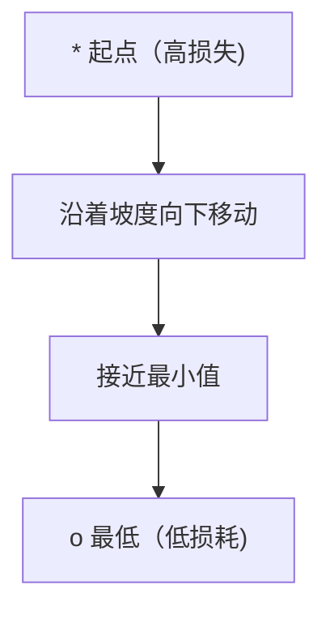
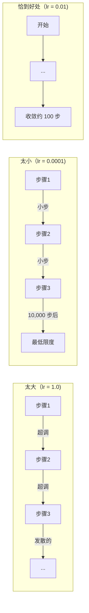
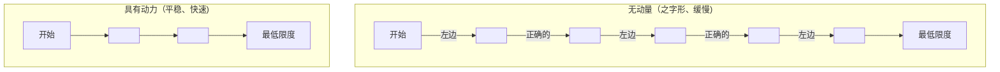
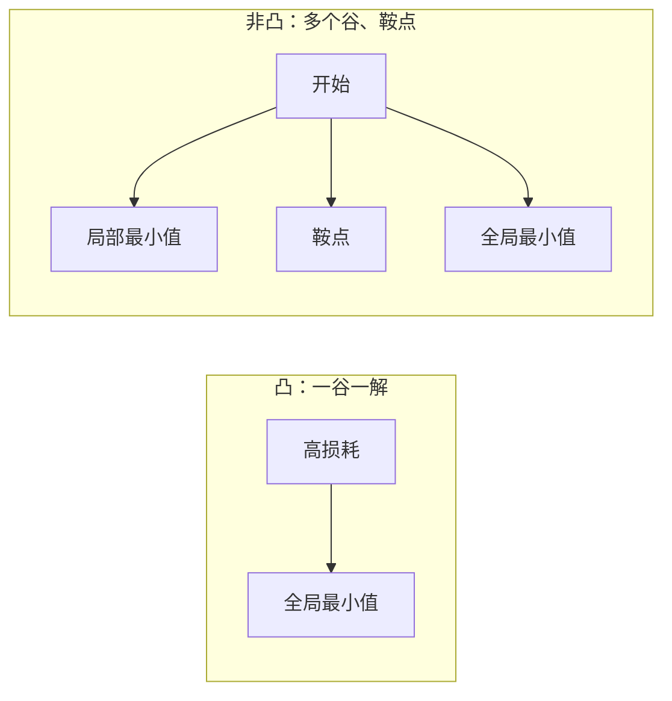
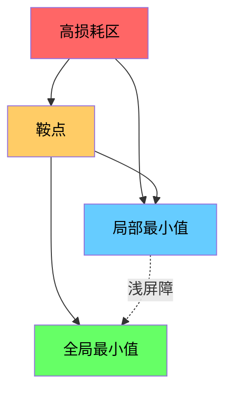

＃ 优化

> 训练神经网络无非是寻找山谷底部。

**类型：** ** Build
**语言：** Python
**先修：** ** 第 1 阶段，第 04-05 课（导数、梯度）
**时间：** ** 约 75 分钟

## 学习目标

- 从头开始实现普通梯度下降、动量 SGD 和 Adam
- 比较 Rosenbrock 函数上的优化器收敛性，并解释 Adam 为何采用每个权重的学习率
- 区分凸损失和非凸损失景观并解释鞍点在高维度中的作用
- 配置学习率计划（步进衰减、余弦退火、预热）以确保训练稳定性

＃＃ 问题

你有一个损失函数。它告诉您您的模型有多么错误。你有渐变。他们告诉你哪个方向会让损失更严重。现在你需要一个下坡的策略。

天真的方法很简单：逆着梯度移动。按称为学习率的某个数字缩放步长。重复。这就是梯度下降，并且它有效。但“作品”有一些警告。学习率太大，你就会完全越过山谷，在墙壁之间弹跳。太小了，你就会通过数千个不必要的步骤慢慢地寻找答案。到达鞍点后，即使您没有找到最小值，您也会停止移动。

深度学习中的每个优化器都回答同一个问题：如何更快、更可靠地到达谷底？

## 概念

### 优化意味着什么

优化是找到最小化（或最大化）函数的输入值。在机器学习中，函数就是损失。输入是模型的权重。训练就是优化。

```
minimize L(w) where:
  L = loss function
  w = model weights (could be millions of parameters)
```

### 梯度下降（原版）

最简单的优化器。计算每个权重的损失梯度。沿梯度的相反方向移动每个权重。按学习率缩放步长。

```
w = w - lr * gradient
```

这就是整个算法。一行。



### 学习率：最重要的超参数

学习率控制步长。它决定了关于收敛的一切。



正确的学习率没有公式。你可以通过实验找到它。常见起点：Adam 为 0.001，带动量的 SGD 为 0.01。

### SGD vs 批量 vs 小批量

普通梯度下降在采取一步之前计算整个数据集的梯度。这称为批量梯度下降。它很稳定但很慢。

随机梯度下降 (SGD) 计算单个随机样本的梯度并立即执行步骤。它很吵但是速度很快。

小批量梯度下降消除了差异。计算小批量（32、64、128、256 个样本）的梯度，然后步进。这是大家实际使用的。

|变体 |批量大小 |梯度质量|每步速度 |噪音|
|---------|-----------|-----------------|---------------|-------|
|批量GD |整个数据集|准确|慢|无 |
|新元 | 1 个样品 |很吵|快|高|
|小批量| 32-256 | 32-256不错的估计|平衡 |中等|

SGD 和小批量中的噪声不是错误。它有助于避开浅的局部极小值和鞍点。

### 动量：球滚下坡

普通梯度下降仅查看当前梯度。如果梯度呈锯齿状（常见于狭窄的山谷），则进展缓慢。动量通过将过去的梯度累积到速度项中来解决这个问题。

```
v = beta * v + gradient
w = w - lr * v
```

打个比方：一个球滚下坡。它不会在每次颠簸时停止并重新启动。它可以在一致的方向上增加速度并抑制振荡。



`beta`（通常为 0.9）控制要保留的历史记录量。较高的贝塔值意味着更大的动量、更平滑的路径，但对方向变化的响应更慢。

### Adam：自适应学习率

不同的权重需要不同的学习率。很少获得大梯度的权重在最终出现大梯度时应该采取更大的步骤。不断获得巨大梯度的权重应该采取较小的步长。

Adam（自适应力矩估计）跟踪每个权重的两件事：

1. 第一时刻 (m)：梯度的运行平均值（如动量）
2. 二阶矩 (v)：梯度平方的运行平均值（梯度大小）

```
m = beta1 * m + (1 - beta1) * gradient
v = beta2 * v + (1 - beta2) * gradient^2

m_hat = m / (1 - beta1^t)    bias correction
v_hat = v / (1 - beta2^t)    bias correction

w = w - lr * m_hat / (sqrt(v_hat) + epsilon)
```

`sqrt(v_hat)` 的划分是关键的见解。梯度较大的权重除以一个较大的数字（有效步长较小）。梯度小的权重除以一个小的数字（大的有效步长）。每个权重都有自己的自适应学习率。

默认超参数：`lr=0.001, beta1=0.9, beta2=0.999, epsilon=1e-8`。这些默认值适用于大多数问题。

### 学习率表

固定的学习率是一种妥协。在训练的早期，您希望迈出大步以取得快速进步。在训练后期，您需要小步进行微调以接近最小值。

常见时间表：

|日程 |公式|使用案例 |
|----------|---------|----------|
|阶跃衰减 | lr = lr * 每 N epoch 因子 |简单的手动控制|
|指数衰减| lr = lr_0 * 衰减^t |平滑还原|
|余弦退火| lr = lr_min + 0.5 * (lr_max - lr_min) * (1 + cos(pi * t / T)) |变形金刚，现代训练|
|预热+衰减|线性上升，然后衰减 |大型模型，防止早期不稳定|

### 凸与非凸

凸函数有一个最小值。梯度下降总能找到它。像 `f(x) = x^2` 这样的二次方程是凸的。

神经网络损失函数是非凸的。它们有许多局部最小值、鞍点和平坦区域。



实际上，高维神经网络中的局部极小值很少成为问题。大多数局部最小值的损失值接近全局最小值。鞍点（在某些方向上平坦，在其他方向上弯曲）是真正的障碍。小批量的动量和噪音有助于逃避它们。

### 损失景观可视化

损失是所有权重的函数。对于具有 100 万权重的模型，损失景观存在于 1,000,001 维空间中。我们通过在权重空间中选择两个随机方向并沿这些方向绘制损失来可视化它，生成一个 2D 表面。



尖锐的最小值概括性较差。平坦最小值可以很好地概括。这是具有动量的 SGD 在最终测试精度上通常优于 Adam 的原因之一：它的噪声可以防止陷入急剧的最小值。

```figure
gradient-descent
```

## Build It

### 第 1 步：定义测试函数

Rosenbrock 函数是经典的优化基准。它的最小值位于狭窄弯曲山谷内的 (1, 1)，很容易找到但很难跟踪。

```
f(x, y) = (1 - x)^2 + 100 * (y - x^2)^2
```

```python
def rosenbrock(params):
    x, y = params
    return (1 - x) ** 2 + 100 * (y - x ** 2) ** 2

def rosenbrock_gradient(params):
    x, y = params
    df_dx = -2 * (1 - x) + 200 * (y - x ** 2) * (-2 * x)
    df_dy = 200 * (y - x ** 2)
    return [df_dx, df_dy]
```

### 步骤 2：普通梯度下降

```python
class GradientDescent:
    def __init__(self, lr=0.001):
        self.lr = lr

    def step(self, params, grads):
        return [p - self.lr * g for p, g in zip(params, grads)]
```

### 步骤 3：势头强劲的 SGD

```python
class SGDMomentum:
    def __init__(self, lr=0.001, momentum=0.9):
        self.lr = lr
        self.momentum = momentum
        self.velocity = None

    def step(self, params, grads):
        if self.velocity is None:
            self.velocity = [0.0] * len(params)
        self.velocity = [
            self.momentum * v + g
            for v, g in zip(self.velocity, grads)
        ]
        return [p - self.lr * v for p, v in zip(params, self.velocity)]
```

### 步骤 4：亚当

```python
class Adam:
    def __init__(self, lr=0.001, beta1=0.9, beta2=0.999, epsilon=1e-8):
        self.lr = lr
        self.beta1 = beta1
        self.beta2 = beta2
        self.epsilon = epsilon
        self.m = None
        self.v = None
        self.t = 0

    def step(self, params, grads):
        if self.m is None:
            self.m = [0.0] * len(params)
            self.v = [0.0] * len(params)

        self.t += 1

        self.m = [
            self.beta1 * m + (1 - self.beta1) * g
            for m, g in zip(self.m, grads)
        ]
        self.v = [
            self.beta2 * v + (1 - self.beta2) * g ** 2
            for v, g in zip(self.v, grads)
        ]

        m_hat = [m / (1 - self.beta1 ** self.t) for m in self.m]
        v_hat = [v / (1 - self.beta2 ** self.t) for v in self.v]

        return [
            p - self.lr * mh / (vh ** 0.5 + self.epsilon)
            for p, mh, vh in zip(params, m_hat, v_hat)
        ]
```

### 第 5 步：运行并比较

```python
def optimize(optimizer, func, grad_func, start, steps=5000):
    params = list(start)
    history = [params[:]]
    for _ in range(steps):
        grads = grad_func(params)
        params = optimizer.step(params, grads)
        history.append(params[:])
    return history

start = [-1.0, 1.0]

gd_history = optimize(GradientDescent(lr=0.0005), rosenbrock, rosenbrock_gradient, start)
sgd_history = optimize(SGDMomentum(lr=0.0001, momentum=0.9), rosenbrock, rosenbrock_gradient, start)
adam_history = optimize(Adam(lr=0.01), rosenbrock, rosenbrock_gradient, start)

for name, history in [("GD", gd_history), ("SGD+M", sgd_history), ("Adam", adam_history)]:
    final = history[-1]
    loss = rosenbrock(final)
    print(f"{name:6s} -> x={final[0]:.6f}, y={final[1]:.6f}, loss={loss:.8f}")
```

预期输出：Adam 收敛速度最快。势头强劲的 SGD 走的是更平稳的道路。 Vanilla GD 沿着狭窄的山谷缓慢前进。

## Use It

在实践中，使用 PyTorch 或 JAX 优化器。它们处理参数组、权重衰减、梯度裁剪和 GPU 加速。

```python
import torch

model = torch.nn.Linear(784, 10)

sgd = torch.optim.SGD(model.parameters(), lr=0.01, momentum=0.9)
adam = torch.optim.Adam(model.parameters(), lr=0.001)
adamw = torch.optim.AdamW(model.parameters(), lr=0.001, weight_decay=0.01)

scheduler = torch.optim.lr_scheduler.CosineAnnealingLR(adam, T_max=100)
```

经验法则：

- 从 Adam 开始（lr=0.001）。它无需调整即可解决大多数问题。
- 当您需要最佳的最终精度并且可以承受更多调整时，切换到动量 SGD（lr=0.01，动量=0.9）。
- 使用 AdamW（具有解耦权重衰减的 Adam）作为变压器。
- 始终使用学习率计划来进行超过几个轮次的训练。
- 如果训练不稳定，降低学习率。如果训练太慢，请增加训练量。

## 发货

本课程将提示您选择正确的优化器。请参阅`outputs/prompt-optimizer-guide.md`。

当我们从头开始训练神经网络时，此处构建的优化器类会在第 3 阶段重新出现。

## 练习

1. **学习率扫描。** 在 Rosenbrock 函数上运行普通梯度下降，学习率为 [0.0001, 0.0005, 0.001, 0.005, 0.01]。绘制或打印每个步骤 5000 步后的最终损失。找到仍然收敛的最大学习率。

2. **动量比较。** 在 Rosenbrock 函数上使用动量值 [0.0, 0.5, 0.9, 0.99] 运行 SGD。跟踪每一步的损失。哪个动量值收敛得最快？哪个超调了？

3. **鞍点逃逸。** 定义函数`f(x, y) = x^2 - y^2`（原点处的鞍点）。从 (0.01, 0.01) 开始。比较普通 GD、带动量的 SGD 和 Adam 的行为。哪个逃脱了鞍点？

4. **实现学习率衰减。** 将指数衰减时间表添加到 GradientDescent 类：`lr = lr_0 * 0.999^step`。比较 Rosenbrock 函数有和没有衰减的收敛性。

## 关键术语

|术语 |人们怎么说|它实际上意味着什么 |
|------|----------------|----------------------|
|梯度下降| “走下坡路”|通过减去学习率缩放的梯度来更新权重。最基本的优化器。 |
|学习率| “步长” |控制每次更新将权重移动多远的标量。太大会导致发散。太小会浪费计算。 |
|势头| “继续滚动” |将过去的梯度累积到速度向量中。抑制振荡并加速一致方向的运动。 |
|新元 | “随机抽样” |随机梯度下降。在随机子集而不是完整数据集上计算梯度。在实践中几乎总是意味着小批量 SGD。 |
|小批量| “一大块数据” |用于估计梯度的一小部分训练数据（32-256 个样本）。平衡速度和梯度精度。 |
|亚当| “默认优化器”|自适应矩估计。跟踪每个权重的梯度和梯度平方运行平均值，为每个权重提供自己的学习率。 |
|偏差校正 | “修复冷启动”| Adam 的第一和第二时刻被初始化为零。偏差校正除以 (1 - beta^t) 以在早期步骤中进行补偿。 |
|学习率表| “随着时间的推移改变lr” |在训练过程中调整学习率的函数。早迈大步，晚迈小步。 |
|凸函数| 《一谷》|任何局部最小值都是全局最小值的函数。梯度下降总能找到它。神经网络损失不是凸的。 |
|鞍点| “持平但不是最低限度” |梯度为零但在某些方向上最小而在其他方向上最大的点。常见于高维度。 |
|损失景观| “地形”|损失函数在权重空间上绘制。通过沿两个随机方向切片来可视化。 |
|收敛| “到达那里”|优化器已经达到了进一步的步骤并不能有效减少损失的程度。 |

## 延伸阅读

- [Sebastian Ruder：梯度下降优化算法概述](https://ruder.io/optimizing-gradient-descent/) - 所有主要优化器的全面调查
- [为什么动量真正有效（蒸馏）](https://distill.pub/2017/momentum/) - 动量动态的交互式可视化
- [Adam: A Method for Stochastic Optimization (Kingma & Ba, 2014)](https://arxiv.org/abs/1412.6980) - Adam 的原始论文，可读且简短
- [可视化神经网络的损失景观（Li et al., 2018）](https://arxiv.org/abs/1712.09913) - 显示尖锐与平坦最小值的论文
