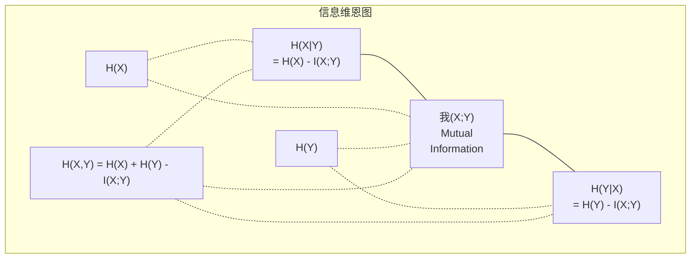

# 信息论

> 信息论衡量惊喜。 Loss functions are built on it.

**类型：** ** Learn
**语言：** Python
**先修：** ** 第 1 阶段，第 06 课（概率）
**时间：** ** 约 60 分钟

## 学习目标

- 从头开始计算熵、交叉熵和 KL 散度并解释它们的关系
- 推导出为什么最小化交叉熵损失相当于最大化对数似然
- 计算特征和目标之间的互信息以对特征重要性进行排名
- 将困惑度解释为语言模型选择的有效词汇量

＃＃ 问题

您在训练的每个分类模型中调用`CrossEntropyLoss()`。你在每一篇语言模型论文中都会看到“困惑”。您阅读了 VAE、蒸馏和 RLHF 中的 KL 散度。这些并不是互不相关的概念。他们都是戴着不同帽子的相同想法。

信息论为您提供了推理不确定性、压缩和预测的语言。克劳德·香农 (Claude Shannon) 于 1948 年发明它来解决通信问题。事实证明，训练神经网络是一个通信问题：模型试图通过学习权重的噪声通道传输正确的标签。

本课程从头开始构建每个公式，以便您了解它们的来源以及它们的工作原理。

## 概念

### 信息内容（惊喜）

当不太可能发生的事情发生时，它会携带更多信息。硬币落地头？并不奇怪。买彩票中奖了？非常令人惊讶。

概率为p的事件的信息内容为：

```
I(x) = -log(p(x))
```

使用以 2 为底的对数可以得到位。使用自然对数可以得到 nat。相同的想法，不同的单位。

```
Event              Probability    Surprise (bits)
Fair coin heads    0.5            1.0
Rolling a 6        0.167          2.58
1-in-1000 event    0.001          9.97
Certain event      1.0            0.0
```

某些事件携带零信息。你已经知道它们会发生。

### 熵（平均惊喜）

熵是分布的所有可能结果的预期惊喜。

```
H(P) = -sum( p(x) * log(p(x)) )  for all x
```

一枚公平的硬币对于二进制变量来说具有最大熵：1 位。有偏差的硬币（99% 正面）的熵较低：0.08 位。你已经知道会发生什么，所以每次翻转几乎什么也没有告诉你。

```
Fair coin:    H = -(0.5 * log2(0.5) + 0.5 * log2(0.5)) = 1.0 bit
Biased coin:  H = -(0.99 * log2(0.99) + 0.01 * log2(0.01)) = 0.08 bits
```

熵衡量分布中不可约的不确定性。您无法压缩到低于它。

### 交叉熵（您每天使用的损失函数）

交叉熵衡量的是当您使用分布 Q 来编码实际来自分布 P 的事件时的平均意外情况。

```
H(P, Q) = -sum( p(x) * log(q(x)) )  for all x
```

P 是真实分布（标签）。 Q 是模型的预测。如果 Q 与 P 完美匹配，则交叉熵等于熵。任何不匹配都会使其变大。

在分类中，P 是一个 one-hot 向量（真实类别的概率为 1，其他均为 0）。这将交叉熵简化为：

```
H(P, Q) = -log(q(true_class))
```

这就是整个分类的交叉熵损失公式。最大化正确类别的预测概率。

### KL 散度（分布之间的距离）

KL 散度衡量使用 Q 而不是 P 会带来多少额外的惊喜。

```
D_KL(P || Q) = sum( p(x) * log(p(x) / q(x)) )  for all x
             = H(P, Q) - H(P)
```

交叉熵是熵加上 KL 散度。由于真实分布的熵在训练期间是恒定的，因此最小化交叉熵与最小化 KL 散度相同。您正在将模型的分布推向真实分布。

KL 散度不对称：D_KL(P || Q) != D_KL(Q || P)。它不是真正的距离度量。

### 互信息

互信息衡量的是对一个变量的了解程度能告诉你多少关于另一个变量的信息。

```
I(X; Y) = H(X) - H(X|Y)
        = H(X) + H(Y) - H(X, Y)
```

如果 X 和 Y 独立，则互信息为零。了解其中一个并不能告诉你关于另一个的任何信息。如果它们完全相关，则互信息等于任一变量的熵。

在特征选择中，特征与目标之间的互信息高意味着该特征是有用的。互信息低意味着它是噪音。

### 条件熵

H(Y|X) 衡量观察 X 后 Y 还剩下多少不确定性。

```
H(Y|X) = H(X,Y) - H(X)
```

两个极端：
- 如果 X 完全决定 Y，则 H(Y|X) = 0。了解 X 可以消除有关 Y 的所有不确定性。示例：X = 摄氏度温度，Y = 华氏温度。
- 如果 X 没有告诉您任何有关 Y 的信息，则 H(Y|X) = H(Y)。了解 X 根本不会减少你的不确定性。示例：X = 抛硬币，Y = 明天的天气。

条件熵始终为非负且永远不会超过 H(Y)：

```
0 <= H(Y|X) <= H(Y)
```

在机器学习中，条件熵出现在决策树中。在每次分割时，算法都会选择最小化 H(Y|X) 的特征 X——该特征消除了标签 Y 的最大不确定性。

### 联合熵

H(X,Y) 是 X 和 Y 的联合分布的熵。

```
H(X,Y) = -sum sum p(x,y) * log(p(x,y))   for all x, y
```

关键属性：

```
H(X,Y) <= H(X) + H(Y)
```

当 X 和 Y 独立时，相等成立。如果它们共享信息，则联合熵小于个体熵之和。 “缺失”的熵正是互信息。



关系：
- H(X,Y) = H(X) + H(Y|X) = H(Y) + H(X|Y)
- I(X;Y) = H(X) - H(X|Y) = H(Y) - H(Y|X)
- H(X,Y) = H(X) + H(Y) - I(X;Y)

### 互信息（深入探讨）

互信息 I(X;Y) 量化了了解一个变量可以在多大程度上减少另一个变量的不确定性。

```
I(X;Y) = H(X) - H(X|Y)
       = H(Y) - H(Y|X)
       = H(X) + H(Y) - H(X,Y)
       = sum sum p(x,y) * log(p(x,y) / (p(x) * p(y)))
```

属性：
- I(X;Y) 始终 >= 0。观察某事永远不会丢失信息。
- I(X;Y) = 0 当且仅当 X 和 Y 独立时。
- I(X;Y) = I(Y;X)。与 KL 散度不同，它是对称的。
- I(X;X) = H(X)。变量与自身共享所有信息。

**用于特征选择的互信息。** 在 ML 中，您需要提供有关目标信息的特征。互信息为您提供了一种对特征进行排序的原则性方法：

1. 对于每个特征 X_i，计算 I(X_i; Y)，其中 Y 是目标变量。
2. 按 MI 分数对特征进行排名。
3.保留前k个特征。

这适用于特征和目标之间的任何关系——线性、非线性、单调或非单调。相关性仅捕获线性关系。 MI 抓住了一切。

|方法|检测 |计算成本|处理分类？ |
|--------|---------|-------------------|---------------------|
|皮尔逊相关 |线性关系 | O(n) |没有 |
|斯皮尔曼相关 |单调关系| O(n log n) | O(n log n) |没有 |
|互信息 |任何统计依赖性 | O(n log n) 带分箱 |是的 |

### 标签平滑和交叉熵

标准分类使用硬目标：[0,0,1,0]。真实类别的概率为 1，其他类别的概率为 0。标签平滑将这些概率替换为软目标：

```
soft_target = (1 - epsilon) * hard_target + epsilon / num_classes
```

当 epsilon = 0.1 和 4 个类别时：
- 硬目标：[0,0,1,0]
- 软目标：[0.025, 0.025, 0.925, 0.025]

从信息论的角度来看，标签平滑增加了目标分布的熵。硬独热目标的熵为 0——不存在不确定性。软目标具有正熵。

为什么这有帮助：
- 防止模型将 logits 驱动到极值（需要无限的 logits 才能在交叉熵下完美匹配 one-hot 目标）
- 充当正则化：模型不能 100% 置信
- 改进校准：预测概率更好地反映真实的不确定性
- 减少训练和推理行为之间的差距

带有标签平滑的交叉熵损失变为：

```
L = (1 - epsilon) * CE(hard_target, prediction) + epsilon * H_uniform(prediction)
```

第二项惩罚远不统一的预测——对置信度的直接正则化。

### 为什么交叉熵是分类损失

三种视角，同一个结论。

**信息论观点。** 交叉熵测量通过使用模型的分布而不是真实的分布浪费了多少位。最小化它使您的模型成为最有效的现实编码器。

**最大似然视图。** 对于具有真实类别 y_i 的 N 个训练样本：

```
Likelihood     = product( q(y_i) )
Log-likelihood = sum( log(q(y_i)) )
Negative log-likelihood = -sum( log(q(y_i)) )
```

最后一行是交叉熵损失。最小化交叉熵 = 最大化模型下训练数据的可能性。

**梯度视图。** 交叉熵相对于 logits 的梯度很简单（预测 - 真实）。干净、稳定且计算速度快。这就是它与 softmax 完美搭配的原因。

### Bits vs Nats

唯一的区别是对数基数。

```
log base 2   -> bits      (information theory tradition)
log base e   -> nats      (machine learning convention)
log base 10  -> hartleys  (rarely used)
```

1 nat = 1/ln(2) 位 = 1.4427 位。 PyTorch 和 TensorFlow 默认使用自然对数 (nats)。

### 困惑

困惑度是交叉熵的指数。它告诉您模型不确定的同等可能选择的有效数量。

```
Perplexity = 2^H(P,Q)   (if using bits)
Perplexity = e^H(P,Q)   (if using nats)
```

平均而言，困惑度为 50 的语言模型就像必须从 50 个可能的下一个标记中统一选择一样混乱。越低越好。

GPT-2 在常见基准测试中达到了约 30 的困惑度。对于代表性良好的领域，现代模型都是个位数。

```figure
entropy-kl
```

## Build It

### 步骤1：信息内容和熵

```python
import math

def information_content(p, base=2):
    if p <= 0 or p > 1:
        return float('inf') if p <= 0 else 0.0
    return -math.log(p) / math.log(base)

def entropy(probs, base=2):
    return sum(
        p * information_content(p, base)
        for p in probs if p > 0
    )

fair_coin = [0.5, 0.5]
biased_coin = [0.99, 0.01]
fair_die = [1/6] * 6

print(f"Fair coin entropy:   {entropy(fair_coin):.4f} bits")
print(f"Biased coin entropy: {entropy(biased_coin):.4f} bits")
print(f"Fair die entropy:    {entropy(fair_die):.4f} bits")
```

### 步骤 2：交叉熵和 KL 散度

```python
def cross_entropy(p, q, base=2):
    total = 0.0
    for pi, qi in zip(p, q):
        if pi > 0:
            if qi <= 0:
                return float('inf')
            total += pi * (-math.log(qi) / math.log(base))
    return total

def kl_divergence(p, q, base=2):
    return cross_entropy(p, q, base) - entropy(p, base)

true_dist = [0.7, 0.2, 0.1]
good_model = [0.6, 0.25, 0.15]
bad_model = [0.1, 0.1, 0.8]

print(f"Entropy of true dist:     {entropy(true_dist):.4f} bits")
print(f"CE (good model):          {cross_entropy(true_dist, good_model):.4f} bits")
print(f"CE (bad model):           {cross_entropy(true_dist, bad_model):.4f} bits")
print(f"KL divergence (good):     {kl_divergence(true_dist, good_model):.4f} bits")
print(f"KL divergence (bad):      {kl_divergence(true_dist, bad_model):.4f} bits")
```

### 步骤 3：交叉熵作为分类损失

```python
def softmax(logits):
    max_logit = max(logits)
    exps = [math.exp(z - max_logit) for z in logits]
    total = sum(exps)
    return [e / total for e in exps]

def cross_entropy_loss(true_class, logits):
    probs = softmax(logits)
    return -math.log(probs[true_class])

logits = [2.0, 1.0, 0.1]
true_class = 0

probs = softmax(logits)
loss = cross_entropy_loss(true_class, logits)

print(f"Logits:      {logits}")
print(f"Softmax:     {[f'{p:.4f}' for p in probs]}")
print(f"True class:  {true_class}")
print(f"Loss:        {loss:.4f} nats")
print(f"Perplexity:  {math.exp(loss):.2f}")
```

### 步骤 4：交叉熵等于负对数似然

```python
import random

random.seed(42)

n_samples = 1000
n_classes = 3
true_labels = [random.randint(0, n_classes - 1) for _ in range(n_samples)]
model_logits = [[random.gauss(0, 1) for _ in range(n_classes)] for _ in range(n_samples)]

ce_loss = sum(
    cross_entropy_loss(label, logits)
    for label, logits in zip(true_labels, model_logits)
) / n_samples

nll = -sum(
    math.log(softmax(logits)[label])
    for label, logits in zip(true_labels, model_logits)
) / n_samples

print(f"Cross-entropy loss:      {ce_loss:.6f}")
print(f"Negative log-likelihood: {nll:.6f}")
print(f"Difference:              {abs(ce_loss - nll):.2e}")
```

### 步骤 5：互信息

```python
def mutual_information(joint_probs, base=2):
    rows = len(joint_probs)
    cols = len(joint_probs[0])

    margin_x = [sum(joint_probs[i][j] for j in range(cols)) for i in range(rows)]
    margin_y = [sum(joint_probs[i][j] for i in range(rows)) for j in range(cols)]

    mi = 0.0
    for i in range(rows):
        for j in range(cols):
            pxy = joint_probs[i][j]
            if pxy > 0:
                mi += pxy * math.log(pxy / (margin_x[i] * margin_y[j])) / math.log(base)
    return mi

independent = [[0.25, 0.25], [0.25, 0.25]]
dependent = [[0.45, 0.05], [0.05, 0.45]]

print(f"MI (independent): {mutual_information(independent):.4f} bits")
print(f"MI (dependent):   {mutual_information(dependent):.4f} bits")
```

## Use It

使用 NumPy 的相同概念，您将在实践中使用它们的方式：

```python
import numpy as np

def np_entropy(p):
    p = np.asarray(p, dtype=float)
    mask = p > 0
    result = np.zeros_like(p)
    result[mask] = p[mask] * np.log(p[mask])
    return -result.sum()

def np_cross_entropy(p, q):
    p, q = np.asarray(p, dtype=float), np.asarray(q, dtype=float)
    mask = p > 0
    return -(p[mask] * np.log(q[mask])).sum()

def np_kl_divergence(p, q):
    return np_cross_entropy(p, q) - np_entropy(p)

true = np.array([0.7, 0.2, 0.1])
pred = np.array([0.6, 0.25, 0.15])
print(f"Entropy:    {np_entropy(true):.4f} nats")
print(f"Cross-ent:  {np_cross_entropy(true, pred):.4f} nats")
print(f"KL div:     {np_kl_divergence(true, pred):.4f} nats")
```

您从头开始构建了 `torch.nn.CrossEntropyLoss()` 内部的功能。现在您知道为什么损失在训练期间下降了：您的模型的预测分布越来越接近真实分布（以浪费信息的 nat 来衡量）。

## 练习

1. 假设均匀分布（26 个字母），计算英文字母表的熵。然后使用实际字母频率来估计它。哪个更高，为什么？

2. 对于具有真实类别 1 的样本，模型输出 logits [5.0, 2.0, 0.5]。手动计算交叉熵损失，然后使用 `cross_entropy_loss` 函数进行验证。什么 Logits 会带来零损失？

3.证明KL散度不是对称的。选择两个分布 P 和 Q 并计算 D_KL(P || Q) 和 D_KL(Q || P)。解释为什么它们不同。

4. 构建一个计算一系列标记预测的困惑度的函数。给定一个（true_token_index，predicted_logits）对列表，返回序列的困惑度。

## 关键术语

|术语 |人们怎么说|它实际上意味着什么 |
|------|----------------|----------------------|
|资讯内容| 「惊喜」|编码事件所需的位数（或 nats）：-log(p) |
|熵| “随机性”|分布的所有结果的平均惊喜。衡量不可约的不确定性。 |
|交叉熵 | “损失函数” |使用模型分布 Q 对来自真实分布 P 的事件进行编码时的平均惊喜。
| KL 散度 | “分布之间的距离” |使用 Q 而不是 P 会浪费额外的比特。等于交叉熵减去熵。不对称。 |
|互信息 | “X 和 Y 的相关性如何”|通过了解 Y 可以减少 X 的不确定性。零意味着独立。 |
| Softmax| “将逻辑转化为概率”|求幂并标准化。将任何实值向量映射到有效的概率分布。 |
|困惑| “模型有多混乱”|交叉熵的指数。模型在每一步中选择的有效词汇量。 |
|比特| “香农单位”|信息以对数为底 2 测量。一位解决了一次公平的抛硬币问题。 |
|纳兹 | “ML的单位”|用自然对数测量的信息。默认情况下由 PyTorch 和 TensorFlow 使用。 |
|负对数似然 | “NLL 损失”|与单热标签的交叉熵损失相同。最小化它可以最大化正确预测的概率。 |

## 延伸阅读

- [Shannon 1948: A Mathematical Theory of Communication](https://people.math.harvard.edu/~ctm/home/text/others/shannon/entropy/entropy.pdf) - 原始论文，仍然可读
- [视觉信息理论 (Chris Olah)](https://colah.github.io/posts/2015-09-Visual-Information/) - 熵和 KL 散度的最佳视觉解释
- [PyTorch CrossEntropyLoss 文档](https://pytorch.org/docs/stable/generated/torch.nn.CrossEntropyLoss.html) - 框架如何实现您刚刚构建的内容
