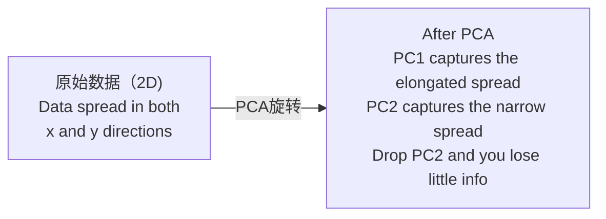

# 降维

> 高维数据是有结构的。从正确的角度看就能找到它。

**类型：** ** Build
**语言：** Python
**先修：** ** 第 1 阶段，第 01 课（线性代数直觉）、第 02 课（向量、矩阵和运算）、第 03 课（特征值和特征向量）、第 06 课（概率和分布）
**时间：** ** 约 90 分钟

## 学习目标

- 从头开始实施 PCA：中心数据、计算协方差矩阵、特征分解和投影
- 使用解释方差比和肘法来选择主成分的数量
- 比较 PCA、t-SNE 和 UMAP 在 2D 中可视化 MNIST 数字并解释它们的权衡
- 应用具有 RBF 内核的内核 PCA 来分离标准 PCA 无法处理的非线性数据结构

＃＃ 问题

您的数据集每个样本有 784 个特征。也许是手写数字的像素值。也许是基因表达水平。也许这是用户行为信号。你无法想象 784 个维度。你无法绘制它们。你甚至无法思考它们。

但这 784 个功能大部分都是多余的。实际信息存在于一个小得多的表面上。一个手写的“7”不需要784个独立的数字来描述它。它需要几个：划水的角度、横杆的长度、倾斜的程度。其余的都是噪音。

降维发现更小的表面。它获取 784 维数据并将其压缩到 2、10 或 50 维，同时保留重要的结构。

## 概念

### 维度的诅咒

高维空间是不直观的。随着维度的增长，三件事会被打破。

**距离变得毫无意义。** 在高维度中，任意两个随机点之间的距离会收敛到相同的值。如果每个点与其他点的距离大致相同，则最近邻搜索将停止工作。

```
Dimension    Avg distance ratio (max/min between random points)
2            ~5.0
10           ~1.8
100          ~1.2
1000         ~1.02
```

**体积集中在角上。** d 维的单位超立方体有 2^d 个角。在 100 个维度中，几乎所有体积都位于远离中心的角落。数据点扩散到边缘，您的模型缺乏内部数据。

**您需要指数级更多的数据。** 为在空间中保持相同的样本密度，从 2D 变为 20D 意味着您需要 10^18 倍的数据。你永远都不够。减少维度可以使数据密度恢复到可行的水平。

### PCA：找到重要的方向

主成分分析 (PCA) 查找数据变化最大的轴。它会旋转坐标系，以便第一个轴捕获最大方差，第二个轴捕获次最大方差，依此类推。

算法：

```
1. Center the data        (subtract the mean from each feature)
2. Compute covariance     (how features move together)
3. Eigendecomposition     (find the principal directions)
4. Sort by eigenvalue     (biggest variance first)
5. Project               (keep top k eigenvectors, drop the rest)
```

为什么要进行特征分解？协方差矩阵是对称且半正定的。其特征向量是特征空间中的正交方向。特征值告诉您每个方向捕获了多少方差。具有最大特征值的特征向量沿着最大方差的方向指向。



- **PCA 之前：** 数据云沿 x 轴和 y 轴对角分布
- **PCA 之后：** 旋转坐标系，使 PC1 与最大方差方向（拉长分布）对齐，PC2 与最小方差方向（窄分布）对齐
- **降维：** 删除 PC2 将数据投影到 PC1 上，丢失很少的信息

### 解释方差比

每个主成分捕获总方差的一小部分。解释的方差比告诉您有多少。

```
Component    Eigenvalue    Explained ratio    Cumulative
PC1          4.73          0.473              0.473
PC2          2.51          0.251              0.724
PC3          1.12          0.112              0.836
PC4          0.89          0.089              0.925
...
```

当累积解释方差达到 0.95 时，您就知道许多组件捕获了 95% 的信息。此后的一切大多都是噪音。

### 选择组件数量

三种策略：

1. **阈值。** 保留足够的成分来解释 90-95% 的方差。
2. **肘部法。** 绘制每个分量的解释方差。寻找急剧下降的情况。
3. **下游性能。** 使用PCA作为预处理。扫描 k 并测量模型的准确性。最好的 k 是精度达到稳定水平的地方。

### t-SNE：保护社区

t-分布式随机邻域嵌入 (t-SNE) 专为可视化而设计。它将高维数据映射到 2D（或 3D），同时保留哪些点彼此靠近。

直觉：在原始空间中，根据点对的距离计算它们的概率分布。附近的点获得高概率。远点的概率较低。然后找到保持相同概率分布的二维排列。在 784 维中相邻的点在 2D 中仍然是相邻的。

t-SNE 的主要特性：
- 非线性。它可以展开 PCA 无法展开的复杂流形。
- 随机。不同的运行会产生不同的布局。
- 困惑度参数控制要考虑的邻居数量（典型范围：5-50）。
- 输出中簇之间的距离没有意义。只有簇本身是。
- 在大型数据集上速度缓慢。默认情况下为 O(n^2)。

### UMAP：更快、更好的全局结构

均匀流形逼近和投影 (UMAP) 的工作原理与 t-SNE 类似，但具有两个优点：
- 更快。它使用近似最近邻图而不是计算所有成对距离。
- 更好的全球结构。输出中簇的相对位置往往比 t-SNE 中更有意义。

UMAP 在高维空间中构建加权图（“模糊拓扑表示”），然后找到尽可能保留该图的低维布局。

关键参数：
- `n_neighbors`：有多少邻居定义局部结构（类似于困惑）。较高的值可保留更多的全局结构。
- `min_dist`：输出中点打包在一起的紧密程度。较低的值会创建更密集的簇。

### 何时使用哪个

|方法|使用案例 |蜜饯 |速度|
|--------|----------|-----------|-------|
|主成分分析|训练前的预处理 |全局方差 |快速（准确），可处理数百万个样本 |
|主成分分析|快速探索性可视化 |线性结构 |快|
| t-SNE |出版质量的二维绘图 |当地社区 |慢（理想情况下 < 10k 样本）|
|乌玛普|大规模二维可视化 |局部+一些全局结构|中型（处理数百万）|
|主成分分析|模型的特征缩减 |方差排序特征 |快|
| t-SNE / UMAP |了解集群结构 |集群分离|中到慢|

经验法则：使用 PCA 进行预处理和数据压缩。当您需要以 2D 形式可视化结构时，请使用 t-SNE 或 UMAP。

### 内核主成分分析

标准 PCA 找到线性子空间。它会旋转您的坐标系并放下轴。但是如果数据位于非线性流形上怎么办？二维圆不能被任何直线分开。标准 PCA 没有帮助。

核 PCA 将 PCA 应用于由核函数导出的高维特征空间，而无需显式计算该空间中的坐标。这就是内核技巧——与 SVM 背后的想法相同。

算法：
1. 计算核矩阵 K，其中 K_ij = k(x_i, x_j)
2. 将核矩阵置于特征空间的中心
3. 中心核矩阵特征分解
4. 顶部特征向量（按 1/sqrt(特征值) 缩放）是投影

常用核函数：

|内核|公式|适合 |
|--------|---------|----------|
| RBF（高斯）| exp(-gamma * \|\|x - y\|\|^2) |大多数非线性数据，平滑流形 |
|多项式 | (x . y + c)^d | (x . y + c)^d | (x . y + c)^d |多项式关系|
|乙状结肠 | tanh(alpha * x . y + c) |类似神经网络的映射 |

何时使用内核 PCA 与标准 PCA：

|标准|标准PCA |内核主成分分析 |
|-----------|-------------|------------|
|数据结构|线性子空间|非线性流形|
|速度| O(min(n^2d,d^2n))| O(n^2d + n^3) | O(n^2 d + n^3) |
|可解释性|组件是特征的线性组合 |组件缺乏直接的特征解释|
|可扩展性|适用于数百万个样本 |内核矩阵为 n x n，内存有限 |
|重建|直接逆变换|需要原像近似 |

经典示例：二维同心圆。两个点环，一环在另一环内。标准 PCA 将两者投影到同一条线上——对于分类毫无用处。具有 RBF 核的核 PCA 将内圆和外圆映射到不同的区域，使它们线性可分离。

### 重建错误

你的降维效果如何？您将 784 个维度压缩为 50 个。您丢失了什么？

测量重构误差：
1. 将数据投影到k维：X_reduced = X @ W_k
2. 重构：X_hat = X_reduced @ W_k^T
3. 计算MSE：mean((X - X_hat)^2)

对于 PCA，重构误差与解释方差有明确的关系：

```
Reconstruction error = sum of eigenvalues NOT included
Total variance = sum of ALL eigenvalues
Fraction lost = (sum of dropped eigenvalues) / (sum of all eigenvalues)
```

每个分量的解释方差比为：

```
explained_ratio_k = eigenvalue_k / sum(all eigenvalues)
```

绘制累积解释方差与分量数量的关系图，即可得出“肘部”曲线。正确的组件数量是：
- 曲线变平（收益递减）
- 累积方差超过您的阈值（通常为 0.90 或 0.95）
- 下游任务绩效停滞不前

重建误差除了选择 k 之外还有用。您可以将其用于异常检测：具有高重建误差的样本是不适合学习子空间的异常值。这是生产系统中基于 PCA 的异常检测的基础。

```figure
pca-axes
```

## Build It

### 第 1 步：从头开始 PCA

```python
import numpy as np

class PCA:
    def __init__(self, n_components):
        self.n_components = n_components
        self.components = None
        self.mean = None
        self.eigenvalues = None
        self.explained_variance_ratio_ = None

    def fit(self, X):
        self.mean = np.mean(X, axis=0)
        X_centered = X - self.mean

        cov_matrix = np.cov(X_centered, rowvar=False)

        eigenvalues, eigenvectors = np.linalg.eigh(cov_matrix)

        sorted_idx = np.argsort(eigenvalues)[::-1]
        eigenvalues = eigenvalues[sorted_idx]
        eigenvectors = eigenvectors[:, sorted_idx]

        self.components = eigenvectors[:, :self.n_components].T
        self.eigenvalues = eigenvalues[:self.n_components]
        total_var = np.sum(eigenvalues)
        self.explained_variance_ratio_ = self.eigenvalues / total_var

        return self

    def transform(self, X):
        X_centered = X - self.mean
        return X_centered @ self.components.T

    def fit_transform(self, X):
        self.fit(X)
        return self.transform(X)
```

### 第 2 步：对合成数据进行测试

```python
np.random.seed(42)
n_samples = 500

t = np.random.uniform(0, 2 * np.pi, n_samples)
x1 = 3 * np.cos(t) + np.random.normal(0, 0.2, n_samples)
x2 = 3 * np.sin(t) + np.random.normal(0, 0.2, n_samples)
x3 = 0.5 * x1 + 0.3 * x2 + np.random.normal(0, 0.1, n_samples)

X_synthetic = np.column_stack([x1, x2, x3])

pca = PCA(n_components=2)
X_reduced = pca.fit_transform(X_synthetic)

print(f"Original shape: {X_synthetic.shape}")
print(f"Reduced shape:  {X_reduced.shape}")
print(f"Explained variance ratios: {pca.explained_variance_ratio_}")
print(f"Total variance captured: {sum(pca.explained_variance_ratio_):.4f}")
```

### 步骤 3：二维 MNIST 数字

```python
from sklearn.datasets import fetch_openml

mnist = fetch_openml("mnist_784", version=1, as_frame=False, parser="auto")
X_mnist = mnist.data[:5000].astype(float)
y_mnist = mnist.target[:5000].astype(int)

pca_mnist = PCA(n_components=50)
X_pca50 = pca_mnist.fit_transform(X_mnist)
print(f"50 components capture {sum(pca_mnist.explained_variance_ratio_):.2%} of variance")

pca_2d = PCA(n_components=2)
X_pca2d = pca_2d.fit_transform(X_mnist)
print(f"2 components capture {sum(pca_2d.explained_variance_ratio_):.2%} of variance")
```

### 步骤 4：与 sklearn 比较

```python
from sklearn.decomposition import PCA as SklearnPCA
from sklearn.manifold import TSNE

sklearn_pca = SklearnPCA(n_components=2)
X_sklearn_pca = sklearn_pca.fit_transform(X_mnist)

print(f"\nOur PCA explained variance:     {pca_2d.explained_variance_ratio_}")
print(f"Sklearn PCA explained variance: {sklearn_pca.explained_variance_ratio_}")

diff = np.abs(np.abs(X_pca2d) - np.abs(X_sklearn_pca))
print(f"Max absolute difference: {diff.max():.10f}")

tsne = TSNE(n_components=2, perplexity=30, random_state=42)
X_tsne = tsne.fit_transform(X_mnist)
print(f"\nt-SNE output shape: {X_tsne.shape}")
```

### 步骤 5：UMAP 比较

```python
try:
    from umap import UMAP

    reducer = UMAP(n_components=2, n_neighbors=15, min_dist=0.1, random_state=42)
    X_umap = reducer.fit_transform(X_mnist)
    print(f"UMAP output shape: {X_umap.shape}")
except ImportError:
    print("Install umap-learn: pip install umap-learn")
```

## Use It

PCA 作为分类器之前的预处理：

```python
from sklearn.decomposition import PCA as SklearnPCA
from sklearn.linear_model import LogisticRegression
from sklearn.model_selection import train_test_split
from sklearn.metrics import accuracy_score

X_train, X_test, y_train, y_test = train_test_split(
    X_mnist, y_mnist, test_size=0.2, random_state=42
)

results = {}
for k in [10, 30, 50, 100, 200]:
    pca_k = SklearnPCA(n_components=k)
    X_tr = pca_k.fit_transform(X_train)
    X_te = pca_k.transform(X_test)

    clf = LogisticRegression(max_iter=1000, random_state=42)
    clf.fit(X_tr, y_train)
    acc = accuracy_score(y_test, clf.predict(X_te))
    var_captured = sum(pca_k.explained_variance_ratio_)
    results[k] = (acc, var_captured)
    print(f"k={k:>3d}  accuracy={acc:.4f}  variance={var_captured:.4f}")
```

性能在 784 尺寸之前就达到了稳定水平。这个平台就是你的操作点。

## 发货

本课产生：
- `outputs/skill-dimensionality-reduction.md` - 为给定任务选择正确的降维技术的技能

## 练习

1. 修改PCA类以支持`inverse_transform`。从 10、50 和 200 个分量重建 MNIST 数字。打印每个的重建误差（与原始的均方差）。

2. 在同一 MNIST 子集上运行 t-SNE，困惑度值为 5、30 和 100。描述输出如何变化。为什么困惑会影响集群紧密度？

3. 获取一个包含 50 个特征的数据集，其中只有 5 个特征具有信息性（使用 `sklearn.datasets.make_classification` 生成一个）。应用 PCA 并检查解释方差曲线是否正确识别数据实际上是 5 维的。

## 关键术语

|术语 |人们怎么说|它实际上意味着什么 |
|------|----------------|----------------------|
|维数诅咒| “功能太多”|随着维度的增长，距离、体积和数据密度的表现都与直觉相反。模型需要指数级更多的数据来进行补偿。 |
|主成分分析| “减少尺寸”|旋转坐标系，使轴与最大方差的方向对齐，然后删除低方差轴。 |
|主成分| “一个重要方向”|协方差矩阵的特征向量。特征空间中数据变化最大的方向。 |
|解释方差比 | “这个组件有多少信息” |由一个主成分捕获的总方差的分数。将前 k 个比率相加，以查看保留了多少 k 个分量。 |
|协方差矩阵 | “特征如何关联” |对称矩阵，其中条目 (i,j) 测量特征 i 和特征 j 如何一起移动。对角线条目是个体差异。 |
| t-SNE | “那个集群情节”|一种通过保留成对邻域概率将高维数据映射到二维的非线性方法。适合可视化，但不适合预处理。 |
|乌玛普| “更快的 t-SNE” |一种基于拓扑数据分析的非线性方法。保留局部和一些全局结构。比 t-SNE 具有更好的扩展性。 |
|困惑| “t-SNE 旋钮”|控制每个点考虑的有效邻居数量。低困惑度关注非常局部的结构。高困惑度捕捉更广泛的模式。 |
|歧管| “数据所在的表面”|嵌入高维空间中的低维表面。一张 3D 皱巴巴的纸就是一个 2D 流形。 |

## 延伸阅读

- [主成分分析教程](https://arxiv.org/abs/1404.1100) (Shlens) - 从头开始清晰地推导 PCA
- [如何有效使用 t-SNE](https://distill.pub/2016/misread-tsne/) (Wattenberg 等人) - t-SNE 陷阱和参数选择的交互式指南
- [UMAP 文档](https://umap-learn.readthedocs.io/) - UMAP 作者的理论和实践指导
