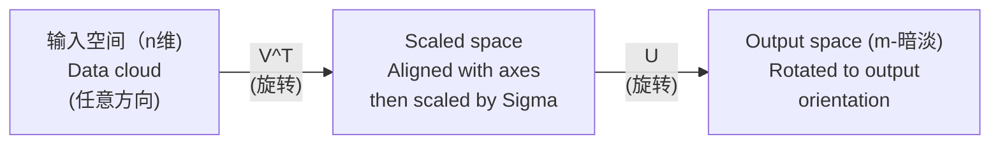
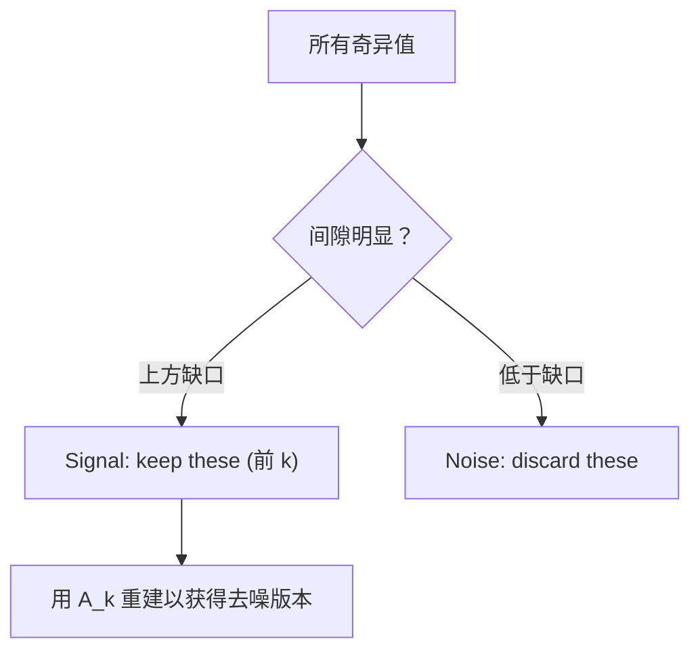

# 奇异值分解

> SVD 是线性代数的瑞士军刀。每个矩阵都有一个。每个数据科学家都需要一个。

**类型：** ** Build
**语言：** ** Python, Julia
**先修：** ** 第 1 阶段，第 01 课（线性代数直觉）、第 02 课（向量和矩阵运算）、第 03 课（矩阵变换）
**时间：** ** 约 120 分钟

## 学习目标

- 通过幂迭代实现SVD并解释U、Sigma、V^T的几何意义
- 应用截断 SVD 进行图像压缩并测量压缩率与重建误差
- 通过 SVD 计算 Moore-Penrose 伪逆来求解超定最小二乘系统
- 将 SVD 连接到 PCA、推荐系统（潜在因素）和 NLP 中的潜在语义分析

＃＃ 问题

你有一个 1000x2000 的矩阵。也许是用户对电影的评分。也许它是一个文档术语频率表。也许是图像的像素值。您需要对其进行压缩、去噪、找到其中隐藏的结构，或者用它求解最小二乘系统。特征分解仅适用于方阵。即使如此，它也要求矩阵具有一整套线性独立的特征向量。

SVD 适用于任何矩阵。任何形状。任何军衔。没有条件。它将矩阵分解为三个因子，揭示矩阵对空间的几何影响。它是所有线性代数中最通用和最有用的因式分解。

## 概念

### SVD 在几何上的作用

每个矩阵，无论形状如何，都会按顺序执行三个操作：旋转、缩放、旋转。 SVD 使这种分解变得明确。

```
A = U * Sigma * V^T

      m x n     m x m    m x n    n x n
     (any)    (rotate)  (scale)  (rotate)
```

给定任意矩阵 A，SVD 将其分解为：
- V^T 在输入空间（n 维）中旋转向量
- 西格玛沿每个轴缩放（拉伸或压缩）
- U 将结果旋转到输出空间（m 维）



这样想吧。你给 SVD 一个矩阵。它告诉你：“这个矩阵采用一个球体作为输入，首先将其旋转 V^T，然后将其拉伸为 Sigma 椭圆体，然后将椭圆体旋转 U。”奇异值是椭球体轴的长度。

### 完整分解

对于形状为 m x n 的矩阵 A：

```
A = U * Sigma * V^T

where:
  U     is m x m, orthogonal (U^T U = I)
  Sigma is m x n, diagonal (singular values on the diagonal)
  V     is n x n, orthogonal (V^T V = I)

The singular values sigma_1 >= sigma_2 >= ... >= sigma_r > 0
where r = rank(A)
```

U 的列称为左奇异向量。 V 的列称为右奇异向量。 Sigma 的对角线项称为奇异值。它们始终是非负的，并且通常按降序排序。

### 左奇异向量、奇异值、右奇异向量

SVD 的每个分量都有不同的几何意义。

**右奇异向量（V 的列）：** 这些形成输入空间 (R^n) 的正交基。它们是矩阵映射到输出空间中的正交方向的输入空间中的方向。将它们视为域的自然坐标系。

**奇异值（Sigma 对角线）：** 这些是缩放因子。第 i 个奇异值告诉您矩阵沿第 i 个右奇异向量拉伸向量的程度。奇异值为零意味着矩阵完全破坏该方向。

**左奇异向量（U 的列）：** 这些形成输出空间 (R^m) 的正交基。第 i 个左奇异向量是第 i 个右奇异向量落在输出空间中的方向（缩放后）。

他们之间的关系：

```
A * v_i = sigma_i * u_i

The matrix A takes the i-th right singular vector v_i,
scales it by sigma_i, and maps it to the i-th left singular vector u_i.
```

这为您提供了任何矩阵的逐坐标图像。

### 外部产品形式

SVD 可以写成 1 阶矩阵之和：

```
A = sigma_1 * u_1 * v_1^T + sigma_2 * u_2 * v_2^T + ... + sigma_r * u_r * v_r^T

Each term sigma_i * u_i * v_i^T is a rank-1 matrix (an outer product).
The full matrix is the sum of r such matrices, where r is the rank.
```

这种形式是低阶近似的基础。每个术语都添加一层结构。第一项捕获了最重要的单一模式。第二个捕获了下一个最重要的。等等。截断这个总和可以为您提供任何给定等级的最佳近似值。

```
Rank-1 approx:    A_1 = sigma_1 * u_1 * v_1^T
                  (captures the dominant pattern)

Rank-2 approx:    A_2 = sigma_1 * u_1 * v_1^T + sigma_2 * u_2 * v_2^T
                  (captures the two most important patterns)

Rank-k approx:    A_k = sum of top k terms
                  (optimal by the Eckart-Young theorem)
```

### 与特征分解的关系

SVD 和特征分解有着密切的联系。 A 的奇异值和向量直接来自 A^T A 和 A A^T 的特征值和特征向量。

```
A^T A = V * Sigma^T * U^T * U * Sigma * V^T
      = V * Sigma^T * Sigma * V^T
      = V * D * V^T

where D = Sigma^T * Sigma is a diagonal matrix with sigma_i^2 on the diagonal.

So:
- The right singular vectors (V) are eigenvectors of A^T A
- The singular values squared (sigma_i^2) are eigenvalues of A^T A

Similarly:
A A^T = U * Sigma * V^T * V * Sigma^T * U^T
      = U * Sigma * Sigma^T * U^T

So:
- The left singular vectors (U) are eigenvectors of A A^T
- The eigenvalues of A A^T are also sigma_i^2
```

这个连接告诉你三件事：
1. 奇异值始终是实数且非负（它们是正半定矩阵的特征值的平方根）。
2. 您可以通过 A^T A 的特征分解来计算 SVD，但这会平方条件数并损失数值精度。专用的 SVD 算法可以避免这种情况。
3.当A是平方且对称正半定时，SVD和特征分解是同一件事。

### 截断 SVD：低秩近似

Eckart-Young-Mirsky 定理指出，A 的最佳 k 阶近似（在 Frobenius 和谱范数中）是通过仅保留前 k 个奇异值及其对应向量来获得的：

```
A_k = U_k * Sigma_k * V_k^T

where:
  U_k     is m x k  (first k columns of U)
  Sigma_k is k x k  (top-left k x k block of Sigma)
  V_k     is n x k  (first k columns of V)

Approximation error = sigma_{k+1}  (in spectral norm)
                    = sqrt(sigma_{k+1}^2 + ... + sigma_r^2)  (in Frobenius norm)
```

这不仅仅是“一个好的”近似。它被证明是 k 阶的最佳近似。没有其他 k 阶矩阵更接近 A。

|组件|相对震级|保持在大约 3 级？ |
|-----------|-------------------|------------------------|
|西格玛_1 |最大|是的 |
|西格玛_2 |大|是的 |
|西格玛_3 |中大型|是的 |
|西格玛_4 |中等|否（错误）|
|西格玛_5 |中小型|否（错误）|
|西格玛_6 |小|否（错误）|
|西格玛_7 |很小|否（错误）|
|西格玛_8 |小|否（错误）|

保留前 3 个：A_3 捕获三个最大的奇异值。误差 = 剩余值（sigma_4 到 sigma_8）。

如果奇异值衰减很快，则较小的 k 会捕获矩阵的大部分。如果它们衰减缓慢，则矩阵没有低阶结构。

### 使用 SVD 进行图像压缩

灰度图像是像素强度的矩阵。 800x600 的图像有 480,000 个值。 SVD 可以让您用更少的资源来近似它。

```
Original image: 800 x 600 = 480,000 values

SVD with rank k:
  U_k:      800 x k values
  Sigma_k:  k values
  V_k:      600 x k values
  Total:    k * (800 + 600 + 1) = k * 1401 values

  k=10:   14,010 values   (2.9% of original)
  k=50:   70,050 values  (14.6% of original)
  k=100: 140,100 values  (29.2% of original)

  The compression ratio improves as k gets smaller,
  but visual quality degrades.
```

关键见解：自然图像具有快速衰减的奇异值。前几个奇异值捕获了广泛的结构（形状、梯度）。后者捕捉到了精细的细节和噪音。在排名 50 处截断通常会生成看起来与原始图像几乎相同的图像，同时使用的存储空间减少 85%。

### 推荐系统的 SVD

Netflix 奖让这件事出名。您有一个用户电影评分矩阵，其中缺少大多数条目。

```
             Movie1  Movie2  Movie3  Movie4  Movie5
  User1      [  5      ?       3       ?       1  ]
  User2      [  ?      4       ?       2       ?  ]
  User3      [  3      ?       5       ?       ?  ]
  User4      [  ?      ?       ?       4       3  ]

  ? = unknown rating
```

想法：这个评级矩阵的等级较低。用户没有完全独立的品味。有一些潜在因素（动作与戏剧、旧与新、大脑与本能）可以解释大多数偏好。

（填充的）评分矩阵上的 SVD 将其分解为：
- U：潜在因素空间中的用户配置文件
- Sigma：每个潜在因素的重要性
- V^T：潜在因素空间中的电影配置文件

用户对电影的预测评分是其用户配置文件与电影配置文件的点积（按奇异值加权）。低秩近似填补了缺失的条目。

在实践中，您可以使用 Simon Funk 的增量 SVD 或 ALS（交替最小二乘法）等变体来直接处理丢失的数据。但核心思想是相同的：通过 SVD 分解潜在因子。

### NLP 中的 SVD：潜在语义分析

潜在语义分析 (LSA)，也称为潜在语义索引 (LSI)，将 SVD 应用于术语文档矩阵。

```
             Doc1   Doc2   Doc3   Doc4
  "cat"      [  3      0      1      0  ]
  "dog"      [  2      0      0      1  ]
  "fish"     [  0      4      1      0  ]
  "pet"      [  1      1      1      1  ]
  "ocean"    [  0      3      0      0  ]

After SVD with rank k=2:

  Each document becomes a point in 2D "concept space."
  Each term becomes a point in the same 2D space.
  Documents about similar topics cluster together.
  Terms with similar meanings cluster together.

  "cat" and "dog" end up near each other (land pets).
  "fish" and "ocean" end up near each other (water concepts).
  Doc1 and Doc3 cluster if they share similar topics.
```

LSA 是最早从原始文本中捕获语义相似性的成功方法之一。它之所以有效，是因为同义术语往往出现在相似的文档中，因此 SVD 将它们分组到相同的潜在维度中。现代词嵌入（Word2Vec、GloVe）可以看作是这个想法的后代。

### SVD 降噪

噪声数据的信号集中在顶部奇异值，噪声分布在所有奇异值中。截断消除了本底噪声。

**干净的信号奇异值：**

|组件|幅度|类型 |
|-----------|-----------|------|
|西格玛_1 |非常大|信号|
|西格玛_2 |大|信号|
|西格玛_3 |中等|信号|
|西格玛_4 |接近于零|可以忽略不计|
|西格玛_5 |接近于零|可以忽略不计|

**噪声信号奇异值（噪声添加到所有值中）：**

|组件|幅度|类型 |
|-----------|-----------|------|
|西格玛_1 |非常大|信号|
|西格玛_2 |大|信号|
|西格玛_3 |中等|信号|
|西格玛_4 |小|噪音|
|西格玛_5 |小|噪音|
|西格玛_6 |小|噪音|
|西格玛_7 |小|噪音|



这用于信号处理、科学测量和数据清理。每当矩阵被加性噪声破坏时，截断 SVD 都是一种将信号与噪声分离的原则方法。

### 通过 SVD 进行伪逆

Moore-Penrose 伪逆 A+ 将矩阵求逆推广到非方阵和奇异矩阵。 SVD 使计算变得微不足道。

```
If A = U * Sigma * V^T, then:

A+ = V * Sigma+ * U^T

where Sigma+ is formed by:
  1. Transpose Sigma (swap rows and columns)
  2. Replace each non-zero diagonal entry sigma_i with 1/sigma_i
  3. Leave zeros as zeros

For A (m x n):      A+ is (n x m)
For Sigma (m x n):  Sigma+ is (n x m)
```

伪逆解决了最小二乘问题。如果 Ax = b 没有精确解（超定系统），则 x = A+ b 是最小二乘解（最小化 ||Ax - b||）。

```
Overdetermined system (more equations than unknowns):

  [1  1]         [3]
  [2  1] x   =   [5]       No exact solution exists.
  [3  1]         [6]

  x_ls = A+ b = V * Sigma+ * U^T * b

  This gives the x that minimizes the sum of squared residuals.
  Same result as the normal equations (A^T A)^(-1) A^T b,
  but numerically more stable.
```

### 数值稳定性优势

计算 A^T A 的特征分解对奇异值进行平方（A^T A 的特征值为 sigma_i^2）。这会平方条件数，放大数值误差。

```
Example:
  A has singular values [1000, 1, 0.001]
  Condition number of A: 1000 / 0.001 = 10^6

  A^T A has eigenvalues [10^6, 1, 10^{-6}]
  Condition number of A^T A: 10^6 / 10^{-6} = 10^{12}

  Computing SVD directly: works with condition number 10^6
  Computing via A^T A:     works with condition number 10^{12}
                           (6 extra digits of precision lost)
```

现代 SVD 算法（Golub-Kahan 双对角化）直接作用于 A，从不形成 A^T A。这就是为什么您应该始终更喜欢 `np.linalg.svd(A)` 而不是 `np.linalg.eig(A.T @ A)`。

### 连接到 PCA

PCA 是中心数据上的 SVD。这不是类比。这实际上是相同的计算。

```
Given data matrix X (n_samples x n_features), centered (mean subtracted):

Covariance matrix: C = (1/(n-1)) * X^T X

PCA finds eigenvectors of C. But:

  X = U * Sigma * V^T    (SVD of X)

  X^T X = V * Sigma^2 * V^T

  C = (1/(n-1)) * V * Sigma^2 * V^T

So the principal components are exactly the right singular vectors V.
The explained variance for each component is sigma_i^2 / (n-1).

In sklearn, PCA is implemented using SVD, not eigendecomposition.
It is faster and more numerically stable.
```

这意味着您在第 10 课中学到的有关降维的所有内容都是 SVD。 PCA 是 SVD 在机器学习中最常见的应用。

```figure
svd-rank-reconstruction
```

## Build It

### 步骤 1：使用幂迭代从头开始 SVD

想法：要找到最大奇异值及其向量，请对 A^T A（或 A A^T）使用幂迭代。然后缩小矩阵并重复下一个奇异值。

```python
import numpy as np

def power_iteration(M, num_iters=100):
    n = M.shape[1]
    v = np.random.randn(n)
    v = v / np.linalg.norm(v)

    for _ in range(num_iters):
        Mv = M @ v
        v = Mv / np.linalg.norm(Mv)

    eigenvalue = v @ M @ v
    return eigenvalue, v

def svd_from_scratch(A, k=None):
    m, n = A.shape
    if k is None:
        k = min(m, n)

    sigmas = []
    us = []
    vs = []

    A_residual = A.copy().astype(float)

    for _ in range(k):
        AtA = A_residual.T @ A_residual
        eigenvalue, v = power_iteration(AtA, num_iters=200)

        if eigenvalue < 1e-10:
            break

        sigma = np.sqrt(eigenvalue)
        u = A_residual @ v / sigma

        sigmas.append(sigma)
        us.append(u)
        vs.append(v)

        A_residual = A_residual - sigma * np.outer(u, v)

    U = np.column_stack(us) if us else np.empty((m, 0))
    S = np.array(sigmas)
    V = np.column_stack(vs) if vs else np.empty((n, 0))

    return U, S, V
```

### 步骤 2：测试并与 NumPy 进行比较

```python
np.random.seed(42)
A = np.random.randn(5, 4)

U_ours, S_ours, V_ours = svd_from_scratch(A)
U_np, S_np, Vt_np = np.linalg.svd(A, full_matrices=False)

print("Our singular values:", np.round(S_ours, 4))
print("NumPy singular values:", np.round(S_np, 4))

A_reconstructed = U_ours @ np.diag(S_ours) @ V_ours.T
print(f"Reconstruction error: {np.linalg.norm(A - A_reconstructed):.8f}")
```

### 步骤 3：图像压缩演示

```python
def compress_image_svd(image_matrix, k):
    U, S, Vt = np.linalg.svd(image_matrix, full_matrices=False)
    compressed = U[:, :k] @ np.diag(S[:k]) @ Vt[:k, :]
    return compressed

image = np.random.seed(42)
rows, cols = 200, 300
image = np.random.randn(rows, cols)

for k in [1, 5, 10, 20, 50]:
    compressed = compress_image_svd(image, k)
    error = np.linalg.norm(image - compressed) / np.linalg.norm(image)
    original_size = rows * cols
    compressed_size = k * (rows + cols + 1)
    ratio = compressed_size / original_size
    print(f"k={k:>3d}  error={error:.4f}  storage={ratio:.1%}")
```

### 步骤 4：降噪

```python
np.random.seed(42)
clean = np.outer(np.sin(np.linspace(0, 4*np.pi, 100)),
                 np.cos(np.linspace(0, 2*np.pi, 80)))
noise = 0.3 * np.random.randn(100, 80)
noisy = clean + noise

U, S, Vt = np.linalg.svd(noisy, full_matrices=False)
denoised = U[:, :5] @ np.diag(S[:5]) @ Vt[:5, :]

print(f"Noisy error:    {np.linalg.norm(noisy - clean):.4f}")
print(f"Denoised error: {np.linalg.norm(denoised - clean):.4f}")
print(f"Improvement:    {(1 - np.linalg.norm(denoised - clean) / np.linalg.norm(noisy - clean)):.1%}")
```

### 步骤 5：伪逆

```python
A = np.array([[1, 1], [2, 1], [3, 1]], dtype=float)
b = np.array([3, 5, 6], dtype=float)

U, S, Vt = np.linalg.svd(A, full_matrices=False)
S_inv = np.diag(1.0 / S)
A_pinv = Vt.T @ S_inv @ U.T

x_svd = A_pinv @ b
x_lstsq = np.linalg.lstsq(A, b, rcond=None)[0]
x_pinv = np.linalg.pinv(A) @ b

print(f"SVD pseudoinverse solution:  {x_svd}")
print(f"np.linalg.lstsq solution:   {x_lstsq}")
print(f"np.linalg.pinv solution:    {x_pinv}")
```

## Use It

完整的工作演示位于`code/svd.py`。运行它以查看 SVD 应用于图像压缩、推荐系统、潜在语义分析和降噪。

```bash
python svd.py
```

`code/svd.jl` 中的 Julia 版本使用 Julia 的本机 `svd()` 函数和 `LinearAlgebra` 包演示了相同的概念。

```bash
julia svd.jl
```

## 发货

本课产生：
- `outputs/skill-svd.md` - 了解何时以及如何在实际项目中应用 SVD 的技能

## 练习

1. 从头开始​​实现完整的 SVD，而不使用幂迭代。相反，计算 A^T A 的特征分解以获得 V 和奇异值，然后计算 U = A V Sigma^{-1}。将数值精度与您的幂迭代版本和 NumPy 进行比较。

2. 加载真实的灰度图像（或将其转换为灰度图像）。按等级 1、5、10、25、50、100 对其进行压缩。对于每个等级，计算压缩比和相对误差。找到图像在视觉上可接受的等级。

3. 构建一个小型推荐系统。使用一些已知条目创建 10x8 用户电影评分矩阵。用行平均值填充缺失的条目。计算 SVD 并重建 3 阶近似。使用重建的矩阵来预测缺失的评分。验证预测是否合理。

4. 创建一个包含 3 个综合主题的 100x50 文档术语矩阵。每个主题有 5 个相关术语。添加噪音。应用 SVD 并验证前 3 个奇异值是否比其余的大得多。将文档投影到 3D 潜在空间中，并检查来自同一主题的文档是否聚集在一起。

5. 生成一个干净的低秩矩阵（秩为 3，大小为 50x40）并添加不同级别的高斯噪声（sigma = 0.1、0.5、1.0、2.0）。对于每个噪声级别，通过将 k 从 1 扫描到 40 并根据干净矩阵测量重建误差来找到最佳截断等级。绘制最佳 k 如何随噪声水平变化的图。

## 关键术语

|术语 |人们怎么说|它实际上意味着什么 |
|------|----------------|----------------------|
|奇异值分解| “因式分解任意矩阵” |将 A 分解为 U Sigma V^T，其中 U 和 V 是正交的，而 Sigma 是具有非负项的对角线。适用于任何形状的任何矩阵。 |
|奇异值| “这个组件有多重要”| Sigma 的第 i 个对角线条目。测量矩阵沿第 i 个主方向拉伸的程度。始终非负，按降序排序。 |
|左奇异向量| “输出方向” | U 的列。第 i 个右奇异向量映射到的输出空间方向（按 sigma_i 缩放后）。 |
|右奇异向量| “输入方向” | V 的列。矩阵映射到第 i 个左奇异向量的输入空间方向（按 sigma_i 缩放后）。 |
|截断 SVD | “低阶近似” |仅保留前 k 个奇异值及其向量。产生原始矩阵的可证明最佳的 k 阶近似（埃卡特-杨定理）。 |
|排名| “真实的维度” |非零奇异值的数量。告诉您矩阵实际使用了多少个独立方向。 |
|伪逆| “广义逆”| V西格玛+ U^T。反转非零奇异值，将零保留为零。解决非方阵或奇异矩阵的最小二乘问题。 |
|条件编号| “对错误有多敏感”|西格玛_最大/西格玛_最小值。大的条件数意味着小的输入变化会导致大的输出变化。 SVD 直接揭示了这一点。 |
|潜在因素| “隐藏变量” | SVD 发现的低秩空间中的一个维度。在推荐中，潜在因素可能对应于类型偏好。在 NLP 中，它可能对应于一个主题。 |
|弗罗贝尼乌斯范数 | “总矩阵大小”|平方项之和的平方根。等于奇异值平方和的平方根。用于测量近似误差。 |
|埃卡特-杨定理| “SVD 提供最佳压缩”|对于任何目标秩 k，截断的 SVD 最小化所有可能的秩 k 矩阵的近似误差。 |
|动力迭代| “找到最大的特征向量” |将随机向量重复乘以矩阵并标准化。收敛到具有最大特征值的特征向量。许多 SVD 算法的构建块。 |

## 延伸阅读

- [Gilbert Strang：线性代数及其应用，第 7 章](https://math.mit.edu/~gs/linearalgebra/) - 通过应用彻底处理 SVD
- [3Blue1Brown：但是 SVD 是什么？](https://www.youtube.com/watch?v=vSczTbgc8Rc) - SVD 的几何直觉
- [我们推荐奇异值分解](https://www.ams.org/publicoutreach/feature-column/fcarc-svd) - 来自美国数学会的可访问概述
- [Netflix 奖项和矩阵分解](https://sifter.org/~simon/journal/20061211.html) - Simon Funk 关于 SVD 的原创博客文章寻求推荐
- [潜在语义分析](https://en.wikipedia.org/wiki/Latent_semantic_analysis) - SVD 的原始 NLP 应用
- [Trefethen 和 Bau 的数值线性代数](https://people.maths.ox.ac.uk/trefethen/text.html) - 理解 SVD 算法及其数值属性的黄金标准
