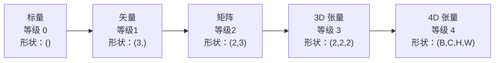
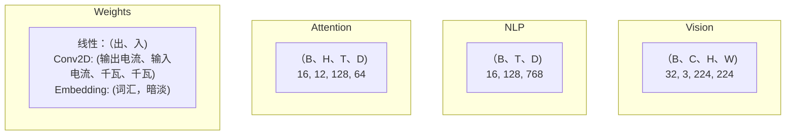
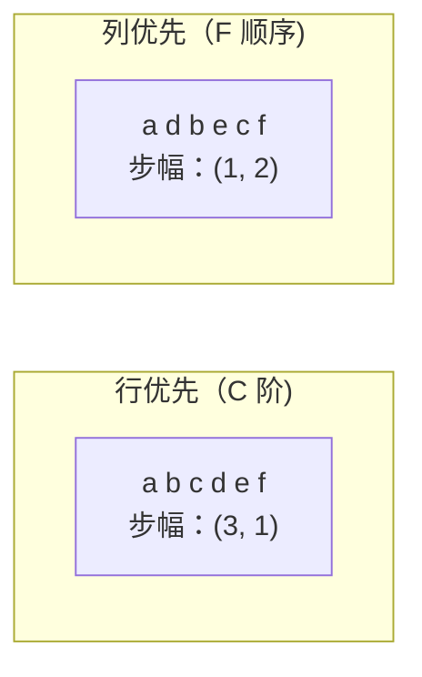
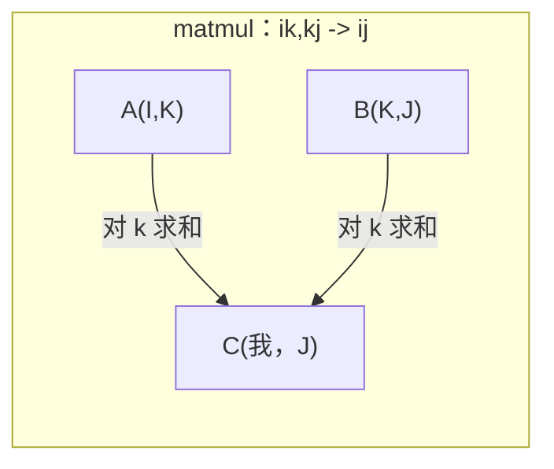

# 张量运算

> 张量是数据和深度学习之间的通用语言。每张图像、每句话、每一个渐变都流经它们。

**类型：** ** Build
**语言：** Python
**先修：** ** 第 1 阶段，第 01 课（线性代数直觉）、第 02 课（向量、矩阵和运算）
**时间：** ** 约 90 分钟

## 学习目标

- 从头开始实现具有形状、步幅、重塑、转置和逐元素操作的张量类
- 应用广播规则对不同形状的张量进行操作，无需复制数据
- 为点积、矩阵乘法、外积和批量运算编写 einsum 表达式
- 通过多头注意力的每一步追踪精确的张量形状

＃＃ 问题

你建造一个变压器。向前传球看起来很干净。运行它并得到：`RuntimeError: mat1 and mat2 shapes cannot be multiplied (32x768 and 512x768)`。你盯着形状。你尝试一下转置。现在它说`Expected 4D input (got 3D input)`。您添加一个解压。其他东西坏了。

形状错误是深度学习代码中最常见的错误。它们在概念上并不难——每个操作都有一个形状契约——但它们繁殖得很快。一个 Transformer 有数十个链接在一起的重塑、转置和广播。一个错误的轴会导致错误级联。更糟糕的是，一些形状错误根本不会引发错误。它们通过沿着错误的维度传播或在错误的轴上求和来默默地产生垃圾。

矩阵处理两组事物之间的成对关系。真实数据不适合二维。一批 32 个 224x224 RGB 图像是一个 4D 张量：`(32, 3, 224, 224)`。 12 个头的自注意力也是 4D 的：`(batch, heads, seq_len, head_dim)`。您需要一个可推广到任意数量维度的数据结构，并具有在所有维度上清晰组合的操作。该结构就是张量。掌握其操作，形状错误变得可以轻松调试。

## 概念

### 什么是张量

张量是具有统一数据类型的多维数字数组。维度的数量是**等级**（或**顺序**）。每个维度都是一个**轴**。 **shape** 是一个元组，列出了沿每个轴的尺寸。



总元素 = 所有大小的乘积。形状`(2, 3, 4)` 包含`2 * 3 * 4 = 24` 元素。

### 深度学习中的张量形状

按照惯例，不同的数据类型映射到特定的张量形状。



PyTorch 使用 NCHW（通道优先）。 TensorFlow 默认为 NHWC（通道最后）。不匹配的布局会导致无声的速度减慢或错误。

### 内存布局如何工作

内存中的二维数组是一维字节序列。 **步幅**告诉您要跳过多少个元素才能沿每个轴移动一步。



转置不移动数据。它交换步幅，使张量**不连续**——行的元素在内存中不再相邻。

### 广播规则

广播使您可以操作不同形状的张量，而无需复制数据。从右侧对齐形状。当两个维度相等或其中一个维度为 1 时，它们是兼容的。较少的维度会在左侧用 1 填充。

```
Tensor A:     (8, 1, 6, 1)
Tensor B:        (7, 1, 5)
Padded B:     (1, 7, 1, 5)
Result:       (8, 7, 6, 5)
```

### Einsum：通用张量运算

爱因斯坦求和用字母标记每个轴。输入中的轴而不是输出中的轴被求和。两者中的轴都被保留。



关键模式：`i,i->`（点积）、`i,j->ij`（外积）、`ii->`（跟踪）、`ij->ji`（转置）、`bij,bjk->bik`（批量 matmul）、`bhtd,bhsd->bhts`（注意力分数）。

```figure
tensor-broadcast
```

## Build It

该代码位于`code/tensors.py` 中。每个步骤都引用那里的实现。

### 步骤 1：张量存储和步幅

张量存储数字和形状元数据的平面列表。步幅告诉索引逻辑如何将多维索引映射到平面位置。

```python
class Tensor:
    def __init__(self, data, shape=None):
        if isinstance(data, (list, tuple)):
            self._data, self._shape = self._flatten_nested(data)
        elif isinstance(data, np.ndarray):
            self._data = data.flatten().tolist()
            self._shape = tuple(data.shape)
        else:
            self._data = [data]
            self._shape = ()

        if shape is not None:
            total = reduce(lambda a, b: a * b, shape, 1)
            if total != len(self._data):
                raise ValueError(
                    f"Cannot reshape {len(self._data)} elements into shape {shape}"
                )
            self._shape = tuple(shape)

        self._strides = self._compute_strides(self._shape)

    @staticmethod
    def _compute_strides(shape):
        if len(shape) == 0:
            return ()
        strides = [1] * len(shape)
        for i in range(len(shape) - 2, -1, -1):
            strides[i] = strides[i + 1] * shape[i + 1]
        return tuple(strides)
```

对于形状`(3, 4)`，步长为`(4, 1)`——跳过4个元素前进一行，跳过1个元素前进一列。

### 第 2 步：重塑、挤压、松开

Reshape 改变形状而不改变元素顺序。元素总数必须保持不变。对一维使用 `-1` 来推断其大小。

```python
t = Tensor(list(range(12)), shape=(2, 6))
r = t.reshape((3, 4))
r = t.reshape((-1, 3))
```

挤压会移除尺寸为 1 的轴。松开会插入尺寸为 1 的轴。解压对于广播来说至关重要——添加到批次`(B, T, D)`中的偏置向量`(D,)`需要解压到`(1, 1, D)`。

```python
t = Tensor(list(range(6)), shape=(1, 3, 1, 2))
s = t.squeeze()
v = Tensor([1, 2, 3])
u = v.unsqueeze(0)
```

### 步骤 3：转置和排列

转置交换两个轴。 Permute 对所有轴重新排序。这就是 NCHW 和 NHWC 之间的转换方式。

```python
mat = Tensor(list(range(6)), shape=(2, 3))
tr = mat.transpose(0, 1)

t4d = Tensor(list(range(24)), shape=(1, 2, 3, 4))
perm = t4d.permute((0, 2, 3, 1))
```

转置或置换后，张量在内存中是不连续的。在 PyTorch 中，`view` 在非连续张量上失败 - 使用 `reshape` 或首先调用 `.contiguous()`。

### 步骤 4：逐元素运算和归约

逐元素运算（加、乘、减）独立应用于每个元素并保留形状。缩减（总和、平均值、最大值）会折叠一个或多个轴。

```python
a = Tensor([[1, 2], [3, 4]])
b = Tensor([[10, 20], [30, 40]])
c = a + b
d = a * 2
s = a.sum(axis=0)
```

CNN 中的全局平均池化：`(B, C, H, W).mean(axis=[2, 3])` 生成`(B, C)`。 NLP 中的序列均值池化：`(B, T, D).mean(axis=1)` 生成`(B, D)`。

### 步骤 5：使用 NumPy 进行广播

`tensors.py` 中的`demo_broadcasting_numpy()` 函数显示了核心模式。

```python
activations = np.random.randn(4, 3)
bias = np.array([0.1, 0.2, 0.3])
result = activations + bias

images = np.random.randn(2, 3, 4, 4)
scale = np.array([0.5, 1.0, 1.5]).reshape(1, 3, 1, 1)
result = images * scale

a = np.array([1, 2, 3]).reshape(-1, 1)
b = np.array([10, 20, 30, 40]).reshape(1, -1)
outer = a * b
```

通过广播进行成对距离：将`(M, 2)`整形为`(M, 1, 2)`，将`(N, 2)`整形为`(1, N, 2)`，减去，平方，沿最后一个轴求和，取平方根。结果：`(M, N)`。

### 步骤 6：Einsum 运算

`demo_einsum()` 和`demo_einsum_gallery()` 函数遍历每个常见模式。

```python
a = np.array([1.0, 2.0, 3.0])
b = np.array([4.0, 5.0, 6.0])
dot = np.einsum("i,i->", a, b)

A = np.array([[1, 2], [3, 4], [5, 6]], dtype=float)
B = np.array([[7, 8, 9], [10, 11, 12]], dtype=float)
matmul = np.einsum("ik,kj->ij", A, B)

batch_A = np.random.randn(4, 3, 5)
batch_B = np.random.randn(4, 5, 2)
batch_mm = np.einsum("bij,bjk->bik", batch_A, batch_B)
```

收缩的计算成本是所有索引大小（保留并求和）的乘积。对于 B=32、I=128、J=64、K=128 的`bij,bjk->bik`：`32 * 128 * 64 * 128 = 33,554,432` 乘加。

### 步骤 7：通过 einsum 的注意力机制

`demo_attention_einsum()`函数实现了端到端的多头注意力。

```python
B, H, T, D = 2, 4, 8, 16
E = H * D

X = np.random.randn(B, T, E)
W_q = np.random.randn(E, E) * 0.02

Q = np.einsum("bte,ek->btk", X, W_q)
Q = Q.reshape(B, T, H, D).transpose(0, 2, 1, 3)

scores = np.einsum("bhtd,bhsd->bhts", Q, K) / np.sqrt(D)
weights = softmax(scores, axis=-1)
attn_output = np.einsum("bhts,bhsd->bhtd", weights, V)

concat = attn_output.transpose(0, 2, 1, 3).reshape(B, T, E)
output = np.einsum("bte,ek->btk", concat, W_o)
```

每一步都是一个张量操作：投影（通过 einsum 的 matmul）、头分割（reshape + transpose）、注意力分数（通过 einsum 的批量 matmul）、加权和（通过 einsum 的批量 matmul）、头合并（转置 + reshape）、输出投影（通过 einsum 的 matmul）。

## Use It

### Scratch 与 NumPy

|运营| Scratch（张量类）| NumPy |
|---|---|---|
|创建| `Tensor([[1,2],[3,4]])` | `np.array([[1,2],[3,4]])` |
|重塑| `t.reshape((3,4))` | `a.reshape(3,4)` |
|转置| `t.transpose(0,1)` | `a.T` 或 `a.transpose(0,1)` |
|挤压| `t.squeeze(0)` | `np.squeeze(a, 0)` |
|总和| `t.sum(axis=0)` | `a.sum(axis=0)` |
|埃因苏姆 | N/A | `np.einsum("ij,jk->ik", a, b)` |

### Scratch 与 PyTorch

```python
import torch

t = torch.tensor([[1, 2, 3], [4, 5, 6]], dtype=torch.float32)
t.shape
t.stride()
t.is_contiguous()

t.reshape(3, 2)
t.unsqueeze(0)
t.transpose(0, 1)
t.transpose(0, 1).contiguous()

torch.einsum("ik,kj->ij", A, B)
```

PyTorch 添加了 autograd、GPU 支持和优化的 BLAS 内核。形状语义是相同的。如果您了解暂存版本，PyTorch 形状错误就变得可读。

### 每个神经网络层都是一个张量运算

|运营|张量形式 |埃因苏姆 |
|---|---|---|
|线性层 | `Y = X @ W.T + b` | `"bd,od->bo"` + 偏见 |
|关注QKV | `Q = X @ W_q` | `"btd,dh->bth"` |
|注意力分数 | `Q @ K.T / sqrt(d)` | `"bhtd,bhsd->bhts"` |
|注意力输出 | `softmax(scores) @ V` | `"bhts,bhsd->bhtd"` |
|批归一化 | `(X - mu) / sigma * gamma` |按元素 + 广播 |
| Softmax| `exp(x) / sum(exp(x))` |逐元素 + 归约 |

## 发货

本课产生两个可重复使用的提示：

1. **`outputs/prompt-tensor-shapes.md`** -- 用于调试张量形状不匹配的系统提示。包括每个常见操作（matmul、broadcast、cat、Linear、Conv2d、BatchNorm、softmax）的决策表和修复查找表。

2. **`outputs/prompt-tensor-debugger.md`** -- 当形状错误阻碍您时，您可以将逐步调试提示粘贴到任何 AI 助手中。向其提供错误消息和张量形状，返回准确的修复结果。

## 练习

1. **简单——重塑往返。** 采用形状为 `(2, 3, 4)` 的张量。将其重新整形为`(6, 4)`，然后整形为`(24,)`，然后返回`(2, 3, 4)`。通过打印平面数据来验证每一步都保留了元素顺序。

2. **中 - 实现广播。** 使用 `broadcast_to(shape)` 方法扩展 `Tensor` 类，该方法扩展大小为 1 的维度以匹配目标形状。然后修改`_elementwise_op`为运行前自动广播。使用形状`(3, 1)` 和`(1, 4)` 进行测试，生成`(3, 4)`。

3. **困难 - 从头开始​​构建 einsum。** 实现一个基本的 `einsum(subscripts, *tensors)` 函数，至少处理：点积 (`i,i->`)、矩阵乘法 (`ij,jk->ik`)、外积 (`i,j->ij`) 和转置 (`ij->ji`)。解析下标字符串，识别收缩索引，并循环遍历所有索引组合。将您的结果与`np.einsum` 进行比较。

4. **硬——注意力形状跟踪器。** 编写一个函数，以 `batch_size`、`seq_len`、`embed_dim` 和 `num_heads` 作为输入，并打印多头注意力每一步的确切形状：输入、Q/K/V 投影、头分割、注意力分数、softmax 权重、加权和、头合并、输出投影。根据`demo_attention_einsum()` 输出进行验证。

## 关键术语

|术语 |人们怎么说|它实际上意味着什么 |
|---|---|---|
|张量| “一个矩阵，但有更多维度”|具有统一类型和定义形状、步长和操作的多维数组 |
|排名| “维数”|轴的数量。矩阵的秩为 2，但秩不等于其矩阵的秩 |
|形状| “张量的大小” |列出沿每个轴的尺寸的元组。 `(2, 3)` 表示 2 行 3 列 |
|迈步| “内存是如何布局的”|沿每个轴前进一个位置时要跳过的元素数量 |
|广播| “当形状不同时它才起作用”|一组严格的规则：从右对齐、尺寸必须相等或其中一个必须为 1 |
|连续| “张量是正常的” |元素按顺序存储在内存中，没有间隙或从逻辑布局重新排序 |
|埃因苏姆 | “一种编写 matmul 的奇特方式”|一种通用符号，在一行中表达任何张量收缩、外积、迹或转置 |
|查看 | “与重塑相同” |共享相同内存缓冲区但具有不同shape/stride元数据的张量。在非连续数据上失败 |
|收缩| “对索引求和”|将张量之间的共享索引相乘并求和的一般运算，产生较低阶的结果 |
| NCHW / NHWC | “PyTorch 与 TensorFlow 格式”|图像张量的内存布局约定。 NCHW 将通道置于空间暗淡之前，NHWC 将通道置于空间暗淡之后 |

## 延伸阅读

- [NumPy Broadcasting](https://numpy.org/doc/stable/user/basics.broadcasting.html) -- 带有可视化示例的规范规则
- [PyTorch Tensor Views](https://pytorch.org/docs/stable/tensor_view.html) -- 视图何时工作以及何时复制
- [einops](https://github.com/arogozhnikov/einops) -- 一个使张量重塑可读且安全的库
- [插图变压器](https://jalammar.github.io/illustrated-transformer/) -- 可视化通过注意力流动的张量形状
- [NumPy 中的爱因斯坦求和](https://numpy.org/doc/stable/reference/generated/numpy.einsum.html) -- 完整的 einsum 文档和示例
