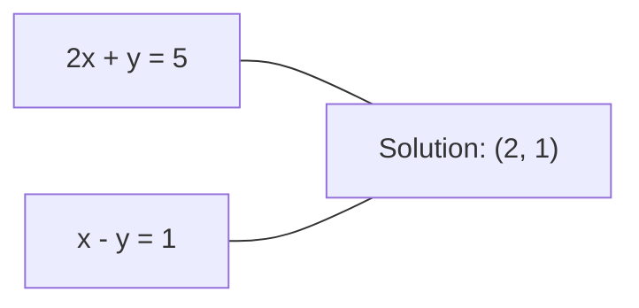
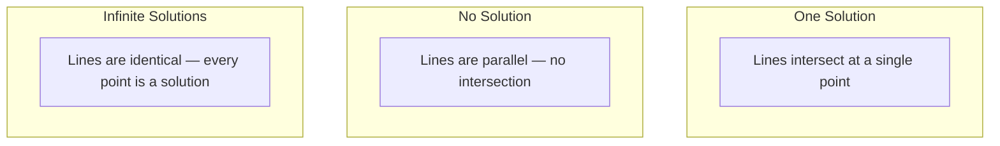

# 线性系统

> Solving Ax = b is the oldest problem in mathematics that still runs your neural network.

**类型：** Build
**Language:** Python
**先修：** Phase 1, Lessons 01 (线性代数直觉), 02 (向量 & 矩阵), 03 (矩阵 变换)
**时间：** ~120 分钟

## 学习目标

- Solve Ax = b using Gaussian elimination 与 partial pivoting 和 back substitution
- Factor 矩阵 与 LU, QR, 和 Cholesky decompositions 和 explain when each is appropriate
- Derive the normal 方程 for least squares 和 connect them to linear 和 ridge 回归
- Diagnose ill-conditioned 系统 using the condition number 和 apply regularization to stabilize them

## 问题

Every time you train a linear 回归, you 求解 a linear 系统. Every time you compute a least-squares fit, you 求解 a linear 系统. Every time a neural network layer computes `y = Wx + b`, it is evaluating one side of a linear 系统. When you add regularization, you modify the 系统. When you use Gaussian 过程, you factor a 矩阵. When you invert a 协方差 矩阵 for Mahalanobis 距离, you 求解 a linear 系统.

The 方程 Ax = b appears everywhere. A is a 矩阵 of known coefficients. b is a 向量 of known 输出. x is the 向量 of unknowns you want to find. In linear 回归, A is your 数据 矩阵, b is your target 向量, 和 x is the weight 向量. The entire 模型 reduces to: find x such that Ax is as close to b as possible.

本课 builds every major method for solving that 方程 从零实现. You will underst和 为什么some methods are fast 和 others are 稳定, 为什么some work only for square 系统 和 others h和le overdetermined ones, 和 为什么the condition number of your 矩阵 determines whether your answer means anything at all.

## 概念

### What Ax = b means geometrically

一个系统 of linear 方程 has a geometric interpretation. Each 方程 defines a hyperplane. The solution is the point (or set of points) where all hyperplanes intersect.

```
2x + y = 5          Two lines in 2D.
x - y  = 1          They intersect at x=2, y=1.
```



Three things can happen:



In 矩阵 form, "one solution" means A is invertible. "No solution" means the 系统 is inconsistent. "Infinite solutions" means A has a null 空间. Most ML problems fall in the "no exact solution" category because you have more 方程 (数据 points) than unknowns (parameters). That is where least squares comes in.

### Column picture vs 行 picture

There are two ways to read Ax = b.

**Row picture.** Each 行 of A defines one 方程. Each 方程 is a hyperplane. The solution is where they all intersect.

**Column picture.** Each 列 of A is a 向量. The question becomes: 什么linear combination of the 列 of A produces b?

```
A = | 2  1 |    b = | 5 |
    | 1 -1 |        | 1 |

Row picture: solve 2x + y = 5 and x - y = 1 simultaneously.

Column picture: find x1, x2 such that:
  x1 * [2, 1] + x2 * [1, -1] = [5, 1]
  2 * [2, 1] + 1 * [1, -1] = [4+1, 2-1] = [5, 1]   check.
```

The 列 picture is more fundamental. If b lies in the 列 空间 of A, the 系统 has a solution. If b does not, you find the closest point in the 列 空间. That closest point is the least-squares solution.

### Gaussian elimination

Gaussian elimination transforms Ax = b into an upper triangular 系统 Ux = c that you 求解 by back substitution. It is the most direct method.

The 算法:

```
1. For each column k (the pivot column):
   a. Find the largest entry in column k at or below row k (partial pivoting).
   b. Swap that row with row k.
   c. For each row i below k:
      - Compute multiplier m = A[i][k] / A[k][k]
      - Subtract m times row k from row i.
2. Back substitute: solve from the last equation upward.
```

Example:

```
Original:
| 2  1  1 | 8 |       R2 = R2 - (2)R1     | 2  1   1 |  8 |
| 4  3  3 |20 |  -->  R3 = R3 - (1)R1 --> | 0  1   1 |  4 |
| 2  3  1 |12 |                            | 0  2   0 |  4 |

                       R3 = R3 - (2)R2     | 2  1   1 |  8 |
                                       --> | 0  1   1 |  4 |
                                           | 0  0  -2 | -4 |

Back substitute:
  -2 * x3 = -4    -->  x3 = 2
  x2 + 2  = 4     -->  x2 = 2
  2*x1 + 2 + 2 = 8 --> x1 = 2
```

Gaussian elimination costs O(n^3) operations. For a 1000x1000 系统, that is 约 a billion floating-point operations. Fast, but you can do better if you need to 求解 multiple 系统 与 the same A.

### Partial pivoting: 为什么it matters

Without pivoting, Gaussian elimination can fail 或 produce garbage. If a pivot element is zero, you divide by zero. If it is small, you amplify rounding 误差.

```
Bad pivot:                       With partial pivoting:
| 0.001  1 | 1.001 |            Swap rows first:
| 1      1 | 2     |            | 1      1 | 2     |
                                 | 0.001  1 | 1.001 |
m = 1/0.001 = 1000              m = 0.001/1 = 0.001
R2 = R2 - 1000*R1               R2 = R2 - 0.001*R1
| 0.001  1     | 1.001   |      | 1      1     | 2     |
| 0     -999   | -999.0  |      | 0      0.999 | 0.999 |

x2 = 1.000 (correct)            x2 = 1.000 (correct)
x1 = (1.001 - 1)/0.001          x1 = (2 - 1)/1 = 1.000 (correct)
   = 0.001/0.001 = 1.000        Stable because the multiplier is small.
```

In floating-point arithmetic 与 limited precision, the unpivoted version can lose significant digits. Partial pivoting always selects the largest available pivot to minimize 误差 amplification.

### LU decomposition

LU decomposition factors A into a lower triangular 矩阵 L 和 an upper triangular 矩阵 U: A = LU. The L 矩阵 stores the multipliers from Gaussian elimination. The U 矩阵 is the result of elimination.

```
A = L @ U

| 2  1  1 |   | 1  0  0 |   | 2  1   1 |
| 4  3  3 | = | 2  1  0 | @ | 0  1   1 |
| 2  3  1 |   | 1  2  1 |   | 0  0  -2 |
```

Why factor instead of just eliminating? Because once you have L 和 U, solving Ax = b for any new b costs only O(n^2):

```
Ax = b
LUx = b
Let y = Ux:
  Ly = b    (forward substitution, O(n^2))
  Ux = y    (back substitution, O(n^2))
```

The O(n^3) cost is paid once during factorization. Every subsequent 求解 is O(n^2). If you need to 求解 1000 系统 与 the same A but different b 向量, LU saves a factor of 1000/3 in total work.

With partial pivoting, you get PA = LU where P is a permutation 矩阵 recording the 行 swaps.

### QR decomposition

QR decomposition factors A into an orthogonal 矩阵 Q 和 an upper triangular 矩阵 R: A = QR.

一个orthogonal 矩阵 has the property Q^T Q = I. Its 列 are orthonormal 向量. Multiplying by Q preserves lengths 和 angles.

```
A = Q @ R

Q has orthonormal columns: Q^T Q = I
R is upper triangular

To solve Ax = b:
  QRx = b
  Rx = Q^T b    (just multiply by Q^T, no inversion needed)
  Back substitute to get x.
```

QR is numerically more 稳定 than LU for solving least-squares problems. The Gram-Schmidt 过程 builds Q 列 by 列:

```
Given columns a1, a2, ... of A:

q1 = a1 / ||a1||

q2 = a2 - (a2 . q1) * q1        (subtract projection onto q1)
q2 = q2 / ||q2||                (normalize)

q3 = a3 - (a3 . q1) * q1 - (a3 . q2) * q2
q3 = q3 / ||q3||

R[i][j] = qi . aj    for i <= j
```

Each step removes the component along all previous q 向量, leaving only the new orthogonal direction.

### Cholesky decomposition

当A is symmetric (A = A^T) 和 正 definite (all 特征值 正), you can factor it as A = L L^T where L is lower triangular. This is the Cholesky decomposition.

```
A = L @ L^T

| 4  2 |   | 2  0 |   | 2  1 |
| 2  5 | = | 1  2 | @ | 0  2 |

L[i][i] = sqrt(A[i][i] - sum(L[i][k]^2 for k < i))
L[i][j] = (A[i][j] - sum(L[i][k]*L[j][k] for k < j)) / L[j][j]    for i > j
```

Cholesky is twice as fast as LU 和 requires half the storage. It only works for symmetric 正 definite 矩阵, but those s如何up constantly:

- Covariance 矩阵 are symmetric 正 semi-definite (正 definite 与 regularization).
- The kernel 矩阵 in Gaussian 过程 is symmetric 正 definite.
- The Hessian of a 凸 函数 at a minimum is symmetric 正 definite.
- A^T A is always symmetric 正 semi-definite.

In Gaussian 过程, you factor the kernel 矩阵 K 与 Cholesky, then 求解 K alpha = y to get the predictive 均值. The Cholesky factor also gives you the log-determinant for the marginal 似然: log det(K) = 2 * sum(log(diag(L))).

### Least squares: when Ax = b has no exact solution

如果A is m x n 与 m > n (more 方程 than unknowns), the 系统 is overdetermined. There is no exact solution. Instead, you minimize the squared 误差:

```
minimize ||Ax - b||^2

This is the sum of squared residuals:
  sum((A[i,:] @ x - b[i])^2 for i in range(m))
```

The minimizer satisfies the normal 方程:

```
A^T A x = A^T b
```

Derivation: exp和 ||Ax - b||^2 = (Ax - b)^T (Ax - b) = x^T A^T A x - 2 x^T A^T b + b^T b. Take the 梯度 与 respect to x, set it to zero: 2 A^T A x - 2 A^T b = 0.

```
Original system (overdetermined, 4 equations, 2 unknowns):
| 1  1 |         | 3 |
| 1  2 | x     = | 5 |       No exact x satisfies all 4 equations.
| 1  3 |         | 6 |
| 1  4 |         | 8 |

Normal equations:
A^T A = | 4  10 |    A^T b = | 22 |
        | 10 30 |            | 63 |

Solve: x = [1.5, 1.7]

This is linear regression. x[0] is the intercept, x[1] is the slope.
```

### Normal 方程 = linear 回归

The connection is exact. In linear 回归, your 数据 矩阵 X has one 行 per 样本 和 one 列 per 特征. Your target 向量 y has one entry per 样本. The weight 向量 w satisfies:

```
X^T X w = X^T y
w = (X^T X)^(-1) X^T y
```

This is the closed-form solution to linear 回归. Every call to `sklearn.linear_model.LinearRegression.fit()` computes this (or an equivalent via QR 或 SVD).

Add a regularization term lambda * I to the 矩阵 和 you get ridge 回归:

```
(X^T X + lambda * I) w = X^T y
w = (X^T X + lambda * I)^(-1) X^T y
```

The regularization makes the 矩阵 better conditioned (easier to invert accurately) 和 prevents overfitting by shrinking the weights toward zero. The 矩阵 X^T X + lambda * I is always symmetric 正 definite when lambda > 0, so you can use Cholesky to 求解 it.

### Pseudoinverse (Moore-Penrose)

The pseudoinverse A+ generalizes 矩阵 inversion to non-square 和 singular 矩阵. For any 矩阵 A:

```
x = A+ b

where A+ = V Sigma+ U^T    (computed via SVD)
```

Sigma+ is formed by taking the reciprocal of each nonzero singular value 和 transposing the result. If A = U Sigma V^T, then A+ = V Sigma+ U^T.

```
A = U Sigma V^T        (SVD)

Sigma = | 5  0 |       Sigma+ = | 1/5  0  0 |
        | 0  2 |                | 0  1/2  0 |
        | 0  0 |

A+ = V Sigma+ U^T
```

The pseudoinverse gives the minimum-范数 least-squares solution. If the 系统 has:
- One solution: A+ b gives it.
- No solution: A+ b gives the least-squares solution.
- Infinite solutions: A+ b gives the one 与 the smallest ||x||.

NumPy's `np.linalg.lstsq` 和 `np.linalg.pinv` both use the SVD internally.

### Condition number

The condition number measures 如何sensitive the solution is to small changes in the 输入. For a 矩阵 A, the condition number is:

```
kappa(A) = ||A|| * ||A^(-1)|| = sigma_max / sigma_min
```

where sigma_max 和 sigma_min are the largest 和 smallest singular values.

```
Well-conditioned (kappa ~ 1):        Ill-conditioned (kappa ~ 10^15):
Small change in b -->                Small change in b -->
small change in x                    huge change in x

| 2  0 |   kappa = 2/1 = 2          | 1   1          |   kappa ~ 10^15
| 0  1 |   safe to solve            | 1   1+10^(-15) |   solution is garbage
```

Rules of thumb:
- kappa < 100: safe, solution is accurate.
- kappa ~ 10^k: you lose 约 k digits of precision from your floating-point arithmetic.
- kappa ~ 10^16 (for float64): the solution is meaningless. The 矩阵 is effectively singular.

In ML, ill-conditioning happens when 特征 are nearly collinear. Regularization (adding lambda * I) improves the condition number from sigma_max / sigma_min to (sigma_max + lambda) / (sigma_min + lambda).

### Iterative methods: conjugate 梯度

For very large sparse 系统 (millions of unknowns), direct methods like LU 或 Cholesky are too expensive. Iterative methods approximate the solution by improving a guess over many iterations.

Conjugate 梯度 (CG) solves Ax = b when A is symmetric 正 definite. It finds the exact solution in at most n iterations (in exact arithmetic), but typically converges much faster if the 特征值 of A are clustered.

```
Algorithm sketch:
  x0 = initial guess (often zero)
  r0 = b - A x0           (residual)
  p0 = r0                 (search direction)

  For k = 0, 1, 2, ...:
    alpha = (rk . rk) / (pk . A pk)
    x_{k+1} = xk + alpha * pk
    r_{k+1} = rk - alpha * A pk
    beta = (r_{k+1} . r_{k+1}) / (rk . rk)
    p_{k+1} = r_{k+1} + beta * pk
    if ||r_{k+1}|| < tolerance: stop
```

CG is used in:
- Large-scale 优化 (Newton-CG method)
- Solving PDE discretizations
- Kernel methods where the kernel 矩阵 is too large to factor
- Preconditioning for other iterative solvers

The convergence rate depends on the condition number. Better conditioned 系统 converge faster, which is another reason regularization helps.

### The full picture: which method when

| Method | Requirements | Cost | Use case |
|--------|-------------|------|----------|
| Gaussian elimination | Square, nonsingular A | O(n^3) | One-off 求解 of a square 系统 |
| LU decomposition | Square, nonsingular A | O(n^3) factor + O(n^2) 求解 | Multiple solves 与 the same A |
| QR decomposition | Any A (m >= n) | O(mn^2) | Least squares, numerically 稳定 |
| Cholesky | Symmetric 正 definite A | O(n^3/3) | Covariance 矩阵, Gaussian 过程, ridge 回归 |
| Normal 方程 | Overdetermined (m > n) | O(mn^2 + n^3) | Linear 回归 (small n) |
| SVD / pseudoinverse | Any A | O(mn^2) | Rank-deficient 系统, minimum-范数 solutions |
| Conjugate 梯度 | Symmetric 正 definite, sparse A | O(n * k * nnz) | Large sparse 系统, k = iterations |

### Connection to ML

Every method in this lesson appears in production ML:

**Linear 回归.** The closed-form solution solves the normal 方程 X^T X w = X^T y. This is done via Cholesky (if n is small) 或 QR (if numerical 稳定性 matters) 或 SVD (if the 矩阵 might be rank-deficient).

**Ridge 回归.** Adds lambda * I to X^T X. The regularized 系统 (X^T X + lambda * I) w = X^T y is always solvable via Cholesky because X^T X + lambda * I is symmetric 正 definite for lambda > 0.

**Gaussian 过程.** The predictive 均值 requires solving K alpha = y where K is the kernel 矩阵. Cholesky factorization of K is the st和ard approach. The log marginal 似然 uses log det(K) = 2 sum(log(diag(L))).

**Neural network initialization.** Orthogonal initialization uses QR decomposition to create weight 矩阵 whose 列 are orthonormal. This prevents 信号 collapse in deep networks.

**Preconditioning.** Large-scale optimizers use incomplete Cholesky 或 incomplete LU as preconditioners for conjugate 梯度 solvers.

**Feature engineering.** The condition number of X^T X tells you if your 特征 are collinear. If kappa is large, drop 特征 或 add regularization.

```figure
linear-system-conditioning
```

## Build It

### 第 1 步: Gaussian elimination 与 partial pivoting

```python
import numpy as np

def gaussian_elimination(A, b):
    n = len(b)
    Ab = np.hstack([A.astype(float), b.reshape(-1, 1).astype(float)])

    for k in range(n):
        max_row = k + np.argmax(np.abs(Ab[k:, k]))
        Ab[[k, max_row]] = Ab[[max_row, k]]

        if abs(Ab[k, k]) < 1e-12:
            raise ValueError(f"Matrix is singular or nearly singular at pivot {k}")

        for i in range(k + 1, n):
            m = Ab[i, k] / Ab[k, k]
            Ab[i, k:] -= m * Ab[k, k:]

    x = np.zeros(n)
    for i in range(n - 1, -1, -1):
        x[i] = (Ab[i, -1] - Ab[i, i+1:n] @ x[i+1:n]) / Ab[i, i]

    return x
```

### 第 2 步: LU decomposition

```python
def lu_decompose(A):
    n = A.shape[0]
    L = np.eye(n)
    U = A.astype(float).copy()
    P = np.eye(n)

    for k in range(n):
        max_row = k + np.argmax(np.abs(U[k:, k]))
        if max_row != k:
            U[[k, max_row]] = U[[max_row, k]]
            P[[k, max_row]] = P[[max_row, k]]
            if k > 0:
                L[[k, max_row], :k] = L[[max_row, k], :k]

        for i in range(k + 1, n):
            L[i, k] = U[i, k] / U[k, k]
            U[i, k:] -= L[i, k] * U[k, k:]

    return P, L, U

def lu_solve(P, L, U, b):
    n = len(b)
    Pb = P @ b.astype(float)

    y = np.zeros(n)
    for i in range(n):
        y[i] = Pb[i] - L[i, :i] @ y[:i]

    x = np.zeros(n)
    for i in range(n - 1, -1, -1):
        x[i] = (y[i] - U[i, i+1:] @ x[i+1:]) / U[i, i]

    return x
```

### 第 3 步: Cholesky decomposition

```python
def cholesky(A):
    n = A.shape[0]
    L = np.zeros_like(A, dtype=float)

    for i in range(n):
        for j in range(i + 1):
            s = A[i, j] - L[i, :j] @ L[j, :j]
            if i == j:
                if s <= 0:
                    raise ValueError("Matrix is not positive definite")
                L[i, j] = np.sqrt(s)
            else:
                L[i, j] = s / L[j, j]

    return L
```

### 第 4 步: Least squares via normal 方程

```python
def least_squares_normal(A, b):
    AtA = A.T @ A
    Atb = A.T @ b
    return gaussian_elimination(AtA, Atb)

def ridge_regression(A, b, lam):
    n = A.shape[1]
    AtA = A.T @ A + lam * np.eye(n)
    Atb = A.T @ b
    L = cholesky(AtA)
    y = np.zeros(n)
    for i in range(n):
        y[i] = (Atb[i] - L[i, :i] @ y[:i]) / L[i, i]
    x = np.zeros(n)
    for i in range(n - 1, -1, -1):
        x[i] = (y[i] - L.T[i, i+1:] @ x[i+1:]) / L.T[i, i]
    return x
```

### 第 5 步: Condition number

```python
def condition_number(A):
    U, S, Vt = np.linalg.svd(A)
    return S[0] / S[-1]
```

## Use It

Putting the pieces together for linear 回归 和 ridge 回归 on real 数据:

```python
np.random.seed(42)
X_raw = np.random.randn(100, 3)
w_true = np.array([2.0, -1.0, 0.5])
y = X_raw @ w_true + np.random.randn(100) * 0.1

X = np.column_stack([np.ones(100), X_raw])

w_ols = least_squares_normal(X, y)
print(f"OLS weights (ours):    {w_ols}")

w_np = np.linalg.lstsq(X, y, rcond=None)[0]
print(f"OLS weights (numpy):   {w_np}")
print(f"Max difference: {np.max(np.abs(w_ols - w_np)):.2e}")

w_ridge = ridge_regression(X, y, lam=1.0)
print(f"Ridge weights (ours):  {w_ridge}")

from sklearn.linear_model import Ridge
ridge_sk = Ridge(alpha=1.0, fit_intercept=False)
ridge_sk.fit(X, y)
print(f"Ridge weights (sklearn): {ridge_sk.coef_}")
```

## Ship It

本课 produces:
- `code/linear_systems.py` containing from-scratch implementations of Gaussian elimination, LU decomposition, Cholesky decomposition, least squares, 和 ridge 回归
- A working demonstration that normal 方程 和 sklearn's LinearRegression produce the same weights

## 练习

1. Solve the 系统 `[[1,2,3],[4,5,6],[7,8,10]] x = [6, 15, 27]` using your Gaussian elimination, your LU 求解器, 和 `np.linalg.solve`. Verify all three give the same answer within floating-point tolerance.

2. Generate a 50x5 随机 矩阵 X 和 target y = X @ w_true + 噪声. Solve for w using normal 方程, QR (via `np.linalg.qr`), SVD (via `np.linalg.svd`), 和 `np.linalg.lstsq`. Compare all four solutions. Measure the condition number of X^T X 和 explain 如何it affects which method you trust.

3. Create a nearly singular 矩阵 by making two 列 almost identical (e.g., 列 2 = 列 1 + 1e-10 * 噪声). Compute its condition number. Solve Ax = b 与 和 without regularization (add 0.01 * I). Compare the solutions 和 residuals. Explain 为什么regularization helps.

4. Implement the conjugate 梯度 算法 for a 100x100 随机 symmetric 正 definite 矩阵. Count 如何many iterations it takes to converge to tolerance 1e-8. Compare 与 the theoretical maximum of n iterations.

5. 时间 your Cholesky 求解器 vs your LU 求解器 vs `np.linalg.solve` on symmetric 正 definite 矩阵 of size 10, 50, 200, 500. Plot the results. Verify Cholesky is roughly 2x faster than LU.

## 关键术语

| Term | What people say | What it actually means |
|------|----------------|----------------------|
| Linear 系统 | "Solve for x" | A set of linear 方程 Ax = b. Finding x means finding the 输入 that produces 输出 b under 变换 A. |
| Gaussian elimination | "Row reduce" | Systematically zero out entries below the diagonal using 行 operations, producing an upper triangular 系统 solvable by back substitution. O(n^3). |
| Partial pivoting | "Swap 行 for 稳定性" | Before eliminating in 列 k, swap the 行 与 the largest absolute value in that 列 to the pivot position. Prevents 除法 by small numbers. |
| LU decomposition | "Factor into triangles" | Write A = LU where L is lower triangular (stores multipliers) 和 U is upper triangular (the eliminated 矩阵). Amortizes the O(n^3) cost over multiple solves. |
| QR decomposition | "Orthogonal factorization" | Write A = QR where Q has orthonormal 列 和 R is upper triangular. More 稳定 than LU for least squares. |
| Cholesky decomposition | "Square root of a 矩阵" | For symmetric 正 definite A, write A = LL^T. Half the cost of LU. Used for 协方差 矩阵, kernel 矩阵, 和 ridge 回归. |
| Least squares | "Best fit when exact is impossible" | Minimize the sum of squared residuals ||Ax - b||^2 when the 系统 is overdetermined (more 方程 than unknowns). |
| Normal 方程 | "The 微积分 shortcut" | A^T A x = A^T b. Setting the 梯度 of ||Ax - b||^2 to zero. This IS the closed-form solution to linear 回归. |
| Pseudoinverse | "Inversion for non-square 矩阵" | A+ = V Sigma+ U^T via SVD. Gives the minimum-范数 least-squares solution for any 矩阵, square 或 rectangular, singular 或 not. |
| Condition number | "How trustworthy is this answer" | kappa = sigma_max / sigma_min. Measures sensitivity to 输入 perturbations. Lose 约 log10(kappa) digits of precision. |
| Ridge 回归 | "Regularized least squares" | Solve (X^T X + lambda I) w = X^T y. Adding lambda I improves conditioning 和 shrinks weights toward zero. Prevents overfitting. |
| Conjugate 梯度 | "Iterative Ax=b for big 矩阵" | An iterative 求解器 for symmetric 正 definite 系统. Converges in at most n steps. Practical for large sparse 系统 where factorization is too expensive. |
| Overdetermined 系统 | "More 数据 than parameters" | m > n in an m-by-n 系统. No exact solution exists. Least squares finds the best approximation. This is every 回归 problem. |
| Back substitution | "Solve from the bottom up" | 给定 an upper triangular 系统, 求解 the last 方程 first, then substitute backward. O(n^2). |
| Forward substitution | "Solve from the top down" | 给定 a lower triangular 系统, 求解 the first 方程 first, then substitute forward. O(n^2). Used in the L step of LU solves. |

## 延伸阅读

- [MIT 18.06: Linear Algebra](@@URL0@@) (Gilbert Strang) -- the definitive course on linear 系统 和 矩阵 factorizations
- [Numerical Linear Algebra](@@URL0@@) (Trefethen & Bau) -- the st和ard reference for underst和ing numerical 稳定性, conditioning, 和 为什么算法 fail
- [Matrix Computations](@@URL0@@) (Golub & Van Loan) -- the encyclopedic reference for every 矩阵 算法
- [3Blue1Brown: Inverse Matrices](@@URL0@@) -- visual intuition for 什么solving Ax = b means geometrically
