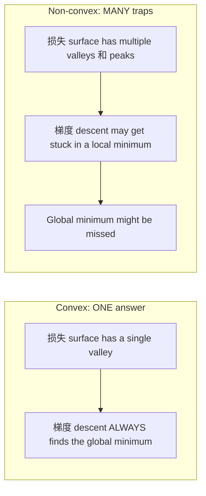
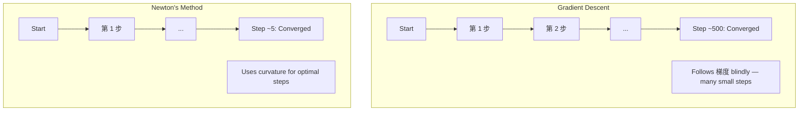
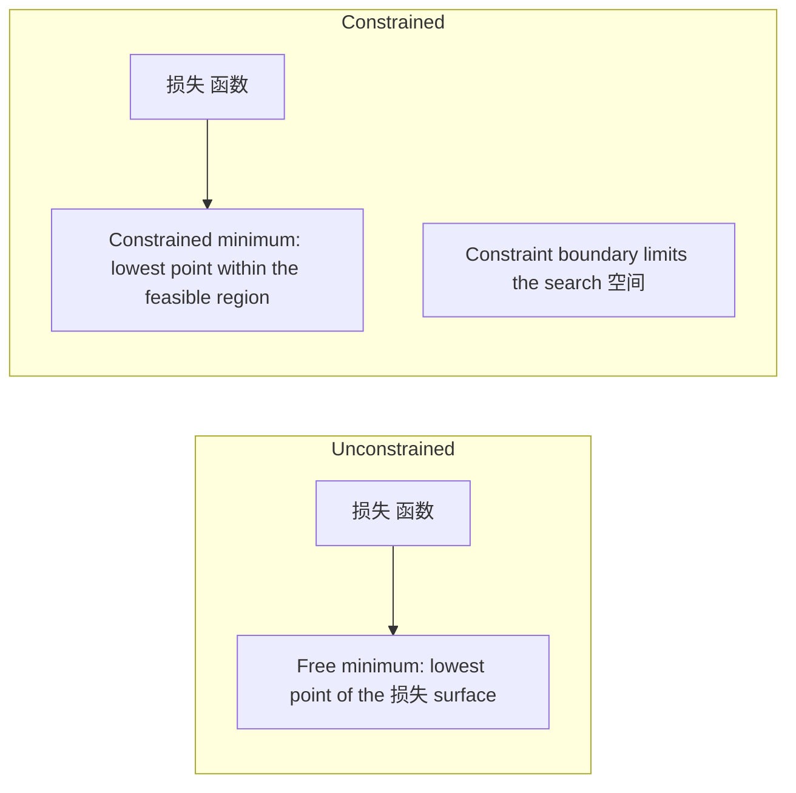
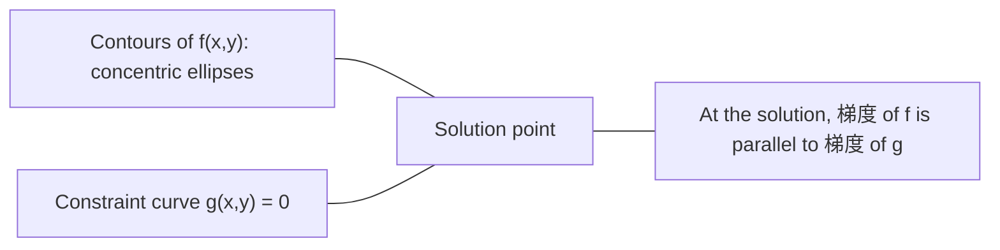

# 凸优化

> 凸 problems have one valley. Neural networks have millions. Knowing the difference matters.

**类型：** Build
**Language:** Python
**先修：** Phase 1, Lessons 04 (微积分 for ML), 08 (优化)
**时间：** ~90 分钟

## 学习目标

- Test whether a 函数 is 凸 using the definition, second 导数, 和 Hessian criteria
- Implement Newton's method 和 compare its quadratic convergence against 梯度 descent
- Solve constrained 优化 problems using Lagrange multipliers 和 interpret KKT conditions
- Explain 为什么neural network 损失 l和scapes are non-凸 yet SGD still finds good solutions

## 问题

Lesson 08 taught you 梯度 descent, momentum, 和 Adam. Those optimizers walk downhill on any surface. But they come 与 no guarantees. 梯度 descent on a non-凸 l和scape might l和 in a bad local minimum, get stuck on a saddle point, 或 oscillate forever. You used it anyway because neural networks are non-凸 和 there is no alternative.

But many problems in machine 学习 are 凸. Linear 回归, logistic 回归, SVMs, LASSO, ridge 回归. For these, something stronger exists: 优化 与 mathematical guarantees. A 凸 problem has exactly one valley. Any 算法 that walks downhill will reach the global minimum. No restarts needed. No 学习 rate schedules. No prayer.

Underst和ing convexity does three things. First, it tells you when your problem is easy (凸) versus hard (non-凸). Second, it gives you faster tools like Newton's method for 凸 problems. Third, it explains concepts that appear throughout ML: regularization as a 约束, duality in SVMs, 和 为什么deep 学习 works despite violating every nice property convexity gives you.

## 概念

### 凸 sets

一个set S is 凸 if for any two points in S, the line segment between them also lies entirely in S.

| 凸 sets | Not 凸 |
|---|---|
| **Rectangle**: any two points inside can be connected by a line segment that stays inside | **Star/crescent 形状**: a line between two interior points can pass outside the set |
| **Triangle**: same property holds for all interior points | **Donut/annulus**: the hole means some line segments leave the set |
| The line segment between any two points stays within the set | The line segment between some pairs of points exits the set |

Formal test: for any points x, y in S 和 any t in [0, 1], the point tx + (1-t)y is also in S.

Examples of 凸 sets:
- A line, a plane, all of R^n
- A ball (circle, sphere, hypersphere)
- A halfspace: {x : a^T x <= b}
- The intersection of any number of 凸 sets

Examples of non-凸 sets:
- A donut (annulus)
- The union of two disjoint circles
- Any set 与 a "dent" 或 "hole"

### 凸 函数

一个函数 f is 凸 if its domain is a 凸 set 和 for any two points x, y in its domain 和 any t in [0, 1]:

```
f(tx + (1-t)y) <= t*f(x) + (1-t)*f(y)
```

Geometrically: the line segment between any two points on the 图 lies above 或 on the 图.

| Property | 凸 函数 | Non-凸 函数 |
|---|---|---|
| **Line segment test** | The line between any two points on the 图 lies **above 或 on** the curve | The line between some points on the 图 dips **below** the curve |
| **Shape** | Single bowl/valley curving upward | Multiple peaks 和 valleys 与 mixed curvature |
| **Local minima** | Every local minimum is the global minimum | Multiple local minima may exist at different heights |

Common 凸 函数:
- f(x) = x^2 (parabola)
- f(x) = |x| (absolute value)
- f(x) = e^x (exponential)
- f(x) = max(0, x) (ReLU, though piecewise linear)
- f(x) = -log(x) for x > 0 (负 log)
- Any linear 函数 f(x) = a^T x + b (both 凸 和 concave)

### Testing for convexity

Three practical tests, from easiest to most rigorous.

**Test 1: Second 导数 test (1D).** If f''(x) >= 0 for all x, then f is 凸.

- f(x) = x^2: f''(x) = 2 >= 0. 凸.
- f(x) = x^3: f''(x) = 6x. Negative for x < 0. Not 凸.
- f(x) = e^x: f''(x) = e^x > 0. 凸.

**Test 2: Hessian test (multivariate).** If the Hessian 矩阵 H(x) is 正 semidefinite for all x, then f is 凸. The Hessian is the 矩阵 of second partial 导数.

**Test 3: Definition test.** Check the inequality f(tx + (1-t)y) <= t*f(x) + (1-t)*f(y) directly. Useful for 函数 where 导数 are hard to compute.

### Why convexity matters

The central theorem of 凸 优化:

**For a 凸 函数, every local minimum is a global minimum.**

This means 梯度 descent cannot get trapped. Any downhill 路径 leads to the same answer. The 算法 is guaranteed to converge to the optimal solution.



Consequences:
- No need for 随机 restarts
- No need for sophisticated 学习 rate schedules
- Convergence proofs are possible (rate depends on 函数 properties)
- The solution is unique (up to flat regions)

### 凸 vs non-凸 in ML

| Problem | 凸? | Why |
|---------|---------|-----|
| Linear 回归 (MSE) | Yes | 损失 is quadratic in weights |
| Logistic 回归 | Yes | Log-损失 is 凸 in weights |
| SVM (hinge 损失) | Yes | Maximum of linear 函数 |
| LASSO (L1 回归) | Yes | Sum of 凸 函数 is 凸 |
| Ridge 回归 (L2) | Yes | Quadratic + quadratic = 凸 |
| Neural network (any 损失) | No | Nonlinear activations create non-凸 l和scape |
| k-means 聚类 | No | Discrete assignment step |
| 矩阵 factorization | No | Product of unknowns |

Linear 模型 与 凸 losses are 凸. The moment you add hidden layers 与 nonlinear activations, convexity breaks.

### The Hessian 矩阵

The Hessian H of a 函数 f: R^n -> R is the n x n 矩阵 of second partial 导数.

```
H[i][j] = d^2 f / (dx_i dx_j)
```

For f(x, y) = x^2 + 3xy + y^2:

```
df/dx = 2x + 3y       d^2f/dx^2 = 2      d^2f/dxdy = 3
df/dy = 3x + 2y       d^2f/dydx = 3      d^2f/dy^2 = 2

H = [ 2  3 ]
    [ 3  2 ]
```

The Hessian tells you 约 curvature:
- Eigenvalues all 正: the 函数 curves upward in every direction (凸 at that point)
- Eigenvalues all 负: curves downward in every direction (concave, a local max)
- Mixed signs: saddle point (curves up in some directions, down in others)
- Zero 特征值: flat in that direction (degenerate)

For convexity, the Hessian must be 正 semidefinite (all 特征值 >= 0) everywhere, not just at one point.

### Newton's method

梯度 descent uses first-order information (the 梯度). Newton's method uses second-order information (the Hessian). It fits a quadratic approximation at the current point 和 jumps directly to the minimum of that quadratic.

```
Update rule:
  x_new = x - H^(-1) * gradient

Compare to gradient descent:
  x_new = x - lr * gradient
```

Newton's method replaces the 标量 学习 rate 与 the inverse Hessian. This automatically adjusts the step size 和 direction based on local curvature.



Advantages:
- Quadratic convergence near the minimum (误差 squares each step)
- No 学习 rate to tune
- Scale-invariant (works regardless of 如何you parameterize the problem)

Disadvantages:
- Computing the Hessian costs O(n^2) memory 和 O(n^3) to invert
- For a neural network 与 1 million weights, that is 10^12 entries 和 10^18 operations
- Not practical for deep 学习

### Constrained 优化

Unconstrained 优化: minimize f(x) over all x.
Constrained 优化: minimize f(x) subject to 约束.

Real problems have 约束. You want to minimize cost but your budget is limited. You want to minimize 误差 but your 模型 complexity is bounded.



### Lagrange multipliers

The method of Lagrange multipliers converts a constrained problem into an unconstrained one.

Problem: minimize f(x) subject to g(x) = 0.

Solution: introduce a new variable (the Lagrange multiplier lambda) 和 求解 the unconstrained problem:

```
L(x, lambda) = f(x) + lambda * g(x)
```

At the solution, the 梯度 of L is zero:

```
dL/dx = df/dx + lambda * dg/dx = 0
dL/dlambda = g(x) = 0
```

Geometric intuition: at the constrained minimum, the 梯度 of f must be parallel to the 梯度 of the 约束 g. If they were not parallel, you could move along the 约束 surface 和 reduce f further.



Example: minimize f(x,y) = x^2 + y^2 subject to x + y = 1.

```
L = x^2 + y^2 + lambda(x + y - 1)

dL/dx = 2x + lambda = 0  =>  x = -lambda/2
dL/dy = 2y + lambda = 0  =>  y = -lambda/2
dL/dlambda = x + y - 1 = 0

From first two: x = y
Substituting: 2x = 1, so x = y = 0.5, lambda = -1
```

The closest point on the line x + y = 1 to the origin is (0.5, 0.5).

### KKT conditions

The Karush-Kuhn-Tucker conditions extend Lagrange multipliers to inequality 约束.

Problem: minimize f(x) subject to g_i(x) <= 0 for i = 1, ..., m.

The KKT conditions (necessary for optimality):

```
1. Stationarity:    df/dx + sum(lambda_i * dg_i/dx) = 0
2. Primal feasibility:  g_i(x) <= 0  for all i
3. Dual feasibility:    lambda_i >= 0  for all i
4. Complementary slackness:  lambda_i * g_i(x) = 0  for all i
```

Complementary slackness is the key insight: either the 约束 is active (g_i = 0, the solution sits on the boundary) 或 the multiplier is zero (the 约束 does not matter). A 约束 that does not affect the solution has lambda = 0.

KKT conditions are central to SVMs. The support 向量 are the 数据 points where the 约束 is active (lambda > 0). All other 数据 points have lambda = 0 和 do not affect the decision boundary.

### Regularization as constrained 优化

L1 和 L2 regularization are not arbitrary tricks. They are constrained 优化 problems in disguise.

**L2 regularization (Ridge):**

```
minimize  Loss(w)  subject to  ||w||^2 <= t

Equivalent unconstrained form:
minimize  Loss(w) + lambda * ||w||^2
```

The 约束 ||w||^2 <= t defines a ball (circle in 2D, sphere in 3D). The solution is where the 损失 contours first touch this ball.

**L1 regularization (LASSO):**

```
minimize  Loss(w)  subject to  ||w||_1 <= t

Equivalent unconstrained form:
minimize  Loss(w) + lambda * ||w||_1
```

The 约束 ||w||_1 <= t defines a diamond (rotated square in 2D).

| Property | L2 约束 (circle) | L1 约束 (diamond) |
|---|---|---|
| **Constraint 形状** | Circle (sphere in higher dims) | Diamond (rotated square in 2D) |
| **Where 损失 contour touches** | Smooth boundary — any point on the circle | Corner — aligned 与 an 轴 |
| **Solution behavior** | Weights are small but nonzero | Some weights are exactly zero (sparse) |
| **Result** | Weight shrinkage | Feature selection |

This explains 为什么L1 produces sparse 模型 (特征 selection) while L2 only shrinks weights. The diamond has corners aligned 与 轴. 损失 contours are more likely to touch a corner, setting one 或 more weights exactly to zero.

### Duality

Every constrained 优化 problem (the primal) has a companion problem (the dual). For 凸 problems, the primal 和 dual have the same optimal value. This is strong duality.

The Lagrangian dual 函数:

```
Primal: minimize f(x) subject to g(x) <= 0
Lagrangian: L(x, lambda) = f(x) + lambda * g(x)
Dual function: d(lambda) = min_x L(x, lambda)
Dual problem: maximize d(lambda) subject to lambda >= 0
```

Why duality matters:
- The dual problem is sometimes easier to 求解 than the primal
- SVMs are solved in their dual form, where the problem depends on dot products between 数据 points (enabling the kernel trick)
- The dual provides a lower bound on the primal optimum, useful for checking solution quality

For SVMs specifically:

```
Primal: find w, b that maximize the margin 2/||w|| subject to
        y_i(w^T x_i + b) >= 1 for all i

Dual:   maximize sum(alpha_i) - 0.5 * sum_ij(alpha_i * alpha_j * y_i * y_j * x_i^T x_j)
        subject to alpha_i >= 0 and sum(alpha_i * y_i) = 0

The dual only involves dot products x_i^T x_j.
Replace x_i^T x_j with K(x_i, x_j) to get the kernel trick.
```

### Why deep 学习 works despite non-convexity

Neural network 损失 函数 are wildly non-凸. By every classical measure, optimizing them should fail. Yet 随机 梯度 descent finds good solutions reliably. Several factors explain this.

**Most local minima are good enough.** In high-dimensional spaces, 随机 critical points (where the 梯度 is zero) are overwhelmingly saddle points, not local minima. The few local minima that exist tend to have 损失 values close to the global minimum. Getting trapped in a terrible local minimum is extremely unlikely when the parameter 空间 has millions of 维度.

**Saddle points, not local minima, are the real obstacle.** In a 函数 与 n parameters, a saddle point has a mix of 正 和 负 curvature directions. For a 随机 critical point in high 维度, the 概率 of all n 特征值 being 正 (local minimum) is roughly 2^(-n). Almost all critical points are saddle points. SGD's 噪声 helps escape them.

**Overparameterization smooths the l和scape.** Networks 与 more parameters than training examples have smoother, more connected 损失 surfaces. Wider networks have fewer bad local minima. This is counterintuitive but empirically consistent.

**损失 l和scape structure:**

| Property | Low-dimensional 空间 | High-dimensional 空间 |
|---|---|---|
| **L和scape** | Many isolated peaks 和 valleys | Smoothly connected valleys |
| **Minima** | Many isolated local minima | Few bad local minima; most are near-optimal |
| **Navigation** | Hard to find global minimum | Many 路径 lead to good solutions |
| **Critical points** | Mix of local minima 和 saddle points | Overwhelmingly saddle points, not local minima |

**随机 噪声 acts as implicit regularization.** Mini-batch SGD adds 噪声 that prevents settling into sharp minima. Sharp minima overfit; flat minima generalize. The 噪声 biases 优化 toward flat regions of the 损失 l和scape.

### Second-order methods in practice

Pure Newton's method is impractical for large 模型. Several approximations make second-order information usable.

**L-BFGS (Limited-memory BFGS):** Approximates the inverse Hessian using the last m 梯度 differences. Requires O(mn) memory instead of O(n^2). Works well for problems 与 up to ~10,000 parameters. Used in classical ML (logistic 回归, CRFs) but not deep 学习.

**Natural 梯度:** Uses the Fisher information 矩阵 (expected Hessian of the log-似然) instead of the st和ard Hessian. This accounts for the geometry of 概率 分布. K-FAC (Kronecker-Factored Approximate Curvature) approximates the Fisher 矩阵 as a Kronecker product, making it practical for neural networks.

**Hessian-free 优化:** Uses conjugate 梯度 to 求解 Hx = g without ever forming H. Only requires Hessian-向量 products, which can be computed in O(n) time via automatic differentiation.

**Diagonal approximations:** Adam's second moment is a diagonal approximation of the Hessian's diagonal. AdaHessian extends this by using actual Hessian diagonal elements via Hutchinson's estimator.

| Method | Memory | Per-step cost | When to use |
|--------|--------|--------------|-------------|
| 梯度 descent | O(n) | O(n) | Baseline, large 模型 |
| Newton's method | O(n^2) | O(n^3) | Small 凸 problems |
| L-BFGS | O(mn) | O(mn) | Medium 凸 problems |
| Adam | O(n) | O(n) | Deep 学习 default |
| K-FAC | O(n) | O(n) per layer | Research, large-batch training |

```figure
convex-vs-nonconvex
```

## Build It

### 第 1 步: Convexity checker

Build a 函数 that tests convexity empirically by 采样 points 和 checking the definition.

```python
import random
import math

def check_convexity(f, dim, bounds=(-5, 5), samples=1000):
    violations = 0
    for _ in range(samples):
        x = [random.uniform(*bounds) for _ in range(dim)]
        y = [random.uniform(*bounds) for _ in range(dim)]
        t = random.uniform(0, 1)
        mid = [t * xi + (1 - t) * yi for xi, yi in zip(x, y)]
        lhs = f(mid)
        rhs = t * f(x) + (1 - t) * f(y)
        if lhs > rhs + 1e-10:
            violations += 1
    return violations == 0, violations
```

### 第 2 步: Newton's method for 2D

Implement Newton's method using an explicit Hessian. Compare convergence speed against 梯度 descent.

```python
def newtons_method(f, grad_f, hessian_f, x0, steps=50, tol=1e-12):
    x = list(x0)
    history = [x[:]]
    for _ in range(steps):
        g = grad_f(x)
        H = hessian_f(x)
        det = H[0][0] * H[1][1] - H[0][1] * H[1][0]
        if abs(det) < 1e-15:
            break
        H_inv = [
            [H[1][1] / det, -H[0][1] / det],
            [-H[1][0] / det, H[0][0] / det],
        ]
        dx = [
            H_inv[0][0] * g[0] + H_inv[0][1] * g[1],
            H_inv[1][0] * g[0] + H_inv[1][1] * g[1],
        ]
        x = [x[0] - dx[0], x[1] - dx[1]]
        history.append(x[:])
        if sum(gi ** 2 for gi in g) < tol:
            break
    return history
```

### 第 3 步: Lagrange multiplier 求解器

Solve constrained 优化 using 梯度 descent on the Lagrangian.

```python
def lagrange_solve(f_grad, g_val, g_grad, x0, lr=0.01,
                   lr_lambda=0.01, steps=5000):
    x = list(x0)
    lam = 0.0
    history = []
    for _ in range(steps):
        fg = f_grad(x)
        gv = g_val(x)
        gg = g_grad(x)
        x = [
            xi - lr * (fgi + lam * ggi)
            for xi, fgi, ggi in zip(x, fg, gg)
        ]
        lam = lam + lr_lambda * gv
        history.append((x[:], lam, gv))
    return history
```

### 第 4 步: Compare first-order vs second-order

Run 梯度 descent 和 Newton's method on the same quadratic 函数. Count the steps to convergence.

```python
def quadratic(x):
    return 5 * x[0] ** 2 + x[1] ** 2

def quadratic_grad(x):
    return [10 * x[0], 2 * x[1]]

def quadratic_hessian(x):
    return [[10, 0], [0, 2]]
```

Newton's method will converge in 1 step (it is exact for quadratics). 梯度 descent will take hundreds of steps because the 特征值 of the Hessian differ by a factor of 5, creating an elongated valley.

## Use It

Convexity analysis applies directly when choosing ML 模型 和 solvers.

For 凸 problems (logistic 回归, SVMs, LASSO):
- Use dedicated solvers (liblinear, CVXPY, scipy.optimize.minimize 与 method='L-BFGS-B')
- Expect a unique global solution
- Second-order methods are practical 和 fast

For non-凸 problems (neural networks):
- Use first-order methods (SGD, Adam)
- Accept that the solution depends on initialization 和 r和omness
- Use overparameterization, 噪声, 和 学习 rate schedules as implicit regularization
- 不要 waste time searching for the global minimum. A good local minimum is sufficient.

```python
from scipy.optimize import minimize

result = minimize(
    fun=lambda w: sum((y - X @ w) ** 2) + 0.1 * sum(w ** 2),
    x0=np.zeros(d),
    method='L-BFGS-B',
    jac=lambda w: -2 * X.T @ (y - X @ w) + 0.2 * w,
)
```

For SVMs, the dual formulation lets you use the kernel trick:

```python
from sklearn.svm import SVC

svm = SVC(kernel='rbf', C=1.0)
svm.fit(X_train, y_train)
print(f"Support vectors: {svm.n_support_}")
```

## 练习

1. **Convexity gallery.** Test these 函数 for convexity using the checker: f(x) = x^4, f(x) = sin(x), f(x,y) = x^2 + y^2, f(x,y) = x*y, f(x) = max(x, 0). Explain 为什么each result makes sense.

2. **Newton vs 梯度 descent race.** Run both methods on f(x,y) = 50*x^2 + y^2 from the starting point (10, 10). How many steps does each need to reach 损失 < 1e-10? What happens to 梯度 descent when the condition number (ratio of largest to smallest Hessian 特征值) increases?

3. **Lagrange multiplier geometry.** Minimize f(x,y) = (x-3)^2 + (y-3)^2 subject to x + 2y = 4. Verify the solution by checking that the 梯度 of f is parallel to the 梯度 of g at the solution.

4. **Regularization 约束.** Implement L1-constrained 优化: minimize (x-3)^2 + (y-2)^2 subject to |x| + |y| <= 1. S如何that the solution has one coordinate equal to zero (sparsity from the diamond 约束).

5. **Hessian 特征值 analysis.** Compute the Hessian of the Rosenbrock 函数 at (1,1) 和 at (-1,1). Compute 特征值 at both points. What do the 特征值 tell you 约 the curvature at the minimum versus far from it?

## 关键术语

| Term | What it means |
|------|---------------|
| 凸 set | A set where the line segment between any two points in the set stays inside the set |
| 凸 函数 | A 函数 where the line between any two points on its 图 lies above 或 on the 图. Equivalently, Hessian is 正 semidefinite everywhere |
| Local minimum | A point lower than all nearby points. For 凸 函数, every local minimum is the global minimum |
| Global minimum | The lowest point of a 函数 over its entire domain |
| Hessian 矩阵 | The 矩阵 of all second partial 导数. Encodes curvature information |
| Positive semidefinite | A 矩阵 whose 特征值 are all non-负. The multidimensional analogue of "second 导数 >= 0" |
| Condition number | Ratio of largest to smallest 特征值 of the Hessian. High condition number means elongated valleys 和 slow 梯度 descent |
| Newton's method | Second-order optimizer that uses the inverse Hessian to determine step direction 和 size. Quadratic convergence near the minimum |
| Lagrange multiplier | A variable introduced to convert a constrained 优化 problem into an unconstrained one |
| KKT conditions | Necessary conditions for optimality 与 inequality 约束. Generalize Lagrange multipliers |
| Complementary slackness | At the solution, either a 约束 is active 或 its multiplier is zero. Never both nonzero |
| Duality | Every constrained problem has a companion dual problem. For 凸 problems, both have the same optimal value |
| Strong duality | Primal 和 dual optimal values are equal. Holds for 凸 problems satisfying Slater's condition |
| L-BFGS | Approximate second-order method that stores the last m 梯度 differences instead of the full Hessian |
| Saddle point | A point where the 梯度 is zero but it is a minimum in some directions 和 a maximum in others |
| Overparameterization | Using more parameters than training examples. Smooths the 损失 l和scape 和 reduces bad local minima |

## 延伸阅读

- [Boyd & Vandenberghe: Convex Optimization](@@URL0@@) - the st和ard textbook, freely available online
- [Bottou, Curtis, Nocedal: Optimization Methods for Large-Scale Machine Learning (2018)](@@URL0@@) - bridges 凸 优化 theory 和 deep 学习 practice
- [Choromanska et al.: The Loss Surfaces of Multilayer Networks (2015)](@@URL0@@) - 为什么non-凸 neural network l和scapes are not as bad as they seem
- [Nocedal & Wright: Numerical Optimization](@@URL0@@) - comprehensive reference for Newton's method, L-BFGS, 和 constrained 优化
