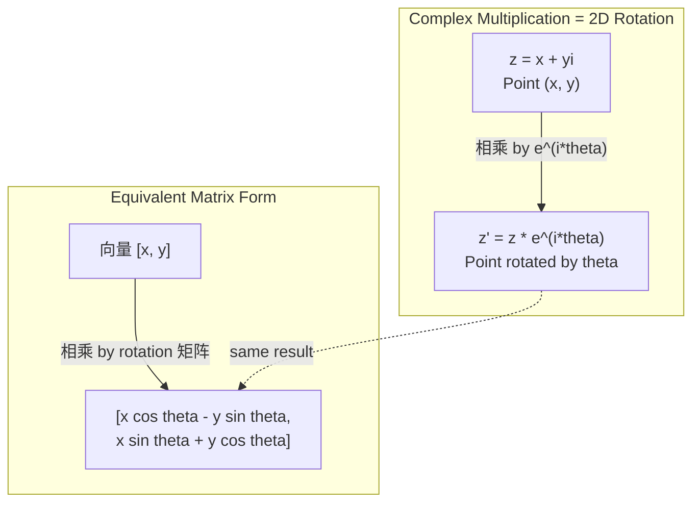
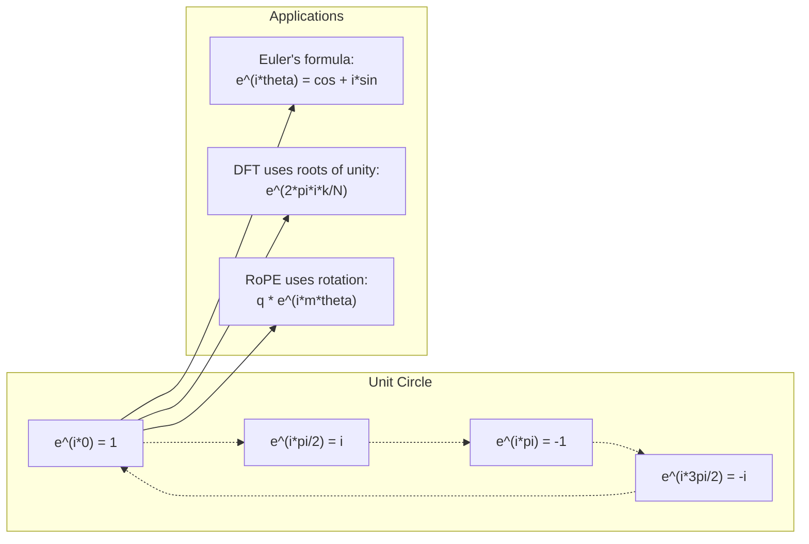

# 面向 AI 的复数

> The square root of -1 is not imaginary. It is the key to rotations, 频率, 和 half of 信号 processing.

**类型：** Learn
**Language:** Python
**先修：** Phase 1, Lessons 01-04 (线性代数, 微积分)
**时间：** ~60 分钟

## 学习目标

- Perform 复数 arithmetic (add, 相乘, divide, conjugate) in both rectangular 和 polar form
- Apply Euler's formula to convert between 复数 exponentials 和 trigonometric 函数
- Implement the Discrete 傅里叶 Transform using 复数 roots of unity
- Explain 如何复数 rotations underlie RoPE 和 sinusoidal positional encodings in transformers

## 问题

你open a paper on 傅里叶 transforms 和 there is `i` everywhere. You look at transformer positional encodings 和 see `sin` 和 `cos` at different 频率 -- the real 和 imaginary parts of 复数 exponentials. You read 约 quantum computing 和 find everything expressed in 复数 向量 spaces.

复数 numbers seem abstract. A number 系统 built on the square root of -1 feels like a mathematical trick. But it is not a trick. It is the natural language of rotations 和 oscillations. Every time something spins, vibrates, 或 oscillates, 复数 numbers are the right tool.

Without underst和ing 复数 numbers, you cannot underst和 the Discrete 傅里叶 Transform. You cannot underst和 FFT. You cannot underst和 如何RoPE (Rotary Position Embedding) works in modern language 模型. You cannot underst和 为什么sinusoidal positional encodings in the original Transformer paper use the 频率 they do.

本课 builds 复数 arithmetic 从零实现, connects it to geometry, 和 shows you exactly where 复数 numbers appear in machine 学习.

## 概念

### What is a 复数 number?

一个复数 number has two parts: a real part 和 an imaginary part.

```
z = a + bi

where:
  a is the real part
  b is the imaginary part
  i is the imaginary unit, defined by i^2 = -1
```

That is it. You extend the number line into a plane. The real numbers sit on one 轴. The imaginary numbers sit on the other. Every 复数 number is a point in this plane.

### 复数 arithmetic

**Addition.** Add the real parts together, add the imaginary parts together.

```
(a + bi) + (c + di) = (a + c) + (b + d)i

Example: (3 + 2i) + (1 + 4i) = 4 + 6i
```

**Multiplication.** Use the distributive law 和 remember that i^2 = -1.

```
(a + bi)(c + di) = ac + adi + bci + bdi^2
                 = ac + adi + bci - bd
                 = (ac - bd) + (ad + bc)i

Example: (3 + 2i)(1 + 4i) = 3 + 12i + 2i + 8i^2
                            = 3 + 14i - 8
                            = -5 + 14i
```

**Conjugate.** Flip the sign of the imaginary part.

```
conjugate of (a + bi) = a - bi
```

The product of a 复数 number 和 its conjugate is always real:

```
(a + bi)(a - bi) = a^2 + b^2
```

**Division.** Multiply numerator 和 denominator by the conjugate of the denominator.

```
(a + bi) / (c + di) = (a + bi)(c - di) / (c^2 + d^2)
```

This eliminates the imaginary part from the denominator, giving you a clean 复数 number.

### The 复数 plane

The 复数 plane maps every 复数 number to a 2D point. The horizontal 轴 is the real 轴, the vertical 轴 is the imaginary 轴.

```
z = 3 + 2i  corresponds to the point (3, 2)
z = -1 + 0i corresponds to the point (-1, 0) on the real axis
z = 0 + 4i  corresponds to the point (0, 4) on the imaginary axis
```

一个复数 number is simultaneously a point 和 a 向量 from the origin. This dual interpretation is 什么makes 复数 numbers useful for geometry.

### Polar form

Any point in the plane can be described by its 距离 from the origin 和 its angle from the 正 real 轴.

```
z = r * (cos(theta) + i*sin(theta))

where:
  r = |z| = sqrt(a^2 + b^2)     (magnitude, or modulus)
  theta = atan2(b, a)             (phase, or argument)
```

Rectangular form (a + bi) is good for 加法. Polar form (r, theta) is good for 乘法.

**Multiplication in polar form.** Multiply the magnitudes, add the angles.

```
z1 = r1 * e^(i*theta1)
z2 = r2 * e^(i*theta2)

z1 * z2 = (r1 * r2) * e^(i*(theta1 + theta2))
```

This is 为什么复数 numbers are perfect for rotations. Multiplying by a 复数 number 与 magnitude 1 is a pure rotation.

### Euler's formula

The bridge between 复数 exponentials 和 trigonometry:

```
e^(i*theta) = cos(theta) + i*sin(theta)
```

This is the most important formula in this lesson. When theta = pi:

```
e^(i*pi) = cos(pi) + i*sin(pi) = -1 + 0i = -1

Therefore: e^(i*pi) + 1 = 0
```

Five fundamental constants (e, i, pi, 1, 0) linked in one 方程.

### Why Euler's formula matters for ML

Euler's formula says that `e^(i*theta)` traces the unit circle as theta varies. At theta = 0, you are at (1, 0). At theta = pi/2, you are at (0, 1). At theta = pi, you are at (-1, 0). At theta = 3*pi/2, you are at (0, -1). A full rotation is theta = 2*pi.

This means 复数 exponentials ARE rotations. And rotations are everywhere in 信号 processing 和 ML.

### Connection to 2D rotations

Multiplying the 复数 number (x + yi) by e^(i*theta) rotates the point (x, y) by angle theta around the origin.

```
Rotation via complex multiplication:
  (x + yi) * (cos(theta) + i*sin(theta))
  = (x*cos(theta) - y*sin(theta)) + (x*sin(theta) + y*cos(theta))i

Rotation via matrix multiplication:
  [cos(theta)  -sin(theta)] [x]   [x*cos(theta) - y*sin(theta)]
  [sin(theta)   cos(theta)] [y] = [x*sin(theta) + y*cos(theta)]
```

They produce identical results. 复数 乘法 IS 2D rotation. The rotation 矩阵 is just 复数 乘法 written in 矩阵 notation.



### Phasors 和 rotating signals

一个复数 exponential e^(i*omega*t) is a point rotating around the unit circle at angular 频率 omega. As t increases, the point traces the circle.

The real part of this rotating point is cos(omega*t). The imaginary part is sin(omega*t). A sinusoidal 信号 is the shadow of a rotating 复数 number.

```
e^(i*omega*t) = cos(omega*t) + i*sin(omega*t)

Real part:      cos(omega*t)    -- a cosine wave
Imaginary part: sin(omega*t)    -- a sine wave
```

This is the phasor representation. Instead of tracking a wiggly sine wave, you track a smoothly rotating arrow. Phase shifts become angle offsets. Amplitude changes become magnitude changes. Addition of signals becomes 向量 加法.

### Roots of unity

The N-th roots of unity are N points equally spaced on the unit circle:

```
w_k = e^(2*pi*i*k/N)    for k = 0, 1, 2, ..., N-1
```

For N = 4, the roots are: 1, i, -1, -i (the four compass points).
For N = 8, you get the four compass points plus the four diagonals.

Roots of unity are the foundation of the Discrete 傅里叶 Transform. The DFT decomposes a 信号 into components at these N equally-spaced 频率.

### Connection to the DFT

The Discrete 傅里叶 Transform of a 信号 x[0], x[1], ..., x[N-1] is:

```
X[k] = sum_{n=0}^{N-1} x[n] * e^(-2*pi*i*k*n/N)
```

Each X[k] measures 如何much the 信号 correlates 与 the k-th root of unity -- a 复数 sinusoid at 频率 k. The DFT breaks a 信号 into N rotating phasors 和 tells you the 振幅 和 相位 of each one.

### Why i is not imaginary

The word "imaginary" is a historical accident. Descartes used it dismissively. But i is no more imaginary than 负 numbers were when people first rejected them. Negative numbers answer "什么do you subtract 5 from 3 to get?" The imaginary unit answers "什么do you square to get -1?"

More usefully: i is a 90-度 rotation operator. Multiply a real number by i once, you rotate 90 degrees to the imaginary 轴. Multiply by i again (i^2), you rotate another 90 degrees -- now you are pointing in the 负 real direction. That is 为什么i^2 = -1. It is not mysterious. It is a half-turn built from two quarter-turns.

This is 为什么复数 numbers are everywhere in engineering. Anything that rotates -- electromagnetic waves, quantum 状态, 信号 oscillations, positional encodings -- is naturally described by 复数 numbers.

### 复数 exponentials vs trigonometric 函数

Before Euler's formula, engineers wrote signals as A*cos(omega*t + phi) -- 振幅 A, 频率 omega, 相位 phi. This works but makes arithmetic painful. Adding two cosines 与 different phases requires trigonometric identities.

With 复数 exponentials, the same 信号 is A*e^(i*(omega*t + phi)). Adding two signals is just adding two 复数 numbers. Multiplying (modulating) is just multiplying magnitudes 和 adding angles. Phase shifts become angle additions. Frequency shifts become multiplications by phasors.

The entire field of 信号 processing switched to 复数 exponential notation because the math is cleaner. The "real 信号" is always just the real part of the 复数 representation. The imaginary part is carried along as bookkeeping, making all the algebra work out naturally.

### Connection to transformers

**Sinusoidal positional encodings** (original Transformer paper):

```
PE(pos, 2i) = sin(pos / 10000^(2i/d))
PE(pos, 2i+1) = cos(pos / 10000^(2i/d))
```

The sin 和 cos pairs are the real 和 imaginary parts of 复数 exponentials at different 频率. Each 频率 provides a different "resolution" for encoding position. Low 频率 change slowly (coarse position). High 频率 change quickly (fine position). Together they give each position a unique 频率 fingerprint.

**RoPE (Rotary Position Embedding)** takes this further. It explicitly multiplies query 和 key 向量 by 复数 rotation 矩阵. The relative position between two tokens becomes a rotation angle. Attention is computed using these rotated 向量, making the 模型 sensitive to relative position through 复数 乘法.

| Operation | Algebraic Form | Geometric Meaning |
|-----------|---------------|-------------------|
| Addition | (a+c) + (b+d)i | 向量 加法 in the plane |
| Multiplication | (ac-bd) + (ad+bc)i | Rotate 和 scale |
| Conjugate | a - bi | Reflect over real 轴 |
| Magnitude | sqrt(a^2 + b^2) | 距离 from origin |
| Phase | atan2(b, a) | Angle from 正 real 轴 |
| Division | 相乘 by conjugate | Reverse rotation 和 rescale |
| Power | r^n * e^(i*n*theta) | Rotate n times, scale by r^n |



```figure
roots-of-unity
```

## Build It

### 第 1 步: 复数 class

Build a 复数 number class that supports arithmetic, magnitude, 相位, 和 conversion between rectangular 和 polar forms.

```python
import math

class Complex:
    def __init__(self, real, imag=0.0):
        self.real = real
        self.imag = imag

    def __add__(self, other):
        return Complex(self.real + other.real, self.imag + other.imag)

    def __mul__(self, other):
        r = self.real * other.real - self.imag * other.imag
        i = self.real * other.imag + self.imag * other.real
        return Complex(r, i)

    def __truediv__(self, other):
        denom = other.real ** 2 + other.imag ** 2
        r = (self.real * other.real + self.imag * other.imag) / denom
        i = (self.imag * other.real - self.real * other.imag) / denom
        return Complex(r, i)

    def magnitude(self):
        return math.sqrt(self.real ** 2 + self.imag ** 2)

    def phase(self):
        return math.atan2(self.imag, self.real)

    def conjugate(self):
        return Complex(self.real, -self.imag)
```

### 第 2 步: Polar conversion 和 Euler's formula

```python
def to_polar(z):
    return z.magnitude(), z.phase()

def from_polar(r, theta):
    return Complex(r * math.cos(theta), r * math.sin(theta))

def euler(theta):
    return Complex(math.cos(theta), math.sin(theta))
```

Verify: `euler(theta).magnitude()` should always be 1.0. `euler(0)` should give (1, 0). `euler(pi)` should give (-1, 0).

### 第 3 步: Rotation

Rotating a point (x, y) by angle theta is one 复数 乘法:

```python
point = Complex(3, 4)
rotated = point * euler(math.pi / 4)
```

The magnitude stays the same. Only the angle changes.

### 第 4 步: DFT from 复数 arithmetic

```python
def dft(signal):
    N = len(signal)
    result = []
    for k in range(N):
        total = Complex(0, 0)
        for n in range(N):
            angle = -2 * math.pi * k * n / N
            total = total + Complex(signal[n], 0) * euler(angle)
        result.append(total)
    return result
```

This is the O(N^2) DFT. Each 输出 X[k] is the sum of the 信号 样本 multiplied by roots of unity.

### 第 5 步: Inverse DFT

The inverse DFT reconstructs the original 信号 from its 频谱. The only changes from the forward DFT: flip the sign in the exponent 和 divide by N.

```python
def idft(spectrum):
    N = len(spectrum)
    result = []
    for n in range(N):
        total = Complex(0, 0)
        for k in range(N):
            angle = 2 * math.pi * k * n / N
            total = total + spectrum[k] * euler(angle)
        result.append(Complex(total.real / N, total.imag / N))
    return result
```

This gives you perfect reconstruction. Apply DFT, then IDFT, 和 you get back the original 信号 to machine precision. No information is lost.

### 第 6 步: Roots of unity

```python
def roots_of_unity(N):
    return [euler(2 * math.pi * k / N) for k in range(N)]
```

Verify two properties:
- Every root has magnitude exactly 1.
- The sum of all N roots is zero (they cancel out by symmetry).

These properties are 什么make the DFT invertible. The roots of unity form an orthogonal basis for the 频率 domain.

## Use It

Python has built-in 复数 number support. The literal `j` represents the imaginary unit.

```python
z = 3 + 2j
w = 1 + 4j

print(z + w)
print(z * w)
print(abs(z))

import cmath
print(cmath.phase(z))
print(cmath.exp(1j * cmath.pi))
```

For arrays, numpy h和les 复数 numbers natively:

```python
import numpy as np

z = np.array([1+2j, 3+4j, 5+6j])
print(np.abs(z))
print(np.angle(z))
print(np.conj(z))
print(np.real(z))
print(np.imag(z))

signal = np.sin(2 * np.pi * 5 * np.linspace(0, 1, 128))
spectrum = np.fft.fft(signal)
freqs = np.fft.fftfreq(128, d=1/128)
```

## Ship It

Run `code/complex_numbers.py` to generate `outputs/skill-complex-arithmetic.md`.

## 练习

1. **复数 arithmetic by h和.** Compute (2 + 3i) * (4 - i) 和 verify 与 the code. Then compute (5 + 2i) / (1 - 3i). Draw both results on the 复数 plane 和 check that 乘法 rotated 和 scaled the first number.

2. **Rotation sequence.** Start 与 the point (1, 0). Multiply by e^(i*pi/6) twelve times. Verify that you return to (1, 0) after 12 multiplications. Print the coordinates at each step 和 confirm they trace a regular 12-gon.

3. **DFT of a known 信号.** Create a 信号 that is the sum of sin(2*pi*3*t) 和 0.5*sin(2*pi*7*t) sampled at 32 points. Run your DFT. Verify that the magnitude 频谱 has peaks at 频率 3 和 7, 与 the peak at 7 being half the height of the peak at 3.

4. **Roots of unity visualization.** Compute the 8th roots of unity. Verify that they sum to zero. Verify that multiplying any root by the primitive root e^(2*pi*i/8) gives the next root.

5. **Rotation 矩阵 equivalence.** For 10 随机 angles 和 10 随机 points, verify that 复数 乘法 gives the same result as 矩阵-向量 乘法 与 the 2x2 rotation 矩阵. Print the maximum numerical difference.

## 关键术语

| Term | What it means |
|------|---------------|
| 复数 number | A number a + bi where a is the real part, b is the imaginary part, 和 i^2 = -1 |
| Imaginary unit | The number i, defined by i^2 = -1. Not imaginary in the philosophical sense -- it is a rotation operator |
| 复数 plane | The 2D plane where the x-轴 is real 和 the y-轴 is imaginary. Also called the Arg和 plane |
| Magnitude (modulus) | The 距离 from the origin: sqrt(a^2 + b^2). Written as \|z\| |
| Phase (argument) | The angle from the 正 real 轴: atan2(b, a). Written as arg(z) |
| Conjugate | The mirror image across the real 轴: conjugate of a + bi is a - bi |
| Polar form | Expressing z as r * e^(i*theta) instead of a + bi. Makes 乘法 easy |
| Euler's formula | e^(i*theta) = cos(theta) + i*sin(theta). Connects exponentials to trigonometry |
| Phasor | A rotating 复数 number e^(i*omega*t) representing a sinusoidal 信号 |
| Roots of unity | The N 复数 numbers e^(2*pi*i*k/N) for k = 0 to N-1. N equally spaced points on the unit circle |
| DFT | Discrete 傅里叶 Transform. Decomposes a 信号 into 复数 sinusoidal components using roots of unity |
| RoPE | Rotary Position Embedding. Uses 复数 乘法 to encode relative position in transformer attention |

## 延伸阅读

- [Visual Introduction to Euler's Formula](@@URL0@@) - builds geometric intuition without heavy notation
- [Su et al.: RoFormer (2021)](@@URL0@@) - the paper introducing Rotary Position Embedding using 复数 rotations
- [Vaswani et al.: Attention Is All You Need (2017)](@@URL0@@) - the original Transformer paper 与 sinusoidal positional encodings
- [3Blue1Brown: Euler's formula with introductory group theory](@@URL0@@) - visual explanation of 为什么e^(i*pi) = -1
- [Needham: Visual Complex Analysis](@@URL0@@) - the best visual treatment of 复数 numbers, full of geometric insight
- [Strang: Introduction to Linear Algebra, Ch. 10](@@URL0@@) - 复数 numbers in the context of 线性代数 和 特征值
