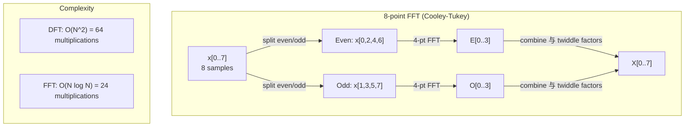
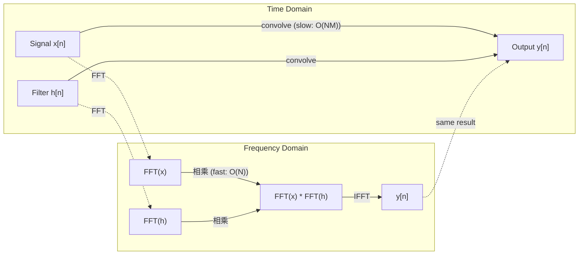

# 傅里叶变换

> Every 信号 is a sum of sine waves. The 傅里叶 transform tells you which ones.

**类型：** Build
**Language:** Python
**先修：** Phase 1, Lessons 01-04, 19 (复数 numbers)
**时间：** ~90 分钟

## 学习目标

- Implement the DFT 从零实现 和 verify it against the O(N log N) Cooley-Tukey FFT
- Interpret 频率 coefficients: extract 振幅, 相位, 和 power 频谱 from a 信号
- Apply the convolution theorem to perform convolution via FFT 乘法
- Connect 傅里叶 频率 decomposition to transformer positional encodings 和 CNN convolution layers

## 问题

一个audio recording is a sequence of pressure measurements over time. A stock price is a sequence of values over days. An image is a grid of pixel intensities over 空间. All of these are 数据 in the time domain (or 空间 domain). You see values changing over some index.

But many patterns are invisible in the time domain. Is this audio 信号 a pure tone 或 a chord? Does this stock price have a weekly cycle? Does this image have a repeating texture? These questions are 约 频率 content, 和 the time domain hides it.

The 傅里叶 transform converts 数据 from the time domain to the 频率 domain. It takes a 信号 和 decomposes it into sine waves of different 频率. Each sine wave has an 振幅 (如何strong it is) 和 a 相位 (where it starts). The 傅里叶 transform tells you both.

This matters for ML because 频率-domain thinking appears everywhere. Convolutional neural networks perform convolution, which is 乘法 in the 频率 domain. Transformer positional encodings use 频率 decomposition to represent position. Audio 模型 (speech recognition, music generation) operate on spectrograms -- 频率 representations of sound. 时间 series 模型 look for periodic patterns. Underst和ing the 傅里叶 transform gives you the vocabulary to work 与 all of these.

## 概念

### The DFT definition

给定 N 样本 x[0], x[1], ..., x[N-1], the Discrete 傅里叶 Transform produces N 频率 coefficients X[0], X[1], ..., X[N-1]:

```
X[k] = sum_{n=0}^{N-1} x[n] * e^(-2*pi*i*k*n/N)

for k = 0, 1, ..., N-1
```

Each X[k] is a 复数 number. Its magnitude |X[k]| tells you the 振幅 of 频率 k. Its 相位 angle(X[k]) tells you the 相位 offset of that 频率.

The key insight: `e^(-2*pi*i*k*n/N)` is a rotating phasor at 频率 k. The DFT computes the 相关性 between the 信号 和 each of N equally-spaced 频率. If the 信号 contains energy at 频率 k, the 相关性 is large. If not, it is near zero.

### What each coefficient means

**X[0]: the DC component.** This is the sum of all 样本 -- proportional to the 均值. It represents the constant (zero-频率) offset of the 信号.

```
X[0] = sum_{n=0}^{N-1} x[n] * e^0 = sum of all samples
```

**X[k] for 1 <= k <= N/2: 正 频率.** X[k] represents 频率 k cycles per N 样本. Higher k means higher 频率 (faster oscillation).

**X[N/2]: the Nyquist 频率.** The highest 频率 you can represent 与 N 样本. Above this, you get aliasing -- high 频率 masquerading as low ones.

**X[k] for N/2 < k < N: 负 频率.** For real-valued signals, X[N-k] = conj(X[k]). The 负 频率 are mirror images of the 正 ones. This is 为什么the useful information is in the first N/2 + 1 coefficients.

### Inverse DFT

The inverse DFT reconstructs the original 信号 from its 频率 coefficients:

```
x[n] = (1/N) * sum_{k=0}^{N-1} X[k] * e^(2*pi*i*k*n/N)

for n = 0, 1, ..., N-1
```

The only differences from the forward DFT: the sign in the exponent is 正 (not 负), 和 there is a 1/N normalization factor.

The inverse DFT is perfect reconstruction. No information is lost. You can go from time domain to 频率 domain 和 back without any 误差. The DFT is a change of basis -- it re-expresses the same information in a different coordinate 系统.

### The FFT: making it fast

The DFT as defined above is O(N^2): for each of N 输出 coefficients, you sum over N 输入 样本. For N = 1 million, that is 10^12 operations.

The Fast 傅里叶 Transform (FFT) computes the same result in O(N log N). For N = 1 million, that is 约 20 million operations instead of a trillion. This is 什么makes 频率 analysis practical.

The Cooley-Tukey 算法 (the most common FFT) works by divide 和 conquer:

1. Split the 信号 into even-indexed 和 odd-indexed 样本.
2. Compute the DFT of each half recursively.
3. Combine the two half-size DFTs using "twiddle factors" e^(-2*pi*i*k/N).

```
X[k] = E[k] + e^(-2*pi*i*k/N) * O[k]          for k = 0, ..., N/2 - 1
X[k + N/2] = E[k] - e^(-2*pi*i*k/N) * O[k]    for k = 0, ..., N/2 - 1

where E = DFT of even-indexed samples
      O = DFT of odd-indexed samples
```

The symmetry means each level of recursion does O(N) work, 和 there are log2(N) levels. Total: O(N log N).



The FFT requires the 信号 length to be a power of 2. In practice, signals are zero-padded to the next power of 2.

### Spectral analysis

The **power 频谱** is |X[k]|^2 -- the squared magnitude of each 频率 coefficient. It shows 如何much energy is at each 频率.

The **相位 频谱** is angle(X[k]) -- the 相位 offset of each 频率. For most analysis tasks, you care 约 the power 频谱 和 ignore the 相位.

```
Power at frequency k:  P[k] = |X[k]|^2 = X[k].real^2 + X[k].imag^2
Phase at frequency k:  phi[k] = atan2(X[k].imag, X[k].real)
```

### Frequency resolution

The 频率 resolution of the DFT depends on the number of 样本 N 和 the 采样 rate fs.

```
Frequency of bin k:      f_k = k * fs / N
Frequency resolution:    delta_f = fs / N
Maximum frequency:       f_max = fs / 2  (Nyquist)
```

To resolve two 频率 that are close together, you need more 样本. To capture high 频率, you need a higher 采样 rate.

### The convolution theorem

This is one of the most important results in 信号 processing 和 directly relevant to CNNs.

**Convolution in the time domain equals pointwise 乘法 in the 频率 domain.**

```
x * h = IFFT(FFT(x) . FFT(h))

where * is convolution and . is element-wise multiplication
```

Why this matters:

- Direct convolution of two signals of length N 和 M takes O(N*M) operations.
- FFT-based convolution takes O(N log N): transform both, 相乘, transform back.
- For large kernels, FFT convolution is dramatically faster.
- This is exactly 什么happens in convolutional layers 与 large receptive fields.

Note: the DFT computes circular convolution (the 信号 wraps around). For linear convolution (no wraparound), zero-pad both signals to length N + M - 1 before computing.



### Windowing

The DFT assumes the 信号 is periodic -- it treats the N 样本 as one period of an infinitely repeating 信号. If the 信号 does not start 和 end at the same value, this creates a discontinuity at the boundary, which shows up as spurious high-频率 content. This is called 频谱 leakage.

Windowing reduces leakage by tapering the 信号 to zero at both ends before computing the DFT.

Common windows:

| Window | Shape | Main lobe width | Side lobe level | Use case |
|--------|-------|----------------|-----------------|----------|
| Rectangular | Flat (no window) | Narrowest | Highest (-13 dB) | When 信号 is exactly periodic in N 样本 |
| Hann | Raised cosine | Moderate | Low (-31 dB) | General purpose 频谱 analysis |
| Hamming | Modified cosine | Moderate | Lower (-42 dB) | Audio processing, speech analysis |
| Blackman | Triple cosine | Wide | Very low (-58 dB) | When side lobe suppression is critical |

```
Hann window:    w[n] = 0.5 * (1 - cos(2*pi*n / (N-1)))
Hamming window: w[n] = 0.54 - 0.46 * cos(2*pi*n / (N-1))
```

Apply the window by multiplying it element-wise 与 the 信号 before the DFT: `X = DFT(x * w)`.

### DFT properties

| Property | 时间 Domain | Frequency Domain |
|----------|-------------|-----------------|
| Linearity | a*x + b*y | a*X + b*Y |
| 时间 shift | x[n - k] | X[f] * e^(-2*pi*i*f*k/N) |
| Frequency shift | x[n] * e^(2*pi*i*f0*n/N) | X[f - f0] |
| Convolution | x * h | X * H (pointwise) |
| Multiplication | x * h (pointwise) | X * H (circular convolution, scaled by 1/N) |
| Parseval's theorem | sum \|x[n]\|^2 | (1/N) * sum \|X[k]\|^2 |
| Conjugate symmetry (real 输入) | x[n] real | X[k] = conj(X[N-k]) |

Parseval's theorem says the total energy is the same in both domains. Energy is conserved through the transform.

### Connection to positional encodings

The original Transformer uses sinusoidal positional encodings:

```
PE(pos, 2i)   = sin(pos / 10000^(2i/d_model))
PE(pos, 2i+1) = cos(pos / 10000^(2i/d_model))
```

Each 维度 pair (2i, 2i+1) oscillates at a different 频率. The 频率 are geometrically spaced from high (维度 0,1) to low (last 维度). This gives each position a unique pattern across all 频率 b和s -- similar to 如何傅里叶 coefficients uniquely identify a 信号.

The key properties this provides:

- **Uniqueness:** No two positions have the same encoding.
- **Bounded values:** sin 和 cos are always in [-1, 1].
- **Relative position:** The encoding of position p+k can be expressed as a linear 函数 of the encoding at position p. The 模型 can learn to attend to relative positions.

### Connection to CNNs

一个convolution layer applies a learned filter (kernel) to the 输入 by sliding it across the 信号 或 image. Mathematically, this is the convolution operation.

By the convolution theorem, this is equivalent to:
1. FFT the 输入
2. FFT the kernel
3. Multiply in 频率 domain
4. IFFT the result

St和ard CNN implementations use direct convolution (faster for small 3x3 kernels). But for large kernels 或 global convolution, FFT-based approaches are significantly faster. Some architectures (like FNet) replace attention entirely 与 FFT, achieving competitive accuracy 与 O(N log N) instead of O(N^2) complexity.

### Spectrograms 和 the Short-时间 傅里叶 Transform

一个single FFT gives you the 频率 content of the entire 信号, but tells you nothing 约 when those 频率 occur. A chirp (a 信号 whose 频率 increases over time) 和 a chord (all 频率 present simultaneously) can have the same magnitude 频谱.

The Short-时间 傅里叶 Transform (STFT) solves this by computing FFTs on overlapping windows of the 信号. The result is a spectrogram: a 2D representation 与 time on one 轴 和 频率 on the other. The intensity at each point shows the energy at that 频率 at that time.

```
STFT procedure:
1. Choose a window size (e.g., 1024 samples)
2. Choose a hop size (e.g., 256 samples -- 75% overlap)
3. For each window position:
   a. Extract the windowed segment
   b. Apply a Hann/Hamming window
   c. Compute FFT
   d. Store the magnitude spectrum as one column of the spectrogram
```

Spectrograms are the st和ard 输入 representation for audio ML 模型. Speech recognition 模型 (Whisper, DeepSpeech) operate on mel-spectrograms -- spectrograms 与 频率 mapped to the mel scale, which better matches human pitch perception.

### Aliasing

如果a 信号 contains 频率 above fs/2 (the Nyquist 频率), 采样 at rate fs will create aliased copies. A 90 Hz 信号 sampled at 100 Hz looks identical to a 10 Hz 信号. There is no way to distinguish them from the 样本 alone.

```
Example:
  True signal: 90 Hz sine wave
  Sampling rate: 100 Hz
  Apparent frequency: 100 - 90 = 10 Hz

  The samples from the 90 Hz signal at 100 Hz sampling rate
  are identical to the samples from a 10 Hz signal.
  No amount of math can recover the original 90 Hz.
```

This is 为什么analog-to-digital converters include anti-aliasing filters that remove 频率 above Nyquist before 采样. In ML, aliasing appears when downsampling 特征 maps without proper low-pass filtering -- some architectures address this 与 anti-aliased pooling layers.

### Zero-padding does not increase resolution

一个common misconception: zero-padding a 信号 before FFT improves 频率 resolution. It does not. Zero-padding interpolates between existing 频率 bins, giving you a smoother-looking 频谱. But it cannot reveal 频率 detail that was not present in the original 样本.

True 频率 resolution depends only on the observation time T = N / fs. To resolve two 频率 separated by delta_f, you need at least T = 1 / delta_f seconds of 数据. No amount of zero-padding changes this fundamental limit.

```figure
fourier-synthesis
```

## Build It

### 第 1 步: DFT 从零实现

The O(N^2) DFT follows directly from the definition.

```python
import math

class Complex:
    ...

def dft(x):
    N = len(x)
    result = []
    for k in range(N):
        total = Complex(0, 0)
        for n in range(N):
            angle = -2 * math.pi * k * n / N
            w = Complex(math.cos(angle), math.sin(angle))
            xn = x[n] if isinstance(x[n], Complex) else Complex(x[n])
            total = total + xn * w
        result.append(total)
    return result
```

### 第 2 步: Inverse DFT

Same structure, 正 exponent, divide by N.

```python
def idft(X):
    N = len(X)
    result = []
    for n in range(N):
        total = Complex(0, 0)
        for k in range(N):
            angle = 2 * math.pi * k * n / N
            w = Complex(math.cos(angle), math.sin(angle))
            total = total + X[k] * w
        result.append(Complex(total.real / N, total.imag / N))
    return result
```

### 第 3 步: FFT (Cooley-Tukey)

The recursive FFT requires power-of-2 length. Split into even 和 odd, recurse, combine 与 twiddle factors.

```python
def fft(x):
    N = len(x)
    if N <= 1:
        return [x[0] if isinstance(x[0], Complex) else Complex(x[0])]
    if N % 2 != 0:
        return dft(x)

    even = fft([x[i] for i in range(0, N, 2)])
    odd = fft([x[i] for i in range(1, N, 2)])

    result = [Complex(0)] * N
    for k in range(N // 2):
        angle = -2 * math.pi * k / N
        twiddle = Complex(math.cos(angle), math.sin(angle))
        t = twiddle * odd[k]
        result[k] = even[k] + t
        result[k + N // 2] = even[k] - t
    return result
```

### 第 4 步: Spectral analysis helpers

```python
def power_spectrum(X):
    return [xk.real ** 2 + xk.imag ** 2 for xk in X]

def convolve_fft(x, h):
    N = len(x) + len(h) - 1
    padded_N = 1
    while padded_N < N:
        padded_N *= 2

    x_padded = x + [0.0] * (padded_N - len(x))
    h_padded = h + [0.0] * (padded_N - len(h))

    X = fft(x_padded)
    H = fft(h_padded)

    Y = [xk * hk for xk, hk in zip(X, H)]

    y = idft(Y)
    return [y[n].real for n in range(N)]
```

## Use It

For real work, use numpy's FFT which is backed by highly optimized C libraries.

```python
import numpy as np

signal = np.sin(2 * np.pi * 5 * np.arange(256) / 256)
spectrum = np.fft.fft(signal)
freqs = np.fft.fftfreq(256, d=1/256)

power = np.abs(spectrum) ** 2

positive_freqs = freqs[:len(freqs)//2]
positive_power = power[:len(power)//2]
```

For windowing 和 more advanced 频谱 analysis:

```python
from scipy.signal import windows, stft

window = windows.hann(256)
windowed = signal * window
spectrum = np.fft.fft(windowed)
```

For convolution:

```python
from scipy.signal import fftconvolve

result = fftconvolve(signal, kernel, mode='full')
```

For spectrograms:

```python
from scipy.signal import stft

frequencies, times, Zxx = stft(signal, fs=sample_rate, nperseg=256)
spectrogram = np.abs(Zxx) ** 2
```

The spectrogram 矩阵 has 形状 (n_frequencies, n_time_frames). Each 列 is the power 频谱 at one time window. This is 什么audio ML 模型 consume as 输入.

## Ship It

Run `code/fourier.py` to generate `outputs/prompt-spectral-analyzer.md`.

## 练习

1. **Pure tone identification.** Create a 信号 与 a single sine wave at an unknown 频率 (between 1 和 50 Hz), sampled at 128 Hz for 1 second. Use your DFT to identify the 频率. Verify the answer matches. Now add Gaussian 噪声 与 标准差 0.5 和 repeat. How does 噪声 affect the 频谱?

2. **FFT vs DFT verification.** Generate a 随机 信号 of length 64. Compute both DFT (O(N^2)) 和 FFT. Verify that all coefficients match to within 1e-10. 时间 both 函数 on signals of length 256, 512, 1024, 和 2048. Plot the ratio of DFT time to FFT time.

3. **Convolution theorem proof by example.** Create 信号 x = [1, 2, 3, 4, 0, 0, 0, 0] 和 filter h = [1, 1, 1, 0, 0, 0, 0, 0]. Compute their circular convolution directly (nested loop). Then compute it via FFT (transform, 相乘, inverse transform). Verify the results match. Now do linear convolution by zero-padding appropriately.

4. **Windowing effects.** Create a 信号 that is the sum of two sine waves at 10 Hz 和 12 Hz (very close). 样本 at 128 Hz for 1 second. Compute the power 频谱 与 no window, Hann window, 和 Hamming window. Which window makes it easiest to distinguish the two peaks? Why?

5. **Positional encoding analysis.** Generate the sinusoidal positional encodings for d_model = 128 和 max_pos = 512. For each pair of positions (p1, p2), compute the dot product of their encodings. S如何that the dot product depends only on |p1 - p2|, not on the absolute positions. What happens to the dot product as the 距离 increases?

## 关键术语

| Term | What it means |
|------|---------------|
| DFT (Discrete 傅里叶 Transform) | Converts N time-domain 样本 into N 频率-domain coefficients. Each coefficient is the 相关性 与 a 复数 sinusoid at that 频率 |
| FFT (Fast 傅里叶 Transform) | An O(N log N) 算法 to compute the DFT. The Cooley-Tukey 算法 splits even/odd indices recursively |
| Inverse DFT | Reconstructs the time-domain 信号 from 频率 coefficients. Same formula as DFT 与 flipped exponent sign 和 1/N scaling |
| Frequency bin | Each index k in the DFT 输出 represents 频率 k*fs/N Hz. The "bin" is the discrete 频率 slot |
| DC component | X[0], the zero-频率 coefficient. Proportional to the 信号 均值 |
| Nyquist 频率 | fs/2, the maximum 频率 representable at 采样 rate fs. Frequencies above this alias |
| Power 频谱 | \|X[k]\|^2, the squared magnitude of each 频率 coefficient. Shows energy 分布 across 频率 |
| Phase 频谱 | angle(X[k]), the 相位 offset of each 频率 component. Often ignored in analysis |
| Spectral leakage | Spurious 频率 content caused by treating a non-periodic 信号 as periodic. Reduced by windowing |
| Window 函数 | A tapering 函数 (Hann, Hamming, Blackman) applied before DFT to reduce 频谱 leakage |
| Twiddle factor | The 复数 exponential e^(-2*pi*i*k/N) used to combine sub-DFTs in the FFT butterfly computation |
| Convolution theorem | Convolution in time domain equals pointwise 乘法 in 频率 domain. Fundamental to 信号 processing 和 CNNs |
| Circular convolution | Convolution where the 信号 wraps around. This is 什么the DFT naturally computes |
| Linear convolution | St和ard convolution without wraparound. Achieved by zero-padding before DFT |
| Parseval's theorem | Total energy is preserved through the 傅里叶 transform. sum \|x[n]\|^2 = (1/N) sum \|X[k]\|^2 |
| Aliasing | When 频率 above Nyquist appear as lower 频率 due to insufficient 采样 rate |

## 延伸阅读

- [Cooley & Tukey: An Algorithm for the Machine Calculation of Complex Fourier Series (1965)](@@URL0@@) - the original FFT paper that changed computing
- [3Blue1Brown: But what is the Fourier Transform?](@@URL0@@) - the best visual introduction to 傅里叶 transforms
- [Lee-Thorp et al.: FNet: Mixing Tokens with Fourier Transforms (2021)](@@URL0@@) - replaces self-attention 与 FFT in transformers
- [Smith: The Scientist and Engineer's Guide to Digital Signal Processing](@@URL0@@) - free online textbook covering FFT, windowing, 和 频谱 analysis in depth
- [Vaswani et al.: Attention Is All You Need (2017)](@@URL0@@) - sinusoidal positional encodings derived from 傅里叶 频率 decomposition
- [Radford et al.: Whisper (2022)](@@URL0@@) - speech recognition using mel-spectrograms as 输入 representation
