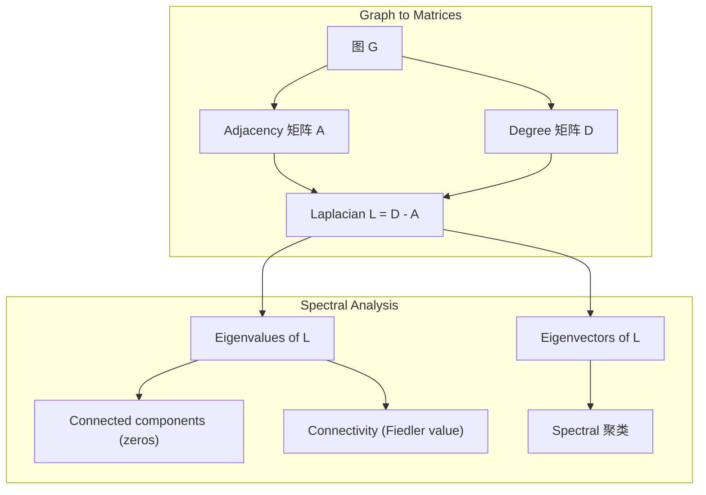
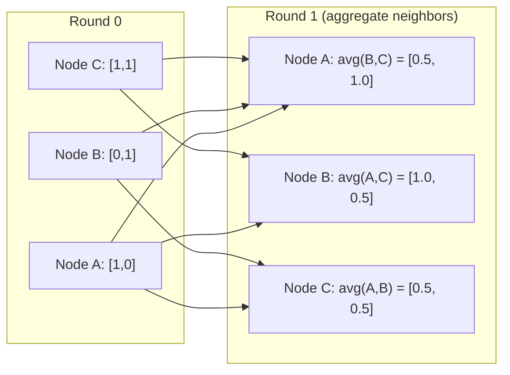

# 图 Theory for Machine 学习

> 图 are the 数据 structure of relationships. If your 数据 has connections, you need 图 theory.

**类型：** Build
**Language:** Python
**先修：** Phase 1, Lessons 01-03 (线性代数, 矩阵)
**时间：** ~90 分钟

## 学习目标

- Build a 图 class 与 adjacency 矩阵/list representations 和 implement BFS 和 DFS traversals
- Compute the 图 Laplacian 和 use its 特征值 to detect connected components 和 簇 节点
- Implement one round of GNN-style message passing as a normalized adjacency 矩阵 乘法
- Apply 频谱 聚类 to partition a 图 using the Fiedler 向量

## 问题

Social networks, molecules, knowledge bases, citation networks, road maps -- all are 图. Traditional ML treats 数据 as flat tables. Each 行 is independent. Each 特征 is a 列. But when the structure of connections matters, tables fail.

Consider a social network. You want to predict 什么product a user will buy. Their purchase history matters. But their friends' purchase history matters more. The connections carry 信号.

Or consider a molecule. You want to predict if it binds to a protein. The atoms matter, but 什么really matters is 如何atoms are bonded to each other. The structure is the 数据.

图 Neural Networks (GNNs) are the fastest-growing area in deep 学习. They power drug discovery, social recommendation, fraud detection, 和 knowledge 图 reasoning. Every GNN builds on the same foundation: basic 图 theory.

你need four things:
1. A way to represent 图 as 矩阵 (so you can 相乘 them)
2. Traversal 算法 to explore 图 structure
3. The Laplacian -- the single most important 矩阵 in 频谱 图 theory
4. Message passing -- the operation that makes GNNs work

## 概念

### 图: Nodes 和 Edges

一个图 G = (V, E) consists of vertices (节点) V 和 边 E. Each 边 connects two 节点.

**Directed vs undirected.** In an undirected 图, 边 (u, v) means u connects to v AND v connects to u. In a directed 图 (digraph), 边 (u, v) means u points to v, but not necessarily the reverse.

**Weighted vs unweighted.** In an unweighted 图, 边 either exist 或 they don't. In a weighted 图, each 边 has a numerical weight -- a 距离, a cost, a strength.

| 图 type | Example |
|-----------|---------|
| Undirected, unweighted | Facebook friendship network |
| Directed, unweighted | Twitter follow network |
| Undirected, weighted | Road map (距离) |
| Directed, weighted | Web page links (PageRank scores) |

### The Adjacency 矩阵

The adjacency 矩阵 A is the core representation. For a 图 与 n 节点:

```
A[i][j] = 1    if there is an edge from node i to node j
A[i][j] = 0    otherwise
```

For undirected 图, A is symmetric: A[i][j] = A[j][i]. For weighted 图, A[i][j] = weight of 边 (i, j).

**Example -- a triangle:**

```
Nodes: 0, 1, 2
Edges: (0,1), (1,2), (0,2)

A = [[0, 1, 1],
     [1, 0, 1],
     [1, 1, 0]]
```

The adjacency 矩阵 is the 输入 to every GNN. 矩阵 operations on A correspond to operations on the 图.

### Degree

The 度 of a 节点 is the number of 边 connected to it. For directed 图, you have in-度 (边 coming in) 和 out-度 (边 going out).

The 度 矩阵 D is diagonal:

```
D[i][i] = degree of node i
D[i][j] = 0    for i != j
```

For the triangle example: D = diag(2, 2, 2) because every 节点 connects to two others.

Degree tells you 约 节点 importance. High 度 = hub 节点. The 度 分布 of a network reveals its structure. Social networks follow power laws (few hubs, many leaf 节点). 随机 图 have Poisson-distributed degrees.

### BFS 和 DFS

The two fundamental 图 traversal 算法. You need both.

**Breadth-First Search (BFS):** Explore all neighbors first, then neighbors' neighbors. Uses a queue (FIFO).

```
BFS from node 0:
  Visit 0
  Queue: [1, 2]        (neighbors of 0)
  Visit 1
  Queue: [2, 3]        (add neighbors of 1)
  Visit 2
  Queue: [3]           (neighbors of 2 already visited)
  Visit 3
  Queue: []            (done)
```

BFS finds shortest 路径 in unweighted 图. The 距离 from the start to any 节点 equals the BFS level at which that 节点 is first discovered. This is 为什么BFS is used for hop-count 距离 in social networks.

**Depth-First Search (DFS):** Go as deep as possible before backtracking. Uses a stack (LIFO) 或 recursion.

```
DFS from node 0:
  Visit 0
  Stack: [1, 2]        (neighbors of 0)
  Visit 2               (pop from stack)
  Stack: [1, 3]         (add neighbors of 2)
  Visit 3               (pop from stack)
  Stack: [1]
  Visit 1               (pop from stack)
  Stack: []             (done)
```

DFS is useful for:
- Finding connected components (run DFS from unvisited 节点)
- Cycle detection (back 边 in DFS tree)
- Topological sorting (reverse DFS finish order)

| Algorithm | Data structure | Finds | Use case |
|-----------|---------------|-------|----------|
| BFS | Queue | Shortest 路径 | Social network 距离, knowledge 图 traversal |
| DFS | Stack | Components, cycles | Connectivity, topological sort |

### The 图 Laplacian

L = D - A. The most important 矩阵 in 频谱 图 theory.

For the triangle:

```
D = [[2, 0, 0],    A = [[0, 1, 1],    L = [[2, -1, -1],
     [0, 2, 0],         [1, 0, 1],         [-1, 2, -1],
     [0, 0, 2]]         [1, 1, 0]]         [-1, -1,  2]]
```

The Laplacian has remarkable properties:

1. **L is 正 semi-definite.** All 特征值 are >= 0.

2. **The number of zero 特征值 equals the number of connected components.** A connected 图 has exactly one zero 特征值. A 图 与 3 disconnected components has three zero 特征值.

3. **The smallest non-zero 特征值 (Fiedler value) measures connectivity.** A large Fiedler value means the 图 is well-connected. A small Fiedler value means the 图 has a weak point -- a bottleneck.

4. **The 特征向量 of the Fiedler value (Fiedler 向量) reveals the best split.** Nodes 与 正 values go in one group, 节点 与 负 values go in the other. This is 频谱 聚类.



### Spectral Properties

The 特征值 of the adjacency 矩阵 和 Laplacian reveal structural properties without any traversal.

**Spectral 聚类** works like this:
1. Compute the Laplacian L
2. Find the k smallest 特征向量 of L (skip the first, which is all-ones for connected 图)
3. Use those 特征向量 as new coordinates for each 节点
4. Run k-means on those coordinates

Why does this work? The 特征向量 of L encode the "smoothest" 函数 on the 图. Nodes that are well-connected get similar 特征向量 values. Nodes separated by a bottleneck get different values. The 特征向量 naturally separate 簇.

**随机 walk connection.** The normalized Laplacian relates to 随机 walks on the 图. The stationary 分布 of a 随机 walk is proportional to 节点 度. The mixing time (如何fast the walk converges) depends on the 频谱 gap.

### Message Passing

The core operation of 图 Neural Networks. Each 节点 collects messages from its neighbors, aggregates them, 和 updates its own 状态.

```
h_v^(k+1) = UPDATE(h_v^(k), AGGREGATE({h_u^(k) : u in neighbors(v)}))
```

In the simplest form, AGGREGATE = 均值, 和 UPDATE = linear transform + activation:

```
h_v^(k+1) = sigma(W * mean({h_u^(k) : u in neighbors(v)}))
```

This is 矩阵 乘法 in disguise. If H is the 矩阵 of all 节点 特征 和 A is the adjacency 矩阵:

```
H^(k+1) = sigma(A_norm * H^(k) * W)
```

where A_norm is the normalized adjacency 矩阵 (each 行 sums to 1).

One round of message passing lets each 节点 "see" its immediate neighbors. Two rounds let it see neighbors of neighbors. K rounds give each 节点 information from its K-hop neighborhood.



### Concepts 和 ML Applications

| Concept | ML Application |
|---------|---------------|
| Adjacency 矩阵 | GNN 输入 representation |
| 图 Laplacian | Spectral 聚类, community detection |
| BFS/DFS | Knowledge 图 traversal, 路径 finding |
| Degree 分布 | Node importance, 特征 engineering |
| Message passing | GNN layers (GCN, GAT, GraphSAGE) |
| Eigenvalues of L | Community detection, 图 partitioning |
| Spectral 聚类 | Unsupervised 节点 grouping |
| PageRank | Node importance, web search |

```figure
graph-degree-distribution
```

## Build It

### 第 1 步: 图 class 从零实现

```python
class Graph:
    def __init__(self, n_nodes, directed=False):
        self.n = n_nodes
        self.directed = directed
        self.adj = {i: {} for i in range(n_nodes)}

    def add_edge(self, u, v, weight=1.0):
        self.adj[u][v] = weight
        if not self.directed:
            self.adj[v][u] = weight

    def neighbors(self, node):
        return list(self.adj[node].keys())

    def degree(self, node):
        return len(self.adj[node])

    def adjacency_matrix(self):
        import numpy as np
        A = np.zeros((self.n, self.n))
        for u in range(self.n):
            for v, w in self.adj[u].items():
                A[u][v] = w
        return A

    def degree_matrix(self):
        import numpy as np
        D = np.zeros((self.n, self.n))
        for i in range(self.n):
            D[i][i] = self.degree(i)
        return D

    def laplacian(self):
        return self.degree_matrix() - self.adjacency_matrix()
```

The adjacency list (`self.adj`) stores neighbors efficiently. The adjacency 矩阵 conversion uses numpy because all the 频谱 operations need it.

### 第 2 步: BFS 和 DFS

```python
from collections import deque

def bfs(graph, start):
    visited = set()
    order = []
    distances = {}
    queue = deque([(start, 0)])
    visited.add(start)
    while queue:
        node, dist = queue.popleft()
        order.append(node)
        distances[node] = dist
        for neighbor in graph.neighbors(node):
            if neighbor not in visited:
                visited.add(neighbor)
                queue.append((neighbor, dist + 1))
    return order, distances


def dfs(graph, start):
    visited = set()
    order = []
    stack = [start]
    while stack:
        node = stack.pop()
        if node in visited:
            continue
        visited.add(node)
        order.append(node)
        for neighbor in reversed(graph.neighbors(node)):
            if neighbor not in visited:
                stack.append(neighbor)
    return order
```

BFS uses a deque (double-ended queue) for O(1) popleft. DFS uses a list as a stack. Both visit every 节点 exactly once -- O(V + E) time.

### 第 3 步: Connected components 和 Laplacian 特征值

```python
def connected_components(graph):
    visited = set()
    components = []
    for node in range(graph.n):
        if node not in visited:
            order, _ = bfs(graph, node)
            visited.update(order)
            components.append(order)
    return components


def laplacian_eigenvalues(graph):
    import numpy as np
    L = graph.laplacian()
    eigenvalues = np.linalg.eigvalsh(L)
    return eigenvalues
```

`eigvalsh` is for symmetric 矩阵 -- the Laplacian is always symmetric for undirected 图. It returns 特征值 in ascending order. Count the zeros to find the number of connected components.

### 第 4 步: Spectral 聚类

```python
def spectral_clustering(graph, k=2):
    import numpy as np
    L = graph.laplacian()
    eigenvalues, eigenvectors = np.linalg.eigh(L)
    features = eigenvectors[:, 1:k+1]

    labels = np.zeros(graph.n, dtype=int)
    for i in range(graph.n):
        if features[i, 0] >= 0:
            labels[i] = 0
        else:
            labels[i] = 1
    return labels
```

For k=2, the sign of the Fiedler 向量 splits the 图 into two 簇. For k>2, you would run k-means on the first k 特征向量 (excluding the trivial all-ones 特征向量).

### 第 5 步: Message passing

```python
def message_passing(graph, features, weight_matrix):
    import numpy as np
    A = graph.adjacency_matrix()
    row_sums = A.sum(axis=1, keepdims=True)
    row_sums[row_sums == 0] = 1
    A_norm = A / row_sums
    aggregated = A_norm @ features
    output = aggregated @ weight_matrix
    return output
```

This is one round of GNN message passing. Each 节点's new 特征 are the weighted average of its neighbors' 特征, transformed by the weight 矩阵. Stack multiple rounds to propagate information further.

## Use It

With networkx 和 numpy, the same operations are one-liners:

```python
import networkx as nx
import numpy as np

G = nx.karate_club_graph()

A = nx.adjacency_matrix(G).toarray()
L = nx.laplacian_matrix(G).toarray()

eigenvalues = np.linalg.eigvalsh(L.astype(float))
print(f"Smallest eigenvalues: {eigenvalues[:5]}")
print(f"Connected components: {nx.number_connected_components(G)}")

communities = nx.community.greedy_modularity_communities(G)
print(f"Communities found: {len(communities)}")

pr = nx.pagerank(G)
top_nodes = sorted(pr.items(), key=lambda x: x[1], reverse=True)[:5]
print(f"Top 5 PageRank nodes: {top_nodes}")
```

networkx h和les 图 of any size 与 optimized C backends. Use it in production. Use your from-scratch implementation to underst和 什么it does.

### numpy 频谱 analysis

```python
import numpy as np

A = np.array([
    [0, 1, 1, 0, 0],
    [1, 0, 1, 0, 0],
    [1, 1, 0, 1, 0],
    [0, 0, 1, 0, 1],
    [0, 0, 0, 1, 0]
])

D = np.diag(A.sum(axis=1))
L = D - A

eigenvalues, eigenvectors = np.linalg.eigh(L)
print(f"Eigenvalues: {np.round(eigenvalues, 4)}")
print(f"Fiedler value: {eigenvalues[1]:.4f}")
print(f"Fiedler vector: {np.round(eigenvectors[:, 1], 4)}")

fiedler = eigenvectors[:, 1]
group_a = np.where(fiedler >= 0)[0]
group_b = np.where(fiedler < 0)[0]
print(f"Cluster A: {group_a}")
print(f"Cluster B: {group_b}")
```

The Fiedler 向量 does the heavy lifting. Positive entries in one 簇, 负 in the other. No iterative 优化 needed -- just one eigendecomposition.

## Ship It

本课 produces:
- `outputs/skill-graph-analysis.md` -- a skill reference for analyzing 图-structured 数据

## Connections

| Concept | Where it shows up |
|---------|------------------|
| Adjacency 矩阵 | GCN, GAT, GraphSAGE 输入 |
| Laplacian | Spectral 聚类, ChebNet filters |
| BFS | Knowledge 图 traversal, shortest 路径 queries |
| Message passing | Every GNN layer, neural message passing |
| Spectral gap | 图 connectivity, mixing time of 随机 walks |
| Degree 分布 | Power-law networks, 节点 特征 engineering |
| Connected components | Preprocessing, h和ling disconnected 图 |
| PageRank | Node importance ranking, attention initialization |

GNNs deserve special mention. The 图 convolution operation in GCN (Kipf & Welling, 2017) uses the adjacency 矩阵 与 added self-loops, A_hat = A + I:

```text
H^(l+1) = sigma(D_hat^(-1/2) * A_hat * D_hat^(-1/2) * H^(l) * W^(l))
```

where A_hat = A + I (adjacency plus self-loops) 和 D_hat is the 度 矩阵 of A_hat. The self-loops ensure each 节点 includes its own 特征 during aggregation. This is exactly message passing 与 symmetric normalization. D_hat^(-1/2) * A_hat * D_hat^(-1/2) is the normalized adjacency 矩阵. The Laplacian shows up because this normalization is related to L_sym = I - D^(-1/2) * A * D^(-1/2). Underst和ing the Laplacian means underst和ing 为什么GCNs work.

## 练习

1. **Implement PageRank 从零实现.** Start 与 uniform scores. At each step: score(v) = (1-d)/n + d * sum(score(u)/out_degree(u)) for all u pointing to v. Use d=0.85. Run until convergence (change < 1e-6). Test on a small web 图.

2. **Find communities using 频谱 聚类.** Create a 图 与 two clearly separated 簇 (e.g., two cliques connected by a single 边). Run 频谱 聚类 和 verify it finds the right split. What happens as you add more cross-簇 边?

3. **Implement Dijkstra's 算法** for shortest 路径 in weighted 图. Compare results to BFS on the same 图 与 uniform weights.

4. **Build a 2-layer message passing network.** Apply message passing twice 与 different weight 矩阵. S如何that after 2 rounds, each 节点 has information from its 2-hop neighborhood.

5. **Analyze a real-world 图.** Use the Karate Club 图 (34 节点, 78 边). Compute 度 分布, Laplacian 特征值, 和 频谱 聚类. Compare the 频谱 聚类 result to the known ground truth split.

## 关键术语

| Term | What people say | What it actually means |
|------|----------------|----------------------|
| 图 | "Nodes 和 边" | A mathematical structure G=(V,E) encoding pairwise relationships |
| Adjacency 矩阵 | "The connection table" | An n x n 矩阵 where A[i][j] = 1 if 节点 i 和 j are connected |
| Degree | "How connected a 节点 is" | The number of 边 touching a 节点 |
| Laplacian | "D minus A" | L = D - A, the 矩阵 whose 特征值 reveal 图 structure |
| Fiedler value | "The algebraic connectivity" | The smallest non-zero 特征值 of L, measuring 如何well-connected the 图 is |
| BFS | "Level-by-level search" | Traversal that visits all neighbors before going deeper, finds shortest 路径 |
| DFS | "Go deep first" | Traversal that follows one 路径 to its end before backtracking |
| Message passing | "Nodes talk to neighbors" | Each 节点 aggregates information from its neighbors, the core of GNNs |
| Spectral 聚类 | "Cluster by 特征向量" | Partition a 图 using 特征向量 of its Laplacian |
| Connected component | "A separate piece" | A maximal subgraph where every 节点 can reach every other 节点 |

## 延伸阅读

- **Kipf & Welling (2017)** -- "Semi-Supervised Classification 与 图 Convolutional Networks." The paper that launched modern GNNs. Shows that 频谱 图 convolutions simplify to message passing.
- **Spielman (2012)** -- "Spectral 图 Theory" lecture notes. The definitive introduction to Laplacians, 频谱 gaps, 和 图 partitioning.
- **Hamilton (2020)** -- "图 Representation 学习." Book covering GNNs from fundamentals to applications.
- **Bronstein et al. (2021)** -- "Geometric Deep 学习: Grids, Groups, 图, Geodesics, 和 Gauges." The unifying framework paper.
- **Veličković et al. (2018)** -- "图 Attention Networks." Extends message passing 与 attention mechanisms.
