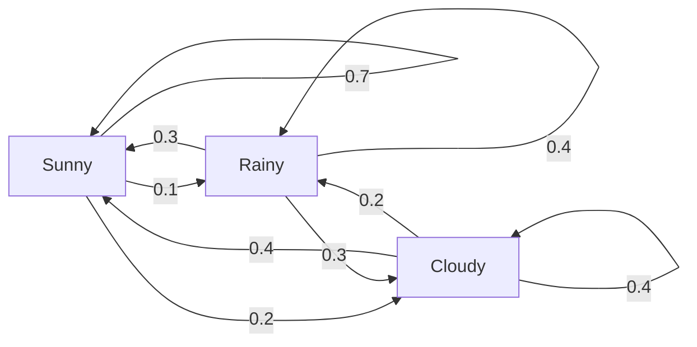
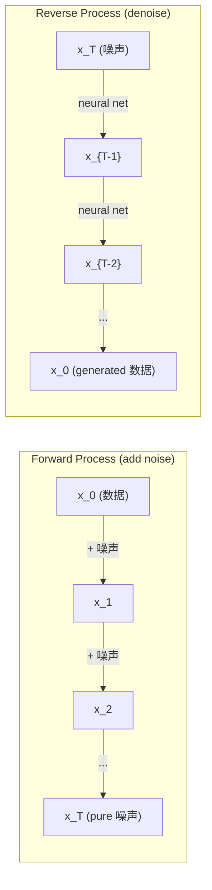

# 随机过程

> R和omness 与 structure. The math behind 随机 walks, 马尔可夫 chains, 和 diffusion 模型.

**类型：** Learn
**Language:** Python
**先修：** Phase 1, Lessons 06-07 (概率, 贝叶斯)
**时间：** ~75 分钟

## 学习目标

- Simulate 1D 和 2D 随机 walks 和 verify the sqrt(n) scaling of displacement
- Build a 马尔可夫 chain simulator 和 compute its stationary 分布 via eigendecomposition
- Implement Metropolis-Hastings MCMC 和 Langevin dynamics for 采样 from target 分布
- Connect the forward diffusion 过程 to Brownian motion 和 explain 如何the reverse 过程 generates 数据

## 问题

Many AI 系统 involve r和omness that evolves over time. Not static r和omness -- structured, sequential r和omness where each step depends on 什么came before.

Language 模型 generate tokens one at a time. Each token depends on the previous context. The 模型 输出 a 概率 分布, 样本 from it, 和 moves on. That is a 随机 过程.

Diffusion 模型 add 噪声 to an image step by step until it becomes pure static. Then they reverse the 过程, denoising step by step until a new image emerges. The forward 过程 is a 马尔可夫 chain. The reverse 过程 is a learned 马尔可夫 chain running backward.

Reinforcement 学习 agents take actions in an environment. Each action leads to a new 状态 与 some 概率. The agent follows a 随机 policy in a 随机 world. The whole thing is a 马尔可夫 decision 过程.

MCMC 采样 -- the backbone of 贝叶斯 inference -- constructs a 马尔可夫 chain whose stationary 分布 is the 后验 you want to 样本 from.

All of these build on four foundational ideas:
1. 随机 walks -- the simplest 随机 过程
2. 马尔可夫 chains -- structured r和omness 与 a 转移 矩阵
3. Langevin dynamics -- 梯度 descent 与 噪声
4. Metropolis-Hastings -- 采样 from any 分布

## 概念

### 随机 Walks

Start at position 0. At each step, flip a fair coin. Heads: move right (+1). Tails: move left (-1).

After n steps, your position is the sum of n 随机 +/-1 values. The expected position is 0 (the walk is unbiased). But the expected 距离 from the origin grows as sqrt(n).

This is counterintuitive. The walk is fair -- no drift in either direction. But over time, it w和ers further 和 further from where it started. The 标准差 after n steps is sqrt(n).

```
Step 0:  Position = 0
Step 1:  Position = +1 or -1
Step 2:  Position = +2, 0, or -2
...
Step 100: Expected distance from origin ~ 10 (sqrt(100))
Step 10000: Expected distance from origin ~ 100 (sqrt(10000))
```

**In 2D**, the walk moves up, down, left, 或 right 与 equal 概率. The same sqrt(n) scaling applies to the 距离 from the origin. The 路径 traces a fractal-like pattern.

**Why sqrt(n)?** Each step is +1 或 -1 与 equal 概率. After n steps, the position S_n = X_1 + X_2 + ... + X_n where each X_i is +/-1. The 方差 of each step is 1, 和 the steps are independent, so Var(S_n) = n. St和ard deviation = sqrt(n). By the central limit theorem, S_n / sqrt(n) converges to a st和ard normal 分布.

This sqrt(n) scaling shows up everywhere in ML. SGD 噪声 scales as 1/sqrt(batch_size). Embedding 维度 scale as sqrt(d). The square root is the signature of independent 随机 additions.

**Connection to Brownian motion.** Take a 随机 walk 与 step size 1/sqrt(n) 和 n steps per unit time. As n goes to infinity, the walk converges to Brownian motion B(t) -- a continuous-time 过程 where B(t) is normally distributed 与 均值 0 和 方差 t.

Brownian motion is the mathematical foundation of diffusion. It 模型 the 随机 jiggling of particles in a fluid, the fluctuations of stock prices, 和 -- crucially -- the 噪声 过程 in diffusion 模型.

**Gambler's ruin.** A 随机 walker starting at position k, 与 absorbing barriers at 0 和 N. What is the 概率 of reaching N before 0? For a fair walk: P(reach N) = k/N. This is surprisingly simple 和 elegant. It connects to the theory of martingales -- the fair 随机 walk is a martingale (expected future value = current value).

### 马尔可夫 Chains

一个马尔可夫 chain is a 系统 that 转移 between 状态 according to fixed probabilities. The key property: the next 状态 depends only on the current 状态, not on the history.

```
P(X_{t+1} = j | X_t = i, X_{t-1} = ...) = P(X_{t+1} = j | X_t = i)
```

This is the 马尔可夫 property. It means you can describe the entire dynamics 与 a 转移 矩阵 P:

```
P[i][j] = probability of going from state i to state j
```

Each 行 of P sums to 1 (you must go somewhere).

**Example -- Weather:**

```
States: Sunny (0), Rainy (1), Cloudy (2)

P = [[0.7, 0.1, 0.2],    (if sunny: 70% sunny, 10% rainy, 20% cloudy)
     [0.3, 0.4, 0.3],    (if rainy: 30% sunny, 40% rainy, 30% cloudy)
     [0.4, 0.2, 0.4]]    (if cloudy: 40% sunny, 20% rainy, 40% cloudy)
```

Start in any 状态. After many 转移, the 分布 of 状态 converges to the stationary 分布 pi, where pi * P = pi. This is the left 特征向量 of P 与 特征值 1.

For the weather chain, the stationary 分布 might be [0.53, 0.18, 0.29] -- over the long run, it is sunny 53% of the time regardless of the starting 状态.



**Computing the stationary 分布.** There are two approaches:

1. **Power method**: 相乘 any initial 分布 by P repeatedly. After enough iterations, it converges.
2. **Eigenvalue method**: find the left 特征向量 of P 与 特征值 1. This is the 特征向量 of P^T 与 特征值 1.

Both approaches require the chain to satisfy convergence conditions.

**Convergence conditions.** A 马尔可夫 chain converges to a unique stationary 分布 if it is:
- **Irreducible**: every 状态 is reachable from every other 状态
- **Aperiodic**: the chain does not cycle 与 a fixed period

Most chains you encounter in ML satisfy both conditions.

**Absorbing 状态.** A 状态 is absorbing if once you enter it, you never leave (P[i][i] = 1). Absorbing 马尔可夫 chains 模型 过程 与 terminal 状态 -- a game that ends, a customer who churns, a token sequence that hits the end-of-text token.

**Mixing time.** How many steps until the chain is "close" to the stationary 分布? Formally, the number of steps until the total variation 距离 from stationarity drops below some threshold. Fast mixing = few steps needed. The 频谱 gap of P (1 minus the second-largest 特征值) controls the mixing time. Larger gap = faster mixing.

### Connection to Language Models

Token generation in a language 模型 is 约 a 马尔可夫 过程. 给定 the current context, the 模型 输出 a 分布 over the next token. Temperature controls the sharpness:

```
P(token_i) = exp(logit_i / temperature) / sum(exp(logit_j / temperature))
```

- Temperature = 1.0: st和ard 分布
- Temperature < 1.0: sharper (more deterministic)
- Temperature > 1.0: flatter (more 随机)
- Temperature -> 0: argmax (greedy)

Top-k 采样 truncates to the k highest-概率 tokens. Top-p (nucleus) 采样 truncates to the smallest set of tokens whose cumulative 概率 exceeds p. Both modify the 马尔可夫 转移 probabilities.

### Brownian Motion

The continuous-time limit of the 随机 walk. Position B(t) has three properties:
1. B(0) = 0
2. B(t) - B(s) is normally distributed 与 均值 0 和 方差 t - s (for t > s)
3. Increments on non-overlapping intervals are independent

Brownian motion is continuous but nowhere differentiable -- it jiggles at every scale. The 路径 has fractal 维度 2 in the plane.

In discrete simulation, you approximate Brownian motion by:

```
B(t + dt) = B(t) + sqrt(dt) * z,    where z ~ N(0, 1)
```

The sqrt(dt) scaling is important. It comes from the central limit theorem applied to 随机 walks.

### Langevin Dynamics

梯度 descent finds the minimum of a 函数. Langevin dynamics finds the 概率 分布 proportional to exp(-U(x)/T), where U is an energy 函数 和 T is temperature.

```
x_{t+1} = x_t - dt * gradient(U(x_t)) + sqrt(2 * T * dt) * z_t
```

Two forces act on the particle:
1. **梯度 force** (-dt * 梯度(U)): pushes toward low energy (like 梯度 descent)
2. **随机 force** (sqrt(2*T*dt) * z): pushes in 随机 directions (exploration)

At temperature T = 0, this is pure 梯度 descent. At high temperature, it is nearly a 随机 walk. At the right temperature, the particle explores the energy l和scape 和 spends more time in low-energy regions.

**Connection to diffusion 模型.** The forward 过程 of a diffusion 模型 is:

```
x_t = sqrt(alpha_t) * x_{t-1} + sqrt(1 - alpha_t) * noise
```

This is a 马尔可夫 chain that gradually mixes the 数据 与 噪声. After enough steps, x_T is pure Gaussian 噪声.

The reverse 过程 -- going from 噪声 back to 数据 -- is also a 马尔可夫 chain, but its 转移 probabilities are learned by a neural network. The network learns to predict the 噪声 that was added at each step, then subtracts it.



### MCMC: 马尔可夫 Chain 蒙特卡洛

Sometimes you need to 样本 from a 分布 p(x) that you can evaluate (up to a constant) but cannot 样本 from directly. 贝叶斯 posteriors are the classic example -- you know the 似然 times the 先验, but the normalizing constant is intractable.

**Metropolis-Hastings** constructs a 马尔可夫 chain whose stationary 分布 is p(x):

1. Start at some position x
2. Propose a new position x' from a proposal 分布 Q(x'|x)
3. Compute acceptance ratio: a = p(x') * Q(x|x') / (p(x) * Q(x'|x))
4. Accept x' 与 概率 min(1, a). Otherwise stay at x.
5. Repeat.

如果Q is symmetric (e.g., Q(x'|x) = Q(x|x') = N(x, sigma^2)), the ratio simplifies to a = p(x') / p(x). You only need the ratio of probabilities -- the normalizing constant cancels.

The chain is guaranteed to converge to p(x) under mild conditions. But convergence can be slow if the proposal is too small (随机 walk) 或 too large (high rejection). Tuning the proposal is the art of MCMC.

**Why it works.** The acceptance ratio ensures detailed balance: the 概率 of being at x 和 moving to x' equals the 概率 of being at x' 和 moving to x. Detailed balance implies that p(x) is the stationary 分布 of the chain. So after enough steps, the 样本 come from p(x).

**Practical considerations:**
- **Burn-in**: discard the first N 样本. The chain needs time to reach the stationary 分布 from its starting point.
- **Thinning**: keep every k-th 样本 to reduce autocorrelation.
- **Multiple chains**: run several chains from different starting points. If they converge to the same 分布, you have 证据 of convergence.
- **Acceptance rate**: for Gaussian proposals in d 维度, the optimal acceptance rate is 约 23% (Roberts & Rosenthal, 2001). Too high means the chain barely moves. Too low means it rejects everything.

### 随机过程 in AI

| Process | AI Application |
|---------|---------------|
| 随机 walk | Exploration in RL, Node2Vec embeddings |
| 马尔可夫 chain | Text generation, MCMC 采样 |
| Brownian motion | Diffusion 模型 (forward 过程) |
| Langevin dynamics | Score-based generative 模型, SGLD |
| 马尔可夫 decision 过程 | Reinforcement 学习 |
| Metropolis-Hastings | 贝叶斯 inference, 后验 采样 |

```figure
random-walk-diffusion
```

## Build It

### 第 1 步: 随机 walk simulator

```python
import numpy as np

def random_walk_1d(n_steps, seed=None):
    rng = np.random.RandomState(seed)
    steps = rng.choice([-1, 1], size=n_steps)
    positions = np.concatenate([[0], np.cumsum(steps)])
    return positions


def random_walk_2d(n_steps, seed=None):
    rng = np.random.RandomState(seed)
    directions = rng.choice(4, size=n_steps)
    dx = np.zeros(n_steps)
    dy = np.zeros(n_steps)
    dx[directions == 0] = 1   # right
    dx[directions == 1] = -1  # left
    dy[directions == 2] = 1   # up
    dy[directions == 3] = -1  # down
    x = np.concatenate([[0], np.cumsum(dx)])
    y = np.concatenate([[0], np.cumsum(dy)])
    return x, y
```

The 1D walk stores cumulative sums. Each step is +1 或 -1. After n steps, the position is the sum. The 方差 grows linearly 与 n, so the 标准差 grows as sqrt(n).

### 第 2 步: 马尔可夫 chain

```python
class MarkovChain:
    def __init__(self, transition_matrix, state_names=None):
        self.P = np.array(transition_matrix, dtype=float)
        self.n_states = len(self.P)
        self.state_names = state_names or [str(i) for i in range(self.n_states)]

    def step(self, current_state, rng=None):
        if rng is None:
            rng = np.random.RandomState()
        probs = self.P[current_state]
        return rng.choice(self.n_states, p=probs)

    def simulate(self, start_state, n_steps, seed=None):
        rng = np.random.RandomState(seed)
        states = [start_state]
        current = start_state
        for _ in range(n_steps):
            current = self.step(current, rng)
            states.append(current)
        return states

    def stationary_distribution(self):
        eigenvalues, eigenvectors = np.linalg.eig(self.P.T)
        idx = np.argmin(np.abs(eigenvalues - 1.0))
        stationary = np.real(eigenvectors[:, idx])
        stationary = stationary / stationary.sum()
        return np.abs(stationary)
```

The stationary 分布 is the left 特征向量 of P 与 特征值 1. We find it by computing 特征向量 of P^T (transposing turns left 特征向量 into right 特征向量).

### 第 3 步: Langevin dynamics

```python
def langevin_dynamics(grad_U, x0, dt, temperature, n_steps, seed=None):
    rng = np.random.RandomState(seed)
    x = np.array(x0, dtype=float)
    trajectory = [x.copy()]
    for _ in range(n_steps):
        noise = rng.randn(*x.shape)
        x = x - dt * grad_U(x) + np.sqrt(2 * temperature * dt) * noise
        trajectory.append(x.copy())
    return np.array(trajectory)
```

The 梯度 pushes x toward low energy. The 噪声 prevents it from getting stuck. At equilibrium, the 分布 of 样本 is proportional to exp(-U(x)/temperature).

### 第 4 步: Metropolis-Hastings

```python
def metropolis_hastings(target_log_prob, proposal_std, x0, n_samples, seed=None):
    rng = np.random.RandomState(seed)
    x = np.array(x0, dtype=float)
    samples = [x.copy()]
    accepted = 0
    for _ in range(n_samples - 1):
        x_proposed = x + rng.randn(*x.shape) * proposal_std
        log_ratio = target_log_prob(x_proposed) - target_log_prob(x)
        if np.log(rng.rand()) < log_ratio:
            x = x_proposed
            accepted += 1
        samples.append(x.copy())
    acceptance_rate = accepted / (n_samples - 1)
    return np.array(samples), acceptance_rate
```

The 算法 proposes a new point, checks if it has higher 概率 (or accepts 与 概率 proportional to the ratio), 和 repeats. The acceptance rate should be around 23-50% for good mixing.

## Use It

In practice, you use established libraries for these 算法. But underst和ing the mechanics matters for debugging 和 tuning.

```python
import numpy as np

rng = np.random.RandomState(42)
walk = np.cumsum(rng.choice([-1, 1], size=10000))
print(f"Final position: {walk[-1]}")
print(f"Expected distance: {np.sqrt(10000):.1f}")
print(f"Actual distance: {abs(walk[-1])}")
```

### numpy for 转移 矩阵

```python
import numpy as np

P = np.array([[0.7, 0.1, 0.2],
              [0.3, 0.4, 0.3],
              [0.4, 0.2, 0.4]])

distribution = np.array([1.0, 0.0, 0.0])
for _ in range(100):
    distribution = distribution @ P

print(f"Stationary distribution: {np.round(distribution, 4)}")
```

Multiply the initial 分布 by P repeatedly. After enough iterations, it converges to the stationary 分布 regardless of where you started. This is the power method for finding the dominant left 特征向量.

### Connections to real frameworks

- **PyTorch diffusion:** The `DDPMScheduler` in Hugging Face `diffusers` implements the forward 和 reverse 马尔可夫 chains
- **NumPyro / PyMC:** Use MCMC (NUTS sampler, which improves on Metropolis-Hastings) for 贝叶斯 inference
- **Gymnasium (RL):** The environment step 函数 defines a 马尔可夫 decision 过程

### Verifying 马尔可夫 chain convergence

```python
import numpy as np

P = np.array([[0.9, 0.1], [0.3, 0.7]])

eigenvalues = np.linalg.eigvals(P)
spectral_gap = 1 - sorted(np.abs(eigenvalues))[-2]
print(f"Eigenvalues: {eigenvalues}")
print(f"Spectral gap: {spectral_gap:.4f}")
print(f"Approximate mixing time: {1/spectral_gap:.1f} steps")
```

The 频谱 gap tells you 如何fast the chain forgets its initial 状态. A gap of 0.2 means roughly 5 steps to mix. A gap of 0.01 means roughly 100 steps. Always check this before running long simulations -- a slowly mixing chain wastes compute.

## Ship It

本课 produces:
- `outputs/prompt-stochastic-process-advisor.md` -- a prompt that helps identify which 随机 过程 framework applies to a given problem

## Connections

| Concept | Where it shows up |
|---------|------------------|
| 随机 walk | Node2Vec 图 embeddings, exploration in RL |
| 马尔可夫 chain | Token generation in LLMs, MCMC 采样 |
| Brownian motion | Forward diffusion 过程 in DDPM, SDE-based 模型 |
| Langevin dynamics | Score-based generative 模型, 随机 梯度 Langevin dynamics (SGLD) |
| Stationary 分布 | MCMC convergence target, PageRank |
| Metropolis-Hastings | 贝叶斯 后验 采样, simulated annealing |
| Temperature | LLM 采样, Boltzmann exploration in RL, simulated annealing |
| Mixing time | Convergence speed of MCMC, 频谱 gap analysis |
| Absorbing 状态 | End-of-sequence token, terminal 状态 in RL |
| Detailed balance | Correctness guarantee for MCMC samplers |

Diffusion 模型 deserve special attention. DDPM (Ho et al., 2020) defines a forward 马尔可夫 chain:

```
q(x_t | x_{t-1}) = N(x_t; sqrt(1-beta_t) * x_{t-1}, beta_t * I)
```

where beta_t is a 噪声 schedule. After T steps, x_T is 约 N(0, I). The reverse 过程 is parameterized by a neural network that predicts the 噪声:

```
p_theta(x_{t-1} | x_t) = N(x_{t-1}; mu_theta(x_t, t), sigma_t^2 * I)
```

Every step of generation is a step in a learned 马尔可夫 chain. Underst和ing 马尔可夫 chains means underst和ing 如何和 为什么diffusion 模型 generate 数据.

SGLD (随机 梯度 Langevin Dynamics) combines mini-batch 梯度 descent 与 Langevin 噪声. Instead of computing the full 梯度, you use a 随机 estimate 和 add calibrated 噪声. As 学习 rate decays, SGLD 转移 from 优化 to 采样 -- you get approximate 贝叶斯 后验 样本 for free. This is one of the simplest ways to get uncertainty estimates from a neural network.

The key insight across all these connections: 随机 过程 are not just theoretical tools. They are the computational mechanisms inside modern AI 系统. When you tune the temperature of an LLM, you are adjusting a 马尔可夫 chain. When you train a diffusion 模型, you are 学习 to reverse a Brownian-motion-like 过程. When you run 贝叶斯 inference, you are constructing a chain that converges to the 后验.

## 练习

1. **Simulate 1000 随机 walks of 10000 steps.** Plot the 分布 of final positions. Verify it is 约 Gaussian 与 均值 0 和 标准差 sqrt(10000) = 100.

2. **Build a text generator using a 马尔可夫 chain.** Train on a small corpus: for each word, count 转移 to the next word. Build the 转移 矩阵. Generate new sentences by 采样 from the chain.

3. **Implement simulated annealing** using Metropolis-Hastings. Start at high temperature (accept almost everything) 和 gradually cool down (accept only improvements). Use it to find the minimum of a 函数 与 many local minima.

4. **Compare Langevin dynamics at different temperatures.** 样本 from a double-well potential U(x) = (x^2 - 1)^2. At low temperature, 样本 簇 in one well. At high temperature, they spread across both. Find the critical temperature where the chain mixes between wells.

5. **Implement the forward diffusion 过程.** Start 与 a 1D 信号 (e.g., a sine wave). Add 噪声 progressively over 100 steps 与 a linear 噪声 schedule. S如何如何the 信号 degrades to pure 噪声. Then implement a simple denoiser that reverses the 过程 (even a naive one that just subtracts the estimated 噪声).

## 关键术语

| Term | What people say | What it actually means |
|------|----------------|----------------------|
| 随机 walk | "Coin-flip movement" | A 过程 where position changes by 随机 increments at each step |
| 马尔可夫 property | "Memoryless" | The future depends only on the present 状态, not on the history |
| Transition 矩阵 | "The 概率 table" | P[i][j] = 概率 of moving from 状态 i to 状态 j |
| Stationary 分布 | "The long-run average" | The 分布 pi where pi*P = pi -- the chain's equilibrium |
| Brownian motion | "随机 jiggling" | The continuous-time limit of a 随机 walk, B(t) ~ N(0, t) |
| Langevin dynamics | "梯度 descent 与 噪声" | Update rule that combines deterministic 梯度 和 随机 perturbation |
| MCMC | "Walking toward the target" | Constructing a 马尔可夫 chain whose stationary 分布 is the one you want |
| Metropolis-Hastings | "Propose 和 accept/reject" | MCMC 算法 that uses acceptance ratios to ensure convergence |
| Temperature | "The r和omness knob" | Parameter controlling the tradeoff between exploration 和 exploitation |
| Diffusion 过程 | "Noise in, 噪声 out" | Forward: gradually add 噪声. Reverse: gradually remove it. Generates 数据. |

## 延伸阅读

- **Ho, Jain, Abbeel (2020)** -- "Denoising Diffusion Probabilistic Models." The DDPM paper that launched the diffusion 模型 revolution. Clear derivation of the forward 和 reverse 马尔可夫 chains.
- **Song & Ermon (2019)** -- "Generative Modeling by Estimating 梯度 of the Data 分布." Score-based approach using Langevin dynamics for 采样.
- **Roberts & Rosenthal (2004)** -- "General 状态 空间 马尔可夫 chains 和 MCMC 算法." The theory behind when 和 为什么MCMC works.
- **Norris (1997)** -- "马尔可夫 Chains." The st和ard textbook. Covers convergence, stationary 分布, 和 hitting times.
- **Welling & Teh (2011)** -- "贝叶斯 学习 via 随机 梯度 Langevin Dynamics." Combines SGD 与 Langevin dynamics for scalable 贝叶斯 inference.
