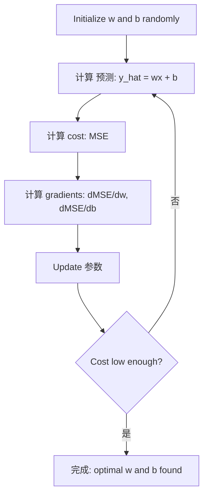

# 线性回归

> 线性回归 draws the best straight line through your data. It is the "hello world" of 机器学习.

**Type:** 构建
**Languages:** Python
**Prerequisites:** Phase 1 (Linear Algebra, Calculus, Optimization), Phase 2 Lesson 1
**Time:** ~90 分钟

## 学习目标

- 推导 the 梯度下降 update rules for 均方误差 and implement 线性回归 从零实现
- 比较 梯度下降 and the normal equation in terms of computational complexity and when to use each
- 构建 a multiple 线性回归 模型 with 特征 standardization and interpret the learned 权重
- 解释 how Ridge 回归 (L2 正则化) prevents 过拟合 by penalizing large 权重

## 问题

You have data: house sizes and their sale prices. You want to predict the price of a new house given its size. You could eyeball it on a scatter plot, but you need a formula. You need a line that best fits the data so you can plug in any size and get a price 预测.

线性回归 gives you that line. More importantly, it introduces the entire ML training loop: define a 模型, define a 代价函数, optimize the 参数. Every ML algorithm follows this same pattern. Master it here with the simplest case, and you will recognize it everywhere.

This is not just for simple problems. 线性回归 is used in 生产环境 systems for demand forecasting, A/B test analysis, financial modeling, and as a 基线 for every 回归 task.

## 概念

### 模型

线性回归 assumes a linear relationship between input (x) and output (y):

```
y = wx + b
```

- `w` (权重/slope): how much y changes when x increases by 1
- `b` (偏差/截距): the value of y when x = 0

For multiple inputs (特征), this extends to:

```
y = w1*x1 + w2*x2 + ... + wn*xn + b
```

Or in vector form: `y = w^T * x + b`

The goal: find the values of w and b that make the predicted y as close as possible to the actual y across all training examples.

### The 代价函数 (均方误差)

How do you measure "as close as possible"? You need a single number that captures how wrong your 预测 are. The most common choice is 均方误差 (MSE):

```
MSE = (1/n) * sum((y_predicted - y_actual)^2)
```

原因 squared? Two reasons. First, it penalizes large 误差 more than small 误差 (an 误差 of 10 is 100x worse than an 误差 of 1, not 10x). Second, the squared function is smooth and differentiable everywhere, which makes optimization straightforward.

The 代价函数 creates a surface. For a single 权重 w and 偏差 b, the MSE surface looks like a bowl (a convex paraboloid). The bottom of the bowl is where MSE is minimized. Training means finding that bottom.

### 梯度下降

梯度下降 finds the bottom of the bowl by taking steps downhill.



The gradients tell you two things: which direction to move each 参数, and how much to move.

For MSE with y_hat = wx + b:

```
dMSE/dw = (2/n) * sum((y_hat - y) * x)
dMSE/db = (2/n) * sum(y_hat - y)
```

The update rule:

```
w = w - learning_rate * dMSE/dw
b = b - learning_rate * dMSE/db
```

The learning rate controls step size. Too large: you overshoot the minimum and diverge. Too small: training takes forever. Typical starting values: 0.01, 0.001, or 0.0001.

### The Normal Equation (Closed-Form Solution)

For 线性回归 specifically, there is a direct formula that gives the optimal 权重 without any iteration:

```
w = (X^T * X)^(-1) * X^T * y
```

This inverts a matrix to solve for w in one step. It works perfectly for small 数据集. For large 数据集 (millions of rows or thousands of 特征), 梯度下降 is preferred because matrix inversion is O(n^3) in the number of 特征.

### 多元线性回归

With multiple 特征, the 模型 becomes:

```
y = w1*x1 + w2*x2 + ... + wn*xn + b
```

Everything works the same: MSE is the 代价函数, 梯度下降 updates all 权重 simultaneously. The only difference is that you are fitting a hyperplane instead of a line.

特征 scaling matters here. If one 特征 ranges from 0 to 1 and another ranges from 0 to 1,000,000, 梯度下降 will struggle because the cost surface becomes elongated. Standardize 特征 (subtract mean, divide by standard deviation) before training.

### 多项式回归

What if the relationship is not linear? You can still use 线性回归 by creating polynomial 特征:

```
y = w1*x + w2*x^2 + w3*x^3 + b
```

This is still "linear" 回归 because the 模型 is linear in the 权重 (w1, w2, w3). You are just using nonlinear 特征 of x.

Higher-degree polynomials can fit more complex curves but risk 过拟合. A degree-10 polynomial will pass through every point in a 10-point 数据集 but predict poorly on new data.

### R-Squared Score

MSE tells you how wrong you are, but the number depends on the scale of y. R-squared (R^2) gives a scale-independent measure:

```
R^2 = 1 - (sum of squared residuals) / (sum of squared deviations from mean)
    = 1 - SS_res / SS_tot
```

- R^2 = 1.0: perfect 预测
- R^2 = 0.0: the 模型 is no better than predicting the mean every time
- R^2 < 0.0: the 模型 is worse than predicting the mean

### 正则化 Preview (Ridge 回归)

When you have many 特征, the 模型 can overfit by assigning large 权重. Ridge 回归 (L2 正则化) adds a penalty:

```
Cost = MSE + lambda * sum(w_i^2)
```

The penalty term discourages large 权重. The 超参数 lambda controls the tradeoff: higher lambda means smaller 权重 and more 正则化. This is covered in depth in a later lesson. For now, know that it exists and why it helps.

```figure
linear-regression-fit
```

## 动手构建

### Step 1: 生成 样本 data

```python
import random
import math

random.seed(42)

TRUE_W = 3.0
TRUE_B = 7.0
N_SAMPLES = 100

X = [random.uniform(0, 10) for _ in range(N_SAMPLES)]
y = [TRUE_W * x + TRUE_B + random.gauss(0, 2.0) for x in X]

print(f"Generated {N_SAMPLES} samples")
print(f"True relationship: y = {TRUE_W}x + {TRUE_B} (+ noise)")
print(f"First 5 points: {[(round(X[i], 2), round(y[i], 2)) for i in range(5)]}")
```

### Step 2: 线性回归 从零实现 with 梯度下降

```python
class LinearRegression:
    def __init__(self, learning_rate=0.01):
        self.w = 0.0
        self.b = 0.0
        self.lr = learning_rate
        self.cost_history = []

    def predict(self, X):
        return [self.w * x + self.b for x in X]

    def compute_cost(self, X, y):
        predictions = self.predict(X)
        n = len(y)
        cost = sum((pred - actual) ** 2 for pred, actual in zip(predictions, y)) / n
        return cost

    def compute_gradients(self, X, y):
        predictions = self.predict(X)
        n = len(y)
        dw = (2 / n) * sum((pred - actual) * x for pred, actual, x in zip(predictions, y, X))
        db = (2 / n) * sum(pred - actual for pred, actual in zip(predictions, y))
        return dw, db

    def fit(self, X, y, epochs=1000, print_every=200):
        for epoch in range(epochs):
            dw, db = self.compute_gradients(X, y)
            self.w -= self.lr * dw
            self.b -= self.lr * db
            cost = self.compute_cost(X, y)
            self.cost_history.append(cost)
            if epoch % print_every == 0:
                print(f"  Epoch {epoch:4d} | Cost: {cost:.4f} | w: {self.w:.4f} | b: {self.b:.4f}")
        return self

    def r_squared(self, X, y):
        predictions = self.predict(X)
        y_mean = sum(y) / len(y)
        ss_res = sum((actual - pred) ** 2 for actual, pred in zip(y, predictions))
        ss_tot = sum((actual - y_mean) ** 2 for actual in y)
        return 1 - (ss_res / ss_tot)


print("=== Training Linear Regression (Gradient Descent) ===")
model = LinearRegression(learning_rate=0.005)
model.fit(X, y, epochs=1000, print_every=200)
print(f"\nLearned: y = {model.w:.4f}x + {model.b:.4f}")
print(f"True:    y = {TRUE_W}x + {TRUE_B}")
print(f"R-squared: {model.r_squared(X, y):.4f}")
```

### Step 3: Normal equation (closed-form solution)

```python
class LinearRegressionNormal:
    def __init__(self):
        self.w = 0.0
        self.b = 0.0

    def fit(self, X, y):
        n = len(X)
        x_mean = sum(X) / n
        y_mean = sum(y) / n
        numerator = sum((X[i] - x_mean) * (y[i] - y_mean) for i in range(n))
        denominator = sum((X[i] - x_mean) ** 2 for i in range(n))
        self.w = numerator / denominator
        self.b = y_mean - self.w * x_mean
        return self

    def predict(self, X):
        return [self.w * x + self.b for x in X]

    def r_squared(self, X, y):
        predictions = self.predict(X)
        y_mean = sum(y) / len(y)
        ss_res = sum((actual - pred) ** 2 for actual, pred in zip(y, predictions))
        ss_tot = sum((actual - y_mean) ** 2 for actual in y)
        return 1 - (ss_res / ss_tot)


print("\n=== Normal Equation (Closed-Form) ===")
model_normal = LinearRegressionNormal()
model_normal.fit(X, y)
print(f"Learned: y = {model_normal.w:.4f}x + {model_normal.b:.4f}")
print(f"R-squared: {model_normal.r_squared(X, y):.4f}")
```

### Step 4: Multiple 线性回归

```python
class MultipleLinearRegression:
    def __init__(self, n_features, learning_rate=0.01):
        self.weights = [0.0] * n_features
        self.bias = 0.0
        self.lr = learning_rate
        self.cost_history = []

    def predict_single(self, x):
        return sum(w * xi for w, xi in zip(self.weights, x)) + self.bias

    def predict(self, X):
        return [self.predict_single(x) for x in X]

    def compute_cost(self, X, y):
        predictions = self.predict(X)
        n = len(y)
        return sum((pred - actual) ** 2 for pred, actual in zip(predictions, y)) / n

    def fit(self, X, y, epochs=1000, print_every=200):
        n = len(y)
        n_features = len(X[0])
        for epoch in range(epochs):
            predictions = self.predict(X)
            errors = [pred - actual for pred, actual in zip(predictions, y)]
            for j in range(n_features):
                grad = (2 / n) * sum(errors[i] * X[i][j] for i in range(n))
                self.weights[j] -= self.lr * grad
            grad_b = (2 / n) * sum(errors)
            self.bias -= self.lr * grad_b
            cost = self.compute_cost(X, y)
            self.cost_history.append(cost)
            if epoch % print_every == 0:
                print(f"  Epoch {epoch:4d} | Cost: {cost:.4f}")
        return self

    def r_squared(self, X, y):
        predictions = self.predict(X)
        y_mean = sum(y) / len(y)
        ss_res = sum((actual - pred) ** 2 for actual, pred in zip(y, predictions))
        ss_tot = sum((actual - y_mean) ** 2 for actual in y)
        return 1 - (ss_res / ss_tot)


random.seed(42)
N = 100
X_multi = []
y_multi = []
for _ in range(N):
    size = random.uniform(500, 3000)
    bedrooms = random.randint(1, 5)
    age = random.uniform(0, 50)
    price = 50 * size + 10000 * bedrooms - 1000 * age + 50000 + random.gauss(0, 20000)
    X_multi.append([size, bedrooms, age])
    y_multi.append(price)


def standardize(X):
    n_features = len(X[0])
    means = [sum(X[i][j] for i in range(len(X))) / len(X) for j in range(n_features)]
    stds = []
    for j in range(n_features):
        variance = sum((X[i][j] - means[j]) ** 2 for i in range(len(X))) / len(X)
        stds.append(variance ** 0.5)
    X_scaled = []
    for i in range(len(X)):
        row = [(X[i][j] - means[j]) / stds[j] if stds[j] > 0 else 0 for j in range(n_features)]
        X_scaled.append(row)
    return X_scaled, means, stds


y_mean_val = sum(y_multi) / len(y_multi)
y_std_val = (sum((yi - y_mean_val) ** 2 for yi in y_multi) / len(y_multi)) ** 0.5
y_scaled = [(yi - y_mean_val) / y_std_val for yi in y_multi]

X_scaled, x_means, x_stds = standardize(X_multi)

print("\n=== Multiple Linear Regression (3 features) ===")
print("Features: house size, bedrooms, age")
multi_model = MultipleLinearRegression(n_features=3, learning_rate=0.01)
multi_model.fit(X_scaled, y_scaled, epochs=1000, print_every=200)

print(f"\nWeights (standardized): {[round(w, 4) for w in multi_model.weights]}")
print(f"Bias (standardized): {multi_model.bias:.4f}")
print(f"R-squared: {multi_model.r_squared(X_scaled, y_scaled):.4f}")
```

### Step 5: Polynomial 回归

```python
class PolynomialRegression:
    def __init__(self, degree, learning_rate=0.01):
        self.degree = degree
        self.weights = [0.0] * degree
        self.bias = 0.0
        self.lr = learning_rate

    def make_features(self, X):
        return [[x ** (d + 1) for d in range(self.degree)] for x in X]

    def predict(self, X):
        features = self.make_features(X)
        return [sum(w * f for w, f in zip(self.weights, row)) + self.bias for row in features]

    def fit(self, X, y, epochs=1000, print_every=200):
        features = self.make_features(X)
        n = len(y)
        for epoch in range(epochs):
            predictions = [sum(w * f for w, f in zip(self.weights, row)) + self.bias for row in features]
            errors = [pred - actual for pred, actual in zip(predictions, y)]
            for j in range(self.degree):
                grad = (2 / n) * sum(errors[i] * features[i][j] for i in range(n))
                self.weights[j] -= self.lr * grad
            grad_b = (2 / n) * sum(errors)
            self.bias -= self.lr * grad_b
            if epoch % print_every == 0:
                cost = sum(e ** 2 for e in errors) / n
                print(f"  Epoch {epoch:4d} | Cost: {cost:.6f}")
        return self

    def r_squared(self, X, y):
        predictions = self.predict(X)
        y_mean = sum(y) / len(y)
        ss_res = sum((actual - pred) ** 2 for actual, pred in zip(y, predictions))
        ss_tot = sum((actual - y_mean) ** 2 for actual in y)
        return 1 - (ss_res / ss_tot)


random.seed(42)
X_poly = [x / 10.0 for x in range(0, 50)]
y_poly = [0.5 * x ** 2 - 2 * x + 3 + random.gauss(0, 1.0) for x in X_poly]

x_max = max(abs(x) for x in X_poly)
X_poly_norm = [x / x_max for x in X_poly]
y_poly_mean = sum(y_poly) / len(y_poly)
y_poly_std = (sum((yi - y_poly_mean) ** 2 for yi in y_poly) / len(y_poly)) ** 0.5
y_poly_norm = [(yi - y_poly_mean) / y_poly_std for yi in y_poly]

print("\n=== Polynomial Regression (degree 2 vs degree 5) ===")
print("True relationship: y = 0.5x^2 - 2x + 3")

print("\nDegree 2:")
poly2 = PolynomialRegression(degree=2, learning_rate=0.1)
poly2.fit(X_poly_norm, y_poly_norm, epochs=2000, print_every=500)
print(f"  R-squared: {poly2.r_squared(X_poly_norm, y_poly_norm):.4f}")

print("\nDegree 5:")
poly5 = PolynomialRegression(degree=5, learning_rate=0.1)
poly5.fit(X_poly_norm, y_poly_norm, epochs=2000, print_every=500)
print(f"  R-squared: {poly5.r_squared(X_poly_norm, y_poly_norm):.4f}")

print("\nDegree 2 fits the true curve well. Degree 5 fits training data slightly better")
print("but risks overfitting on new data.")
```

### Step 6: Ridge 回归 (L2 正则化)

```python
class RidgeRegression:
    def __init__(self, n_features, learning_rate=0.01, alpha=1.0):
        self.weights = [0.0] * n_features
        self.bias = 0.0
        self.lr = learning_rate
        self.alpha = alpha

    def predict_single(self, x):
        return sum(w * xi for w, xi in zip(self.weights, x)) + self.bias

    def predict(self, X):
        return [self.predict_single(x) for x in X]

    def fit(self, X, y, epochs=1000, print_every=200):
        n = len(y)
        n_features = len(X[0])
        for epoch in range(epochs):
            predictions = self.predict(X)
            errors = [pred - actual for pred, actual in zip(predictions, y)]
            mse = sum(e ** 2 for e in errors) / n
            reg_term = self.alpha * sum(w ** 2 for w in self.weights)
            cost = mse + reg_term
            for j in range(n_features):
                grad = (2 / n) * sum(errors[i] * X[i][j] for i in range(n))
                grad += 2 * self.alpha * self.weights[j]
                self.weights[j] -= self.lr * grad
            grad_b = (2 / n) * sum(errors)
            self.bias -= self.lr * grad_b
            if epoch % print_every == 0:
                print(f"  Epoch {epoch:4d} | Cost: {cost:.4f} | L2 penalty: {reg_term:.4f}")
        return self


print("\n=== Ridge Regression (L2 Regularization) ===")
print("Same data as multiple regression, with alpha=0.1")
ridge = RidgeRegression(n_features=3, learning_rate=0.01, alpha=0.1)
ridge.fit(X_scaled, y_scaled, epochs=1000, print_every=200)
print(f"\nRidge weights: {[round(w, 4) for w in ridge.weights]}")
print(f"Plain weights: {[round(w, 4) for w in multi_model.weights]}")
print("Ridge weights are smaller (shrunk toward zero) due to the L2 penalty.")
```

## 直接使用

Now the same thing with scikit-learn, which is what you will actually use in 生产环境.

```python
from sklearn.linear_model import LinearRegression as SklearnLR
from sklearn.linear_model import Ridge
from sklearn.preprocessing import PolynomialFeatures, StandardScaler
from sklearn.model_selection import train_test_split
from sklearn.metrics import mean_squared_error, r2_score
import numpy as np

np.random.seed(42)
X_sk = np.random.uniform(0, 10, (100, 1))
y_sk = 3.0 * X_sk.squeeze() + 7.0 + np.random.normal(0, 2.0, 100)

X_train, X_test, y_train, y_test = train_test_split(X_sk, y_sk, test_size=0.2, random_state=42)

lr = SklearnLR()
lr.fit(X_train, y_train)
y_pred = lr.predict(X_test)

print("=== Scikit-learn Linear Regression ===")
print(f"Coefficient (w): {lr.coef_[0]:.4f}")
print(f"Intercept (b): {lr.intercept_:.4f}")
print(f"R-squared (test): {r2_score(y_test, y_pred):.4f}")
print(f"MSE (test): {mean_squared_error(y_test, y_pred):.4f}")

poly = PolynomialFeatures(degree=2, include_bias=False)
X_poly_sk = poly.fit_transform(X_train)
X_poly_test = poly.transform(X_test)

lr_poly = SklearnLR()
lr_poly.fit(X_poly_sk, y_train)
print(f"\nPolynomial degree 2 R-squared: {r2_score(y_test, lr_poly.predict(X_poly_test)):.4f}")

scaler = StandardScaler()
X_train_scaled = scaler.fit_transform(X_train)
X_test_scaled = scaler.transform(X_test)

ridge = Ridge(alpha=1.0)
ridge.fit(X_train_scaled, y_train)
print(f"Ridge R-squared: {r2_score(y_test, ridge.predict(X_test_scaled)):.4f}")
print(f"Ridge coefficient: {ridge.coef_[0]:.4f}")
```

Your from-scratch implementation and scikit-learn produce the same results. The difference: scikit-learn handles edge cases, numerical stability, and performance optimizations. Use the library for 生产环境. Use the from-scratch version to understand what is happening.

## 交付成果

本课产出：
- `outputs/skill-regression.md` - a skill for choosing the right 回归 approach based on the problem

## 练习

1. 实现 batch 梯度下降, stochastic 梯度下降 (SGD), and mini-batch 梯度下降. 比较 convergence speed on the same 数据集. Which converges fastest? Which has the smoothest cost curve?
2. 生成 data from a cubic function (y = ax^3 + bx^2 + cx + d + noise). Fit polynomials of degree 1, 3, and 10. 比较 training R^2 and test R^2. At what degree does 过拟合 become obvious?
3. 实现 Lasso 回归 (L1 正则化: penalty = alpha * sum(|w_i|)). Train on the multi-特征 housing data. 比较 which 权重 go to zero vs Ridge. 原因 does L1 produce sparse solutions while L2 does not?

## 关键术语

| 术语 | 常见说法 | 实际含义 |
|------|----------------|----------------------|
| 线性回归 | "Draw a line through data" | Find 权重 w and 偏差 b that minimize the sum of squared differences between wx+b and actual y values |
| 代价函数 | "How bad the 模型 is" | A function that maps 模型 参数 to a single number measuring 预测 误差, which optimization minimizes |
| 均方误差 | "Average of squared 误差" | (1/n) * sum of (predicted - actual)^2, penalizing large 误差 disproportionately |
| 梯度下降 | "Walk downhill" | Iteratively adjust 参数 in the direction that reduces the 代价函数, using partial derivatives |
| Learning rate | "Step size" | A scalar that controls how much 参数 change per 梯度下降 step |
| Normal equation | "Solve it directly" | The closed-form solution w = (X^T X)^-1 X^T y that gives optimal 权重 without iteration |
| R-squared | "How good the fit is" | The fraction of 方差 in y explained by the 模型, ranging from negative infinity to 1.0 |
| 特征 scaling | "Make 特征 comparable" | Transforming 特征 to similar ranges (e.g., zero mean, unit 方差) so 梯度下降 converges faster |
| 正则化 | "Penalize complexity" | Adding a term to the 代价函数 that shrinks 权重, preventing 过拟合 |
| Ridge 回归 | "L2 正则化" | 线性回归 with a penalty of lambda * sum(w_i^2) added to MSE |
| Polynomial 回归 | "Fitting curves with linear math" | 线性回归 on polynomial 特征 (x, x^2, x^3, ...), still linear in the 权重 |
| 过拟合 | "Memorizing 训练数据" | Using a 模型 so complex that it fits noise in 训练数据 and fails on new data |

## 延伸阅读

- [An Introduction to Statistical Learning (ISLR)](https://www.statlearning.com/) -- free PDF, chapters 3 and 6 cover 线性回归 and 正则化 with practical R examples
- [The Elements of Statistical Learning (ESL)](https://hastie.su.domains/ElemStatLearn/) -- free PDF, the more mathematical companion to ISLR with deeper treatment of ridge and lasso
- [Stanford CS229 Lecture Notes on Linear Regression](https://cs229.stanford.edu/main_notes.pdf) -- Andrew Ng's notes deriving the normal equation and 梯度下降 from first principles
- [scikit-learn LinearRegression documentation](https://scikit-learn.org/stable/modules/linear_model.html) -- practical reference for LinearRegression, Ridge, Lasso, and ElasticNet with code examples
