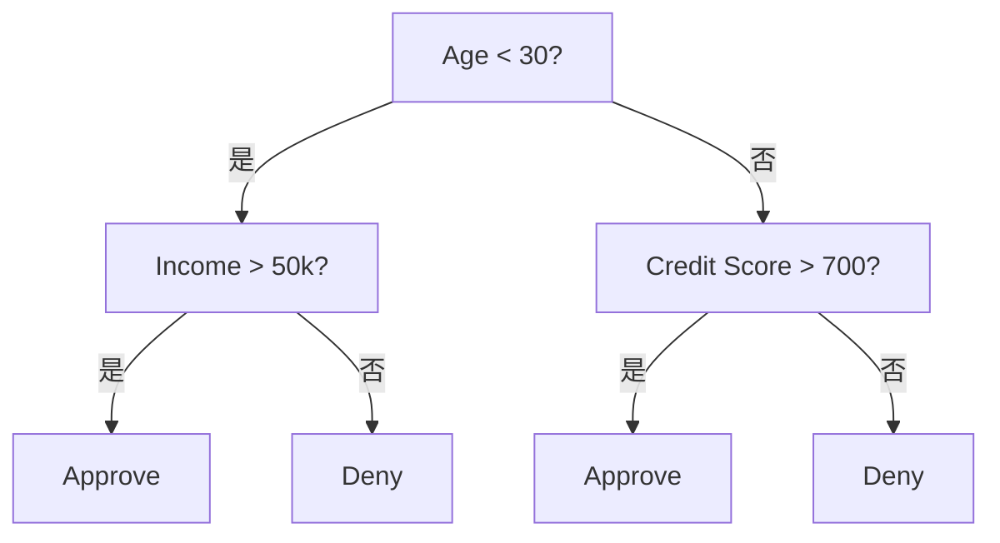
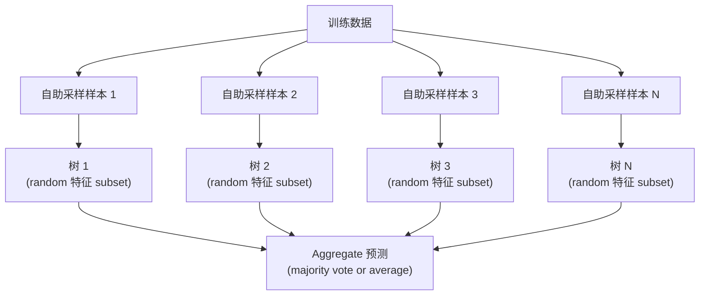

# 决策树与随机森林

> A 决策树 is just a flowchart. But a forest of them is one of the most powerful tools in ML.

**Type:** 构建
**Language:** Python
**Prerequisites:** Phase 1 (Lessons 09 Information Theory, 06 概率)
**Time:** ~90 分钟

## 学习目标

- 实现 基尼不纯度, 熵, and 信息增益 calculations to find optimal 决策树 划分
- 构建 a 决策树 classifier 从零实现 with pre-pruning controls (max depth, min 样本)
- Construct a 随机森林 using bootstrap sampling and 特征 randomization, and explain why it reduces 方差
- 比较 MDI 特征 importance with permutation importance and identify when MDI is biased

## 问题

You have tabular data. Rows are 样本, columns are 特征, and there is a 目标 column you want to predict. You could throw a neural network at it. But for tabular data, 树-based 模型 (决策树, 随机森林, gradient boosted 树) consistently outperform deep learning. Kaggle competitions on structured data are dominated by XGBoost and LightGBM, not transformers.

原因? 树 handle mixed 特征 types (numeric and categorical) without preprocessing. They handle nonlinear relationships without 特征工程. They are interpretable: you can look at the 树 and see exactly why a 预测 was made. And 随机森林, which average many 树, are highly resistant to 过拟合 on moderate-sized 数据集.

This lesson builds 决策树 从零实现 using recursive splitting, then builds a 随机森林 on top. You will implement the math behind 划分 criteria (基尼不纯度, 熵, 信息增益) and understand why an 集成 of weak learners becomes a strong one.

## 概念

### What a 决策树 does

A 决策树 partitions the 特征 space into rectangular regions by asking a sequence of yes/no questions.



Each internal 节点 tests a 特征 against a 阈值. Each 叶节点 节点 makes a 预测. To classify a new data point, you start at the root and follow the branches until you reach a 叶节点.

The 树 is built top-down by choosing, at each 节点, the 特征 and 阈值 that best separate the data. "Best" is defined by a 划分 criterion.

### 划分 criteria: measuring impurity

At each 节点, we have a set of 样本. We want to 划分 them so that the resulting child 节点 are as "pure" as possible, meaning each child contains mostly one class.

**基尼不纯度** measures the 概率 that a randomly chosen 样本 would be misclassified if it were labeled according to the class distribution at that 节点.

```
Gini(S) = 1 - sum(p_k^2)

where p_k is the proportion of class k in set S.
```

For a pure 节点 (all one class), Gini = 0. For a binary 划分 with 50/50 classes, Gini = 0.5. Lower is better.

```
Example: 6 cats, 4 dogs

Gini = 1 - (0.6^2 + 0.4^2) = 1 - (0.36 + 0.16) = 0.48
```

**熵** measures the information content (disorder) in a 节点. Covered in Phase 1 Lesson 09.

```
Entropy(S) = -sum(p_k * log2(p_k))
```

For a pure 节点, 熵 = 0. For a 50/50 binary 划分, 熵 = 1.0. Lower is better.

```
Example: 6 cats, 4 dogs

Entropy = -(0.6 * log2(0.6) + 0.4 * log2(0.4))
        = -(0.6 * -0.737 + 0.4 * -1.322)
        = 0.442 + 0.529
        = 0.971 bits
```

**信息增益** is the reduction in impurity (熵 or Gini) after a 划分.

```
IG(S, feature, threshold) = Impurity(S) - weighted_avg(Impurity(S_left), Impurity(S_right))

where the weights are the proportions of samples in each child.
```

The greedy algorithm at each 节点: try every 特征 and every possible 阈值. Pick the (特征, 阈值) pair that maximizes 信息增益.

### How splitting works

For a 数据集 with n 特征 and m 样本 at the current 节点:

1. For each 特征 j (j = 1 to n):
   - Sort the 样本 by 特征 j
   - Try every midpoint between consecutive distinct values as a 阈值
   - 计算 the 信息增益 for each 阈值
2. 选择 the 特征 and 阈值 with the highest 信息增益
3. 划分 the data into left (特征 <= 阈值) and right (特征 > 阈值)
4. Recurse on each child

This greedy approach does not guarantee the globally optimal 树. Finding the optimal 树 is NP-hard. But greedy splitting works well in practice.

### Stopping conditions

Without stopping conditions, the 树 grows until every 叶节点 is pure (one 样本 per 叶节点). This perfectly memorizes the 训练数据 and generalizes terribly.

**Pre-pruning** stops the 树 before it fully grows:
- Maximum depth: stop splitting when the 树 reaches a set depth
- Minimum 样本 per 叶节点: stop if a 节点 has fewer than k 样本
- Minimum 信息增益: stop if the best 划分 improves impurity by less than a 阈值
- Maximum 叶节点 节点: limit the total number of 叶节点

**Post-pruning** grows the full 树, then trims it back:
- Cost-complexity pruning (used by scikit-learn): adds a penalty proportional to the number of 叶节点. Increase the penalty to get smaller 树
- Reduced 误差 pruning: remove a subtree if the validation 误差 does not increase

Pre-pruning is simpler and faster. Post-pruning often produces better 树 because it does not prematurely stop 划分 that might lead to useful further 划分.

### 决策树 for 回归

For 回归, the 叶节点 预测 is the mean of the 目标 values in that 叶节点. The 划分 criterion changes too:

**方差 reduction** replaces 信息增益:

```
VR(S, feature, threshold) = Var(S) - weighted_avg(Var(S_left), Var(S_right))
```

Pick the 划分 that reduces 方差 the most. The 树 partitions the input space into regions, and predicts a constant (the mean) in each region.

### 随机森林: the power of ensembles

A single 决策树 is high 方差. Small changes in the data can produce completely different 树. 随机森林 fix this by averaging many 树.



Two sources of randomness make the 树 diverse:

**bagging (bootstrap aggregating):** Each 树 is trained on a 自助采样样本, a random 样本 with replacement from the 训练数据. About 63% of the original 样本 appear in each bootstrap (the rest are out-of-bag 样本 that can be used for validation).

**特征 randomization:** At each 划分, only a random subset of 特征 is considered. For 分类, the default is sqrt(n_features). For 回归, n_features/3. This prevents all 树 from splitting on the same dominant 特征.

The key insight: averaging many decorrelated 树 reduces 方差 without increasing 偏差. Each individual 树 may be mediocre. The 集成 is strong.

### 特征重要性

随机森林 naturally provide 特征 importance scores. The most common method:

**Mean Decrease in Impurity (MDI):** For each 特征, sum the total reduction in impurity across all 树 and all 节点 where that 特征 is used. 特征 that produce bigger impurity reductions at earlier 划分 are more important.

```
importance(feature_j) = sum over all nodes where feature_j is used:
    (n_samples_at_node / n_total_samples) * impurity_decrease
```

This is fast (computed during training) but biased toward high-cardinality 特征 and 特征 with many possible 划分 points.

**Permutation importance** is the alternative: shuffle one 特征's values and measure how much the 模型's 准确率 drops. More reliable but slower.

### When 树 beat neural networks

树 and forests dominate neural networks on tabular data. Several reasons:

| 因素 | 树 | Neural networks |
|--------|-------|----------------|
| Mixed types (numeric + categorical) | Native support | Need encoding |
| Small 数据集 (< 10k rows) | Work well | Overfit |
| 特征 interactions | Found by splitting | Need architecture design |
| Interpretability | Full transparency | Black box |
| Training time | Minutes | Hours |
| 超参数 sensitivity | Low | High |

Neural networks win when the data has spatial or sequential structure (images, text, audio). For flat tables of 特征, 树 are the default.

```figure
decision-tree-depth
```

## 动手构建

### Step 1: 基尼不纯度 and 熵

构建 both 划分 criteria 从零实现 and verify they agree on which 划分 are good.

```python
import math

def gini_impurity(labels):
    n = len(labels)
    if n == 0:
        return 0.0
    counts = {}
    for label in labels:
        counts[label] = counts.get(label, 0) + 1
    return 1.0 - sum((c / n) ** 2 for c in counts.values())

def entropy(labels):
    n = len(labels)
    if n == 0:
        return 0.0
    counts = {}
    for label in labels:
        counts[label] = counts.get(label, 0) + 1
    return -sum(
        (c / n) * math.log2(c / n) for c in counts.values() if c > 0
    )
```

### Step 2: Find the best 划分

Try every 特征 and every 阈值. Return the one with the highest 信息增益.

```python
def information_gain(parent_labels, left_labels, right_labels, criterion="gini"):
    measure = gini_impurity if criterion == "gini" else entropy
    n = len(parent_labels)
    n_left = len(left_labels)
    n_right = len(right_labels)
    if n_left == 0 or n_right == 0:
        return 0.0
    parent_impurity = measure(parent_labels)
    child_impurity = (
        (n_left / n) * measure(left_labels) +
        (n_right / n) * measure(right_labels)
    )
    return parent_impurity - child_impurity
```

### Step 3: 构建 the DecisionTree class

Recursive splitting, 预测, and 特征 importance tracking.

```python
class DecisionTree:
    def __init__(self, max_depth=None, min_samples_split=2,
                 min_samples_leaf=1, criterion="gini",
                 max_features=None):
        self.max_depth = max_depth
        self.min_samples_split = min_samples_split
        self.min_samples_leaf = min_samples_leaf
        self.criterion = criterion
        self.max_features = max_features
        self.tree = None
        self.feature_importances_ = None

    def fit(self, X, y):
        self.n_features = len(X[0])
        self.feature_importances_ = [0.0] * self.n_features
        self.n_samples = len(X)
        self.tree = self._build(X, y, depth=0)
        total = sum(self.feature_importances_)
        if total > 0:
            self.feature_importances_ = [
                fi / total for fi in self.feature_importances_
            ]

    def predict(self, X):
        return [self._predict_one(x, self.tree) for x in X]
```

### Step 4: 构建 the RandomForest class

Bootstrap sampling, 特征 randomization, and majority voting.

```python
class RandomForest:
    def __init__(self, n_trees=100, max_depth=None,
                 min_samples_split=2, max_features="sqrt",
                 criterion="gini"):
        self.n_trees = n_trees
        self.max_depth = max_depth
        self.min_samples_split = min_samples_split
        self.max_features = max_features
        self.criterion = criterion
        self.trees = []

    def fit(self, X, y):
        n = len(X)
        for _ in range(self.n_trees):
            indices = [random.randint(0, n - 1) for _ in range(n)]
            X_boot = [X[i] for i in indices]
            y_boot = [y[i] for i in indices]
            tree = DecisionTree(
                max_depth=self.max_depth,
                min_samples_split=self.min_samples_split,
                max_features=self.max_features,
                criterion=self.criterion,
            )
            tree.fit(X_boot, y_boot)
            self.trees.append(tree)

    def predict(self, X):
        all_preds = [tree.predict(X) for tree in self.trees]
        predictions = []
        for i in range(len(X)):
            votes = {}
            for preds in all_preds:
                v = preds[i]
                votes[v] = votes.get(v, 0) + 1
            predictions.append(max(votes, key=votes.get))
        return predictions
```

See `code/trees.py` for the complete implementation with all helper methods.

## 直接使用

With scikit-learn, training a 随机森林 is three lines:

```python
from sklearn.ensemble import RandomForestClassifier
from sklearn.datasets import load_iris
from sklearn.model_selection import train_test_split

X, y = load_iris(return_X_y=True)
X_train, X_test, y_train, y_test = train_test_split(X, y, random_state=42)

rf = RandomForestClassifier(n_estimators=100, random_state=42)
rf.fit(X_train, y_train)
print(f"Accuracy: {rf.score(X_test, y_test):.4f}")
print(f"Feature importances: {rf.feature_importances_}")
```

In practice, gradient boosted 树 (XGBoost, LightGBM, CatBoost) are often stronger than 随机森林 because they build 树 sequentially, with each 树 correcting the 误差 of the previous ones. But 随机森林 are harder to misconfigure and require almost no 超参数 tuning.

## 交付成果

This lesson produces `outputs/prompt-tree-interpreter.md` -- a prompt that interprets 决策树 划分 for business stakeholders. Feed it a trained 树's structure (depth, 特征, 划分 thresholds, 准确率) and it translates the 模型 into plain-language rules, ranks 特征 importance, flags 过拟合 or leakage, and recommends next steps. Use it any time you need to explain a 树-based 模型 to someone who does not read code.

## 练习

1. Train a single 决策树 on a 2D 数据集 with 3 classes. Manually trace the 划分 and draw the rectangular decision boundaries. 比较 the boundaries at max_depth=2 vs max_depth=10.

2. 实现 方差 reduction splitting for 回归 树. 生成 y = sin(x) + noise for 200 points and fit your 回归 树. Plot the 树's piecewise-constant 预测 against the true curve.

3. 构建 a 随机森林 with 1, 5, 10, 50, and 200 树. Plot training 准确率 and test 准确率 vs number of 树. Observe that test 准确率 plateaus but does not decrease (forests resist 过拟合).

4. 比较 基尼不纯度 vs 熵 as 划分 criteria on 5 different 数据集. Measure 准确率 and 树 depth. In most cases, they produce nearly identical results. 解释 why.

5. 实现 permutation importance. 比较 it with MDI importance on a 数据集 where one 特征 is random noise but has high cardinality. MDI will rank the noise 特征 highly. Permutation importance will not.

## 关键术语

| 术语 | 常见说法 | 实际含义 |
|------|----------------|----------------------|
| 决策树 | "A flowchart for 预测" | A 模型 that partitions 特征 space into rectangular regions by learning a sequence of if/else 划分 |
| 基尼不纯度 | "How mixed the 节点 is" | 概率 of misclassifying a random 样本 at a 节点. 0 = pure, 0.5 = maximum impurity for binary |
| 熵 | "The disorder in a 节点" | Information content at a 节点. 0 = pure, 1.0 = maximum uncertainty for binary. From information theory |
| 信息增益 | "How good a 划分 is" | Reduction in impurity after a 划分. The greedy criterion for choosing 划分 |
| Pre-pruning | "Stop the 树 early" | Stopping 树 growth early by setting max depth, min 样本, or min gain thresholds |
| Post-pruning | "Trim the 树 after" | Growing the full 树, then removing subtrees that do not improve validation performance |
| bagging | "Train on random subsets" | Bootstrap aggregating. Train each 模型 on a different random 样本 with replacement |
| 随机森林 | "A bunch of 树" | 集成 of 决策树, each trained on a 自助采样样本 with random 特征 subsets at each 划分 |
| 特征 importance (MDI) | "Which 特征 matter" | Total impurity decrease contributed by each 特征, summed across all 树 and 节点 |
| Permutation importance | "Shuffle and check" | 准确率 drop when a 特征's values are randomly shuffled. More reliable than MDI for noisy 特征 |
| 方差 reduction | "The 回归 version of info gain" | The 回归 树 analogue of 信息增益. Picks the 划分 that reduces 目标 方差 the most |
| 自助采样样本 | "Random 样本 with repeats" | A random 样本 drawn with replacement from the original 数据集. Same size, but with duplicates |

## 延伸阅读

- [Breiman: Random Forests (2001)](https://link.springer.com/article/10.1023/A:1010933404324) - the original 随机森林 paper
- [Grinsztajn et al.: Why do tree-based models still outperform deep learning on tabular data? (2022)](https://arxiv.org/abs/2207.08815) - rigorous comparison of 树 vs neural networks on tabular tasks
- [scikit-learn Decision Trees documentation](https://scikit-learn.org/stable/modules/tree.html) - practical guide with visualization tools
- [XGBoost: A Scalable Tree Boosting System (Chen & Guestrin, 2016)](https://arxiv.org/abs/1603.02754) - the gradient boosting paper that dominates Kaggle
