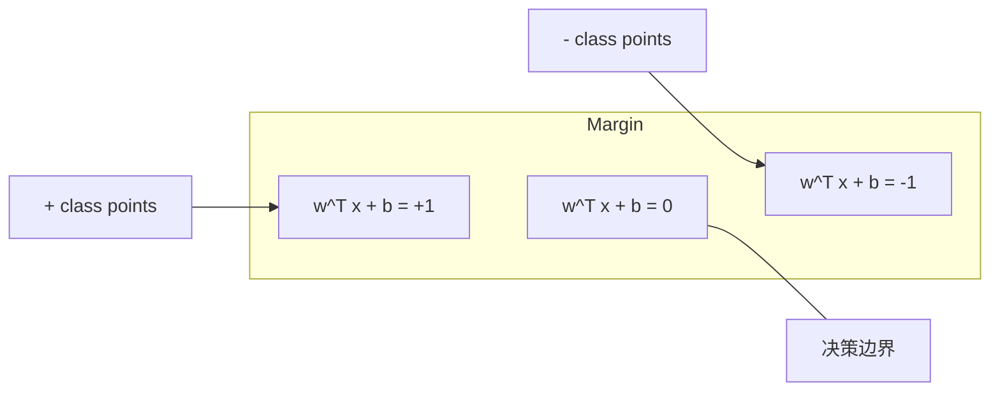
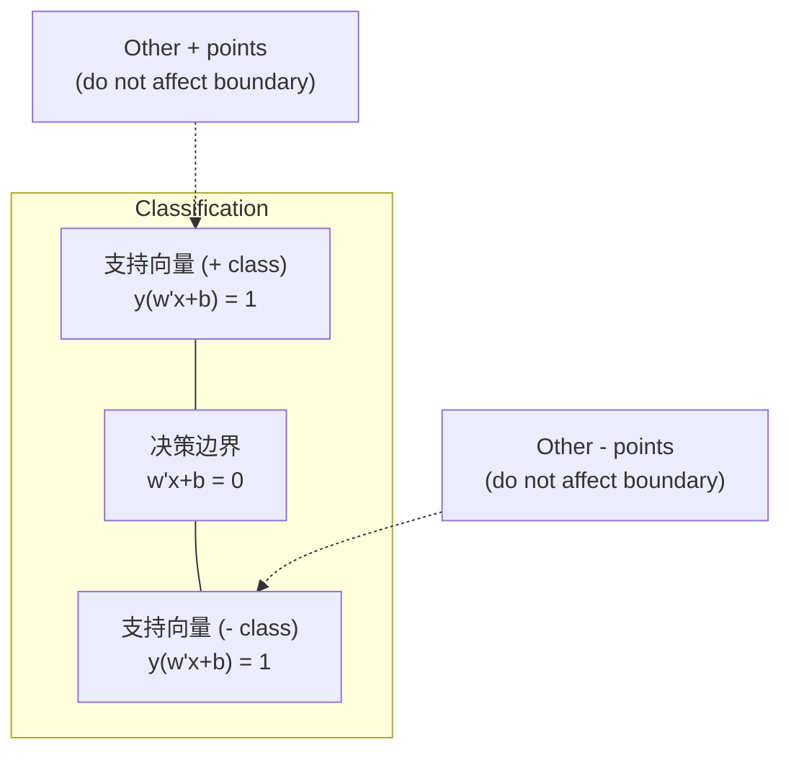
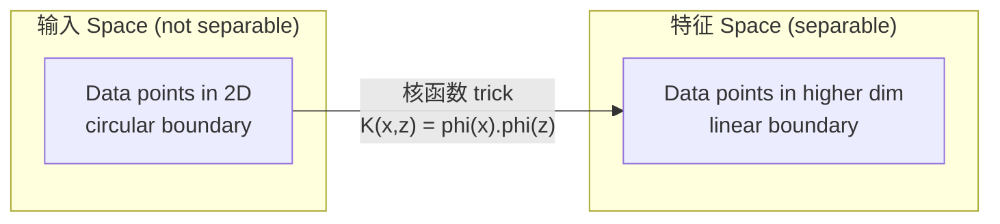

# 支持向量机

> Find the widest street between two classes. That is the entire idea.

**Type:** 构建
**Language:** Python
**Prerequisites:** Phase 1 (Lessons 08 Optimization, 14 Norms and 距离, 18 Convex Optimization)
**Time:** ~90 分钟

## 学习目标

- 实现 a linear SVM 从零实现 using 合页损失 and 梯度下降 on the primal formulation
- 解释 the maximum 间隔 principle and identify 支持向量 from a trained 模型
- 比较 linear, polynomial, and RBF kernels and explain how the 核函数 trick avoids explicit high-dimensional mapping
- 评估 the tradeoff controlled by the C 参数 between 间隔 width and 分类 误差

## 问题

You have two classes of data points and need to draw a line (or hyperplane) separating them. Infinitely many lines could work. Which one should you pick?

The one with the biggest 间隔. The 间隔 is the 距离 between the 决策边界 and the nearest data points on each side. A wider 间隔 means the classifier is more confident and generalizes better to unseen data.

This intuition leads to 支持向量机, one of the most mathematically elegant algorithms in ML. SVMs were the dominant 分类 method before deep learning and remain the best choice for small 数据集, high-dimensional data, and problems where you need a principled, well-understood 模型 with theoretical guarantees.

SVMs connect directly to Phase 1: the optimization is convex (Lesson 18), the 间隔 is measured with norms (Lesson 14), and the 核函数 trick exploits dot products to handle nonlinear boundaries without ever computing in the high-dimensional space.

## 概念

### The maximum 间隔 classifier

Given linearly separable data with 标签 y_i in {-1, +1} and 特征 vectors x_i, we want a hyperplane w^T x + b = 0 that separates the classes.

The 距离 from a point x_i to the hyperplane is:

```
distance = |w^T x_i + b| / ||w||
```

For a correctly classified point: y_i * (w^T x_i + b) > 0. The 间隔 is twice the 距离 from the hyperplane to the nearest point on either side.



The optimization problem:

```
maximize    2 / ||w||     (the margin width)
subject to  y_i * (w^T x_i + b) >= 1  for all i
```

Equivalently (minimizing ||w||^2 is easier to optimize):

```
minimize    (1/2) ||w||^2
subject to  y_i * (w^T x_i + b) >= 1  for all i
```

This is a convex quadratic program. It has a unique global solution. The data points that sit exactly on the 间隔 boundaries (where y_i * (w^T x_i + b) = 1) are the 支持向量. They are the only points that determine the 决策边界. Move or remove any non-support-vector point, and the boundary does not change.

### 支持向量: the critical few



Most training points are irrelevant. Only the 支持向量 matter. This is why SVMs are memory-efficient at 预测 time: you only need to store the 支持向量, not the entire 训练集.

The number of 支持向量 also gives a bound on 泛化 误差. Fewer 支持向量 relative to the 数据集 size means better 泛化.

### Soft 间隔: handling noise with the C 参数

Real data is rarely perfectly separable. Some points may be on the wrong side of the boundary, or inside the 间隔. The soft 间隔 formulation allows violations by introducing slack variables.

```
minimize    (1/2) ||w||^2 + C * sum(xi_i)
subject to  y_i * (w^T x_i + b) >= 1 - xi_i
            xi_i >= 0  for all i
```

The slack variable xi_i measures how much point i violates the 间隔. C controls the trade-off:

| C value | 行为 |
|---------|----------|
| Large C | Penalizes violations heavily. Narrow 间隔, fewer misclassifications. Overfits |
| Small C | Allows more violations. Wide 间隔, more misclassifications. Underfits |

C is the 正则化 strength, inverted. Large C = less 正则化. Small C = more 正则化.

### 合页损失: the SVM 损失函数

The soft 间隔 SVM can be rewritten as an unconstrained optimization:

```
minimize    (1/2) ||w||^2 + C * sum(max(0, 1 - y_i * (w^T x_i + b)))
```

The term max(0, 1 - y_i * f(x_i)) is the 合页损失. It is zero when the point is correctly classified and beyond the 间隔. It is linear when the point is inside the 间隔 or misclassified.

```
Hinge loss for a single point:

loss
  |
  | \
  |  \
  |   \
  |    \
  |     \_______________
  |
  +-----|-----|-------->  y * f(x)
       0     1

Zero loss when y*f(x) >= 1 (correctly classified, outside margin).
Linear penalty when y*f(x) < 1.
```

比较 with logistic loss (逻辑回归):

```
Hinge:     max(0, 1 - y*f(x))          Hard cutoff at margin
Logistic:  log(1 + exp(-y*f(x)))        Smooth, never exactly zero
```

合页损失 produces sparse solutions (only 支持向量 have nonzero contribution). Logistic loss uses all data points. This makes SVMs more memory-efficient at 预测 time.

### Training a linear SVM with 梯度下降

You can train a linear SVM using 梯度下降 on the 合页损失 plus L2 正则化, without solving the constrained QP:

```
L(w, b) = (lambda/2) * ||w||^2 + (1/n) * sum(max(0, 1 - y_i * (w^T x_i + b)))

Gradient with respect to w:
  If y_i * (w^T x_i + b) >= 1:  dL/dw = lambda * w
  If y_i * (w^T x_i + b) < 1:   dL/dw = lambda * w - y_i * x_i

Gradient with respect to b:
  If y_i * (w^T x_i + b) >= 1:  dL/db = 0
  If y_i * (w^T x_i + b) < 1:   dL/db = -y_i
```

This is called the primal formulation. It runs in O(n * d) per epoch, where n is the number of 样本 and d is the number of 特征. For large, sparse, high-dimensional data (text 分类), this is fast.

### The dual formulation and the 核函数 trick

The Lagrangian dual of the SVM problem (from Phase 1 Lesson 18, KKT conditions) is:

```
maximize    sum(alpha_i) - (1/2) * sum_ij(alpha_i * alpha_j * y_i * y_j * (x_i . x_j))
subject to  0 <= alpha_i <= C
            sum(alpha_i * y_i) = 0
```

The dual only involves dot products x_i . x_j between data points. This is the key insight. Replace every dot product with a 核函数 function K(x_i, x_j) and the SVM can learn nonlinear boundaries without ever computing the transformation explicitly.

```
Linear kernel:      K(x, z) = x . z
Polynomial kernel:  K(x, z) = (x . z + c)^d
RBF (Gaussian):     K(x, z) = exp(-gamma * ||x - z||^2)
```

The RBF 核函数 maps data into an infinite-dimensional space. Points that are close in input space have 核函数 value near 1. Points that are far apart have 核函数 value near 0. It can learn any smooth 决策边界.



The 核函数 trick computes the dot product in the high-dimensional space without ever going there. For the polynomial 核函数 of degree d in D dimensions, the explicit 特征 space has O(D^d) dimensions. But K(x, z) is computed in O(D) time.

### SVM for 回归 (SVR)

支持向量 回归 fits a tube of width epsilon around the data. Points inside the tube have zero loss. Points outside the tube are penalized linearly.

```
minimize    (1/2) ||w||^2 + C * sum(xi_i + xi_i*)
subject to  y_i - (w^T x_i + b) <= epsilon + xi_i
            (w^T x_i + b) - y_i <= epsilon + xi_i*
            xi_i, xi_i* >= 0
```

The epsilon 参数 controls the tube width. Wider tube = fewer 支持向量 = smoother fit. Narrower tube = more 支持向量 = tighter fit.

### 原因 SVMs lost to deep learning (and when they still win)

SVMs dominated ML from the late 1990s through the early 2010s. Deep learning surpassed them for several reasons:

| 因素 | SVMs | Deep learning |
|--------|------|---------------|
| 特征工程 | Requires it | Learns 特征 |
| Scalability | O(n^2) to O(n^3) for 核函数 | O(n) per epoch with SGD |
| Image/text/audio | Needs handcrafted 特征 | Learns from raw data |
| Large 数据集 (>100k) | Slow | Scales well |
| GPU acceleration | Limited benefit | Massive speedup |

SVMs still win in these situations:
- Small 数据集 (hundreds to low thousands of 样本)
- High-dimensional sparse data (text with TF-IDF 特征)
- When you need mathematical guarantees (间隔 bounds)
- When training time must be minimal (linear SVM is very fast)
- Binary 分类 with clear 间隔 structure
- 异常检测 (one-class SVM)

```figure
svm-margin
```

## 动手构建

### Step 1: 合页损失 and gradient

这是基础：为一个批次计算合页损失及其梯度。

```python
def hinge_loss(X, y, w, b):
    n = len(X)
    total_loss = 0.0
    for i in range(n):
        margin = y[i] * (dot(w, X[i]) + b)
        total_loss += max(0.0, 1.0 - margin)
    return total_loss / n
```

### Step 2: Linear SVM via 梯度下降

通过最小化带正则化的合页损失来训练，不需要 QP 求解器。

```python
class LinearSVM:
    def __init__(self, lr=0.001, lambda_param=0.01, n_epochs=1000):
        self.lr = lr
        self.lambda_param = lambda_param
        self.n_epochs = n_epochs
        self.w = None
        self.b = 0.0

    def fit(self, X, y):
        n_features = len(X[0])
        self.w = [0.0] * n_features
        self.b = 0.0

        for epoch in range(self.n_epochs):
            for i in range(len(X)):
                margin = y[i] * (dot(self.w, X[i]) + self.b)
                if margin >= 1:
                    self.w = [wj - self.lr * self.lambda_param * wj
                              for wj in self.w]
                else:
                    self.w = [wj - self.lr * (self.lambda_param * wj - y[i] * X[i][j])
                              for j, wj in enumerate(self.w)]
                    self.b -= self.lr * (-y[i])

    def predict(self, X):
        return [1 if dot(self.w, x) + self.b >= 0 else -1 for x in X]
```

### Step 3: 核函数 functions

实现线性核、多项式核和 RBF 核。

```python
def linear_kernel(x, z):
    return dot(x, z)

def polynomial_kernel(x, z, degree=3, c=1.0):
    return (dot(x, z) + c) ** degree

def rbf_kernel(x, z, gamma=0.5):
    diff = [xi - zi for xi, zi in zip(x, z)]
    return math.exp(-gamma * dot(diff, diff))
```

### Step 4: 间隔 and 支持向量 identification

After training, identify which points are 支持向量 and compute the 间隔 width.

```python
def find_support_vectors(X, y, w, b, tol=1e-3):
    support_vectors = []
    for i in range(len(X)):
        margin = y[i] * (dot(w, X[i]) + b)
        if abs(margin - 1.0) < tol:
            support_vectors.append(i)
    return support_vectors
```

See `code/svm.py` for the complete implementation with all demos.

## 直接使用

使用 scikit-learn：

```python
from sklearn.svm import SVC, LinearSVC, SVR
from sklearn.preprocessing import StandardScaler
from sklearn.pipeline import Pipeline

clf = Pipeline([
    ("scaler", StandardScaler()),
    ("svm", SVC(kernel="rbf", C=1.0, gamma="scale")),
])
clf.fit(X_train, y_train)
print(f"Accuracy: {clf.score(X_test, y_test):.4f}")
print(f"Support vectors: {clf['svm'].n_support_}")
```

Important: always scale your 特征 before training an SVM. SVMs are sensitive to 特征 magnitudes because the 间隔 depends on ||w||, and unscaled 特征 distort the geometry.

For large 数据集, use `LinearSVC` (primal formulation, O(n) per epoch) instead of `SVC` (dual formulation, O(n^2) to O(n^3)):

```python
from sklearn.svm import LinearSVC

clf = Pipeline([
    ("scaler", StandardScaler()),
    ("svm", LinearSVC(C=1.0, max_iter=10000)),
])
```

## 练习

1. 生成 a 2D linearly separable 数据集. Train your LinearSVM and identify the 支持向量. Verify that the 支持向量 are the points closest to the 决策边界.

2. Vary C from 0.001 to 1000 on a noisy 数据集. Plot the 决策边界 for each C value. Observe the transition from wide 间隔 (欠拟合) to narrow 间隔 (过拟合).

3. 创建 a 数据集 where class boundaries are circular (not linear). Show that a linear SVM fails. 计算 the RBF 核函数 matrix and show that the classes become separable in the 核函数-induced 特征 space.

4. 比较 合页损失 vs logistic loss on the same 数据集. Train a linear SVM and 逻辑回归. Count how many training points contribute to each 模型's 决策边界 (支持向量 vs all points).

5. 实现 SVR (epsilon-insensitive loss). Fit it to y = sin(x) + noise. Plot the epsilon tube around the 预测 and highlight the 支持向量 (points outside the tube).

## 关键术语

| 术语 | 实际含义 |
|------|----------------------|
| 支持向量 | The training points closest to the 决策边界. The only points that determine the hyperplane |
| 间隔 | The 距离 between the 决策边界 and the nearest 支持向量. SVMs maximize this |
| 合页损失 | max(0, 1 - y*f(x)). Zero when correctly classified and outside the 间隔. Linear penalty otherwise |
| C 参数 | Trade-off between 间隔 width and 分类 误差. Large C = narrow 间隔, small C = wide 间隔 |
| Soft 间隔 | SVM formulation that allows 间隔 violations via slack variables. Handles non-separable data |
| 核函数 trick | Computing dot products in a high-dimensional 特征 space without explicitly mapping to that space |
| Linear 核函数 | K(x, z) = x . z. Equivalent to standard dot product. For linearly separable data |
| RBF 核函数 | K(x, z) = exp(-gamma * \|\|x-z\|\|^2). Maps to infinite dimensions. Learns any smooth boundary |
| Polynomial 核函数 | K(x, z) = (x . z + c)^d. Maps to a 特征 space of polynomial combinations |
| Dual formulation | Reformulation of the SVM problem that depends only on dot products between data points. Enables kernels |
| SVR | 支持向量 回归. Fits an epsilon-tube around the data. Points inside the tube have zero loss |
| Slack variables | xi_i: measures how much a point violates the 间隔. Zero for correctly classified points outside 间隔 |
| Maximum 间隔 | The principle of choosing the hyperplane that maximizes the 距离 to the nearest points of each class |

## 延伸阅读

- [Vapnik: The Nature of Statistical Learning Theory (1995)](https://link.springer.com/book/10.1007/978-1-4757-3264-1) - the foundational text on SVMs and statistical learning
- [Cortes & Vapnik: Support-vector networks (1995)](https://link.springer.com/article/10.1007/BF00994018) - the original SVM paper
- [Platt: Sequential Minimal Optimization (1998)](https://www.microsoft.com/en-us/research/publication/sequential-minimal-optimization-a-fast-algorithm-for-training-support-vector-machines/) - the SMO algorithm that made SVM training practical
- [scikit-learn SVM documentation](https://scikit-learn.org/stable/modules/svm.html) - practical guide with implementation details
- [LIBSVM: A Library for Support Vector Machines](https://www.csie.ntu.edu.tw/~cjlin/libsvm/) - the C++ library behind most SVM implementations
