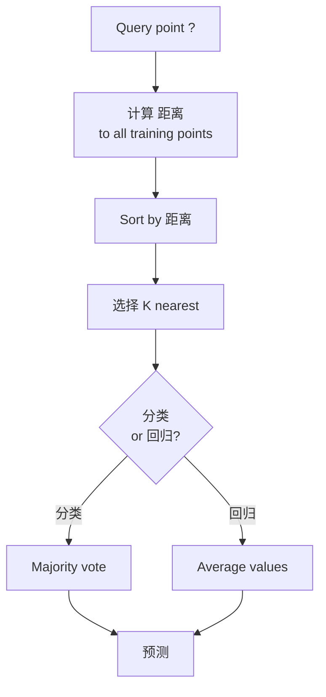
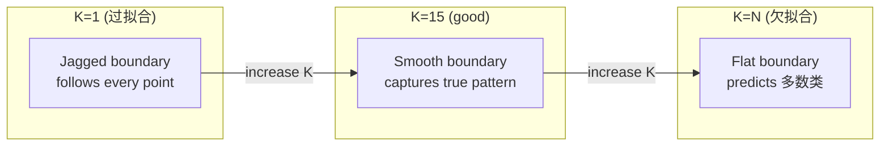
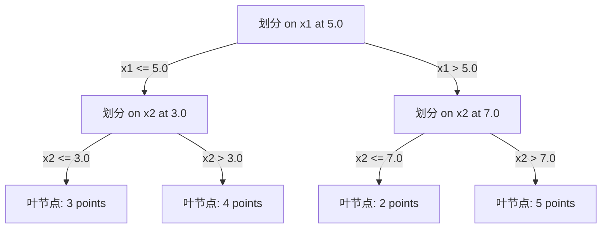

# K 近邻与距离

> Store everything. Predict by looking at your neighbors. The simplest algorithm that actually works.

**Type:** 构建
**Language:** Python
**Prerequisites:** Phase 1 (Lesson 14 Norms and 距离)
**Time:** ~90 分钟

## 学习目标

- 实现 KNN 分类 and 回归 从零实现 with configurable K and 距离-weighted voting
- 比较 L1, L2, 余弦, and Minkowski 距离 指标 and select the appropriate one for a given data type
- 解释 the curse of dimensionality and demonstrate why KNN degrades in high-dimensional spaces
- 构建 a KD-树 for efficient nearest neighbor search and analyze when it outperforms brute-force

## 问题

You have a 数据集. A new data point arrives. You need to classify it or predict its value. Instead of learning 参数 from the data (like 线性回归 or SVMs), you just find the K training points closest to the new point and let them vote.

This is K 近邻. There is no training phase. 否 参数 to learn. 否 损失函数 to minimize. You store the entire 训练集 and compute 距离 at 预测 time.

It sounds too simple to work. But KNN is surprisingly competitive for many problems, especially with small to medium 数据集, and understanding it deeply reveals fundamental concepts: the choice of 距离度量 (connecting to Phase 1 Lesson 14), the curse of dimensionality, and the difference between lazy and eager learning.

KNN also shows up everywhere in modern AI, just under different names. Vector databases do KNN search over embeddings. Retrieval-augmented generation (RAG) finds the K nearest document chunks. Recommendation systems find similar users or items. The algorithm is the same. The scale and the data structures are different.

## 概念

### How KNN works

Given a 数据集 of labeled points and a new query point:

1. 计算 the 距离 from the query to every point in the 数据集
2. Sort by 距离
3. Take the K closest points
4. For 分类: majority vote among the K neighbors
5. For 回归: average (or weighted average) of the K neighbors' values



That is the entire algorithm. 否 fitting. 否 梯度下降. 否 epochs.

### 选择 K

K is the single 超参数. It controls the 偏差-方差 trade-off:

| K | 行为 |
|---|----------|
| K = 1 | 决策边界 follows every point. Zero training 误差. High 方差. Overfits |
| Small K (3-5) | Sensitive to local structure. Can capture complex boundaries |
| Large K | Smoother boundaries. More robust to noise. May underfit |
| K = N | Predicts the 多数类 for every point. Maximum 偏差 |

A common starting point is K = sqrt(N) for a 数据集 of N points. Use odd K for binary 分类 to avoid ties.



### 距离度量

The 距离 function defines what "near" means. Different 指标 produce different neighbors, different 预测.

**L2 (欧氏)** is the default. Straight-line 距离.

```
d(a, b) = sqrt(sum((a_i - b_i)^2))
```

Sensitive to 特征 scale. Always standardize 特征 before using L2 with KNN.

**L1 (曼哈顿)** sums absolute differences. More robust to outliers than L2 because it does not square the differences.

```
d(a, b) = sum(|a_i - b_i|)
```

**余弦 距离** measures the angle between vectors, ignoring magnitude. Essential for text and embedding data.

```
d(a, b) = 1 - (a . b) / (||a|| * ||b||)
```

**Minkowski** generalizes L1 and L2 with 参数 p.

```
d(a, b) = (sum(|a_i - b_i|^p))^(1/p)

p=1: Manhattan
p=2: Euclidean
p->inf: Chebyshev (max absolute difference)
```

Which 指标 to use depends on the data:

| Data type | Best 指标 | 原因 |
|-----------|------------|-----|
| Numeric 特征, similar scale | L2 (欧氏) | Default, works for spatial data |
| Numeric 特征, outliers | L1 (曼哈顿) | Robust, does not amplify large differences |
| Text embeddings | 余弦 | Magnitude is noise, direction is meaning |
| High-dimensional sparse | 余弦 or L1 | L2 suffers from curse of dimensionality |
| Mixed types | Custom 距离 | Combine 指标 per 特征 type |

### Weighted KNN

Standard KNN gives equal 权重 to all K neighbors. But a neighbor at 距离 0.1 should matter more than one at 距离 5.0.

**距离-weighted KNN** 权重 each neighbor inversely by 距离:

```
weight_i = 1 / (distance_i + epsilon)

For classification: weighted vote
For regression:     weighted average = sum(w_i * y_i) / sum(w_i)
```

The epsilon prevents division by zero when a query point exactly matches a training point.

Weighted KNN is less sensitive to the choice of K because distant neighbors contribute very little regardless.

### The curse of dimensionality

KNN performance degrades in high dimensions. This is not a vague concern. It is a mathematical fact.

**Problem 1: 距离 converge.** As dimensionality increases, the ratio of the maximum 距离 to the minimum 距离 approaches 1. All points become equally "far" from the query.

```
In d dimensions, for random uniform points:

d=2:    max_dist / min_dist = varies widely
d=100:  max_dist / min_dist ~ 1.01
d=1000: max_dist / min_dist ~ 1.001

When all distances are nearly equal, "nearest" is meaningless.
```

**Problem 2: volume explodes.** To capture K neighbors within a fixed fraction of the data, you need to extend your search radius to cover a much larger fraction of the 特征 space. The "neighborhood" in high dimensions encompasses most of the space.

**Problem 3: corners dominate.** In a unit hypercube in d dimensions, most of the volume is concentrated near the corners, not the center. A sphere inscribed in the cube contains a vanishing fraction of the volume as d grows.

Practical consequence: KNN works well up to about 20-50 特征. Beyond that, you need dimensionality reduction (PCA, UMAP, t-SNE) before applying KNN, or you need to use 树-based search structures that exploit the data's intrinsic lower dimensionality.

### KD-树: fast nearest neighbor search

Brute-force KNN computes the 距离 from the query to every training point. That is O(n * d) per query. For large 数据集, this is too slow.

A KD-树 recursively partitions the space along 特征 axes. At each level, it 划分 along one dimension at the median value.



To find the nearest neighbor, traverse the 树 to the 叶节点 containing the query, then backtrack and check neighboring partitions only if they could contain closer points.

Average query time: O(log n) for low dimensions. But KD-树 degrade to O(n) in high dimensions (d > 20) because the backtracking eliminates fewer and fewer branches.

### Ball 树: better for moderate dimensions

Ball 树 partition data into nested hyperspheres instead of axis-aligned boxes. Each 节点 defines a ball (center + radius) that contains all points in that subtree.

Advantages over KD-树:
- Work better in moderate dimensions (up to ~50)
- Handle non-axis-aligned structure
- Tighter bounding volumes mean more branches are pruned during search

Both KD-树 and ball 树 are exact algorithms. For truly large-scale search (millions of points, hundreds of dimensions), approximate nearest neighbor methods (HNSW, IVF, product quantization) are used instead. These are covered in Phase 1 Lesson 14.

### Lazy learning vs eager learning

KNN is a lazy learner: it does no work at training time and all work at 预测 time. Most other algorithms (线性回归, SVMs, neural networks) are eager learners: they do heavy computation at training time to build a compact 模型, then 预测 are fast.

| 方面 | Lazy (KNN) | Eager (SVM, neural net) |
|--------|------------|------------------------|
| Training time | O(1) just store data | O(n * epochs) |
| 预测 time | O(n * d) per query | O(d) or O(参数) |
| Memory at 预测 | Store entire 训练集 | Store 模型 参数 only |
| Adapts to new data | Add points instantly | Retrain the 模型 |
| 决策边界 | Implicit, computed on the fly | Explicit, fixed after training |

Lazy learning is ideal when:
- The 数据集 changes frequently (add/remove points without retraining)
- You need 预测 for very few queries
- You want zero training time
- The 数据集 is small enough that brute-force search is fast

### KNN for 回归

Instead of majority voting, KNN for 回归 averages the 目标 values of the K neighbors.

```
prediction = (1/K) * sum(y_i for i in K nearest neighbors)

Or with distance weighting:
prediction = sum(w_i * y_i) / sum(w_i)
where w_i = 1 / distance_i
```

KNN 回归 produces piecewise-constant (or piecewise-smooth with weighting) 预测. It cannot extrapolate beyond the range of the 训练数据. If the training targets are all between 0 and 100, KNN will never predict 200.

```figure
knn-smoothness
```

## 动手构建

### Step 1: 距离 functions

实现 L1, L2, 余弦, and Minkowski 距离. These connect directly to Phase 1 Lesson 14.

```python
import math

def l2_distance(a, b):
    return math.sqrt(sum((ai - bi) ** 2 for ai, bi in zip(a, b)))

def l1_distance(a, b):
    return sum(abs(ai - bi) for ai, bi in zip(a, b))

def cosine_distance(a, b):
    dot_val = sum(ai * bi for ai, bi in zip(a, b))
    norm_a = math.sqrt(sum(ai ** 2 for ai in a))
    norm_b = math.sqrt(sum(bi ** 2 for bi in b))
    if norm_a == 0 or norm_b == 0:
        return 1.0
    return 1.0 - dot_val / (norm_a * norm_b)

def minkowski_distance(a, b, p=2):
    if p == float('inf'):
        return max(abs(ai - bi) for ai, bi in zip(a, b))
    return sum(abs(ai - bi) ** p for ai, bi in zip(a, b)) ** (1 / p)
```

### Step 2: KNN classifier and regressor

构建 the full KNN with configurable K, 距离度量, and optional 距离 weighting.

```python
class KNN:
    def __init__(self, k=5, distance_fn=l2_distance, weighted=False,
                 task="classification"):
        self.k = k
        self.distance_fn = distance_fn
        self.weighted = weighted
        self.task = task
        self.X_train = None
        self.y_train = None

    def fit(self, X, y):
        self.X_train = X
        self.y_train = y

    def predict(self, X):
        return [self._predict_one(x) for x in X]
```

### Step 3: KD-树 for efficient search

构建 a KD-树 从零实现 that recursively 划分 on the median of each dimension.

```python
class KDTree:
    def __init__(self, X, indices=None, depth=0):
        # Recursively partition the data
        self.axis = depth % len(X[0])
        # Split on median of the current axis
        ...

    def query(self, point, k=1):
        # Traverse to leaf, then backtrack
        ...
```

See `code/knn.py` for the complete implementation with all helper methods and demos.

### Step 4: 特征 scaling

KNN requires 特征 scaling because 距离 are sensitive to 特征 magnitudes. A 特征 ranging from 0 to 1000 will dominate a 特征 ranging from 0 to 1.

```python
def standardize(X):
    n = len(X)
    d = len(X[0])
    means = [sum(X[i][j] for i in range(n)) / n for j in range(d)]
    stds = [
        max(1e-10, (sum((X[i][j] - means[j]) ** 2 for i in range(n)) / n) ** 0.5)
        for j in range(d)
    ]
    return [[((X[i][j] - means[j]) / stds[j]) for j in range(d)] for i in range(n)], means, stds
```

## 直接使用

使用 scikit-learn：

```python
from sklearn.neighbors import KNeighborsClassifier
from sklearn.preprocessing import StandardScaler
from sklearn.pipeline import Pipeline

clf = Pipeline([
    ("scaler", StandardScaler()),
    ("knn", KNeighborsClassifier(n_neighbors=5, metric="euclidean")),
])
clf.fit(X_train, y_train)
print(f"Accuracy: {clf.score(X_test, y_test):.4f}")
```

Scikit-learn automatically uses KD-树 or ball 树 when the 数据集 is large enough and the dimensionality is low enough. For high-dimensional data, it falls back to brute force. You can control this with the `algorithm` 参数.

For large-scale nearest neighbor search (millions of vectors), use FAISS, Annoy, or a vector database:

```python
import faiss

index = faiss.IndexFlatL2(dimension)
index.add(embeddings)
distances, indices = index.search(query_vectors, k=5)
```

## 练习

1. 实现 KNN 分类 on a 2D 数据集 with 3 classes. Plot the 决策边界 for K=1, K=5, K=15, and K=N. Observe the transition from 过拟合 to 欠拟合.

2. 生成 1000 random points in 2, 5, 10, 50, 100, and 500 dimensions. For each dimensionality, compute the ratio of the maximum pairwise 距离 to the minimum pairwise 距离. Plot the ratio vs dimensionality to visualize the curse of dimensionality.

3. 比较 L1, L2, and 余弦 距离 for KNN on a text 分类 problem (use TF-IDF vectors). Which 指标 gives the best 准确率? 原因 does 余弦 tend to win for text?

4. 实现 a KD-树 and measure query time vs brute force for 数据集 of 1k, 10k, and 100k points in 2D, 10D, and 50D. At what dimensionality does the KD-树 stop being faster than brute force?

5. 构建 a weighted KNN regressor for y = sin(x) + noise. 比较 it with unweighted KNN for K=3, 10, 30. Show that weighting produces smoother 预测, especially for large K.

## 关键术语

| 术语 | 实际含义 |
|------|----------------------|
| K 近邻 | Non-parametric algorithm that predicts by finding the K closest training points to a query |
| Lazy learning | 否 computation at training time. All work happens at 预测 time. KNN is the canonical example |
| Eager learning | Heavy computation at training time to build a compact 模型. Most ML algorithms are eager |
| Curse of dimensionality | In high dimensions, 距离 converge and neighborhoods expand to cover most of the space, making KNN ineffective |
| KD-树 | Binary 树 that recursively partitions space along 特征 axes. O(log n) queries in low dimensions |
| Ball 树 | 树 of nested hyperspheres. Works better than KD-树 in moderate dimensions (up to ~50) |
| Weighted KNN | Neighbors weighted inversely by 距离. Closer neighbors have more influence on the 预测 |
| 特征 scaling | Normalizing 特征 to comparable ranges. Required for 距离-based methods like KNN |
| Majority vote | 分类 by counting which class is most common among K neighbors |
| Brute force search | Computing 距离 to every training point. O(n*d) per query. Exact but slow for large n |
| Approximate nearest neighbor | Algorithms (HNSW, LSH, IVF) that find approximately nearest points much faster than exact search |
| Voronoi diagram | The partition of space where each region contains all points closer to one training point than any other. K=1 KNN produces Voronoi boundaries |

## 延伸阅读

- [Cover & Hart: Nearest Neighbor Pattern Classification (1967)](https://ieeexplore.ieee.org/document/1053964) - the foundational KNN paper proving it has 误差 rate at most twice the Bayes optimal
- [Friedman, Bentley, Finkel: An Algorithm for Finding Best Matches in Logarithmic Expected Time (1977)](https://dl.acm.org/doi/10.1145/355744.355745) - the original KD-树 paper
- [Beyer et al.: When Is "Nearest Neighbor" Meaningful? (1999)](https://link.springer.com/chapter/10.1007/3-540-49257-7_15) - formal analysis of the curse of dimensionality for nearest neighbor
- [scikit-learn Nearest Neighbors documentation](https://scikit-learn.org/stable/modules/neighbors.html) - practical guide with algorithm selection
- [FAISS: A Library for Efficient Similarity Search](https://github.com/facebookresearch/faiss) - Meta's library for billion-scale approximate nearest neighbor search
