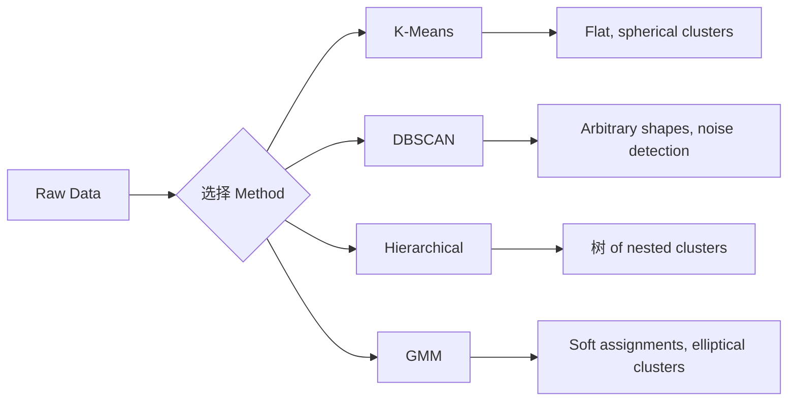

# 无监督学习

> 否 标签, no teacher. The algorithm finds structure on its own.

**Type:** 构建
**Languages:** Python
**Prerequisites:** Phase 1 (Norms & 距离, 概率 & Distributions), Phase 2 Lessons 1-6
**Time:** ~90 分钟

## 学习目标

- 实现 K-Means, DBSCAN, and Gaussian Mixture 模型 从零实现 and compare their 聚类 behavior
- 评估 cluster quality using the silhouette score and the elbow method to select the optimal K
- 解释 when DBSCAN outperforms K-Means and identify which algorithm handles non-spherical clusters and outliers
- 构建 an 异常检测 流水线 using 聚类 methods to flag points that deviate from normal patterns

## 问题

Every ML lesson so far has assumed labeled data: "here is an input, here is the correct output." In the real world, 标签 are expensive. A hospital has millions of patient records but no one has manually tagged each one with a disease category. An e-commerce site has millions of user sessions but no one has hand-labeled customer segments. A security team has network logs but nobody has flagged every anomaly.

无监督学习 finds patterns without being told what to look for. It groups similar data points, discovers hidden structures, and surfaces anomalies. If 监督学习 is learning from a textbook with an answer key, 无监督学习 is staring at raw data until the patterns reveal themselves.

The catch: without 标签, you cannot directly measure "right" or "wrong." You need different tools to evaluate whether the structure your algorithm found is meaningful.

## 概念

### 聚类: Grouping Similar Things Together

聚类 assigns each data point to a group (cluster) so that points within the same group are more similar to each other than to points in other groups. The question is always: what does "similar" mean?



### K-Means: The Workhorse

K-Means partitions data into exactly K clusters. Each cluster has a centroid (its center of mass), and every point belongs to the nearest centroid.

Lloyd's algorithm:

1. Pick K random points as initial centroids
2. Assign each data point to the nearest centroid
3. Recompute each centroid as the mean of its assigned points
4. Repeat steps 2-3 until assignments stop changing

The objective function (inertia) measures the total squared 距离 from each point to its assigned centroid. K-Means minimizes this, but only finds a local minimum. Different initializations can give different results.

### 选择 K

Two standard methods:

**Elbow method:** Run K-Means for K = 1, 2, 3, ..., n. Plot inertia vs K. Look for the "elbow" where adding more clusters stops reducing inertia significantly.

**Silhouette score:** For each point, measure how similar it is to its own cluster (a) versus the nearest other cluster (b). The silhouette coefficient is (b - a) / max(a, b), ranging from -1 (wrong cluster) to +1 (well-clustered). Average across all points for a global score.

### DBSCAN: Density-Based 聚类

K-Means assumes clusters are spherical and requires you to pick K upfront. DBSCAN makes neither assumption. It finds clusters as dense regions separated by sparse regions.

Two 参数:
- **eps**: the radius of a neighborhood
- **min_samples**: the minimum number of points needed to form a dense region

Three types of points:
- **Core point**: has at least min_samples points within eps 距离
- **Border point**: within eps of a core point but not itself a core point
- **Noise point**: neither core nor border. These are outliers.

DBSCAN connects core points that are within eps of each other into the same cluster. Border points join the cluster of a nearby core point. Noise points belong to no cluster.

Strengths: finds clusters of any shape, automatically determines the number of clusters, identifies outliers. Weakness: struggles with clusters of varying densities.

### Hierarchical 聚类

Builds a 树 (dendrogram) of nested clusters.

Agglomerative (bottom-up):
1. Start with each point as its own cluster
2. Merge the two closest clusters
3. Repeat until only one cluster remains
4. Cut the dendrogram at the desired level to get K clusters

The "closeness" between clusters can be measured as:
- **Single linkage**: minimum 距离 between any two points in the two clusters
- **Complete linkage**: maximum 距离 between any two points
- **Average linkage**: average 距离 between all pairs
- **Ward's method**: the merge that causes the smallest increase in total within-cluster 方差

### Gaussian Mixture 模型 (GMM)

K-Means gives hard assignments: each point belongs to exactly one cluster. GMM gives soft assignments: each point has a 概率 of belonging to each cluster.

GMM assumes the data is generated from a mixture of K Gaussian distributions, each with its own mean and covariance. The Expectation-Maximization (EM) algorithm alternates between:

- **E-step**: compute the 概率 that each point belongs to each Gaussian
- **M-step**: update the mean, covariance, and mixing 权重 of each Gaussian to maximize the likelihood of the data

GMM can 模型 elliptical clusters (not just spherical like K-Means) and naturally handles overlapping clusters.

### When to Use Which

| Method | Best for | Avoid when |
|--------|----------|------------|
| K-Means | Large 数据集, spherical clusters, known K | Irregular shapes, outliers present |
| DBSCAN | Unknown K, arbitrary shapes, outlier detection | Varying densities, very high dimensions |
| Hierarchical | Small 数据集, need dendrogram, unknown K | Large 数据集 (O(n^2) memory) |
| GMM | Overlapping clusters, soft assignments needed | Very large 数据集, too many dimensions |

### 异常检测 with 聚类

聚类 naturally supports 异常检测:
- **K-Means**: points far from any centroid are anomalies
- **DBSCAN**: noise points are anomalies by definition
- **GMM**: points with low 概率 under all Gaussians are anomalies

```figure
kmeans-step
```

## 动手构建

### Step 1: K-Means 从零实现

```python
import math
import random


def euclidean_distance(a, b):
    return math.sqrt(sum((ai - bi) ** 2 for ai, bi in zip(a, b)))


def kmeans(data, k, max_iterations=100, seed=42):
    random.seed(seed)
    n_features = len(data[0])

    centroids = random.sample(data, k)

    for iteration in range(max_iterations):
        clusters = [[] for _ in range(k)]
        assignments = []

        for point in data:
            distances = [euclidean_distance(point, c) for c in centroids]
            nearest = distances.index(min(distances))
            clusters[nearest].append(point)
            assignments.append(nearest)

        new_centroids = []
        for cluster in clusters:
            if len(cluster) == 0:
                new_centroids.append(random.choice(data))
                continue
            centroid = [
                sum(point[j] for point in cluster) / len(cluster)
                for j in range(n_features)
            ]
            new_centroids.append(centroid)

        if all(
            euclidean_distance(old, new) < 1e-6
            for old, new in zip(centroids, new_centroids)
        ):
            print(f"  Converged at iteration {iteration + 1}")
            break

        centroids = new_centroids

    return assignments, centroids
```

### Step 2: Elbow method and silhouette score

```python
def compute_inertia(data, assignments, centroids):
    total = 0.0
    for point, cluster_id in zip(data, assignments):
        total += euclidean_distance(point, centroids[cluster_id]) ** 2
    return total


def silhouette_score(data, assignments):
    n = len(data)
    if n < 2:
        return 0.0

    clusters = {}
    for i, c in enumerate(assignments):
        clusters.setdefault(c, []).append(i)

    if len(clusters) < 2:
        return 0.0

    scores = []
    for i in range(n):
        own_cluster = assignments[i]
        own_members = [j for j in clusters[own_cluster] if j != i]

        if len(own_members) == 0:
            scores.append(0.0)
            continue

        a = sum(euclidean_distance(data[i], data[j]) for j in own_members) / len(own_members)

        b = float("inf")
        for cluster_id, members in clusters.items():
            if cluster_id == own_cluster:
                continue
            avg_dist = sum(euclidean_distance(data[i], data[j]) for j in members) / len(members)
            b = min(b, avg_dist)

        if max(a, b) == 0:
            scores.append(0.0)
        else:
            scores.append((b - a) / max(a, b))

    return sum(scores) / len(scores)


def find_best_k(data, max_k=10):
    print("Elbow method:")
    inertias = []
    for k in range(1, max_k + 1):
        assignments, centroids = kmeans(data, k)
        inertia = compute_inertia(data, assignments, centroids)
        inertias.append(inertia)
        print(f"  K={k}: inertia={inertia:.2f}")

    print("\nSilhouette scores:")
    for k in range(2, max_k + 1):
        assignments, centroids = kmeans(data, k)
        score = silhouette_score(data, assignments)
        print(f"  K={k}: silhouette={score:.4f}")

    return inertias
```

### Step 3: DBSCAN 从零实现

```python
def dbscan(data, eps, min_samples):
    n = len(data)
    labels = [-1] * n
    cluster_id = 0

    def region_query(point_idx):
        neighbors = []
        for i in range(n):
            if euclidean_distance(data[point_idx], data[i]) <= eps:
                neighbors.append(i)
        return neighbors

    visited = [False] * n

    for i in range(n):
        if visited[i]:
            continue
        visited[i] = True

        neighbors = region_query(i)

        if len(neighbors) < min_samples:
            labels[i] = -1
            continue

        labels[i] = cluster_id
        seed_set = list(neighbors)
        seed_set.remove(i)

        j = 0
        while j < len(seed_set):
            q = seed_set[j]

            if not visited[q]:
                visited[q] = True
                q_neighbors = region_query(q)
                if len(q_neighbors) >= min_samples:
                    for nb in q_neighbors:
                        if nb not in seed_set:
                            seed_set.append(nb)

            if labels[q] == -1:
                labels[q] = cluster_id

            j += 1

        cluster_id += 1

    return labels
```

### Step 4: Gaussian Mixture 模型 (EM algorithm)

```python
def gmm(data, k, max_iterations=100, seed=42):
    random.seed(seed)
    n = len(data)
    d = len(data[0])

    indices = random.sample(range(n), k)
    means = [list(data[i]) for i in indices]
    variances = [1.0] * k
    weights = [1.0 / k] * k

    def gaussian_pdf(x, mean, variance):
        d = len(x)
        coeff = 1.0 / ((2 * math.pi * variance) ** (d / 2))
        exponent = -sum((xi - mi) ** 2 for xi, mi in zip(x, mean)) / (2 * variance)
        return coeff * math.exp(max(exponent, -500))

    for iteration in range(max_iterations):
        responsibilities = []
        for i in range(n):
            probs = []
            for j in range(k):
                probs.append(weights[j] * gaussian_pdf(data[i], means[j], variances[j]))
            total = sum(probs)
            if total == 0:
                total = 1e-300
            responsibilities.append([p / total for p in probs])

        old_means = [list(m) for m in means]

        for j in range(k):
            r_sum = sum(responsibilities[i][j] for i in range(n))
            if r_sum < 1e-10:
                continue

            weights[j] = r_sum / n

            for dim in range(d):
                means[j][dim] = sum(
                    responsibilities[i][j] * data[i][dim] for i in range(n)
                ) / r_sum

            variances[j] = sum(
                responsibilities[i][j]
                * sum((data[i][dim] - means[j][dim]) ** 2 for dim in range(d))
                for i in range(n)
            ) / (r_sum * d)
            variances[j] = max(variances[j], 1e-6)

        shift = sum(
            euclidean_distance(old_means[j], means[j]) for j in range(k)
        )
        if shift < 1e-6:
            print(f"  GMM converged at iteration {iteration + 1}")
            break

    assignments = []
    for i in range(n):
        assignments.append(responsibilities[i].index(max(responsibilities[i])))

    return assignments, means, weights, responsibilities
```

### Step 5: 生成 测试数据 and run everything

```python
def make_blobs(centers, n_per_cluster=50, spread=0.5, seed=42):
    random.seed(seed)
    data = []
    true_labels = []
    for label, (cx, cy) in enumerate(centers):
        for _ in range(n_per_cluster):
            x = cx + random.gauss(0, spread)
            y = cy + random.gauss(0, spread)
            data.append([x, y])
            true_labels.append(label)
    return data, true_labels


def make_moons(n_samples=200, noise=0.1, seed=42):
    random.seed(seed)
    data = []
    labels = []
    n_half = n_samples // 2
    for i in range(n_half):
        angle = math.pi * i / n_half
        x = math.cos(angle) + random.gauss(0, noise)
        y = math.sin(angle) + random.gauss(0, noise)
        data.append([x, y])
        labels.append(0)
    for i in range(n_half):
        angle = math.pi * i / n_half
        x = 1 - math.cos(angle) + random.gauss(0, noise)
        y = 1 - math.sin(angle) - 0.5 + random.gauss(0, noise)
        data.append([x, y])
        labels.append(1)
    return data, labels


if __name__ == "__main__":
    centers = [[2, 2], [8, 3], [5, 8]]
    data, true_labels = make_blobs(centers, n_per_cluster=50, spread=0.8)

    print("=== K-Means on 3 blobs ===")
    assignments, centroids = kmeans(data, k=3)
    print(f"  Centroids: {[[round(c, 2) for c in cent] for cent in centroids]}")
    sil = silhouette_score(data, assignments)
    print(f"  Silhouette score: {sil:.4f}")

    print("\n=== Elbow Method ===")
    find_best_k(data, max_k=6)

    print("\n=== DBSCAN on 3 blobs ===")
    db_labels = dbscan(data, eps=1.5, min_samples=5)
    n_clusters = len(set(db_labels) - {-1})
    n_noise = db_labels.count(-1)
    print(f"  Found {n_clusters} clusters, {n_noise} noise points")

    print("\n=== GMM on 3 blobs ===")
    gmm_assignments, gmm_means, gmm_weights, _ = gmm(data, k=3)
    print(f"  Means: {[[round(m, 2) for m in mean] for mean in gmm_means]}")
    print(f"  Weights: {[round(w, 3) for w in gmm_weights]}")
    gmm_sil = silhouette_score(data, gmm_assignments)
    print(f"  Silhouette score: {gmm_sil:.4f}")

    print("\n=== DBSCAN on moons (non-spherical clusters) ===")
    moon_data, moon_labels = make_moons(n_samples=200, noise=0.1)
    moon_db = dbscan(moon_data, eps=0.3, min_samples=5)
    n_moon_clusters = len(set(moon_db) - {-1})
    n_moon_noise = moon_db.count(-1)
    print(f"  Found {n_moon_clusters} clusters, {n_moon_noise} noise points")

    print("\n=== K-Means on moons (will fail to separate) ===")
    moon_km, moon_centroids = kmeans(moon_data, k=2)
    moon_sil = silhouette_score(moon_data, moon_km)
    print(f"  Silhouette score: {moon_sil:.4f}")
    print("  K-Means splits moons poorly because they are not spherical")

    print("\n=== Anomaly detection with DBSCAN ===")
    anomaly_data = list(data)
    anomaly_data.append([20.0, 20.0])
    anomaly_data.append([-5.0, -5.0])
    anomaly_data.append([15.0, 0.0])
    anomaly_labels = dbscan(anomaly_data, eps=1.5, min_samples=5)
    anomalies = [
        anomaly_data[i]
        for i in range(len(anomaly_labels))
        if anomaly_labels[i] == -1
    ]
    print(f"  Detected {len(anomalies)} anomalies")
    for a in anomalies[-3:]:
        print(f"    Point {[round(v, 2) for v in a]}")
```

## 直接使用

With scikit-learn, the same algorithms are one-liners:

```python
from sklearn.cluster import KMeans, DBSCAN, AgglomerativeClustering
from sklearn.mixture import GaussianMixture
from sklearn.metrics import silhouette_score as sklearn_silhouette

km = KMeans(n_clusters=3, random_state=42).fit(data)
db = DBSCAN(eps=1.5, min_samples=5).fit(data)
agg = AgglomerativeClustering(n_clusters=3).fit(data)
gmm_model = GaussianMixture(n_components=3, random_state=42).fit(data)
```

The from-scratch versions show you exactly what these libraries compute. K-Means iterates between assigning and recomputing. DBSCAN grows clusters from dense seeds. GMM alternates between expectation and maximization. The library versions add numerical stability, smarter initialization (K-Means++), and GPU acceleration, but the core logic is the same.

## 交付成果

This lesson produces working implementations of K-Means, DBSCAN, and GMM 从零实现. The 聚类 code can be reused as a foundation for more advanced unsupervised methods.

## 练习

1. 实现 K-Means++ initialization: instead of picking random centroids, pick the first randomly and each subsequent centroid with 概率 proportional to its squared 距离 from the nearest existing centroid. 比较 convergence speed to random initialization.
2. Add hierarchical agglomerative 聚类 to the code. 实现 Ward's linkage and produce a dendrogram (as a nested list of merges). Cut it at different levels and compare to K-Means results.
3. 构建 a simple 异常检测 流水线: run DBSCAN and GMM on the same data, flag points that both methods agree are outliers (noise in DBSCAN, low 概率 in GMM). Measure the overlap and discuss when the methods disagree.

## 关键术语

| 术语 | 常见说法 | 实际含义 |
|------|----------------|----------------------|
| 聚类 | "Grouping similar things" | Partitioning data into subsets where within-group similarity exceeds between-group similarity, measured by a specific 距离度量 |
| Centroid | "The center of a cluster" | The mean of all points assigned to a cluster; used by K-Means as the cluster representative |
| Inertia | "How tight the clusters are" | Sum of squared 距离 from each point to its assigned centroid; lower is tighter |
| Silhouette score | "How well-separated clusters are" | For each point, (b - a) / max(a, b) where a is mean intra-cluster 距离 and b is mean nearest-cluster 距离 |
| Core point | "A point in a dense region" | A point with at least min_samples neighbors within eps 距离, in DBSCAN |
| EM algorithm | "Soft K-Means" | Expectation-Maximization: iteratively compute membership 概率 (E-step) and update distribution 参数 (M-step) |
| Dendrogram | "A 树 of clusters" | A 树 diagram showing the order and 距离 at which clusters were merged in hierarchical 聚类 |
| Anomaly | "An outlier" | A data point that does not conform to the expected pattern, identified as noise by DBSCAN or low-概率 by GMM |

## 延伸阅读

- [Stanford CS229 - Unsupervised Learning](https://cs229.stanford.edu/notes2022fall/main_notes.pdf) - Andrew Ng's lecture notes on 聚类 and EM
- [scikit-learn Clustering Guide](https://scikit-learn.org/stable/modules/clustering.html) - practical comparison of all 聚类 algorithms with visual examples
- [DBSCAN original paper (Ester et al., 1996)](https://www.aaai.org/Papers/KDD/1996/KDD96-037.pdf) - the paper that introduced density-based 聚类
