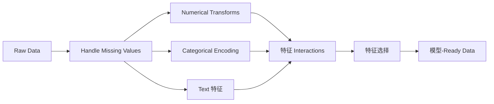

# 特征工程 & Selection

> A good 特征 is worth a thousand data points.

**Type:** 构建
**Languages:** Python
**Prerequisites:** Phase 1 (Statistics for ML, Linear Algebra), Phase 2 Lessons 1-7
**Time:** ~90 分钟

## 学习目标

- 实现 numerical transforms (standardization, min-max scaling, log transform, binning) and explain when each is appropriate
- 构建 one-hot, 标签, and 目标 encoding for categorical 特征 and identify the data leakage risk in 目标 encoding
- Construct a TF-IDF vectorizer 从零实现 and explain why it outperforms raw word counts for text 分类
- Apply filter-based 特征选择 (方差 阈值, correlation, mutual information) to reduce dimensionality

## 问题

You have a 数据集. You pick an algorithm. You train it. The results are mediocre. You try a fancier algorithm. Still mediocre. You spend a week tuning 超参数. Marginal improvement.

Then someone transforms the raw data into better 特征 and a simple 逻辑回归 beats your tuned gradient-boosted 集成.

This happens constantly. In classical ML, the representation of the data matters more than the choice of algorithm. A house price 模型 with "square footage" and "number of bedrooms" will beat a 模型 with "address as a raw string" no matter how sophisticated the learner is. The algorithm can only work with what you give it.

特征工程 is the process of transforming raw data into representations that make patterns easier for 模型 to find. 特征选择 is the process of throwing away 特征 that add noise without adding signal. Together, they are the highest-leverage activity in classical ML.

## 概念

### The 特征 流水线



### Numerical 特征

Raw numbers are rarely 模型-ready. Common transforms:

**Scaling:** Put 特征 on the same range so 距离-based algorithms (K-Means, KNN, SVM) treat all 特征 equally. Min-max scaling maps to [0, 1]. Standardization (z-score) maps to mean=0, std=1.

**Log transform:** Compresses right-skewed distributions (income, population, word counts). Turns multiplicative relationships into additive ones.

**Binning:** Converts continuous values into categories. Useful when the relationship between 特征 and 目标 is non-linear but step-wise (e.g., age groups).

**Polynomial 特征:** Creates x^2, x^3, x1*x2 terms. Lets linear 模型 capture non-linear relationships at the cost of more 特征.

### Categorical 特征

模型 need numbers. Categories need encoding.

**One-hot encoding:** Creates a binary column for each category. "color = red/blue/green" becomes three columns: is_red, is_blue, is_green. Works well for low-cardinality 特征 but explodes with many categories.

**标签 encoding:** Maps each category to an integer: red=0, blue=1, green=2. Introduces false ordering (the 模型 might think green > blue > red). Only appropriate for 树-based 模型 that 划分 on individual values.

**目标 encoding:** Replaces each category with the mean of the 目标 variable for that category. Powerful but dangerous: high risk of data leakage. Must be computed only on 训练数据 and applied to 测试数据.

### Text 特征

**Count vectorizer:** Counts how many times each word appears in a document. "the cat sat on the mat" becomes {the: 2, cat: 1, sat: 1, on: 1, mat: 1}.

**TF-IDF:** 术语 Frequency-Inverse Document Frequency. Weighs words by how unique they are across documents. Common words like "the" get low 权重. Rare, distinctive words get high 权重.

```
TF(word, doc) = count(word in doc) / total words in doc
IDF(word) = log(total docs / docs containing word)
TF-IDF = TF * IDF
```

### Missing Values

Real data has holes. Strategies:

- **Drop rows:** Only when missing data is rare and random
- **Mean/median imputation:** Simple, preserves distribution shape (median is more robust to outliers)
- **Mode imputation:** For categorical 特征
- **Indicator column:** Add a binary column "was_this_missing" before imputing. The fact that data is missing can itself be informative
- **Forward/backward fill:** For 时间序列 data

### 特征 Interaction

Sometimes the relationship is in the combination. "Height" and "权重" alone are less predictive than "BMI = 权重 / height^2". 特征 interactions multiply the 特征 space, so use domain knowledge to pick the right ones.

### 特征选择

More 特征 is not always better. Irrelevant 特征 add noise, increase training time, and can cause 过拟合.

**Filter methods (pre-模型):**
- Correlation: remove 特征 highly correlated with each other (redundant)
- Mutual information: measures how much knowing a 特征 reduces uncertainty about the 目标
- 方差 阈值: remove 特征 that barely vary

**Wrapper methods (模型-based):**
- L1 正则化 (Lasso): drives irrelevant 特征 权重 to exactly zero
- Recursive 特征 elimination: train, remove least important 特征, repeat

**原因 selection matters:** A 模型 with 10 good 特征 will usually outperform a 模型 with 10 good 特征 and 90 noisy ones. The noisy 特征 give the 模型 opportunities to overfit on 训练数据 patterns that do not generalize.

```figure
feature-scaling
```

## 动手构建

### Step 1: Numerical transforms 从零实现

```python
import math


def min_max_scale(values):
    min_val = min(values)
    max_val = max(values)
    if max_val == min_val:
        return [0.0] * len(values)
    return [(v - min_val) / (max_val - min_val) for v in values]


def standardize(values):
    n = len(values)
    mean = sum(values) / n
    variance = sum((v - mean) ** 2 for v in values) / n
    std = math.sqrt(variance) if variance > 0 else 1.0
    return [(v - mean) / std for v in values]


def log_transform(values):
    return [math.log(v + 1) for v in values]


def bin_values(values, n_bins=5):
    min_val = min(values)
    max_val = max(values)
    bin_width = (max_val - min_val) / n_bins
    if bin_width == 0:
        return [0] * len(values)
    result = []
    for v in values:
        bin_idx = int((v - min_val) / bin_width)
        bin_idx = min(bin_idx, n_bins - 1)
        result.append(bin_idx)
    return result


def polynomial_features(row, degree=2):
    n = len(row)
    result = list(row)
    if degree >= 2:
        for i in range(n):
            result.append(row[i] ** 2)
        for i in range(n):
            for j in range(i + 1, n):
                result.append(row[i] * row[j])
    return result
```

### Step 2: Categorical encoding 从零实现

```python
def one_hot_encode(values):
    categories = sorted(set(values))
    cat_to_idx = {cat: i for i, cat in enumerate(categories)}
    n_cats = len(categories)

    encoded = []
    for v in values:
        row = [0] * n_cats
        row[cat_to_idx[v]] = 1
        encoded.append(row)

    return encoded, categories


def label_encode(values):
    categories = sorted(set(values))
    cat_to_int = {cat: i for i, cat in enumerate(categories)}
    return [cat_to_int[v] for v in values], cat_to_int


def target_encode(feature_values, target_values, smoothing=10):
    global_mean = sum(target_values) / len(target_values)

    category_stats = {}
    for feat, target in zip(feature_values, target_values):
        if feat not in category_stats:
            category_stats[feat] = {"sum": 0.0, "count": 0}
        category_stats[feat]["sum"] += target
        category_stats[feat]["count"] += 1

    encoding = {}
    for cat, stats in category_stats.items():
        cat_mean = stats["sum"] / stats["count"]
        weight = stats["count"] / (stats["count"] + smoothing)
        encoding[cat] = weight * cat_mean + (1 - weight) * global_mean

    return [encoding[v] for v in feature_values], encoding
```

### Step 3: Text 特征 从零实现

```python
def count_vectorize(documents):
    vocab = {}
    idx = 0
    for doc in documents:
        for word in doc.lower().split():
            if word not in vocab:
                vocab[word] = idx
                idx += 1

    vectors = []
    for doc in documents:
        vec = [0] * len(vocab)
        for word in doc.lower().split():
            vec[vocab[word]] += 1
        vectors.append(vec)

    return vectors, vocab


def tfidf(documents):
    n_docs = len(documents)

    vocab = {}
    idx = 0
    for doc in documents:
        for word in doc.lower().split():
            if word not in vocab:
                vocab[word] = idx
                idx += 1

    doc_freq = {}
    for doc in documents:
        seen = set()
        for word in doc.lower().split():
            if word not in seen:
                doc_freq[word] = doc_freq.get(word, 0) + 1
                seen.add(word)

    vectors = []
    for doc in documents:
        words = doc.lower().split()
        word_count = len(words)
        tf_map = {}
        for word in words:
            tf_map[word] = tf_map.get(word, 0) + 1

        vec = [0.0] * len(vocab)
        for word, count in tf_map.items():
            tf = count / word_count
            idf = math.log(n_docs / doc_freq[word])
            vec[vocab[word]] = tf * idf
        vectors.append(vec)

    return vectors, vocab
```

### Step 4: Missing value imputation 从零实现

```python
def impute_mean(values):
    present = [v for v in values if v is not None]
    if not present:
        return [0.0] * len(values), 0.0
    mean = sum(present) / len(present)
    return [v if v is not None else mean for v in values], mean


def impute_median(values):
    present = sorted(v for v in values if v is not None)
    if not present:
        return [0.0] * len(values), 0.0
    n = len(present)
    if n % 2 == 0:
        median = (present[n // 2 - 1] + present[n // 2]) / 2
    else:
        median = present[n // 2]
    return [v if v is not None else median for v in values], median


def impute_mode(values):
    present = [v for v in values if v is not None]
    if not present:
        return values, None
    counts = {}
    for v in present:
        counts[v] = counts.get(v, 0) + 1
    mode = max(counts, key=counts.get)
    return [v if v is not None else mode for v in values], mode


def add_missing_indicator(values):
    return [0 if v is not None else 1 for v in values]
```

### Step 5: 特征选择 从零实现

```python
def correlation(x, y):
    n = len(x)
    mean_x = sum(x) / n
    mean_y = sum(y) / n
    cov = sum((xi - mean_x) * (yi - mean_y) for xi, yi in zip(x, y)) / n
    std_x = math.sqrt(sum((xi - mean_x) ** 2 for xi in x) / n)
    std_y = math.sqrt(sum((yi - mean_y) ** 2 for yi in y) / n)
    if std_x == 0 or std_y == 0:
        return 0.0
    return cov / (std_x * std_y)


def mutual_information(feature, target, n_bins=10):
    feat_min = min(feature)
    feat_max = max(feature)
    bin_width = (feat_max - feat_min) / n_bins if feat_max != feat_min else 1.0
    feat_binned = [
        min(int((f - feat_min) / bin_width), n_bins - 1) for f in feature
    ]

    n = len(feature)
    target_classes = sorted(set(target))

    feat_bins = sorted(set(feat_binned))
    p_feat = {}
    for b in feat_bins:
        p_feat[b] = feat_binned.count(b) / n

    p_target = {}
    for t in target_classes:
        p_target[t] = target.count(t) / n

    mi = 0.0
    for b in feat_bins:
        for t in target_classes:
            joint_count = sum(
                1 for fb, tv in zip(feat_binned, target) if fb == b and tv == t
            )
            p_joint = joint_count / n
            if p_joint > 0:
                mi += p_joint * math.log(p_joint / (p_feat[b] * p_target[t]))

    return mi


def variance_threshold(features, threshold=0.01):
    n_features = len(features[0])
    n_samples = len(features)
    selected = []

    for j in range(n_features):
        col = [features[i][j] for i in range(n_samples)]
        mean = sum(col) / n_samples
        var = sum((v - mean) ** 2 for v in col) / n_samples
        if var >= threshold:
            selected.append(j)

    return selected


def remove_correlated(features, threshold=0.9):
    n_features = len(features[0])
    n_samples = len(features)

    to_remove = set()
    for i in range(n_features):
        if i in to_remove:
            continue
        col_i = [features[r][i] for r in range(n_samples)]
        for j in range(i + 1, n_features):
            if j in to_remove:
                continue
            col_j = [features[r][j] for r in range(n_samples)]
            corr = abs(correlation(col_i, col_j))
            if corr >= threshold:
                to_remove.add(j)

    return [i for i in range(n_features) if i not in to_remove]
```

### Step 6: Full 流水线 and demo

```python
import random


def make_housing_data(n=200, seed=42):
    random.seed(seed)
    data = []
    for _ in range(n):
        sqft = random.uniform(500, 5000)
        bedrooms = random.choice([1, 2, 3, 4, 5])
        age = random.uniform(0, 50)
        neighborhood = random.choice(["downtown", "suburbs", "rural"])
        has_pool = random.choice([True, False])

        sqft_with_missing = sqft if random.random() > 0.05 else None
        age_with_missing = age if random.random() > 0.08 else None

        price = (
            50 * sqft
            + 20000 * bedrooms
            - 1000 * age
            + (50000 if neighborhood == "downtown" else 10000 if neighborhood == "suburbs" else 0)
            + (15000 if has_pool else 0)
            + random.gauss(0, 20000)
        )

        data.append({
            "sqft": sqft_with_missing,
            "bedrooms": bedrooms,
            "age": age_with_missing,
            "neighborhood": neighborhood,
            "has_pool": has_pool,
            "price": price,
        })
    return data


if __name__ == "__main__":
    data = make_housing_data(200)

    print("=== Raw Data Sample ===")
    for row in data[:3]:
        print(f"  {row}")

    sqft_raw = [d["sqft"] for d in data]
    age_raw = [d["age"] for d in data]
    prices = [d["price"] for d in data]

    print("\n=== Missing Value Handling ===")
    sqft_missing = sum(1 for v in sqft_raw if v is None)
    age_missing = sum(1 for v in age_raw if v is None)
    print(f"  sqft missing: {sqft_missing}/{len(sqft_raw)}")
    print(f"  age missing: {age_missing}/{len(age_raw)}")

    sqft_indicator = add_missing_indicator(sqft_raw)
    age_indicator = add_missing_indicator(age_raw)
    sqft_imputed, sqft_fill = impute_median(sqft_raw)
    age_imputed, age_fill = impute_mean(age_raw)
    print(f"  sqft filled with median: {sqft_fill:.0f}")
    print(f"  age filled with mean: {age_fill:.1f}")

    print("\n=== Numerical Transforms ===")
    sqft_scaled = standardize(sqft_imputed)
    age_scaled = min_max_scale(age_imputed)
    sqft_log = log_transform(sqft_imputed)
    age_binned = bin_values(age_imputed, n_bins=5)
    print(f"  sqft standardized: mean={sum(sqft_scaled)/len(sqft_scaled):.4f}, std={math.sqrt(sum(v**2 for v in sqft_scaled)/len(sqft_scaled)):.4f}")
    print(f"  age min-max: [{min(age_scaled):.2f}, {max(age_scaled):.2f}]")
    print(f"  age bins: {sorted(set(age_binned))}")

    print("\n=== Categorical Encoding ===")
    neighborhoods = [d["neighborhood"] for d in data]

    ohe, ohe_cats = one_hot_encode(neighborhoods)
    print(f"  One-hot categories: {ohe_cats}")
    print(f"  Sample encoding: {neighborhoods[0]} -> {ohe[0]}")

    le, le_map = label_encode(neighborhoods)
    print(f"  Label encoding map: {le_map}")

    te, te_map = target_encode(neighborhoods, prices, smoothing=10)
    print(f"  Target encoding: {({k: round(v) for k, v in te_map.items()})}")

    print("\n=== Text Features ===")
    descriptions = [
        "large modern house with pool",
        "small cozy cottage near downtown",
        "spacious family home with large yard",
        "modern apartment downtown with view",
        "rustic cabin in rural area",
    ]
    cv, cv_vocab = count_vectorize(descriptions)
    print(f"  Vocabulary size: {len(cv_vocab)}")
    print(f"  Doc 0 non-zero features: {sum(1 for v in cv[0] if v > 0)}")

    tf, tf_vocab = tfidf(descriptions)
    print(f"  TF-IDF vocabulary size: {len(tf_vocab)}")
    top_words = sorted(tf_vocab.keys(), key=lambda w: tf[0][tf_vocab[w]], reverse=True)[:3]
    print(f"  Doc 0 top TF-IDF words: {top_words}")

    print("\n=== Polynomial Features ===")
    sample_row = [sqft_scaled[0], age_scaled[0]]
    poly = polynomial_features(sample_row, degree=2)
    print(f"  Input: {[round(v, 4) for v in sample_row]}")
    print(f"  Polynomial: {[round(v, 4) for v in poly]}")
    print(f"  Features: [x1, x2, x1^2, x2^2, x1*x2]")

    print("\n=== Feature Selection ===")
    feature_matrix = [
        [sqft_scaled[i], age_scaled[i], float(sqft_indicator[i]), float(age_indicator[i])]
        + ohe[i]
        for i in range(len(data))
    ]

    print(f"  Total features: {len(feature_matrix[0])}")

    surviving_var = variance_threshold(feature_matrix, threshold=0.01)
    print(f"  After variance threshold (0.01): {len(surviving_var)} features kept")

    surviving_corr = remove_correlated(feature_matrix, threshold=0.9)
    print(f"  After correlation filter (0.9): {len(surviving_corr)} features kept")

    binary_prices = [1 if p > sum(prices) / len(prices) else 0 for p in prices]
    print("\n  Mutual information with target:")
    feature_names = ["sqft", "age", "sqft_missing", "age_missing"] + [f"neigh_{c}" for c in ohe_cats]
    for j in range(len(feature_matrix[0])):
        col = [feature_matrix[i][j] for i in range(len(feature_matrix))]
        mi = mutual_information(col, binary_prices, n_bins=10)
        print(f"    {feature_names[j]}: MI={mi:.4f}")

    print("\n  Correlation with price:")
    for j in range(len(feature_matrix[0])):
        col = [feature_matrix[i][j] for i in range(len(feature_matrix))]
        corr = correlation(col, prices)
        print(f"    {feature_names[j]}: r={corr:.4f}")
```

## 直接使用

With scikit-learn, these transforms are composable pipelines:

```python
from sklearn.preprocessing import StandardScaler, OneHotEncoder, PolynomialFeatures
from sklearn.impute import SimpleImputer
from sklearn.feature_extraction.text import TfidfVectorizer
from sklearn.feature_selection import mutual_info_classif, VarianceThreshold
from sklearn.compose import ColumnTransformer
from sklearn.pipeline import Pipeline

numeric_pipe = Pipeline([
    ("imputer", SimpleImputer(strategy="median")),
    ("scaler", StandardScaler()),
])

categorical_pipe = Pipeline([
    ("encoder", OneHotEncoder(sparse_output=False)),
])

preprocessor = ColumnTransformer([
    ("num", numeric_pipe, ["sqft", "age"]),
    ("cat", categorical_pipe, ["neighborhood"]),
])
```

The from-scratch versions show exactly what happens inside each transform. The library versions add edge-case handling, sparse matrix support, and 流水线 composition, but the math is the same.

## 交付成果

本课产出：
- `outputs/prompt-feature-engineer.md` - a prompt for systematically engineering 特征 from raw data

## 练习

1. Add robust scaling (using median and interquartile range instead of mean and standard deviation) to the numerical transforms. 比较 it to standard scaling on data with extreme outliers.
2. 实现 leave-one-out 目标 encoding: for each row, compute the 目标 mean excluding that row's own 目标 value. Show how this reduces 过拟合 compared to naive 目标 encoding.
3. 构建 an automated 特征选择 流水线 that combines 方差 阈值, correlation filtering, and mutual information ranking. Apply it to the housing 数据集 and compare 模型 performance (use a simple 线性回归) with all 特征 vs selected 特征.

## 关键术语

| 术语 | 常见说法 | 实际含义 |
|------|----------------|----------------------|
| 特征工程 | "Making new columns" | Transforming raw data into representations that expose patterns to the 模型 |
| Standardization | "Making it normal" | Subtracting the mean and dividing by standard deviation so the 特征 has mean=0 and std=1 |
| One-hot encoding | "Making dummy variables" | Creating one binary column per category, where exactly one column is 1 for each row |
| 目标 encoding | "Using the answer to encode" | Replacing each category with the average 目标 value for that category, with smoothing to prevent 过拟合 |
| TF-IDF | "Fancy word counts" | 术语 Frequency times Inverse Document Frequency: words weighted by how distinctive they are across the corpus |
| Imputation | "Filling in blanks" | Replacing missing values with estimated values (mean, median, mode, or 模型-predicted) |
| 特征选择 | "Throwing out bad columns" | Removing 特征 that add noise or redundancy, keeping only those with signal about the 目标 |
| Mutual information | "How much one thing tells you about another" | A measure of the reduction in uncertainty about variable Y gained by observing variable X |
| Data leakage | "Accidentally cheating" | Using information during training that would not be available at 预测 time, giving falsely optimistic results |

## 延伸阅读

- [Feature Engineering and Selection (Max Kuhn & Kjell Johnson)](http://www.feat.engineering/) - free online book covering the full landscape of 特征工程
- [scikit-learn Preprocessing Guide](https://scikit-learn.org/stable/modules/preprocessing.html) - practical reference for all standard transforms
- [Target Encoding Done Right (Micci-Barreca, 2001)](https://dl.acm.org/doi/10.1145/507533.507538) - the original paper on 目标 encoding with smoothing
