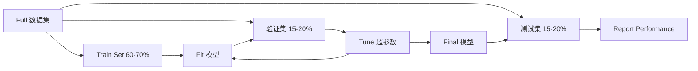

# 模型评估

> A 模型 is only as good as the way you measure it.

**Type:** 构建
**Languages:** Python
**Prerequisites:** Phase 1 (概率 & Distributions, Statistics for ML), Phase 2 Lessons 1-8
**Time:** ~90 分钟

## 学习目标

- 实现 K-fold and stratified K-fold 交叉验证 从零实现 and explain why stratification matters for 不平衡数据
- 计算 精确率, 召回率, F1, AUC-ROC, and 回归 指标 (MSE, RMSE, MAE, R-squared) 从零实现
- Interpret learning curves to diagnose whether a 模型 suffers from high 偏差 or high 方差
- 识别 common evaluation mistakes including data leakage, wrong 指标 selection, and 测试集 contamination

## 问题

You trained a 模型. It gets 95% 准确率 on your data. Is it good?

Maybe. Maybe not. If 95% of your data belongs to one class, a 模型 that always predicts that class gets 95% 准确率 while being completely useless. If you evaluated on the same data you trained on, the 95% number is meaningless because the 模型 just memorized the answers. If your 数据集 has a time component and you randomly shuffled before splitting, your 模型 might be using future data to predict the past.

模型 evaluation is where most ML projects go wrong. The wrong 指标 makes a bad 模型 look good. The wrong 划分 lets a 模型 cheat. The wrong comparison makes you pick the worse 模型. Getting evaluation right is not optional. It is the difference between a 模型 that works in 生产环境 and one that fails the moment it sees real data.

## 概念

### Train, Validation, Test



Three 划分, three purposes:

- **训练集**: the 模型 learns from this data. It sees these examples during training.
- **验证集**: used to tune 超参数 and select between 模型. The 模型 never trains on this data, but your decisions are influenced by it.
- **测试集**: touched exactly once, at the very end, to report final performance. If you look at test performance and then go back to change your 模型, it is no longer a 测试集. It has become a second 验证集.

The 测试集 is your hold-out guarantee that the reported performance reflects how the 模型 will do on truly unseen data.

### K-Fold 交叉验证

With small 数据集, a single train/validation 划分 wastes data and gives noisy estimates. K-fold 交叉验证 uses all the data for both training and validation:

```mermaid
flowchart TB
    subgraph Fold1["Fold 1"]
        direction LR
        V1["Val"] --- T1a["Train"] --- T1b["Train"] --- T1c["Train"] --- T1d["Train"]
    end
    subgraph Fold2["Fold 2"]
        direction LR
        T2a["Train"] --- V2["Val"] --- T2b["Train"] --- T2c["Train"] --- T2d["Train"]
    end
    subgraph Fold3["Fold 3"]
        direction LR
        T3a["Train"] --- T3b["Train"] --- V3["Val"] --- T3c["Train"] --- T3d["Train"]
    end
    subgraph Fold4["Fold 4"]
        direction LR
        T4a["Train"] --- T4b["Train"] --- T4c["Train"] --- V4["Val"] --- T4d["Train"]
    end
    subgraph Fold5["Fold 5"]
        direction LR
        T5a["Train"] --- T5b["Train"] --- T5c["Train"] --- T5d["Train"] --- V5["Val"]
    end
    Fold1 --> R["Average scores"]
    Fold2 --> R
    Fold3 --> R
    Fold4 --> R
    Fold5 --> R
```



1. 划分 data into K equal-sized folds
2. For each fold, train on K-1 folds and validate on the remaining fold
3. Average the K validation scores

K=5 or K=10 are standard choices. Every data point gets used for validation exactly once. The average score is a more stable estimate than any single 划分.

**Stratified K-fold**: preserves the class distribution in each fold. If your 数据集 is 70% class A and 30% class B, each fold will have roughly the same ratio. This is important for imbalanced 数据集 where a random 划分 might put all minority 样本 in one fold.

### 分类 指标

**混淆矩阵**: the foundation. For binary 分类:

|  | 预测为正类 | 预测为负类 |
|--|---|---|
| 实际为正类 | 真正例 (TP) | 假反例 (FN) |
| 实际为负类 | 假正例 (FP) | 真反例 (TN) |

From this matrix, all other 指标 follow:

- **准确率** = (TP + TN) / (TP + TN + FP + FN). Fraction of correct 预测. Misleading when classes are imbalanced.
- **精确率** = TP / (TP + FP). Of all things predicted positive, how many actually were? Use when false positives are costly (e.g., spam filter marking real email as spam).
- **召回率** (sensitivity) = TP / (TP + FN). Of all actual positives, how many did we catch? Use when false negatives are costly (e.g., cancer screening missing a tumor).
- **F1 score** = 2 * 精确率 * 召回率 / (精确率 + 召回率). Harmonic mean of 精确率 and 召回率. Balances both when neither clearly dominates.
- **AUC-ROC**: Area Under the Receiver Operating Characteristic curve. Plots true positive rate vs false positive rate at various 分类 thresholds. AUC = 0.5 means random guessing, AUC = 1.0 means perfect separation. 阈值-independent: it measures how well the 模型 ranks positives above negatives, regardless of the cutoff you pick.

### 回归 指标

- **MSE** (均方误差) = mean((y_true - y_pred)^2). Penalizes large 误差 quadratically. Sensitive to outliers.
- **RMSE** (Root 均方误差) = sqrt(MSE). Same units as the 目标 variable. Easier to interpret than MSE.
- **MAE** (Mean Absolute 误差) = mean(|y_true - y_pred|). Treats all 误差 linearly. More robust to outliers than MSE.
- **R-squared** = 1 - SS_res / SS_tot, where SS_res = sum((y_true - y_pred)^2) and SS_tot = sum((y_true - y_mean)^2). Fraction of 方差 explained by the 模型. R^2 = 1.0 is perfect. R^2 = 0.0 means the 模型 is no better than always predicting the mean. R^2 can be negative if the 模型 is worse than the mean.

### Learning Curves

Plot training and validation scores as a function of 训练集 size:

- **High 偏差 (欠拟合)**: both curves converge to a low score. Adding more data will not help. You need a more complex 模型.
- **High 方差 (过拟合)**: training score is high but validation score is much lower. The gap between them is large. Adding more data should help.

### Validation Curves

Plot training and validation scores as a function of a 超参数:

- At low complexity: both scores are low (欠拟合)
- At the right complexity: both scores are high and close together
- At high complexity: training score stays high but validation score drops (过拟合)

The optimal 超参数 value is where the validation score peaks.

### Common Evaluation Mistakes

**Data leakage**: information from the 测试集 leaks into training. Examples: fitting a scaler on the full 数据集 before splitting, including future data in 时间序列 预测, using a 特征 that is derived from the 目标. Always 划分 first, then preprocess.

**Class imbalance**: 99% of transactions are legitimate, 1% are fraud. A 模型 that always predicts "legitimate" gets 99% 准确率. Use 精确率, 召回率, F1, or AUC-ROC instead.

**Wrong 指标**: optimizing 准确率 when you should optimize 召回率 (medical diagnosis), or optimizing RMSE when your data has heavy outliers (use MAE instead).

**Not using stratified 划分**: with 不平衡数据, a random 划分 might put very few minority 样本 in the validation fold, giving unstable estimates.

**Testing too often**: every time you look at test performance and adjust, you overfit to the 测试集. The 测试集 is single-use.

```figure
precision-recall-threshold
```

## 动手构建

### Step 1: Train/validation/test 划分

```python
import random
import math


def train_val_test_split(X, y, train_ratio=0.6, val_ratio=0.2, seed=42):
    random.seed(seed)
    n = len(X)
    indices = list(range(n))
    random.shuffle(indices)

    train_end = int(n * train_ratio)
    val_end = int(n * (train_ratio + val_ratio))

    train_idx = indices[:train_end]
    val_idx = indices[train_end:val_end]
    test_idx = indices[val_end:]

    X_train = [X[i] for i in train_idx]
    y_train = [y[i] for i in train_idx]
    X_val = [X[i] for i in val_idx]
    y_val = [y[i] for i in val_idx]
    X_test = [X[i] for i in test_idx]
    y_test = [y[i] for i in test_idx]

    return X_train, y_train, X_val, y_val, X_test, y_test
```

### Step 2: K-fold and stratified K-fold 交叉验证

```python
def kfold_split(n, k=5, seed=42):
    random.seed(seed)
    indices = list(range(n))
    random.shuffle(indices)

    fold_size = n // k
    folds = []

    for i in range(k):
        start = i * fold_size
        end = start + fold_size if i < k - 1 else n
        val_idx = indices[start:end]
        train_idx = indices[:start] + indices[end:]
        folds.append((train_idx, val_idx))

    return folds


def stratified_kfold_split(y, k=5, seed=42):
    random.seed(seed)

    class_indices = {}
    for i, label in enumerate(y):
        class_indices.setdefault(label, []).append(i)

    for label in class_indices:
        random.shuffle(class_indices[label])

    folds = [{"train": [], "val": []} for _ in range(k)]

    for label, indices in class_indices.items():
        fold_size = len(indices) // k
        for i in range(k):
            start = i * fold_size
            end = start + fold_size if i < k - 1 else len(indices)
            val_part = indices[start:end]
            train_part = indices[:start] + indices[end:]
            folds[i]["val"].extend(val_part)
            folds[i]["train"].extend(train_part)

    return [(f["train"], f["val"]) for f in folds]


def cross_validate(X, y, model_fn, k=5, metric_fn=None, stratified=False):
    n = len(X)

    if stratified:
        folds = stratified_kfold_split(y, k)
    else:
        folds = kfold_split(n, k)

    scores = []
    for train_idx, val_idx in folds:
        X_train = [X[i] for i in train_idx]
        y_train = [y[i] for i in train_idx]
        X_val = [X[i] for i in val_idx]
        y_val = [y[i] for i in val_idx]

        model = model_fn()
        model.fit(X_train, y_train)
        predictions = [model.predict(x) for x in X_val]

        if metric_fn:
            score = metric_fn(y_val, predictions)
        else:
            score = sum(1 for yt, yp in zip(y_val, predictions) if yt == yp) / len(y_val)
        scores.append(score)

    return scores
```

### Step 3: 混淆矩阵 and 分类 指标

```python
def confusion_matrix(y_true, y_pred):
    tp = sum(1 for yt, yp in zip(y_true, y_pred) if yt == 1 and yp == 1)
    tn = sum(1 for yt, yp in zip(y_true, y_pred) if yt == 0 and yp == 0)
    fp = sum(1 for yt, yp in zip(y_true, y_pred) if yt == 0 and yp == 1)
    fn = sum(1 for yt, yp in zip(y_true, y_pred) if yt == 1 and yp == 0)
    return tp, tn, fp, fn


def accuracy(y_true, y_pred):
    tp, tn, fp, fn = confusion_matrix(y_true, y_pred)
    total = tp + tn + fp + fn
    return (tp + tn) / total if total > 0 else 0.0


def precision(y_true, y_pred):
    tp, tn, fp, fn = confusion_matrix(y_true, y_pred)
    return tp / (tp + fp) if (tp + fp) > 0 else 0.0


def recall(y_true, y_pred):
    tp, tn, fp, fn = confusion_matrix(y_true, y_pred)
    return tp / (tp + fn) if (tp + fn) > 0 else 0.0


def f1_score(y_true, y_pred):
    p = precision(y_true, y_pred)
    r = recall(y_true, y_pred)
    return 2 * p * r / (p + r) if (p + r) > 0 else 0.0


def roc_curve(y_true, y_scores):
    thresholds = sorted(set(y_scores), reverse=True)
    tpr_list = []
    fpr_list = []

    total_positives = sum(y_true)
    total_negatives = len(y_true) - total_positives

    for threshold in thresholds:
        y_pred = [1 if s >= threshold else 0 for s in y_scores]
        tp = sum(1 for yt, yp in zip(y_true, y_pred) if yt == 1 and yp == 1)
        fp = sum(1 for yt, yp in zip(y_true, y_pred) if yt == 0 and yp == 1)

        tpr = tp / total_positives if total_positives > 0 else 0.0
        fpr = fp / total_negatives if total_negatives > 0 else 0.0

        tpr_list.append(tpr)
        fpr_list.append(fpr)

    return fpr_list, tpr_list, thresholds


def auc_roc(y_true, y_scores):
    fpr_list, tpr_list, _ = roc_curve(y_true, y_scores)

    pairs = sorted(zip(fpr_list, tpr_list))
    fpr_sorted = [p[0] for p in pairs]
    tpr_sorted = [p[1] for p in pairs]

    area = 0.0
    for i in range(1, len(fpr_sorted)):
        width = fpr_sorted[i] - fpr_sorted[i - 1]
        height = (tpr_sorted[i] + tpr_sorted[i - 1]) / 2
        area += width * height

    return area
```

### Step 4: 回归 指标

```python
def mse(y_true, y_pred):
    n = len(y_true)
    return sum((yt - yp) ** 2 for yt, yp in zip(y_true, y_pred)) / n


def rmse(y_true, y_pred):
    return math.sqrt(mse(y_true, y_pred))


def mae(y_true, y_pred):
    n = len(y_true)
    return sum(abs(yt - yp) for yt, yp in zip(y_true, y_pred)) / n


def r_squared(y_true, y_pred):
    mean_y = sum(y_true) / len(y_true)
    ss_res = sum((yt - yp) ** 2 for yt, yp in zip(y_true, y_pred))
    ss_tot = sum((yt - mean_y) ** 2 for yt in y_true)
    if ss_tot == 0:
        return 0.0
    return 1.0 - ss_res / ss_tot
```

### Step 5: Learning curves

```python
def learning_curve(X, y, model_fn, metric_fn, train_sizes=None, val_ratio=0.2, seed=42):
    random.seed(seed)
    n = len(X)
    indices = list(range(n))
    random.shuffle(indices)

    val_size = int(n * val_ratio)
    val_idx = indices[:val_size]
    pool_idx = indices[val_size:]

    X_val = [X[i] for i in val_idx]
    y_val = [y[i] for i in val_idx]

    if train_sizes is None:
        train_sizes = [int(len(pool_idx) * r) for r in [0.1, 0.2, 0.4, 0.6, 0.8, 1.0]]

    train_scores = []
    val_scores = []

    for size in train_sizes:
        subset = pool_idx[:size]
        X_train = [X[i] for i in subset]
        y_train = [y[i] for i in subset]

        model = model_fn()
        model.fit(X_train, y_train)

        train_pred = [model.predict(x) for x in X_train]
        val_pred = [model.predict(x) for x in X_val]

        train_scores.append(metric_fn(y_train, train_pred))
        val_scores.append(metric_fn(y_val, val_pred))

    return train_sizes, train_scores, val_scores
```

### Step 6: A simple classifier for testing, plus the full demo

```python
class SimpleLogistic:
    def __init__(self, lr=0.1, epochs=100):
        self.lr = lr
        self.epochs = epochs
        self.weights = None
        self.bias = 0.0

    def sigmoid(self, z):
        z = max(-500, min(500, z))
        return 1.0 / (1.0 + math.exp(-z))

    def fit(self, X, y):
        n_features = len(X[0])
        self.weights = [0.0] * n_features
        self.bias = 0.0

        for _ in range(self.epochs):
            for xi, yi in zip(X, y):
                z = sum(w * x for w, x in zip(self.weights, xi)) + self.bias
                pred = self.sigmoid(z)
                error = yi - pred
                for j in range(n_features):
                    self.weights[j] += self.lr * error * xi[j]
                self.bias += self.lr * error

    def predict_proba(self, x):
        z = sum(w * xi for w, xi in zip(self.weights, x)) + self.bias
        return self.sigmoid(z)

    def predict(self, x):
        return 1 if self.predict_proba(x) >= 0.5 else 0


class SimpleLinearRegression:
    def __init__(self, lr=0.001, epochs=200):
        self.lr = lr
        self.epochs = epochs
        self.weights = None
        self.bias = 0.0

    def fit(self, X, y):
        n_features = len(X[0])
        self.weights = [0.0] * n_features
        self.bias = 0.0
        n = len(X)

        for _ in range(self.epochs):
            for xi, yi in zip(X, y):
                pred = sum(w * x for w, x in zip(self.weights, xi)) + self.bias
                error = yi - pred
                for j in range(n_features):
                    self.weights[j] += self.lr * error * xi[j] / n
                self.bias += self.lr * error / n

    def predict(self, x):
        return sum(w * xi for w, xi in zip(self.weights, x)) + self.bias


def standardize(values):
    n = len(values)
    mean = sum(values) / n
    var = sum((v - mean) ** 2 for v in values) / n
    std = math.sqrt(var) if var > 0 else 1.0
    return [(v - mean) / std for v in values], mean, std


def make_classification_data(n=300, seed=42):
    random.seed(seed)
    X = []
    y = []
    for _ in range(n):
        x1 = random.gauss(0, 1)
        x2 = random.gauss(0, 1)
        label = 1 if (x1 + x2 + random.gauss(0, 0.5)) > 0 else 0
        X.append([x1, x2])
        y.append(label)
    return X, y


def make_regression_data(n=200, seed=42):
    random.seed(seed)
    X = []
    y = []
    for _ in range(n):
        x1 = random.uniform(0, 10)
        x2 = random.uniform(0, 5)
        target = 3 * x1 + 2 * x2 + random.gauss(0, 2)
        X.append([x1, x2])
        y.append(target)
    return X, y


def make_imbalanced_data(n=300, minority_ratio=0.05, seed=42):
    random.seed(seed)
    X = []
    y = []
    for _ in range(n):
        if random.random() < minority_ratio:
            x1 = random.gauss(3, 0.5)
            x2 = random.gauss(3, 0.5)
            label = 1
        else:
            x1 = random.gauss(0, 1)
            x2 = random.gauss(0, 1)
            label = 0
        X.append([x1, x2])
        y.append(label)
    return X, y


if __name__ == "__main__":
    X_clf, y_clf = make_classification_data(300)

    print("=== Train/Validation/Test Split ===")
    X_train, y_train, X_val, y_val, X_test, y_test = train_val_test_split(X_clf, y_clf)
    print(f"  Train: {len(X_train)}, Val: {len(X_val)}, Test: {len(X_test)}")
    print(f"  Train class distribution: {sum(y_train)}/{len(y_train)} positive")
    print(f"  Val class distribution: {sum(y_val)}/{len(y_val)} positive")

    model = SimpleLogistic(lr=0.1, epochs=200)
    model.fit(X_train, y_train)

    print("\n=== Classification Metrics ===")
    y_pred = [model.predict(x) for x in X_test]
    tp, tn, fp, fn = confusion_matrix(y_test, y_pred)
    print(f"  Confusion matrix: TP={tp}, TN={tn}, FP={fp}, FN={fn}")
    print(f"  Accuracy:  {accuracy(y_test, y_pred):.4f}")
    print(f"  Precision: {precision(y_test, y_pred):.4f}")
    print(f"  Recall:    {recall(y_test, y_pred):.4f}")
    print(f"  F1 Score:  {f1_score(y_test, y_pred):.4f}")

    y_scores = [model.predict_proba(x) for x in X_test]
    auc = auc_roc(y_test, y_scores)
    print(f"  AUC-ROC:   {auc:.4f}")

    print("\n=== K-Fold Cross-Validation (K=5) ===")
    cv_scores = cross_validate(
        X_clf, y_clf,
        model_fn=lambda: SimpleLogistic(lr=0.1, epochs=200),
        k=5,
        metric_fn=accuracy,
    )
    mean_cv = sum(cv_scores) / len(cv_scores)
    std_cv = math.sqrt(sum((s - mean_cv) ** 2 for s in cv_scores) / len(cv_scores))
    print(f"  Fold scores: {[round(s, 4) for s in cv_scores]}")
    print(f"  Mean: {mean_cv:.4f} (+/- {std_cv:.4f})")

    print("\n=== Stratified K-Fold Cross-Validation (K=5) ===")
    strat_scores = cross_validate(
        X_clf, y_clf,
        model_fn=lambda: SimpleLogistic(lr=0.1, epochs=200),
        k=5,
        metric_fn=accuracy,
        stratified=True,
    )
    strat_mean = sum(strat_scores) / len(strat_scores)
    strat_std = math.sqrt(sum((s - strat_mean) ** 2 for s in strat_scores) / len(strat_scores))
    print(f"  Fold scores: {[round(s, 4) for s in strat_scores]}")
    print(f"  Mean: {strat_mean:.4f} (+/- {strat_std:.4f})")

    print("\n=== Imbalanced Data: Why Accuracy Lies ===")
    X_imb, y_imb = make_imbalanced_data(300, minority_ratio=0.05)
    positives = sum(y_imb)
    print(f"  Class distribution: {positives} positive, {len(y_imb) - positives} negative ({positives/len(y_imb)*100:.1f}% positive)")

    always_negative = [0] * len(y_imb)
    print(f"  Always-negative baseline:")
    print(f"    Accuracy:  {accuracy(y_imb, always_negative):.4f}")
    print(f"    Precision: {precision(y_imb, always_negative):.4f}")
    print(f"    Recall:    {recall(y_imb, always_negative):.4f}")
    print(f"    F1 Score:  {f1_score(y_imb, always_negative):.4f}")

    X_tr_i, y_tr_i, X_v_i, y_v_i, X_te_i, y_te_i = train_val_test_split(X_imb, y_imb)
    model_imb = SimpleLogistic(lr=0.5, epochs=500)
    model_imb.fit(X_tr_i, y_tr_i)
    y_pred_imb = [model_imb.predict(x) for x in X_te_i]
    print(f"\n  Trained model on imbalanced data:")
    print(f"    Accuracy:  {accuracy(y_te_i, y_pred_imb):.4f}")
    print(f"    Precision: {precision(y_te_i, y_pred_imb):.4f}")
    print(f"    Recall:    {recall(y_te_i, y_pred_imb):.4f}")
    print(f"    F1 Score:  {f1_score(y_te_i, y_pred_imb):.4f}")

    print("\n=== Regression Metrics ===")
    X_reg, y_reg = make_regression_data(200)

    col0 = [x[0] for x in X_reg]
    col1 = [x[1] for x in X_reg]
    col0_s, m0, s0 = standardize(col0)
    col1_s, m1, s1 = standardize(col1)
    X_reg_scaled = [[col0_s[i], col1_s[i]] for i in range(len(X_reg))]

    X_tr_r, y_tr_r, X_v_r, y_v_r, X_te_r, y_te_r = train_val_test_split(X_reg_scaled, y_reg)
    reg_model = SimpleLinearRegression(lr=0.01, epochs=500)
    reg_model.fit(X_tr_r, y_tr_r)
    y_pred_r = [reg_model.predict(x) for x in X_te_r]

    print(f"  MSE:       {mse(y_te_r, y_pred_r):.4f}")
    print(f"  RMSE:      {rmse(y_te_r, y_pred_r):.4f}")
    print(f"  MAE:       {mae(y_te_r, y_pred_r):.4f}")
    print(f"  R-squared: {r_squared(y_te_r, y_pred_r):.4f}")

    mean_baseline = [sum(y_tr_r) / len(y_tr_r)] * len(y_te_r)
    print(f"\n  Mean baseline:")
    print(f"    MSE:       {mse(y_te_r, mean_baseline):.4f}")
    print(f"    R-squared: {r_squared(y_te_r, mean_baseline):.4f}")

    print("\n=== Learning Curve ===")
    sizes, train_sc, val_sc = learning_curve(
        X_clf, y_clf,
        model_fn=lambda: SimpleLogistic(lr=0.1, epochs=200),
        metric_fn=accuracy,
    )
    print(f"  {'Size':>6} {'Train':>8} {'Val':>8}")
    for s, tr, va in zip(sizes, train_sc, val_sc):
        print(f"  {s:>6} {tr:>8.4f} {va:>8.4f}")

    print("\n=== Statistical Model Comparison ===")
    model_a_scores = cross_validate(
        X_clf, y_clf,
        model_fn=lambda: SimpleLogistic(lr=0.1, epochs=100),
        k=5, metric_fn=accuracy,
    )
    model_b_scores = cross_validate(
        X_clf, y_clf,
        model_fn=lambda: SimpleLogistic(lr=0.1, epochs=500),
        k=5, metric_fn=accuracy,
    )
    diffs = [a - b for a, b in zip(model_a_scores, model_b_scores)]
    mean_diff = sum(diffs) / len(diffs)
    std_diff = math.sqrt(sum((d - mean_diff) ** 2 for d in diffs) / len(diffs))
    t_stat = mean_diff / (std_diff / math.sqrt(len(diffs))) if std_diff > 0 else 0.0
    print(f"  Model A (100 epochs) mean: {sum(model_a_scores)/len(model_a_scores):.4f}")
    print(f"  Model B (500 epochs) mean: {sum(model_b_scores)/len(model_b_scores):.4f}")
    print(f"  Mean difference: {mean_diff:.4f}")
    print(f"  Paired t-statistic: {t_stat:.4f}")
    print(f"  (|t| > 2.78 for significance at p<0.05 with df=4)")
```

## 直接使用

With scikit-learn, evaluation is built into the workflow:

```python
from sklearn.model_selection import cross_val_score, StratifiedKFold, learning_curve
from sklearn.metrics import (
    accuracy_score, precision_score, recall_score, f1_score,
    roc_auc_score, confusion_matrix, mean_squared_error, r2_score,
)
from sklearn.linear_model import LogisticRegression

model = LogisticRegression()
scores = cross_val_score(model, X, y, cv=StratifiedKFold(5), scoring="f1")
```

The from-scratch versions show exactly what 交叉验证 does (no magic, just for-loops and index tracking), how each 指标 is computed (just counting TP/FP/TN/FN), and why stratification matters (preserving class ratios in each fold). The library versions add parallelism, more scoring options, and integration with pipelines.

## 交付成果

本课产出：
- `outputs/skill-evaluation.md` - a skill covering evaluation strategy for 分类 and 回归 模型

## 练习

1. 实现 精确率-召回率 curves: plot 精确率 vs 召回率 at different thresholds. 计算 the average 精确率 (area under the PR curve). 比较 the PR curve to the ROC curve on an imbalanced 数据集 and explain when each is more informative.
2. 构建 a nested 交叉验证 loop: the outer loop evaluates 模型 performance, the inner loop tunes 超参数. Use it to compare two 模型 fairly without leaking validation data into the evaluation.
3. 实现 a permutation test for 模型 comparison: shuffle the 标签, retrain, and measure performance. Repeat 100 times to build a null distribution. 计算 the p-value for the observed 模型 performance against this distribution.

## 关键术语

| 术语 | 常见说法 | 实际含义 |
|------|----------------|----------------------|
| 过拟合 | "Memorizing the 训练数据" | The 模型 captures noise in the 训练数据, performing well on training but poorly on unseen data |
| 交叉验证 | "Testing on different subsets" | Systematically rotating which portion of data is used for validation, averaging results across all rotations |
| 精确率 | "How many predicted positives are correct" | TP / (TP + FP): the fraction of positive 预测 that are actually positive |
| 召回率 | "How many actual positives we found" | TP / (TP + FN): the fraction of actual positives that were correctly identified |
| AUC-ROC | "How well the 模型 separates classes" | The area under the curve of true positive rate vs false positive rate across all thresholds, from 0.5 (random) to 1.0 (perfect) |
| R-squared | "How much 方差 is explained" | 1 - (sum of squared 残差 / total sum of squares): the fraction of 目标 方差 captured by the 模型 |
| Data leakage | "The 模型 cheated" | Using information during training that would not be available at 预测 time, leading to optimistic evaluation |
| 学习曲线 | "How performance changes with more data" | A plot of training and validation scores vs 训练集 size, revealing 欠拟合 or 过拟合 |
| Stratified 划分 | "Keeping class ratios balanced" | Splitting data so each subset has the same proportion of each class as the full 数据集 |

## 延伸阅读

- [scikit-learn Model Selection Guide](https://scikit-learn.org/stable/model_selection.html) - comprehensive reference on 交叉验证, 指标, and 超参数 tuning
- [Beyond Accuracy: Precision and Recall (Google ML Crash Course)](https://developers.google.com/machine-learning/crash-course/classification/precision-and-recall) - clear explanation with interactive examples
- [A Survey of Cross-Validation Procedures (Arlot & Celisse, 2010)](https://projecteuclid.org/journals/statistics-surveys/volume-4/issue-none/A-survey-of-cross-validation-procedures-for-model-selection/10.1214/09-SS054.full) - rigorous treatment of when and why different CV strategies work
