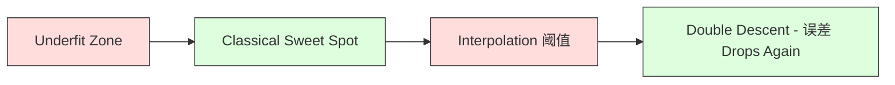
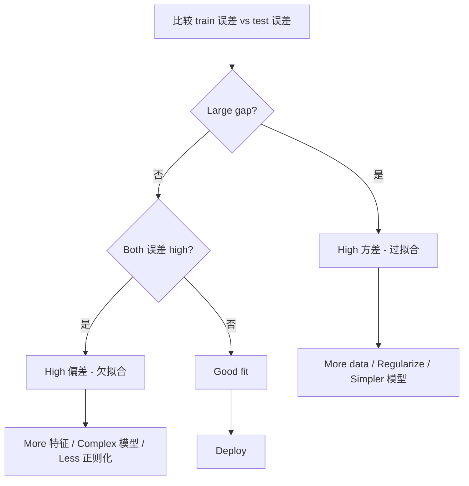
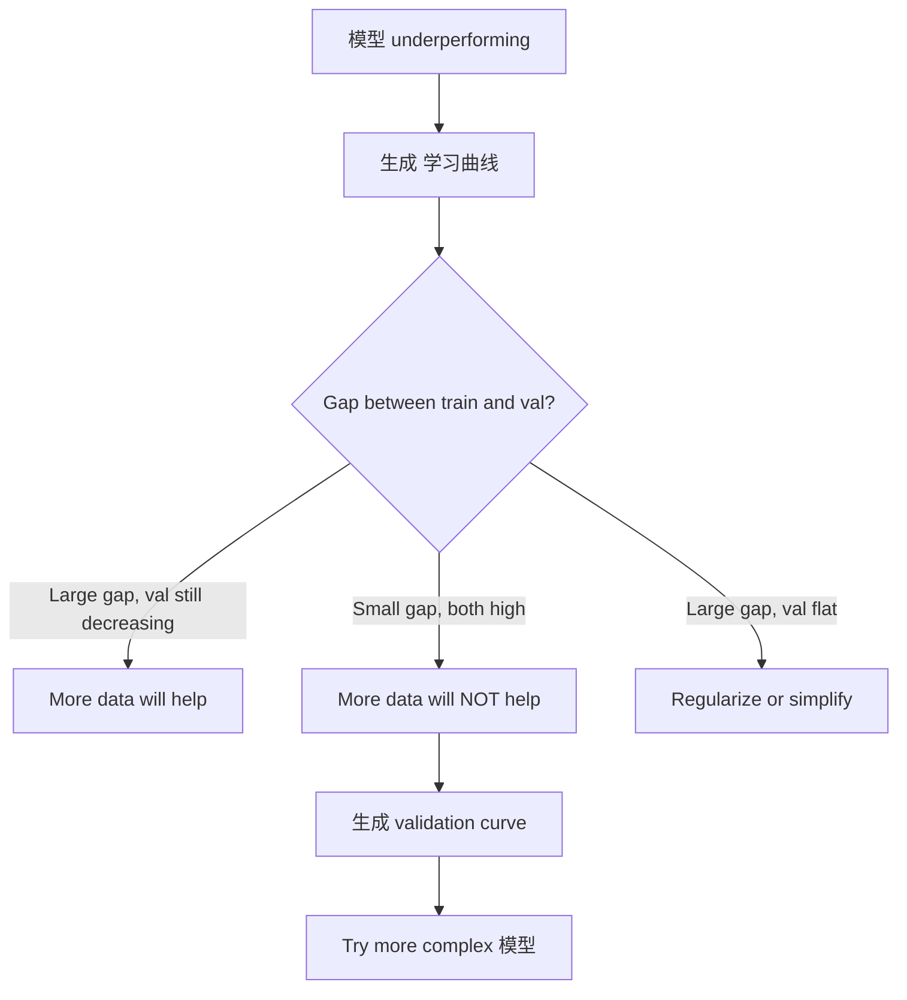

# 偏差-方差 Tradeoff

> Every 模型 误差 comes from one of three sources: 偏差, 方差, or noise. You can only control the first two.

**Type:** 学习
**Language:** Python
**Prerequisites:** Phase 2, Lessons 01-09 (ML basics, 回归, 分类, evaluation)
**Time:** ~75 分钟

## 学习目标

- 推导 the 偏差-方差 decomposition of expected 预测 误差 and explain the role of irreducible noise
- Diagnose whether a 模型 suffers from high 偏差 or high 方差 using training and test 误差 patterns
- 解释 how 正则化 techniques (L1, L2, dropout, early stopping) trade 偏差 for 方差
- 实现 experiments that visualize the 偏差-方差 tradeoff across 模型 of increasing complexity

## 问题

You trained a 模型. It has some 误差 on 测试数据. Where does that 误差 come from?

If your 模型 is too simple (线性回归 on a curved 数据集), it will consistently miss the true pattern. That is 偏差. If your 模型 is too complex (degree-20 polynomial on 15 data points), it will fit the 训练数据 perfectly but give wildly different 预测 on new data. That is 方差.

You cannot minimize both at the same time for a fixed 模型 capacity. Push 偏差 down and 方差 goes up. Push 方差 down and 偏差 goes up. Understanding this tradeoff is the single most useful diagnostic skill in 机器学习. It tells you whether to make your 模型 more complex or less complex, whether to get more data or engineer better 特征, whether to regularize more or less.

## 概念

### 偏差: Systematic 误差

偏差 measures how far off your 模型's average 预测 is from the true value. If you trained the same 模型 on many different training sets drawn from the same distribution and averaged the 预测, 偏差 is the gap between that average and the truth.

High 偏差 means the 模型 is too rigid to capture the real pattern. A straight line fit to a parabola will always miss the curve, no matter how much data you give it. This is 欠拟合.

```
High bias (underfitting):
  Model always predicts roughly the same wrong thing.
  Training error: HIGH
  Test error: HIGH
  Gap between them: SMALL
```

### 方差: Sensitivity to 训练数据

方差 measures how much your 预测 change when you train on different subsets of data. If small changes in the 训练集 cause large changes in the 模型, 方差 is high.

High 方差 means the 模型 is fitting noise in the 训练数据, not the underlying signal. A degree-20 polynomial will thread through every training point but oscillate wildly between them. This is 过拟合.

```
High variance (overfitting):
  Model fits training data perfectly but fails on new data.
  Training error: LOW
  Test error: HIGH
  Gap between them: LARGE
```

### The Decomposition

For any point x, the expected 预测 误差 under squared loss decomposes exactly:

```
Expected Error = Bias^2 + Variance + Irreducible Noise

where:
  Bias^2   = (E[f_hat(x)] - f(x))^2
  Variance = E[(f_hat(x) - E[f_hat(x)])^2]
  Noise    = E[(y - f(x))^2]             (sigma^2)
```

- `f(x)` is the true function
- `f_hat(x)` is your 模型's 预测
- `E[...]` is the expectation over different training sets
- `y` is the observed 标签 (true function plus noise)

The noise term is irreducible. 否 模型 can do better than sigma^2 on noisy data. Your job is to find the right balance between 偏差^2 and 方差.

### 模型 Complexity vs 误差


The classic U-shaped curve:

| Complexity | 偏差 | 方差 | Total 误差 |
|-----------|------|----------|-------------|
| Too low | HIGH | LOW | HIGH (欠拟合) |
| Just right | MODERATE | MODERATE | LOWEST |
| Too high | LOW | HIGH | HIGH (过拟合) |

### 正则化 as 偏差-方差 Control

正则化 deliberately increases 偏差 to reduce 方差. It constrains the 模型 so it cannot chase noise.

- **L2 (Ridge):** Shrinks all 权重 toward zero. Keeps all 特征 but reduces their influence.
- **L1 (Lasso):** Pushes some 权重 exactly to zero. Performs 特征选择.
- **Dropout:** Randomly disables neurons during training. Forces redundant representations.
- **Early stopping:** Stops training before the 模型 fully fits the 训练数据.

The 正则化 strength (lambda, dropout rate, number of epochs) directly controls where you sit on the 偏差-方差 curve. More 正则化 means more 偏差, less 方差.

### Double Descent: The Modern Perspective

Classical theory says: after the sweet spot, more complexity always hurts. But research since 2019 has shown something unexpected. If you keep increasing 模型 capacity far past the interpolation 阈值 (where the 模型 has enough 参数 to perfectly fit 训练数据), test 误差 can decrease again.



This "double descent" phenomenon explains why massively overparameterized neural networks (with far more 参数 than training examples) still generalize well. The classical 偏差-方差 tradeoff is not wrong, but it is incomplete for the modern regime.

Key observations about double descent:
- It happens in linear 模型, 决策树, and neural networks
- More data can actually hurt in the interpolation region (样本-wise double descent)
- More training epochs can cause it too (epoch-wise double descent)
- 正则化 smooths out the peak but does not eliminate it

原因 does this happen? At the interpolation 阈值, the 模型 has just enough capacity to fit all training points. It is forced into a very specific solution that threads through every point, and small perturbations in the data cause large changes in the fit. This is where 方差 peaks. Past the 阈值, the 模型 has many possible solutions that fit the data perfectly. The learning algorithm (e.g., 梯度下降 with implicit 正则化) tends to pick the simplest one among them. This implicit 偏差 toward simple solutions is why overparameterized 模型 generalize.

| Regime | 参数 vs 样本 | 行为 |
|--------|----------------------|----------|
| Underparameterized | p << n | Classical tradeoff applies |
| Interpolation 阈值 | p ~ n | 方差 peaks, test 误差 spikes |
| Overparameterized | p >> n | Implicit 正则化 kicks in, test 误差 drops |

For practical purposes: if you are using neural networks or large 树 ensembles, do not stop at the interpolation 阈值. Either stay well below it (with explicit 正则化) or go well past it. The worst place to be is right at the 阈值.

### Diagnosing Your 模型



| Symptom | Diagnosis | Fix |
|---------|-----------|-----|
| High train 误差, high test 误差 | 偏差 | More 特征, complex 模型, less 正则化 |
| Low train 误差, high test 误差 | 方差 | More data, 正则化, simpler 模型, dropout |
| Low train 误差, low test 误差 | Good fit | Ship it |
| Train 误差 decreasing, test 误差 increasing | 过拟合 in progress | Early stopping |

### Practical Strategies

**When 偏差 is the problem:**
- Add polynomial or interaction 特征
- Use a more flexible 模型 (树 集成 instead of linear)
- Reduce 正则化 strength
- Train longer (if not yet converged)

**When 方差 is the problem:**
- Get more 训练数据
- Use bagging (随机森林)
- Increase 正则化 (higher lambda, more dropout)
- 特征选择 (remove noisy 特征)
- Use 交叉验证 to detect it early

### 集成 Methods and 方差 Reduction

集成 methods are the most practical tool for fighting 方差.

**bagging (Bootstrap Aggregating)** trains multiple 模型 on different bootstrap 样本 of the 训练数据, then averages their 预测. Each individual 模型 has high 方差, but the average has much lower 方差. 随机森林 are bagging applied to 决策树.

原因 it works mathematically: if you average N independent 预测, each with 方差 sigma^2, the 方差 of the average is sigma^2 / N. The 模型 are not truly independent (they all see similar data), so the reduction is less than 1/N, but it is still substantial.

**boosting** reduces 偏差 by building 模型 sequentially, where each new 模型 focuses on the 误差 of the 集成 so far. Gradient boosting and AdaBoost are the main examples. boosting can overfit if you add too many 模型, so you need early stopping or 正则化.

| Method | Primary Effect | 偏差 Change | 方差 Change |
|--------|---------------|-------------|-----------------|
| bagging | Reduces 方差 | 否 change | Decreases |
| boosting | Reduces 偏差 | Decreases | Can increase |
| stacking | Reduces both | Depends on meta-learner | Depends on base 模型 |
| Dropout | Implicit bagging | Slight increase | Decreases |

**Practical rule:** if your base 模型 has high 方差 (deep 树, high-degree polynomials), use bagging. If your base 模型 has high 偏差 (shallow stumps, simple linear 模型), use boosting.

### Learning Curves

Learning curves plot training and validation 误差 as a function of 训练集 size. They are the most practical diagnostic tool you have. Unlike a single train/test comparison, learning curves show you the trajectory of your 模型 and tell you whether more data will help.


How to read them:

| Scenario | Training 误差 | Validation 误差 | Gap | What It Means | What to Do |
|----------|---------------|-----------------|-----|---------------|------------|
| High 偏差 | High | High | Small | 模型 cannot capture the pattern | More 特征, complex 模型, less 正则化 |
| High 方差 | Low | High | Large | 模型 memorizes 训练数据 | More data, 正则化, simpler 模型 |
| Good fit | Moderate | Moderate | Small | 模型 generalizes well | Ship it |
| High 方差, improving | Low | Decreasing with more data | Shrinking | 方差 problem that data can fix | Collect more data |
| High 偏差, flat | High | High and flat | Small and flat | More data will NOT help | Change 模型 architecture |

The critical insight: if both curves have plateaued and the gap is small but both 误差 are high, more data is useless. You need a better 模型. If the gap is large and still shrinking, more data will help.

### How to 生成 Learning Curves

There are two approaches:

**Approach 1: Vary 训练集 size, fixed 模型.** Hold the 模型 and 超参数 constant. Train on increasingly large subsets of the 训练数据. Measure training 误差 and validation 误差 at each size. This is the standard 学习曲线.

**Approach 2: Vary 模型 complexity, fixed data.** Hold the data constant. Sweep a complexity 参数 (polynomial degree, 树 depth, number of layers). Measure training 误差 and validation 误差 at each complexity. This is a validation curve and shows the 偏差-方差 tradeoff directly.

Both approaches complement each other. The first tells you if more data will help. The second tells you if a different 模型 will help. Run both before making decisions about your next step.



```figure
bias-variance
```

## 动手构建

The code in `code/bias_variance.py` runs the full 偏差-方差 decomposition experiment. Here is the approach, step by step.

### Step 1: 生成 Synthetic Data from a Known Function

We use `f(x) = sin(1.5x) + 0.5x` with Gaussian noise. Knowing the true function lets us compute exact 偏差 and 方差.

```python
def true_function(x):
    return np.sin(1.5 * x) + 0.5 * x

def generate_data(n_samples=30, noise_std=0.5, x_range=(-3, 3), seed=None):
    rng = np.random.RandomState(seed)
    x = rng.uniform(x_range[0], x_range[1], n_samples)
    y = true_function(x) + rng.normal(0, noise_std, n_samples)
    return x, y
```

### Step 2: Bootstrap Sampling and Polynomial Fitting

For each polynomial degree, we draw many bootstrap training sets, fit the polynomial, and record 预测 on a fixed test grid. This gives us a distribution of 预测 at each test point.

```python
def fit_polynomial(x_train, y_train, degree, lam=0.0):
    X = np.column_stack([x_train ** d for d in range(degree + 1)])
    if lam > 0:
        penalty = lam * np.eye(X.shape[1])
        penalty[0, 0] = 0
        w = np.linalg.solve(X.T @ X + penalty, X.T @ y_train)
    else:
        w = np.linalg.lstsq(X, y_train, rcond=None)[0]
    return w
```

We fit on 200 different bootstrap 样本. Each 自助采样样本 is drawn from the same underlying distribution but contains different points.

### Step 3: Computing 偏差^2, 方差 Decomposition

With 200 sets of 预测 at each test point, we can compute the decomposition directly from the definition:

```python
mean_pred = predictions.mean(axis=0)
bias_sq = np.mean((mean_pred - y_true) ** 2)
variance = np.mean(predictions.var(axis=0))
total_error = np.mean(np.mean((predictions - y_true) ** 2, axis=1))
```

- `mean_pred` is E[f_hat(x)] estimated from bootstrap 样本
- `bias_sq` is the squared gap between average 预测 and truth
- `variance` is the average spread of 预测 across bootstrap 样本
- `total_error` should approximately equal 偏差^2 + 方差 + noise

### Step 4: Learning Curves

Learning curves sweep 训练集 size while holding 模型 complexity fixed. They show whether your 模型 is data-limited or capacity-limited.

```python
def demo_learning_curves():
    sizes = [10, 15, 20, 30, 50, 75, 100, 150, 200, 300]
    degree = 5

    for n in sizes:
        train_errors = []
        test_errors = []
        for seed in range(50):
            x_train, y_train = generate_data(n_samples=n, seed=seed * 100)
            w = fit_polynomial(x_train, y_train, degree)
            train_pred = predict_polynomial(x_train, w)
            train_mse = np.mean((train_pred - y_train) ** 2)
            test_pred = predict_polynomial(x_test, w)
            test_mse = np.mean((test_pred - y_test) ** 2)
            train_errors.append(train_mse)
            test_errors.append(test_mse)
        # Average over runs gives the learning curve point
```

For a high-方差 模型 (degree 5 with small data), you see:
- Training 误差 starts low and increases as more data makes memorization harder
- Test 误差 starts high and decreases as the 模型 gets more signal
- The gap shrinks with more data

For a high-偏差 模型 (degree 1), both 误差 converge quickly to the same high value and more data does not help.

### Step 5: 正则化 Sweep

The code also includes `demo_regularization_sweep()`, which fixes a high-degree polynomial (degree 15) and sweeps Ridge 正则化 strength from 0.001 to 100. This shows the 偏差-方差 tradeoff from a different angle: instead of varying 模型 complexity, we vary the constraint strength.

```python
def demo_regularization_sweep():
    alphas = [0.001, 0.005, 0.01, 0.05, 0.1, 0.5, 1.0, 5.0, 10.0, 50.0, 100.0]
    for alpha in alphas:
        results = bias_variance_decomposition([15], lam=alpha)
        r = results[15]
        print(f"alpha={alpha:.3f}  bias={r['bias_sq']:.4f}  var={r['variance']:.4f}")
```

At low alpha, the degree-15 polynomial is nearly unconstrained. 方差 dominates because the 模型 chases noise in each 自助采样样本. At high alpha, the penalty is so strong that the 模型 effectively becomes a near-constant function. 偏差 dominates. The optimal alpha sits between these extremes.

This is the same U-curve from varying polynomial degree, but controlled by a continuous knob instead of a discrete one. In practice, 正则化 is the preferred way to control the tradeoff because it allows fine-grained control without changing the 特征 set.

## 直接使用

sklearn provides `learning_curve` and `validation_curve` to automate these diagnostics without writing bootstrap loops.

### Validation Curve: Sweep 模型 Complexity

```python
from sklearn.model_selection import validation_curve
from sklearn.pipeline import make_pipeline
from sklearn.preprocessing import PolynomialFeatures
from sklearn.linear_model import Ridge

degrees = list(range(1, 16))
train_scores_all = []
val_scores_all = []

for d in degrees:
    pipe = make_pipeline(PolynomialFeatures(d), Ridge(alpha=0.01))
    train_scores, val_scores = validation_curve(
        pipe, X, y, param_name="polynomialfeatures__degree",
        param_range=[d], cv=5, scoring="neg_mean_squared_error"
    )
    train_scores_all.append(-train_scores.mean())
    val_scores_all.append(-val_scores.mean())
```

This gives you the 偏差-方差 tradeoff curve directly. Where the validation score is worst relative to train score, 方差 dominates. Where both are bad, 偏差 dominates.

### 学习曲线: Sweep 训练集 Size

```python
from sklearn.model_selection import learning_curve

pipe = make_pipeline(PolynomialFeatures(5), Ridge(alpha=0.01))
train_sizes, train_scores, val_scores = learning_curve(
    pipe, X, y, train_sizes=np.linspace(0.1, 1.0, 10),
    cv=5, scoring="neg_mean_squared_error"
)
train_mse = -train_scores.mean(axis=1)
val_mse = -val_scores.mean(axis=1)
```

Plot `train_mse` and `val_mse` against `train_sizes`. The shape tells you everything about your 模型.

### 交叉验证 with 正则化 Sweep

```python
from sklearn.model_selection import cross_val_score

alphas = [0.001, 0.01, 0.1, 1.0, 10.0, 100.0]
for alpha in alphas:
    pipe = make_pipeline(PolynomialFeatures(10), Ridge(alpha=alpha))
    scores = cross_val_score(pipe, X, y, cv=5, scoring="neg_mean_squared_error")
    print(f"alpha={alpha:>7.3f}  MSE={-scores.mean():.4f} +/- {scores.std():.4f}")
```

This sweeps 正则化 strength for a fixed 模型 complexity. You will see the same 偏差-方差 tradeoff: low alpha means high 方差, high alpha means high 偏差.

### Putting It All Together: A Complete Diagnostic Workflow

In practice, you run these diagnostics in sequence:

1. Train your 模型. 计算 train and test 误差.
2. If both are high: you have a 偏差 problem. Skip to step 4.
3. If train is low but test is high: you have a 方差 problem. 生成 a 学习曲线 to see if more data will help. If not, regularize.
4. 生成 a validation curve sweeping your main complexity 参数. Find the sweet spot.
5. At the sweet spot, generate a 学习曲线. If the gap is still large, you need more data or 正则化.
6. Try Ridge/Lasso with different alpha values using `cross_val_score`. Pick the alpha where cross-validated 误差 is lowest.

This takes 10-15 分钟 of compute for most tabular 数据集 and saves hours of guessing.

## 交付成果

This lesson produces: `outputs/prompt-model-diagnostics.md`

## 练习

1. Run the decomposition with `noise_std=0` (no noise). What happens to the irreducible 误差 term? Does the optimal complexity change?

2. Increase the 训练集 size from 30 to 300. How does this affect the 方差 component? Does the optimal polynomial degree shift?

3. Add L2 正则化 (Ridge 回归) to the experiment. For a fixed high-degree polynomial (degree 15), sweep lambda from 0 to 100. Plot 偏差^2 and 方差 as functions of lambda.

4. Modify the true function from a polynomial to `sin(x)`. How does the 偏差-方差 decomposition change? Is there still a clear optimal degree?

5. 实现 a simple bootstrap aggregating (bagging) wrapper: train 10 模型 on bootstrap 样本 and average 预测. Show that this reduces 方差 without increasing 偏差 much.

## 关键术语

| 术语 | 常见说法 | 实际含义 |
|------|----------------|----------------------|
| 偏差 | "The 模型 is too simple" | Systematic 误差 from wrong assumptions. The gap between the average 模型 预测 and truth. |
| 方差 | "The 模型 is 过拟合" | 误差 from sensitivity to 训练数据. How much 预测 change across different training sets. |
| Irreducible 误差 | "Noise in the data" | 误差 from randomness in the true data-generating process. 否 模型 can eliminate it. |
| 欠拟合 | "Not learning enough" | 模型 has high 偏差. It misses the real pattern even on 训练数据. |
| 过拟合 | "Memorizing the data" | 模型 has high 方差. It fits noise in 训练数据 that does not generalize. |
| 正则化 | "Constraining the 模型" | Adding a penalty to reduce 模型 complexity, trading 偏差 for lower 方差. |
| Double descent | "More 参数 can help" | Test 误差 decreases again when 模型 capacity far exceeds the interpolation 阈值. |
| 模型 complexity | "How flexible the 模型 is" | The capacity of a 模型 to fit arbitrary patterns. Controlled by architecture, 特征, or 正则化. |

## 延伸阅读

- [Hastie, Tibshirani, Friedman: Elements of Statistical Learning, Ch. 7](https://hastie.su.domains/ElemStatLearn/) -- the definitive treatment of 偏差-方差 decomposition
- [Belkin et al., Reconciling modern machine learning practice and the bias-variance trade-off (2019)](https://arxiv.org/abs/1812.11118) -- the double descent paper
- [Nakkiran et al., Deep Double Descent (2019)](https://arxiv.org/abs/1912.02292) -- epoch-wise and 样本-wise double descent
- [Scott Fortmann-Roe: Understanding the Bias-Variance Tradeoff](http://scott.fortmann-roe.com/docs/BiasVariance.html) -- clear visual explanation
