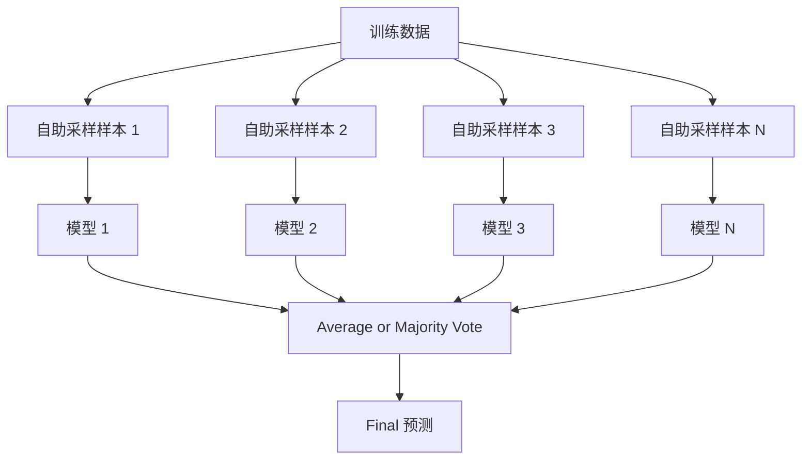
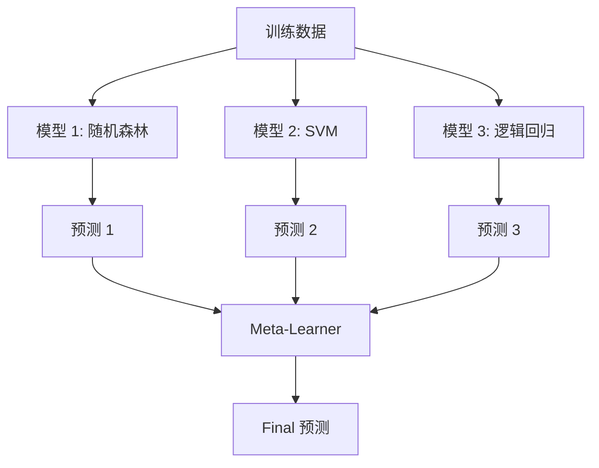

# 集成方法

> A group of weak learners, combined correctly, becomes a strong learner. This is not a metaphor. It is a theorem.

**Type:** 构建
**Language:** Python
**Prerequisites:** Phase 2, Lesson 10 (偏差-方差 Tradeoff)
**Time:** ~120 分钟

## 学习目标

- 实现 AdaBoost and gradient boosting 从零实现 and explain how boosting sequentially reduces 偏差
- 构建 a bagging 集成 and demonstrate how averaging decorrelated 模型 reduces 方差 without increasing 偏差
- 比较 bagging, boosting, and stacking in terms of what 误差 component each method targets
- 评估 集成 diversity and explain why majority voting 准确率 improves with more independent weak learners

## 问题

A single 决策树 is fast to train and easy to interpret, but it overfits. A single linear 模型 underfits on complex boundaries. You could spend days engineering the perfect 模型 architecture. Or you could combine a bunch of imperfect 模型 and get something better than any of them individually.

集成 methods do exactly this. They are the most reliable technique for winning Kaggle competitions on tabular data, they power most 生产环境 ML systems, and they illustrate the 偏差-方差 tradeoff in action. bagging reduces 方差. boosting reduces 偏差. stacking learns which 模型 to trust on which inputs.

## 概念

### 原因 Ensembles Work

Suppose you have N independent classifiers, each with 准确率 p > 0.5. The majority vote has 准确率:

```
P(majority correct) = sum over k > N/2 of C(N,k) * p^k * (1-p)^(N-k)
```

For 21 classifiers each with 60% 准确率, majority vote 准确率 is about 74%. With 101 classifiers, it rises to 84%. The 误差 cancel out when the 模型 make different mistakes.

The key requirement is **diversity**. If all 模型 make the same 误差, combining them helps nothing. Ensembles work because they produce diverse 模型 through:

- Different training subsets (bagging)
- Different 特征 subsets (随机森林)
- Sequential 误差 correction (boosting)
- Different 模型 families (stacking)

### bagging (Bootstrap Aggregating)

bagging creates diversity by training each 模型 on a different 自助采样样本 of the 训练数据.



A 自助采样样本 is drawn with replacement from the original data, same size as the original. About 63.2% of unique 样本 appear in each bootstrap. The remaining 36.8% (out-of-bag 样本) provide a free 验证集.

bagging reduces 方差 without increasing 偏差 much. Each individual 树 overfits to its 自助采样样本, but the 过拟合 is different for each 树, so averaging cancels out the noise.

**随机森林** are bagging with an extra twist: at each 划分, only a random subset of 特征 is considered. This forces even more diversity among 树. The typical number of candidate 特征 is `sqrt(n_features)` for 分类 and `n_features / 3` for 回归.

### boosting (Sequential 误差 Correction)

boosting trains 模型 sequentially. Each new 模型 focuses on the examples that previous 模型 got wrong.


boosting reduces 偏差. Each new 模型 corrects the systematic 误差 of the 集成 so far. The final 预测 is a weighted sum of all 模型, where better 模型 get higher 权重.

The tradeoff: boosting can overfit if you run too many rounds, because it keeps fitting harder examples, some of which may be noise.

### AdaBoost

AdaBoost (Adaptive boosting) was the first practical boosting algorithm. It works with any base learner, typically decision stumps (depth-1 树).

The algorithm:

```
1. Initialize sample weights: w_i = 1/N for all i

2. For t = 1 to T:
   a. Train weak learner h_t on weighted data
   b. Compute weighted error:
      err_t = sum(w_i * I(h_t(x_i) != y_i)) / sum(w_i)
   c. Compute model weight:
      alpha_t = 0.5 * ln((1 - err_t) / err_t)
   d. Update sample weights:
      w_i = w_i * exp(-alpha_t * y_i * h_t(x_i))
   e. Normalize weights to sum to 1

3. Final prediction: H(x) = sign(sum(alpha_t * h_t(x)))
```

模型 with lower 误差 get higher alpha. Misclassified 样本 get higher 权重 so the next 模型 focuses on them.

### Gradient boosting

Gradient boosting generalizes boosting to arbitrary loss functions. Instead of reweighting 样本, it fits each new 模型 to the 残差 (negative gradient of the loss) of the current 集成.

```
1. Initialize: F_0(x) = argmin_c sum(L(y_i, c))

2. For t = 1 to T:
   a. Compute pseudo-residuals:
      r_i = -dL(y_i, F_{t-1}(x_i)) / dF_{t-1}(x_i)
   b. Fit a tree h_t to the residuals r_i
   c. Find optimal step size:
      gamma_t = argmin_gamma sum(L(y_i, F_{t-1}(x_i) + gamma * h_t(x_i)))
   d. Update:
      F_t(x) = F_{t-1}(x) + learning_rate * gamma_t * h_t(x)

3. Final prediction: F_T(x)
```

For squared 误差 loss, the pseudo-残差 are just the actual 残差: `r_i = y_i - F_{t-1}(x_i)`. Each 树 literally fits the 误差 of the previous 集成.

The learning rate (shrinkage) controls how much each 树 contributes. Smaller learning rates require more 树 but generalize better. Typical values: 0.01 to 0.3.

### XGBoost: 原因 It Dominates Tabular Data

XGBoost (eXtreme Gradient boosting) is gradient boosting with engineering optimizations that make it fast, accurate, and resistant to 过拟合:

- **Regularized objective:** L1 and L2 penalties on 叶节点 权重 prevent individual 树 from being too confident
- **Second-order approximation:** Uses both first and second derivatives of the loss, giving better 划分 decisions
- **Sparsity-aware 划分:** Handles missing values natively by learning the best direction for missing data at each 划分
- **Column subsampling:** Like 随机森林, 样本 特征 at each 划分 for diversity
- **Weighted quantile sketch:** Efficiently finds 划分 points for continuous 特征 on distributed data
- **Cache-aware block structure:** Memory layout optimized for CPU cache lines

For tabular data, XGBoost (and its successor LightGBM) consistently outperforms neural networks. This is not changing anytime soon. If your data fits in a table with rows and columns, start with gradient boosting.

### stacking (Meta-Learning)

stacking uses the 预测 of multiple base 模型 as 特征 for a meta-learner.



The meta-learner learns which base 模型 to trust for which inputs. If the 随机森林 is better at certain regions and the SVM at others, the meta-learner will learn to route accordingly.

To avoid data leakage, base 模型 预测 must be generated via 交叉验证 on the 训练集. You never train base 模型 and generate meta-特征 on the same data.

### Voting

The simplest 集成. Just combine 预测 directly.

- **Hard voting:** Majority vote on class 标签.
- **Soft voting:** Average predicted 概率, pick the class with highest average 概率. Usually better because it uses confidence information.

## 动手构建

### Step 1: Decision Stump (Base Learner)

The code in `code/ensembles.py` implements everything 从零实现. We start with a decision stump: a 树 with a single 划分.

```python
class DecisionStump:
    def __init__(self):
        self.feature_idx = None
        self.threshold = None
        self.polarity = 1
        self.alpha = None

    def fit(self, X, y, weights):
        n_samples, n_features = X.shape
        best_error = float("inf")

        for f in range(n_features):
            thresholds = np.unique(X[:, f])
            for thresh in thresholds:
                for polarity in [1, -1]:
                    pred = np.ones(n_samples)
                    pred[polarity * X[:, f] < polarity * thresh] = -1
                    error = np.sum(weights[pred != y])
                    if error < best_error:
                        best_error = error
                        self.feature_idx = f
                        self.threshold = thresh
                        self.polarity = polarity

    def predict(self, X):
        n = X.shape[0]
        pred = np.ones(n)
        idx = self.polarity * X[:, self.feature_idx] < self.polarity * self.threshold
        pred[idx] = -1
        return pred
```

### Step 2: AdaBoost 从零实现

```python
class AdaBoostScratch:
    def __init__(self, n_estimators=50):
        self.n_estimators = n_estimators
        self.stumps = []
        self.alphas = []

    def fit(self, X, y):
        n = X.shape[0]
        weights = np.full(n, 1 / n)

        for _ in range(self.n_estimators):
            stump = DecisionStump()
            stump.fit(X, y, weights)
            pred = stump.predict(X)

            err = np.sum(weights[pred != y])
            err = np.clip(err, 1e-10, 1 - 1e-10)

            alpha = 0.5 * np.log((1 - err) / err)
            weights *= np.exp(-alpha * y * pred)
            weights /= weights.sum()

            stump.alpha = alpha
            self.stumps.append(stump)
            self.alphas.append(alpha)

    def predict(self, X):
        total = sum(a * s.predict(X) for a, s in zip(self.alphas, self.stumps))
        return np.sign(total)
```

### Step 3: Gradient boosting 从零实现

```python
class GradientBoostingScratch:
    def __init__(self, n_estimators=100, learning_rate=0.1, max_depth=3):
        self.n_estimators = n_estimators
        self.lr = learning_rate
        self.max_depth = max_depth
        self.trees = []
        self.initial_pred = None

    def fit(self, X, y):
        self.initial_pred = np.mean(y)
        current_pred = np.full(len(y), self.initial_pred)

        for _ in range(self.n_estimators):
            residuals = y - current_pred
            tree = SimpleRegressionTree(max_depth=self.max_depth)
            tree.fit(X, residuals)
            update = tree.predict(X)
            current_pred += self.lr * update
            self.trees.append(tree)

    def predict(self, X):
        pred = np.full(X.shape[0], self.initial_pred)
        for tree in self.trees:
            pred += self.lr * tree.predict(X)
        return pred
```

### Step 4: 比较 against sklearn

The code verifies that our from-scratch implementations produce similar 准确率 to sklearn's `AdaBoostClassifier` and `GradientBoostingClassifier`, and compares all methods side by side.

## 直接使用

### When to Use Each Method

| Method | Reduces | Best for | Watch out for |
|--------|---------|----------|---------------|
| bagging / 随机森林 | 方差 | Noisy data, many 特征 | Does not help with 偏差 |
| AdaBoost | 偏差 | Clean data, simple base learners | Sensitive to outliers and noise |
| Gradient boosting | 偏差 | Tabular data, competitions | Slow to train, easy to overfit without tuning |
| XGBoost / LightGBM | Both | 生产环境 tabular ML | Many 超参数 |
| stacking | Both | Getting last 1-2% 准确率 | Complex, risk of 过拟合 meta-learner |
| Voting | 方差 | Quick combination of diverse 模型 | Only helps if 模型 are diverse |

### The 生产环境 Stack for Tabular Data

For most tabular 预测 problems, this is the order to try:

1. **LightGBM or XGBoost** with default 参数
2. Tune n_estimators, learning_rate, max_depth, min_child_weight
3. If you need the last 0.5%, build a stacking 集成 with 3-5 diverse 模型
4. Use 交叉验证 throughout

Neural networks on tabular data are almost always worse than gradient boosting, despite continued research attempts. TabNet, 节点, and similar architectures occasionally match but rarely beat a well-tuned XGBoost.

## 交付成果

This lesson produces `outputs/prompt-ensemble-selector.md` -- a prompt that helps you pick the right 集成 method for a given 数据集. Describe your data (size, 特征 types, noise level, class balance) and the problem you are solving. The prompt walks through a decision checklist, recommends a method, suggests starting 超参数, and warns about common mistakes for that method. Also produces `outputs/skill-ensemble-builder.md` with the full selection guide.

## 练习

1. Modify the AdaBoost implementation to track training 准确率 after each round. Plot 准确率 vs. number of estimators. When does it converge?

2. 实现 a 随机森林 从零实现 by adding random 特征 subsampling to the 回归 树. Train 100 树 with `max_features=sqrt(n_features)` and average 预测. 比较 方差 reduction to a single 树.

3. In the gradient boosting implementation, add early stopping: track validation loss after each round and stop when it has not improved for 10 consecutive rounds. How many 树 does it actually need?

4. 构建 a stacking 集成 with three base 模型 (逻辑回归, 决策树, K 近邻) and a 逻辑回归 meta-learner. Use 5-fold 交叉验证 to generate meta-特征. 比较 to each base 模型 alone.

5. Run XGBoost on the same 数据集 with default 参数. 比较 its 准确率 to your from-scratch gradient boosting. Time both. How large is the speed difference?

## 关键术语

| 术语 | 常见说法 | 实际含义 |
|------|----------------|----------------------|
| bagging | "Train on random subsets" | Bootstrap aggregating: train 模型 on bootstrap 样本, average 预测 to reduce 方差 |
| boosting | "Focus on hard examples" | Train 模型 sequentially, each correcting 误差 of the 集成 so far, to reduce 偏差 |
| AdaBoost | "Reweight the data" | boosting via 样本 权重 updates; misclassified points get higher 权重 for the next learner |
| Gradient boosting | "Fit the 残差" | boosting via fitting each new 模型 to the negative gradient of the 损失函数 |
| XGBoost | "The Kaggle weapon" | Gradient boosting with 正则化, second-order optimization, and systems-level speed tricks |
| stacking | "模型 on top of 模型" | Use 预测 of base 模型 as input 特征 for a meta-learner |
| 随机森林 | "Many randomized 树" | bagging with 决策树, adding random 特征 subsampling at each 划分 for diversity |
| 集成 diversity | "Make different mistakes" | 模型 must be uncorrelated in their 误差 for the 集成 to improve over individuals |
| Out-of-bag 误差 | "Free validation" | 样本 not in a bootstrap draw (~36.8%) serve as a 验证集 without needing a holdout |

## 延伸阅读

- [Schapire & Freund: Boosting: Foundations and Algorithms](https://mitpress.mit.edu/9780262526036/) -- the book by AdaBoost's creators
- [Friedman: Greedy Function Approximation: A Gradient Boosting Machine (2001)](https://statweb.stanford.edu/~jhf/ftp/trebst.pdf) -- the original gradient boosting paper
- [Chen & Guestrin: XGBoost (2016)](https://arxiv.org/abs/1603.02754) -- the XGBoost paper
- [Wolpert: Stacked Generalization (1992)](https://www.sciencedirect.com/science/article/abs/pii/S0893608005800231) -- the original stacking paper
- [scikit-learn Ensemble Methods](https://scikit-learn.org/stable/modules/ensemble.html) -- practical reference
