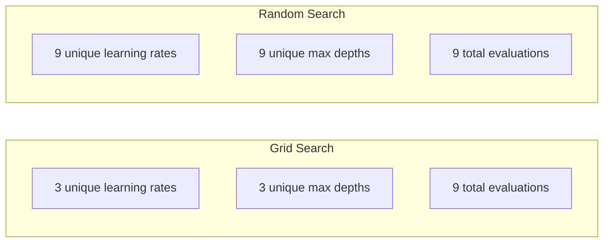
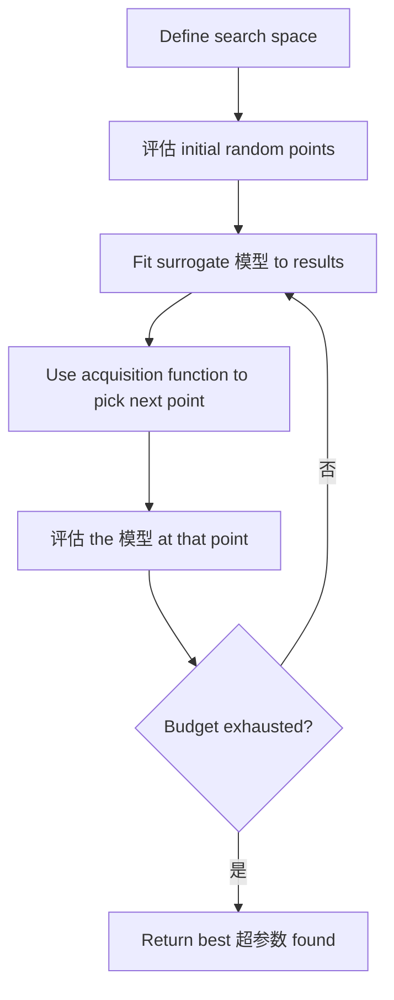
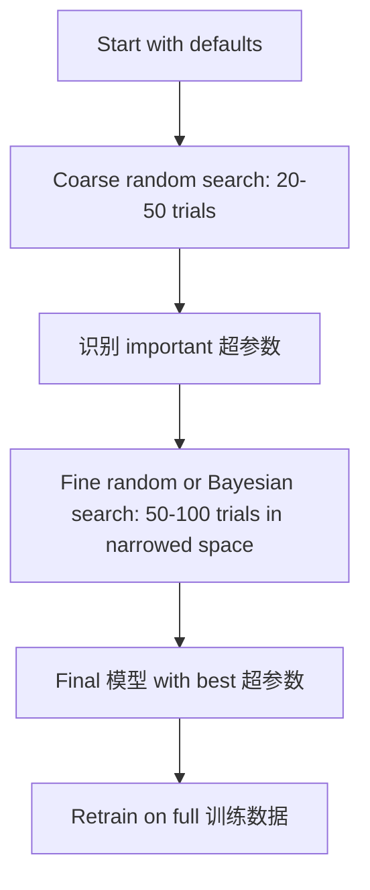
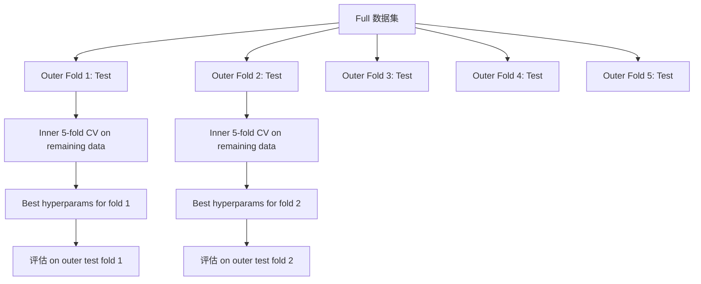

# 超参数调优

> 超参数 are the knobs you turn before training starts. Turning them well is the difference between a mediocre 模型 and a great one.

**Type:** 构建
**Language:** Python
**Prerequisites:** Phase 2, Lesson 11 (集成 Methods)
**Time:** ~90 分钟

## 学习目标

- 实现 grid search, random search, and Bayesian optimization 从零实现 and compare their 样本 efficiency
- 解释 why random search outperforms grid search when most 超参数 have low effective dimensionality
- 构建 a Bayesian optimization loop using a surrogate 模型 and acquisition function to guide the search
- Design a 超参数 tuning strategy that avoids 过拟合 the 验证集 through proper 交叉验证

## 问题

Your gradient boosting 模型 has a learning rate, number of 树, max depth, min 样本 per 叶节点, subsample ratio, and column 样本 ratio. That is six 超参数. If each has 5 reasonable values, the grid has 5^6 = 15,625 combinations. Training each takes 10 seconds. That is 43 hours of compute to try them all.

Grid search is the obvious approach and the worst one at scale. Random search does better with less compute. Bayesian optimization does even better by learning from past evaluations. Knowing which strategy to use, and which 超参数 actually matter, saves days of wasted GPU time.

## 概念

### 参数 vs 超参数

参数 are learned during training (权重, biases, 划分 thresholds). 超参数 are set before training starts and control how learning happens.

| 超参数 | What it controls | Typical range |
|---------------|-----------------|---------------|
| Learning rate | Step size per update | 0.001 to 1.0 |
| Number of 树/epochs | How long to train | 10 to 10,000 |
| Max depth | 模型 complexity | 1 to 30 |
| 正则化 (lambda) | 过拟合 prevention | 0.0001 to 100 |
| Batch size | Gradient estimation noise | 16 to 512 |
| Dropout rate | Fraction of neurons dropped | 0.0 to 0.5 |

### Grid Search

Grid search evaluates every combination of specified values. It is exhaustive and easy to understand, but scales exponentially with the number of 超参数.

```
Grid for 2 hyperparameters:

  learning_rate: [0.01, 0.1, 1.0]
  max_depth:     [3, 5, 7]

  Evaluations: 3 x 3 = 9 combinations

  (0.01, 3)  (0.01, 5)  (0.01, 7)
  (0.1,  3)  (0.1,  5)  (0.1,  7)
  (1.0,  3)  (1.0,  5)  (1.0,  7)
```

Grid search has a fundamental flaw: if one 超参数 matters and the other does not, most evaluations are wasted. You get only 3 unique values of the important 参数 from 9 evaluations.

### Random Search

Random search 样本 超参数 from distributions instead of a grid. With the same budget of 9 evaluations, you get 9 unique values of each 超参数.



原因 random beats grid (Bergstra & Bengio, 2012):

- Most 超参数 have low effective dimensionality. Only 1-2 of 6 超参数 usually matter for a given problem.
- Grid search wastes evaluations on unimportant dimensions.
- Random search covers the important dimensions more densely for the same budget.
- At 60 random trials, you have a 95% chance of finding a point within 5% of the optimum (if one exists in the search space).

### Bayesian Optimization

Random search ignores results. It does not learn that high learning rates cause divergence or that depth 3 consistently outperforms depth 10. Bayesian optimization uses past evaluations to decide where to search next.



The two key components:

**Surrogate 模型:** A cheap-to-evaluate 模型 (usually a Gaussian process) that approximates the expensive objective function. It gives both a 预测 and an uncertainty estimate at any point in the search space.

**Acquisition function:** Decides where to evaluate next by balancing exploitation (search near known good points) and exploration (search where uncertainty is high). Common choices:

- **Expected Improvement (EI):** How much improvement over the current best do we expect at this point?
- **Upper Confidence Bound (UCB):** 预测 plus a multiple of uncertainty. Higher UCB means either promising or unexplored.
- **概率 of Improvement (PI):** What is the 概率 this point beats the current best?

Bayesian optimization typically finds better 超参数 than random search with 2-5x fewer evaluations. The overhead of fitting the surrogate 模型 is negligible compared to training the actual 模型.

### Early Stopping

Not every training run needs to finish. If a configuration is clearly bad after 10 epochs, stop it and move on. This is early stopping in the context of 超参数 search.

Strategies:
- **Patience-based:** Stop if validation loss has not improved for N consecutive epochs
- **Median pruning:** Stop if the trial's intermediate result is worse than the median of completed trials at the same step
- **Hyperband:** Allocate small budgets to many configurations, then progressively increase budget for the best ones

Hyperband is particularly effective. It starts 81 configurations with 1 epoch each, keeps the top third, gives them 3 epochs, keeps the top third, and so on. This finds good configurations 10-50x faster than evaluating all configs for the full budget.

### Learning Rate Schedulers

The learning rate is almost always the most important 超参数. Rather than keeping it fixed, schedulers adjust it during training.

| Scheduler | Formula | When to use |
|-----------|---------|-------------|
| Step decay | Multiply by 0.1 every N epochs | Classic CNN training |
| 余弦 annealing | lr * 0.5 * (1 + cos(pi * t / T)) | Modern default |
| Warmup + decay | Linear increase then 余弦 decay | Transformers |
| One-cycle | Increase then decrease over one cycle | Fast convergence |
| Reduce on plateau | Reduce by factor when 指标 stalls | Safe default |

### 超参数 Importance

Not all 超参数 matter equally. Research on 随机森林 (Probst et al., 2019) and gradient boosting shows consistent patterns:

**High importance:**
- Learning rate (always tune first)
- Number of estimators / epochs (use early stopping instead of tuning)
- 正则化 strength

**Medium importance:**
- Max depth / number of layers
- Min 样本 per 叶节点 / 权重 decay
- Subsample ratio

**Low importance:**
- Max 特征 (for 随机森林)
- Specific activation function choice
- Batch size (within reasonable range)

Tune the important ones first, leave the rest at defaults.

### Practical Strategy



The concrete workflow:

1. **Start with library defaults.** They are chosen by experienced practitioners and are often 80% of the way there.
2. **Coarse random search.** Wide ranges, 20-50 trials. Use early stopping to kill bad runs fast.
3. **Analyze results.** Which 超参数 correlate with performance? Narrow the search space.
4. **Fine search.** Bayesian optimization or focused random search in the narrowed space. 50-100 trials.
5. **Retrain on all 训练数据** with the best 超参数 found.

### 交叉验证 Integration

Tuning 超参数 on a single validation 划分 is risky. The best 超参数 might overfit to the specific validation fold. Nested 交叉验证 solves this by using two loops:

- **Outer loop** (evaluation): 划分 data into train+val and test. Reports unbiased performance.
- **Inner loop** (tuning): 划分 train+val into train and val. Finds best 超参数.



Each outer fold finds its own best 超参数 independently. The outer scores are an unbiased estimate of 泛化 performance.

With sklearn:

```python
from sklearn.model_selection import cross_val_score, GridSearchCV
from sklearn.ensemble import GradientBoostingRegressor

inner_cv = GridSearchCV(
    GradientBoostingRegressor(),
    param_grid={
        "learning_rate": [0.01, 0.05, 0.1],
        "max_depth": [2, 3, 5],
        "n_estimators": [50, 100, 200],
    },
    cv=5,
    scoring="neg_mean_squared_error",
)

outer_scores = cross_val_score(
    inner_cv, X, y, cv=5, scoring="neg_mean_squared_error"
)

print(f"Nested CV MSE: {-outer_scores.mean():.4f} +/- {outer_scores.std():.4f}")
```

This is expensive (5 outer folds x 5 inner folds x 27 grid points = 675 模型 fits), but it gives you a trustworthy performance estimate. Use it when reporting final results in papers or when the stake of the decision is high.

### Practical Tips

**Start with the learning rate.** It is always the most important 超参数 for gradient-based methods. A bad learning rate makes everything else irrelevant. Fix other 超参数 at defaults and sweep learning rate first.

**Use log-uniform distributions for learning rate and 正则化.** The difference between 0.001 and 0.01 matters as much as the difference between 0.1 and 1.0. Searching linearly wastes budget on the large end.

**Use early stopping instead of tuning n_estimators.** For boosting and neural networks, set n_estimators or epochs high and let early stopping decide when to stop. This removes one 超参数 from the search.

**Budget allocation.** Spend 60% of your tuning budget on the top 2 most important 超参数. Spend the remaining 40% on everything else. The top 2 account for most of the performance variation.

**Scale matters.** Never search batch size on a log scale (16, 32, 64 are fine). Always search learning rate on a log scale. Match the search distribution to how the 超参数 affects the 模型.

| 模型 Type | Top 超参数 | Recommended Search | Budget |
|-----------|--------------------|--------------------|--------|
| 随机森林 | n_estimators, max_depth, min_samples_leaf | Random search, 50 trials | Low (fast training) |
| Gradient boosting | learning_rate, n_estimators, max_depth | Bayesian, 100 trials + early stopping | Medium |
| Neural Network | learning_rate, weight_decay, batch_size | Bayesian or random, 100+ trials | High (slow training) |
| SVM | C, gamma (RBF 核函数) | Grid on log scale, 25-50 trials | Low (2 params) |
| Lasso/Ridge | alpha | 1D search on log scale, 20 trials | Very low |
| XGBoost | learning_rate, max_depth, subsample, colsample | Bayesian, 100-200 trials + early stopping | Medium |

**When in doubt:** random search with 2x the number of 超参数 as trials (e.g., 6 超参数 = 12+ trials minimum). You will be surprised how often random search with 50 trials beats carefully designed grid search.

```figure
k-fold-cv
```

## 动手构建

### Step 1: Grid Search 从零实现

The code in `code/tuning.py` implements grid search, random search, and a simple Bayesian optimizer 从零实现.

```python
def grid_search(model_fn, param_grid, X_train, y_train, X_val, y_val):
    keys = list(param_grid.keys())
    values = list(param_grid.values())
    best_score = -float("inf")
    best_params = None
    n_evals = 0

    for combo in itertools.product(*values):
        params = dict(zip(keys, combo))
        model = model_fn(**params)
        model.fit(X_train, y_train)
        score = evaluate(model, X_val, y_val)
        n_evals += 1

        if score > best_score:
            best_score = score
            best_params = params

    return best_params, best_score, n_evals
```

### Step 2: Random Search 从零实现

```python
def random_search(model_fn, param_distributions, X_train, y_train,
                  X_val, y_val, n_iter=50, seed=42):
    rng = np.random.RandomState(seed)
    best_score = -float("inf")
    best_params = None

    for _ in range(n_iter):
        params = {k: sample(v, rng) for k, v in param_distributions.items()}
        model = model_fn(**params)
        model.fit(X_train, y_train)
        score = evaluate(model, X_val, y_val)

        if score > best_score:
            best_score = score
            best_params = params

    return best_params, best_score, n_iter
```

### Step 3: Bayesian Optimization (Simplified)

The core idea: fit a Gaussian process to observed (超参数, score) pairs, then use an acquisition function to decide where to look next.

```python
class SimpleBayesianOptimizer:
    def __init__(self, search_space, n_initial=5):
        self.search_space = search_space
        self.n_initial = n_initial
        self.X_observed = []
        self.y_observed = []

    def _kernel(self, x1, x2, length_scale=1.0):
        dists = np.sum((x1[:, None, :] - x2[None, :, :]) ** 2, axis=2)
        return np.exp(-0.5 * dists / length_scale ** 2)

    def _fit_gp(self, X_new):
        X_obs = np.array(self.X_observed)
        y_obs = np.array(self.y_observed)
        y_mean = y_obs.mean()
        y_centered = y_obs - y_mean

        K = self._kernel(X_obs, X_obs) + 1e-4 * np.eye(len(X_obs))
        K_star = self._kernel(X_new, X_obs)

        L = np.linalg.cholesky(K)
        alpha = np.linalg.solve(L.T, np.linalg.solve(L, y_centered))
        mu = K_star @ alpha + y_mean

        v = np.linalg.solve(L, K_star.T)
        var = 1.0 - np.sum(v ** 2, axis=0)
        var = np.maximum(var, 1e-6)

        return mu, var

    def _expected_improvement(self, mu, var, best_y):
        sigma = np.sqrt(var)
        z = (mu - best_y) / (sigma + 1e-10)
        ei = sigma * (z * norm_cdf(z) + norm_pdf(z))
        return ei

    def suggest(self):
        if len(self.X_observed) < self.n_initial:
            return sample_random(self.search_space)

        candidates = [sample_random(self.search_space) for _ in range(500)]
        X_cand = np.array([to_vector(c) for c in candidates])
        mu, var = self._fit_gp(X_cand)
        ei = self._expected_improvement(mu, var, max(self.y_observed))
        return candidates[np.argmax(ei)]

    def observe(self, params, score):
        self.X_observed.append(to_vector(params))
        self.y_observed.append(score)
```

The GP surrogate gives two things at each candidate point: a predicted score (mu) and an uncertainty (var). Expected Improvement balances these: it favors points where the 模型 predicts high scores OR where uncertainty is high. Early on, most points have high uncertainty so the optimizer explores. Later, it focuses on the most promising region.

### Step 4: 比较 All Methods

Run all three methods on the same synthetic objective and compare. This comparison uses a simplified wrapper that calls each optimizer with a direct objective function (no 模型 training), so the API differs from the 模型-based implementations above:

```python
def synthetic_objective(params):
    lr = params["learning_rate"]
    depth = params["max_depth"]
    return -(np.log10(lr) + 2) ** 2 - (depth - 4) ** 2 + 10

param_grid = {
    "learning_rate": [0.001, 0.01, 0.1, 1.0],
    "max_depth": [2, 3, 4, 5, 6, 7, 8],
}

grid_best = None
grid_score = -float("inf")
grid_history = []
for combo in itertools.product(*param_grid.values()):
    params = dict(zip(param_grid.keys(), combo))
    score = synthetic_objective(params)
    grid_history.append((params, score))
    if score > grid_score:
        grid_score = score
        grid_best = params

param_dist = {
    "learning_rate": ("log_float", 0.001, 1.0),
    "max_depth": ("int", 2, 8),
}

rand_best = None
rand_score = -float("inf")
rand_history = []
rng = np.random.RandomState(42)
for _ in range(28):
    params = {k: sample(v, rng) for k, v in param_dist.items()}
    score = synthetic_objective(params)
    rand_history.append((params, score))
    if score > rand_score:
        rand_score = score
        rand_best = params

optimizer = SimpleBayesianOptimizer(param_dist, n_initial=5)
bayes_history = []
for _ in range(28):
    params = optimizer.suggest()
    score = synthetic_objective(params)
    optimizer.observe(params, score)
    bayes_history.append((params, score))
bayes_score = max(s for _, s in bayes_history)

print(f"{'Method':<20} {'Best Score':>12} {'Evaluations':>12}")
print("-" * 50)
print(f"{'Grid Search':<20} {grid_score:>12.4f} {len(grid_history):>12}")
print(f"{'Random Search':<20} {rand_score:>12.4f} {len(rand_history):>12}")
print(f"{'Bayesian Opt':<20} {bayes_score:>12.4f} {len(bayes_history):>12}")
```

With the same budget, Bayesian optimization usually finds the best score fastest because it does not waste evaluations in clearly bad regions. Random search covers more ground than grid search. Grid search only wins when you have very few 超参数 and can afford to be exhaustive.

## 直接使用

### Optuna in Practice

Optuna is the recommended library for serious 超参数 tuning. It supports pruning, distributed search, and visualization out of the box.

```python
import optuna

def objective(trial):
    lr = trial.suggest_float("learning_rate", 1e-4, 1e-1, log=True)
    n_est = trial.suggest_int("n_estimators", 50, 500)
    max_depth = trial.suggest_int("max_depth", 2, 10)

    model = GradientBoostingRegressor(
        learning_rate=lr,
        n_estimators=n_est,
        max_depth=max_depth,
    )
    model.fit(X_train, y_train)
    return mean_squared_error(y_val, model.predict(X_val))

study = optuna.create_study(direction="minimize")
study.optimize(objective, n_trials=100)

print(f"Best params: {study.best_params}")
print(f"Best MSE: {study.best_value:.4f}")
```

Key Optuna 特征:
- `suggest_float(..., log=True)` for 参数 best searched on log scale (learning rate, 正则化)
- `suggest_int` for integer 参数
- `suggest_categorical` for discrete choices
- Built-in MedianPruner for early stopping of bad trials
- `study.trials_dataframe()` for analysis

### Optuna with Pruning

Pruning stops unpromising trials early, saving massive compute. Here is the pattern:

```python
import optuna
from sklearn.model_selection import cross_val_score

def objective(trial):
    params = {
        "learning_rate": trial.suggest_float("lr", 1e-4, 0.5, log=True),
        "max_depth": trial.suggest_int("max_depth", 2, 10),
        "n_estimators": trial.suggest_int("n_estimators", 50, 500),
        "subsample": trial.suggest_float("subsample", 0.5, 1.0),
    }

    model = GradientBoostingRegressor(**params)
    scores = cross_val_score(model, X_train, y_train, cv=3,
                             scoring="neg_mean_squared_error")
    mean_score = -scores.mean()

    trial.report(mean_score, step=0)
    if trial.should_prune():
        raise optuna.TrialPruned()

    return mean_score

pruner = optuna.pruners.MedianPruner(n_startup_trials=10, n_warmup_steps=5)
study = optuna.create_study(direction="minimize", pruner=pruner)
study.optimize(objective, n_trials=200)
```

The `MedianPruner` stops a trial if its intermediate value is worse than the median of all completed trials at the same step. Pruning requires calling `trial.report()` to report intermediate 指标 and `trial.should_prune()` to check whether the trial should be stopped. The `n_startup_trials=10` ensures at least 10 trials complete fully before pruning kicks in. This typically saves 40-60% of total compute.

### sklearn's Built-in Tuners

For quick experiments, sklearn provides `GridSearchCV`, `RandomizedSearchCV`, and `HalvingRandomSearchCV`:

```python
from sklearn.model_selection import RandomizedSearchCV
from scipy.stats import loguniform, randint

param_dist = {
    "learning_rate": loguniform(1e-4, 0.5),
    "max_depth": randint(2, 10),
    "n_estimators": randint(50, 500),
}

search = RandomizedSearchCV(
    GradientBoostingRegressor(),
    param_dist,
    n_iter=100,
    cv=5,
    scoring="neg_mean_squared_error",
    random_state=42,
    n_jobs=-1,
)
search.fit(X_train, y_train)
print(f"Best params: {search.best_params_}")
print(f"Best CV MSE: {-search.best_score_:.4f}")
```

Use `loguniform` from scipy for learning rate and 正则化. Use `randint` for integer 超参数. The `n_jobs=-1` flag parallelizes across all CPU cores.

### Common Mistakes in 超参数 Tuning

**Data leakage through preprocessing.** If you fit a scaler on the full 数据集 before 交叉验证, information from the validation fold leaks into training. Always put preprocessing inside a `Pipeline` so it is fit only on the training fold.

**过拟合 to the 验证集.** Running thousands of trials effectively trains on the 验证集. Use nested 交叉验证 for final performance estimates, or hold out a separate 测试集 that you never touch during tuning.

**Searching too narrow a range.** If your best value is at the boundary of your search space, you have not searched widely enough. The optimal value might be outside your range. Always check if the best 参数 are at the edges.

**Ignoring interaction effects.** Learning rate and number of estimators interact strongly in boosting. A low learning rate needs more estimators. Tuning them independently gives worse results than tuning them together.

**Not using early stopping for iterative 模型.** For gradient boosting and neural networks, set n_estimators or epochs to a high value and use early stopping. This is strictly better than tuning the number of iterations as a 超参数.

## 练习

1. Run grid search and random search with the same total budget (e.g., 50 evaluations). 比较 the best scores found. Run the experiment 10 times with different seeds. How often does random search win?

2. 实现 Hyperband 从零实现. Start with 81 configurations, each trained for 1 epoch. Keep the top 1/3 at each round and triple their budget. 比较 total compute (sum of all epochs across all configs) to running 81 configs for the full budget.

3. Add a learning rate scheduler (余弦 annealing) to the gradient boosting implementation from Lesson 11. Does it help compared to a fixed learning rate?

4. Use Optuna to tune a RandomForestClassifier on a real 数据集 (e.g., sklearn's breast cancer 数据集). Use `optuna.visualization.plot_param_importances(study)` to see which 超参数 matter most. Does it match the importance ranking from this lesson?

5. 实现 a simple acquisition function (Expected Improvement) and demonstrate exploration vs exploitation. Plot the surrogate 模型's mean and uncertainty, and show where EI chooses to evaluate next.

## 关键术语

| 术语 | 常见说法 | 实际含义 |
|------|----------------|----------------------|
| 超参数 | "A setting you choose" | A value set before training that controls the learning process, not learned from data |
| Grid search | "Try every combination" | Exhaustive search over a specified 参数 grid. Exponential cost. |
| Random search | "Just 样本 randomly" | 样本 超参数 from distributions. Covers important dimensions better than grid search. |
| Bayesian optimization | "Smart search" | Uses a surrogate 模型 of the objective to decide where to evaluate next, balancing exploration and exploitation |
| Surrogate 模型 | "A cheap approximation" | A 模型 (usually Gaussian process) that approximates the expensive objective function from observed evaluations |
| Acquisition function | "Where to look next" | Scores candidate points by balancing expected improvement with uncertainty. EI and UCB are common choices. |
| Early stopping | "Stop wasting time" | Terminate training early when validation performance stops improving |
| Hyperband | "Tournament bracket for configs" | Adaptive resource allocation: start many configs with small budgets, keep the best and increase their budgets |
| Learning rate scheduler | "Change lr during training" | A function that adjusts the learning rate over the course of training for better convergence |

## 延伸阅读

- [Bergstra & Bengio: Random Search for Hyper-Parameter Optimization (2012)](https://jmlr.org/papers/v13/bergstra12a.html) -- the paper that showed random beats grid
- [Snoek et al., Practical Bayesian Optimization of Machine Learning Algorithms (2012)](https://arxiv.org/abs/1206.2944) -- Bayesian optimization for ML
- [Li et al., Hyperband: A Novel Bandit-Based Approach (2018)](https://jmlr.org/papers/v18/16-558.html) -- the Hyperband paper
- [Optuna: A Next-generation Hyperparameter Optimization Framework](https://arxiv.org/abs/1907.10902) -- the Optuna paper
- [Probst et al., Tunability: Importance of Hyperparameters (2019)](https://jmlr.org/papers/v20/18-444.html) -- which 超参数 matter
