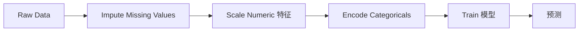
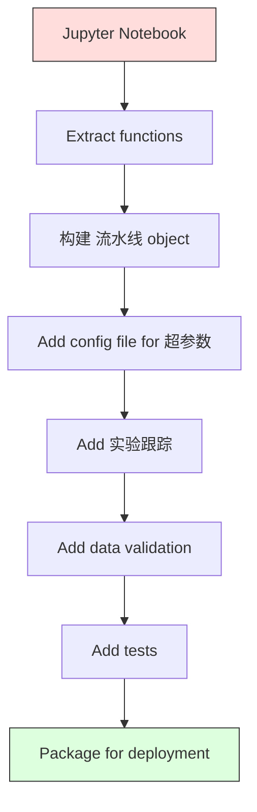

# ML Pipelines

> A 模型 is not a product. A 流水线 is. The 流水线 is everything from raw data to deployed 预测, and every step must be reproducible.

**Type:** 构建
**Language:** Python
**Prerequisites:** Phase 2, Lesson 12 (超参数 Tuning)
**Time:** ~120 分钟

## 学习目标

- 构建 an ML 流水线 从零实现 that chains imputation, scaling, encoding, and 模型 training into a single reproducible object
- 识别 data leakage scenarios and explain how pipelines prevent them by fitting transformers only on 训练数据
- Construct a ColumnTransformer that applies different preprocessing to numeric and categorical 特征
- 实现 流水线 serialization and demonstrate that the same fitted 流水线 produces identical results in training and 生产环境

## 问题

You have a notebook that loads data, fills missing values with the median, scales 特征, trains a 模型, and prints 准确率. It works. You ship it.

A month later, someone retrains the 模型 and gets different results. The median was computed on the full 数据集 including 测试数据 (data leakage). The scaling 参数 were not saved, so inference uses different statistics. The 特征工程 code was copy-pasted between training and serving, and the copies diverged. A categorical column gained a new value in 生产环境 that the encoder has never seen.

These are not hypothetical. They are the most common reasons ML systems fail in 生产环境. Pipelines solve all of them by packaging every transformation step into a single, ordered, reproducible object.

## 概念

### What a 流水线 Is

A 流水线 is an ordered sequence of data transformations followed by a 模型. Each step takes the output of the previous step as input. The entire 流水线 is fitted once on 训练数据. At inference time, the same fitted 流水线 transforms new data and produces 预测.



The 流水线 guarantees:
- Transformations are fitted only on 训练数据 (no leakage)
- The same transformations are applied at inference time
- The entire object can be serialized and deployed as one artifact
- 交叉验证 applies the 流水线 per fold, preventing subtle leakage

### Data Leakage: The Silent Killer

Data leakage happens when information from the 测试集 or future data contaminates training. Pipelines prevent the most common forms.

**Leaky (wrong):**
```python
X = df.drop("target", axis=1)
y = df["target"]

scaler = StandardScaler()
X_scaled = scaler.fit_transform(X)

X_train, X_test = X_scaled[:800], X_scaled[800:]
y_train, y_test = y[:800], y[800:]
```

The scaler saw 测试数据. The mean and standard deviation include test 样本. This inflates 准确率 estimates.

**Correct:**
```python
X_train, X_test = X[:800], X[800:]

scaler = StandardScaler()
X_train_scaled = scaler.fit_transform(X_train)
X_test_scaled = scaler.transform(X_test)
```

With a 流水线, you do not need to think about this. The 流水线 handles it automatically.

### sklearn 流水线

sklearn's `Pipeline` chains transformers and an estimator. It exposes `.fit()`, `.predict()`, and `.score()` that apply all steps in order.

```python
from sklearn.pipeline import Pipeline
from sklearn.preprocessing import StandardScaler
from sklearn.linear_model import LogisticRegression

pipe = Pipeline([
    ("scaler", StandardScaler()),
    ("model", LogisticRegression()),
])

pipe.fit(X_train, y_train)
predictions = pipe.predict(X_test)
```

When you call `pipe.fit(X_train, y_train)`:
1. Scaler calls `fit_transform` on X_train
2. 模型 calls `fit` on the scaled X_train

When you call `pipe.predict(X_test)`:
1. Scaler calls `transform` (not fit_transform) on X_test
2. 模型 calls `predict` on the scaled X_test

The scaler never sees 测试数据 during fitting. This is the whole point.

### ColumnTransformer: Different Pipelines for Different Columns

Real 数据集 have numeric and categorical columns that need different preprocessing. `ColumnTransformer` handles this.

```python
from sklearn.compose import ColumnTransformer
from sklearn.preprocessing import StandardScaler, OneHotEncoder
from sklearn.impute import SimpleImputer

numeric_pipe = Pipeline([
    ("impute", SimpleImputer(strategy="median")),
    ("scale", StandardScaler()),
])

categorical_pipe = Pipeline([
    ("impute", SimpleImputer(strategy="most_frequent")),
    ("encode", OneHotEncoder(handle_unknown="ignore")),
])

preprocessor = ColumnTransformer([
    ("num", numeric_pipe, ["age", "income", "score"]),
    ("cat", categorical_pipe, ["city", "gender", "plan"]),
])

full_pipeline = Pipeline([
    ("preprocess", preprocessor),
    ("model", GradientBoostingClassifier()),
])
```

The `handle_unknown="ignore"` in OneHotEncoder is critical for 生产环境. When a new category appears (a city the 模型 has never seen), it produces a zero vector instead of crashing.

### 实验跟踪

A 流水线 makes training reproducible, but you also need to track what happened across experiments: which 超参数 were used, which 数据集 version, what the 指标 were, which code was running.

**MLflow** is the most common open-source solution:

```python
import mlflow

with mlflow.start_run():
    mlflow.log_param("max_depth", 5)
    mlflow.log_param("n_estimators", 100)
    mlflow.log_param("learning_rate", 0.1)

    pipe.fit(X_train, y_train)
    accuracy = pipe.score(X_test, y_test)

    mlflow.log_metric("accuracy", accuracy)
    mlflow.sklearn.log_model(pipe, "model")
```

Every run is recorded with 参数, 指标, artifacts, and the full 模型. You can compare runs, reproduce any experiment, and deploy any 模型 version.

**权重 & Biases (wandb)** provides the same functionality with a hosted dashboard:

```python
import wandb

wandb.init(project="my-pipeline")
wandb.config.update({"max_depth": 5, "n_estimators": 100})

pipe.fit(X_train, y_train)
accuracy = pipe.score(X_test, y_test)

wandb.log({"accuracy": accuracy})
```

### 模型 Versioning

After 实验跟踪, you need to manage 模型 versions. Which 模型 is in 生产环境? Which is staging? Which was last week's?

MLflow's 模型 Registry provides:
- **Version tracking:** Every saved 模型 gets a version number
- **Stage transitions:** "Staging", "生产环境", "Archived"
- **Approval workflow:** 模型 must be explicitly promoted to 生产环境
- **Rollback:** Switch back to a previous version instantly

### Data Versioning with DVC

Code is versioned with git. Data should be versioned too, but git cannot handle large files. DVC (Data Version Control) solves this.

```
dvc init
dvc add data/training.csv
git add data/training.csv.dvc data/.gitignore
git commit -m "Track training data"
dvc push
```

DVC stores the actual data in remote storage (S3, GCS, Azure) and keeps a small `.dvc` file in git that records the hash. When you checkout a git commit, `dvc checkout` restores the exact data that was used.

This means every git commit pins both the code and the data. Full reproducibility.

### Reproducible Experiments

A reproducible experiment requires four things:

1. **Fixed random seeds:** Set seeds for numpy, random, and the framework (torch, sklearn)
2. **Pinned dependencies:** requirements.txt or poetry.lock with exact versions
3. **Versioned data:** DVC or similar
4. **Config files:** All 超参数 in a config, not hardcoded

```python
import numpy as np
import random

def set_seed(seed=42):
    random.seed(seed)
    np.random.seed(seed)
    try:
        import torch
        torch.manual_seed(seed)
        torch.cuda.manual_seed_all(seed)
        torch.backends.cudnn.deterministic = True
    except ImportError:
        pass
```

### From Notebook to 生产环境 流水线



The typical progression:

1. **Notebook exploration:** Quick experiments, visualizations, 特征 ideas
2. **Extract functions:** Move preprocessing, 特征工程, evaluation into modules
3. **构建 流水线:** Chain transformations into a sklearn 流水线 or custom class
4. **Config management:** Move all 超参数 into a YAML/JSON config
5. **实验跟踪:** Add MLflow or wandb logging
6. **Data validation:** Check schema, distributions, and missing value patterns before training
7. **Tests:** Unit tests for transformers, integration tests for the full 流水线
8. **Deployment:** Serialize the 流水线, wrap in an API (FastAPI, Flask), containerize

### Common 流水线 Mistakes

| Mistake | 原因 it is bad | Fix |
|---------|-------------|-----|
| Fitting on full data before splitting | Data leakage | Use 流水线 with cross_val_score |
| 特征工程 outside 流水线 | Different transforms at train vs serve | Put all transforms in the 流水线 |
| Not handling unknown categories | 生产环境 crash on new values | OneHotEncoder(handle_unknown="ignore") |
| Hardcoded column names | Breaks when schema changes | Use column name lists from config |
| 否 data validation | Silently wrong 预测 on bad data | Add schema checks before 预测 |
| Training/serving skew | 模型 sees different 特征 in prod | One 流水线 object for both |

## 动手构建

The code in `code/pipeline.py` builds a complete ML 流水线 从零实现:

### Step 1: Custom Transformer

```python
class CustomTransformer:
    def __init__(self):
        self.means = None
        self.stds = None

    def fit(self, X):
        self.means = np.mean(X, axis=0)
        self.stds = np.std(X, axis=0)
        self.stds[self.stds == 0] = 1.0
        return self

    def transform(self, X):
        return (X - self.means) / self.stds

    def fit_transform(self, X):
        return self.fit(X).transform(X)
```

### Step 2: 流水线 从零实现

```python
class PipelineFromScratch:
    def __init__(self, steps):
        self.steps = steps

    def fit(self, X, y=None):
        X_current = X.copy()
        for name, step in self.steps[:-1]:
            X_current = step.fit_transform(X_current)
        name, model = self.steps[-1]
        model.fit(X_current, y)
        return self

    def predict(self, X):
        X_current = X.copy()
        for name, step in self.steps[:-1]:
            X_current = step.transform(X_current)
        name, model = self.steps[-1]
        return model.predict(X_current)
```

### Step 3: 交叉验证 with 流水线

The code demonstrates how 交叉验证 with a 流水线 prevents data leakage: the scaler is fit separately on each fold's 训练数据.

### Step 4: Full 生产环境 流水线 with sklearn

A complete 流水线 with `ColumnTransformer`, multiple preprocessing paths, and a 模型, trained with proper 交叉验证 and experiment logging.

## 交付成果

本课产出：
- `outputs/prompt-ml-pipeline.md` -- a skill for building and debugging ML pipelines
- `code/pipeline.py` -- a complete 流水线 从零实现 through sklearn

## 练习

1. 构建 a 流水线 that handles a 数据集 with 3 numeric columns and 2 categorical columns. Use `ColumnTransformer` to apply median imputation + scaling to numerics and most-frequent imputation + one-hot encoding to categoricals. Train with 5-fold 交叉验证.

2. Deliberately introduce data leakage: fit the scaler on the full 数据集 before splitting. 比较 the 交叉验证 score (leaky) to the 流水线 交叉验证 score (clean). How large is the difference?

3. Serialize your 流水线 with `joblib.dump`. Load it in a separate script and run 预测. Verify the 预测 are identical.

4. Add a custom transformer to the 流水线 that creates polynomial 特征 (degree 2) for the two most important numeric columns. Where should it go in the 流水线?

5. Set up MLflow tracking for the 流水线. Run 5 experiments with different 超参数. Use the MLflow UI (`mlflow ui`) to compare runs and pick the best 模型.

## 关键术语

| 术语 | 常见说法 | 实际含义 |
|------|----------------|----------------------|
| 流水线 | "Chain of transforms + 模型" | An ordered sequence of fitted transformers and a 模型, applied as one unit to prevent leakage |
| Data leakage | "Test info leaked into training" | Using information from outside the 训练集 to build the 模型, inflating performance estimates |
| ColumnTransformer | "Different preprocessing per column" | Applies different pipelines to different subsets of columns, combining results |
| 实验跟踪 | "Logging your runs" | Recording 参数, 指标, artifacts, and code versions for every training run |
| MLflow | "Track and deploy 模型" | Open-source platform for 实验跟踪, 模型 registry, and deployment |
| DVC | "Git for data" | Version control system for large data files, storing hashes in git and data in remote storage |
| 模型 registry | "模型 version catalog" | A system that tracks 模型 versions with stage 标签 (staging, 生产环境, archived) |
| Training/serving skew | "It worked in the notebook" | Differences between how data is processed during training versus inference, causing silent 误差 |
| Reproducibility | "Same code, same result" | The ability to get identical results from the same code, data, and configuration |

## 延伸阅读

- [scikit-learn Pipeline docs](https://scikit-learn.org/stable/modules/compose.html) -- the official 流水线 reference
- [MLflow documentation](https://mlflow.org/docs/latest/index.html) -- 实验跟踪 and 模型 registry
- [DVC documentation](https://dvc.org/doc) -- data versioning
- [Sculley et al., Hidden Technical Debt in Machine Learning Systems (2015)](https://papers.nips.cc/paper/2015/hash/86df7dcfd896fcaf2674f757a2463eba-Abstract.html) -- the seminal paper on ML systems complexity
- [Google ML Best Practices: Rules of ML](https://developers.google.com/machine-learning/guides/rules-of-ml) -- practical 生产环境 ML advice
