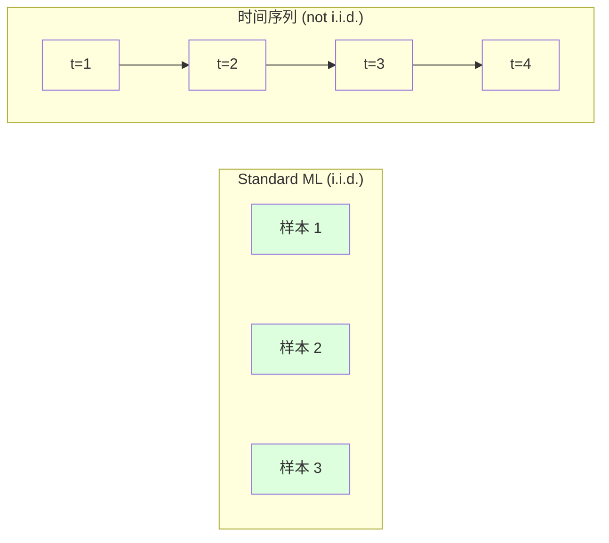
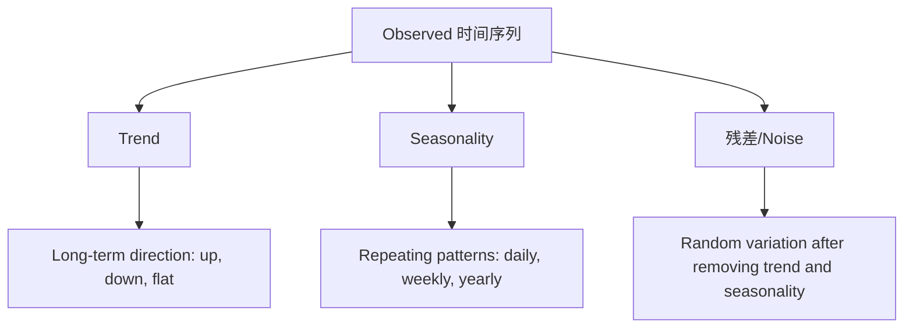
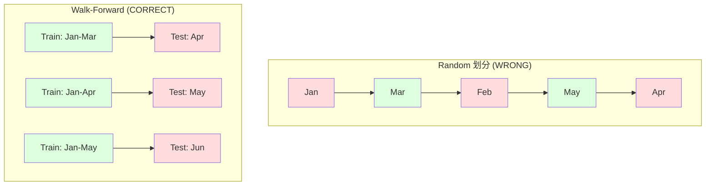

# 时间序列基础

> Past performance does predict future results -- if you check for stationarity first.

**Type:** 构建
**Language:** Python
**Prerequisites:** Phase 2, Lessons 01-09
**Time:** ~90 分钟

## 学习目标

- Decompose a 时间序列 into trend, seasonality, and 残差 components and test for stationarity
- 实现 lag 特征 and rolling statistics to convert a 时间序列 into a 监督学习 problem
- 构建 a walk-forward validation framework that prevents future data from leaking into training
- 解释 why random train/test 划分 are invalid for 时间序列 and demonstrate the performance gap versus proper temporal 划分

## 问题

You have data ordered by time. Daily sales, hourly temperature, per-分钟 CPU usage, weekly stock prices. You want to predict the next value, the next week, the next quarter.

You reach for your standard ML toolkit: random train/test 划分, 交叉验证, 特征 matrix in, 预测 out. Every step is wrong.

时间序列 breaks the assumptions that standard ML relies on. 样本 are not independent -- today's temperature depends on yesterday's. Random 划分 leak future information into the past. 特征 that look great in backtest fail in 生产环境 because they rely on patterns that shift over time.

A 模型 that gets 95% 准确率 with random 交叉验证 might get 55% with proper time-based evaluation. The difference is not a technicality. It is the difference between a 模型 that works on paper and one that works in 生产环境.

This lesson covers the fundamentals: what makes time data different, how to evaluate 模型 honestly, and how to turn a 时间序列 into 特征 that standard ML 模型 can consume.

## 概念

### What Makes 时间序列 Different

Standard ML assumes i.i.d. -- independent and identically distributed. Each 样本 is drawn from the same distribution, independently of other 样本. 时间序列 violates both:

- **Not independent.** Today's stock price depends on yesterday's. This week's sales correlate with last week's.
- **Not identically distributed.** The distribution shifts over time. Sales in December look different from sales in March.

These violations are not minor. They change how you build 特征, how you evaluate 模型, and which algorithms work.



In standard ML, 样本 are interchangeable. Shuffling them changes nothing. In 时间序列, order is everything. Shuffling destroys the signal.

### Components of a 时间序列

Every 时间序列 is a combination of:



- **Trend**: The long-term direction. Revenue growing 10% per year. Global temperature rising.
- **Seasonality**: Repeating patterns at fixed intervals. Retail sales spike in December. Air conditioning usage peaks in July.
- **残差**: Whatever is left after removing trend and seasonality. If the 残差 looks like white noise, the decomposition captured the signal.

### Stationarity

A 时间序列 is stationary if its statistical properties (mean, 方差, autocorrelation) do not change over time. Most forecasting methods assume stationarity.

**原因 it matters:** A non-stationary series has a mean that drifts. A 模型 trained on data from January has learned a different mean than what February will show. It will be systematically wrong.

**How to check:** 计算 rolling mean and rolling standard deviation over windows. If they drift, the series is non-stationary.

**How to fix:** Differencing. Instead of modeling the raw values, 模型 the change between consecutive values:

```
diff[t] = value[t] - value[t-1]
```

If one round of differencing does not make the series stationary, apply it again (second-order differencing). Most real-world series need at most two rounds.

**Example:**

Original series: [100, 102, 106, 112, 120]
First difference:  [2, 4, 6, 8] (still trending upward)
Second difference:  [2, 2, 2] (constant -- stationary)

The original series had a quadratic trend. First differencing turned it into a linear trend. Second differencing made it flat. In practice, you rarely need more than two rounds.

**Formal test:** The Augmented Dickey-Fuller (ADF) test is the standard statistical test for stationarity. The null hypothesis is "the series is non-stationary." A p-value below 0.05 means you can reject the null and conclude stationarity. We do not implement ADF 从零实现 (it requires asymptotic distribution tables), but the rolling statistics approach in our code gives a practical visual check.

### Autocorrelation

Autocorrelation measures how much a value at time t correlates with the value at time t-k (k steps in the past). The autocorrelation function (ACF) plots this correlation for each lag k.

**ACF tells you:**
- How far back the series remembers. If ACF drops to zero after lag 5, values more than 5 steps ago are irrelevant.
- Whether seasonality exists. If ACF spikes at lag 12 (monthly data), there is yearly seasonality.
- How many lag 特征 to create. Use lags up to where ACF becomes negligible.

**PACF (Partial Autocorrelation Function)** removes indirect correlations. If today correlates with 3 days ago only because both correlate with yesterday, PACF at lag 3 will be zero while ACF at lag 3 will not.

### Lag 特征: Turning 时间序列 into 监督学习

Standard ML 模型 need a 特征 matrix X and a 目标 y. 时间序列 gives you a single column of values. The bridge is lag 特征.

Take the series [10, 12, 14, 13, 15] and create lag-1 and lag-2 特征:

| lag_2 | lag_1 | 目标 |
|-------|-------|--------|
| 10    | 12    | 14     |
| 12    | 14    | 13     |
| 14    | 13    | 15     |

Now you have a standard 回归 problem. Any ML 模型 (线性回归, 随机森林, gradient boosting) can predict the 目标 from the lags.

Additional 特征 you can engineer:
- **Rolling statistics:** mean, std, min, max over the last k values
- **Calendar 特征:** day of week, month, is_holiday, is_weekend
- **Differenced values:** change from previous step
- **Expanding statistics:** cumulative mean, cumulative sum
- **Ratio 特征:** current value / rolling mean (how far from recent average)
- **Interaction 特征:** lag_1 * day_of_week (weekday effects on momentum)

**How many lags?** Use the autocorrelation function. If ACF is significant up to lag 10, use at least 10 lags. If there is weekly seasonality, include lag 7 (and possibly 14). More lags give the 模型 more history but also more 特征 to fit, increasing the risk of 过拟合.

**The 目标 alignment trap.** When creating lag 特征, the 目标 must be the value at time t, and all 特征 must use values at time t-1 or earlier. If you accidentally include the value at time t as a 特征, you have a perfect predictor -- and a completely useless 模型. This is the most common bug in 时间序列 特征工程.

### Walk-Forward Validation

This is the most important concept in this lesson. Standard k-fold 交叉验证 randomly assigns 样本 to train and test. For 时间序列, this leaks future information.



Walk-forward validation:
1. Train on data up to time t
2. Predict at time t+1 (or t+1 to t+k for multi-step)
3. Slide the window forward
4. Repeat

Each test fold only contains data that comes after all 训练数据. 否 future leakage. This gives you an honest estimate of how the 模型 will perform when deployed.

**Expanding window** uses all historical data for training (window grows). **Sliding window** uses a fixed-size training window (window slides). Use expanding when you believe older data is still relevant. Use sliding when the world changes and old data hurts.

### ARIMA Intuition

ARIMA is the classical 时间序列 模型. It has three components:

- **AR (Autoregressive):** Predict from past values. AR(p) uses the last p values.
- **I (Integrated):** Differencing to achieve stationarity. I(d) applies d rounds of differencing.
- **MA (Moving Average):** Predict from past forecast 误差. MA(q) uses the last q 误差.

ARIMA(p, d, q) combines all three. You choose p, d, q based on ACF/PACF analysis or automated search (auto-ARIMA).

We will not implement ARIMA 从零实现 -- it requires numerical optimization that is beyond the scope of this lesson. The key insight is understanding what each component does so you can interpret ARIMA results and know when to use it.

### When to Use What

| Approach | Best For | Handles Seasonality | Handles External 特征 |
|----------|---------|-------------------|------------------------|
| Lag 特征 + ML | Tabular with many external 特征 | With calendar 特征 | 是 |
| ARIMA | Single univariate series, short-term | SARIMA variant | 否 (ARIMAX for limited) |
| Exponential smoothing | Simple trend + seasonality | 是 (Holt-Winters) | 否 |
| Prophet | Business forecasting, holidays | 是 (Fourier terms) | Limited |
| Neural networks (LSTM, Transformer) | Long sequences, many series | Learned | 是 |

For most practical problems, lag 特征 + gradient boosting is the strongest starting point. It handles external 特征 naturally, does not require stationarity, and is easy to debug.

### Forecasting Horizons and Strategies

Single-step forecasting predicts one time step ahead. Multi-step forecasting predicts multiple steps. There are three strategies:

**Recursive (iterated):** Predict one step ahead, use the 预测 as input for the next step. Simple but 误差 accumulate -- each 预测 uses the previous 预测, so mistakes compound.

**Direct:** Train a separate 模型 for each horizon. 模型-1 predicts t+1, 模型-5 predicts t+5. 否 误差 accumulation, but each 模型 has fewer training 样本 and they do not share information.

**Multi-output:** Train one 模型 that outputs all horizons simultaneously. Shares information across horizons but requires a 模型 that supports multiple outputs (or a custom 损失函数).

For most practical problems, start with recursive for short horizons (1-5 steps) and direct for longer horizons.

### Common Mistakes in 时间序列

| Mistake | 原因 it happens | How to fix |
|---------|---------------|-----------|
| Random train/test 划分 | Habit from standard ML | Use walk-forward or temporal 划分 |
| Using future 特征 | 特征 at time t included by mistake | Audit every 特征 for temporal alignment |
| 过拟合 to seasonality | 模型 memorizes calendar patterns | Hold out a full seasonal cycle in the 测试集 |
| Ignoring scale changes | Revenue doubles but patterns stay | 模型 percentage change instead of absolute |
| Too many lag 特征 | "More history is better" | Use ACF to determine relevant lags |
| Not differencing | "The 模型 will figure it out" | 树 模型 handle trends; linear 模型 need stationarity |

## 动手构建

The code in `code/time_series.py` implements the core building blocks 从零实现.

### Lag 特征 Creator

```python
def make_lag_features(series, n_lags):
    n = len(series)
    X = np.full((n, n_lags), np.nan)
    for lag in range(1, n_lags + 1):
        X[lag:, lag - 1] = series[:-lag]
    valid = ~np.isnan(X).any(axis=1)
    return X[valid], series[valid]
```

This converts a 1D series into a 特征 matrix where each row has the last `n_lags` values as 特征, and the current value as the 目标.

### Walk-Forward 交叉验证

```python
def walk_forward_split(n_samples, n_splits=5, min_train=50):
    assert min_train < n_samples, "min_train must be less than n_samples"
    step = max(1, (n_samples - min_train) // n_splits)
    for i in range(n_splits):
        train_end = min_train + i * step
        test_end = min(train_end + step, n_samples)
        if train_end >= n_samples:
            break
        yield slice(0, train_end), slice(train_end, test_end)
```

Each 划分 ensures 训练数据 comes strictly before 测试数据. The training window expands with each fold.

### Simple Autoregressive 模型

A pure AR 模型 is just 线性回归 on lag 特征:

```python
class SimpleAR:
    def __init__(self, n_lags=5):
        self.n_lags = n_lags
        self.weights = None
        self.bias = None

    def fit(self, series):
        X, y = make_lag_features(series, self.n_lags)
        # Solve via normal equations
        X_b = np.column_stack([np.ones(len(X)), X])
        theta = np.linalg.lstsq(X_b, y, rcond=None)[0]
        self.bias = theta[0]
        self.weights = theta[1:]
        return self
```

This is conceptually identical to 线性回归 from Lesson 02, but applied to time-lagged versions of the same variable.

### Stationarity Check

The code computes rolling statistics to visually and numerically assess stationarity:

```python
def check_stationarity(series, window=50):
    rolling_mean = np.array([
        series[max(0, i - window):i].mean()
        for i in range(1, len(series) + 1)
    ])
    rolling_std = np.array([
        series[max(0, i - window):i].std()
        for i in range(1, len(series) + 1)
    ])
    return rolling_mean, rolling_std
```

If the rolling mean drifts or the rolling std changes, the series is non-stationary. Apply differencing and check again.

The code also checks stationarity by comparing the first half and second half of the series. If the means differ by more than half a standard deviation or the 方差 ratio exceeds 2x, the series is flagged as non-stationary.

### Autocorrelation

```python
def autocorrelation(series, max_lag=20):
    n = len(series)
    mean = series.mean()
    var = series.var()
    acf = np.zeros(max_lag + 1)
    for k in range(max_lag + 1):
        cov = np.mean((series[:n-k] - mean) * (series[k:] - mean))
        acf[k] = cov / var if var > 0 else 0
    return acf
```

## 直接使用

With sklearn, you use lag 特征 directly with any regressor:

```python
from sklearn.linear_model import Ridge
from sklearn.ensemble import GradientBoostingRegressor

X, y = make_lag_features(series, n_lags=10)

for train_idx, test_idx in walk_forward_split(len(X)):
    model = Ridge(alpha=1.0)
    model.fit(X[train_idx], y[train_idx])
    predictions = model.predict(X[test_idx])
```

For ARIMA, use statsmodels:

```python
from statsmodels.tsa.arima.model import ARIMA

model = ARIMA(train_series, order=(5, 1, 2))
fitted = model.fit()
forecast = fitted.forecast(steps=30)
```

The code in `time_series.py` demonstrates both approaches and compares them using walk-forward validation.

### sklearn TimeSeriesSplit

sklearn provides `TimeSeriesSplit` which implements walk-forward validation:

```python
from sklearn.model_selection import TimeSeriesSplit

tscv = TimeSeriesSplit(n_splits=5)
for train_index, test_index in tscv.split(X):
    X_train, X_test = X[train_index], X[test_index]
    y_train, y_test = y[train_index], y[test_index]
    model.fit(X_train, y_train)
    score = model.score(X_test, y_test)
```

This is equivalent to our from-scratch `walk_forward_split` but integrated into sklearn's 交叉验证 framework. You can use it with `cross_val_score`:

```python
from sklearn.model_selection import cross_val_score

scores = cross_val_score(model, X, y, cv=TimeSeriesSplit(n_splits=5))
print(f"Mean score: {scores.mean():.4f} +/- {scores.std():.4f}")
```

### 评估指标

时间序列 forecasting uses 回归 指标, but with time-aware context:

- **MAE (Mean Absolute 误差):** Average of |y_true - y_pred|. Easy to interpret in original units. "On average, 预测 are off by 3.2 degrees."
- **RMSE (Root 均方误差):** Square root of 均方误差. Penalizes large 误差 more than MAE. Use when big 误差 are worse than many small 误差.
- **MAPE (Mean Absolute Percentage 误差):** Average of |误差 / true_value| * 100. Scale-independent, useful for comparing across different series. But undefined when true values are zero.
- **Naive 基线 comparison:** Always compare against simple baselines. The seasonal naive 基线 predicts the value from one period ago (yesterday, last week). If your 模型 cannot beat naive, something is wrong.

### Rolling 特征

The code demonstrates adding rolling statistics (mean, std, min, max over windows of 7 and 14 days) to lag 特征. These give the 模型 information about recent trends and volatility that lag 特征 alone do not capture.

For example, if the rolling mean is rising, it suggests an upward trend. If the rolling std is increasing, it suggests growing volatility. These are the kinds of patterns that 树-based 模型 can learn from but linear 模型 cannot.

## 交付成果

本课产出：
- `outputs/prompt-time-series-advisor.md` -- a prompt for framing 时间序列 problems
- `code/time_series.py` -- lag 特征, walk-forward validation, AR 模型, stationarity checks

### Baselines You Must Beat

Before building any 模型, establish baselines:

1. **Last value (persistence).** Predict that tomorrow will be the same as today. For many series, this is surprisingly hard to beat.
2. **Seasonal naive.** Predict that today will be the same as the same day last week (or last year). If your 模型 cannot beat this, it has not learned any useful pattern beyond seasonality.
3. **Moving average.** Predict the average of the last k values. Smooths noise but cannot capture sudden changes.

If your fancy ML 模型 loses to the seasonal naive 基线, you have a bug. Most commonly: future leakage in 特征, wrong evaluation method, or the series is truly random and unpredictable.

### Practical Tips

1. **Start with plotting.** Before any modeling, plot the raw series. Look for trends, seasonality, outliers, structural breaks (sudden changes in behavior). A 30-second visual inspection often tells you more than an hour of automated analysis.

2. **Difference first, 模型 second.** If the series has a clear trend, difference it before creating lag 特征. 树-based 模型 can handle trends, but linear 模型 cannot, and differencing never hurts.

3. **Hold out at least one full seasonal cycle.** If you have weekly seasonality, your 测试集 needs at least one full week. If monthly, at least one full month. Otherwise you cannot evaluate whether the 模型 captured the seasonal pattern.

4. **Monitor in 生产环境.** 时间序列 模型 degrade over time as the world changes. Track 预测 误差 on a rolling basis. When 误差 start increasing, retrain the 模型 on recent data.

5. **Beware of regime changes.** A 模型 trained on pre-pandemic data will not predict post-pandemic behavior. Include indicators of known regime changes as 特征, or use a sliding window that forgets old data.

6. **Log-transform skewed series.** Revenue, prices, and counts are often right-skewed. Taking the log stabilizes 方差 and makes multiplicative patterns additive, which linear 模型 can handle. Forecast in log space, then exponentiate to get back to original units.

## 练习

1. **Stationarity experiment.** 生成 a series with a linear trend. Check stationarity with rolling statistics. Apply first differencing. Check again. How many rounds of differencing does it take for a quadratic trend?

2. **Lag selection.** 计算 ACF on a seasonal series (period=7). Which lags have the highest autocorrelation? 创建 lag 特征 using only those lags (not consecutive lags). Does 准确率 improve compared to using lags 1 through 7?

3. **Walk-forward vs random 划分.** Train a Ridge 回归 on lag 特征. 评估 with random 80/20 划分 and with walk-forward validation. How much does the random 划分 overestimate performance?

4. **特征工程.** Add rolling mean (window=7), rolling std (window=7), and day-of-week 特征 to the lag 特征. 比较 准确率 with and without these extras using walk-forward validation.

5. **Multi-step forecasting.** Modify the AR 模型 to predict 5 steps ahead instead of 1. 比较 two strategies: (a) predict one step, use the 预测 as input for the next step (recursive), and (b) train separate 模型 for each horizon (direct). Which is more accurate?

## 关键术语

| 术语 | 常见说法 | 实际含义 |
|------|----------------|----------------------|
| Stationarity | "The stats don't change over time" | A series whose mean, 方差, and autocorrelation structure are constant over time |
| Differencing | "Subtract consecutive values" | Computing y[t] - y[t-1] to remove trends and achieve stationarity |
| Autocorrelation (ACF) | "How a series correlates with itself" | The correlation between a 时间序列 and a lagged copy of itself, as a function of the lag |
| Partial autocorrelation (PACF) | "Direct correlation only" | Autocorrelation at lag k after removing the effect of all shorter lags |
| Lag 特征 | "Past values as inputs" | Using y[t-1], y[t-2], ..., y[t-k] as 特征 to predict y[t] |
| Walk-forward validation | "Time-respecting 交叉验证" | Evaluation where 训练数据 always precedes 测试数据 chronologically |
| ARIMA | "The classic 时间序列 模型" | AutoRegressive Integrated Moving Average: combines past values (AR), differencing (I), and past 误差 (MA) |
| Seasonality | "Repeating calendar patterns" | Regular, predictable cycles in a 时间序列 tied to calendar periods (daily, weekly, yearly) |
| Trend | "The long-term direction" | A persistent increase or decrease in the series level over time |
| Expanding window | "Use all history" | Walk-forward validation where the 训练集 grows with each fold |
| Sliding window | "Fixed-size history" | Walk-forward validation where the 训练集 is a fixed-length window that slides forward |

## 延伸阅读

- [Hyndman and Athanasopoulos, Forecasting: Principles and Practice (3rd ed.)](https://otexts.com/fpp3/) -- the best free textbook on 时间序列 forecasting
- [scikit-learn Time Series Split](https://scikit-learn.org/stable/modules/generated/sklearn.model_selection.TimeSeriesSplit.html) -- sklearn's walk-forward splitter
- [statsmodels ARIMA docs](https://www.statsmodels.org/stable/generated/statsmodels.tsa.arima.model.ARIMA.html) -- ARIMA implementation with diagnostics
- [Makridakis et al., The M5 Competition (2022)](https://www.sciencedirect.com/science/article/pii/S0169207021001874) -- large-scale forecasting competition showing ML methods vs statistical methods
