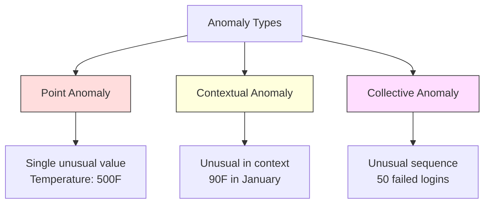
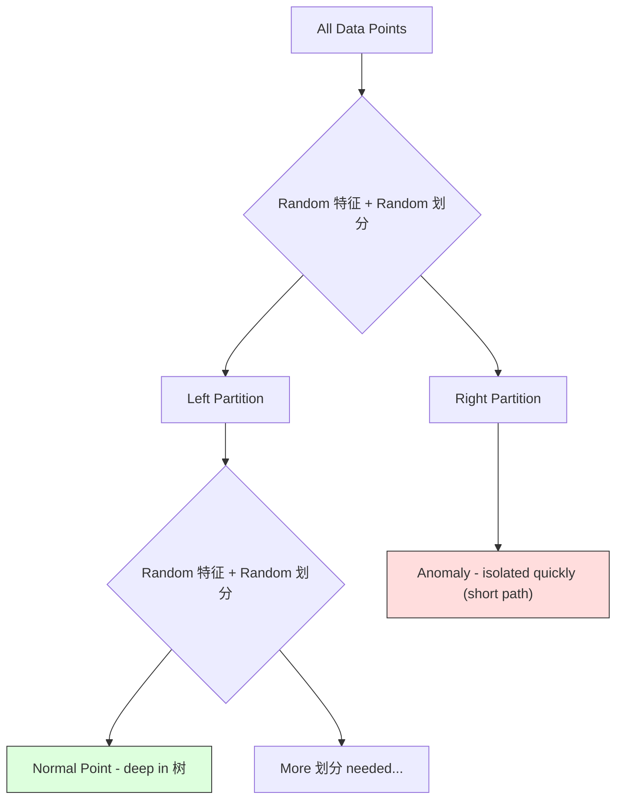
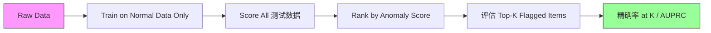

# 异常检测

> Normal is easy to define. Abnormal is whatever doesn't fit.

**Type:** 构建
**Language:** Python
**Prerequisites:** Phase 2, Lessons 01-09
**Time:** ~75 分钟

## 学习目标

- 实现 Z-score, IQR, and Isolation Forest 异常检测 methods 从零实现
- Distinguish between point, contextual, and collective anomalies and select the appropriate detection method for each
- 解释 why 异常检测 is framed as modeling normal data rather than classifying anomalies
- 比较 unsupervised 异常检测 with supervised 分类 and evaluate the tradeoff between novel anomaly coverage and 精确率

## 问题

A credit card is used in New York at 2pm, then in Tokyo at 2:05pm. A factory sensor reads 150 degrees when the normal range is 80-120. A server sends 50,000 requests per second when the daily average is 200.

These are anomalies. Finding them matters. Fraud costs billions. Equipment failures cost downtime. Network intrusions cost data.

The challenge: you rarely have labeled examples of anomalies. Fraud makes up 0.1% of transactions. Equipment failures happen a few times per year. You cannot train a standard classifier because there is almost nothing in the "anomaly" class to learn from. Even if you have some 标签, the anomalies you have seen are not the only types you will encounter. Tomorrow's fraud scheme looks different from today's.

异常检测 flips the problem. Instead of learning what is abnormal, learn what is normal. Anything that deviates from normal is suspicious. This works without 标签, adapts to new types of anomalies, and scales to massive 数据集.

## 概念

### Types of Anomalies

Not all anomalies are the same:

- **Point anomalies.** A single data point that is unusual regardless of context. A temperature reading of 500 degrees. A transaction of $50,000 from an account that normally spends $50.
- **Contextual anomalies.** A data point that is unusual given its context. A temperature of 90 degrees is normal in summer, anomalous in winter. Same value, different context.
- **Collective anomalies.** A sequence of data points that is unusual as a group, even though each individual point might be normal. Five login failures is normal. Fifty in a row is a brute-force attack.

Most methods detect point anomalies. Contextual anomalies need time or location 特征. Collective anomalies need sequence-aware methods.



### The Unsupervised Framing

In standard 分类, you have 标签 for both classes. In 异常检测, you typically have one of three situations:

1. **Fully unsupervised.** 否 标签 at all. You fit the detector on all data and hope anomalies are rare enough not to corrupt the "normal" 模型.
2. **Semi-supervised.** You have a clean 数据集 of normal data only. You fit on this clean set and score everything else. This is the strongest setup when possible.
3. **Weakly supervised.** You have a few labeled anomalies. Use them for evaluation, not training. Train unsupervised, then measure 精确率/召回率 on the labeled subset.

The key insight: 异常检测 is fundamentally different from 分类. You are modeling the distribution of normal data, not the 决策边界 between two classes.

### Supervised vs Unsupervised: The Tradeoff

If you do have labeled anomalies, should you use them for training (supervised 分类) or for evaluation only (unsupervised detection)?

**Supervised (treat as 分类):**
- Catches the exact types of anomalies you have seen before
- Higher 精确率 on known anomaly types
- Misses novel anomaly types entirely
- Requires retraining when new anomaly types emerge
- Needs enough anomaly examples (often too few)

**Unsupervised (模型 normal, flag deviations):**
- Catches any deviation from normal, including novel types
- Does not require labeled anomalies
- Higher false positive rate (not everything unusual is bad)
- More robust to distribution shift

In practice, the best systems combine both: unsupervised detection for broad coverage, supervised 模型 for known high-priority anomaly types, and human review for ambiguous cases.

### Z-Score Method

The simplest approach. 计算 the mean and standard deviation of each 特征. Flag any point more than k standard deviations from the mean.

```text
z_score = (x - mean) / std
anomaly if |z_score| > threshold
```

The default 阈值 is 3.0 (99.7% of normal data falls within 3 standard deviations for a Gaussian distribution).

**Strengths:** Simple. Fast. Interpretable ("this value is 4.5 standard deviations from normal").

**Weaknesses:** Assumes data is normally distributed. Sensitive to outliers in the 训练数据 (the outliers shift the mean and inflate the std, making them harder to detect). Fails on multimodal distributions.

**When it works well:** Single-特征 monitoring where data is roughly bell-shaped. Server response times, manufacturing tolerances, sensor readings with stable baselines.

**When it fails:** Multi-cluster data (two office locations with different 基线 temperatures), skewed data (transaction amounts where $1000 is rare but not anomalous), data with outliers in the 训练集.

### IQR Method

More robust than Z-score. Uses the interquartile range instead of mean and standard deviation.

```
Q1 = 25th percentile
Q3 = 75th percentile
IQR = Q3 - Q1
lower_bound = Q1 - factor * IQR
upper_bound = Q3 + factor * IQR
anomaly if x < lower_bound or x > upper_bound
```

The default factor is 1.5.

**Strengths:** Robust to outliers (percentiles are not affected by extreme values). Works on skewed distributions. 否 normality assumption.

**Weaknesses:** Univariate only (applies per 特征 independently). Cannot detect anomalies that are unusual only when 特征 are considered together (a point might be normal in each 特征 individually but anomalous in the joint space).

**Practical note:** The 1.5 factor in IQR corresponds to the whiskers in a box plot. Points outside the whiskers are potential outliers. Using 3.0 instead of 1.5 makes the detector more conservative (fewer flags, fewer false positives). The right factor depends on your tolerance for false alarms.

### Isolation Forest

The key insight: anomalies are few and different. In a random partitioning of the data, anomalies are easier to isolate -- they need fewer random 划分 to be separated from the rest.



**How it works:**
1. 构建 many random 树 (an isolation forest)
2. At each 节点, pick a random 特征 and a random 划分 value between the 特征's min and max
3. Keep splitting until every point is isolated (in its own 叶节点)
4. Anomalies have shorter average path lengths across all 树

**原因 it works:** Normal points live in dense regions. Many random 划分 are needed to isolate one from its neighbors. Anomalies live in sparse regions. One or two random 划分 are enough to isolate them.

The anomaly score is based on the average path length across all 树, normalized by the expected path length of a random binary search 树:

```
score(x) = 2^(-average_path_length(x) / c(n))
```

Where `c(n)` is the expected path length for n 样本. Score near 1 means anomaly. Score near 0.5 means normal. Score near 0 means very normal (deep in dense clusters).

**Strengths:** 否 distribution assumptions. Works in high dimensions. Scales well (sublinear in 样本 size because each 树 uses a subsample). Handles mixed 特征 types.

**Weaknesses:** Struggles with anomalies in dense regions (masking effect). Random splitting is less effective when many 特征 are irrelevant.

**Key 超参数:**
- `n_estimators`: Number of 树. 100 is usually enough. More 树 give more stable scores but slower computation.
- `max_samples`: Number of 样本 per 树. 256 is the default in the original paper. Smaller values make individual 树 less accurate but increase diversity. The subsampling is what makes Isolation Forest fast -- each 树 sees a small fraction of the data.
- `contamination`: Expected fraction of anomalies. Used only for setting the 阈值. Does not affect the scores themselves.

### Local Outlier 因素 (LOF)

LOF compares the local density around a point to the density around its neighbors. A point in a sparse region surrounded by dense regions is anomalous.

**How it works:**
1. For each point, find its k nearest neighbors
2. 计算 the local reachability density (how dense is the neighborhood)
3. 比较 each point's density to its neighbors' densities
4. If a point has much lower density than its neighbors, it is an outlier

**LOF score:**
- LOF close to 1.0 means similar density as neighbors (normal)
- LOF greater than 1.0 means lower density than neighbors (potentially anomalous)
- LOF much greater than 1.0 (e.g., 2.0+) means significantly lower density (likely anomaly)

The "local" part is critical. Consider a 数据集 with two clusters: a dense cluster of 1000 points and a sparse cluster of 50 points. A point on the edge of the sparse cluster is not globally unusual -- it has 50 neighbors. But it is locally unusual if its immediate neighbors are denser than it is. LOF captures this nuance that global methods miss.

**Strengths:** Detects local anomalies (points that are unusual in their neighborhood, even if they are not globally unusual). Works on clusters of different densities.

**Weaknesses:** Slow on large 数据集 (O(n^2) for naive implementation). Sensitive to the choice of k. Does not work well in very high dimensions (curse of dimensionality affects 距离 calculations).

### Comparison

| Method | Assumptions | Speed | Handles High Dims | Detects Local Anomalies |
|--------|------------|-------|-------------------|------------------------|
| Z-score | Normal distribution | Very fast | 是 (per 特征) | 否 |
| IQR | None (per 特征) | Very fast | 是 (per 特征) | 否 |
| Isolation Forest | None | Fast | 是 | Partially |
| LOF | 距离 is meaningful | Slow | Poorly | 是 |

### Evaluation Challenges

Evaluating anomaly detectors is harder than evaluating classifiers:

- **Extreme class imbalance.** With 0.1% anomalies, predicting "normal" for everything gives 99.9% 准确率. 准确率 is useless.
- **AUROC is misleading.** With heavy imbalance, AUROC can look good even when the 模型 misses most anomalies at practical thresholds.
- **Better 指标:** 精确率@k (of the top k flagged items, how many are real anomalies), AUPRC (area under 精确率-召回率 curve), and 召回率 at a fixed false positive rate.



### 异常检测 流水线

In practice, 异常检测 follows this workflow:

1. **Collect 基线 data.** Ideally, a period where you know there are no (or very few) anomalies.
2. **特征工程.** Raw 特征 plus derived 特征 (rolling statistics, time 特征, ratios).
3. **Train the detector.** Fit on the 基线 data. The 模型 learns what "normal" looks like.
4. **Score new data.** Each new observation gets an anomaly score.
5. **阈值 selection.** 选择 the score cutoff. This is a business decision: higher 阈值 means fewer false alarms but more missed anomalies.
6. **Alert and investigate.** Flagged points go to human review or automated response.
7. **Feedback collection.** Record whether flagged items were true anomalies or false alarms. Use this data to evaluate the detector and tune the 阈值 over time.

The 流水线 is never "done." Data distributions shift, new anomaly types emerge, and thresholds need adjustment. Treat 异常检测 as a living system, not a one-time 模型.

## 动手构建

The code in `code/anomaly_detection.py` implements Z-score, IQR, and Isolation Forest 从零实现.

### Z-Score Detector

```python
def zscore_detect(X, threshold=3.0):
    mean = X.mean(axis=0)
    std = X.std(axis=0)
    std[std == 0] = 1.0
    z = np.abs((X - mean) / std)
    return z.max(axis=1) > threshold
```

Simple and vectorized. Flags a point if any 特征 exceeds the 阈值.

### IQR Detector

```python
def iqr_detect(X, factor=1.5):
    q1 = np.percentile(X, 25, axis=0)
    q3 = np.percentile(X, 75, axis=0)
    iqr = q3 - q1
    iqr[iqr == 0] = 1.0
    lower = q1 - factor * iqr
    upper = q3 + factor * iqr
    outside = (X < lower) | (X > upper)
    return outside.any(axis=1)
```

### Isolation Forest 从零实现

The from-scratch implementation builds isolation 树 that randomly partition the 特征 space:

```python
class IsolationTree:
    def __init__(self, max_depth):
        self.max_depth = max_depth

    def fit(self, X, depth=0):
        n, p = X.shape
        if depth >= self.max_depth or n <= 1:
            self.is_leaf = True
            self.size = n
            return self
        self.is_leaf = False
        self.feature = np.random.randint(p)
        x_min = X[:, self.feature].min()
        x_max = X[:, self.feature].max()
        if x_min == x_max:
            self.is_leaf = True
            self.size = n
            return self
        self.threshold = np.random.uniform(x_min, x_max)
        left_mask = X[:, self.feature] < self.threshold
        self.left = IsolationTree(self.max_depth).fit(X[left_mask], depth + 1)
        self.right = IsolationTree(self.max_depth).fit(X[~left_mask], depth + 1)
        return self
```

The path length to isolate a point determines its anomaly score. Shorter paths mean more anomalous.

The `IsolationForest` class wraps multiple 树:

```python
class IsolationForest:
    def __init__(self, n_estimators=100, max_samples=256, seed=42):
        self.n_estimators = n_estimators
        self.max_samples = max_samples

    def fit(self, X):
        sample_size = min(self.max_samples, X.shape[0])
        max_depth = int(np.ceil(np.log2(sample_size)))
        for _ in range(self.n_estimators):
            idx = rng.choice(X.shape[0], size=sample_size, replace=False)
            tree = IsolationTree(max_depth=max_depth)
            tree.fit(X[idx])
            self.trees.append(tree)

    def anomaly_score(self, X):
        avg_path = average path length across all trees
        scores = 2.0 ** (-avg_path / c(max_samples))
        return scores
```

The normalization factor `c(n)` is the expected path length of an unsuccessful search in a binary search 树 with n elements. It equals `2 * H(n-1) - 2*(n-1)/n` where `H` is the harmonic number. This normalization ensures scores are comparable across 数据集 of different sizes.

### Demo Scenarios

The code generates multiple test scenarios:

1. **Single cluster with outliers.** A 2D Gaussian cluster with anomalies injected far from the center. All methods should work here.
2. **Multimodal data.** Three clusters of different sizes and densities. Points between clusters are anomalous. Z-score struggles because the per-特征 ranges are wide.
3. **High-dimensional data.** 50 特征, but anomalies differ in only 5 of them. Tests whether methods can find anomalies in a subset of 特征.

Each demo compares all methods using 精确率, 召回率, F1, and 精确率@k.

## 直接使用

With sklearn (using library implementations, not from-scratch):

```python
from sklearn.ensemble import IsolationForest
from sklearn.neighbors import LocalOutlierFactor

iso = IsolationForest(n_estimators=100, contamination=0.05, random_state=42)
iso.fit(X_train)
predictions = iso.predict(X_test)

lof = LocalOutlierFactor(n_neighbors=20, contamination=0.05, novelty=True)
lof.fit(X_train)
predictions = lof.predict(X_test)
```

Note `contamination` sets the expected fraction of anomalies. Setting it correctly matters -- too low misses anomalies, too high creates false alarms.

The code in `anomaly_detection.py` compares from-scratch implementations against sklearn on the same data.

### sklearn Contamination 参数

The `contamination` 参数 in sklearn determines the 阈值 for converting continuous anomaly scores into binary 预测. It does not change the underlying scores.

```python
iso_5 = IsolationForest(contamination=0.05)
iso_10 = IsolationForest(contamination=0.10)
```

Both produce the same anomaly scores. But `iso_5` flags the top 5% while `iso_10` flags the top 10%. If you do not know the true anomaly rate (you usually do not), set contamination to "auto" and work with the raw scores directly. Set your own 阈值 based on the cost tradeoff between false positives and false negatives.

### One-Class SVM

Another unsupervised anomaly detector worth knowing. One-Class SVM fits a boundary around normal data in a high-dimensional 特征 space (using the 核函数 trick).

```python
from sklearn.svm import OneClassSVM

oc_svm = OneClassSVM(kernel="rbf", gamma="auto", nu=0.05)
oc_svm.fit(X_train)
predictions = oc_svm.predict(X_test)
```

The `nu` 参数 approximates the fraction of anomalies. One-Class SVM works well on small to medium 数据集 but does not scale to very large data (the 核函数 matrix grows quadratically).

### Autoencoder Approach (Preview)

Autoencoders are neural networks that learn to compress and reconstruct data. Train on normal data. At test time, anomalies have high reconstruction 误差 because the network learned to reconstruct normal patterns only.

This is covered in Phase 3 (Deep Learning), but the principle is the same: 模型 what is normal, flag what deviates.

### 集成 异常检测

Just as 集成 methods improve 分类 (Lesson 11), combining multiple anomaly detectors improves detection. The simplest approach:

1. Run multiple detectors (Z-score, IQR, Isolation Forest, LOF)
2. Normalize each detector's scores to [0, 1]
3. Average the normalized scores
4. Flag points above the 阈值 on the average score

This reduces false positives because different methods have different failure modes. A point flagged by all four methods is almost certainly anomalous. A point flagged by only one might be a quirk of that method.

More sophisticated ensembles 权重 each detector by its estimated reliability (measured on a 验证集 with known anomalies, if available).

### 生产环境 Considerations

1. **阈值 drift.** As data distribution shifts, a fixed 阈值 becomes outdated. Monitor the distribution of anomaly scores and adjust periodically.
2. **Alert fatigue.** Too many false alarms and operators stop paying attention. Start with a high 阈值 (fewer, more reliable alerts) and lower it as trust builds.
3. **集成 approach.** In 生产环境, combine multiple detectors. Flag a point only if multiple methods agree it is anomalous. This reduces false positives significantly.
4. **特征工程.** Raw 特征 are rarely enough. Add rolling statistics, ratios, time-since-last-event, and domain-specific 特征. A good 特征 set matters more than the choice of detector.
5. **Feedback loop.** When operators investigate flagged items and confirm or dismiss them, feed this back into the system. Accumulate labeled data over time to evaluate and improve the detector.

## 交付成果

本课产出：
- `outputs/skill-anomaly-detector.md` -- a decision skill for choosing the right detector
- `code/anomaly_detection.py` -- Z-score, IQR, and Isolation Forest 从零实现, with sklearn comparison

### Choosing a 阈值

The anomaly score is continuous. You need a 阈值 to make binary decisions. This is a business decision, not a technical one.

Consider two scenarios:
- **Fraud detection.** Missing fraud is expensive (chargebacks, customer trust). False alarms cost a human analyst 5 分钟 to investigate. Set the 阈值 low to catch more fraud, accept more false alarms.
- **Equipment maintenance.** A false alarm means an unnecessary shutdown costing $50,000. A missed failure means a $500,000 repair. Set the 阈值 to balance these costs.

In both cases, the optimal 阈值 depends on the cost ratio between false positives and false negatives. Plot 精确率 and 召回率 at different thresholds, overlay the 代价函数, and pick the minimum-cost point.

### Scaling to 生产环境

For real-time 异常检测 in 生产环境:

1. **Batch training, online scoring.** Train the 模型 periodically (daily, weekly) on recent normal data. Score each new observation as it arrives.
2. **特征 computation must match.** If you trained with rolling statistics over 30 days, you need 30 days of history to compute 特征 for a new observation. Buffer the required history.
3. **Score distribution monitoring.** Track the distribution of anomaly scores over time. If the median score drifts upward, either the data is changing or the 模型 is stale.
4. **Explainability.** When you flag an anomaly, say why. Z-score: "特征 X is 4.2 standard deviations above normal." Isolation Forest: "This point was isolated in 3.1 划分 on average (normal points take 8.5)."

## 练习

1. **阈值 tuning.** Run the Z-score detector with thresholds from 1.0 to 5.0 in steps of 0.5. Plot 精确率 and 召回率 at each 阈值. Where is the sweet spot for your data?

2. **Multivariate anomalies.** 创建 2D data where each 特征 individually looks normal, but the combination is anomalous (e.g., points far from the main cluster diagonal). Show that Z-score per 特征 misses these but Isolation Forest catches them.

3. **LOF 从零实现.** 实现 Local Outlier 因素 using K 近邻. 比较 against sklearn's LocalOutlierFactor on the same data. Use k=10 and k=50 -- how does the choice of k affect results?

4. **Streaming 异常检测.** Modify the Z-score detector to work in a streaming setting: update the running mean and 方差 as new points arrive (Welford's online algorithm). 比较 to batch Z-score on the same data.

5. **Real-world evaluation.** Take a 数据集 with known anomalies (credit card fraud from Kaggle, for example). 评估 all four methods using 精确率@100, 精确率@500, and AUPRC. Which method works best? 原因?

## 关键术语

| 术语 | 常见说法 | 实际含义 |
|------|----------------|----------------------|
| Anomaly | "Outlier, unusual point" | A data point that deviates significantly from the expected pattern of normal data |
| Point anomaly | "A single weird value" | An individual observation that is unusual regardless of context |
| Contextual anomaly | "Normal value, wrong context" | An observation that is unusual given its context (time, location, etc.) but might be normal in another context |
| Isolation Forest | "Random 划分 to find outliers" | An 集成 of random 树 that isolates anomalies with fewer 划分 than normal points |
| Local Outlier 因素 | "比较 density to neighbors" | A method that flags points whose local density is much lower than their neighbors' density |
| Z-score | "Standard deviations from mean" | (x - mean) / std, measuring how far a point is from the center in units of standard deviation |
| IQR | "Interquartile range" | Q3 - Q1, measuring the spread of the middle 50% of data, used for robust outlier detection |
| Contamination | "Expected fraction of anomalies" | A 超参数 telling the detector what proportion of the data it should flag as anomalous |
| 精确率@k | "Of the top k flags, how many are real" | 精确率 computed on only the k most suspicious points, useful for imbalanced 异常检测 |
| AUPRC | "Area under 精确率-召回率 curve" | A 指标 that summarizes 精确率-召回率 performance across all thresholds, better than AUROC for 不平衡数据 |

## 延伸阅读

- [Liu et al., Isolation Forest (2008)](https://cs.nju.edu.cn/zhouzh/zhouzh.files/publication/icdm08b.pdf) -- the original Isolation Forest paper
- [Breunig et al., LOF: Identifying Density-Based Local Outliers (2000)](https://dl.acm.org/doi/10.1145/342009.335388) -- the original LOF paper
- [scikit-learn Outlier Detection docs](https://scikit-learn.org/stable/modules/outlier_detection.html) -- overview of all sklearn anomaly detectors
- [Chandola et al., Anomaly Detection: A Survey (2009)](https://dl.acm.org/doi/10.1145/1541880.1541882) -- comprehensive survey of 异常检测 methods
- [Goldstein and Uchida, A Comparative Evaluation of Unsupervised Anomaly Detection Algorithms (2016)](https://journals.plos.org/plosone/article?id=10.1371/journal.pone.0152173) -- empirical comparison of 10 methods on real 数据集
