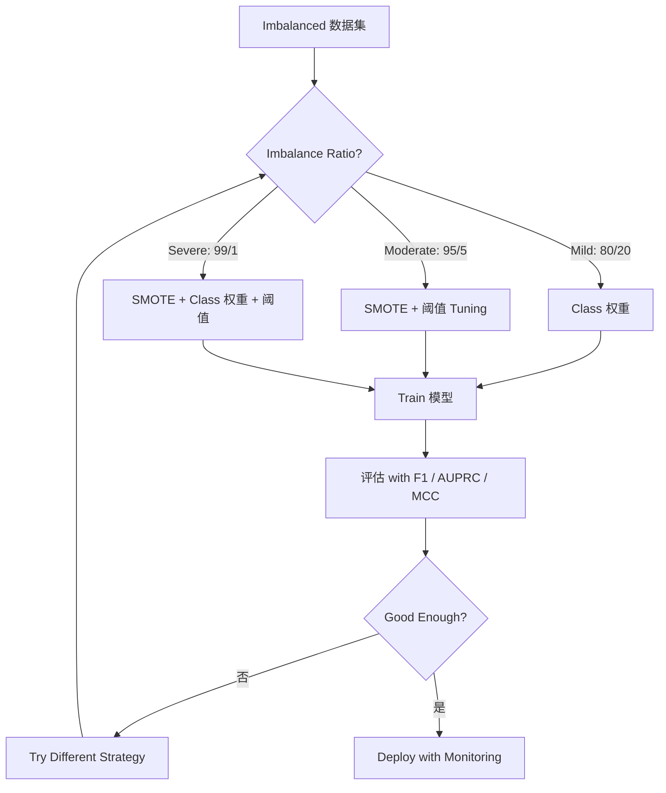
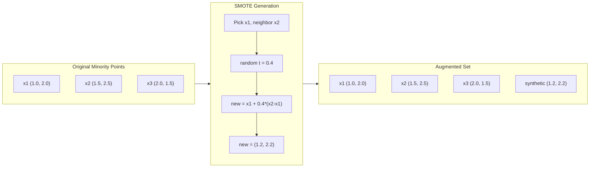
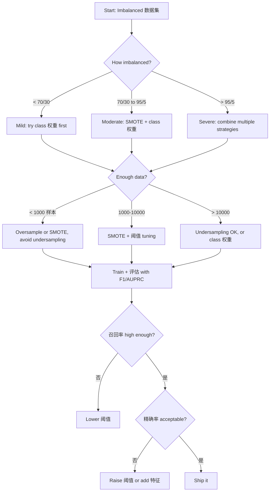

# 处理不平衡数据

> When 99% of your data is "normal," 准确率 is a lie.

**Type:** 构建
**Language:** Python
**Prerequisites:** Phase 2, Lessons 01-09 (especially evaluation 指标)
**Time:** ~90 分钟

## 学习目标

- 实现 SMOTE 从零实现 and explain how synthetic oversampling differs from random duplication
- 评估 imbalanced classifiers using F1, AUPRC, and Matthews Correlation Coefficient instead of 准确率
- 比较 class weighting, 阈值 tuning, and resampling strategies and select the right approach for a given imbalance ratio
- 构建 a complete 不平衡数据 流水线 that combines SMOTE, class 权重, and 阈值 optimization

## 问题

You build a fraud detection 模型. It gets 99.9% 准确率. You celebrate. Then you realize it predicts "not fraud" for every single transaction.

This is not a bug. It is the rational thing to do when only 0.1% of transactions are fraudulent. The 模型 learns that always guessing the 多数类 minimizes overall 误差. It is technically correct and completely useless.

This happens everywhere real 分类 matters. Disease diagnosis: 1% positive rate. Network intrusion: 0.01% attacks. Manufacturing defects: 0.5% defective. Spam filtering: 20% spam. Churn 预测: 5% churners. The more consequential the 少数类, the rarer it tends to be.

准确率 fails because it treats all correct 预测 equally. Correctly labeling a legitimate transaction and correctly catching fraud both count as one point of 准确率. But catching fraud is the entire reason the 模型 exists. We need 指标, techniques, and training strategies that force the 模型 to pay attention to the rare but important class.

## 概念

### 原因 准确率 Fails

Consider a 数据集 with 1000 样本: 990 negative, 10 positive. A 模型 that always predicts negative:

|  | 预测为正类 | 预测为负类 |
|--|---|---|
| 实际为正类 | 0 (TP) | 10 (FN) |
| 实际为负类 | 0 (FP) | 990 (TN) |

准确率 = (0 + 990) / 1000 = 99.0%

The 模型 catches zero fraud. Zero disease. Zero defects. But 准确率 says 99%. This is why 准确率 is dangerous for imbalanced problems.

### Better 指标

**精确率** = TP / (TP + FP). Of everything flagged as positive, how many actually are? High 精确率 means few false alarms.

**召回率** = TP / (TP + FN). Of everything actually positive, how many did we catch? High 召回率 means few missed positives.

**F1 Score** = 2 * 精确率 * 召回率 / (精确率 + 召回率). The harmonic mean. Penalizes extreme imbalance between 精确率 and 召回率 more than the arithmetic mean would.

**F-beta Score** = (1 + beta^2) * 精确率 * 召回率 / (beta^2 * 精确率 + 召回率). When beta > 1, 召回率 matters more. When beta < 1, 精确率 matters more. F2 is common in fraud detection (missing fraud is worse than a false alarm).

**AUPRC** (Area Under 精确率-召回率 Curve). Like AUC-ROC but more informative for 不平衡数据. A random classifier has AUPRC equal to the positive class rate (not 0.5 like ROC). This makes improvements easier to see.

**Matthews Correlation Coefficient** = (TP * TN - FP * FN) / sqrt((TP+FP)(TP+FN)(TN+FP)(TN+FN)). Ranges from -1 to +1. Only gives a high score when the 模型 does well on both classes. Balanced even when classes are very different sizes.

For the "always predict negative" 模型 above: 精确率 = 0/0 (undefined, often set to 0), 召回率 = 0/10 = 0, F1 = 0, MCC = 0. These 指标 correctly identify the 模型 as worthless.

### The 不平衡数据 流水线



### SMOTE: Synthetic Minority Oversampling Technique

Random oversampling duplicates existing minority 样本. This works but risks 过拟合 because the 模型 sees identical points repeatedly.

SMOTE creates new synthetic minority 样本 that are plausible but not copies. The algorithm:

1. For each minority 样本 x, find its k nearest neighbors among other minority 样本
2. Pick one neighbor at random
3. 创建 a new 样本 on the line segment between x and that neighbor

The formula: `new_sample = x + random(0, 1) * (neighbor - x)`

This interpolates between real minority points, creating 样本 in the same region of 特征 space without just copying existing data.



### Sampling Strategies Compared

**Random Oversampling**: duplicate minority 样本 to match majority count.
- Pros: simple, no information loss
- Cons: exact duplicates cause 过拟合, increases training time

**Random Undersampling**: remove majority 样本 to match minority count.
- Pros: fast training, simple
- Cons: throws away potentially useful majority data, higher 方差

**SMOTE**: create synthetic minority 样本 via interpolation.
- Pros: generates new data points, reduces 过拟合 compared to random oversampling
- Cons: can create noisy 样本 near the 决策边界, does not account for 多数类 distribution

| Strategy | Data Changed | Risk | When to Use |
|----------|-------------|------|-------------|
| Oversample | Minority duplicated | 过拟合 | Small 数据集, moderate imbalance |
| Undersample | Majority removed | Information loss | Large 数据集, want fast training |
| SMOTE | Synthetic minority added | Boundary noise | Moderate imbalance, enough minority 样本 for k-NN |

### Class 权重

Instead of changing the data, change how the 模型 treats 误差. Assign higher 权重 to misclassifying the 少数类.

For a binary problem with 950 negative and 50 positive 样本:
- 权重 for negative class = n_samples / (2 * n_negative) = 1000 / (2 * 950) = 0.526
- 权重 for positive class = n_samples / (2 * n_positive) = 1000 / (2 * 50) = 10.0

The positive class gets 19x the 权重. Misclassifying one positive 样本 costs as much as misclassifying 19 negative 样本. The 模型 is forced to pay attention to the 少数类.

In 逻辑回归, this modifies the 损失函数:

```
weighted_loss = -sum(w_i * [y_i * log(p_i) + (1-y_i) * log(1-p_i)])
```

where w_i depends on the class of 样本 i.

Class 权重 are mathematically equivalent to oversampling in expectation, but without creating new data points. This makes them faster and avoids the 过拟合 risk of duplicated 样本.

### 阈值 Tuning

Most classifiers output a 概率. The default 阈值 is 0.5: if P(positive) >= 0.5, predict positive. But 0.5 is arbitrary. When classes are imbalanced, the optimal 阈值 is usually much lower.

The process:
1. Train a 模型
2. Get predicted 概率 on the 验证集
3. Sweep thresholds from 0.0 to 1.0
4. 计算 F1 (or your chosen 指标) at each 阈值
5. Pick the 阈值 that maximizes your 指标


A 模型 might output P(fraud) = 0.15 for a fraudulent transaction. At 阈值 0.5, this is classified as not fraud. At 阈值 0.10, it is correctly caught. The 概率 calibration matters less than the ranking -- as long as fraud gets higher 概率 than non-fraud, there exists a 阈值 that separates them.

### Cost-Sensitive Learning

泛化 of class 权重. Instead of uniform costs, assign specific misclassification costs:

| | Predict Positive | Predict Negative |
|--|---|---|
| 实际为正类 | 0 (correct) | C_FN = 100 |
| 实际为负类 | C_FP = 1 | 0 (correct) |

Missing a fraudulent transaction (FN) costs 100x more than a false alarm (FP). The 模型 optimizes for total cost, not total 误差 count.

This is the most principled approach when you can estimate real-world costs. A missed cancer diagnosis has a very different cost than a false alarm that leads to an extra biopsy. Making these costs explicit forces the right tradeoffs.

### Decision Flowchart



```figure
class-imbalance
```

## 动手构建

### Step 1: 生成 an imbalanced 数据集

```python
import numpy as np


def make_imbalanced_data(n_majority=950, n_minority=50, seed=42):
    rng = np.random.RandomState(seed)

    X_maj = rng.randn(n_majority, 2) * 1.0 + np.array([0.0, 0.0])
    X_min = rng.randn(n_minority, 2) * 0.8 + np.array([2.5, 2.5])

    X = np.vstack([X_maj, X_min])
    y = np.concatenate([np.zeros(n_majority), np.ones(n_minority)])

    shuffle_idx = rng.permutation(len(y))
    return X[shuffle_idx], y[shuffle_idx]
```

### Step 2: SMOTE 从零实现

```python
def euclidean_distance(a, b):
    return np.sqrt(np.sum((a - b) ** 2))


def find_k_neighbors(X, idx, k):
    distances = []
    for i in range(len(X)):
        if i == idx:
            continue
        d = euclidean_distance(X[idx], X[i])
        distances.append((i, d))
    distances.sort(key=lambda x: x[1])
    return [d[0] for d in distances[:k]]


def smote(X_minority, k=5, n_synthetic=100, seed=42):
    rng = np.random.RandomState(seed)
    n_samples = len(X_minority)
    k = min(k, n_samples - 1)
    synthetic = []

    for _ in range(n_synthetic):
        idx = rng.randint(0, n_samples)
        neighbors = find_k_neighbors(X_minority, idx, k)
        neighbor_idx = neighbors[rng.randint(0, len(neighbors))]
        t = rng.random()
        new_point = X_minority[idx] + t * (X_minority[neighbor_idx] - X_minority[idx])
        synthetic.append(new_point)

    return np.array(synthetic)
```

### Step 3: Random oversampling and undersampling

```python
def random_oversample(X, y, seed=42):
    rng = np.random.RandomState(seed)
    classes, counts = np.unique(y, return_counts=True)
    max_count = counts.max()

    X_resampled = list(X)
    y_resampled = list(y)

    for cls, count in zip(classes, counts):
        if count < max_count:
            cls_indices = np.where(y == cls)[0]
            n_needed = max_count - count
            chosen = rng.choice(cls_indices, size=n_needed, replace=True)
            X_resampled.extend(X[chosen])
            y_resampled.extend(y[chosen])

    X_out = np.array(X_resampled)
    y_out = np.array(y_resampled)
    shuffle = rng.permutation(len(y_out))
    return X_out[shuffle], y_out[shuffle]


def random_undersample(X, y, seed=42):
    rng = np.random.RandomState(seed)
    classes, counts = np.unique(y, return_counts=True)
    min_count = counts.min()

    X_resampled = []
    y_resampled = []

    for cls in classes:
        cls_indices = np.where(y == cls)[0]
        chosen = rng.choice(cls_indices, size=min_count, replace=False)
        X_resampled.extend(X[chosen])
        y_resampled.extend(y[chosen])

    X_out = np.array(X_resampled)
    y_out = np.array(y_resampled)
    shuffle = rng.permutation(len(y_out))
    return X_out[shuffle], y_out[shuffle]
```

### Step 4: 逻辑回归 with class 权重

```python
def sigmoid(z):
    return 1.0 / (1.0 + np.exp(-np.clip(z, -500, 500)))


def logistic_regression_weighted(X, y, weights, lr=0.01, epochs=200):
    n_samples, n_features = X.shape
    w = np.zeros(n_features)
    b = 0.0

    for _ in range(epochs):
        z = X @ w + b
        pred = sigmoid(z)
        error = pred - y
        weighted_error = error * weights

        gradient_w = (X.T @ weighted_error) / n_samples
        gradient_b = np.mean(weighted_error)

        w -= lr * gradient_w
        b -= lr * gradient_b

    return w, b


def compute_class_weights(y):
    classes, counts = np.unique(y, return_counts=True)
    n_samples = len(y)
    n_classes = len(classes)
    weight_map = {}
    for cls, count in zip(classes, counts):
        weight_map[cls] = n_samples / (n_classes * count)
    return np.array([weight_map[yi] for yi in y])
```

### Step 5: 阈值 tuning

```python
def find_optimal_threshold(y_true, y_probs, metric="f1"):
    best_threshold = 0.5
    best_score = -1.0

    for threshold in np.arange(0.05, 0.96, 0.01):
        y_pred = (y_probs >= threshold).astype(int)
        tp = np.sum((y_pred == 1) & (y_true == 1))
        fp = np.sum((y_pred == 1) & (y_true == 0))
        fn = np.sum((y_pred == 0) & (y_true == 1))

        if metric == "f1":
            precision = tp / (tp + fp) if (tp + fp) > 0 else 0.0
            recall = tp / (tp + fn) if (tp + fn) > 0 else 0.0
            score = 2 * precision * recall / (precision + recall) if (precision + recall) > 0 else 0.0
        elif metric == "recall":
            score = tp / (tp + fn) if (tp + fn) > 0 else 0.0
        elif metric == "precision":
            score = tp / (tp + fp) if (tp + fp) > 0 else 0.0

        if score > best_score:
            best_score = score
            best_threshold = threshold

    return best_threshold, best_score
```

### Step 6: Evaluation functions

```python
def confusion_matrix_values(y_true, y_pred):
    tp = np.sum((y_pred == 1) & (y_true == 1))
    tn = np.sum((y_pred == 0) & (y_true == 0))
    fp = np.sum((y_pred == 1) & (y_true == 0))
    fn = np.sum((y_pred == 0) & (y_true == 1))
    return tp, tn, fp, fn


def compute_metrics(y_true, y_pred):
    tp, tn, fp, fn = confusion_matrix_values(y_true, y_pred)
    accuracy = (tp + tn) / (tp + tn + fp + fn)
    precision = tp / (tp + fp) if (tp + fp) > 0 else 0.0
    recall = tp / (tp + fn) if (tp + fn) > 0 else 0.0
    f1 = 2 * precision * recall / (precision + recall) if (precision + recall) > 0 else 0.0

    denom = np.sqrt(float((tp + fp) * (tp + fn) * (tn + fp) * (tn + fn)))
    mcc = (tp * tn - fp * fn) / denom if denom > 0 else 0.0

    return {
        "accuracy": accuracy,
        "precision": precision,
        "recall": recall,
        "f1": f1,
        "mcc": mcc,
    }
```

### Step 7: 比较 all approaches

```python
X, y = make_imbalanced_data(950, 50, seed=42)
split = int(0.8 * len(y))
X_train, X_test = X[:split], X[split:]
y_train, y_test = y[:split], y[split:]

# Baseline: no treatment
w_base, b_base = logistic_regression_weighted(
    X_train, y_train, np.ones(len(y_train)), lr=0.1, epochs=300
)
probs_base = sigmoid(X_test @ w_base + b_base)
preds_base = (probs_base >= 0.5).astype(int)

# Oversampled
X_over, y_over = random_oversample(X_train, y_train)
w_over, b_over = logistic_regression_weighted(
    X_over, y_over, np.ones(len(y_over)), lr=0.1, epochs=300
)
preds_over = (sigmoid(X_test @ w_over + b_over) >= 0.5).astype(int)

# SMOTE
minority_mask = y_train == 1
X_minority = X_train[minority_mask]
synthetic = smote(X_minority, k=5, n_synthetic=len(y_train) - 2 * int(minority_mask.sum()))
X_smote = np.vstack([X_train, synthetic])
y_smote = np.concatenate([y_train, np.ones(len(synthetic))])
w_sm, b_sm = logistic_regression_weighted(
    X_smote, y_smote, np.ones(len(y_smote)), lr=0.1, epochs=300
)
preds_smote = (sigmoid(X_test @ w_sm + b_sm) >= 0.5).astype(int)

# Class weights
sample_weights = compute_class_weights(y_train)
w_cw, b_cw = logistic_regression_weighted(
    X_train, y_train, sample_weights, lr=0.1, epochs=300
)
probs_cw = sigmoid(X_test @ w_cw + b_cw)
preds_cw = (probs_cw >= 0.5).astype(int)

# Threshold tuning (tune on held-out validation set, not test set)
probs_val = sigmoid(X_val @ w_cw + b_cw)
best_thresh, best_f1 = find_optimal_threshold(y_val, probs_val, metric="f1")
preds_thresh = (probs_cw >= best_thresh).astype(int)
```

The code file runs all of this in a single script and prints results.

## 直接使用

With scikit-learn and imbalanced-learn, these techniques are one-liners:

```python
from sklearn.linear_model import LogisticRegression
from sklearn.metrics import classification_report, f1_score
from sklearn.model_selection import train_test_split
from imblearn.over_sampling import SMOTE
from imblearn.under_sampling import RandomUnderSampler
from imblearn.pipeline import Pipeline

X_train, X_test, y_train, y_test = train_test_split(X, y, stratify=y)

model_weighted = LogisticRegression(class_weight="balanced")
model_weighted.fit(X_train, y_train)
print(classification_report(y_test, model_weighted.predict(X_test)))

smote = SMOTE(random_state=42)
X_resampled, y_resampled = smote.fit_resample(X_train, y_train)
model_smote = LogisticRegression()
model_smote.fit(X_resampled, y_resampled)
print(classification_report(y_test, model_smote.predict(X_test)))

pipeline = Pipeline([
    ("smote", SMOTE()),
    ("model", LogisticRegression(class_weight="balanced")),
])
pipeline.fit(X_train, y_train)
print(classification_report(y_test, pipeline.predict(X_test)))
```

The from-scratch implementations show exactly what each technique does. SMOTE is just k-NN interpolation on the 少数类. Class 权重 multiply the loss. 阈值 tuning is a for-loop over cutoffs. 否 magic.

## 交付成果

本课产出：
- `outputs/skill-imbalanced-data.md` -- a decision checklist for handling imbalanced 分类 problems

## 练习

1. **Borderline-SMOTE**: modify the SMOTE implementation to only generate synthetic 样本 for minority points that are near the 决策边界 (those whose K 近邻 include 多数类 样本). 比较 results with standard SMOTE on a 数据集 where classes overlap.

2. **Cost matrix optimization**: implement cost-sensitive learning where the cost matrix is a 参数. 创建 a function that takes a cost matrix and returns optimal 预测 that minimize expected cost. Test with different cost ratios (1:10, 1:100, 1:1000) and plot how the 精确率-召回率 tradeoff changes.

3. **阈值 calibration**: implement Platt scaling (fit a 逻辑回归 on the 模型's raw outputs to produce calibrated 概率). 比较 the 精确率-召回率 curve before and after calibration. Show that calibration does not change the ranking (AUC stays the same) but makes the 概率 more meaningful.

4. **集成 with balanced bagging**: train multiple 模型, each on a balanced 自助采样样本 (all minority + random subset of majority). Average their 预测. 比较 this approach against a single 模型 with SMOTE. Measure both performance and 方差 across runs.

5. **Imbalance ratio experiment**: take a balanced 数据集 and progressively increase the imbalance ratio (50/50, 70/30, 90/10, 95/5, 99/1). For each ratio, train with and without SMOTE. Plot F1 vs imbalance ratio for both approaches. At what ratio does SMOTE start making a meaningful difference?

## 关键术语

| 术语 | 常见说法 | 实际含义 |
|------|----------------|----------------------|
| Class imbalance | "One class has way more 样本" | The distribution of classes in the 数据集 is significantly skewed, causing 模型 to favor the 多数类 |
| SMOTE | "Synthetic oversampling" | Creates new minority 样本 by interpolating between existing minority 样本 and their k-nearest minority neighbors |
| Class 权重 | "Making 误差 on rare classes more expensive" | Multiplying the 损失函数 by class-specific 权重 so the 模型 penalizes minority misclassification more heavily |
| 阈值 tuning | "Moving the 决策边界" | Changing the 概率 cutoff for 分类 from the default 0.5 to a value that optimizes the desired 指标 |
| 精确率-召回率 tradeoff | "You cannot have both" | Lowering the 阈值 catches more positives (higher 召回率) but also flags more false positives (lower 精确率), and vice versa |
| AUPRC | "Area under the PR curve" | Summarizes the 精确率-召回率 curve into a single number; more informative than AUC-ROC when classes are heavily imbalanced |
| Matthews Correlation Coefficient | "The balanced 指标" | A correlation between predicted and actual 标签 that produces a high score only when the 模型 performs well on both classes |
| Cost-sensitive learning | "Different mistakes cost different amounts" | Incorporating real-world misclassification costs into the training objective so the 模型 optimizes for total cost, not 误差 count |
| Random oversampling | "Duplicate the minority" | Repeating 少数类 样本 to balance class counts; simple but risks 过拟合 to duplicated points |

## 延伸阅读

- [SMOTE: Synthetic Minority Over-sampling Technique (Chawla et al., 2002)](https://arxiv.org/abs/1106.1813) -- the original SMOTE paper, still the most cited work on imbalanced learning
- [Learning from Imbalanced Data (He & Garcia, 2009)](https://ieeexplore.ieee.org/document/5128907) -- comprehensive survey covering sampling, cost-sensitive, and algorithmic approaches
- [imbalanced-learn documentation](https://imbalanced-learn.org/stable/) -- Python library with SMOTE variants, undersampling strategies, and 流水线 integration
- [The Precision-Recall Plot Is More Informative than the ROC Plot (Saito & Rehmsmeier, 2015)](https://journals.plos.org/plosone/article?id=10.1371/journal.pone.0118432) -- when and why to prefer PR curves over ROC curves for imbalanced problems
