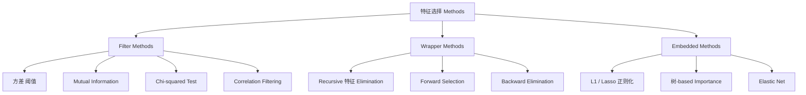
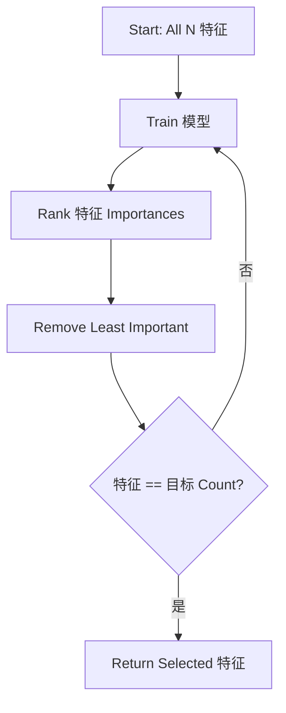
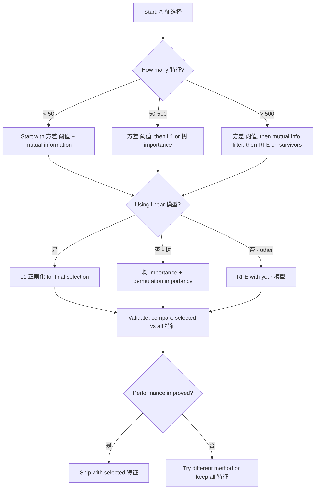

# 特征选择

> More 特征 is not better. The right 特征 is better.

**Type:** 构建
**Language:** Python
**Prerequisites:** Phase 2, Lessons 01-09, 08 (特征工程)
**Time:** ~75 分钟

## 学习目标

- 实现 filter methods (方差 阈值, mutual information, chi-squared) and wrapper methods (RFE, forward selection) 从零实现
- 解释 why mutual information captures nonlinear 特征-目标 relationships that correlation misses
- 比较 L1 正则化 (embedded selection) with RFE (wrapper selection) and evaluate their computational tradeoffs
- 构建 a 特征选择 流水线 that combines multiple methods and demonstrate improved 泛化 on held-out data

## 问题

You have 500 特征. Your 模型 trains slowly, overfits constantly, and nobody can explain what it learned. You add more 特征 hoping to improve performance. It gets worse.

This is the curse of dimensionality in action. As the number of 特征 grows, the volume of the 特征 space explodes. Data points become sparse. 距离 between points converge. The 模型 needs exponentially more data to find real patterns. Noise 特征 drown out signal 特征. 过拟合 becomes the default.

特征选择 is the antidote. Strip away the noise. Remove the redundancy. Keep the 特征 that carry actual information about the 目标. The result: faster training, better 泛化, and 模型 you can actually explain.

The goal is not to use all available information. It is to use the right information.

## 概念

### Three Categories of 特征选择

Every 特征选择 method falls into one of three categories:



**Filter methods** score each 特征 independently using a statistical measure. They do not use a 模型. Fast, but they miss 特征 interactions.

**Wrapper methods** train a 模型 to evaluate 特征 subsets. They use 模型 performance as the score. Better results, but expensive because they retrain the 模型 many times.

**Embedded methods** select 特征 as part of 模型 training. L1 正则化 drives 权重 to zero. 决策树 划分 on the most useful 特征. Selection happens during fitting, not as a separate step.

### 方差 阈值

The simplest filter. If a 特征 barely varies across 样本, it carries almost no information.

Consider a 特征 that is 0.0 for 999 out of 1000 样本. Its 方差 is near zero. 否 模型 can use it to distinguish between classes. Remove it.

```
variance(x) = mean((x - mean(x))^2)
```

Set a 阈值 (e.g., 0.01). Drop every 特征 with 方差 below it. This removes constant or near-constant 特征 without looking at the 目标 variable at all.

When to use it: as a preprocessing step before other methods. It catches obviously useless 特征 at near-zero cost.

Limitation: a 特征 can have high 方差 and still be pure noise. 方差 阈值 is necessary but not sufficient.

### Mutual Information

Mutual information measures how much knowing the value of 特征 X reduces uncertainty about 目标 Y.

```
I(X; Y) = sum_x sum_y p(x, y) * log(p(x, y) / (p(x) * p(y)))
```

If X and Y are independent, p(x, y) = p(x) * p(y), so the log term is zero and I(X; Y) = 0. The more X tells you about Y, the higher the mutual information.

Key advantage over correlation: mutual information captures nonlinear relationships. A 特征 might have zero correlation with the 目标 but high mutual information because the relationship is quadratic or periodic.

For continuous 特征, discretize into bins first (histogram-based estimation). The number of bins affects the estimate -- too few bins lose information, too many bins add noise. A common choice: sqrt(n) bins or Sturges' rule (1 + log2(n)).


### Recursive 特征 Elimination (RFE)

RFE is a wrapper method. It uses a 模型's own 特征 importance to iteratively prune:

1. Train the 模型 with all 特征
2. Rank 特征 by importance (coefficients for linear 模型, impurity reduction for 树)
3. Remove the least important 特征(s)
4. Repeat until the desired number of 特征 remains



RFE considers 特征 interactions because the 模型 sees all remaining 特征 together. Removing one 特征 changes the importance of others. This makes it more thorough than filter methods.

The cost: you train the 模型 N - 目标 times. With 500 特征 and a 目标 of 10, that is 490 training runs. For expensive 模型, this is slow. You can speed it up by removing multiple 特征 per step (e.g., remove the bottom 10% each round).

### L1 (Lasso) 正则化

L1 正则化 adds the absolute value of 权重 to the 损失函数:

```
loss = prediction_error + alpha * sum(|w_i|)
```

The alpha 参数 controls how aggressively 特征 are pruned. Higher alpha means more 权重 go to exactly zero.

原因 exactly zero? The L1 penalty creates a diamond-shaped constraint region in 权重 space. The optimal solution tends to land at a corner of this diamond, where one or more 权重 are zero. L2 正则化 (ridge) creates a circular constraint where 权重 shrink but rarely hit zero.

This is embedded 特征选择: the 模型 learns during training which 特征 to ignore. 特征 with zero 权重 are effectively removed.

Advantages: single training run, handles correlated 特征 (picks one and zeros the others), built into most linear 模型 implementations.

Limitation: only works for linear 模型. Cannot capture nonlinear 特征 importance.

### 树-Based 特征 Importance

决策树 and their ensembles (随机森林, gradient boosting) naturally rank 特征. Every 划分 reduces impurity (Gini or 熵 for 分类, 方差 for 回归). 特征 that produce larger impurity reductions are more important.

For a 随机森林 with T 树:

```
importance(feature_j) = (1/T) * sum over all trees of
    sum over all nodes splitting on feature_j of
        (n_samples * impurity_decrease)
```

This gives a normalized importance score for each 特征. It handles nonlinear relationships and 特征 interactions automatically.

Caution: 树-based importance is biased toward 特征 with many unique values (high cardinality). A random ID column will appear important because it perfectly 划分 every 样本. Use permutation importance as a sanity check.

### Permutation Importance

A 模型-agnostic method:

1. Train the 模型 and record 基线 performance on validation data
2. For each 特征: shuffle its values randomly, measure the drop in performance
3. The bigger the drop, the more important the 特征

If shuffling a 特征 does not hurt performance, the 模型 does not depend on it. If performance collapses, that 特征 is critical.

Permutation importance avoids the cardinality 偏差 of 树-based importance. But it is slow: one full evaluation per 特征, repeated multiple times for stability.

### Comparison Table

| Method | Type | Speed | Nonlinear | 特征 Interactions |
|--------|------|-------|-----------|---------------------|
| 方差 阈值 | Filter | Very fast | 否 | 否 |
| Mutual information | Filter | Fast | 是 | 否 |
| Correlation filter | Filter | Fast | 否 | 否 |
| RFE | Wrapper | Slow | Depends on 模型 | 是 |
| L1 / Lasso | Embedded | Fast | 否 (linear) | 否 |
| 树 importance | Embedded | Medium | 是 | 是 |
| Permutation importance | 模型-agnostic | Slow | 是 | 是 |

### Decision Flowchart



## 动手构建

### Step 1: 生成 synthetic data with known 特征 structure

```python
import numpy as np


def make_feature_selection_data(n_samples=500, seed=42):
    rng = np.random.RandomState(seed)

    x1 = rng.randn(n_samples)
    x2 = rng.randn(n_samples)
    x3 = rng.randn(n_samples)
    x4 = x1 + 0.1 * rng.randn(n_samples)
    x5 = x2 + 0.1 * rng.randn(n_samples)

    informative = np.column_stack([x1, x2, x3, x4, x5])

    correlated = np.column_stack([
        x1 * 0.9 + 0.1 * rng.randn(n_samples),
        x2 * 0.8 + 0.2 * rng.randn(n_samples),
        x3 * 0.7 + 0.3 * rng.randn(n_samples),
        x1 * 0.5 + x2 * 0.5 + 0.1 * rng.randn(n_samples),
        x2 * 0.6 + x3 * 0.4 + 0.1 * rng.randn(n_samples),
    ])

    noise = rng.randn(n_samples, 10) * 0.5

    X = np.hstack([informative, correlated, noise])
    y = (2 * x1 - 1.5 * x2 + x3 + 0.5 * rng.randn(n_samples) > 0).astype(int)

    feature_names = (
        [f"info_{i}" for i in range(5)]
        + [f"corr_{i}" for i in range(5)]
        + [f"noise_{i}" for i in range(10)]
    )

    return X, y, feature_names
```

We know the ground truth: 特征 0-4 are informative (plus 3 and 4 are correlated copies of 0 and 1), 特征 5-9 are correlated with informative 特征, 特征 10-19 are pure noise. A good selection method should rank 0-4 highest and 10-19 lowest.

### Step 2: 方差 阈值

```python
def variance_threshold(X, threshold=0.01):
    variances = np.var(X, axis=0)
    mask = variances > threshold
    return mask, variances
```

### Step 3: Mutual information (discrete)

```python
def discretize(x, n_bins=10):
    min_val, max_val = x.min(), x.max()
    if max_val == min_val:
        return np.zeros_like(x, dtype=int)
    bin_edges = np.linspace(min_val, max_val, n_bins + 1)
    binned = np.digitize(x, bin_edges[1:-1])
    return binned


def mutual_information(X, y, n_bins=10):
    n_samples, n_features = X.shape
    mi_scores = np.zeros(n_features)

    y_vals, y_counts = np.unique(y, return_counts=True)
    p_y = y_counts / n_samples

    for f in range(n_features):
        x_binned = discretize(X[:, f], n_bins)
        x_vals, x_counts = np.unique(x_binned, return_counts=True)
        p_x = dict(zip(x_vals, x_counts / n_samples))

        mi = 0.0
        for xv in x_vals:
            for yi, yv in enumerate(y_vals):
                joint_mask = (x_binned == xv) & (y == yv)
                p_xy = np.sum(joint_mask) / n_samples
                if p_xy > 0:
                    mi += p_xy * np.log(p_xy / (p_x[xv] * p_y[yi]))
        mi_scores[f] = mi

    return mi_scores
```

### Step 4: Recursive 特征 Elimination

```python
def simple_logistic_importance(X, y, lr=0.1, epochs=100):
    n_samples, n_features = X.shape
    w = np.zeros(n_features)
    b = 0.0

    for _ in range(epochs):
        z = X @ w + b
        pred = 1.0 / (1.0 + np.exp(-np.clip(z, -500, 500)))
        error = pred - y
        w -= lr * (X.T @ error) / n_samples
        b -= lr * np.mean(error)

    return w, b


def rfe(X, y, n_features_to_select=5, lr=0.1, epochs=100):
    n_total = X.shape[1]
    remaining = list(range(n_total))
    rankings = np.ones(n_total, dtype=int)
    rank = n_total

    while len(remaining) > n_features_to_select:
        X_subset = X[:, remaining]
        w, _ = simple_logistic_importance(X_subset, y, lr, epochs)
        importances = np.abs(w)

        least_idx = np.argmin(importances)
        original_idx = remaining[least_idx]
        rankings[original_idx] = rank
        rank -= 1
        remaining.pop(least_idx)

    for idx in remaining:
        rankings[idx] = 1

    selected_mask = rankings == 1
    return selected_mask, rankings
```

### Step 5: L1 特征选择

```python
def soft_threshold(w, alpha):
    return np.sign(w) * np.maximum(np.abs(w) - alpha, 0)


def l1_feature_selection(X, y, alpha=0.1, lr=0.01, epochs=500):
    n_samples, n_features = X.shape
    w = np.zeros(n_features)
    b = 0.0

    for _ in range(epochs):
        z = X @ w + b
        pred = 1.0 / (1.0 + np.exp(-np.clip(z, -500, 500)))
        error = pred - y

        gradient_w = (X.T @ error) / n_samples
        gradient_b = np.mean(error)

        w -= lr * gradient_w
        w = soft_threshold(w, lr * alpha)
        b -= lr * gradient_b

    selected_mask = np.abs(w) > 1e-6
    return selected_mask, w
```

### Step 6: 树-based importance (simple 决策树)

```python
def gini_impurity(y):
    if len(y) == 0:
        return 0.0
    classes, counts = np.unique(y, return_counts=True)
    probs = counts / len(y)
    return 1.0 - np.sum(probs ** 2)


def best_split(X, y, feature_idx):
    values = np.unique(X[:, feature_idx])
    if len(values) <= 1:
        return None, -1.0

    best_threshold = None
    best_gain = -1.0
    parent_gini = gini_impurity(y)
    n = len(y)

    for i in range(len(values) - 1):
        threshold = (values[i] + values[i + 1]) / 2.0
        left_mask = X[:, feature_idx] <= threshold
        right_mask = ~left_mask

        n_left = np.sum(left_mask)
        n_right = np.sum(right_mask)

        if n_left == 0 or n_right == 0:
            continue

        gain = parent_gini - (n_left / n) * gini_impurity(y[left_mask]) - (n_right / n) * gini_impurity(y[right_mask])

        if gain > best_gain:
            best_gain = gain
            best_threshold = threshold

    return best_threshold, best_gain


def tree_importance(X, y, n_trees=50, max_depth=5, seed=42):
    rng = np.random.RandomState(seed)
    n_samples, n_features = X.shape
    importances = np.zeros(n_features)

    for _ in range(n_trees):
        sample_idx = rng.choice(n_samples, size=n_samples, replace=True)
        feature_subset = rng.choice(n_features, size=max(1, int(np.sqrt(n_features))), replace=False)

        X_boot = X[sample_idx]
        y_boot = y[sample_idx]

        tree_imp = _build_tree_importance(X_boot, y_boot, feature_subset, max_depth)
        importances += tree_imp

    total = importances.sum()
    if total > 0:
        importances /= total

    return importances


def _build_tree_importance(X, y, feature_subset, max_depth, depth=0):
    n_features = X.shape[1]
    importances = np.zeros(n_features)

    if depth >= max_depth or len(np.unique(y)) <= 1 or len(y) < 4:
        return importances

    best_feature = None
    best_threshold = None
    best_gain = -1.0

    for f in feature_subset:
        threshold, gain = best_split(X, y, f)
        if gain > best_gain:
            best_gain = gain
            best_feature = f
            best_threshold = threshold

    if best_feature is None or best_gain <= 0:
        return importances

    importances[best_feature] += best_gain * len(y)

    left_mask = X[:, best_feature] <= best_threshold
    right_mask = ~left_mask

    importances += _build_tree_importance(X[left_mask], y[left_mask], feature_subset, max_depth, depth + 1)
    importances += _build_tree_importance(X[right_mask], y[right_mask], feature_subset, max_depth, depth + 1)

    return importances
```

### Step 7: Run all methods and compare

The code file runs all five methods on the same synthetic 数据集 and prints a comparison table showing which 特征 each method selects.

## 直接使用

With scikit-learn, 特征选择 is built into the 流水线:

```python
from sklearn.feature_selection import (
    VarianceThreshold,
    mutual_info_classif,
    RFE,
    SelectFromModel,
)
from sklearn.linear_model import Lasso, LogisticRegression
from sklearn.ensemble import RandomForestClassifier

vt = VarianceThreshold(threshold=0.01)
X_filtered = vt.fit_transform(X)

mi_scores = mutual_info_classif(X, y)
top_k = np.argsort(mi_scores)[-10:]

rfe_selector = RFE(LogisticRegression(), n_features_to_select=10)
rfe_selector.fit(X, y)
X_rfe = rfe_selector.transform(X)

lasso_selector = SelectFromModel(Lasso(alpha=0.01))
lasso_selector.fit(X, y)
X_lasso = lasso_selector.transform(X)

rf = RandomForestClassifier(n_estimators=100)
rf.fit(X, y)
importances = rf.feature_importances_
```

The from-scratch implementations show exactly what happens inside each method. 方差 阈值 is just computing `var(X, axis=0)` and applying a mask. Mutual information is counting joint and marginal frequencies in a contingency table. RFE is a loop that trains, ranks, and prunes. L1 is 梯度下降 with a soft-thresholding step. 树 importance accumulates impurity reductions across 划分. 否 magic -- just statistics and loops.

The sklearn versions add robustness (e.g., mutual_info_classif uses k-NN density estimation instead of binning), speed (C implementations), and 流水线 integration.

## 交付成果

本课产出：
- `outputs/skill-feature-selector.md` -- a quick reference 决策树 for choosing the right 特征选择 method

## 练习

1. **Forward selection**: implement the opposite of RFE. Start with zero 特征. At each step, add the 特征 that improves 模型 performance the most. Stop when adding 特征 no longer helps. 比较 the selected 特征 against RFE results. Which is faster? Which gives better results?

2. **Stability selection**: run L1 特征选择 50 times, each time on a random 80% subsample of the data, with slightly different alpha values. Count how often each 特征 is selected. 特征 selected in > 80% of runs are "stable." 比较 stable 特征 against single-run L1 selection. Which is more reliable?

3. **Multicollinearity detection**: compute the correlation matrix for all 特征. 实现 a function that, given a correlation 阈值 (e.g., 0.9), removes one 特征 from each highly-correlated pair (keeping the one with higher mutual information with the 目标). Test on the synthetic 数据集 and verify it removes the redundant correlated 特征.

4. **特征选择 流水线**: chain 方差 阈值, mutual information filter, and RFE into a single 流水线. First remove near-zero-方差 特征, then keep the top 50% by mutual information, then run RFE on the survivors. 比较 this 流水线 against running RFE alone on all 特征. Is the 流水线 faster? Is it equally accurate?

5. **Permutation importance 从零实现**: implement permutation importance. For each 特征, shuffle its values 10 times, measure the average drop in F1 score. 比较 the ranking against 树-based importance. Find cases where they disagree and explain why (hint: correlated 特征).

## 关键术语

| 术语 | 常见说法 | 实际含义 |
|------|----------------|----------------------|
| Filter method | "Score 特征 independently" | A 特征选择 approach that ranks 特征 using a statistical measure without training a 模型, evaluating each 特征 in isolation |
| Wrapper method | "Use the 模型 to pick 特征" | A 特征选择 approach that evaluates 特征 subsets by training a 模型 and using its performance as the selection criterion |
| Embedded method | "The 模型 selects 特征 during training" | 特征选择 that happens as part of 模型 fitting, such as L1 正则化 driving 权重 to zero |
| Mutual information | "How much one variable tells you about another" | A measure of the reduction in uncertainty about Y given knowledge of X, capturing both linear and nonlinear dependencies |
| Recursive 特征 Elimination | "Train, rank, prune, repeat" | An iterative wrapper method that trains a 模型, removes the least important 特征(s), and repeats until a 目标 count is reached |
| L1 / Lasso 正则化 | "Penalty that kills 特征" | Adding the sum of absolute 权重 values to the 损失函数, which drives unimportant 特征 权重 to exactly zero |
| 方差 阈值 | "Remove constant 特征" | Dropping 特征 whose 方差 across 样本 falls below a specified 阈值, filtering out 特征 that carry no information |
| 特征 importance | "Which 特征 matter most" | A score indicating how much each 特征 contributes to 模型 预测, computed from 划分 gains (树) or coefficient magnitudes (linear) |
| Permutation importance | "Shuffle and measure the damage" | Evaluating 特征 importance by randomly shuffling each 特征's values and measuring the resulting drop in 模型 performance |
| Curse of dimensionality | "Too many 特征, not enough data" | The phenomenon where adding 特征 increases the volume of the 特征 space exponentially, making data sparse and 距离 meaningless |

## 延伸阅读

- [An Introduction to Variable and Feature Selection (Guyon & Elisseeff, 2003)](https://jmlr.org/papers/v3/guyon03a.html) -- the foundational survey on 特征选择 methods, still widely referenced
- [scikit-learn Feature Selection Guide](https://scikit-learn.org/stable/modules/feature_selection.html) -- practical reference for filter, wrapper, and embedded methods with code examples
- [Stability Selection (Meinshausen & Buhlmann, 2010)](https://arxiv.org/abs/0809.2932) -- combines subsampling with 特征选择 for robust, reproducible results
- [Beware Default Random Forest Importances (Strobl et al., 2007)](https://bmcbioinformatics.biomedcentral.com/articles/10.1186/1471-2105-8-25) -- demonstrates the cardinality 偏差 in 树-based importance and proposes conditional importance as an alternative
