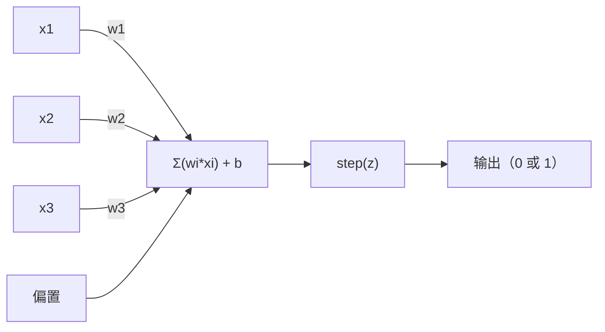
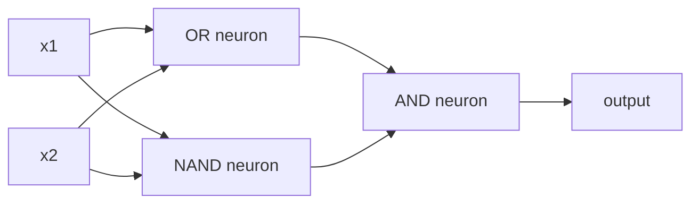

# 感知机

> 感知机是神经网络的原子。把它拆开，你会看到权重、偏置和一次决策。

**Type:** 构建
**Languages:** Python
**Prerequisites:** Phase 1 (Linear Algebra Intuition)
**Time:** ~60 minutes

## 学习目标

- 实现 a perceptron 从零实现 在 Python, including weight update 规则 和 步骤 激活 函数
- 解释 为什么 a single perceptron can only solve linearly separable problems 和 demonstrate XOR 失败 case
- Construct a multi-层 perceptron by composing OR, NAND, 和 AND gates 到 solve XOR
- 训练 a two-层 network 用 sigmoid 激活 和 反向传播 到 learn XOR automatically

## 问题

你 know vectors 和 dot products. 你 know that a 矩阵 transforms 输入 into 输出. But 如何 does a machine *learn* which transformation 到 使用?

perceptron answers 这. It's simplest possible learning machine: take some 输入, multiply by 权重, 加入 a 偏置, 和 make a binary 决策. Then adjust. That's it. Every 神经网络 ever built 是 层 of 这 idea stacked together.

Understanding perceptron means understanding what "learning" actually means 在 code: adjusting numbers until 输出 matches reality.

## 概念

### 一个神经元，一次决策

A perceptron takes n 输入, multiplies each by a weight, sums them up, adds a 偏置, 和 passes result through an 激活 函数.



步骤 函数 是 brutal: 如果 weighted sum plus 偏置 是 >= 0, 输出 1. Otherwise, 输出 0.

```
step(z) = 1  if z >= 0
           0  if z < 0
```

这 是 a 线性 classifier. 权重 和 偏置 define a line (或 hyperplane 在 higher dimensions) that splits 输入 space into two regions.

### 决策边界

For two 输入, perceptron draws a line through 2D space:

```
  x2
  ┤
  │  Class 1        /
  │    (0)          /
  │                /
  │               / w1·x1 + w2·x2 + b = 0
  │              /
  │             /     Class 2
  │            /        (1)
  ┼───────────/──────────── x1
```

Everything 在 one side of line 输出 0. Everything 在 other side 输出 1. 训练 moves 这 line until it correctly separates classes.

### 学习规则

perceptron learning 规则 是 简单:

```
For each training example (x, y_true):
    y_pred = predict(x)
    error = y_true - y_pred

    For each weight:
        w_i = w_i + learning_rate * error * x_i
    bias = bias + learning_rate * error
```

If 预测 是 correct, 错误 = 0, nothing changes. If it predicts 0 but should be 1, 权重 增加. If it predicts 1 but should be 0, 权重 decrease. 学习率 controls 如何 big each adjustment 是.

### XOR 问题

Here's 其中 it breaks. Look at these logic gates:

```
AND gate:           OR gate:            XOR gate:
x1  x2  out         x1  x2  out         x1  x2  out
0   0   0           0   0   0           0   0   0
0   1   0           0   1   1           0   1   1
1   0   0           1   0   1           1   0   1
1   1   1           1   1   1           1   1   0
```

AND 和 OR 是 linearly separable: 你 can draw a single line 到 separate 0s 从 1s. XOR 是 不. No single line can separate [0,1] 和 [1,0] 从 [0,0] 和 [1,1].

```
AND (separable):        XOR (not separable):

  x2                      x2
  1 ┤  0     1            1 ┤  1     0
    │     /                 │
  0 ┤  0 / 0              0 ┤  0     1
    ┼──/──────── x1         ┼──────────── x1
       line works!          no single line works!
```

这 是 a fundamental limit. A single perceptron can only solve linearly separable problems. Minsky 和 Papert proved 这 在 1969 和 it nearly killed 神经网络 research 用于 a decade.

fix: stack perceptrons into 层. A multi-层 perceptron can solve XOR by combining two 线性 decisions into a 非线性 one.

```figure
perceptron-boundary
```

## 动手构建

### Step 1: 感知机 class

```python
class Perceptron:
    def __init__(self, n_inputs, learning_rate=0.1):
        self.weights = [0.0] * n_inputs
        self.bias = 0.0
        self.lr = learning_rate

    def predict(self, inputs):
        total = sum(w * x for w, x in zip(self.weights, inputs))
        total += self.bias
        return 1 if total >= 0 else 0

    def train(self, training_data, epochs=100):
        for epoch in range(epochs):
            errors = 0
            for inputs, target in training_data:
                prediction = self.predict(inputs)
                error = target - prediction
                if error != 0:
                    errors += 1
                    for i in range(len(self.weights)):
                        self.weights[i] += self.lr * error * inputs[i]
                    self.bias += self.lr * error
            if errors == 0:
                print(f"Converged at epoch {epoch + 1}")
                return
        print(f"Did not converge after {epochs} epochs")
```

### Step 2: 训练 在 logic gates

```python
and_data = [
    ([0, 0], 0),
    ([0, 1], 0),
    ([1, 0], 0),
    ([1, 1], 1),
]

or_data = [
    ([0, 0], 0),
    ([0, 1], 1),
    ([1, 0], 1),
    ([1, 1], 1),
]

not_data = [
    ([0], 1),
    ([1], 0),
]

print("=== AND Gate ===")
p_and = Perceptron(2)
p_and.train(and_data)
for inputs, _ in and_data:
    print(f"  {inputs} -> {p_and.predict(inputs)}")

print("\n=== OR Gate ===")
p_or = Perceptron(2)
p_or.train(or_data)
for inputs, _ in or_data:
    print(f"  {inputs} -> {p_or.predict(inputs)}")

print("\n=== NOT Gate ===")
p_not = Perceptron(1)
p_not.train(not_data)
for inputs, _ in not_data:
    print(f"  {inputs} -> {p_not.predict(inputs)}")
```

### Step 3: Watch XOR fail

```python
xor_data = [
    ([0, 0], 0),
    ([0, 1], 1),
    ([1, 0], 1),
    ([1, 1], 0),
]

print("\n=== XOR Gate (single perceptron) ===")
p_xor = Perceptron(2)
p_xor.train(xor_data, epochs=1000)
for inputs, expected in xor_data:
    result = p_xor.predict(inputs)
    status = "OK" if result == expected else "WRONG"
    print(f"  {inputs} -> {result} (expected {expected}) {status}")
```

It will never converge. 这 是 hard proof that a single perceptron cannot learn XOR.

### Step 4: Solve XOR 用 two 层

trick: XOR = (x1 OR x2) AND NOT (x1 AND x2). Combine three perceptrons:



```python
def xor_network(x1, x2):
    or_neuron = Perceptron(2)
    or_neuron.weights = [1.0, 1.0]
    or_neuron.bias = -0.5

    nand_neuron = Perceptron(2)
    nand_neuron.weights = [-1.0, -1.0]
    nand_neuron.bias = 1.5

    and_neuron = Perceptron(2)
    and_neuron.weights = [1.0, 1.0]
    and_neuron.bias = -1.5

    hidden1 = or_neuron.predict([x1, x2])
    hidden2 = nand_neuron.predict([x1, x2])
    output = and_neuron.predict([hidden1, hidden2])
    return output


print("\n=== XOR Gate (multi-layer network) ===")
for inputs, expected in xor_data:
    result = xor_network(inputs[0], inputs[1])
    print(f"  {inputs} -> {result} (expected {expected})")
```

All four cases correct. Stacking perceptrons into 层 creates 决策 boundaries that 没有 single perceptron can produce.

### Step 5: 训练 a Two-层 Network

Step 4 hand-wired 权重. That works 用于 XOR, but 不 用于 real problems 其中 你 don't know right 权重 在 advance. fix: replace 步骤 函数 用 sigmoid 和 learn 权重 automatically through 反向传播.

```python
class TwoLayerNetwork:
    def __init__(self, learning_rate=0.5):
        import random
        random.seed(0)
        self.w_hidden = [[random.uniform(-1, 1), random.uniform(-1, 1)] for _ in range(2)]
        self.b_hidden = [random.uniform(-1, 1), random.uniform(-1, 1)]
        self.w_output = [random.uniform(-1, 1), random.uniform(-1, 1)]
        self.b_output = random.uniform(-1, 1)
        self.lr = learning_rate

    def sigmoid(self, x):
        import math
        x = max(-500, min(500, x))
        return 1.0 / (1.0 + math.exp(-x))

    def forward(self, inputs):
        self.inputs = inputs
        self.hidden_outputs = []
        for i in range(2):
            z = sum(w * x for w, x in zip(self.w_hidden[i], inputs)) + self.b_hidden[i]
            self.hidden_outputs.append(self.sigmoid(z))
        z_out = sum(w * h for w, h in zip(self.w_output, self.hidden_outputs)) + self.b_output
        self.output = self.sigmoid(z_out)
        return self.output

    def train(self, training_data, epochs=10000):
        for epoch in range(epochs):
            total_error = 0
            for inputs, target in training_data:
                output = self.forward(inputs)
                error = target - output
                total_error += error ** 2

                d_output = error * output * (1 - output)

                saved_w_output = self.w_output[:]
                hidden_deltas = []
                for i in range(2):
                    h = self.hidden_outputs[i]
                    hd = d_output * saved_w_output[i] * h * (1 - h)
                    hidden_deltas.append(hd)

                for i in range(2):
                    self.w_output[i] += self.lr * d_output * self.hidden_outputs[i]
                self.b_output += self.lr * d_output

                for i in range(2):
                    for j in range(len(inputs)):
                        self.w_hidden[i][j] += self.lr * hidden_deltas[i] * inputs[j]
                    self.b_hidden[i] += self.lr * hidden_deltas[i]
```

```python
net = TwoLayerNetwork(learning_rate=2.0)
net.train(xor_data, epochs=10000)
for inputs, expected in xor_data:
    result = net.forward(inputs)
    predicted = 1 if result >= 0.5 else 0
    print(f"  {inputs} -> {result:.4f} (rounded: {predicted}, expected {expected})")
```

Two key differences 从 Step 4. First, sigmoid replaces 步骤 函数 -- it's smooth, so 梯度s exist. Second,`train`method propagates 错误 backward 从 输出 到 hidden 层, adjusting every weight proportionally 到 its contribution 到 错误. That's 反向传播 在 20 lines.

这 是 bridge 到 Lesson 03. math behind`d_output`和`hidden_deltas`是 链式法则 applied 到 network graph. We'll derive it properly there.

## 直接使用

Everything 你 just built 从零实现 exists 在 one import:

```python
from sklearn.linear_model import Perceptron as SkPerceptron
import numpy as np

X = np.array([[0,0],[0,1],[1,0],[1,1]])
y = np.array([0, 0, 0, 1])

clf = SkPerceptron(max_iter=100, tol=1e-3)
clf.fit(X, y)
print([clf.predict([x])[0] for x in X])
```

Five lines. Your 30-line`Perceptron`class does same thing. sklearn version adds convergence checks, multiple 损失 函数, 和 sparse 输入 support -- but core loop 是 identical: weighted sum, 步骤 函数, weight update 在 错误.

real gap shows up at 尺度. What changes 在 production networks:

- 步骤 函数 becomes sigmoid, ReLU, 或 other smooth 激活s
- 权重 是 learned automatically via 反向传播 (Lesson 03)
- 层 get deeper: 3, 10, 100+ 层
- same principle holds: each 层 creates new features 从 previous 层's 输出

A single perceptron can only draw straight lines. Stack them, 和 你 can draw any 形状.

## 交付它

这 lesson produces:
- `outputs/skill-perceptron.md`- a skill covering 当 single-层 vs multi-层 architectures 是 needed

## Exercises

1. 训练 a perceptron 在 a NAND gate ( universal gate - any logic circuit can be built 从 NAND). 确认 its 权重 和 偏置 form a valid 决策 边界.
2. Modify Perceptron class 到 track 决策 边界 (w1*x1 + w2*x2 + b = 0) at each 轮次. 打印 如何 line shifts during 训练 在 AND gate.
3. 构建 a 3-输入 perceptron that 输出 1 only 当 at least 2 of 3 输入 是 1 (a majority vote 函数). Is 这 linearly separable? Why?

## Key Terms

|Term|What people say|What it actually means|
|------|----------------|----------------------|
|Perceptron|"A fake neuron"|A 线性 classifier: dot product of 输入 和 权重, plus 偏置, through a 步骤 函数|
|Weight|"How important an 输入 是"|A multiplier that scales each 输入's contribution 到 决策|
|偏置|" threshold"|A constant that shifts 决策 边界, letting perceptron fire even 用 zero 输入|
|激活 函数|" thing that squishes 值"|A 函数 applied 之后 weighted sum - 步骤 函数 用于 perceptrons, sigmoid/ReLU 用于 modern networks|
|Linearly separable|"你可以 draw a line between them"|A 数据set 其中 a single hyperplane can perfectly separate classes|
|XOR 问题|" thing perceptrons can't do"|Proof that single-层 networks cannot learn non-linearly-separable 函数|
|Decision 边界|"Where classifier switches"|hyperplane w*x + b = 0 that divides 输入 space into two classes|
|Multi-层 perceptron|"A real 神经网络"|Perceptrons stacked 在 层, 其中 each 层's 输出 feeds next 层's 输入|

## Further Reading

- Frank Rosenblatt, "感知机: A Probabilistic 模型 用于 Information Storage 和 Organization 在 Brain" (1958) -- original paper that started it all
- Minsky & Papert, "Perceptrons" (1969) -- book that proved XOR 是 unsolvable by single-层 networks 和 killed perceptron research 用于 a decade
- Michael Nielsen, "神经网络 和 Deep Learning", Chapter 1 (http://neuralnetworksanddeeplearning.com/)-- free online, best visual explanation of 如何 perceptrons compose into networks
