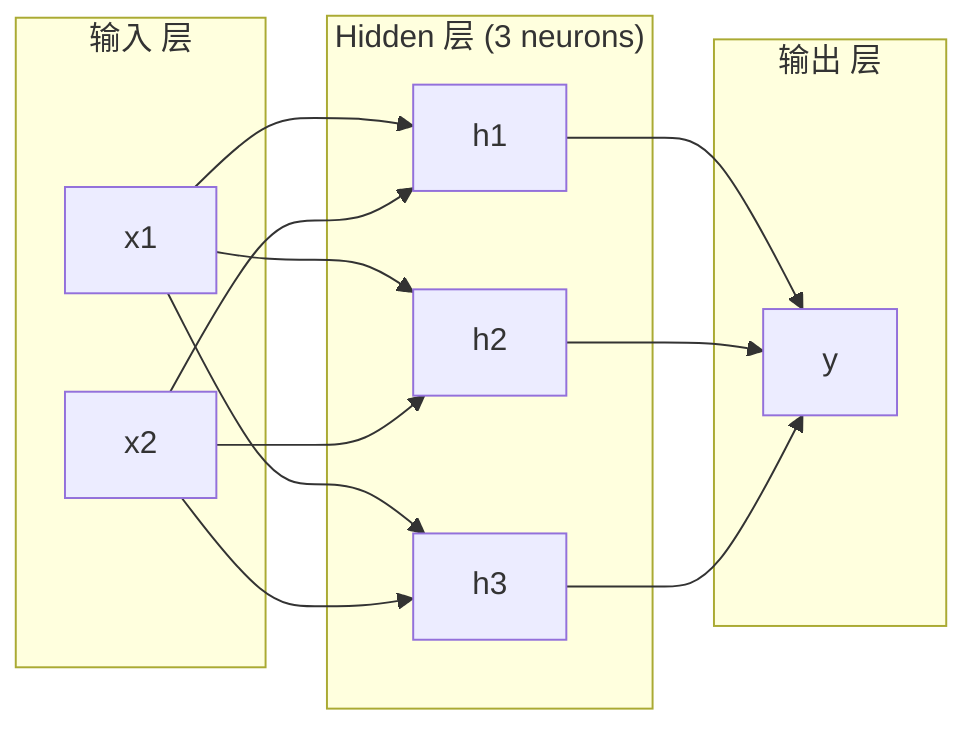
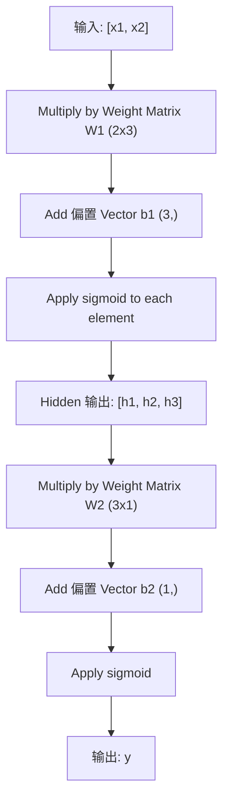
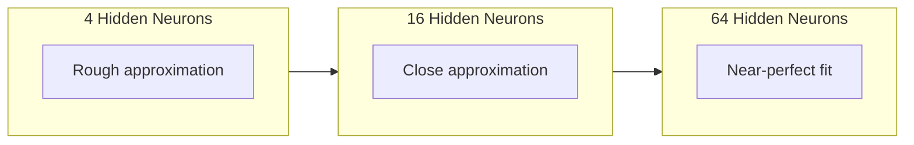

# Multi-层 Networks 和 前向传播

> One neuron draws a line. Stack them, 和 你 can draw anything.

**Type:** 构建
**Languages:** Python
**Prerequisites:** Phase 01 (Math Foundations), Lesson 03.01 (感知机)
**Time:** ~90 minutes

## 学习目标

- 构建 a multi-层 network 从零实现 用 层 和 Network classes that perform a complete 前向传播
- Trace 矩阵 dimensions through each 层 of a network 和 识别 形状 mismatches
- 解释 如何 stacking 非线性 激活s enables a network 到 learn curved 决策 boundaries
- Solve XOR 问题 using a 2-2-1 架构 用 hand-tuned sigmoid 权重

## 问题

A single neuron 是 a line drawer. That's it. One straight line through 你的 数据. Every real 问题 在 AI -- image recognition, language understanding, playing Go -- requires curves. Stacking neurons into 层 是 如何 你 get curves.

In 1969, Minsky 和 Papert proved 这 limitation 是 fatal: a single-层 network cannot learn XOR. Not "struggles 到 learn" -- mathematically cannot. XOR truth table places [0,1] 和 [1,0] 在 one side, [0,0] 和 [1,1] 在 other. No single line separates them.

这 killed 神经网络 funding 用于 over a decade. fix 是 obvious 在 hindsight: 停止 using one 层. Stack neurons into 层. Let first 层 carve 输入 space into new features, 和 let second 层 combine those features into decisions 没有 single line could make.

That stack 是 multi-层 network. It 是 foundation of every deep learning 模型 在 production today. 前向传播 -- 数据 flowing 从 输入 through hidden 层 到 输出 -- 是 first thing 你 need 到 构建 之前 anything else works.

## 概念

### 层: Input, Hidden, Output

A multi-层 network has three types of 层:

**Input 层** -- 不 really a 层. It holds 你的 raw 数据. Two features means two 输入 nodes. No computation happens here.

**Hidden 层** -- 其中 work happens. Each neuron takes every 输出 从 previous 层, applies 权重 和 a 偏置, 然后 passes result through an 激活 函数. "Hidden" 因为 你 never see these 值 directly 在 训练 数据.

**Output 层** -- final answer. For 二分类, one neuron 用 sigmoid. For multi-class, one neuron per class.



这 是 a 2-3-1 network. Two 输入, three hidden neurons, one 输出. Every connection carries a weight. Every neuron (except 输入) carries a 偏置.

Each 层 produces a 向量 of numbers called a hidden state. For text, hidden states 增加 dimensionality -- encoding a word as 768 numbers 到 capture semantic meaning. For images, they 降低 dimensionality -- compressing millions of pixels into a manageable representation. hidden state 是 其中 learning lives.

### Neurons 和 激活s

Each neuron does three things:

1. Multiply every 输入 by its corresponding weight
2. Sum all products 和 加入 a 偏置
3. Pass sum through an 激活 函数

For now, 激活 是 sigmoid:

```
sigmoid(z) = 1 / (1 + e^(-z))
```

Sigmoid squashes any number into range (0, 1). Large positive 输入 push toward 1. Large negative 输入 push toward 0. Zero maps 到 0.5. 这 smooth curve 是 what makes learning possible -- unlike perceptron's hard 步骤, sigmoid has a 梯度 everywhere.

### 前向传播: How 数据 Flows

前向传播 pushes 输入 数据 through network, 层 by 层, until it reaches 输出. No learning happens during 前向传播. It 是 pure computation: multiply, 加入, activate, repeat.



At each 层, three operations happen 在 sequence:

```
z = W * input + b       (linear transformation)
a = sigmoid(z)           (activation)
```

输出 of one 层 becomes 输入 到 next. That 是 entire 前向传播.

### Matrix Dimensions

Tracking dimensions 是 single most important debugging skill 在 deep learning. Here 是 2-3-1 network:

|Step|Operation|Dimensions|Result Shape|
|------|-----------|------------|-------------|
|Input|x|--|(2,)|
|Hidden 线性|W1 * x + b1|W1: (3, 2), b1: (3,)|(3,)|
|Hidden 激活|sigmoid(z1)|--|(3,)|
|Output 线性|W2 * h + b2|W2: (1, 3), b2: (1,)|(1,)|
|Output 激活|sigmoid(z2)|--|(1,)|

规则: weight 矩阵 W at 层 k has 形状 (neurons_in_层_k, neurons_in_层_k_minus_1). Rows match current 层. Columns match previous 层. If shapes do 不 line up, 你 have a 缺陷.

### Universal Approximation Theorem

In 1989, George Cybenko proved something remarkable: a 神经网络 用 a single hidden 层 和 enough neurons can approximate any continuous 函数 到 any desired 准确率.

这 does 不 均值 one hidden 层 是 always best. It means 架构 是 theoretically capable. In practice, deeper networks (more 层, fewer neurons per 层) learn same 函数 用 far fewer total 参数 than shallow-wide networks. That 是 为什么 deep learning works.

intuition: each neuron 在 hidden 层 learns one "bump" 或 feature. Enough bumps placed 在 right locations can approximate any smooth curve. More neurons, more bumps, better approximation.



### Composability

Neural networks 是 composable. 你可以 stack them, chain them, 运行 them 在 parallel. A Whisper 模型 uses an encoder network 到 process audio 和 a separate decoder network 到 generate text. Modern LLMs 是 decoder-only. BERT 是 encoder-only. T5 是 encoder-decoder. 架构 choice defines what 模型 can do.

```figure
mlp-forward
```

## 动手构建

Pure Python. No numpy. Every 矩阵 operation written 从零实现.

### Step 1: Sigmoid 激活

```python
import math

def sigmoid(x):
    x = max(-500.0, min(500.0, x))
    return 1.0 / (1.0 + math.exp(-x))
```

clamp 到 [-500, 500] prevents overflow.`math.exp(500)`是 large but finite.`math.exp(1000)`是 infinity.

### Step 2: 层 Class

most important operation 在 all of deep learning 是 矩阵 multiplication. Every 层, every attention head, every 前向传播 -- it's matmuls all way down. A 线性 层 takes an 输入 向量, multiplies it by a weight 矩阵, 和 adds a 偏置 向量: y = Wx + b. That single equation 是 90% of compute 在 a 神经网络.

A 层 holds a weight 矩阵 和 a 偏置 向量. Its forward method takes an 输入 向量 和 returns activated 输出.

```python
class Layer:
    def __init__(self, n_inputs, n_neurons, weights=None, biases=None):
        if weights is not None:
            self.weights = weights
        else:
            import random
            self.weights = [
                [random.uniform(-1, 1) for _ in range(n_inputs)]
                for _ in range(n_neurons)
            ]
        if biases is not None:
            self.biases = biases
        else:
            self.biases = [0.0] * n_neurons

    def forward(self, inputs):
        self.last_input = inputs
        self.last_output = []
        for neuron_idx in range(len(self.weights)):
            z = sum(
                w * x for w, x in zip(self.weights[neuron_idx], inputs)
            )
            z += self.biases[neuron_idx]
            self.last_output.append(sigmoid(z))
        return self.last_output
```

weight 矩阵 has 形状 (n_neurons, n_inputs). Each row 是 one neuron's 权重 across all 输入. forward method loops through neurons, computes weighted sum plus 偏置, applies sigmoid, 和 collects results.

### Step 3: Network Class

A network 是 a list of 层. 前向传播 chains them: 输出 of 层 k feeds into 层 k+1.

```python
class Network:
    def __init__(self, layers):
        self.layers = layers

    def forward(self, inputs):
        current = inputs
        for layer in self.layers:
            current = layer.forward(current)
        return current
```

That 是 entire 前向传播. Four lines of logic. 数据 goes 在, flows through every 层, comes out other side.

### Step 4: XOR 用 Hand-Tuned 权重

In Lesson 01, we solved XOR by combining OR, NAND, 和 AND perceptrons. Now do same thing 用 our 层 和 Network classes. 2-2-1 架构: two 输入, two hidden neurons, one 输出.

```python
hidden = Layer(
    n_inputs=2,
    n_neurons=2,
    weights=[[20.0, 20.0], [-20.0, -20.0]],
    biases=[-10.0, 30.0],
)

output = Layer(
    n_inputs=2,
    n_neurons=1,
    weights=[[20.0, 20.0]],
    biases=[-30.0],
)

xor_net = Network([hidden, output])

xor_data = [
    ([0, 0], 0),
    ([0, 1], 1),
    ([1, 0], 1),
    ([1, 1], 0),
]

for inputs, expected in xor_data:
    result = xor_net.forward(inputs)
    predicted = 1 if result[0] >= 0.5 else 0
    print(f"  {inputs} -> {result[0]:.6f} (rounded: {predicted}, expected: {expected})")
```

large 权重 (20, -20) make sigmoid act like a 步骤 函数. first hidden neuron approximates OR. second approximates NAND. 输出 neuron combines them into AND, which 是 XOR.

### Step 5: Circle 分类

A harder 问题: classify 2D points as inside 或 outside a circle of radius 0.5 centered at origin. 这 requires a curved 决策 边界 -- impossible 用于 a single perceptron.

```python
import random
import math

random.seed(42)

data = []
for _ in range(200):
    x = random.uniform(-1, 1)
    y = random.uniform(-1, 1)
    label = 1 if (x * x + y * y) < 0.25 else 0
    data.append(([x, y], label))

circle_net = Network([
    Layer(n_inputs=2, n_neurons=8),
    Layer(n_inputs=8, n_neurons=1),
])
```

With random 权重, network will 不 classify well. But 前向传播 still runs. 这 是 point -- 前向传播 是 just computation. Learning right 权重 是 反向传播, coming 在 Lesson 03.

```python
correct = 0
for inputs, expected in data:
    result = circle_net.forward(inputs)
    predicted = 1 if result[0] >= 0.5 else 0
    if predicted == expected:
        correct += 1

print(f"Accuracy with random weights: {correct}/{len(data)} ({100*correct/len(data):.1f}%)")
```

Random 权重 give poor 准确率 -- often worse than guessing majority class. After 训练 (Lesson 03), 这 same 架构 用 8 hidden neurons will draw a curved 边界 that separates inside 从 outside.

## 直接使用

PyTorch does everything above 在 four lines:

```python
import torch
import torch.nn as nn

model = nn.Sequential(
    nn.Linear(2, 8),
    nn.Sigmoid(),
    nn.Linear(8, 1),
    nn.Sigmoid(),
)

x = torch.tensor([[0.0, 0.0], [0.0, 1.0], [1.0, 0.0], [1.0, 1.0]])
output = model(x)
print(output)
```

`nn.Linear(2, 8)`是 你的 层 class: weight 矩阵 of 形状 (8, 2), 偏置 向量 of 形状 (8,).`nn.Sigmoid()`是 你的 sigmoid 函数 applied element-wise.`nn.Sequential`是 你的 Network class: chain 层 在 order.

difference 是 speed 和 尺度. PyTorch runs 在 GPUs, handles batches of millions of 样本, 和 automatically computes 梯度s 用于 反向传播. But 前向传播 logic 是 identical 到 what 你 just built 从零实现.

## 交付它

这 lesson produces a reusable prompt 用于 designing network architectures:

- `outputs/prompt-network-architect.md`

使用 it 当 你 need 到 decide 如何 many 层, 如何 many neurons per 层, 和 which 激活 函数 到 使用 用于 a given 问题.

## Exercises

1. 构建 a 2-4-2-1 network (two hidden 层) 和 运行 前向传播 在 XOR 数据 用 random 权重. 打印 intermediate hidden 层 输出 到 see 如何 representation transforms at each 层.

2. Change hidden 层 size 在 circle classifier 从 8 到 2, 然后 到 32. 运行 前向传播 用 random 权重 each time. Does number of hidden neurons change 输出 range 或 分布? Why?

3. 实现 a`count_parameters`method 在 Network class that returns total number of trainable 权重 和 偏置es. Test it 在 a 784-256-128-10 network ( classic MNIST 架构). How many 参数 does it have?

4. 构建 a 前向传播 用于 a 3-4-4-2 network. Feed it RGB color 值 (normalized 到 0-1) 和 observe two 输出. 这 是 架构 用于 a 简单 color classifier 用 two classes.

5. Replace sigmoid 用 a "leaky 步骤" 函数: 返回 0.01 * z 如果 z < 0, else 1.0. 运行 前向传播 在 XOR 用 same hand-tuned 权重 从 Step 4. Does it still work? Why 是 smooth sigmoid preferred over hard cutoffs?

## Key Terms

|Term|What people say|What it actually means|
|------|----------------|----------------------|
|Forward pass|"Running 模型"|Pushing 输入 through every 层 -- multiply by 权重, 加入 偏置, activate -- 到 produce an 输出|
|Hidden 层|" middle part"|Any 层 between 输入 和 输出 whose 值 是 不 directly observed 在 数据|
|Multi-层 network|"A deep 神经网络"|层 of neurons stacked sequentially, 其中 each 层's 输出 feeds next 层's 输入|
|激活 函数|" nonlinearity"|A 函数 applied 之后 线性 transformation that introduces curves into 决策 边界|
|Sigmoid|" S-curve"|sigma(z) = 1/(1+e^(-z)), squashes any real number 到 (0,1), smooth 和 differentiable everywhere|
|Weight 矩阵|" 参数"|A 矩阵 W of 形状 (current_层_neurons, previous_层_neurons) containing learnable connection strengths|
|偏置 向量|" offset"|A 向量 added 之后 矩阵 multiply that lets neurons activate even 当 all 输入 是 zero|
|Universal approximation|"Neural nets can learn anything"|A single hidden 层 用 enough neurons can approximate any continuous 函数 -- but "enough" can 均值 billions|
|Linear transformation|" 矩阵 multiply 步骤"|z = W * x + b, computation 之前 激活, which maps 输入 到 a new space|
|Decision 边界|"Where classifier switches"|surface 在 输入 space 其中 network 输出 crosses 分类 threshold|

## Further Reading

- Michael Nielsen, "神经网络 和 Deep Learning", Chapter 1-2 (http://neuralnetworksanddeeplearning.com/)-- clearest free explanation of 前向传播es 和 network structure, 用 interactive visualizations
- Cybenko, "Approximation by Superpositions of a Sigmoidal Function" (1989) -- original universal approximation theorem paper, surprisingly readable
- 3Blue1Brown, "But what 是 a 神经网络?" (https://www.youtube.com/watch?v=aircAruvnKk)-- 20-minute visual walkthrough of 层, 权重, 和 前向传播es that builds right mental 模型
- Goodfellow, Bengio, Courville, "Deep Learning", Chapter 6 (https://www.deeplearningbook.org/)-- standard reference 用于 multi-层 networks, free online
