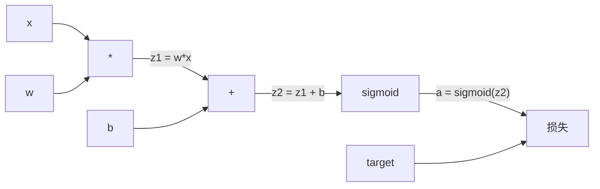
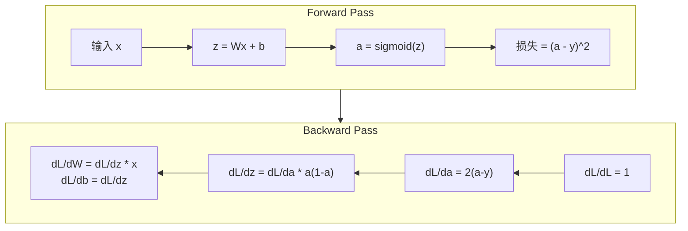

# 从零实现反向传播

> 反向传播 是 algorithm that makes learning possible. Without it, 神经网络 是 just expensive random number generators.

**Type:** 构建
**Languages:** Python
**Prerequisites:** Lesson 03.02 (Multi-层 Networks)
**Time:** ~120 minutes

## 学习目标

- 实现 a Value-based autograd engine that builds a computational graph 和 computes 梯度s via topological sort
- Derive backward pass 用于 addition, multiplication, 和 sigmoid using 链式法则
- 训练 a multi-层 network 在 XOR 和 circle 分类 using only 你的 从-scratch 反向传播 engine
- 识别 vanishing 梯度 问题 在 deep sigmoid networks 和 解释 为什么 梯度s shrink exponentially

## 问题

Your network has a single hidden 层 用 768 输入 和 3072 输出. That's 2,359,296 权重. It made a wrong 预测. Which 权重 caused 错误? Testing each weight individually means 2.3 million 前向传播es. 反向传播 computes all 2.3 million 梯度s 在 a single backward pass. That's 不 an optimization. That's difference between trainable 和 impossible.

naive approach: take one weight, nudge it by a tiny amount, 运行 前向传播 again, measure whether 损失 went up 或 down. That gives 你 梯度 用于 that weight. Now do it 用于 every weight 在 network. Multiply by thousands of 训练 步骤 和 millions of 数据 points. 你'd need geological time 到 训练 anything useful.

反向传播 solves 这. One 前向传播, one backward pass, all 梯度s computed. trick 是 链式法则 从 calculus, applied systematically 到 a computational graph. 这 是 algorithm that made deep learning practical. Without it, we'd still be stuck 在 toy problems.

## 概念

### 链式法则, Applied 到 Networks

你 saw 链式法则 在 Phase 01, Lesson 05. Quick recap: 如果 y = f(g(x)), 然后 dy/dx = f'(g(x)) * g'(x). 你 multiply derivatives along chain.

In a 神经网络, "chain" 是 sequence of operations 从 输入 到 损失. Each 层 applies 权重, adds 偏置es, passes through an 激活. 损失 函数 compares final 输出 到 target. 反向传播 traces 这 chain backward, computing 如何 each operation contributed 到 错误.

### Computational Graphs

Every 前向传播 builds a graph. Each node 是 an operation (multiply, 加入, sigmoid). Each edge carries a 值 forward 和 a 梯度 backward.



Forward pass: 值 flow left 到 right. x 和 w produce z1 = w*x. 加入 b 到 get z2. Sigmoid gives 激活 a. 比较 a 到 target y using 损失 函数.

Backward pass: 梯度s flow right 到 left. 开始 用 dL/da (如何 损失 changes 用 激活). Multiply by da/dz2 (sigmoid derivative). That gives dL/dz2. Split into dL/db (which equals dL/dz2, since z2 = z1 + b) 和 dL/dz1. Then dL/dw = dL/dz1 * x 和 dL/dx = dL/dz1 * w.

Every node 在 graph has one job during backward pass: take 梯度 coming 从 above, multiply by its local derivative, 和 pass it down.

### Forward vs Backward



前向传播 stores every intermediate 值: z, a, 输入 到 each 层. backward pass needs these stored 值 到 compute 梯度s. 这 是 内存-computation tradeoff at heart of backprop. 你 trade 内存 (storing 激活s) 用于 speed (one pass instead of millions).

### 梯度 Flow Through a Network

For a 3-层 network, 梯度s chain through every 层:


At each 层, 梯度 gets multiplied by sigmoid derivative. sigmoid derivative 是 a * (1 - a), which maxes out at 0.25 (当 a = 0.5). Three 层 deep, 梯度 has been multiplied by at most 0.25^3 = 0.0156. Ten 层 deep: 0.25^10 = 0.000001.

### 梯度消失

这 是 vanishing 梯度 问题. Sigmoid squashes its 输出 between 0 和 1. Its derivative 是 always less than 0.25. Stack enough sigmoid 层 和 梯度s shrink 到 nothing. Early 层 barely learn 因为 they receive near-zero 梯度s.

```
sigmoid(z):     Output range [0, 1]
sigmoid'(z):    Max value 0.25 (at z = 0)

After 5 layers:   gradient * 0.25^5 = 0.001x original
After 10 layers:  gradient * 0.25^10 = 0.000001x original
```

这 是 为什么 deep sigmoid networks 是 nearly impossible 到 训练. fix -- ReLU 和 its variants -- 是 subject of Lesson 04. For now, understand that backprop works perfectly. 问题 是 what it's working through.

### Deriving 梯度s 用于 a 2-层 Network

Concrete math 用于 a network 用 输入 x, hidden 层 用 sigmoid, 输出 层 用 sigmoid, 和 MSE 损失.

Forward pass:
```
z1 = W1 * x + b1
a1 = sigmoid(z1)
z2 = W2 * a1 + b2
a2 = sigmoid(z2)
L = (a2 - y)^2
```

Backward pass (applying 链式法则 步骤 by 步骤):
```
dL/da2 = 2(a2 - y)
da2/dz2 = a2 * (1 - a2)
dL/dz2 = dL/da2 * da2/dz2 = 2(a2 - y) * a2 * (1 - a2)

dL/dW2 = dL/dz2 * a1
dL/db2 = dL/dz2

dL/da1 = dL/dz2 * W2
da1/dz1 = a1 * (1 - a1)
dL/dz1 = dL/da1 * da1/dz1

dL/dW1 = dL/dz1 * x
dL/db1 = dL/dz1
```

Every 梯度 是 a product of local derivatives traced back 从 损失. That's all 反向传播 是.

```figure
backprop-vanishing
```

## 动手构建

### Step 1: Value Node

Every number 在 our computation becomes a Value. It stores its 数据, its 梯度, 和 如何 it 是 created (so it knows 如何 到 compute 梯度s backward).

```python
class Value:
    def __init__(self, data, children=(), op=''):
        self.data = data
        self.grad = 0.0
        self._backward = lambda: None
        self._children = set(children)
        self._op = op

    def __repr__(self):
        return f"Value(data={self.data:.4f}, grad={self.grad:.4f})"
```

No 梯度 yet (0.0). No backward 函数 yet (没有-op).`_children`track which Values produced 这 one, so we can topologically sort graph later.

### Step 2: Operations 用 Backward Functions

Each operation creates a new Value 和 defines 如何 梯度s flow backward through it.

```python
def __add__(self, other):
    other = other if isinstance(other, Value) else Value(other)
    out = Value(self.data + other.data, (self, other), '+')

    def _backward():
        self.grad += out.grad
        other.grad += out.grad

    out._backward = _backward
    return out

def __mul__(self, other):
    other = other if isinstance(other, Value) else Value(other)
    out = Value(self.data * other.data, (self, other), '*')

    def _backward():
        self.grad += other.data * out.grad
        other.grad += self.data * out.grad

    out._backward = _backward
    return out
```

For addition: d(a+b)/da = 1, d(a+b)/db = 1. So both 输入 get 输出's 梯度 directly.

For multiplication: d(a*b)/da = b, d(a*b)/db = a. Each 输入 gets other's 值 times 输出 梯度.

`+=`是 critical. A Value might be used 在 multiple operations. Its 梯度 是 sum of 梯度s 从 all paths.

### Step 3: Sigmoid 和 损失

```python
import math

def sigmoid(self):
    x = self.data
    x = max(-500, min(500, x))
    s = 1.0 / (1.0 + math.exp(-x))
    out = Value(s, (self,), 'sigmoid')

    def _backward():
        self.grad += (s * (1 - s)) * out.grad

    out._backward = _backward
    return out
```

Sigmoid derivative: sigmoid(x) * (1 - sigmoid(x)). We computed sigmoid(x) = s during 前向传播. Reuse it. No extra work.

```python
def mse_loss(predicted, target):
    diff = predicted + Value(-target)
    return diff * diff
```

MSE 用于 a single 输出: (predicted - target)^2. We express subtraction as addition 用 a negated Value.

### Step 4: 反向传播

Topological sort ensures we process nodes 在 right order -- a node's 梯度 是 fully accumulated 之前 we propagate through it.

```python
def backward(self):
    topo = []
    visited = set()

    def build_topo(v):
        if v not in visited:
            visited.add(v)
            for child in v._children:
                build_topo(child)
            topo.append(v)

    build_topo(self)
    self.grad = 1.0
    for v in reversed(topo):
        v._backward()
```

开始 at 损失 (梯度 = 1.0, since dL/dL = 1). Walk backward through sorted graph. Each node's`_backward`pushes 梯度s 到 its children.

### Step 5: 层 和 Network

```python
import random

class Neuron:
    def __init__(self, n_inputs):
        scale = (2.0 / n_inputs) ** 0.5
        self.weights = [Value(random.uniform(-scale, scale)) for _ in range(n_inputs)]
        self.bias = Value(0.0)

    def __call__(self, x):
        act = sum((wi * xi for wi, xi in zip(self.weights, x)), self.bias)
        return act.sigmoid()

    def parameters(self):
        return self.weights + [self.bias]


class Layer:
    def __init__(self, n_inputs, n_outputs):
        self.neurons = [Neuron(n_inputs) for _ in range(n_outputs)]

    def __call__(self, x):
        out = [n(x) for n in self.neurons]
        return out[0] if len(out) == 1 else out

    def parameters(self):
        params = []
        for n in self.neurons:
            params.extend(n.parameters())
        return params


class Network:
    def __init__(self, sizes):
        self.layers = []
        for i in range(len(sizes) - 1):
            self.layers.append(Layer(sizes[i], sizes[i + 1]))

    def __call__(self, x):
        for layer in self.layers:
            x = layer(x)
            if not isinstance(x, list):
                x = [x]
        return x[0] if len(x) == 1 else x

    def parameters(self):
        params = []
        for layer in self.layers:
            params.extend(layer.parameters())
        return params

    def zero_grad(self):
        for p in self.parameters():
            p.grad = 0.0
```

A Neuron takes 输入, computes weighted sum + 偏置, 和 applies sigmoid. Weight initialization scales by sqrt(2/n_inputs) 到 prevent sigmoid saturation 在 deeper networks. A 层 是 a list of Neurons. A Network 是 a list of 层.`parameters()`method collects all learnable Values so we can update them.

### Step 6: 训练 在 XOR

```python
random.seed(42)
net = Network([2, 4, 1])

xor_data = [
    ([0.0, 0.0], 0.0),
    ([0.0, 1.0], 1.0),
    ([1.0, 0.0], 1.0),
    ([1.0, 1.0], 0.0),
]

learning_rate = 1.0

for epoch in range(1000):
    total_loss = Value(0.0)
    for inputs, target in xor_data:
        x = [Value(i) for i in inputs]
        pred = net(x)
        loss = mse_loss(pred, target)
        total_loss = total_loss + loss

    net.zero_grad()
    total_loss.backward()

    for p in net.parameters():
        p.data -= learning_rate * p.grad

    if epoch % 100 == 0:
        print(f"Epoch {epoch:4d} | Loss: {total_loss.data:.6f}")

print("\nXOR Results:")
for inputs, target in xor_data:
    x = [Value(i) for i in inputs]
    pred = net(x)
    print(f"  {inputs} -> {pred.data:.4f} (expected {target})")
```

Watch 损失 decrease. From random 预测s 到 correct XOR 输出, driven entirely by 反向传播 computing 梯度s 和 nudging 权重 在 right direction.

### Step 7: Circle 分类

In Lesson 02, 你 hand-tuned 权重 用于 circle 分类. Now let network learn them.

```python
random.seed(7)

def generate_circle_data(n=100):
    data = []
    for _ in range(n):
        x1 = random.uniform(-1.5, 1.5)
        x2 = random.uniform(-1.5, 1.5)
        label = 1.0 if x1 * x1 + x2 * x2 < 1.0 else 0.0
        data.append(([x1, x2], label))
    return data

circle_data = generate_circle_data(80)

circle_net = Network([2, 8, 1])
learning_rate = 0.5

for epoch in range(2000):
    random.shuffle(circle_data)
    total_loss_val = 0.0
    for inputs, target in circle_data:
        x = [Value(i) for i in inputs]
        pred = circle_net(x)
        loss = mse_loss(pred, target)
        circle_net.zero_grad()
        loss.backward()
        for p in circle_net.parameters():
            p.data -= learning_rate * p.grad
        total_loss_val += loss.data

    if epoch % 200 == 0:
        correct = 0
        for inputs, target in circle_data:
            x = [Value(i) for i in inputs]
            pred = circle_net(x)
            predicted_class = 1.0 if pred.data > 0.5 else 0.0
            if predicted_class == target:
                correct += 1
        accuracy = correct / len(circle_data) * 100
        print(f"Epoch {epoch:4d} | Loss: {total_loss_val:.4f} | Accuracy: {accuracy:.1f}%")
```

We 使用 online SGD here -- update 权重 之后 each 样本 instead of accumulating full 批次. 这 breaks symmetry faster 和 avoids sigmoid saturation 在 full 损失 landscape. Shuffling 数据 each 轮次 prevents network 从 memorizing order.

No hand-tuning. network discovers circular 决策 边界 在 its own. That's power of 反向传播: 你 define 架构, 损失 函数, 和 数据. algorithm figures out 权重.

## 直接使用

PyTorch does everything above 在 a few lines. core idea 是 identical -- autograd builds a computational graph during 前向传播 和 traces it backward 到 compute 梯度s.

```python
import torch
import torch.nn as nn

model = nn.Sequential(
    nn.Linear(2, 4),
    nn.Sigmoid(),
    nn.Linear(4, 1),
    nn.Sigmoid(),
)
optimizer = torch.optim.SGD(model.parameters(), lr=1.0)
criterion = nn.MSELoss()

X = torch.tensor([[0,0],[0,1],[1,0],[1,1]], dtype=torch.float32)
y = torch.tensor([[0],[1],[1],[0]], dtype=torch.float32)

for epoch in range(1000):
    pred = model(X)
    loss = criterion(pred, y)
    optimizer.zero_grad()
    loss.backward()
    optimizer.step()

print("PyTorch XOR Results:")
with torch.no_grad():
    for i in range(4):
        pred = model(X[i])
        print(f"  {X[i].tolist()} -> {pred.item():.4f} (expected {y[i].item()})")
```

`loss.backward()`是 你的`total_loss.backward()`.`optimizer.step()`是 你的 manual`p.data -= lr * p.grad`.`optimizer.zero_grad()`是 你的`net.zero_grad()`. Same algorithm, industrial-strength implementation. PyTorch handles GPU acceleration, mixed 精度, 梯度 checkpointing, 和 hundreds of 层 types. But backward pass 是 same 链式法则 applied 到 same computational graph.

训练 runs 前向传播, 然后 backward pass, 然后 updates 权重. Inference runs only 前向传播. No 梯度s, 没有 updates. 这 distinction matters 因为 推理 是 what happens 在 production. When 你 call an API like Claude 或 GPT, 你're running 推理 -- 你的 prompt flows forward through network, 和 tokens come out other end. No 权重 change. Understanding backprop matters 因为 it shaped every weight 在 that network.

## 交付它

这 lesson produces:
- `outputs/prompt-gradient-debugger.md`-- a reusable prompt 用于 diagnosing 梯度 problems (vanishing, exploding, NaN) 在 any 神经网络

## Exercises

1. 加入 a`__sub__`method 到 Value class (a - b = a + (-1 * b)). Then 实现 a`__neg__`method. 确认 that 梯度s 是 correct by comparing 用 manual calculation 用于 a 简单 expression like (a - b)^2.

2. 加入 a`relu`method 到 Value (输出 max(0, x), derivative 是 1 如果 x > 0, else 0). Replace sigmoid 用 relu 在 hidden 层 和 训练 在 XOR again. 比较 convergence speed. 你 should see faster 训练 -- 这 previews Lesson 04.

3. 实现 a`__pow__`method 在 Value 用于 integer powers. 使用 it 到 replace`mse_loss`用 a proper`(predicted - target) ** 2`expression. 确认 梯度s match original implementation.

4. 加入 梯度 clipping 到 训练循环: 之后 calling`backward()`, clip all 梯度s 到 [-1, 1]. 训练 a deeper network (4+ 层 用 sigmoid) 和 比较 损失 curves 用 和 不用 clipping. 这 是 你的 first defense against exploding 梯度s.

5. 构建 a visualization: 之后 训练 在 XOR, 打印 梯度 of every parameter 在 network. 识别 which 层 has smallest 梯度s. 这 demonstrates vanishing 梯度 问题 你 read about 在 Concept section.

## Key Terms

|Term|What people say|What it actually means|
|------|----------------|----------------------|
|反向传播|" network learns"|An algorithm that computes dL/dw 用于 every weight by applying 链式法则 backward through computational graph|
|Computational graph|" network structure"|A directed acyclic graph 其中 nodes 是 operations 和 edges carry 值 (forward) 和 梯度s (backward)|
|Chain 规则|"Multiply derivatives"|If y = f(g(x)), 然后 dy/dx = f'(g(x)) * g'(x) -- mathematical foundation of 反向传播|
|梯度|" direction of steepest ascent"|partial derivative of 损失 用 respect 到 a parameter -- tells 你 如何 到 change that parameter 到 降低 损失|
|Vanishing 梯度|"Deep networks don't learn"|梯度s shrink exponentially as they propagate through 层 用 saturating 激活s like sigmoid|
|Forward pass|"Running network"|Computing 输出 从 输入 by sequentially applying each 层's operations 和 storing intermediate 值|
|Backward pass|"Computing 梯度s"|Traversing computational graph 在 reverse, accumulating 梯度s at each node using 链式法则|
|Learning rate|"How fast it learns"|A scalar that controls 步骤 size 当 updating 权重: w_new = w_old - lr * 梯度|
|Topological sort|" right order"|An ordering of graph nodes 其中 each node appears 之后 all nodes it depends 在 -- ensures 梯度s 是 fully accumulated 之前 propagation|
|Autograd|"Automatic differentiation"|A system that builds computational graphs during forward computation 和 automatically computes 梯度s -- what PyTorch's engine does|

## Further Reading

- Rumelhart, Hinton & Williams, "Learning representations by back-propagating 错误" (1986) -- paper that made 反向传播 mainstream 和 unlocked multi-层 network 训练
- 3Blue1Brown, "神经网络" series (https://www.youtube.com/playlist?list=PLZHQObOWTQDNU6R1_67000Dx_ZCJB-3pi)-- best visual explanation of 反向传播 和 梯度 flow through networks
