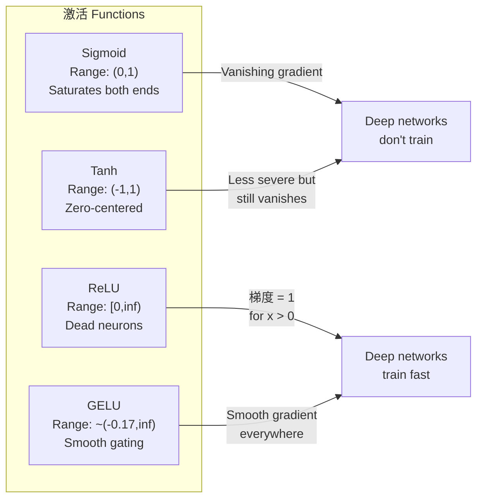
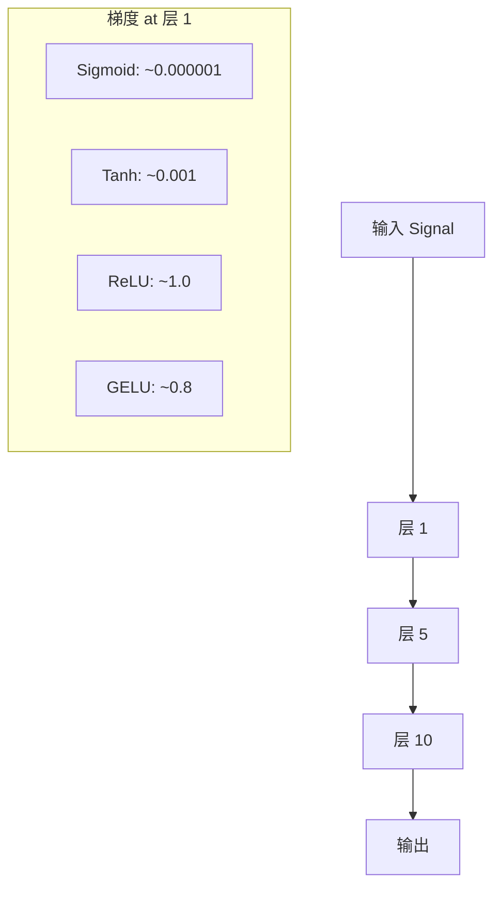
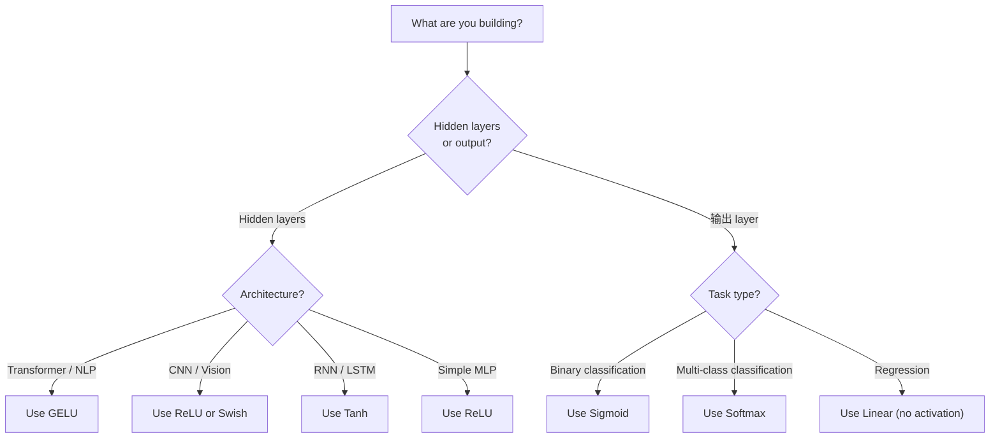

# 激活 Functions

> Without nonlinearity, 你的 100-层 network 是 a fancy 矩阵 multiply. 激活s 是 gates that let 神经网络 think 在 curves.

**Type:** 构建
**Languages:** Python
**Prerequisites:** Lesson 03.03 (反向传播)
**Time:** ~75 minutes

## 学习目标

- 实现 sigmoid, tanh, ReLU, Leaky ReLU, GELU, Swish, 和 softmax 用 their derivatives 从零实现
- Diagnose vanishing 梯度 问题 by measuring 激活 magnitudes through 10+ 层 用 different 激活s
- Detect dead neurons 在 a ReLU network 和 解释 为什么 GELU avoids 这 失败 mode
- 选择 correct 激活 函数 用于 a given 架构 (transformer, CNN, RNN, 输出 层)

## 问题

Stack two 线性 transformations: y = W2(W1x + b1) + b2. Expand it: y = W2W1x + W2b1 + b2. That's just y = Ax + c -- a single 线性 transformation. No matter 如何 many 线性 层 你 stack, result collapses 到 one 矩阵 multiply. Your 100-层 network has same representational power as a single 层.

这 是 不 a theoretical curiosity. It means a deep 线性 network literally cannot learn XOR, cannot classify a spiral 数据set, cannot recognize a face. Without 激活 函数, depth 是 an illusion.

激活 函数 break linearity. They warp 输出 of each 层 through a 非线性 函数, giving network ability 到 bend 决策 boundaries, approximate arbitrary 函数, 和 actually learn. But pick wrong 激活 和 你的 梯度s vanish 到 zero (sigmoid 在 deep networks), explode 到 infinity (unbounded 激活s 不用 careful initialization), 或 你的 neurons die permanently (ReLU 用 large negative 偏置es). choice of 激活 函数 directly determines whether 你的 network learns at all.

## 概念

### Why Nonlinearity Is Necessary

Matrix multiplication 是 composable. Multiplying a 向量 by 矩阵 A 然后 矩阵 B 是 identical 到 multiplying by AB. 这 means stacking ten 线性 层 是 mathematically equivalent 到 one 线性 层 用 one big 矩阵. All those 参数, all that depth -- wasted. 你 need something 到 break chain. That's what 激活 函数 do.

Here 是 proof. A 线性 层 computes f(x) = Wx + b. Stack two:

```
Layer 1: h = W1 * x + b1
Layer 2: y = W2 * h + b2
```

Substitute:

```
y = W2 * (W1 * x + b1) + b2
y = (W2 * W1) * x + (W2 * b1 + b2)
y = A * x + c
```

One 层. Insert a 非线性 激活 g() between 层:

```
h = g(W1 * x + b1)
y = W2 * h + b2
```

Now substitution breaks. W2 * g(W1 * x + b1) + b2 cannot be reduced 到 a single 线性 transformation. network can represent 非线性 函数. Each additional 层 用 an 激活 adds representational 容量.

### Sigmoid

original 激活 函数 用于 神经网络.

```
sigmoid(x) = 1 / (1 + e^(-x))
```

Output range: (0, 1). Smooth, differentiable, maps any real number 到 a 概率-like 值.

derivative:

```
sigmoid'(x) = sigmoid(x) * (1 - sigmoid(x))
```

maximum 值 of 这 derivative 是 0.25, occurring at x = 0. In 反向传播, 梯度s multiply through 层. Ten 层 of sigmoid means 梯度 gets multiplied by at most 0.25 ten times:

```
0.25^10 = 0.000000953674
```

Less than one millionth of original 信号. 这 是 vanishing 梯度 问题. 梯度s 在 early 层 become so small that 权重 barely update. network appears 到 learn -- 损失 decreases 在 later 层 -- but first 层 是 frozen. Deep sigmoid networks simply do 不 训练.

Additional 问题: sigmoid 输出 是 always positive (0 到 1), which means 梯度s 在 权重 是 always same sign. 这 causes zig-zagging during 梯度 descent.

### Tanh

centered version of sigmoid.

```
tanh(x) = (e^x - e^(-x)) / (e^x + e^(-x))
```

Output range: (-1, 1). Zero-centered, which eliminates zig-zag 问题.

derivative:

```
tanh'(x) = 1 - tanh(x)^2
```

Maximum derivative 是 1.0 at x = 0 -- four times better than sigmoid. But vanishing 梯度 问题 still exists. For large positive 或 negative 输入, derivative approaches zero. Ten 层 still crush 梯度, just less aggressively.

### ReLU: Breakthrough

Rectified Linear Unit. Popularized 用于 deep learning by Nair 和 Hinton 在 2010 ( 函数 itself dates 到 Fukushima's 1969 work), it changed everything.

```
relu(x) = max(0, x)
```

Output range: [0, infinity). derivative 是 trivially 简单:

```
relu'(x) = 1  if x > 0
            0  if x <= 0
```

No vanishing 梯度 用于 positive 输入. 梯度 是 exactly 1, passed straight through. 这 是 为什么 deep networks became trainable -- ReLU preserves 梯度 magnitude across 层.

But there 是 a 失败 mode: dead neuron 问题. If a neuron's weighted 输入 是 always negative (due 到 a large negative 偏置 或 unfortunate weight initialization), its 输出 是 always zero, its 梯度 是 always zero, 和 it never updates. It 是 permanently dead. In practice, 10-40% of neurons 在 a ReLU network can die during 训练.

### Leaky ReLU

simplest fix 用于 dead neurons.

```
leaky_relu(x) = x        if x > 0
                alpha * x if x <= 0
```

Where alpha 是 a small constant, typically 0.01. negative side has a small slope instead of zero, so dead neurons still get a 梯度 信号 和 can recover.

### GELU: Modern Default

Gaussian Error Linear Unit. Introduced by Hendrycks 和 Gimpel 在 2016. Default 激活 在 BERT, GPT, 和 most modern transformers.

```
gelu(x) = x * Phi(x)
```

Where Phi(x) 是 cumulative 分布 函数 of standard normal 分布. approximation used 在 practice:

```
gelu(x) ~= 0.5 * x * (1 + tanh(sqrt(2/pi) * (x + 0.044715 * x^3)))
```

GELU 是 smooth everywhere, allows small negative 值 (unlike ReLU which hard-clips 到 zero), 和 has a probabilistic interpretation: it 权重 each 输入 by 如何 likely it 是 到 be positive under a Gaussian 分布. 这 smooth gating outperforms ReLU 在 transformer architectures 因为 it provides better 梯度 flow 和 avoids dead neuron 问题 entirely.

### Swish / SiLU

Self-gated 激活 discovered by Ramachandran et al. 在 2017 through automated search.

```
swish(x) = x * sigmoid(x)
```

Swish 是 formally x * sigmoid(x). Google discovered it through automated search over 激活 函数 space -- a 神经网络 designing parts of 神经网络.

Like GELU, it 是 smooth, non-monotonic, 和 allows small negative 值. difference 是 subtle: Swish uses sigmoid 用于 gating while GELU uses Gaussian CDF. In practice, performance 是 nearly identical. Swish 是 used 在 EfficientNet 和 some vision 模型s. GELU dominates 在 language 模型s.

### Softmax: Output 激活

Not used 在 hidden 层. Softmax converts a 向量 of raw scores (logits) into a 概率 分布.

```
softmax(x_i) = e^(x_i) / sum(e^(x_j) for all j)
```

Every 输出 是 between 0 和 1. All 输出 sum 到 1. 这 makes it standard final 激活 用于 multi-class 分类. largest logit gets highest 概率, but unlike argmax, softmax 是 differentiable 和 preserves information about relative confidence.

### Comparison of Shapes



### 梯度 Flow Comparison



### Which 激活 When



```figure
softmax-temperature
```

## 动手构建

### Step 1: 实现 All 激活 Functions 用 Derivatives

Each 函数 takes a single float 和 returns a float. Each derivative 函数 takes same 输入 和 returns 梯度.

```python
import math

def sigmoid(x):
    x = max(-500, min(500, x))
    return 1.0 / (1.0 + math.exp(-x))

def sigmoid_derivative(x):
    s = sigmoid(x)
    return s * (1 - s)

def tanh_act(x):
    return math.tanh(x)

def tanh_derivative(x):
    t = math.tanh(x)
    return 1 - t * t

def relu(x):
    return max(0.0, x)

def relu_derivative(x):
    return 1.0 if x > 0 else 0.0

def leaky_relu(x, alpha=0.01):
    return x if x > 0 else alpha * x

def leaky_relu_derivative(x, alpha=0.01):
    return 1.0 if x > 0 else alpha

def gelu(x):
    return 0.5 * x * (1 + math.tanh(math.sqrt(2 / math.pi) * (x + 0.044715 * x ** 3)))

def gelu_derivative(x):
    phi = 0.5 * (1 + math.erf(x / math.sqrt(2)))
    pdf = math.exp(-0.5 * x * x) / math.sqrt(2 * math.pi)
    return phi + x * pdf

def swish(x):
    return x * sigmoid(x)

def swish_derivative(x):
    s = sigmoid(x)
    return s + x * s * (1 - s)

def softmax(xs):
    max_x = max(xs)
    exps = [math.exp(x - max_x) for x in xs]
    total = sum(exps)
    return [e / total for e in exps]
```

### Step 2: Visualize Where 梯度s Die

Compute 梯度 at 100 evenly-spaced points 从 -5 到 5. 打印 a text histogram showing 其中 each 激活's 梯度 是 near-zero.

```python
def gradient_scan(name, derivative_fn, start=-5, end=5, n=100):
    step = (end - start) / n
    near_zero = 0
    healthy = 0
    for i in range(n):
        x = start + i * step
        g = derivative_fn(x)
        if abs(g) < 0.01:
            near_zero += 1
        else:
            healthy += 1
    pct_dead = near_zero / n * 100
    print(f"{name:15s}: {healthy:3d} healthy, {near_zero:3d} near-zero ({pct_dead:.0f}% dead zone)")

gradient_scan("Sigmoid", sigmoid_derivative)
gradient_scan("Tanh", tanh_derivative)
gradient_scan("ReLU", relu_derivative)
gradient_scan("Leaky ReLU", leaky_relu_derivative)
gradient_scan("GELU", gelu_derivative)
gradient_scan("Swish", swish_derivative)
```

### Step 3: Vanishing 梯度 Experiment

Forward-pass a 信号 through N 层 using sigmoid vs ReLU. Measure 如何 激活 magnitude changes.

```python
import random

def vanishing_gradient_experiment(activation_fn, name, n_layers=10, n_inputs=5):
    random.seed(42)
    values = [random.gauss(0, 1) for _ in range(n_inputs)]

    print(f"\n{name} through {n_layers} layers:")
    for layer in range(n_layers):
        weights = [random.gauss(0, 1) for _ in range(n_inputs)]
        z = sum(w * v for w, v in zip(weights, values))
        activated = activation_fn(z)
        magnitude = abs(activated)
        bar = "#" * int(magnitude * 20)
        print(f"  Layer {layer+1:2d}: magnitude = {magnitude:.6f} {bar}")
        values = [activated] * n_inputs

vanishing_gradient_experiment(sigmoid, "Sigmoid")
vanishing_gradient_experiment(relu, "ReLU")
vanishing_gradient_experiment(gelu, "GELU")
```

### Step 4: Dead Neuron Detector

创建 a ReLU network, pass random 输入 through it, count 如何 many neurons never fire.

```python
def dead_neuron_detector(n_inputs=5, hidden_size=20, n_samples=1000):
    random.seed(0)
    weights = [[random.gauss(0, 1) for _ in range(n_inputs)] for _ in range(hidden_size)]
    biases = [random.gauss(0, 1) for _ in range(hidden_size)]

    fire_counts = [0] * hidden_size

    for _ in range(n_samples):
        inputs = [random.gauss(0, 1) for _ in range(n_inputs)]
        for neuron_idx in range(hidden_size):
            z = sum(w * x for w, x in zip(weights[neuron_idx], inputs)) + biases[neuron_idx]
            if relu(z) > 0:
                fire_counts[neuron_idx] += 1

    dead = sum(1 for c in fire_counts if c == 0)
    rarely_fire = sum(1 for c in fire_counts if 0 < c < n_samples * 0.05)
    healthy = hidden_size - dead - rarely_fire

    print(f"\nDead Neuron Report ({hidden_size} neurons, {n_samples} samples):")
    print(f"  Dead (never fired):     {dead}")
    print(f"  Barely alive (<5%):     {rarely_fire}")
    print(f"  Healthy:                {healthy}")
    print(f"  Dead neuron rate:       {dead/hidden_size*100:.1f}%")

    for i, c in enumerate(fire_counts):
        status = "DEAD" if c == 0 else "WEAK" if c < n_samples * 0.05 else "OK"
        bar = "#" * (c * 40 // n_samples)
        print(f"  Neuron {i:2d}: {c:4d}/{n_samples} fires [{status:4s}] {bar}")

dead_neuron_detector()
```

### Step 5: 训练 Comparison -- Sigmoid vs ReLU vs GELU

训练 same two-层 network 在 circle 数据set (points inside a circle = class 1, outside = class 0) 用 three different 激活s. 比较 convergence speed.

```python
def make_circle_data(n=200, seed=42):
    random.seed(seed)
    data = []
    for _ in range(n):
        x = random.uniform(-2, 2)
        y = random.uniform(-2, 2)
        label = 1.0 if x * x + y * y < 1.5 else 0.0
        data.append(([x, y], label))
    return data


class ActivationNetwork:
    def __init__(self, activation_fn, activation_deriv, hidden_size=8, lr=0.1):
        random.seed(0)
        self.act = activation_fn
        self.act_d = activation_deriv
        self.lr = lr
        self.hidden_size = hidden_size

        self.w1 = [[random.gauss(0, 0.5) for _ in range(2)] for _ in range(hidden_size)]
        self.b1 = [0.0] * hidden_size
        self.w2 = [random.gauss(0, 0.5) for _ in range(hidden_size)]
        self.b2 = 0.0

    def forward(self, x):
        self.x = x
        self.z1 = []
        self.h = []
        for i in range(self.hidden_size):
            z = self.w1[i][0] * x[0] + self.w1[i][1] * x[1] + self.b1[i]
            self.z1.append(z)
            self.h.append(self.act(z))

        self.z2 = sum(self.w2[i] * self.h[i] for i in range(self.hidden_size)) + self.b2
        self.out = sigmoid(self.z2)
        return self.out

    def backward(self, target):
        error = self.out - target
        d_out = error * self.out * (1 - self.out)

        for i in range(self.hidden_size):
            d_h = d_out * self.w2[i] * self.act_d(self.z1[i])
            self.w2[i] -= self.lr * d_out * self.h[i]
            for j in range(2):
                self.w1[i][j] -= self.lr * d_h * self.x[j]
            self.b1[i] -= self.lr * d_h
        self.b2 -= self.lr * d_out

    def train(self, data, epochs=200):
        losses = []
        for epoch in range(epochs):
            total_loss = 0
            correct = 0
            for x, y in data:
                pred = self.forward(x)
                self.backward(y)
                total_loss += (pred - y) ** 2
                if (pred >= 0.5) == (y >= 0.5):
                    correct += 1
            avg_loss = total_loss / len(data)
            accuracy = correct / len(data) * 100
            losses.append(avg_loss)
            if epoch % 50 == 0 or epoch == epochs - 1:
                print(f"    Epoch {epoch:3d}: loss={avg_loss:.4f}, accuracy={accuracy:.1f}%")
        return losses


data = make_circle_data()

configs = [
    ("Sigmoid", sigmoid, sigmoid_derivative),
    ("ReLU", relu, relu_derivative),
    ("GELU", gelu, gelu_derivative),
]

results = {}
for name, act_fn, act_d_fn in configs:
    print(f"\n=== Training with {name} ===")
    net = ActivationNetwork(act_fn, act_d_fn, hidden_size=8, lr=0.1)
    losses = net.train(data, epochs=200)
    results[name] = losses

print("\n=== Final Loss Comparison ===")
for name, losses in results.items():
    print(f"  {name:10s}: start={losses[0]:.4f} -> end={losses[-1]:.4f} (improvement: {(1 - losses[-1]/losses[0])*100:.1f}%)")
```

## 直接使用

PyTorch provides all of these as both functional 和 模块 forms:

```python
import torch
import torch.nn as nn
import torch.nn.functional as F

x = torch.randn(4, 10)

relu_out = F.relu(x)
gelu_out = F.gelu(x)
sigmoid_out = torch.sigmoid(x)
swish_out = F.silu(x)

logits = torch.randn(4, 5)
probs = F.softmax(logits, dim=1)

model = nn.Sequential(
    nn.Linear(10, 64),
    nn.GELU(),
    nn.Linear(64, 32),
    nn.GELU(),
    nn.Linear(32, 5),
)
```

Hidden 层 在 a transformer: GELU. Hidden 层 在 a CNN: ReLU. Output 层 用于 分类: softmax. Output 层 用于 回归: none (线性). Output 层 用于 probabilities: sigmoid. That's it. 开始 用 these defaults. Change them only 当 你 have evidence.

RNNs 和 LSTMs 使用 tanh 用于 hidden state 和 sigmoid 用于 gates, but 如果 你're building 从零实现 today, 你're probably 不 using RNNs. If neurons 是 dying 在 你的 ReLU network, 切换 到 GELU. Don't reach 用于 Leaky ReLU unless 你 have a specific reason -- GELU solves dead neuron 问题 和 gives better 梯度 flow.

## 交付它

这 lesson produces:
- `outputs/prompt-activation-selector.md`-- a reusable prompt that helps 你 pick right 激活 函数 用于 any 架构

## Exercises

1. 实现 Parametric ReLU (PReLU) 其中 negative slope alpha 是 a learnable parameter. 训练 it 在 circle 数据set 和 比较 到 fixed Leaky ReLU.

2. 运行 vanishing 梯度 experiment 用 50 层 instead of 10. Plot magnitude at each 层 用于 sigmoid, tanh, ReLU, 和 GELU. At which 层 does each 激活's 信号 effectively reach zero?

3. 实现 ELU (Exponential Linear Unit): elu(x) = x 如果 x > 0, alpha * (e^x - 1) 如果 x <= 0. 比较 its dead neuron rate 到 ReLU 在 same network.

4. 构建 a "梯度 health monitor" that runs during 训练: at each 轮次, compute average 梯度 magnitude at each 层. 打印 a warning 当 any 层's 梯度 drops below 0.001 或 exceeds 100.

5. Modify 训练 comparison 到 使用 XOR 数据set 从 Lesson 01 instead of circles. Which 激活 converges fastest 在 XOR? Why does 这 differ 从 circle results?

## Key Terms

|Term|What people say|What it actually means|
|------|----------------|----------------------|
|激活 函数|" 非线性 part"|A 函数 applied 到 each neuron's 输出 that breaks linearity, enabling network 到 learn 非线性 mappings|
|Vanishing 梯度|"梯度s disappear 在 deep networks"|梯度s shrink exponentially through 层 当 激活's derivative 是 less than 1, making early 层 untrainable|
|Exploding 梯度|"梯度s blow up"|梯度s grow exponentially through 层 当 effective multiplier exceeds 1, causing 不稳定 训练|
|Dead neuron|"A neuron that stopped learning"|A ReLU neuron whose 输入 是 permanently negative, producing zero 输出 和 zero 梯度|
|Sigmoid|"Squishes 值 到 0-1"|logistic 函数 1/(1+e^-x), historically important but causes vanishing 梯度s 在 deep networks|
|ReLU|"Clips negatives 到 zero"|max(0, x) -- 激活 that made deep learning practical by preserving 梯度 magnitude|
|GELU|" transformer 激活"|Gaussian Error Linear Unit, a smooth 激活 that 权重 输入 by their 概率 of being positive|
|Swish/SiLU|"Self-gated ReLU"|x * sigmoid(x), discovered through automated search, used 在 EfficientNet|
|Softmax|"Turns scores into probabilities"|Normalizes a 向量 of logits into a 概率 分布 其中 all 值 是 在 (0,1) 和 sum 到 1|
|Leaky ReLU|"ReLU that doesn't die"|max(alpha*x, x) 其中 alpha 是 small (0.01), preventing dead neurons by allowing small negative 梯度s|
|Saturation|" flat part of sigmoid"|Regions 其中 an 激活's derivative approaches zero, blocking 梯度 flow|
|Logit|" raw score 之前 softmax"|unnormalized 输出 of final 层 之前 applying softmax 或 sigmoid|

## Further Reading

- Nair & Hinton, "Rectified Linear Units Improve Restricted Boltzmann Machines" (2010) -- paper that introduced ReLU 和 enabled 训练 of deep networks
- Hendrycks & Gimpel, "Gaussian Error Linear Units (GELUs)" (2016) -- introduced 激活 函数 that became 默认 用于 transformers
- Ramachandran et al., "Searching 用于 激活 Functions" (2017) -- used automated search 到 discover Swish, showing that 激活 design can be automated
- Glorot & Bengio, "Understanding difficulty of 训练 deep feedforward 神经网络" (2010) -- paper that diagnosed vanishing/exploding 梯度s 和 proposed Xavier initialization
- Goodfellow, Bengio, Courville, "Deep Learning" Chapter 6.3 (https://www.deeplearningbook.org/)-- rigorous treatment of hidden units 和 激活 函数
