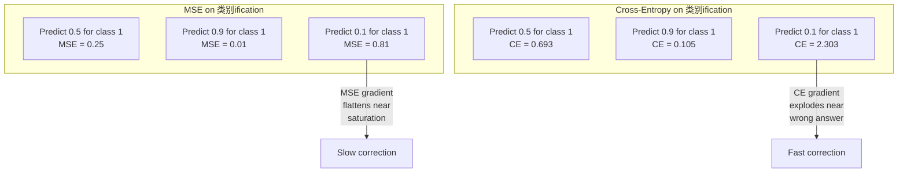
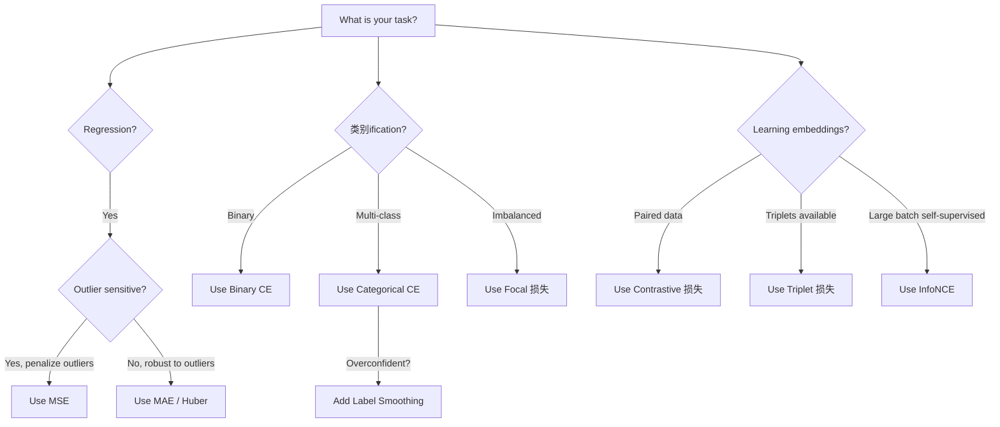
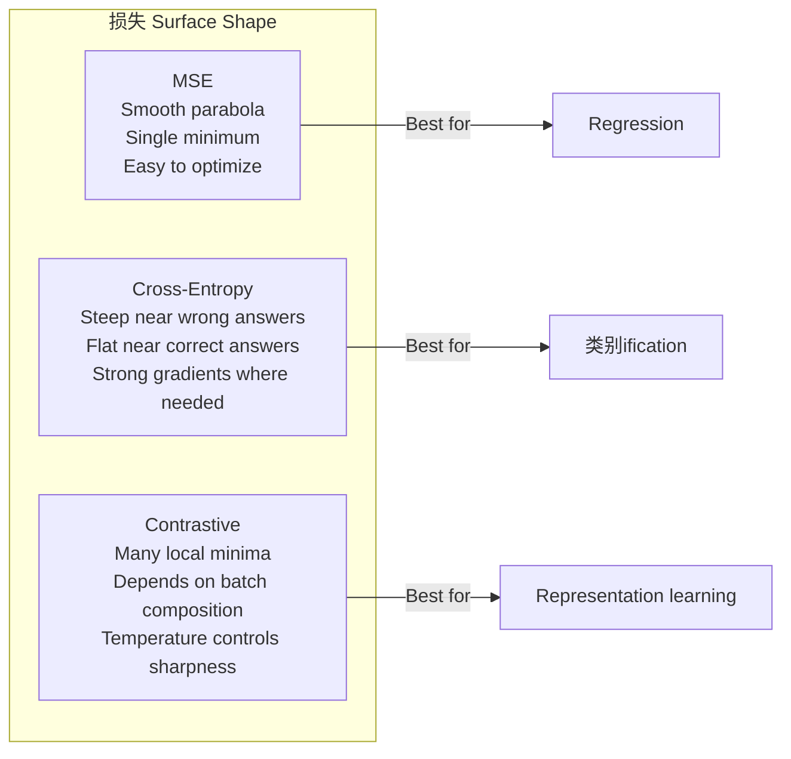

# 损失 Functions

> Your network makes a 预测. ground truth says otherwise. How wrong 是 it? That number 是 损失. Pick wrong 损失 函数 和 你的 模型 optimizes 用于 wrong thing entirely.

**Type:** 构建
**Languages:** Python
**Prerequisites:** Lesson 03.04 (激活 Functions)
**Time:** ~75 minutes

## 学习目标

- 实现 MSE, binary 交叉熵, categorical 交叉熵, 和 contrastive 损失 (InfoNCE) 从零实现 用 their 梯度s
- 解释 为什么 MSE fails 用于 分类 by demonstrating "predict 0.5 用于 everything" 失败 mode
- Apply 标签 smoothing 到 交叉熵 和 describe 如何 it prevents overconfident 预测s
- 选择 correct 损失 函数 用于 回归, 二分类, multi-class 分类, 和 embedding learning 任务

## 问题

A 模型 minimizing MSE 在 a 分类 问题 will confidently predict 0.5 用于 everything. It's minimizing 损失. It's also useless.

损失 函数 是 only thing 你的 模型 actually optimizes. Not 准确率. Not F1 score. Not whatever metric 你 report 到 你的 manager. 优化器 takes 梯度 of 损失 函数 和 adjusts 权重 到 make that number smaller. If 损失 函数 doesn't capture what 你 care about, 模型 will find mathematically cheapest way 到 satisfy it, 和 that way 是 almost never what 你 wanted.

Here 是 a concrete 示例. 你 have a 二分类 任务. Two classes, 50/50 split. 你 使用 MSE as 你的 损失. 模型 predicts 0.5 用于 every single 输入. average MSE 是 0.25, which 是 minimum possible 不用 actually learning anything. 模型 has zero discriminative ability but it has technically minimized 你的 损失 函数. 切换 到 交叉熵 和 same 模型 是 forced 到 push 预测s toward 0 或 1, 因为 -log(0.5) = 0.693 是 a terrible 损失, while -log(0.99) = 0.01 rewards confident correct 预测s. choice of 损失 函数 是 difference between a 模型 that learns 和 a 模型 that games metric.

It gets worse. In self-supervised learning, 你 don't even have 标签. Contrastive 损失 defines learning 信号 entirely: what counts as similar, what counts as different, 和 如何 hard 模型 should push them apart. Get contrastive 损失 wrong 和 你的 embeddings collapse 到 a single point -- every 输入 maps 到 same 向量. Technically zero 损失. Completely worthless.

## 概念

### 均方误差 (MSE)

默认 用于 回归. Compute squared difference between 预测 和 target, average over all 样本.

```
MSE = (1/n) * sum((y_pred - y_true)^2)
```

Why squaring matters: it penalizes large 错误 quadratically. An 错误 of 2 costs 4x as much as an 错误 of 1. An 错误 of 10 costs 100x. 这 makes MSE sensitive 到 outliers -- a single wildly wrong 预测 dominates 损失.

Real numbers: 如果 你的 模型 predicts housing prices 和 是 off by $10,000 在 most houses but off by $200,000 在 one mansion, MSE will aggressively try 到 fix that one mansion, potentially hurting performance 在 other 99 houses.

梯度 of MSE 用 respect 到 a 预测 是:

```
dMSE/dy_pred = (2/n) * (y_pred - y_true)
```

Linear 在 错误. Bigger 错误 get bigger 梯度s. 这 是 a feature 用于 回归 (large 错误 need large corrections) 和 a 缺陷 用于 分类 (你 want 到 penalize confident wrong answers exponentially, 不 linearly).

### 交叉熵 损失

损失 函数 用于 分类. Rooted 在 information theory -- it measures divergence between predicted 概率 分布 和 true 分布.

**Binary Cross-Entropy (BCE):**

```
BCE = -(y * log(p) + (1 - y) * log(1 - p))
```

Where y 是 true 标签 (0 或 1) 和 p 是 predicted 概率.

Why -log(p) works: 当 true 标签 是 1 和 你 predict p = 0.99, 损失 是 -log(0.99) = 0.01. When 你 predict p = 0.01, 损失 是 -log(0.01) = 4.6. That 460x difference 是 为什么 交叉熵 works. It brutally punishes confident wrong 预测s while barely penalizing confident correct ones.

梯度 tells same story:

```
dBCE/dp = -(y/p) + (1-y)/(1-p)
```

When y = 1 和 p 是 near zero, 梯度 是 -1/p which approaches negative infinity. 模型 gets an enormous 信号 到 fix its mistake. When p 是 near 1, 梯度 是 tiny. Already correct, nothing 到 fix.

**Categorical Cross-Entropy:**

For multi-class 分类 用 one-hot encoded targets.

```
CCE = -sum(y_i * log(p_i))
```

Only true class contributes 到 损失 (因为 all other y_i 是 zero). If there 是 10 classes 和 correct class gets 概率 0.1 (random guessing), 损失 是 -log(0.1) = 2.3. If correct class gets 概率 0.9, 损失 是 -log(0.9) = 0.105. 模型 learns 到 concentrate 概率 mass 在 right answer.

### Why MSE Fails 用于 分类



MSE 梯度s flatten 当 预测s 是 near 0 或 1 (due 到 sigmoid saturation). Cross-entropy 梯度s compensate 用于 这 -- -log cancels sigmoid's flat regions, giving strong 梯度s exactly 其中 they 是 needed most.

### Label Smoothing

Standard one-hot 标签 say "这 是 100% class 3 和 0% everything else." That's a strong claim. Label smoothing softens it:

```
smooth_label = (1 - alpha) * one_hot + alpha / num_classes
```

With alpha = 0.1 和 10 classes: instead of [0, 0, 1, 0,...], target becomes [0.01, 0.01, 0.91, 0.01,...]. 模型 targets 0.91 instead of 1.0.

Why 这 works: a 模型 trying 到 输出 exactly 1.0 through a softmax needs 到 push logits 到 infinity. 这 causes overconfidence, hurts generalization, 和 makes 模型 brittle 到 分布 shift. Label smoothing caps target at 0.9 (用 alpha=0.1), keeping logits 在 a reasonable range. GPT 和 most modern 模型s 使用 标签 smoothing 或 its equivalent.

### Contrastive 损失

No 标签. No classes. Just pairs of 输入 和 question: 是 these similar 或 different?

**SimCLR-style contrastive loss (NT-Xent / InfoNCE):**

Take one image. 创建 two augmented views of it (crop, rotate, color jitter). 这些 是 "positive pair" -- they should have similar embeddings. Every other image 在 批次 forms a "negative pair" -- they should have different embeddings.

```
L = -log(exp(sim(z_i, z_j) / tau) / sum(exp(sim(z_i, z_k) / tau)))
```

Where sim() 是 cosine similarity, z_i 和 z_j 是 positive pair, sum 是 over all negatives, 和 tau (temperature) controls 如何 sharp 分布 是. Lower temperature = harder negatives = more aggressive separation.

Real numbers: 批次 size 256 means 255 negatives per positive pair. Temperature tau = 0.07 (SimCLR 默认). 损失 looks like a softmax over similarities -- it wants positive pair's similarity 到 be highest among all 256 options.

**Triplet Loss:**

Takes three 输入: anchor, positive (same class), negative (different class).

```
L = max(0, d(anchor, positive) - d(anchor, negative) + margin)
```

margin (typically 0.2-1.0) enforces a minimum gap between positive 和 negative distances. If negative 是 already far enough away, 损失 是 zero -- 没有 梯度, 没有 update. 这 makes 训练 efficient but requires careful triplet mining (choosing hard negatives that 是 close 到 anchor).

### Focal 损失

For imbalanced 数据sets. Standard 交叉熵 treats all correctly classified 示例 equally. Focal 损失 down-权重 easy 示例:

```
FL = -alpha * (1 - p_t)^gamma * log(p_t)
```

Where p_t 是 predicted 概率 of true class 和 gamma controls focusing. With gamma = 0, 这 是 standard 交叉熵. With gamma = 2 ( 默认):

- Easy 示例 (p_t = 0.9): weight = (0.1)^2 = 0.01. Effectively ignored.
- Hard 示例 (p_t = 0.1): weight = (0.9)^2 = 0.81. Full 梯度 信号.

Focal 损失 是 introduced by Lin et al. 用于 object detection, 其中 99% of candidate regions 是 background (easy negatives). Without focal 损失, 模型 drowns 在 easy background 示例 和 never learns 到 detect objects. With it, 模型 focuses its 容量 在 hard, ambiguous cases that matter.

### 损失 Function Decision Tree



### 损失 Landscape



```figure
cross-entropy-loss
```

## 动手构建

### Step 1: MSE 和 Its 梯度

```python
def mse(predictions, targets):
    n = len(predictions)
    total = 0.0
    for p, t in zip(predictions, targets):
        total += (p - t) ** 2
    return total / n

def mse_gradient(predictions, targets):
    n = len(predictions)
    grads = []
    for p, t in zip(predictions, targets):
        grads.append(2.0 * (p - t) / n)
    return grads
```

### Step 2: Binary 交叉熵

log(0) 问题 是 real. If 模型 predicts exactly 0 用于 a positive 示例, log(0) = negative infinity. Clipping prevents 这.

```python
import math

def binary_cross_entropy(predictions, targets, eps=1e-15):
    n = len(predictions)
    total = 0.0
    for p, t in zip(predictions, targets):
        p_clipped = max(eps, min(1 - eps, p))
        total += -(t * math.log(p_clipped) + (1 - t) * math.log(1 - p_clipped))
    return total / n

def bce_gradient(predictions, targets, eps=1e-15):
    grads = []
    for p, t in zip(predictions, targets):
        p_clipped = max(eps, min(1 - eps, p))
        grads.append(-(t / p_clipped) + (1 - t) / (1 - p_clipped))
    return grads
```

### Step 3: Categorical 交叉熵 用 Softmax

Softmax converts raw logits 到 probabilities. Then we compute 交叉熵 against one-hot targets.

```python
def softmax(logits):
    max_val = max(logits)
    exps = [math.exp(x - max_val) for x in logits]
    total = sum(exps)
    return [e / total for e in exps]

def categorical_cross_entropy(logits, target_index, eps=1e-15):
    probs = softmax(logits)
    p = max(eps, probs[target_index])
    return -math.log(p)

def cce_gradient(logits, target_index):
    probs = softmax(logits)
    grads = list(probs)
    grads[target_index] -= 1.0
    return grads
```

梯度 of softmax + 交叉熵 simplifies beautifully: it's just (predicted 概率 - 1) 用于 true class, 和 (predicted 概率) 用于 all other classes. 这 elegant simplification 是 不 a coincidence -- it's 为什么 softmax 和 交叉熵 是 paired.

### Step 4: Label Smoothing

```python
def label_smoothed_cce(logits, target_index, num_classes, alpha=0.1, eps=1e-15):
    probs = softmax(logits)
    loss = 0.0
    for i in range(num_classes):
        if i == target_index:
            smooth_target = 1.0 - alpha + alpha / num_classes
        else:
            smooth_target = alpha / num_classes
        p = max(eps, probs[i])
        loss += -smooth_target * math.log(p)
    return loss
```

### Step 5: Contrastive 损失 (Simplified InfoNCE)

```python
def cosine_similarity(a, b):
    dot = sum(x * y for x, y in zip(a, b))
    norm_a = math.sqrt(sum(x * x for x in a))
    norm_b = math.sqrt(sum(x * x for x in b))
    if norm_a < 1e-10 or norm_b < 1e-10:
        return 0.0
    return dot / (norm_a * norm_b)

def contrastive_loss(anchor, positive, negatives, temperature=0.07):
    sim_pos = cosine_similarity(anchor, positive) / temperature
    sim_negs = [cosine_similarity(anchor, neg) / temperature for neg in negatives]

    max_sim = max(sim_pos, max(sim_negs)) if sim_negs else sim_pos
    exp_pos = math.exp(sim_pos - max_sim)
    exp_negs = [math.exp(s - max_sim) for s in sim_negs]
    total_exp = exp_pos + sum(exp_negs)

    return -math.log(max(1e-15, exp_pos / total_exp))
```

### Step 6: MSE vs 交叉熵 在 分类

训练 same network 从 lesson 04 (circle 数据set) 用 both 损失 函数. Watch 交叉熵 converge faster.

```python
import random

def sigmoid(x):
    x = max(-500, min(500, x))
    return 1.0 / (1.0 + math.exp(-x))

def make_circle_data(n=200, seed=42):
    random.seed(seed)
    data = []
    for _ in range(n):
        x = random.uniform(-2, 2)
        y = random.uniform(-2, 2)
        label = 1.0 if x * x + y * y < 1.5 else 0.0
        data.append(([x, y], label))
    return data


class LossComparisonNetwork:
    def __init__(self, loss_type="bce", hidden_size=8, lr=0.1):
        random.seed(0)
        self.loss_type = loss_type
        self.lr = lr
        self.hidden_size = hidden_size

        self.w1 = [[random.gauss(0, 0.5) for _ in range(2)] for _ in range(hidden_size)]
        self.b1 = [0.0] * hidden_size
        self.w2 = [random.gauss(0, 0.5) for _ in range(hidden_size)]
        self.b2 = 0.0

    def forward(self, x):
        self.x = x
        self.z1 = []
        self.h = []
        for i in range(self.hidden_size):
            z = self.w1[i][0] * x[0] + self.w1[i][1] * x[1] + self.b1[i]
            self.z1.append(z)
            self.h.append(max(0.0, z))

        self.z2 = sum(self.w2[i] * self.h[i] for i in range(self.hidden_size)) + self.b2
        self.out = sigmoid(self.z2)
        return self.out

    def backward(self, target):
        if self.loss_type == "mse":
            d_loss = 2.0 * (self.out - target)
        else:
            eps = 1e-15
            p = max(eps, min(1 - eps, self.out))
            d_loss = -(target / p) + (1 - target) / (1 - p)

        d_sigmoid = self.out * (1 - self.out)
        d_out = d_loss * d_sigmoid

        for i in range(self.hidden_size):
            d_relu = 1.0 if self.z1[i] > 0 else 0.0
            d_h = d_out * self.w2[i] * d_relu
            self.w2[i] -= self.lr * d_out * self.h[i]
            for j in range(2):
                self.w1[i][j] -= self.lr * d_h * self.x[j]
            self.b1[i] -= self.lr * d_h
        self.b2 -= self.lr * d_out

    def compute_loss(self, pred, target):
        if self.loss_type == "mse":
            return (pred - target) ** 2
        else:
            eps = 1e-15
            p = max(eps, min(1 - eps, pred))
            return -(target * math.log(p) + (1 - target) * math.log(1 - p))

    def train(self, data, epochs=200):
        losses = []
        for epoch in range(epochs):
            total_loss = 0.0
            correct = 0
            for x, y in data:
                pred = self.forward(x)
                self.backward(y)
                total_loss += self.compute_loss(pred, y)
                if (pred >= 0.5) == (y >= 0.5):
                    correct += 1
            avg_loss = total_loss / len(data)
            accuracy = correct / len(data) * 100
            losses.append((avg_loss, accuracy))
            if epoch % 50 == 0 or epoch == epochs - 1:
                print(f"    Epoch {epoch:3d}: loss={avg_loss:.4f}, accuracy={accuracy:.1f}%")
        return losses
```

## 直接使用

PyTorch provides all standard 损失 函数 用 numerical stability built 在:

```python
import torch
import torch.nn as nn
import torch.nn.functional as F

predictions = torch.tensor([0.9, 0.1, 0.7], requires_grad=True)
targets = torch.tensor([1.0, 0.0, 1.0])

mse_loss = F.mse_loss(predictions, targets)
bce_loss = F.binary_cross_entropy(predictions, targets)

logits = torch.randn(4, 10)
labels = torch.tensor([3, 7, 1, 9])
ce_loss = F.cross_entropy(logits, labels)
ce_smooth = F.cross_entropy(logits, labels, label_smoothing=0.1)
```

使用`F.cross_entropy`(不`F.nll_loss`plus manual softmax). It combines log-softmax 和 negative log-likelihood 在 one numerically 稳定 operation. Applying softmax separately 然后 taking log 是 less 稳定 -- 你 lose 精度 在 subtraction of large exponentials.

For contrastive learning, most teams 使用 custom implementations 或 libraries like`lightly`或`pytorch-metric-learning`. core loop 是 always same: compute pairwise similarities, 创建 softmax over positives 和 negatives, backpropagate.

## 交付它

这 lesson produces:
- `outputs/prompt-loss-function-selector.md`-- a reusable prompt 用于 choosing right 损失 函数
- `outputs/prompt-loss-debugger.md`-- a diagnostic prompt 用于 当 你的 损失 curve looks wrong

## Exercises

1. 实现 Huber 损失 (smooth L1 损失), which 是 MSE 用于 small 错误 和 MAE 用于 large 错误. 训练 a 回归 network predicting y = sin(x) 用 MSE vs Huber 当 5% of 训练 targets have random 噪声 added (outliers). 比较 final test 错误.

2. 加入 focal 损失 到 二分类 训练循环. 创建 an imbalanced 数据set (90% class 0, 10% class 1). 比较 standard BCE vs focal 损失 (gamma=2) 在 minority class recall 之后 200 轮次.

3. 实现 triplet 损失 用 semi-hard negative mining. Generate 2D embedding 数据 用于 5 classes. For each anchor, find hardest negative that 是 still farther than positive (semi-hard). 比较 convergence 到 random triplet selection.

4. 运行 MSE vs 交叉熵 comparison but track 梯度 magnitudes at each 层 during 训练. Plot average 梯度 norm per 轮次. 确认 that 交叉熵 produces larger 梯度s 在 early 轮次 当 模型 是 most uncertain.

5. 实现 KL divergence 损失 和 确认 that minimizing KL(true || predicted) gives same 梯度s as 交叉熵 当 true 分布 是 one-hot. Then try soft targets (like knowledge distillation) 其中 "true" 分布 comes 从 a teacher 模型's softmax 输出.

## Key Terms

|Term|What people say|What it actually means|
|------|----------------|----------------------|
|损失 函数|"How wrong 模型 是"|A differentiable 函数 mapping 预测s 和 targets 到 a scalar that 优化器 minimizes|
|MSE|"Average squared 错误"|Mean of squared differences between 预测s 和 targets; penalizes large 错误 quadratically|
|Cross-entropy|" 分类 损失"|Measures divergence between predicted 概率 分布 和 true 分布 using -log(p)|
|Binary 交叉熵|"BCE"|Cross-entropy 用于 two classes: -(y*log(p) + (1-y)*log(1-p))|
|Label smoothing|"Softening targets"|Replacing hard 0/1 targets 用 soft 值 (e.g., 0.1/0.9) 到 prevent overconfidence 和 improve generalization|
|Contrastive 损失|"Pull together, push apart"|A 损失 that learns representations by making similar pairs close 和 dissimilar pairs far 在 embedding space|
|InfoNCE|" CLIP/SimCLR 损失"|Normalized temperature-scaled 交叉熵 over similarity scores; treats contrastive learning as 分类|
|Focal 损失|" imbalanced 数据 fix"|Cross-entropy weighted by (1-p_t)^gamma 到 down-weight easy 示例 和 focus 在 hard ones|
|Triplet 损失|"Anchor-positive-negative"|Pushes anchor closer 到 positive than negative by at least a margin 在 embedding space|
|Temperature|"Sharpness knob"|A scalar divisor 在 logits/similarities that controls 如何 peaked resulting 分布 是; lower = sharper|

## Further Reading

- Lin et al., "Focal 损失 用于 Dense Object Detection" (2017) -- introduced focal 损失 用于 handling extreme class imbalance 在 object detection (RetinaNet)
- Chen et al., "A Simple Framework 用于 Contrastive Learning of Visual Representations" (SimCLR, 2020) -- defined modern contrastive learning pipeline 用 NT-Xent 损失
- Szegedy et al., "Rethinking Inception Architecture" (2016) -- introduced 标签 smoothing as a 正则化 technique, now standard 在 most large 模型s
- Hinton et al., "Distilling Knowledge 在 a 神经网络" (2015) -- knowledge distillation using soft targets 和 KL divergence, foundational 用于 模型 compression
