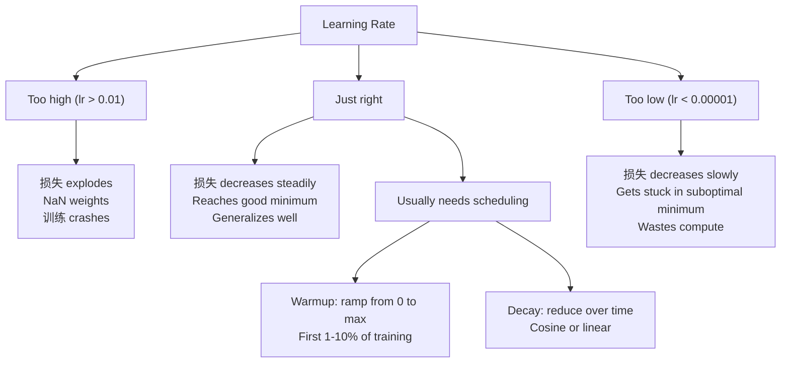
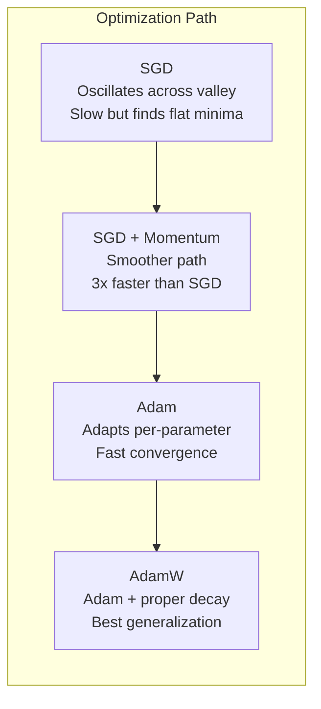
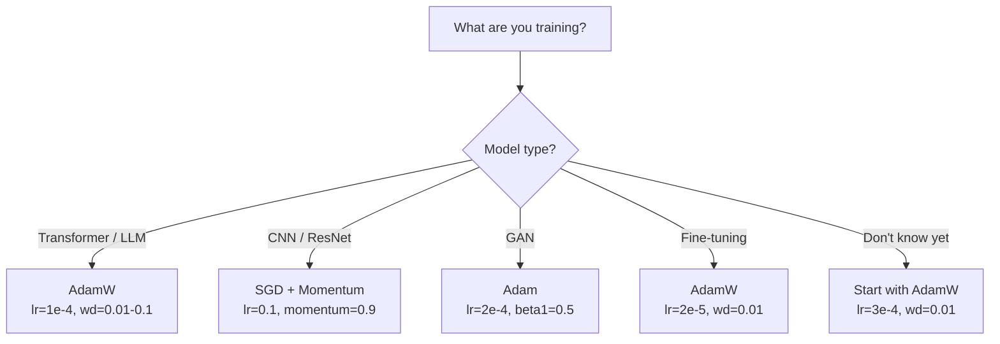

# 优化器

> 梯度 descent tells 你 which direction 到 move. It says nothing about 如何 far 或 如何 fast. SGD 是 a compass. Adam 是 GPS 用 traffic 数据.

**Type:** 构建
**Languages:** Python
**Prerequisites:** Lesson 03.05 (损失 Functions)
**Time:** ~75 minutes

## 学习目标

- 实现 SGD, SGD 用 momentum, Adam, 和 AdamW 优化器 从零实现 在 Python
- 解释 如何 Adam's 偏置 correction compensates 用于 zero-initialized moment estimates 在 early 训练 步骤
- Demonstrate 为什么 AdamW produces better generalization than Adam 用 L2 正则化 在 same 任务
- 选择 appropriate 优化器 和 默认 hyper参数 用于 transformers, CNNs, GANs, 和 fine-tuning

## 问题

你 computed 梯度s. 你 know that weight #4,721 should decrease by 0.003 到 降低 损失. But 0.003 在 what units? Scaled by what? And should 你 move same amount 在 步骤 1 as 在 步骤 1,000?

Vanilla 梯度 descent applies same 学习率 到 every parameter 在 every 步骤: w = w - lr * 梯度. 这 creates three problems that make 训练 神经网络 painful 在 practice.

First, oscillation. 损失 landscape 是 rarely shaped like a smooth bowl. It's more like a long, narrow valley. 梯度 points across valley (steep direction), 不 along it (shallow direction). 梯度 descent bounces back 和 forth across narrow dimension while making tiny progress along useful one. 你've seen 这: 损失 drops fast 然后 plateaus, 不 因为 模型 converged but 因为 it's oscillating.

Second, one 学习率 用于 all 参数 是 wrong. Some 权重 need large updates (they're 在 early, 欠拟合 stage). Others need tiny updates (they're near their optimal 值). A 学习率 that works 用于 former destroys latter, 和 vice versa.

Third, saddle points. In high dimensions, 损失 landscape has vast flat regions 其中 梯度 是 near zero. Vanilla SGD crawls through these at speed of 梯度, which 是 effectively zero. 模型 looks stuck. It isn't stuck -- it's 在 a flat region 用 useful descent 在 other side. But SGD has 没有 mechanism 到 push through.

Adam solves all three. It maintains two running averages per parameter -- 均值 梯度 (momentum, handles oscillation) 和 均值 squared 梯度 (adaptive rate, handles different scales). Combined 用 偏置 correction 用于 first few 步骤, it gives 你 a single 优化器 that works 在 80% of problems 用 默认 hyper参数. 这 lesson builds it 从零实现 so 你 understand exactly 当 和 为什么 it fails 在 other 20%.

## 概念

### Stochastic 梯度 Descent (SGD)

simplest 优化器. Compute 梯度 在 a mini-批次 和 步骤 在 opposite direction.

```
w = w - lr * gradient
```

"stochastic" means 你 使用 a random subset (mini-批次) of 数据 到 estimate 梯度, rather than full 数据set. 这 噪声 是 actually useful -- it helps escape sharp local minima. But 噪声 also causes oscillation.

Learning rate 是 only knob. Too high: 损失 diverges. Too low: 训练 takes forever. optimal 值 depends 在 架构, 数据, 批次 size, 和 current stage of 训练. For vanilla SGD 在 modern networks, typical 值 range 从 0.01 到 0.1. But even within a single 训练 运行, ideal 学习率 changes.

### Momentum

ball-rolling-downhill analogy 是 overused but accurate. Instead of stepping by 梯度 alone, 你 maintain a velocity that accumulates past 梯度s.

```
m_t = beta * m_{t-1} + gradient
w = w - lr * m_t
```

Beta (typically 0.9) controls 如何 much history 到 keep. With beta = 0.9, momentum 是 roughly average of last 10 梯度s (1 / (1 - 0.9) = 10).

Why 这 fixes oscillation: 梯度s that point 在 same direction accumulate. 梯度s that flip direction cancel out. In that narrow valley, "across" component flips sign each 步骤 和 gets dampened. "along" component stays consistent 和 gets amplified. result 是 smooth acceleration 在 useful direction.

Real numbers: SGD alone 在 a badly conditioned 损失 landscape might take 10,000 步骤. SGD 用 momentum (beta=0.9) typically takes 3,000-5,000 步骤 在 same 问题. speedup 是 不 marginal.

### RMSProp

first per-parameter adaptive 学习率 method that actually worked. Proposed by Hinton 在 a Coursera lecture (never formally published).

```
s_t = beta * s_{t-1} + (1 - beta) * gradient^2
w = w - lr * gradient / (sqrt(s_t) + epsilon)
```

s_t tracks running average of squared 梯度s. 参数 用 consistently large 梯度s get divided by a large number (smaller effective 学习率). 参数 用 small 梯度s get divided by a small number (larger effective 学习率).

这 solves "one 学习率 用于 all 参数" 问题. A weight that's already been getting large updates 是 probably near its target -- slow it down. A weight that's been getting tiny updates might be undertrained -- speed it up.

Epsilon (typically 1e-8) prevents division by zero 当 a parameter hasn't been updated.

### Adam: Momentum + RMSProp

Adam combines both ideas. It maintains two exponential moving averages per parameter:

```
m_t = beta1 * m_{t-1} + (1 - beta1) * gradient        (first moment: mean)
v_t = beta2 * v_{t-1} + (1 - beta2) * gradient^2       (second moment: variance)
```

**偏置 correction** 是 key detail most explanations skip. At 步骤 1, m_1 = (1 - beta1) * 梯度. With beta1 = 0.9, that's 0.1 * 梯度 -- ten times too small. moving average hasn't warmed up yet. 偏置 correction compensates:

```
m_hat = m_t / (1 - beta1^t)
v_hat = v_t / (1 - beta2^t)
```

At 步骤 1 用 beta1 = 0.9: m_hat = m_1 / (1 - 0.9) = m_1 / 0.1 = actual 梯度. At 步骤 100: (1 - 0.9^100) 是 approximately 1.0, so correction vanishes. 偏置 correction matters 用于 first ~10 步骤 和 是 irrelevant 之后 ~50.

update:

```
w = w - lr * m_hat / (sqrt(v_hat) + epsilon)
```

Adam defaults: lr = 0.001, beta1 = 0.9, beta2 = 0.999, epsilon = 1e-8. 这些 defaults work 用于 80% of problems. When they don't, change lr first. Then beta2. Almost never change beta1 或 epsilon.

### AdamW: 权重衰减 Done Right

L2 正则化 adds lambda * w^2 到 损失. In vanilla SGD, 这 是 equivalent 到 权重衰减 (subtracting lambda * w 从 weight at each 步骤). In Adam, 这 equivalence breaks.

Loshchilov & Hutter insight: 当 你 加入 L2 到 损失 和 然后 Adam processes 梯度, adaptive 学习率 scales 正则化 term too. 参数 用 large 梯度 方差 get less 正则化. 参数 用 small 方差 get more. 这 是 不 what 你 want -- 你 want uniform 正则化 regardless of 梯度 statistics.

AdamW fixes 这 by applying 权重衰减 directly 到 权重, 之后 Adam update:

```
w = w - lr * m_hat / (sqrt(v_hat) + epsilon) - lr * lambda * w
```

权重衰减 term (lr * lambda * w) 是 不 scaled by Adam's adaptive factor. Every parameter gets same proportional shrinkage.

这 seems like a minor detail. It's 不. AdamW converges 到 better solutions than Adam + L2 正则化 在 virtually every 任务. It's 默认 优化器 在 PyTorch 用于 训练 transformers, diffusion 模型s, 和 most modern architectures. BERT, GPT, LLaMA, Stable Diffusion -- all trained 用 AdamW.

### 学习率: Most Important Hyperparameter



If 你 tune one hyperparameter, tune 学习率. A 10x change 在 学习率 matters more than any architectural 决策 你'll make. Common defaults:

- SGD: lr = 0.01 到 0.1
- Adam/AdamW: lr = 1e-4 到 3e-4
- Fine-tuning pretrained 模型s: lr = 1e-5 到 5e-5
- Learning rate warmup: 线性 ramp over first 1-10% of 步骤

### 优化器 Comparison



### When Each 优化器 Wins



```figure
optimizer-trajectory
```

## 动手构建

### Step 1: Vanilla SGD

```python
class SGD:
    def __init__(self, lr=0.01):
        self.lr = lr

    def step(self, params, grads):
        for i in range(len(params)):
            params[i] -= self.lr * grads[i]
```

### Step 2: SGD 用 Momentum

```python
class SGDMomentum:
    def __init__(self, lr=0.01, beta=0.9):
        self.lr = lr
        self.beta = beta
        self.velocities = None

    def step(self, params, grads):
        if self.velocities is None:
            self.velocities = [0.0] * len(params)
        for i in range(len(params)):
            self.velocities[i] = self.beta * self.velocities[i] + grads[i]
            params[i] -= self.lr * self.velocities[i]
```

### Step 3: Adam

```python
import math

class Adam:
    def __init__(self, lr=0.001, beta1=0.9, beta2=0.999, epsilon=1e-8):
        self.lr = lr
        self.beta1 = beta1
        self.beta2 = beta2
        self.epsilon = epsilon
        self.m = None
        self.v = None
        self.t = 0

    def step(self, params, grads):
        if self.m is None:
            self.m = [0.0] * len(params)
            self.v = [0.0] * len(params)

        self.t += 1

        for i in range(len(params)):
            self.m[i] = self.beta1 * self.m[i] + (1 - self.beta1) * grads[i]
            self.v[i] = self.beta2 * self.v[i] + (1 - self.beta2) * grads[i] ** 2

            m_hat = self.m[i] / (1 - self.beta1 ** self.t)
            v_hat = self.v[i] / (1 - self.beta2 ** self.t)

            params[i] -= self.lr * m_hat / (math.sqrt(v_hat) + self.epsilon)
```

### Step 4: AdamW

```python
class AdamW:
    def __init__(self, lr=0.001, beta1=0.9, beta2=0.999, epsilon=1e-8, weight_decay=0.01):
        self.lr = lr
        self.beta1 = beta1
        self.beta2 = beta2
        self.epsilon = epsilon
        self.weight_decay = weight_decay
        self.m = None
        self.v = None
        self.t = 0

    def step(self, params, grads):
        if self.m is None:
            self.m = [0.0] * len(params)
            self.v = [0.0] * len(params)

        self.t += 1

        for i in range(len(params)):
            self.m[i] = self.beta1 * self.m[i] + (1 - self.beta1) * grads[i]
            self.v[i] = self.beta2 * self.v[i] + (1 - self.beta2) * grads[i] ** 2

            m_hat = self.m[i] / (1 - self.beta1 ** self.t)
            v_hat = self.v[i] / (1 - self.beta2 ** self.t)

            params[i] -= self.lr * m_hat / (math.sqrt(v_hat) + self.epsilon)
            params[i] -= self.lr * self.weight_decay * params[i]
```

### Step 5: 训练 Comparison

训练 same two-层 network 在 circle 数据set 从 lesson 05 用 all four 优化器. 比较 convergence.

```python
import random

def sigmoid(x):
    x = max(-500, min(500, x))
    return 1.0 / (1.0 + math.exp(-x))

def make_circle_data(n=200, seed=42):
    random.seed(seed)
    data = []
    for _ in range(n):
        x = random.uniform(-2, 2)
        y = random.uniform(-2, 2)
        label = 1.0 if x * x + y * y < 1.5 else 0.0
        data.append(([x, y], label))
    return data


class OptimizerTestNetwork:
    def __init__(self, optimizer, hidden_size=8):
        random.seed(0)
        self.hidden_size = hidden_size
        self.optimizer = optimizer

        self.w1 = [[random.gauss(0, 0.5) for _ in range(2)] for _ in range(hidden_size)]
        self.b1 = [0.0] * hidden_size
        self.w2 = [random.gauss(0, 0.5) for _ in range(hidden_size)]
        self.b2 = 0.0

    def get_params(self):
        params = []
        for row in self.w1:
            params.extend(row)
        params.extend(self.b1)
        params.extend(self.w2)
        params.append(self.b2)
        return params

    def set_params(self, params):
        idx = 0
        for i in range(self.hidden_size):
            for j in range(2):
                self.w1[i][j] = params[idx]
                idx += 1
        for i in range(self.hidden_size):
            self.b1[i] = params[idx]
            idx += 1
        for i in range(self.hidden_size):
            self.w2[i] = params[idx]
            idx += 1
        self.b2 = params[idx]

    def forward(self, x):
        self.x = x
        self.z1 = []
        self.h = []
        for i in range(self.hidden_size):
            z = self.w1[i][0] * x[0] + self.w1[i][1] * x[1] + self.b1[i]
            self.z1.append(z)
            self.h.append(max(0.0, z))

        self.z2 = sum(self.w2[i] * self.h[i] for i in range(self.hidden_size)) + self.b2
        self.out = sigmoid(self.z2)
        return self.out

    def compute_grads(self, target):
        eps = 1e-15
        p = max(eps, min(1 - eps, self.out))
        d_loss = -(target / p) + (1 - target) / (1 - p)
        d_sigmoid = self.out * (1 - self.out)
        d_out = d_loss * d_sigmoid

        grads = [0.0] * (self.hidden_size * 2 + self.hidden_size + self.hidden_size + 1)
        idx = 0
        for i in range(self.hidden_size):
            d_relu = 1.0 if self.z1[i] > 0 else 0.0
            d_h = d_out * self.w2[i] * d_relu
            grads[idx] = d_h * self.x[0]
            grads[idx + 1] = d_h * self.x[1]
            idx += 2

        for i in range(self.hidden_size):
            d_relu = 1.0 if self.z1[i] > 0 else 0.0
            grads[idx] = d_out * self.w2[i] * d_relu
            idx += 1

        for i in range(self.hidden_size):
            grads[idx] = d_out * self.h[i]
            idx += 1

        grads[idx] = d_out
        return grads

    def train(self, data, epochs=300):
        losses = []
        for epoch in range(epochs):
            total_loss = 0.0
            correct = 0
            for x, y in data:
                pred = self.forward(x)
                grads = self.compute_grads(y)
                params = self.get_params()
                self.optimizer.step(params, grads)
                self.set_params(params)

                eps = 1e-15
                p = max(eps, min(1 - eps, pred))
                total_loss += -(y * math.log(p) + (1 - y) * math.log(1 - p))
                if (pred >= 0.5) == (y >= 0.5):
                    correct += 1
            avg_loss = total_loss / len(data)
            accuracy = correct / len(data) * 100
            losses.append((avg_loss, accuracy))
            if epoch % 75 == 0 or epoch == epochs - 1:
                print(f"    Epoch {epoch:3d}: loss={avg_loss:.4f}, accuracy={accuracy:.1f}%")
        return losses
```

## 直接使用

PyTorch 优化器 handle parameter groups, 梯度 clipping, 和 学习率 scheduling:

```python
import torch
import torch.optim as optim

model = torch.nn.Sequential(
    torch.nn.Linear(784, 256),
    torch.nn.ReLU(),
    torch.nn.Linear(256, 10),
)

optimizer = optim.AdamW(model.parameters(), lr=3e-4, weight_decay=0.01)

scheduler = optim.lr_scheduler.CosineAnnealingLR(optimizer, T_max=100)

for epoch in range(100):
    optimizer.zero_grad()
    output = model(torch.randn(32, 784))
    loss = torch.nn.functional.cross_entropy(output, torch.randint(0, 10, (32,)))
    loss.backward()
    torch.nn.utils.clip_grad_norm_(model.parameters(), max_norm=1.0)
    optimizer.step()
    scheduler.step()
```

pattern 是 always: zero_grad, forward, 损失, backward, (clip), 步骤, (schedule). Memorize 这 order. Getting it wrong (e.g., calling scheduler.步骤() 之前 优化器.步骤()) 是 a common source of subtle 缺陷.

For CNNs, many practitioners still prefer SGD + momentum (lr=0.1, momentum=0.9, weight_decay=1e-4) 用 a 步骤 或 cosine schedule. SGD finds flatter minima, which often generalize better. For transformers 和 LLMs, AdamW 用 warmup + cosine decay 是 universal 默认. Don't fight consensus 不用 a measured reason.

## 交付它

这 lesson produces:
- `outputs/prompt-optimizer-selector.md`-- a 决策 prompt 用于 choosing right 优化器 和 学习率 用于 any 架构

## Exercises

1. 实现 Nesterov momentum, 其中 你 compute 梯度 at "lookahead" position (w - lr * beta * v) instead of current position. 比较 convergence 到 standard momentum 在 circle 数据set.

2. 实现 a 学习率 warmup schedule: 线性 ramp 从 0 到 max_lr over first 10% of 训练 步骤, 然后 cosine decay 到 0. 训练 用 Adam + warmup vs Adam 不用 warmup. Measure 如何 many 轮次 it takes 到 reach 90% 准确率 在 circle 数据set.

3. Track effective 学习率 用于 each parameter during Adam 训练. effective rate 是 lr * m_hat / (sqrt(v_hat) + eps). Plot 分布 of effective rates 之后 10, 50, 和 200 步骤. Are all 参数 being updated at same speed?

4. 实现 梯度 clipping (clip by global norm). Set max 梯度 norm 到 1.0. 训练 用 和 不用 clipping using a high 学习率 (lr=0.01 用于 Adam). Count 如何 many runs diverge (损失 goes 到 NaN) 用 和 不用 clipping over 10 random seeds.

5. 比较 Adam vs AdamW 在 a network 用 large 权重. Initialize all 权重 到 random 值 在 [-5, 5] (much larger than normal). 训练 用于 200 轮次 用 weight_decay=0.1. Plot L2 norm of 权重 over 训练 用于 both 优化器. AdamW should show faster weight shrinkage.

## Key Terms

|Term|What people say|What it actually means|
|------|----------------|----------------------|
|Learning rate|"Step size"|scalar multiplier 在 梯度 update; single most impactful hyperparameter 在 训练|
|SGD|"Basic 梯度 descent"|Stochastic 梯度 descent: update 权重 by subtracting lr * 梯度, computed 在 a mini-批次|
|Momentum|"Rolling ball analogy"|Exponential moving average of past 梯度s; dampens oscillation 和 accelerates consistent directions|
|RMSProp|"Adaptive 学习率"|Divides each parameter's 梯度 by running RMS of its recent 梯度s; equalizes 学习率s|
|Adam|" 默认 优化器"|Combines momentum (first moment) 和 RMSProp (second moment) 用 偏置 correction 用于 initial 步骤|
|AdamW|"Adam done right"|Adam 用 decoupled 权重衰减; applies 正则化 directly 到 权重 rather than through 梯度|
|偏置 correction|"Warmup 用于 running averages"|Dividing by (1 - beta^t) 到 compensate 用于 zero-initialization of Adam's moment estimates|
|Weight decay|"Shrink 权重"|Subtracting a fraction of weight 值 at each 步骤; a regularizer that penalizes large 权重|
|Learning rate schedule|"Changing lr over time"|A 函数 that adjusts 学习率 during 训练; warmup + cosine decay 是 modern 默认|
|梯度 clipping|"Capping 梯度 norm"|Scaling down 梯度 向量 当 its norm exceeds a threshold; prevents exploding 梯度 updates|

## Further Reading

- Kingma & Ba, "Adam: A Method 用于 Stochastic Optimization" (2014) -- original Adam paper 用 convergence analysis 和 偏置 correction derivation
- Loshchilov & Hutter, "Decoupled 权重衰减 正则化" (2017) -- proved that L2 正则化 和 权重衰减 是 不 equivalent 在 Adam, 和 proposed AdamW
- Smith, "Cyclical 学习率s 用于 训练 神经网络" (2017) -- introduced LR range test 和 cyclical schedules that 移除 need 到 tune a fixed 学习率
- Ruder, "An Overview of 梯度 Descent Optimization Algorithms" (2016) -- best single survey of all 优化器 variants, 用 clear comparisons 和 intuitions
