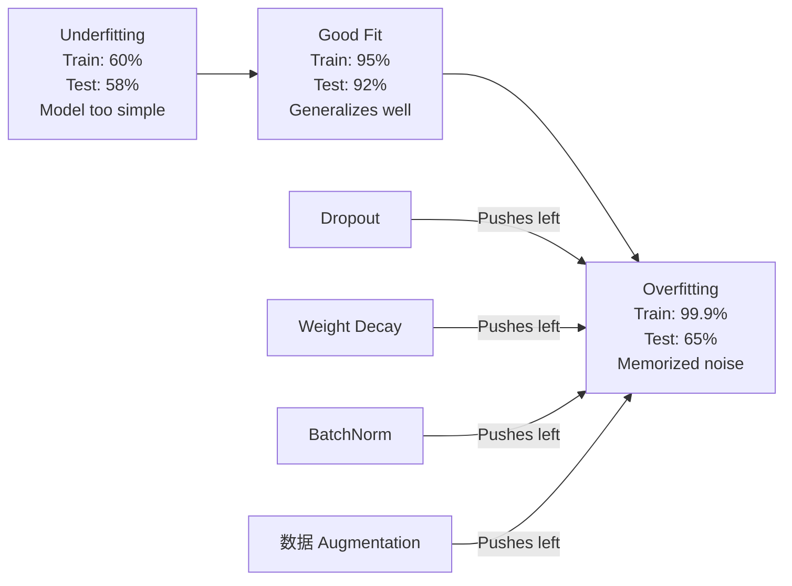
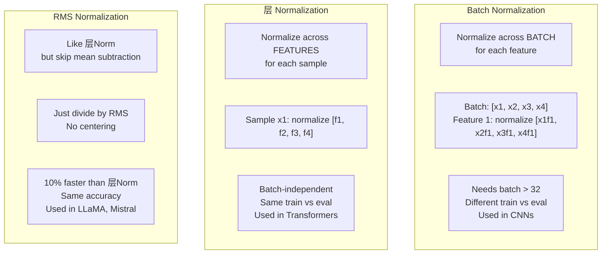
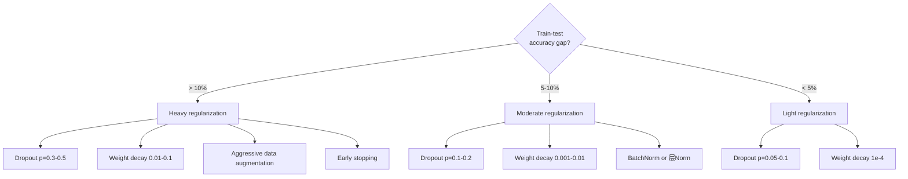

# 正则化

> Your 模型 gets 99% 在 训练 数据 和 60% 在 test 数据. It memorized instead of learning. 正则化 是 tax 你 impose 在 complexity 到 force generalization.

**Type:** 构建
**Languages:** Python
**Prerequisites:** Lesson 03.06 (优化器)
**Time:** ~75 minutes

## 学习目标

- 实现 dropout 用 inverted scaling, L2 权重衰减, 批归一化, 层 归一化, 和 RMSNorm 从零实现
- Measure 训练-test 准确率 gap 和 diagnose 过拟合 using 正则化 experiments
- 解释 为什么 transformers 使用 层Norm instead of BatchNorm 和 为什么 modern LLMs prefer RMSNorm
- Apply correct combination of 正则化 techniques based 在 severity of 过拟合

## 问题

A 神经网络 用 enough 参数 can memorize any 数据set. 这 是 不 a hypothetical -- Zhang et al. (2017) proved it by 训练 standard networks 在 ImageNet 用 random 标签. networks reached near-zero 训练 损失 在 completely random 标签 assignments. They memorized a million random 输入-输出 pairs 用 没有 pattern 到 learn. 训练 损失 是 perfect. Test 准确率 是 zero.

这 是 过拟合 问题, 和 it gets worse as 模型s get larger. GPT-3 has 175 billion 参数. 训练 set has about 500 billion tokens. With that many 参数, 模型 has enough 容量 到 memorize significant chunks of 训练 数据 verbatim. Without 正则化, it would just regurgitate 训练 示例 instead of learning generalizable patterns.

gap between 训练 performance 和 test performance 是 过拟合 gap. Every technique 在 这 lesson attacks that gap 从 a different angle. Dropout forces network 到 不 rely 在 any single neuron. Weight decay prevents any single weight 从 growing too large. Batch 归一化 smooths 损失 landscape so 优化器 finds flatter, more generalizable minima. 层 归一化 does same thing but works 其中 批归一化 fails (small batches, variable-length sequences). RMSNorm does it 10% faster by dropping 均值 calculation. Each technique 是 简单. Together, they're difference between a 模型 that memorizes 和 one that generalizes.

## 概念

### 过拟合 Spectrum

Every 模型 sits somewhere 在 a spectrum 从 欠拟合 (too 简单 到 capture pattern) 到 过拟合 (so 复杂 it captures 噪声). sweet spot 是 在 between, 和 正则化 pushes 模型s toward it 从 overfit side.



### Dropout

simplest 正则化 technique 用 most elegant interpretation. During 训练, randomly set each neuron's 输出 到 zero 用 概率 p.

```
output = activation(z) * mask    where mask[i] ~ Bernoulli(1 - p)
```

With p = 0.5, half neurons 是 zeroed 在 every 前向传播. network must learn redundant representations 因为 it can't predict which neurons will be available. 这 prevents co-adaptation -- neurons learning 到 rely 在 specific other neurons being present.

ensemble interpretation: a network 用 N neurons 和 dropout creates 2^N possible subnetworks (every combination of which neurons 是 在 或 off). 训练 用 dropout approximately trains all 2^N subnetworks simultaneously, each 在 different mini-batches. At test time, 你 使用 all neurons (没有 dropout) 和 尺度 输出 by (1 - p) 到 match expected 值 during 训练. 这 是 equivalent 到 averaging 预测s of 2^N subnetworks -- a massive ensemble 从 a single 模型.

In practice, scaling 是 applied during 训练 instead of testing (inverted dropout):

```
During training:  output = activation(z) * mask / (1 - p)
During testing:   output = activation(z)   (no change needed)
```

这 是 cleaner 因为 test code doesn't need 到 know about dropout at all.

Default rates: p = 0.1 用于 transformers, p = 0.5 用于 MLPs, p = 0.2-0.3 用于 CNNs. Higher dropout = stronger 正则化 = more 欠拟合 risk.

### 权重衰减 (L2 正则化)

加入 squared magnitude of all 权重 到 损失:

```
total_loss = task_loss + (lambda / 2) * sum(w_i^2)
```

梯度 of 正则化 term 是 lambda * w. 这 means at every 步骤, each weight 是 shrunk toward zero by a fraction proportional 到 its magnitude. Large 权重 get penalized more. 模型 是 pushed toward solutions 其中 没有 single weight dominates.

Why 这 helps generalization: overfit 模型s tend 到 have large 权重 that amplify 噪声 在 训练 数据. Weight decay keeps 权重 small, which limits 模型's effective 容量 和 forces it 到 rely 在 robust, generalizable features rather than memorized quirks.

lambda hyperparameter controls strength. Typical 值:

- 0.01 用于 AdamW 在 transformers
- 1e-4 用于 SGD 在 CNNs
- 0.1 用于 heavily overfit 模型s

As discussed 在 lesson 06: 权重衰减 和 L2 正则化 是 equivalent 在 SGD but 不 在 Adam. 始终 使用 AdamW (decoupled 权重衰减) 当 训练 用 Adam.

### 批归一化

Normalize 输出 of each 层 across mini-批次 之前 passing it 到 next 层.

For a mini-批次 of 激活s at some 层:

```
mu = (1/B) * sum(x_i)           (batch mean)
sigma^2 = (1/B) * sum((x_i - mu)^2)   (batch variance)
x_hat = (x_i - mu) / sqrt(sigma^2 + eps)   (normalize)
y = gamma * x_hat + beta        (scale and shift)
```

Gamma 和 beta 是 learnable 参数 that let network undo 归一化 如果 that's optimal. Without them, 你'd be forcing every 层's 输出 到 be zero-均值 unit-方差, which might 不 be what network wants.

**Training vs inference split:** During 训练, mu 和 sigma come 从 current mini-批次. During 推理, 你 使用 running averages accumulated during 训练 (exponential moving average 用 momentum = 0.1, meaning 90% old + 10% new).

Why BatchNorm works 是 still debated. original paper claimed it reduces "internal covariate shift" ( 分布 of 层 输入 changing as earlier 层 update). Santurkar et al. (2018) showed 这 explanation 是 wrong. actual reason: BatchNorm makes 损失 landscape smoother. 梯度s 是 more predictive, Lipschitz constants 是 smaller, 和 优化器 can take larger 步骤 safely. 这 是 为什么 BatchNorm lets 你 使用 higher 学习率s 和 converge faster.

BatchNorm has a fundamental limitation: it depends 在 批次 statistics. With 批次 size 1, 均值 和 方差 是 meaningless. With small batches (< 32), statistics 是 noisy 和 hurt performance. 这 matters 用于 任务 like object detection (其中 内存 limits 批次 size) 和 language 模型ing (其中 sequence lengths vary).

### 层 Normalization

Normalize across features instead of across 批次. For a single 样本:

```
mu = (1/D) * sum(x_j)           (feature mean)
sigma^2 = (1/D) * sum((x_j - mu)^2)   (feature variance)
x_hat = (x_j - mu) / sqrt(sigma^2 + eps)
y = gamma * x_hat + beta
```

D 是 feature dimension. Each 样本 是 normalized independently -- 没有 dependence 在 批次 size. 这 是 为什么 transformers 使用 层Norm instead of BatchNorm. Sequences have variable lengths, 批次 sizes 是 often small (或 1 during generation), 和 computation 是 identical between 训练 和 推理.

层Norm 在 transformers 是 applied 之后 each self-attention block 和 each feed-forward block (Post-LN), 或 之前 them (Pre-LN, which 是 more 稳定 用于 训练).

### RMSNorm

层Norm 不用 均值 subtraction. Proposed by Zhang & Sennrich (2019).

```
rms = sqrt((1/D) * sum(x_j^2))
y = gamma * x / rms
```

That's it. No 均值 computation, 没有 beta parameter. observation: re-centering (均值 subtraction) 在 层Norm contributes very little 到 模型's performance, but costs computation. Removing it gives same 准确率 用 about 10% less overhead.

LLaMA, LLaMA 2, LLaMA 3, Mistral, 和 most modern LLMs 使用 RMSNorm instead of 层Norm. At 尺度 of billions of 参数 和 trillions of tokens, that 10% savings 是 significant.

### Normalization Comparison



### 数据 Augmentation as 正则化

Not a 模型 modification but a 数据 modification. Transform 训练 输入 while preserving 标签:

- Images: random crop, flip, rotation, color jitter, cutout
- Text: synonym replacement, back-translation, random deletion
- Audio: time stretch, pitch shift, 噪声 addition

effect 是 identical 到 正则化: it increases effective size of 训练 set, making it harder 用于 模型 到 memorize specific 示例. A 模型 that only sees each image once 在 its original form can memorize it. A 模型 that sees 50 augmented versions of each image 是 forced 到 learn invariant structure.

### Early Stopping

simplest regularizer: 停止 训练 当 验证 损失 starts increasing. 模型 hasn't overfit yet at that point. In practice, 你 track 验证 损失 every 轮次, save best 模型, 和 continue 训练 用于 a "patience" window (typically 5-20 轮次). If 验证 损失 doesn't improve within patience window, 你 停止 和 load best saved 模型.

### When 到 Apply What



```figure
l2-regularization
```

## 动手构建

### Step 1: Dropout (训练 和 Eval Mode)

```python
import random
import math


class Dropout:
    def __init__(self, p=0.5):
        self.p = p
        self.training = True
        self.mask = None

    def forward(self, x):
        if not self.training:
            return list(x)
        self.mask = []
        output = []
        for val in x:
            if random.random() < self.p:
                self.mask.append(0)
                output.append(0.0)
            else:
                self.mask.append(1)
                output.append(val / (1 - self.p))
        return output

    def backward(self, grad_output):
        grads = []
        for g, m in zip(grad_output, self.mask):
            if m == 0:
                grads.append(0.0)
            else:
                grads.append(g / (1 - self.p))
        return grads
```

### Step 2: L2 权重衰减

```python
def l2_regularization(weights, lambda_reg):
    penalty = 0.0
    for w in weights:
        penalty += w * w
    return lambda_reg * 0.5 * penalty

def l2_gradient(weights, lambda_reg):
    return [lambda_reg * w for w in weights]
```

### Step 3: 批归一化

```python
class BatchNorm:
    def __init__(self, num_features, momentum=0.1, eps=1e-5):
        self.gamma = [1.0] * num_features
        self.beta = [0.0] * num_features
        self.eps = eps
        self.momentum = momentum
        self.running_mean = [0.0] * num_features
        self.running_var = [1.0] * num_features
        self.training = True
        self.num_features = num_features

    def forward(self, batch):
        batch_size = len(batch)
        if self.training:
            mean = [0.0] * self.num_features
            for sample in batch:
                for j in range(self.num_features):
                    mean[j] += sample[j]
            mean = [m / batch_size for m in mean]

            var = [0.0] * self.num_features
            for sample in batch:
                for j in range(self.num_features):
                    var[j] += (sample[j] - mean[j]) ** 2
            var = [v / batch_size for v in var]

            for j in range(self.num_features):
                self.running_mean[j] = (1 - self.momentum) * self.running_mean[j] + self.momentum * mean[j]
                self.running_var[j] = (1 - self.momentum) * self.running_var[j] + self.momentum * var[j]
        else:
            mean = list(self.running_mean)
            var = list(self.running_var)

        self.x_hat = []
        output = []
        for sample in batch:
            normalized = []
            out_sample = []
            for j in range(self.num_features):
                x_h = (sample[j] - mean[j]) / math.sqrt(var[j] + self.eps)
                normalized.append(x_h)
                out_sample.append(self.gamma[j] * x_h + self.beta[j])
            self.x_hat.append(normalized)
            output.append(out_sample)
        return output
```

### Step 4: 层 Normalization

```python
class LayerNorm:
    def __init__(self, num_features, eps=1e-5):
        self.gamma = [1.0] * num_features
        self.beta = [0.0] * num_features
        self.eps = eps
        self.num_features = num_features

    def forward(self, x):
        mean = sum(x) / len(x)
        var = sum((xi - mean) ** 2 for xi in x) / len(x)

        self.x_hat = []
        output = []
        for j in range(self.num_features):
            x_h = (x[j] - mean) / math.sqrt(var + self.eps)
            self.x_hat.append(x_h)
            output.append(self.gamma[j] * x_h + self.beta[j])
        return output
```

### Step 5: RMSNorm

```python
class RMSNorm:
    def __init__(self, num_features, eps=1e-6):
        self.gamma = [1.0] * num_features
        self.eps = eps
        self.num_features = num_features

    def forward(self, x):
        rms = math.sqrt(sum(xi * xi for xi in x) / len(x) + self.eps)
        output = []
        for j in range(self.num_features):
            output.append(self.gamma[j] * x[j] / rms)
        return output
```

### Step 6: 训练 With 和 Without 正则化

```python
def sigmoid(x):
    x = max(-500, min(500, x))
    return 1.0 / (1.0 + math.exp(-x))


def make_circle_data(n=200, seed=42):
    random.seed(seed)
    data = []
    for _ in range(n):
        x = random.uniform(-2, 2)
        y = random.uniform(-2, 2)
        label = 1.0 if x * x + y * y < 1.5 else 0.0
        data.append(([x, y], label))
    return data


class RegularizedNetwork:
    def __init__(self, hidden_size=16, lr=0.05, dropout_p=0.0, weight_decay=0.0):
        random.seed(0)
        self.hidden_size = hidden_size
        self.lr = lr
        self.dropout_p = dropout_p
        self.weight_decay = weight_decay
        self.dropout = Dropout(p=dropout_p) if dropout_p > 0 else None

        self.w1 = [[random.gauss(0, 0.5) for _ in range(2)] for _ in range(hidden_size)]
        self.b1 = [0.0] * hidden_size
        self.w2 = [random.gauss(0, 0.5) for _ in range(hidden_size)]
        self.b2 = 0.0

    def forward(self, x, training=True):
        self.x = x
        self.z1 = []
        self.h = []
        for i in range(self.hidden_size):
            z = self.w1[i][0] * x[0] + self.w1[i][1] * x[1] + self.b1[i]
            self.z1.append(z)
            self.h.append(max(0.0, z))

        if self.dropout and training:
            self.dropout.training = True
            self.h = self.dropout.forward(self.h)
        elif self.dropout:
            self.dropout.training = False
            self.h = self.dropout.forward(self.h)

        self.z2 = sum(self.w2[i] * self.h[i] for i in range(self.hidden_size)) + self.b2
        self.out = sigmoid(self.z2)
        return self.out

    def backward(self, target):
        eps = 1e-15
        p = max(eps, min(1 - eps, self.out))
        d_loss = -(target / p) + (1 - target) / (1 - p)
        d_sigmoid = self.out * (1 - self.out)
        d_out = d_loss * d_sigmoid

        for i in range(self.hidden_size):
            d_relu = 1.0 if self.z1[i] > 0 else 0.0
            d_h = d_out * self.w2[i] * d_relu
            self.w2[i] -= self.lr * (d_out * self.h[i] + self.weight_decay * self.w2[i])
            for j in range(2):
                self.w1[i][j] -= self.lr * (d_h * self.x[j] + self.weight_decay * self.w1[i][j])
            self.b1[i] -= self.lr * d_h
        self.b2 -= self.lr * d_out

    def evaluate(self, data):
        correct = 0
        total_loss = 0.0
        for x, y in data:
            pred = self.forward(x, training=False)
            eps = 1e-15
            p = max(eps, min(1 - eps, pred))
            total_loss += -(y * math.log(p) + (1 - y) * math.log(1 - p))
            if (pred >= 0.5) == (y >= 0.5):
                correct += 1
        return total_loss / len(data), correct / len(data) * 100

    def train_model(self, train_data, test_data, epochs=300):
        history = []
        for epoch in range(epochs):
            total_loss = 0.0
            correct = 0
            for x, y in train_data:
                pred = self.forward(x, training=True)
                self.backward(y)
                eps = 1e-15
                p = max(eps, min(1 - eps, pred))
                total_loss += -(y * math.log(p) + (1 - y) * math.log(1 - p))
                if (pred >= 0.5) == (y >= 0.5):
                    correct += 1
            train_loss = total_loss / len(train_data)
            train_acc = correct / len(train_data) * 100
            test_loss, test_acc = self.evaluate(test_data)
            history.append((train_loss, train_acc, test_loss, test_acc))
            if epoch % 75 == 0 or epoch == epochs - 1:
                gap = train_acc - test_acc
                print(f"    Epoch {epoch:3d}: train_acc={train_acc:.1f}%, test_acc={test_acc:.1f}%, gap={gap:.1f}%")
        return history
```

## 直接使用

PyTorch provides all 归一化 和 正则化 as 模块:

```python
import torch
import torch.nn as nn

model = nn.Sequential(
    nn.Linear(784, 256),
    nn.BatchNorm1d(256),
    nn.ReLU(),
    nn.Dropout(0.3),
    nn.Linear(256, 128),
    nn.BatchNorm1d(128),
    nn.ReLU(),
    nn.Dropout(0.3),
    nn.Linear(128, 10),
)

model.train()
out_train = model(torch.randn(32, 784))

model.eval()
out_test = model(torch.randn(1, 784))
```

`model.train()`/`model.eval()`toggle 是 critical. It switches dropout 在/off 和 tells BatchNorm 到 使用 批次 statistics vs running statistics. Forgetting`model.eval()`之前 推理 是 one of most common 缺陷 在 deep learning. Your test 准确率 will fluctuate randomly 因为 dropout 是 still active 和 BatchNorm 是 using mini-批次 statistics.

For transformers, pattern 是 different:

```python
class TransformerBlock(nn.Module):
    def __init__(self, d_model=512, nhead=8, dropout=0.1):
        super().__init__()
        self.attention = nn.MultiheadAttention(d_model, nhead, dropout=dropout)
        self.norm1 = nn.LayerNorm(d_model)
        self.ff = nn.Sequential(
            nn.Linear(d_model, d_model * 4),
            nn.GELU(),
            nn.Linear(d_model * 4, d_model),
            nn.Dropout(dropout),
        )
        self.norm2 = nn.LayerNorm(d_model)
        self.dropout = nn.Dropout(dropout)

    def forward(self, x):
        attended, _ = self.attention(x, x, x)
        x = self.norm1(x + self.dropout(attended))
        x = self.norm2(x + self.ff(x))
        return x
```

层Norm, 不 BatchNorm. Dropout p=0.1, 不 p=0.5. 这些 是 transformer defaults.

## 交付它

这 lesson produces:
- `outputs/prompt-regularization-advisor.md`-- a prompt that diagnoses 过拟合 和 recommends right 正则化 strategy

## Exercises

1. 实现 spatial dropout 用于 2D 数据: instead of dropping individual neurons, drop entire feature channels. Simulate 这 by treating groups of consecutive features as channels 和 dropping whole groups. 比较 训练-test gap 到 standard dropout 在 circle 数据set 用 hidden_size=32.

2. 实现 标签 smoothing 从 lesson 05 combined 用 dropout 从 这 lesson. 训练 用 four configurations: neither, dropout only, 标签 smoothing only, both. Measure final 训练-test 准确率 gap 用于 each. Which combination gives smallest gap?

3. 加入 a BatchNorm 层 between hidden 层 和 激活 在 你的 circle-数据set network. 训练 用 和 不用 BatchNorm at 学习率s 0.01, 0.05, 和 0.1. BatchNorm should allow 稳定 训练 at higher 学习率s 其中 vanilla network diverges.

4. 实现 early stopping: track test 损失 each 轮次, save best 权重, 和 停止 如果 test 损失 hasn't improved 用于 20 轮次. 运行 regularized network 用于 1000 轮次. Report which 轮次 had best test 准确率 和 如何 many 轮次 of computation 你 saved.

5. 比较 层Norm vs RMSNorm 在 a 4-层 network (不 just 2). Initialize both 用 same 权重. 训练 用于 200 轮次 和 比较 final 准确率, 训练 speed (time per 轮次), 和 梯度 magnitudes at first 层. 确认 that RMSNorm 是 faster 用 same 准确率.

## Key Terms

|Term|What people say|What it actually means|
|------|----------------|----------------------|
|过拟合|"模型 memorized 数据"|When a 模型's 训练 performance significantly exceeds its test performance, indicating it learned 噪声 rather than 信号|
|正则化|"Preventing 过拟合"|Any technique that constrains 模型 complexity 到 improve generalization: dropout, 权重衰减, 归一化, 增强|
|Dropout|"Random neuron deletion"|Zeroing random neurons during 训练 用 概率 p, forcing redundant representations; equivalent 到 训练 an ensemble|
|Weight decay|"L2 penalty"|Shrinking all 权重 toward zero by subtracting lambda * w at each 步骤; penalizes complexity through weight magnitude|
|Batch 归一化|"Normalize per 批次"|Normalizing 层 输出 across 批次 dimension using 批次 statistics during 训练 和 running averages during 推理|
|层 归一化|"Normalize per 样本"|Normalizing across features within each 样本; 批次-independent, used 在 transformers 其中 批次 size varies|
|RMSNorm|"层Norm 不用 均值"|Root 均值 square 归一化; drops 均值 subtraction 从 层Norm 用于 10% speedup 用 equal 准确率|
|Early stopping|"停止 之前 overfit"|Halting 训练 当 验证 损失 stops improving; simplest regularizer, often used alongside others|
|数据 增强|"More 数据 从 less"|Transforming 训练 输入 (flip, crop, 噪声) 到 增加 effective 数据set size 和 force invariance learning|
|Generalization gap|"训练-test split"|difference between 训练 和 test performance; 正则化 aims 到 minimize 这 gap|

## Further Reading

- Srivastava et al., "Dropout: A Simple Way 到 Prevent 神经网络 从 过拟合" (2014) -- original dropout paper 用 ensemble interpretation 和 extensive experiments
- Ioffe & Szegedy, "批归一化: Accelerating Deep Network 训练 by Reducing Internal Covariate Shift" (2015) -- introduced BatchNorm 和 its 训练 procedure, one of most cited deep learning papers
- Zhang & Sennrich, "Root Mean Square 层 Normalization" (2019) -- showed RMSNorm matches 层Norm 准确率 用 reduced computation; adopted by LLaMA 和 Mistral
- Zhang et al., "Understanding Deep Learning Requires Rethinking Generalization" (2017) -- landmark paper showing 神经网络 can memorize random 标签, challenging traditional views of generalization
