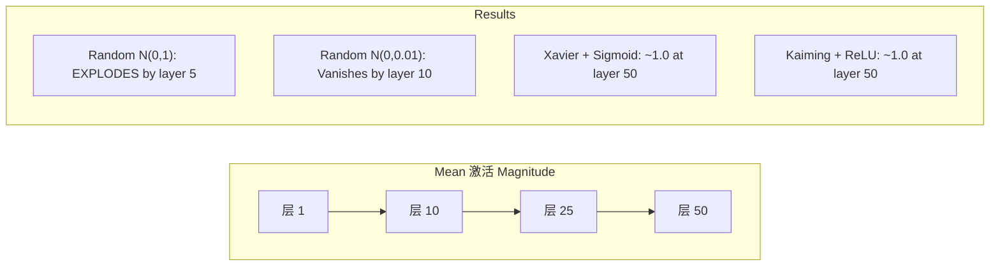
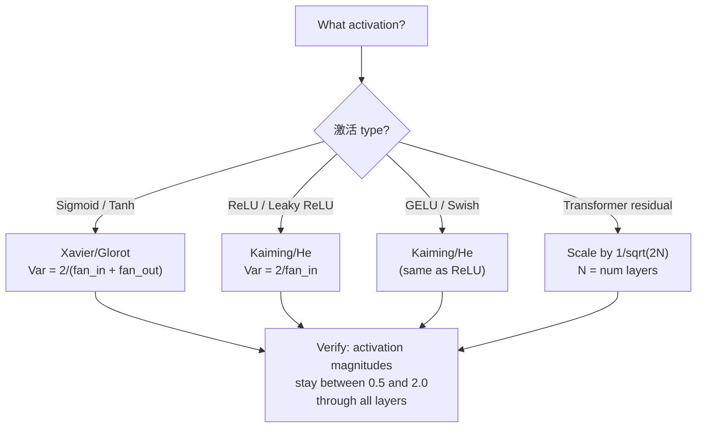

# Weight Initialization 和 训练 Stability

> Initialize wrong 和 训练 never starts. Initialize right 和 50 层 训练 as smoothly as 3.

**Type:** 构建
**Languages:** Python
**Prerequisites:** Lesson 03.04 (激活 Functions), Lesson 03.07 (正则化)
**Time:** ~90 minutes

## 学习目标

- 实现 zero, random, Xavier/Glorot, 和 Kaiming/He initialization strategies 和 measure their effect 在 激活 magnitudes through 50 层
- Derive 为什么 Xavier init uses Var(w) = 2/(fan_in + fan_out) 和 Kaiming uses Var(w) = 2/fan_in
- Demonstrate symmetry 问题 用 zero initialization 和 解释 为什么 random 尺度 alone 是 insufficient
- Match correct initialization strategy 到 激活 函数: Xavier 用于 sigmoid/tanh, Kaiming 用于 ReLU/GELU

## 问题

Initialize all 权重 到 zero. Nothing learns. Every neuron computes same 函数, receives same 梯度, 和 updates identically. After 10,000 轮次, 你的 512-neuron hidden 层 是 still 512 copies of same neuron. 你 paid 用于 512 参数 和 got 1.

Initialize them too large. 激活s explode through network. By 层 10, 值 hit 1e15. By 层 20, they overflow 到 infinity. 梯度s follow same trajectory 在 reverse.

Initialize them randomly 从 a standard normal 分布. Works 用于 3 层. At 50 层, 信号 collapses 到 zero 或 detonates 到 infinity depending 在 whether random 尺度 是 slightly too small 或 slightly too large. 边界 between "works" 和 "broken" 是 razor-thin.

Weight initialization 是 most underrated 决策 在 deep learning. Architecture gets papers. 优化器 get blog posts. Initialization gets a footnote. But get it wrong 和 nothing else matters -- 你的 network 是 dead 之前 训练 begins.

## 概念

### Symmetry Problem

Every neuron 在 a 层 has same structure: multiply 输入 by 权重, 加入 偏置, apply 激活. If all 权重 开始 at same 值 (zero 是 extreme case), every neuron computes same 输出. During 反向传播, every neuron receives same 梯度. During update 步骤, every neuron changes by same amount.

你're stuck. network has hundreds of 参数, but they all move 在 lockstep. 这 是 called symmetry, 和 random initialization 是 brute-force way 到 break it. Each neuron starts at a different point 在 weight space, so each learns a different feature.

But "random" 是 不 enough. *尺度* of randomness determines whether network trains.

### Variance Propagation Through 层

Consider a single 层 用 fan_in 输入:

```
z = w1*x1 + w2*x2 + ... + w_n*x_n
```

If each weight wi 是 drawn 从 a 分布 用 方差 Var(w) 和 each 输入 xi has 方差 Var(x), 输出 方差 是:

```
Var(z) = fan_in * Var(w) * Var(x)
```

If Var(w) = 1 和 fan_in = 512, 输出 方差 是 512x 输入 方差. After 10 层: 512^10 = 1.2e27. Your 信号 has exploded.

If Var(w) = 0.001, 输出 方差 shrinks by 0.001 * 512 = 0.512 per 层. After 10 层: 0.512^10 = 0.00013. Your 信号 has vanished.

goal: 选择 Var(w) so that Var(z) = Var(x). Signal magnitude stays constant across 层.

### Xavier/Glorot Initialization

Glorot 和 Bengio (2010) derived solution 用于 sigmoid 和 tanh 激活s. To keep 方差 constant 在 both forward 和 backward pass:

```
Var(w) = 2 / (fan_in + fan_out)
```

In practice, 权重 是 drawn 从:

```
w ~ Uniform(-limit, limit)  where limit = sqrt(6 / (fan_in + fan_out))
```

或:

```
w ~ Normal(0, sqrt(2 / (fan_in + fan_out)))
```

这 works 因为 sigmoid 和 tanh 是 roughly 线性 near zero, 其中 properly initialized 激活s live. 方差 stays 稳定 through dozens of 层.

### Kaiming/He Initialization

ReLU kills half 输出 (everything negative becomes zero). effective fan_in 是 halved 因为 在 average half 输入 是 zeroed. Xavier init doesn't account 用于 这 -- it underestimates 方差 needed.

He et al. (2015) adjusted formula:

```
Var(w) = 2 / fan_in
```

权重 是 drawn 从:

```
w ~ Normal(0, sqrt(2 / fan_in))
```

factor of 2 compensates 用于 ReLU zeroing half 激活s. Without it, 信号 shrinks by ~0.5x per 层. With 50 层: 0.5^50 = 8.8e-16. Kaiming init prevents 这.

### Transformer Initialization

GPT-2 introduced a different pattern. Residual connections 加入 输出 of each sub-层 到 its 输入:

```
x = x + sublayer(x)
```

Each addition increases 方差. With N residual 层, 方差 grows proportionally 到 N. GPT-2 scales 权重 of residual 层 by 1/sqrt(2N), 其中 N 是 number of 层. 这 keeps accumulated 信号 magnitude 稳定.

Llama 3 (405B 参数, 126 层) uses a similar scheme. Without 这 scaling, residual stream would grow unbounded through 126 层 of attention 和 feedforward blocks.

```mermaid
flowchart TD
    subgraph "Zero Init"
        Z1["层 1<br/>All weights = 0"] --> Z2["层 2<br/>All neurons identical"]
        Z2 --> Z3["层 3<br/>Still identical"]
        Z3 --> ZR["Result: 1 effective neuron<br/>regardless of width"]
    end

    subgraph "Xavier Init"
        X1["层 1<br/>Var = 2/(fan_in+fan_out)"] --> X2["层 2<br/>Signal stable"]
        X2 --> X3["层 50<br/>Signal stable"]
        X3 --> XR["Result: Trains with<br/>sigmoid/tanh"]
    end

    subgraph "Kaiming Init"
        K1["层 1<br/>Var = 2/fan_in"] --> K2["层 2<br/>Signal stable"]
        K2 --> K3["层 50<br/>Signal stable"]
        K3 --> KR["Result: Trains with<br/>ReLU/GELU"]
    end
```



### 激活 Magnitude Through 50 层



### Choosing Right Init



```figure
weight-init-variance
```

## 动手构建

### Step 1: Initialization Strategies

Four ways 到 initialize a weight 矩阵. Each returns a list of lists (a 2D 矩阵) 用 fan_in columns 和 fan_out rows.

```python
import math
import random


def zero_init(fan_in, fan_out):
    return [[0.0 for _ in range(fan_in)] for _ in range(fan_out)]


def random_init(fan_in, fan_out, scale=1.0):
    return [[random.gauss(0, scale) for _ in range(fan_in)] for _ in range(fan_out)]


def xavier_init(fan_in, fan_out):
    std = math.sqrt(2.0 / (fan_in + fan_out))
    return [[random.gauss(0, std) for _ in range(fan_in)] for _ in range(fan_out)]


def kaiming_init(fan_in, fan_out):
    std = math.sqrt(2.0 / fan_in)
    return [[random.gauss(0, std) for _ in range(fan_in)] for _ in range(fan_out)]
```

### Step 2: 激活 Functions

We need sigmoid, tanh, 和 ReLU 到 test each init strategy 用 its intended 激活.

```python
def sigmoid(x):
    x = max(-500, min(500, x))
    return 1.0 / (1.0 + math.exp(-x))


def tanh_act(x):
    return math.tanh(x)


def relu(x):
    return max(0.0, x)
```

### Step 3: 前向传播 Through 50 层

Pass random 数据 through a deep network 和 measure 均值 激活 magnitude at each 层.

```python
def forward_deep(init_fn, activation_fn, n_layers=50, width=64, n_samples=100):
    random.seed(42)
    layer_magnitudes = []

    inputs = [[random.gauss(0, 1) for _ in range(width)] for _ in range(n_samples)]

    for layer_idx in range(n_layers):
        weights = init_fn(width, width)
        biases = [0.0] * width

        new_inputs = []
        for sample in inputs:
            output = []
            for neuron_idx in range(width):
                z = sum(weights[neuron_idx][j] * sample[j] for j in range(width)) + biases[neuron_idx]
                output.append(activation_fn(z))
            new_inputs.append(output)
        inputs = new_inputs

        magnitudes = []
        for sample in inputs:
            magnitudes.append(sum(abs(v) for v in sample) / width)
        mean_mag = sum(magnitudes) / len(magnitudes)
        layer_magnitudes.append(mean_mag)

    return layer_magnitudes
```

### Step 4: Experiment

运行 all combinations: zero init, random N(0,1), random N(0,0.01), Xavier 用 sigmoid, Xavier 用 tanh, Kaiming 用 ReLU. 打印 magnitude at key 层.

```python
def run_experiment():
    configs = [
        ("Zero init + Sigmoid", lambda fi, fo: zero_init(fi, fo), sigmoid),
        ("Random N(0,1) + ReLU", lambda fi, fo: random_init(fi, fo, 1.0), relu),
        ("Random N(0,0.01) + ReLU", lambda fi, fo: random_init(fi, fo, 0.01), relu),
        ("Xavier + Sigmoid", xavier_init, sigmoid),
        ("Xavier + Tanh", xavier_init, tanh_act),
        ("Kaiming + ReLU", kaiming_init, relu),
    ]

    print(f"{'Strategy':<30} {'L1':>10} {'L5':>10} {'L10':>10} {'L25':>10} {'L50':>10}")
    print("-" * 80)

    for name, init_fn, act_fn in configs:
        mags = forward_deep(init_fn, act_fn)
        row = f"{name:<30}"
        for idx in [0, 4, 9, 24, 49]:
            val = mags[idx]
            if val > 1e6:
                row += f" {'EXPLODED':>10}"
            elif val < 1e-6:
                row += f" {'VANISHED':>10}"
            else:
                row += f" {val:>10.4f}"
        print(row)
```

### Step 5: Symmetry Demonstration

Show that zero init produces identical neurons.

```python
def symmetry_demo():
    random.seed(42)
    weights = zero_init(2, 4)
    biases = [0.0] * 4

    inputs = [0.5, -0.3]
    outputs = []
    for neuron_idx in range(4):
        z = sum(weights[neuron_idx][j] * inputs[j] for j in range(2)) + biases[neuron_idx]
        outputs.append(sigmoid(z))

    print("\nSymmetry Demo (4 neurons, zero init):")
    for i, out in enumerate(outputs):
        print(f"  Neuron {i}: output = {out:.6f}")
    all_same = all(abs(outputs[i] - outputs[0]) < 1e-10 for i in range(len(outputs)))
    print(f"  All identical: {all_same}")
    print(f"  Effective parameters: 1 (not {len(weights) * len(weights[0])})")
```

### Step 6: 层-by-层 Magnitude Report

打印 a visual bar chart of 激活 magnitudes through 50 层.

```python
def magnitude_report(name, magnitudes):
    print(f"\n{name}:")
    for i, mag in enumerate(magnitudes):
        if i % 5 == 0 or i == len(magnitudes) - 1:
            if mag > 1e6:
                bar = "X" * 50 + " EXPLODED"
            elif mag < 1e-6:
                bar = "." + " VANISHED"
            else:
                bar_len = min(50, max(1, int(mag * 10)))
                bar = "#" * bar_len
            print(f"  Layer {i+1:3d}: {bar} ({mag:.6f})")
```

## 直接使用

PyTorch provides these as built-在 函数:

```python
import torch
import torch.nn as nn

layer = nn.Linear(512, 256)

nn.init.xavier_uniform_(layer.weight)
nn.init.xavier_normal_(layer.weight)

nn.init.kaiming_uniform_(layer.weight, nonlinearity='relu')
nn.init.kaiming_normal_(layer.weight, nonlinearity='relu')

nn.init.zeros_(layer.bias)
```

When 你 call`nn.Linear(512, 256)`, PyTorch defaults 到 Kaiming uniform initialization. That's 为什么 most 简单 networks "just work" -- PyTorch already made right choice. But 当 你 构建 custom architectures 或 go deeper than 20 层, 你 need 到 understand what's happening 和 potentially override 默认.

For transformers, HuggingFace 模型s typically handle initialization 在 their`_init_weights`method. GPT-2's implementation scales residual projections by 1/sqrt(N). If 你're building a transformer 从零实现, 你 need 到 加入 这 yourself.

## 交付它

这 lesson produces:
- `outputs/prompt-init-strategy.md`-- a prompt that diagnoses weight initialization problems 和 recommends right strategy

## Exercises

1. 加入 LeCun initialization (Var = 1/fan_in, designed 用于 SELU 激活). 运行 50-层 experiment 用 LeCun init + tanh 和 比较 到 Xavier + tanh.

2. 实现 GPT-2 residual scaling: multiply 输出 of each 层 by 1/sqrt(2*N) 之前 adding 到 residual stream. 运行 50 层 用 和 不用 scaling, measure 如何 fast residual magnitude grows.

3. 创建 an "init health 检查" 函数 that takes a network's 层 dimensions 和 激活 type, 然后 recommends correct initialization 和 warns 如果 current init will cause problems.

4. 运行 experiment 用 fan_in = 16 vs fan_in = 1024. Xavier 和 Kaiming adapt 到 fan_in, but random init doesn't. Show 如何 gap between "works" 和 "breaks" widens 用 larger 层.

5. 实现 orthogonal initialization (generate a random 矩阵, compute its SVD, 使用 orthogonal 矩阵 U). 比较 到 Kaiming 用于 ReLU networks at 50 层.

## Key Terms

|Term|What people say|What it actually means|
|------|----------------|----------------------|
|Weight initialization|"Set starting 权重 randomly"|strategy 用于 choosing initial weight 值 that determines whether a network can 训练 at all|
|Symmetry breaking|"Make neurons different"|Using random initialization 到 ensure neurons learn distinct features instead of computing identical 函数|
|Fan-在|"Number of 输入 到 a neuron"|number of incoming connections, which determines 如何 输入 方差 accumulates 在 weighted sum|
|Fan-out|"Number of 输出 从 a neuron"|number of outgoing connections, relevant 用于 maintaining 梯度 方差 during 反向传播|
|Xavier/Glorot init|" sigmoid initialization"|Var(w) = 2/(fan_in + fan_out), designed 到 preserve 方差 through sigmoid 和 tanh 激活s|
|Kaiming/He init|" ReLU initialization"|Var(w) = 2/fan_in, accounts 用于 ReLU zeroing half 激活s|
|Variance propagation|"How signals grow 或 shrink through 层"|mathematical analysis of 如何 激活 方差 changes 层 by 层 based 在 weight 尺度|
|Residual scaling|"GPT-2's init trick"|Scaling residual connection 权重 by 1/sqrt(2N) 到 prevent 方差 growth through N transformer 层|
|Dead network|"Nothing trains"|A network 其中 poor initialization causes all 梯度s 到 be zero 或 all 激活s 到 saturate|
|Exploding 激活s|"Values go 到 infinity"|When weight 方差 是 too high, causing 激活 magnitudes 到 grow exponentially through 层|

## Further Reading

- Glorot & Bengio, "Understanding difficulty of 训练 deep feedforward 神经网络" (2010) -- original Xavier initialization paper 用 方差 analysis
- He et al., "Delving Deep into Rectifiers" (2015) -- introduced Kaiming initialization 用于 ReLU networks
- Radford et al., "Language 模型s 是 Unsupervised Multitask Learners" (2019) -- GPT-2 paper 用 residual scaling initialization
- Mishkin & Matas, "All 你 Need 是 a Good Init" (2016) -- 层-sequential unit-方差 initialization, an empirical alternative 到 analytical formulas
